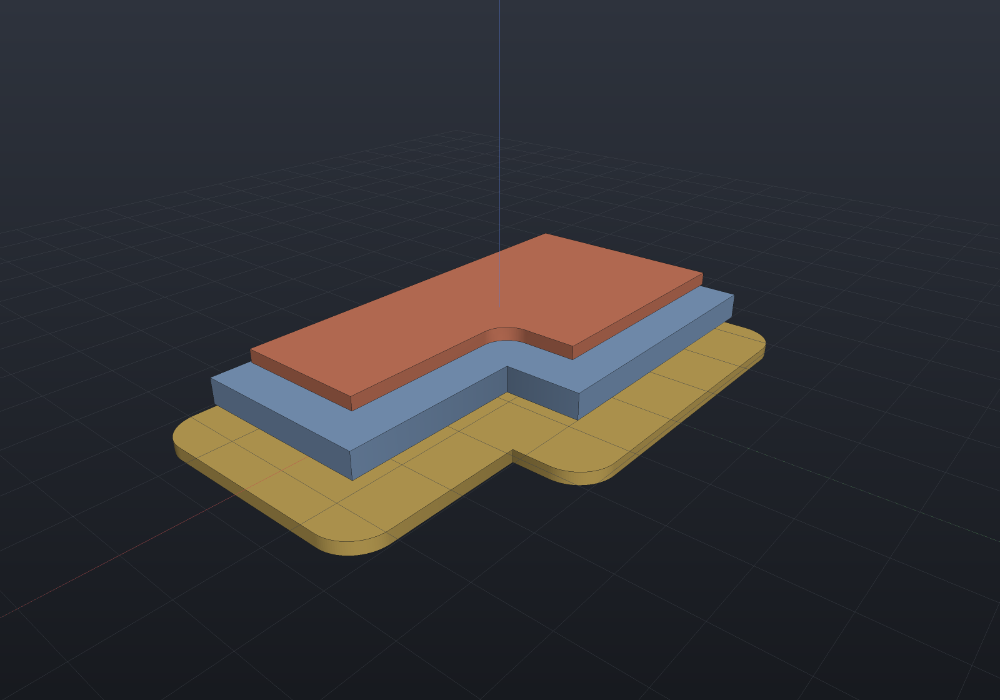
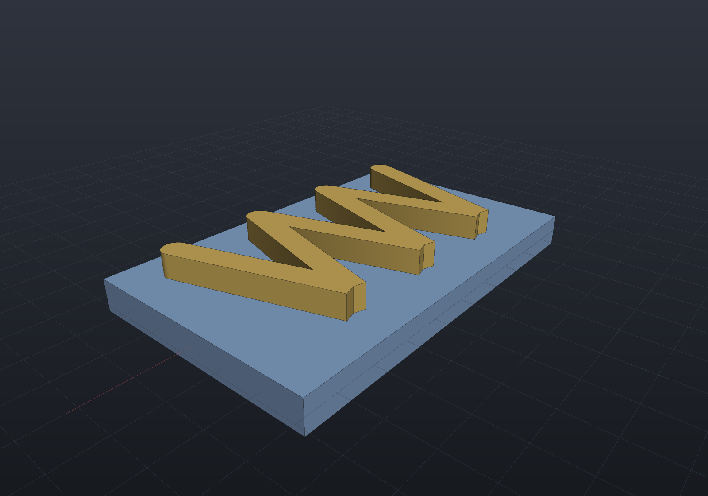
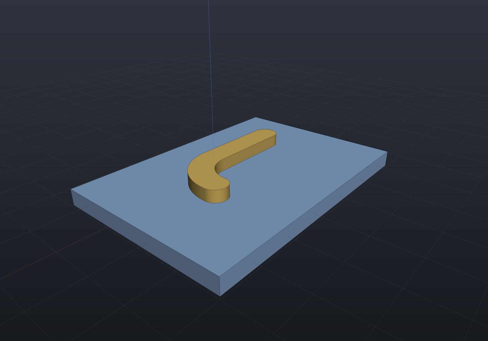
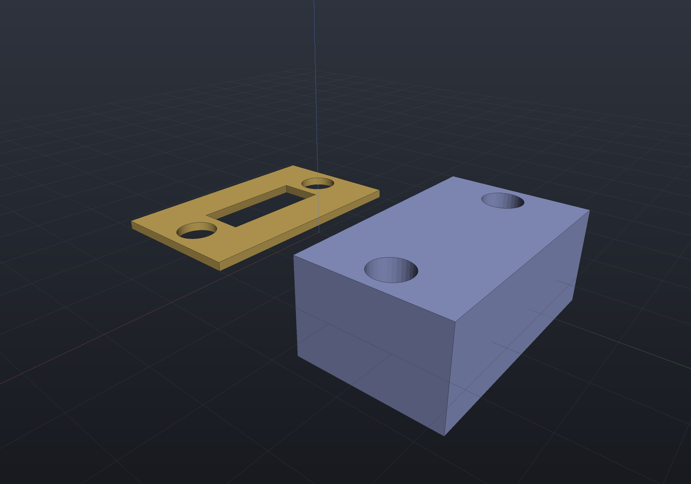
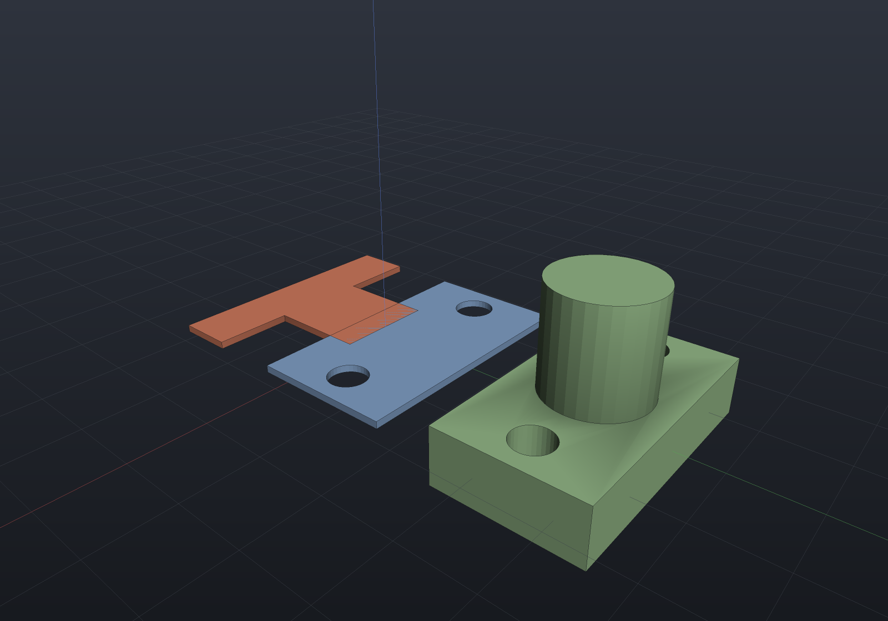
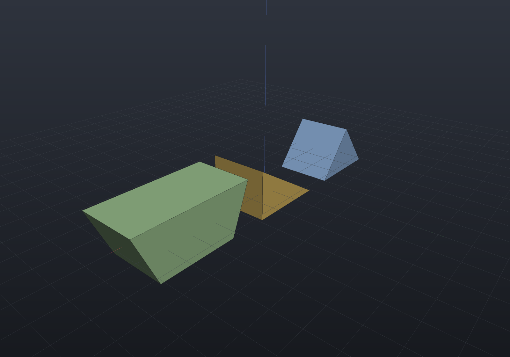

Three operations turn a model back into 2D — and one primitive that only exists
because a 2D profile swept in x is the shape you keep reaching for.

## Offsetting a sketch

`Sketch.Offset(delta, join)` grows (positive) or shrinks (negative) a sketch by a
constant distance: clearance fits, wall shells, pocket stock, cutter compensation.
Corners are closed by the join style — `Round`, `Miter` (degrading to a chamfer past
the miter limit) or `Chamfer`:

```csharp render:sketch-offset
var plate = Sketch.Start(-18, -10).LineTo(18, -10).LineTo(18, 4)
                  .LineTo(4, 4).LineTo(4, 10).LineTo(-18, 10).Close();

Shape Extruded(IReadOnlyList<Region2d> regions, double height)
{
    var (outer, holes) = Profile.FromRegion(regions[0]);
    return Shape.Extrude(outer, Vector3d.UnitZ * height, holes);
}

var scene = new Scene();
scene.Add(new Part("as drawn", Extruded(plate.ToRegions(), 2), Palette.Steel));
scene.Add(new Part("grown 3 (round)", Extruded(plate.Offset(3), 1), Palette.Brass,
    Matrix4d.CreateTranslation((0, 0, -3))));
scene.Add(new Part("shrunk 2", Extruded(plate.Offset(-2), 1), Palette.Coral,
    Matrix4d.CreateTranslation((0, 0, 3))));
```



Offsetting is one algorithm, not two: the outward offset is the region unioned with a
slab per edge and a join per corner, and the **inward** offset is that same dilation
applied to the complement. Self-intersection therefore falls out rather than needing a
cleanup pass — shrink a plate through a narrow neck and you get two regions back, or
none at all if it vanishes. That is why `Offset` returns a *list*.

```csharp run:sketch-offset-splits
// A dumbbell: two 10-wide pads joined by a 3-wide neck. Shrink past the neck and the
// one region becomes two; shrink past the pads and nothing is left.
var bar = Sketch.Start(-15, -5).LineTo(-5, -5).LineTo(-5, -1.5).LineTo(5, -1.5)
                .LineTo(5, -5).LineTo(15, -5).LineTo(15, 5).LineTo(5, 5)
                .LineTo(5, 1.5).LineTo(-5, 1.5).LineTo(-5, 5).LineTo(-15, 5).Close();

if (bar.Offset(-1).Count != 1) throw new Exception("still one piece at -1");
if (bar.Offset(-2).Count != 2) throw new Exception("the 3-wide neck should part at -2");
if (bar.Offset(-6).Count != 0) throw new Exception("nothing should survive -6");
```

## Stroking an open path

`Region2dOffset.Stroke(path, width, cap, join)` sweeps an **open** polyline into a
region of constant width — a toolpath's footprint, a slot from its centre line, an
SVG stroke. Caps are `Butt`/`Round`/`Square`; joins are the same styles as `Offset`,
and because it is the same union-of-primitives construction, self-crossing paths and
doubled-back reversals need no special handling — with round caps and joins the
stroke is exactly the path's Minkowski sum with a disk:

```csharp render:stroke-toolpath
// A zig-zag clearing pass, stroked to the cutter's 3 mm diameter and extruded.
var pass = new List<Vector2d>();
for (int i = 0; i <= 6; i++)
{
    double x = -18 + i * 6;
    pass.Add(new Vector2d(x, i % 2 == 0 ? -10 : 10));
}
var swept = Region2dOffset.Stroke(pass, width: 3);

var scene = new Scene();
scene.Add(new Part("stock", Shape.Box(48, 30, 4), Palette.Steel));
foreach (var (region, i) in swept.Select((r, i) => (r, i)))
{
    var (outer, holes) = Profile.FromRegion(region);
    scene.Add(new Part($"pass {i}", Shape.Extrude(outer, Vector3d.UnitZ * 3, holes)
        .Translate(0, 0, 2), Palette.Brass));
}
```



Closed circuits work by repeating the first point — the stroke then encloses a hole
(one region, one hole), which is how a contour pass differs from a pocket.

### Stroking a CURVED path

`Region2dOffset.Stroke` takes points, so an arc has to be flattened before it reaches
one — and the deficit that leaves is a floor, not a tolerance: no chord count removes
it. `CurvedRegion2dOffset.Stroke(path, width, cap, join)` takes a chain of
`CurvedEdge2d` (lines and arcs) instead and keeps every primitive closed form. An arc's
slab is the **annular sector** between radii `r ± width/2`, a round cap is an exact
half-disc, and a round join an exact sector — so with round caps and joins the result
*is* the path's Minkowski sum with a disc, nothing inscribed, and the swept area of an
arc of radius `r` is exactly `sweep·r·width` plus one disc of radius `width/2`.

Two conveniences ride on the edge vocabulary. A chain that returns to its start is
recognized as a **circuit**, so its closing joint gets a corner join and no caps — where
the repeated-point spelling above cannot claim one, and a butt-capped closed polyline is
short by exactly that corner. And when `width/2` reaches the arc's own radius the band
swallows the centre, which is handled exactly rather than refused: the slab becomes the
pie sector of radius `r + width/2`.

```csharp render:stroke-curved
// A slot whose centre line is a straight run into a quarter turn: stroked to width and
// extruded through an exact profile, so the ends and the bend stay true arcs.
var centreLine = new[]
{
    CurvedEdge2d.Line((-20, 0), (0, 0)),
    CurvedEdge2d.Arc((0, 10), 10, -Math.PI / 2, Math.PI / 2),
};
var swept = CurvedRegion2dOffset.Stroke(centreLine, width: 6);

var scene = new Scene();
scene.Add(new Part("plate", Shape.Box(64, 44, 4).Translate(-4, 6, 0), Palette.Steel));
foreach (var (region, i) in swept.Select((r, i) => (r, i)))
{
    var (outer, holes) = Profile.FromCurvedRegion(region);
    scene.Add(new Part($"slot {i}", Shape.Extrude(outer, Vector3d.UnitZ * 3, holes)
        .Translate(0, 0, 2), Palette.Brass));
}
```



## Section: `projection(cut = true)`

`Shape.Section(plane)` is the cross-section — the drawing-view section, and OpenSCAD's
`projection(cut = true)`. Cavities become holes automatically, including one with no
opening to the outside at all:

```csharp render:planar-section
// Two through-bores and a SEALED internal cavity: a cylinder short enough that it never
// reaches an end face, so the solid has a void with no opening at all.
var block = Shape.Box(40, 24, 16)
    .Drill(StandardHoles.Clearance(6), [new(-15, 0), new(15, 0)], depth: 20,
           SketchPlane.At((0, 0, 8), Vector3d.UnitX, Vector3d.UnitY))
    - Shape.Cylinder(4, 20).Rotate(Vector3d.UnitY, Math.PI / 2);

// Slice at z = 0 and re-extrude the section as a thin plate to show what came back.
var slice = block.Section(SketchPlane.At((0, 0, 0), Vector3d.UnitX, Vector3d.UnitY));

var scene = new Scene();
scene.Add(new Part("block", block, Palette.Slate, Matrix4d.CreateTranslation((0, 26, 0))));
foreach (var (region, i) in slice.Select((r, i) => (r, i)))
{
    var (outer, holes) = Profile.FromRegion(region);
    scene.Add(new Part($"section {i}", Shape.Extrude(outer, Vector3d.UnitZ * 1.5, holes),
        Palette.Brass, Matrix4d.CreateTranslation((0, -14, 0))));
}
```



When the shape lowers to B-Rep the section is taken from the **exact** surfaces, so its
fidelity is set by the chord tolerance alone — a bore rim is as round as you ask for,
not as round as the display mesh happens to be. Shapes with no B-Rep form fall back to
the mesh.

A plane flush with a face, or containing an edge, is refused: a section that runs
*along* a face is an area, not a curve. Move the plane a fraction.

### `SectionExact`: the same section without the flattening

`Shape.SectionExact(plane)` returns [`CurvedRegion2d`](sketching.md)s instead, so a bore's
rim is **one arc** rather than however many chords a tolerance asked for — which is what a
DXF `CIRCLE` entity, an SVG `A` command and `Sketch.FromCurvedRegion` all want. It is the
same pipeline: the same edge crossings, the same containment probes, the same chaining,
with only the emit differing.

```csharp run:planar-section-exact
var plate = Shape.Box(60, 40, 10)
    .Drill(HoleSpec.Simple(8), [new(-15, 0), new(15, 0)], depth: 20,
           SketchPlane.At((0, 0, 5), Vector3d.UnitX, Vector3d.UnitY));
var mid = SketchPlane.At((0, 0, 0), Vector3d.UnitX, Vector3d.UnitY);

var exact = plate.SectionExact(mid);
double area = exact.Sum(r => r.Area);
double truth = 60.0 * 40 - 2 * Math.PI * 16;      // πr² per bore, exactly
if (Math.Abs(area - truth) > 1e-9)
    throw new Exception("an exact section is the closed form");

// The flattened route leaves an inscribed polygon, which is a FLOOR rather than a
// tolerance: it is over by the n-gon's own deficit however fine the chords get.
if (!(plate.Section(mid).Sum(r => r.Area) > truth))
    throw new Exception("an inscribed polygon leaves more material than the circle");
```

What it cannot express exactly it **flattens rather than refusing**: an oblique plane
through a cylinder cuts an ellipse, which the curved 2D tier deliberately does not carry,
and a traced intersection is a polyline to begin with. So a mixed section is honest, and
its exact halves stay exact. `Silhouette` has no such mode at all, and that is structural:
it is the union of projected *triangles*, so there is nothing exact to recover.

## Silhouette: `projection(cut = false)`

`Shape.Silhouette(plane)` is the outline the shape casts along the plane's normal — the
shadow, not the slice. A through hole survives as a hole; a blind pocket does not,
because there is material in front of it:

```csharp render:planar-silhouette
var bracket = Shape.Box(36, 20, 8)
    .Drill(StandardHoles.Clearance(5), [new(-13, 0), new(13, 0)], depth: 12,
           SketchPlane.At((0, 0, 4), Vector3d.UnitX, Vector3d.UnitY))
    | Shape.Cylinder(7, 18).Translate(0, 0, 9);

var scene = new Scene();
scene.Add(new Part("bracket", bracket, Palette.Sage, Matrix4d.CreateTranslation((0, 34, 0))));

void AddOutline(string name, SketchPlane plane, PartColor color, Vector3d at)
{
    foreach (var (region, i) in bracket.Silhouette(plane).Select((r, i) => (r, i)))
    {
        var (outer, holes) = Profile.FromRegion(region);
        scene.Add(new Part($"{name} {i}", Shape.Extrude(outer, Vector3d.UnitZ * 1, holes),
            color, Matrix4d.CreateTranslation(at)));
    }
}

AddOutline("top", SketchPlane.XY, Palette.Steel, (0, 6, 0));    // bores survive
AddOutline("front", SketchPlane.XZ, Palette.Coral, (0, -18, 0)); // boss appears, bores do not
```



The two views say different things, and both are right. Looking **down**, the bores go
all the way through, so they survive as holes and the boss adds nothing (it sits inside
the plate's footprint). Looking from the **front**, the boss becomes the stem of a T —
and the bores vanish, because along that direction there is material in front of them.

A silhouette is the union of every front-facing projected triangle, so it is a *mesh*
result — its fidelity is the mesh's, and a finer mesh costs more union work. The unions
are folded through a balanced tree over Morton-sorted faces, which is not a
micro-optimization: on a 64-segment torus that is 67 ms against 2.4 s for the same tree
unsorted and 259 s accumulated linearly. Merging face 1 with face 900 produces two
disjoint regions and cancels nothing.

## The wedge primitive

`Shape.Wedge(sizeX, sizeY, sizeZ, topX, topOffsetX)` is OCCT's `BRepPrimAPI_MakeWedge`
and the last primitive OpenSCAD reaches for `polyhedron` to build. The base is
`sizeX × sizeY`; the top keeps the same y but is `topX` wide, centred at `topOffsetX`:

```csharp render:wedge
var scene = new Scene();
scene.Add(new Part("chisel", Shape.Wedge(16, 12, 10), Palette.Steel,
    Matrix4d.CreateTranslation((-22, 0, 0))));
scene.Add(new Part("ramp", Shape.Wedge(16, 12, 10, topX: 0, topOffsetX: 8), Palette.Brass));
scene.Add(new Part("dovetail", Shape.Wedge(16, 12, 10, topX: 24), Palette.Sage,
    Matrix4d.CreateTranslation((24, 0, 0))));
```



`topX: 0` gives a sharp top edge; moving it over one side with `topOffsetX: ±sizeX/2`
gives the classic ramp (a right triangular prism); a `topX` larger than `sizeX` gives a
dovetail rail. The taper is in x only — a solid tapering in *both* directions is a loft,
not a wedge.

A wedge **is** an extrusion (a trapezoidal cross-section swept along y), so it carries
one internally and every lowering delegates to it. That is why it is native in all three
representations for free, and exact under any affine transform.

## Exactness

Most of this page is polygonal: the `Region2d` arrangement the boolean runs on carries
segments, not arcs, so curves reach it flattened at a chord tolerance. A circle offset
outward by `d` then lands just *inside* π(r+d)² — round joins are inscribed arcs,
matching `Sketch.ToRegions`'s one-sided contract, so errors never accumulate in the
unsafe direction.

The **curved tier** removes that step where the geometry is lines and arcs.
`CurvedRegion2d` and its arrangement carry arcs unflattened, so a disc measures exactly
πr², `CurvedRegion2dBoolean` returns arcs, `CurvedRegion2dOffset`'s round joins are
exact sectors, and `Profile.FromCurvedRegion` turns the result into analytic arcs
rather than chords — an extruded sketch boolean becomes an exact B-Rep instead of a
prism of chords. From the `Sketch` API the entry points are `UnionExact`,
`IntersectExact`, `SubtractExact` and `OffsetExact`. What the tier does **not** carry is
Béziers and general NURBS: they are still flattened at the entry points, stated in the
API contract rather than hidden, because the cell walk's tangent-plus-curvature
tie-break is decidable for lines and circles and not for a third shape.
