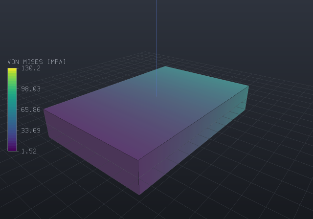
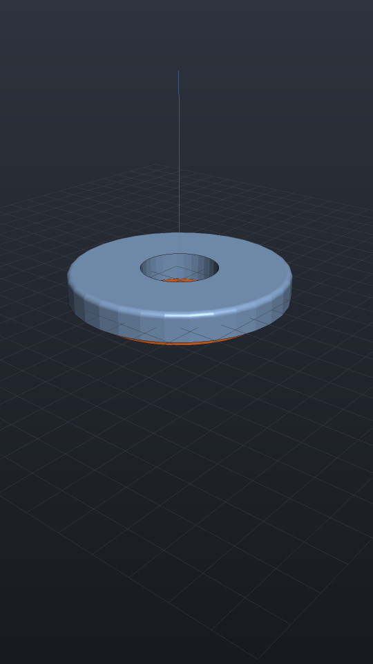
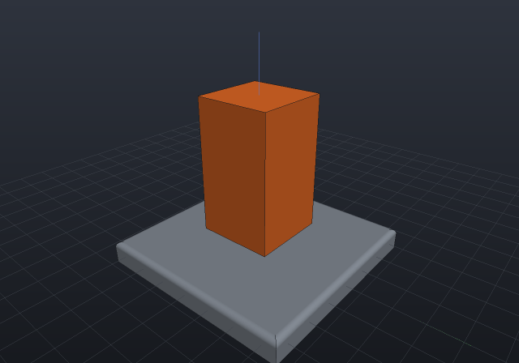
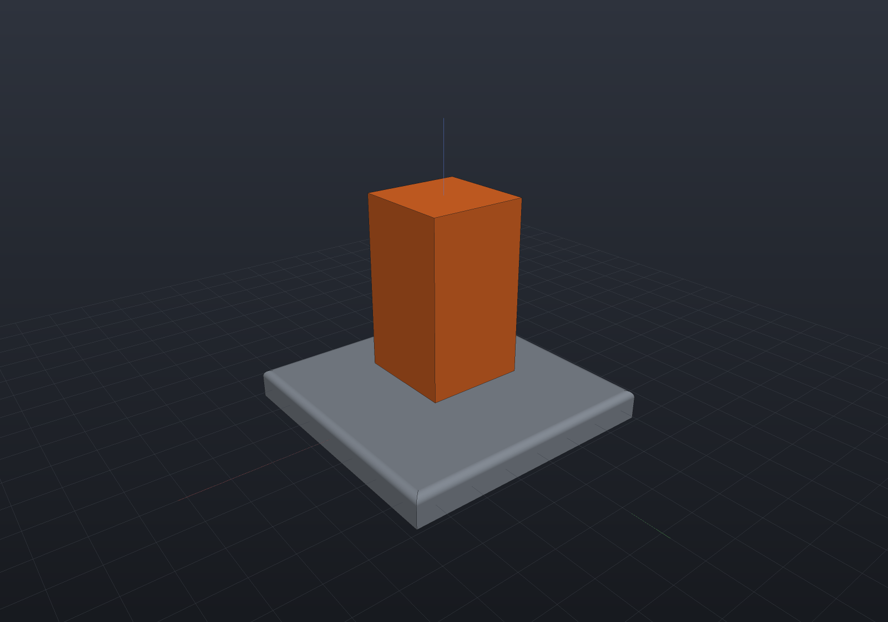
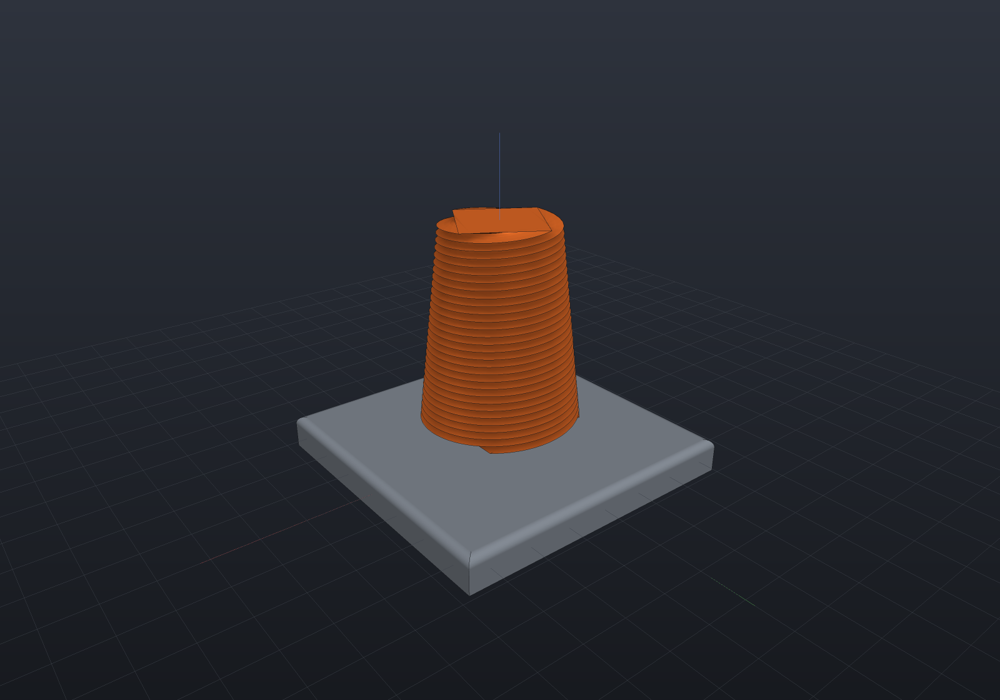
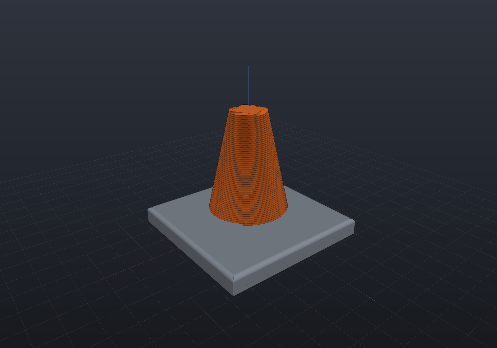

Four different things want to animate — a **mechanism** driven through its range, an
**assembly** moving between assembled and exploded, a **simulation result** ramping
under its load, and the **camera** — and they are the same problem, because all four
are pure functions of one parameter that move *poses, one scalar and the camera only*.
That is the load-bearing rule: **an animation never touches geometry**. Tracks return
matrices over a fixed instance list (count and order independent of t), a camera pose,
or a number — never a re-meshed part — so a viewer animates with matrices and uniforms
alone and picking keeps working.

An `Animation` is a duration, an easing, and up to three tracks — one posing the
scene's instances, one moving the camera, one scaling a displayed result's deformation —
each with its own window on the shared timeline. `Animation.At(t)` is a **pure function
of t ∈ [0, 1]**: scrubbing in the viewer, playing, and every export format evaluate the
same function.

The images on this page are **APNGs produced by the docs build itself** — lossless,
full colour, and served as `.png` because an APNG *is* one. (`RenderGif` exists too,
because GIF pastes everywhere — but a shaded render **will band** in GIF's 256
colours, and dithering would fight the clean look; if you need a GIF, a
`ViewStyle.Wireframe` or flat-shaded clip survives quantization far better. There is
also always `RenderFrames`, the numbered-PNG escape hatch into ffmpeg for MP4/WebM.)

## Turntable

The camera move everyone wants first: orbit about Z at fixed pitch. Whole turns loop
seamlessly under the default linear easing, because frame t = 1 lands exactly on
frame t = 0:

```csharp animate:animate-turntable frames:36
var top = SketchPlane.At((0, 0, 2.5), Vector3d.UnitX, Vector3d.UnitY);
var plate = Shape.Box(36, 24, 5)
    .Drill(StandardHoles.Clearance(5),
        [new(-14, -8), new(14, -8), new(-14, 8), new(14, 8)], depth: 7, top);
var boss = Shape.Cylinder(6, 10) - Shape.Cylinder(2.6, 14);

var scene = new Scene();
scene.Add(new Part("plate", plate, Palette.Steel, Matrix4d.CreateTranslation((0, 0, 2.5))));
scene.Add(new Part("boss", boss, Palette.Brass, Matrix4d.CreateTranslation((0, 0, 10))));

var animation = new Animation(durationSeconds: 6)
    .With(TurntableTrack.Around(scene));
```


Exporting the same animation from your own code is one call — the window's playback
(below) and this file render the identical frames:

```csharp
animation.RenderApng(scene, "turntable.png", frames: 48);
```

Every export renders the whole clip through **one** offscreen context, with one set of
linked shader programs and one set of uploaded buffers: only the per-instance matrices
move between frames, which is exactly what "an animation never touches geometry" buys
you. Measured on a 24-frame 480x360 export of a four-part exploding assembly, that is
**1069 ms down to 165 ms (6.5x)** against a context per frame — and the batched pixels
are asserted byte-identical to the per-frame path, because a speed claim about a
renderer is worth nothing without the picture beside it.

## One instant as a still

Sometimes you want a frame, not a clip — a figure of the mechanism at its half-stroke,
or an assistant asking "what does it look like at t = 0.3":

```csharp
EngrCad.RenderToImage(scene, animation, t: 0.3, "half-open.png");
```

This is the same pure `Animation.At(t)`, so the still, a scrubbed viewport and frame
⌊t·N⌋ of the APNG are the same picture. The camera follows the clip's own rule — the
animation's camera track first, then an explicit `camera:`, then the framing over the
union of the first and last frames' bounds, never a per-t framing that would make a
series of stills jump. The [MCP server](mcp.md)'s `screenshot` tool takes the same `t`,
through the same `EngrCad.PoseAt` seam.

## A mechanism running

A `MotionStudy` — the recorded output of `Mechanism.Sweep` — is already the
animation input format: pure poses per sampled frame. `MechanismTrack` plays one
back, returning the recorded frames **verbatim at their sample points** and rigidly
interpolating between them (never re-solving: solving at an arbitrary t from an
arbitrary seed is exactly the branch-flipping trap the sweep's continuation exists
to avoid). Grafted onto a scene, instances outside the mechanism keep their poses:

```csharp animate:animate-fourbar frames:36
// The four-bar from the mechanisms page: crank 15, coupler 40, rocker 30 on a
// 45 ground span (Grashof — the crank turns full circles).
Part Bar(string name, double length, double z, PartColor color) => new(name,
    Shape.Extrude(Sketch.Slot(length + 8, 8), 2.5).Translate(length / 2, 0, z), color);

var rig = new Assembly("linkage");
var frame = rig.Add(Bar("frame", 45, -3.2, Palette.Slate));
var crank = rig.Add(Bar("crank", 15, 0, Palette.Coral));
var coupler = rig.Add(Bar("coupler", 40, 2.7, Palette.Sage));
var rocker = rig.Add(Bar("rocker", 30, 5.4, Palette.Sky));

Frame3d Posed(double x, double y, double angle) => Frame3d.FromXY((x, y, 0),
    (Math.Cos(angle), Math.Sin(angle), 0), (-Math.Sin(angle), Math.Cos(angle), 0));
crank.Frame = Posed(0, 0, 0);
coupler.Frame = Posed(15, 0, 0.84);
rocker.Frame = Posed(45, 0, 1.68);

var z = Vector3d.UnitZ;
var crankPin = Joint.Revolute(
    MateGeometry.Axis(frame, (0, 0, 0), z), MateGeometry.Axis(crank, (0, 0, 0), z), "crank pin");
var mechanism = new Mechanism(rig)
    .Ground(frame)
    .Add(crankPin)
    .Add(Joint.Revolute(MateGeometry.Axis(crank, (15, 0, 0), z), MateGeometry.Axis(coupler, (0, 0, 0), z)))
    .Add(Joint.Revolute(MateGeometry.Axis(coupler, (40, 0, 0), z), MateGeometry.Axis(rocker, (30, 0, 0), z)))
    .Add(Joint.Revolute(MateGeometry.Axis(frame, (45, 0, 0), z), MateGeometry.Axis(rocker, (0, 0, 0), z)));
mechanism.Assemble();

var scene = new Scene();
scene.AddTab("linkage").Add(rig);

// One full crank cycle, 37 recorded poses; the track interpolates between them.
var study = mechanism.Sweep(MechanismDriver.Angle(crankPin), 0, 2 * Math.PI, frames: 37);
if (!study.Completed) throw new Exception(study.ToString());

var animation = new Animation(durationSeconds: 4)
    .With(new MechanismTrack(study, scene));
```


A study that stalls (a dead centre, a joint stop) animates what it recorded —
honestly ending where the sweep did, with the diagnostics naming why.

### What the frame count can misreport

A linkage's bars have no periodic detail, so a four-bar reads correctly at any
frame count. **A gear train does not**, and the failure is not cosmetic: teeth
are a periodic pattern, so a clip whose frames advance more than half a tooth
pitch aliases, and the apparent speed a viewer reads off it is not the speed the
mechanism has. The [planetary clip](gears.md#running-it) records the measurement
— the seamless-looping 120° version puts a planet at 1.08 tooth pitches per
frame, which aliases to a slow forward creep and makes the sun look *slower* than
the carrier it drives at 3.5×. The clip therefore runs 30° and does **not** loop,
because the honest reading beat the seamless one.

That is the same family as `DeformationTracks.Oscillate`'s caveat below: a
clip's timing is a viewing parameter, and a figure that quietly rescales it is a
figure that lies. The rule that generalizes: **check the fastest periodic detail
in the scene against the frame step before choosing a clip length**, and where
the two cannot both be had, state which one you gave up.

## A sequenced explode

The exploded view is already a pure function of a factor
(`Occurrence.ExplodeOffset` × t). `ExplodeTrack` animates it, and
`Stagger(occurrence, start, end)` gives each occurrence its own **timing window**
along the track — the assembly-instructions look, where fasteners back out first and
the cover lifts after:

```csharp animate:animate-explode frames:30
var housingTop = SketchPlane.At((0, 0, 10), Vector3d.UnitX, Vector3d.UnitY);
var coverTop = SketchPlane.At((0, 0, 13), Vector3d.UnitX, Vector3d.UnitY);
Vector2d[] pattern = [new(-15, -9), new(15, -9), new(-15, 9), new(15, 9)];

var housing = new Part("housing", Shape.Box(40, 28, 10).Translate(0, 0, 5)
    .Drill(StandardHoles.Tapped(4), pattern, depth: 8, housingTop), Palette.Slate);
var cover = new Part("cover", Shape.Box(40, 28, 3).Translate(0, 0, 11.5)
    .Drill(StandardHoles.Clearance(4), pattern, depth: 5, coverTop), Palette.Sky);
var pin = new Part("pin", Shape.Cylinder(1.6, 11).Translate(0, 0, 7.5), Palette.Steel);

var stack = new Assembly("stack");
stack.Add(housing);
var coverOn = stack.Add(cover);
var pins = pattern
    .Select(at => stack.Add(pin, Frame3d.FromXY((at.X, at.Y, 0), Vector3d.UnitX, Vector3d.UnitY)))
    .ToList();

// Designed offsets (AutoExplode could derive them; explicit is clearer here).
coverOn.ExplodeOffset = new Vector3d(0, 0, 18);
foreach (var p in pins)
    p.ExplodeOffset = new Vector3d(0, 0, 34);

var scene = new Scene();
scene.AddTab("stack").Add(stack);

// Pins back out over the first 60% of the track; the cover lifts over the last 50%.
var track = new ExplodeTrack(scene, deriveOffsets: false);
foreach (var p in pins)
    track.Stagger(p, 0.0, 0.6);
track.Stagger(coverOn, 0.5, 1.0);

var animation = new Animation(durationSeconds: 5, AnimationEasing.Smoothstep)
    .With(track);
```


Outside its window an occurrence **holds** its boundary factor (exactly 0 before —
bit-for-bit the assembled pose — and exactly 1 after), so windows sequence rather
than snap. The instance count and order never change with t, which is what lets the
viewer animate with `SetInstancePoses` matrices alone.

## A structural result under load

A [deformed-shape plot](fields.md) looks like the one thing this page says an animation
must never do — new vertex positions every frame. It is not, and the reason is worth
stating because it is what makes the feature cheap: the displacement field is sent
**once** as a vertex attribute, and the vertex shader applies
`position + uDeformScale * displacement`. So a whole result animation changes **one float
uniform per frame** — no buffer touched, nothing re-uploaded, the instance list untouched.
`DeformationTrack` is that uniform on the timeline.

`DeformationTracks.LoadRamp()` runs 0 → 1 → 0: the load applied and released.

```csharp animate:animate-load-ramp frames:20
var bracket = Shape.Box(60, 40, 10)
    .Subtract(Shape.Cylinder(6, 40).Translate(0, 0, -20));
var part = new Part("bracket", bracket, Palette.Steel);

var surface = part.GetMesh();
var tets = TetMesher.Mesh(surface, new TetMeshOptions
{
    RefineQuality = true,
    MaxElementSize = 14,     // coarse on purpose - this page is a picture, not a study
});

var model = new StructuralModel(AnalysisMesh.Quadratic(tets), Materials.Aluminium6061);
model.Fix(Facets.OnPlane(new Vector3d(-30, 0, 0), Vector3d.UnitX));
model.Force(Facets.OnPlane(new Vector3d(30, 0, 0), Vector3d.UnitX), new Vector3d(0, 0, -1200));

var results = StructuralSolver.Solve(model);
foreach (var field in results.SampleOnto(surface))
    part.AddResult(field);

part.FieldDisplay = new FieldDisplay
{
    Field = StructuralResults.FieldNames.VonMises,
    Deform = StructuralResults.FieldNames.Displacement,
    DeformScale = 60,
};

var scene = new Scene();
scene.Add(part);

var animation = new Animation(durationSeconds: 3)
    .With(DeformationTracks.LoadRamp());
```



**For a linear solve those intermediate frames are not a tween — they are the answers.**
A linear result scales exactly with the load, so the frame at factor 0.5 is the real
displacement and the real stress for half the load, not an interpolation between two
computed states. That is what separates this from a cosmetic wobble, and it is worth
saying out loud when the solve is *not* linear (contact, plasticity, large deflection):
the shape still scales on screen, but only the endpoint was solved and the frames between
are illustration.

The legend follows: its title reads `60X DEFORMED` at the peak and half that halfway up
the ramp, because a bar stating an exaggeration the frame was not drawn at is exactly the
lie the title exists to prevent.

### Mode shapes

`DeformationTracks.Oscillate(amplitude, cycles)` swings the same uniform through
`±amplitude` — which **is** the mode-shape animation, because vibrating in a mode is that
mode's shape times `cos(ωt)`. Point a part's `FieldDisplay.Deform` at a mode's
displacement result, and use a small `cycles` (2 or 3 reads well).

> [!IMPORTANT]
> **Use a fixed small `cycles`, and state the slowdown. Do not compute
> `cycles = frequency × duration`.** That formula is dimensionally correct and produces
> nonsense for every real part, which is what makes it worth warning about: a steel blade
> 80 mm long and 6 mm thick has a first bending mode near **780 Hz**
> (`f₁ = (1.875²/2π)·√(EI/ρAL⁴)`), so a two-second clip at true speed would need ~1 570
> cycles — hundreds per rendered frame. That aliases into noise or a stationary blur, and
> no frame rate fixes it, because the mode is genuinely faster than video.
>
> Stiff metal parts run from hundreds of hertz to tens of kilohertz; the structures slow
> enough to animate at true speed are things like tall buildings. So the honest caption
> says the playback is slowed **and by how much**: two cycles over a two-second clip
> against 780 Hz is roughly **780× slow motion**. A modal result reports each mode's
> frequency and period, so a page can compute that factor rather than transcribe it.

> [!NOTE]
> **A mode shape has no physical amplitude, and its sign is a convention.** What is
> physical is the *shape* and the *frequency*; the published field is scaled so its
> largest nodal displacement is one model unit and given a deterministic sign so a
> re-solve reproduces it. The animation's amplitude and phase are therefore display
> choices, not predictions — say so on any figure that carries them.
>
> One more, because it is measurable rather than philosophical: a mode's **direction** is
> only well defined when its frequency is *simple*. On a symmetric part (a square shaft,
> a round rod) the two bending modes are degenerate, and a solver returns an arbitrary
> orthonormal basis of that eigenspace — so "mode 1" animates one valid member of a
> family rather than *the* mode.
>
> Taken together those are four caveats, and the **playback rate** is the one an engineer
> is most likely to be misled by: arbitrary amplitude and sign are things people half
> expect, whereas "the animation runs at the mode's frequency" sounds exactly like
> something a solver would arrange, so a viewer will believe it unless told otherwise.

### What deliberately does not follow

Two things stay put while the factor moves, both for the same reason — they are not
uniforms:

- **Picking.** A pick is answered by a BVH over triangles, which cannot be a uniform, so
  it is built once at the part's *own* `DeformScale`. A click is exact on a static plot
  and at a load ramp's peak, and off by the difference in exaggeration in between.
  Rebuilding a spatial index per frame is precisely the cost this design avoids.
- **The feature-edge overlay.** A part carrying a displacement draws none at any factor,
  since those exact B-Rep edges describe geometry that has moved — and deciding it per
  frame would make the draw list depend on t, which is what lets a whole clip reuse one
  upload. So the factor-0 frame is the undeformed *shape* without the undeformed part's
  chrome; it is not the same picture as a still of a part whose own scale is 0.

## Reels and Shorts

`ReelExport.RenderReel` is the social-video preset: a frame sequence at the platform's
size and rate, framed **into its safe area** (both portrait platforms overlay roughly
the bottom 15% with captions and the right edge with the like/share rail — a model
framed to the full frame is a model partly under UI), with the platform's duration cap
enforced as a **refusal that names the platform** rather than a silent trim. The
platforms want MP4/H.264, and the honest dependency-free route is the frame sequence
plus ffmpeg — so the result carries the exact command:

```
ffmpeg -framerate 30 -i frame-%04d.png -c:v libx264 -pix_fmt yuv420p -vf "scale=1080:1920" reel.mp4
```

```csharp render:reel-poster
var scene = new Scene();
var flange = Shape.Cylinder(40, 10) - Shape.Cylinder(14, 30);
var body = new Part("flange", flange.Fillet(2, s => s.PlanarFacesWithNormal(Vector3d.UnitZ)));
scene.Add(body);
scene.Add(new Part("plate", Shape.Cylinder(34, 4).Translate(0, 0, -7), new PartColor(0.94f, 0.44f, 0.16f)));

// The portrait framing: every corner of the model's bounds projects INSIDE the safe
// rectangle, filling it on the binding axis and centred in it — which for an
// asymmetric safe area puts the model up and left of the frame centre.
var format = ReelFormat.InstagramReel;
var camera = ReelFraming.CameraFor(scene.Instances()
    .Select(i => i.Bounds()).Aggregate(Aabb.Empty, (a, b) => a.Union(b)), format);

// A clip past the cap refuses by name, before a frame is spent.
try
{
    new Animation(120).With(new ExplodeTrack(scene)).RenderReel(scene, ".", format);
    throw new Exception("a 120 s Reel must refuse");
}
catch (ArgumentException e) when (e.Message.Contains("Instagram Reel")) { }

var renderSize = (540, 960);   // the docs figure renders at the format's own 9:16
```



The result also carries the **aliasing measurement**: the fastest per-frame body
rotation, read at *half steps* because a frame-to-frame matrix delta folds at π — a
4.2 rad step and a −2.1 rad step are the same matrix, so a whole-step reading could
never see past Nyquist (`RenderReel` refuses at π, where even the direction of
rotation is unrepresentable, and `SlowdownFactorFor` gives the caption number when a
mechanism is deliberately shown slowed). The measure is body-level, honestly:
tooth-level detail aliases far earlier — a tooth's period is a pitch, not a turn —
which is [the gear-clip lesson](gears.md), and only the caller knows a tooth count.
`RenderReelPoster` writes one still with the safe rectangle drawn over it, the
proofing aid that shows where the captions land before ninety frames are spent.

## Playing in the viewer

Give the window the animation and the toolbar grows a transport — Play/Pause, Loop,
and a scrubber:

```csharp
EngrCad.Configure()
    .WithAnimation(scene => new Animation(durationSeconds: 6)
        .With(TurntableTrack.Around(scene)))
    .Run(args, BuildScene);
```

The factory runs per scene — including per hot reload, so tracks always reference
the freshly built occurrences. Scrubbing evaluates the same `Animation.At(t)` an
export renders: what you see on the slider is what the APNG will contain.

## Camera tracks

Beyond the turntable: `KeyframedCameraTrack` interpolates poses with the view cube's
transition feel (per-segment smoothstep, and yaw always takes the **shortest angular
path** — the same primitive the cube's 250 ms moves use), and `FlyThroughTrack`
moves the eye along any `Curve3d` (a `NurbsCurve.InterpolatePoints` through
waypoints is the usual spelling), looking along the tangent or at a fixed point.
The orbit camera is Z-up, so a path frame's roll is deliberately dropped.

```csharp run:animate-camera-tracks
var keyframed = new KeyframedCameraTrack(
[
    new CameraKeyframe(0.0, new CameraState(0.7, 0.45, 60, (0, 0, 5))),
    new CameraKeyframe(0.5, new CameraState(2.2, 0.9, 40, (0, 0, 5))),
    new CameraKeyframe(1.0, new CameraState(-0.6, 0.2, 70, (0, 0, 5))),
]);
var path = NurbsCurve.InterpolatePoints([(60, 0, 20), (40, 40, 30), (0, 55, 12), (-45, 30, 25)]);
var fly = new FlyThroughTrack(path, lookAhead: 25, lookAt: new Vector3d(0, 0, 0));

// Both are pure functions of t; sample them anywhere.
var pose = fly.CameraAt(0.5);
if (pose.Distance != 25) throw new Exception("lookAhead is the orbit distance");
```


## `$t` — when the model itself changes shape

Everything above moves poses, a camera, one scalar or the clip planes, and that is what
makes it cheap. OpenSCAD's `$t` is the other thing: a model whose **geometry** is a
function of time — a spring compressing, a bellows folding, a parametric sweep played as
a clip. It cannot be a track, because a track that returned new meshes would break the
rule this whole page rests on. It is a `Func<double, Scene>` you **bake**.

```csharp animate:animate-morphing-column frames:24
// The static half is HOISTED — built once, captured — because that object identity is
// exactly what the bake's cache keys on.
var plate = Shape.Box(70, 70, 8).Fillet(2, s => s.PlanarFacesWithNormal(Vector3d.UnitZ));

Func<double, Scene> timeVaryingModel = t =>
{
    var s = new Scene();
    s.Add(new Part("plate", plate, new PartColor(0.55f, 0.58f, 0.62f)));
    // The column genuinely changes shape: it twists through a quarter turn and tapers.
    s.Add(new Part("column",
        Shape.Extrude(Sketch.Rectangle(26, 26), height: 46,
                twist: 90 * t, scale: 1 - 0.55 * t, slices: 48)
             .Translate(0, 0, 8),
        new PartColor(0.94f, 0.44f, 0.16f)));
    return s;
};

var scene = timeVaryingModel(0);   // the page's fallback still, and what a browser would run
```



**24 frames, one shot — it does not loop.** The column at t = 1 is a different solid
from the column at t = 0, so there is no seam to close; playing it as a loop would snap
back rather than come round, and saying so beats picking a length that hides it (the
same call [the gear clip](gears.md) makes).

Any instant is an ordinary scene, so a still is an ordinary render:

```csharp render:animate-morphing-t0
var plate = Shape.Box(70, 70, 8).Fillet(2, s => s.PlanarFacesWithNormal(Vector3d.UnitZ));
var scene = new Scene();
scene.Add(new Part("plate", plate, new PartColor(0.55f, 0.58f, 0.62f)));
scene.Add(new Part("column",
    Shape.Extrude(Sketch.Rectangle(26, 26), height: 46, twist: 0, scale: 1.0, slices: 48)
         .Translate(0, 0, 8),
    new PartColor(0.94f, 0.44f, 0.16f)));
var camera = new CameraState(0.9, 0.42, 190, (0, 0, 24));
```

```csharp render:animate-morphing-t50
var plate = Shape.Box(70, 70, 8).Fillet(2, s => s.PlanarFacesWithNormal(Vector3d.UnitZ));
var scene = new Scene();
scene.Add(new Part("plate", plate, new PartColor(0.55f, 0.58f, 0.62f)));
scene.Add(new Part("column",
    Shape.Extrude(Sketch.Rectangle(26, 26), height: 46, twist: 45, scale: 0.725, slices: 48)
         .Translate(0, 0, 8),
    new PartColor(0.94f, 0.44f, 0.16f)));
var camera = new CameraState(0.9, 0.42, 190, (0, 0, 24));
```

```csharp render:animate-morphing-t100
var plate = Shape.Box(70, 70, 8).Fillet(2, s => s.PlanarFacesWithNormal(Vector3d.UnitZ));
var scene = new Scene();
scene.Add(new Part("plate", plate, new PartColor(0.55f, 0.58f, 0.62f)));
scene.Add(new Part("column",
    Shape.Extrude(Sketch.Rectangle(26, 26), height: 46, twist: 90, scale: 0.45, slices: 48)
         .Translate(0, 0, 8),
    new PartColor(0.94f, 0.44f, 0.16f)));
var camera = new CameraState(0.9, 0.42, 190, (0, 0, 24));
```

| t = 0 | t = 0.5 | t = 1 |
| --- | --- | --- |
|  |  |  |

### Baking one

`TimeVaryingModel` wraps the factory; the writers are the same three
`AnimationExport` offers, and they hand back what the cache did:

```csharp
var baked = new TimeVaryingModel(timeVaryingModel).RenderApng("morph.png", frames: 24);
Console.WriteLine(baked.Cache);   // "24 frame(s): 25 built, 23 reused (48% hit rate)"
```

From a model program, `EngrCad.Run` takes the factory directly:

```
dotnet run -- --animate morph.png --frames 24    # an APNG
dotnet run -- --animate frames/                  # a numbered PNG sequence
dotnet run -- --render still.png --t 0.35        # every other verb answers about ONE instant
```

### What it costs, measured

A frame is a full lower **plus** a full tessellate — there is nothing to reuse between
frames the way an animation reuses its uploads — so the honest numbers (win-x64) are:

| | geometry per frame | 24-frame bake at 480×360 |
| --- | --- | --- |
| cache off | 8.5 ms | 1.9 s |
| cache on | **4.2 ms** | **1.2 s** |

The cache halves the geometry; at that image size the *render* is the larger share of
what is left, which is why the whole-bake ratio is smaller than the geometry ratio. One
instant of a B-Rep model — a boolean bore, a whole-solid round — measures **20–45 ms**
of geometry alone, i.e. one to three times a 60 Hz frame budget for a small part, and it
grows with the part.

### The cache, and why hoisting is the whole trick

Across frames most of a model does not change, and a sub-graph your factory returns
**unchanged is the same object**. So a part whose geometry object has already been
meshed at this quality adopts that part's caches — display mesh, B-Rep and implicit
lowerings, feature edges — instead of recomputing them. Those caches are pure functions
of (geometry, quality) and the geometry is literally the same object, so the transplant
is not merely equal to what the frame would have computed, it *is* that object: **a
cached bake and an uncached one are byte-identical**, which a test asserts.

The corollary is the thing to design for. A factory that rebuilds everything every frame
shares nothing and hits nothing — reported honestly rather than papered over:

| factory | hit rate |
| --- | --- |
| everything hoisted (nothing depends on t) | all but the first frame |
| plate hoisted, column rebuilt (above) | 48% |
| everything rebuilt per frame | 0% |

A [feature history](features.md) gives you the second mechanism free and at a different
granularity: driving a `[Param]` and calling `Part.Regenerate` reuses the unchanged
**prefix** of the history through the regeneration cache. The two compose.

### What it deliberately will not do

**Scrub in the viewer.** The transport drives `Animation.At(t)`, a pure matrices-only
function it evaluates at frame rate; a `$t` model cannot honour that contract at 20–45 ms
a frame and rising, so it is refused there by name rather than offered and felt to be
broken. The live loop that *does* work is the hot-reload path — which is already this
pipeline for one frame:

```csharp
double t = 0;
var model = new TimeVaryingModel(BuildAt);
EngrCad.ShowLive(() => model.At(t));
// ...then move t and call EngrCad.NotifySourceChanged() — same debounce, same
// keep-the-last-good-scene error path, same camera, and it reuses the same cache.
```

Two smaller decisions, both stated rather than hidden. The camera is framed **once**,
over the union of *every* frame's bounds — an animation frames over the first and last,
which is right for an explode whose extremes bracket it and wrong here, since a morphing
model can be widest in the middle. And the ground grid and depth range are read off one
box for the whole clip, because letting them follow a growing model makes the grid jump
between frames.
