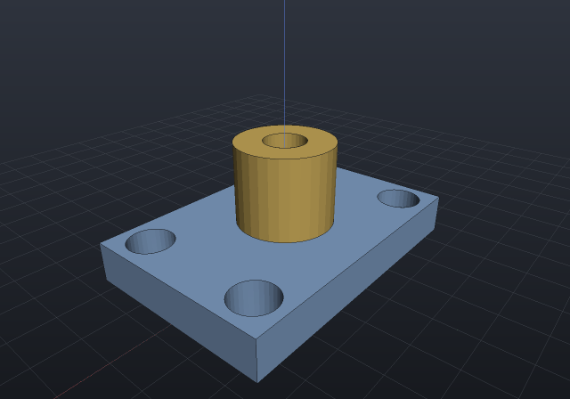
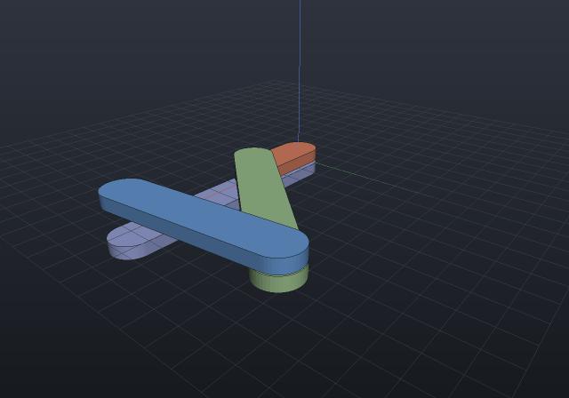
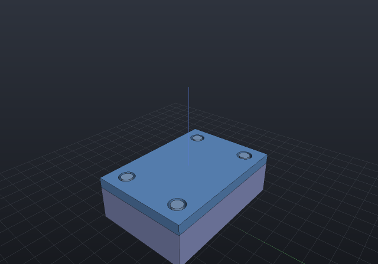

# Animation

Three different things want to animate — a **mechanism** driven through its range,
an **assembly** moving between assembled and exploded, and the **camera** — and they
are the same problem, because all three are pure functions of one parameter that move
*poses and the camera only*. That is the load-bearing rule: **an animation never
touches geometry**. Tracks return matrices over a fixed instance list (count and
order independent of t) or a camera pose, never a re-meshed part, so a viewer
animates with matrices alone and picking keeps working.

An `Animation` is a duration, an easing, and up to two tracks — one posing the
scene's instances, one moving the camera — each with its own window on the shared
timeline. `Animation.At(t)` is a **pure function of t ∈ [0, 1]**: scrubbing in the
viewer, playing, and every export format evaluate the same function.

The images on this page are **APNGs produced by the docs build itself** — lossless,
full colour, and served as `.png` because an APNG *is* one. (`RenderGif` exists too,
because GIF pastes everywhere — but a shaded render **will band** in GIF's 256
colours, and dithering would fight the clean look; if you need a GIF, a
`ViewStyle.Wireframe` or flat-shaded clip survives quantization far better. There is
also always `RenderFrames`, the numbered-PNG escape hatch into ffmpeg for MP4/WebM.)

## Turntable

The camera move everyone wants first: orbit about Z at fixed pitch. Whole turns loop
seamlessly under the default linear easing, because frame t = 1 lands exactly on
frame t = 0:

```csharp animate:animate-turntable frames:36
var top = SketchPlane.At((0, 0, 2.5), Vector3d.UnitX, Vector3d.UnitY);
var plate = Shape.Box(36, 24, 5)
    .Drill(StandardHoles.Clearance(5),
        [new(-14, -8), new(14, -8), new(-14, 8), new(14, 8)], depth: 7, top);
var boss = Shape.Cylinder(6, 10) - Shape.Cylinder(2.6, 14);

var scene = new Scene();
scene.Add(new Part("plate", plate, Palette.Steel, Matrix4d.CreateTranslation((0, 0, 2.5))));
scene.Add(new Part("boss", boss, Palette.Brass, Matrix4d.CreateTranslation((0, 0, 10))));

var animation = new Animation(durationSeconds: 6)
    .With(TurntableTrack.Around(scene));
```



Exporting the same animation from your own code is one call — the window's playback
(below) and this file render the identical frames:

```csharp
animation.RenderApng(scene, "turntable.png", frames: 48);
```

Every export renders the whole clip through **one** offscreen context, with one set of
linked shader programs and one set of uploaded buffers: only the per-instance matrices
move between frames, which is exactly what "an animation never touches geometry" buys
you. Measured on a 24-frame 480x360 export of a four-part exploding assembly, that is
**1069 ms down to 165 ms (6.5x)** against a context per frame — and the batched pixels
are asserted byte-identical to the per-frame path, because a speed claim about a
renderer is worth nothing without the picture beside it.

## One instant as a still

Sometimes you want a frame, not a clip — a figure of the mechanism at its half-stroke,
or an assistant asking "what does it look like at t = 0.3":

```csharp
EngrCad.RenderToImage(scene, animation, t: 0.3, "half-open.png");
```

This is the same pure `Animation.At(t)`, so the still, a scrubbed viewport and frame
⌊t·N⌋ of the APNG are the same picture. The camera follows the clip's own rule — the
animation's camera track first, then an explicit `camera:`, then the framing over the
union of the first and last frames' bounds, never a per-t framing that would make a
series of stills jump. The [MCP server](mcp.md)'s `screenshot` tool takes the same `t`,
through the same `EngrCad.PoseAt` seam.

## A mechanism running

A `MotionStudy` — the recorded output of `Mechanism.Sweep` — is already the
animation input format: pure poses per sampled frame. `MechanismTrack` plays one
back, returning the recorded frames **verbatim at their sample points** and rigidly
interpolating between them (never re-solving: solving at an arbitrary t from an
arbitrary seed is exactly the branch-flipping trap the sweep's continuation exists
to avoid). Grafted onto a scene, instances outside the mechanism keep their poses:

```csharp animate:animate-fourbar frames:36
// The four-bar from the mechanisms page: crank 15, coupler 40, rocker 30 on a
// 45 ground span (Grashof — the crank turns full circles).
Part Bar(string name, double length, double z, PartColor color) => new(name,
    Shape.Extrude(Sketch.Slot(length + 8, 8), 2.5).Translate(length / 2, 0, z), color);

var rig = new Assembly("linkage");
var frame = rig.Add(Bar("frame", 45, -3.2, Palette.Slate));
var crank = rig.Add(Bar("crank", 15, 0, Palette.Coral));
var coupler = rig.Add(Bar("coupler", 40, 2.7, Palette.Sage));
var rocker = rig.Add(Bar("rocker", 30, 5.4, Palette.Sky));

Frame3d Posed(double x, double y, double angle) => Frame3d.FromXY((x, y, 0),
    (Math.Cos(angle), Math.Sin(angle), 0), (-Math.Sin(angle), Math.Cos(angle), 0));
crank.Frame = Posed(0, 0, 0);
coupler.Frame = Posed(15, 0, 0.84);
rocker.Frame = Posed(45, 0, 1.68);

var z = Vector3d.UnitZ;
var crankPin = Joint.Revolute(
    MateGeometry.Axis(frame, (0, 0, 0), z), MateGeometry.Axis(crank, (0, 0, 0), z), "crank pin");
var mechanism = new Mechanism(rig)
    .Ground(frame)
    .Add(crankPin)
    .Add(Joint.Revolute(MateGeometry.Axis(crank, (15, 0, 0), z), MateGeometry.Axis(coupler, (0, 0, 0), z)))
    .Add(Joint.Revolute(MateGeometry.Axis(coupler, (40, 0, 0), z), MateGeometry.Axis(rocker, (30, 0, 0), z)))
    .Add(Joint.Revolute(MateGeometry.Axis(frame, (45, 0, 0), z), MateGeometry.Axis(rocker, (0, 0, 0), z)));
mechanism.Assemble();

var scene = new Scene();
scene.AddTab("linkage").Add(rig);

// One full crank cycle, 37 recorded poses; the track interpolates between them.
var study = mechanism.Sweep(MechanismDriver.Angle(crankPin), 0, 2 * Math.PI, frames: 37);
if (!study.Completed) throw new Exception(study.ToString());

var animation = new Animation(durationSeconds: 4)
    .With(new MechanismTrack(study, scene));
```



A study that stalls (a dead centre, a joint stop) animates what it recorded —
honestly ending where the sweep did, with the diagnostics naming why.

## A sequenced explode

The exploded view is already a pure function of a factor
(`Occurrence.ExplodeOffset` × t). `ExplodeTrack` animates it, and
`Stagger(occurrence, start, end)` gives each occurrence its own **timing window**
along the track — the assembly-instructions look, where fasteners back out first and
the cover lifts after:

```csharp animate:animate-explode frames:30
var housingTop = SketchPlane.At((0, 0, 10), Vector3d.UnitX, Vector3d.UnitY);
var coverTop = SketchPlane.At((0, 0, 13), Vector3d.UnitX, Vector3d.UnitY);
Vector2d[] pattern = [new(-15, -9), new(15, -9), new(-15, 9), new(15, 9)];

var housing = new Part("housing", Shape.Box(40, 28, 10).Translate(0, 0, 5)
    .Drill(StandardHoles.Tapped(4), pattern, depth: 8, housingTop), Palette.Slate);
var cover = new Part("cover", Shape.Box(40, 28, 3).Translate(0, 0, 11.5)
    .Drill(StandardHoles.Clearance(4), pattern, depth: 5, coverTop), Palette.Sky);
var pin = new Part("pin", Shape.Cylinder(1.6, 11).Translate(0, 0, 7.5), Palette.Steel);

var stack = new Assembly("stack");
stack.Add(housing);
var coverOn = stack.Add(cover);
var pins = pattern
    .Select(at => stack.Add(pin, Frame3d.FromXY((at.X, at.Y, 0), Vector3d.UnitX, Vector3d.UnitY)))
    .ToList();

// Designed offsets (AutoExplode could derive them; explicit is clearer here).
coverOn.ExplodeOffset = new Vector3d(0, 0, 18);
foreach (var p in pins)
    p.ExplodeOffset = new Vector3d(0, 0, 34);

var scene = new Scene();
scene.AddTab("stack").Add(stack);

// Pins back out over the first 60% of the track; the cover lifts over the last 50%.
var track = new ExplodeTrack(scene, deriveOffsets: false);
foreach (var p in pins)
    track.Stagger(p, 0.0, 0.6);
track.Stagger(coverOn, 0.5, 1.0);

var animation = new Animation(durationSeconds: 5, AnimationEasing.Smoothstep)
    .With(track);
```



Outside its window an occurrence **holds** its boundary factor (exactly 0 before —
bit-for-bit the assembled pose — and exactly 1 after), so windows sequence rather
than snap. The instance count and order never change with t, which is what lets the
viewer animate with `SetInstancePoses` matrices alone.

## Playing in the viewer

Give the window the animation and the toolbar grows a transport — Play/Pause, Loop,
and a scrubber:

```csharp
EngrCad.Configure()
    .WithAnimation(scene => new Animation(durationSeconds: 6)
        .With(TurntableTrack.Around(scene)))
    .Run(args, BuildScene);
```

The factory runs per scene — including per hot reload, so tracks always reference
the freshly built occurrences. Scrubbing evaluates the same `Animation.At(t)` an
export renders: what you see on the slider is what the APNG will contain.

## Camera tracks

Beyond the turntable: `KeyframedCameraTrack` interpolates poses with the view cube's
transition feel (per-segment smoothstep, and yaw always takes the **shortest angular
path** — the same primitive the cube's 250 ms moves use), and `FlyThroughTrack`
moves the eye along any `Curve3d` (a `NurbsCurve.InterpolatePoints` through
waypoints is the usual spelling), looking along the tangent or at a fixed point.
The orbit camera is Z-up, so a path frame's roll is deliberately dropped.

```csharp run:animate-camera-tracks
var keyframed = new KeyframedCameraTrack(
[
    new CameraKeyframe(0.0, new CameraState(0.7, 0.45, 60, (0, 0, 5))),
    new CameraKeyframe(0.5, new CameraState(2.2, 0.9, 40, (0, 0, 5))),
    new CameraKeyframe(1.0, new CameraState(-0.6, 0.2, 70, (0, 0, 5))),
]);
var path = NurbsCurve.InterpolatePoints([(60, 0, 20), (40, 40, 30), (0, 55, 12), (-45, 30, 25)]);
var fly = new FlyThroughTrack(path, lookAhead: 25, lookAt: new Vector3d(0, 0, 0));

// Both are pure functions of t; sample them anywhere.
var pose = fly.CameraAt(0.5);
if (pose.Distance != 25) throw new Exception("lookAhead is the orbit distance");
```
