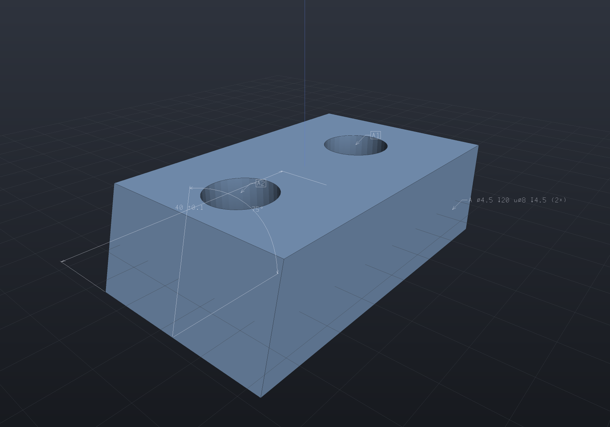
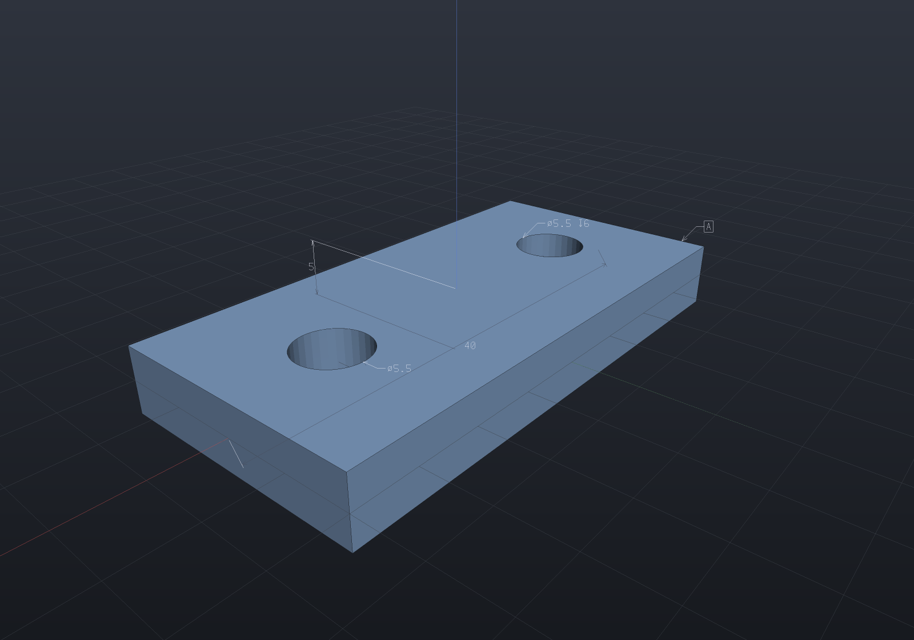

Parts can carry their own manufacturing information — **dimensions, notes, and datum
labels attached to model geometry in 3D space** (model-based definition, instead of
2D drawings). Annotations live on the `Part`, resolve against its geometry, and are
drawn by the viewer with classic dimension graphics: extension lines, arrowheads, and
billboarded screen-constant text. They render in headless/docs output too — the
image below is produced by the same offscreen renderer that made every other picture
on this site.

## Dimensions that measure the model

The important annotations are **selector-based**: instead of storing a number, a
dimension stores a *semantic query* (the `BrepQueries` vocabulary the chamfer/fillet
selectors use) and measures the actual geometry every time it resolves. Change a
parameter, regenerate, and the dimension re-measures — the same topological-naming
story as parametric features.

```csharp render:annotations
var plate = Shape.Box(40, 20, 5)
    .Drill(StandardHoles.Clearance(5), [new(-12, 0), new(12, 0)], depth: 6,
        SketchPlane.At((0, 0, 2.5), Vector3d.UnitX, Vector3d.UnitY));

var part = new Part("plate", plate);

// Auto-measured width: the distance between the two X faces (selector re-runs
// per resolution, so it tracks parameter edits).
part.Annotate(LinearDimension.BetweenFaces(
    s => s.PlanarFacesWithNormal(-Vector3d.UnitX).First(),
    s => s.PlanarFacesWithNormal(Vector3d.UnitX).First()));

// Thickness, pulled to the front with an explicit placement offset.
var thickness = LinearDimension.BetweenFaces(
    s => s.PlanarFacesWithNormal(Vector3d.UnitZ).First(),
    s => s.PlanarFacesWithNormal(-Vector3d.UnitZ).First());
thickness.Offset = new Vector3d(0, -16, 0);
part.Annotate(thickness);

// The bore diameter, read from the actual circular edge: "⌀5.5".
part.Annotate(RadialDimension.OnEdge(
    s => s.Faces.SelectMany(f => f.Edges()).Distinct()
        .First(e => e.IsCircular(out var c, out _, out _) && c.X > 0 && c.Z > 2),
    diameter: true));

// A hole callout generated from the same spec that drilled the holes,
// and a datum label.
part.Annotate(HoleCallout.From(StandardHoles.Clearance(5), (-12, -2.75, 2.5), depth: 6));
part.Annotate(new DatumLabel((-20, 8, 2.5), "A"));

var scene = new Scene();
scene.Add(part);
```


## Angles, tolerances, and hole tables

The dimension vocabulary extends to angles, tolerance text, and drilling data pulled
straight out of the geometry graph:

```csharp render:annotations-extras
// A block with a 15° drafted side, then two counterbored holes in its top.
var body = Shape.Box(40, 24, 12)
    .Draft(15, neutralOrigin: (0, 0, -6), pullDirection: Vector3d.UnitZ,
        faces: s => s.PlanarFacesWithNormal(Vector3d.UnitX))
    .Drill(StandardHoles.Counterbored(4), [new(-10, 0), new(10, 0)], depth: 20,
        SketchPlane.At((0, 0, 6), Vector3d.UnitX, Vector3d.UnitY));

var part = new Part("bracket", body);

// Angular dimension between the drafted face and the base: the faces' INCLUDED
// angle (75°), measured from the actual planes per resolution.
part.Annotate(AngularDimension.BetweenFaces(
    s => s.Faces.First(f => f.IsPlanar(out _, out var n) && n.Dot(Vector3d.UnitX) > 0.9),
    s => s.PlanarFacesWithNormal(-Vector3d.UnitZ).First()));

// A toleranced dimension: the tolerance is text sugar appended to the value.
part.Annotate(new LinearDimension((-20, -12, -6), (20, -12, -6))
{
    Tolerance = ToleranceSpec.Symmetric(0.1),
    Offset = new Vector3d(0, -10, 0),
});

// Hole-table balloons ("A1", "A2") plus a table note, generated from the SAME
// Drill call that cut the holes — nothing transcribed.
HoleTable.For(part).Annotate(part, tableAnchor: (0, 18, 6));

var scene = new Scene();
scene.Add(part);
```



## Which side of the part is it on?

By default the overlay is drawn **on top of everything**, so no dimension can ever be
obscured. That is safe and says nothing: a dimension line placed at mid-thickness — the
default placement for a face-to-face width — really runs *inside* the plate, and drawn
over the top face it reads as though it were lying on it.

`AnnotationDepth.Occluded` depth-tests the line work instead. Stretches with material in
front of them are drawn dimmed; the **values stay at full strength wherever they sit**,
because a dimension's number is what you are there to read and a half-obscured "40" is
worth nothing. Compare the plate above with the same plate below: the width dimension
sinks into the material and stops crossing its own text, while the bore leader — which
lies *in* the top face — still reads as being on it.

```csharp render:annotations-occluded
var plate = Shape.Box(40, 20, 5)
    .Drill(StandardHoles.Clearance(5), [new(-12, 0), new(12, 0)], depth: 6,
        SketchPlane.At((0, 0, 2.5), Vector3d.UnitX, Vector3d.UnitY));

var part = new Part("plate", plate);

part.Annotate(LinearDimension.BetweenFaces(
    s => s.PlanarFacesWithNormal(-Vector3d.UnitX).First(),
    s => s.PlanarFacesWithNormal(Vector3d.UnitX).First()));

var thickness = LinearDimension.BetweenFaces(
    s => s.PlanarFacesWithNormal(Vector3d.UnitZ).First(),
    s => s.PlanarFacesWithNormal(-Vector3d.UnitZ).First());
thickness.Offset = new Vector3d(0, -16, 0);
part.Annotate(thickness);

part.Annotate(RadialDimension.OnEdge(
    s => s.Faces.SelectMany(f => f.Edges()).Distinct()
        .First(e => e.IsCircular(out var c, out _, out _) && c.X > 0 && c.Z > 2),
    diameter: true));
part.Annotate(HoleCallout.From(StandardHoles.Clearance(5), (-12, -2.75, 2.5), depth: 6));
part.Annotate(new DatumLabel((-20, 8, 2.5), "A"));

// The one line that differs from the render above.
var annotationDepth = AnnotationDepth.Occluded;

var scene = new Scene();
scene.Add(part);
```



Reach it from the **Top / Depth** button beside the viewer's `Annot` toggle, from
`EngrCad.Configure().WithAnnotationDepth(AnnotationDepth.Occluded)`, from
`EngrCad.RenderToImage(..., annotationDepth:)`, from the MCP `screenshot` tool's
`annotationDepth: "occluded"`, or — as above — by declaring an `annotationDepth`
variable in a docs `render:` fence.

Two properties are worth knowing because they are decisions rather than accidents:

- **Nothing ever disappears.** A hidden stretch is dimmed, never dropped, so the
  overlay stays complete and clicking still selects an annotation you can see
  (picking is deliberately depth-blind, and stays so under either mode).
- **An annotation lying exactly in a face counts as visible.** A radial dimension's
  leader is coplanar with the face whose bore it measures; the overlay is pulled one
  pixel toward the eye so that case is settled by decision rather than by which of two
  rasterizations rounded further.

## The pieces

- **`LinearDimension`** — between two *parallel planar* faces
  (`LinearDimension.BetweenFaces(selectorA, selectorB)`, auto-measured
  plane-to-plane), or between two fixed points (`new LinearDimension(a, b)` — what
  the viewer's interactive **Measure** tool creates from two clicks).
- **`AngularDimension`** — the angle at a vertex between two rays
  (`new AngularDimension(vertex, a, b)`) or between two non-parallel planar faces
  (`AngularDimension.BetweenFaces(selectorA, selectorB)` — the faces' *included*
  angle as they open from their shared edge line, i.e. what a drafter dimensions,
  not the angle between normals). Drawn as extension rays, an arc with arrowheads,
  and degree text.
- **`RadialDimension.OnEdge(selector, diameter: …)`** — reads the actual radius of
  an `IsCircular` edge; text `R5` or `⌀10`.
- **`LeaderNote`** / **`DatumLabel`** — free text / a boxed datum letter with a
  leader to a part-local anchor point. Note text may contain `'\n'` — the stroke
  font lays continuation lines out stacked (hole callouts use this for their
  counterbore/countersink lines).
- **Chain and ordinate styles** — `LinearDimension.Chain(points, offset)` dimensions
  consecutive pairs on one shared line; `LinearDimension.Ordinate(points, offset,
  spacing?)` dimensions every point from the first (the datum), stacking the lines
  outward — the baseline style drawings prefer for hole rows, since it does not
  accumulate per-segment tolerances.
- **Tolerance text** — `Tolerance = ToleranceSpec.Symmetric(0.1)` appends "±0.1",
  `ToleranceSpec.Limits(0.2, 0.1)` appends "+0.2/-0.1" (pure text sugar; a `Label`
  override wins).
- **Callout generators** — `HoleCallout.From(holeSpec, anchor, depth)` and
  `ThreadCallout.From(threadSpec, anchor, depth?)` produce standard callout text
  ("⌀5.5 ↧6", "M6×1 ↧12") as leader notes, straight from the specs used to cut the
  geometry.
- **Hole tables and auto callouts** — `HoleTable.For(part)` reads every
  `Drill`/`ThreadedHole` call out of the part's `Shape` graph (one lettered row per
  call, in call order) and `Annotate(part, tableAnchor)` attaches per-hole balloons
  ("A1", "B1") plus the table as a multi-line note; `HoleAnnotations.AutoAttach(part)`
  is the lighter option — one callout note per call, anchored at its first hole,
  with an "N× " count prefix.
- `Label` overrides the formatted text ("10 REF"); `Offset` places the dimension
  line or leader (leave it zero for a screen-space default).

In the viewer, annotations are on by default whenever a scene carries any (the
**Annot** toolbar toggle hides them), drawn on top of the model unless the **Top /
Depth** cycler beside it asks for the depth-tested reading above, and posed by
the instance transform — assembly instances show their part's annotations in place.
The **Measure** toggle turns clicks into surface-point picks: two picks create a
transient point-to-point dimension, Escape clears it. Annotations are **pickable**:
clicking within a few pixels of a dimension's lines or text selects it (drawn in
selection gold, its text reported in the status bar); clicking it again — or empty
space — deselects.
