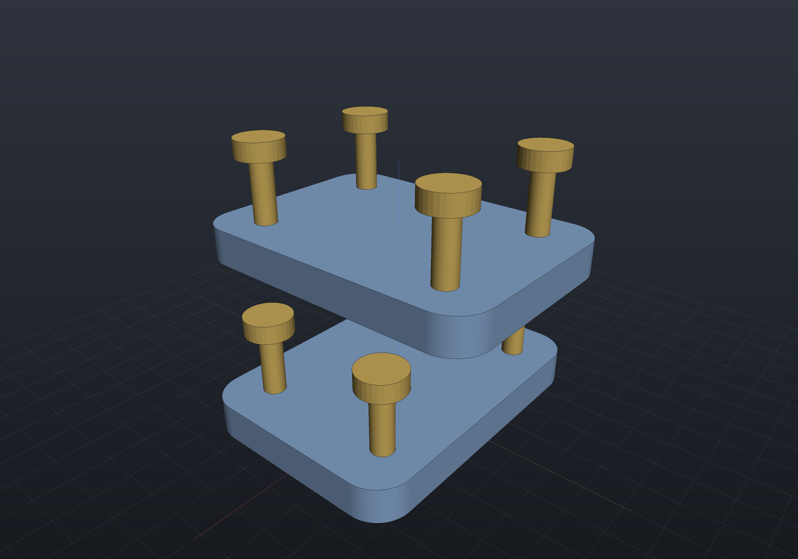

# Assemblies

An `Assembly` is a named list of **occurrences** — a shared [`Part`](viewer.md) *or*
a nested `Assembly`, each posed by a rigid `Frame3d` relative to its parent. Poses
compose down the tree, and assemblies hold **references, not copies**: one `Part`
placed ten times is meshed once and drawn ten times with different world matrices.
`Tab.Add(assembly)` puts an assembly in a viewer tab next to loose parts.

```csharp render:assembly
// ONE plate Part and ONE bolt Part, but ten placed instances. The "clamp"
// sub-assembly is itself placed twice inside "stack" — the second time lifted and
// rotated 90° about Z, carrying its four bolts with it.
var plate = new Part("plate",
    Shape.Extrude(Sketch.RoundedRectangle(44, 32, 5), 5), Palette.Steel);
var bolt = new Part("bolt",
    Shape.Cylinder(1.6, 9).Translate(0, 0, 4.5)            // shank, z in [0, 9]
    | Shape.Cylinder(3.4, 2.6).Translate(0, 0, 10.3),      // head,  z in [9, 11.6]
    Palette.Brass);

var clamp = new Assembly("clamp");
clamp.Add(plate);                                          // occurrence "plate", identity pose
foreach (var (x, y) in new[] { (15.0, 10.0), (-15.0, 10.0), (-15.0, -10.0), (15.0, -10.0) })
    clamp.Add(bolt, Frame3d.FromXY((x, y, 5), Vector3d.UnitX, Vector3d.UnitY));
// derived names auto-suffix: "bolt", "bolt.2", "bolt.3", "bolt.4"

var stack = new Assembly("stack");
stack.Add(clamp);                                          // sub-assembly at identity
stack.Add(clamp, Frame3d.FromXY((0, 0, 22), Vector3d.UnitY, -Vector3d.UnitX));

var scene = new Scene();
scene.AddTab("stack").Add(stack);
```



## Poses compose, parts are shared

Flattening resolves the tree to `PartInstance`s — `(Part, World, Path)` — which is
the seam viewers and exporters consume; they never walk assemblies themselves. An
instance's world matrix is the occurrence frames composed down the tree
(`child.Frame.Then(parentWorld)`) times the part's own `Transform`, and its path
records the route (`"stack/clamp.2/bolt"`):

```csharp run:assembly-flatten
var plate = new Part("plate", Shape.Box(44, 32, 5));
var bolt = new Part("bolt", Shape.Cylinder(1.6, 9));

var clamp = new Assembly("clamp");
clamp.Add(plate);
foreach (var (x, y) in new[] { (15.0, 10.0), (-15.0, 10.0), (-15.0, -10.0), (15.0, -10.0) })
    clamp.Add(bolt, Frame3d.FromXY((x, y, 5), Vector3d.UnitX, Vector3d.UnitY));

var stack = new Assembly("stack");
stack.Add(clamp);
stack.Add(clamp, Frame3d.FromXY((0, 0, 22), Vector3d.UnitY, -Vector3d.UnitX));

var instances = stack.Flatten();
if (instances.Count != 10)
    throw new Exception("two clamps x five occurrences = ten instances");
if (!instances.Any(i => i.Path == "stack/clamp.2/bolt.3"))
    throw new Exception("occurrence paths should read stack/clamp.2/bolt.3");

// Pose composition: the first bolt sits at (15, 10, 5) inside clamp; clamp.2 is
// rotated 90 degrees about Z and lifted 22, so that instance lands at (-10, 15, 27).
var placed = instances.First(i => i.Path == "stack/clamp.2/bolt");
var origin = placed.World.TransformPoint(Vector3d.Zero);
if (origin.DistanceTo((-10, 15, 27)) > 1e-12)
    throw new Exception($"unexpected composed pose: {origin}");

// Shared parts mesh once: ten instances, but only two distinct parts to tessellate.
var scene = new Scene();
scene.AddTab("assembly").Add(stack);
scene.PreMesh();
if (scene.AllParts.Count() != 2) throw new Exception("expected two distinct parts");
if (scene.AllInstances.Count() != 10) throw new Exception("expected ten instances");
```

Semantics worth knowing:

- **Names.** Occurrence names are unique per assembly level. Derived names
  auto-suffix like CAD occurrence lists (`bolt`, `bolt.2`, …); an explicit
  `name:` argument must be unique and cannot contain `/` (it separates paths).
  Tab item names are unique across parts *and* assemblies.
- **Sharing.** The same `Part` — or the same `Assembly` — may appear under many
  parents (the graph is a DAG); **cycles are rejected** at `Add` time.
  `Scene.PreMesh()` walks each distinct part exactly once, so instancing costs one
  mesh however many occurrences place it. `Occurrence.Frame` is mutable, so
  parametric design code can re-pose occurrences between
  [live reloads](../getting-started.md).
- **Loose parts still work.** A `Tab` holds loose parts (posed by their own
  `Part.Transform`, path = name) next to assemblies; `Tab.Instances()` flattens
  both into one ordered list.

## In the viewer

The renders on this page are the offscreen scene render — the interactive window
adds the assembly-aware chrome around the same image (window chrome is not
renderable by the documentation build, so it is described here):

- The **model tree** shows assembly hierarchies with occurrences indented under
  their assembly and sub-assembly rows, in the same order as `Tab.Instances()`.
- **Visibility checkboxes** exist at every level: a part row toggles that one
  instance, an assembly row hides its whole subtree (effective visibility is the
  row's own checkbox AND all its ancestors' — unchecking a parent does not rewrite
  the children's state).
- **Selection is per occurrence**: clicking a tree row highlights that instance in
  the viewport, viewport picks highlight the tree row, and both report the
  occurrence path (`stack/clamp.2/bolt`) in the title and status bars. The
  properties panel shows the selected instance's path, part, and world placement.
- Both render paths upload each distinct part's buffers **once** and draw every
  instance with its own composed world matrix.

v1 is placement only: mates/constraints, exploded views, and bills of materials are
future work — mates will solve for the occurrence frames that `Flatten()` composes.
