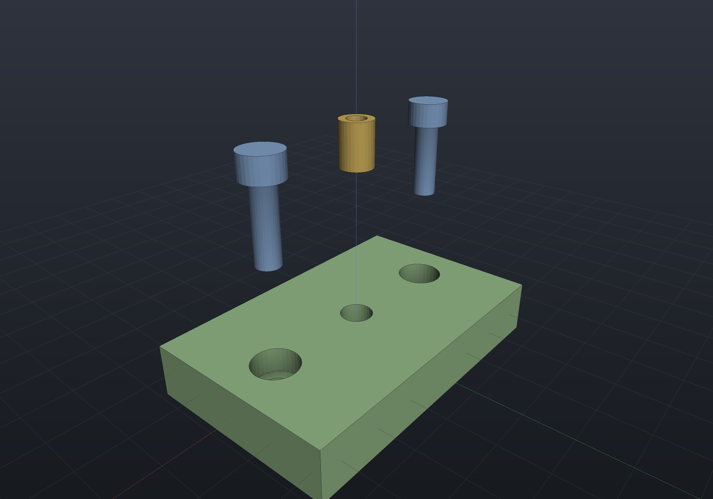

# Assemblies

An `Assembly` is a named list of **occurrences** — a shared [`Part`](viewer.md) *or*
a nested `Assembly`, each posed by a rigid `Frame3d` relative to its parent. Poses
compose down the tree, and assemblies hold **references, not copies**: one `Part`
placed ten times is meshed once and drawn ten times with different world matrices.
`Tab.Add(assembly)` puts an assembly in a viewer tab next to loose parts.

```csharp render:assembly
// ONE plate Part and ONE bolt Part, but ten placed instances. The "clamp"
// sub-assembly is itself placed twice inside "stack" — the second time lifted and
// rotated 90° about Z, carrying its four bolts with it.
var plate = new Part("plate",
    Shape.Extrude(Sketch.RoundedRectangle(44, 32, 5), 5), Palette.Steel);
var bolt = new Part("bolt",
    Shape.Cylinder(1.6, 9).Translate(0, 0, 4.5)            // shank, z in [0, 9]
    | Shape.Cylinder(3.4, 2.6).Translate(0, 0, 10.3),      // head,  z in [9, 11.6]
    Palette.Brass);

var clamp = new Assembly("clamp");
clamp.Add(plate);                                          // occurrence "plate", identity pose
foreach (var (x, y) in new[] { (15.0, 10.0), (-15.0, 10.0), (-15.0, -10.0), (15.0, -10.0) })
    clamp.Add(bolt, Frame3d.FromXY((x, y, 5), Vector3d.UnitX, Vector3d.UnitY));
// derived names auto-suffix: "bolt", "bolt.2", "bolt.3", "bolt.4"

var stack = new Assembly("stack");
stack.Add(clamp);                                          // sub-assembly at identity
stack.Add(clamp, Frame3d.FromXY((0, 0, 22), Vector3d.UnitY, -Vector3d.UnitX));

var scene = new Scene();
scene.AddTab("stack").Add(stack);
```


## Poses compose, parts are shared

Flattening resolves the tree to `PartInstance`s — `(Part, World, Path)` — which is
the seam viewers and exporters consume; they never walk assemblies themselves. An
instance's world matrix is the occurrence frames composed down the tree
(`child.Frame.Then(parentWorld)`) times the part's own `Transform`, and its path
records the route (`"stack/clamp.2/bolt"`):

```csharp run:assembly-flatten
var plate = new Part("plate", Shape.Box(44, 32, 5));
var bolt = new Part("bolt", Shape.Cylinder(1.6, 9));

var clamp = new Assembly("clamp");
clamp.Add(plate);
foreach (var (x, y) in new[] { (15.0, 10.0), (-15.0, 10.0), (-15.0, -10.0), (15.0, -10.0) })
    clamp.Add(bolt, Frame3d.FromXY((x, y, 5), Vector3d.UnitX, Vector3d.UnitY));

var stack = new Assembly("stack");
stack.Add(clamp);
stack.Add(clamp, Frame3d.FromXY((0, 0, 22), Vector3d.UnitY, -Vector3d.UnitX));

var instances = stack.Flatten();
if (instances.Count != 10)
    throw new Exception("two clamps x five occurrences = ten instances");
if (!instances.Any(i => i.Path == "stack/clamp.2/bolt.3"))
    throw new Exception("occurrence paths should read stack/clamp.2/bolt.3");

// Pose composition: the first bolt sits at (15, 10, 5) inside clamp; clamp.2 is
// rotated 90 degrees about Z and lifted 22, so that instance lands at (-10, 15, 27).
var placed = instances.First(i => i.Path == "stack/clamp.2/bolt");
var origin = placed.World.TransformPoint(Vector3d.Zero);
if (origin.DistanceTo((-10, 15, 27)) > 1e-12)
    throw new Exception($"unexpected composed pose: {origin}");

// Shared parts mesh once: ten instances, but only two distinct parts to tessellate.
var scene = new Scene();
scene.AddTab("assembly").Add(stack);
scene.PreMesh();
if (scene.AllParts.Count() != 2) throw new Exception("expected two distinct parts");
if (scene.AllInstances.Count() != 10) throw new Exception("expected ten instances");
```

Semantics worth knowing:

- **Names.** Occurrence names are unique per assembly level. Derived names
  auto-suffix like CAD occurrence lists (`bolt`, `bolt.2`, …); an explicit
  `name:` argument must be unique and cannot contain `/` (it separates paths).
  Tab item names are unique across parts *and* assemblies.
- **Sharing.** The same `Part` — or the same `Assembly` — may appear under many
  parents (the graph is a DAG); **cycles are rejected** at `Add` time.
  `Scene.PreMesh()` walks each distinct part exactly once, so instancing costs one
  mesh however many occurrences place it. `Occurrence.Frame` is mutable, so
  parametric design code can re-pose occurrences between
  [live reloads](../getting-started.md).
- **Loose parts still work.** A `Tab` holds loose parts (posed by their own
  `Part.Transform`, path = name) next to assemblies; `Tab.Instances()` flattens
  both into one ordered list.

## Exploded views

An exploded view is a scalar composed into each occurrence's frame during flattening —
not a separate rendering path. `Occurrence.ExplodeOffset` is the displacement at factor
1, expressed in the **parent's** coordinates so nesting composes, and
`Assembly.AutoExplode()` derives sensible offsets when you have not:

```csharp render:assembly-exploded
var top = SketchPlane.At((0, 0, 6), Vector3d.UnitX, Vector3d.UnitY);

var build = new ComponentAssembly("plate", Shape.Box(70, 44, 12), Palette.Sage);
build.Place(StandardComponents.CapScrew(5, 16), [new(-24, 0), new(24, 0)], top);
build.Place(StandardComponents.TrisertInsert(5), [new(0, 0)], top);

var scene = new Scene();
scene.AddTab("exploded").Add(build.ToAssembly("bracket"));

var explode = 1.0;   // 0 assembled, 1 fully exploded; offsets derived by AutoExplode
```



Two things make that picture right. The fasteners travel along **their own axes**,
because a `HardwareComponent` body is modelled +Z out of the host — the seating
convention already knows the direction. And the plate does not move: the largest
non-catalogue occurrence is the **datum**. Deriving directions from the assembly's
*centroid* is the obvious idea and a bad one — on a spread-out assembly the centroid
sits in empty space, so every part including the base flies away from nothing.

At factor 0 the frame is returned untouched, so an un-exploded flatten is bit-for-bit
what it always was. More usefully, the instance **list** — count, order, part
references — is identical at every factor, which is what lets the viewer animate the
slider by swapping matrices alone: no buffer is touched, one mesh and one pick BVH stay
shared, and picking follows for free.

## Bills of material

`Bom.For` counts occurrences per distinct `Part` over the same flattening, so nested
sub-assemblies roll up with no second traversal:

```csharp run:assembly-bom
var top = SketchPlane.At((0, 0, 6), Vector3d.UnitX, Vector3d.UnitY);
var build = new ComponentAssembly("plate", Shape.Box(70, 44, 12));
build.Place(StandardComponents.CapScrew(5, 16), [new(-24, 0), new(24, 0)], top);
build.Place(StandardComponents.TrisertInsert(5), [new(0, 0)], top);

var bom = Bom.For(build.ToAssembly("bracket"));
Console.WriteLine(bom.ToText());

// One plate we make, three fasteners we buy.
if (bom.Manufactured.Sum(l => l.Quantity) != 1) throw new Exception("expected one made part");
if (bom.Hardware.Sum(l => l.Quantity) != 3) throw new Exception("expected three bought-in items");
```

`Part.Hardware` — which `HardwareComponent.ToPart()` sets — is what splits bought-in
from made, and the same flag gives the explode heuristic its fastener axis. `ToCsv()`
and the indented `Bom.Structured` view are there too; the structured view's leaf totals
agree with the flat list by construction rather than by a second count.

Lines group by part **reference**, not by name: two separately-built parts that happen
to share a designation stay two lines, and `ByItem()` rolls them up for purchasing.

## Mates

Occurrence frames are mutable, so mates *solve* for them. Constraints reference geometry
by explicit local coordinates or by the same semantic `BrepQueries` selectors features
and dimensions use:

```csharp run:assembly-mates
Shape BoredPlate() => Shape.Box(40, 30, 6) - Shape.Cylinder(5, 20);
static BrepFace Bore(BrepSolid s) => s.Faces.First(f => f.IsCylindrical(out _, out _, out _));

var rig = new Assembly("rig");
var lower = rig.Add(new Part("lower", BoredPlate()));
var upper = rig.Add(new Part("upper", BoredPlate()),
    Frame3d.FromXY((21, -14, 33), Vector3d.UnitX, Vector3d.UnitY));   // deliberately wrong

var result = new MateSet(rig)
    .Ground(lower)
    .Add(Mate.Concentric(MateGeometry.CylindricalFace(lower, Bore),
                         MateGeometry.CylindricalFace(upper, Bore)))
    .Add(Mate.Planar(MateGeometry.PlanarFace(lower, s => s.PlanarFacesWithNormal(Vector3d.UnitZ).First()),
                     MateGeometry.PlanarFace(upper, s => s.PlanarFacesWithNormal(-Vector3d.UnitZ).First())))
    .Solve();

Console.WriteLine(result);          // "... 5 of 6 DOF constrained (1 free)"
if (!result.Converged) throw new Exception(result.ToString());
if (result.RemainingDegreesOfFreedom != 1) throw new Exception("the spin should stay free");
```

Concentric plus planar seats the upper plate on the lower and lines the bores up,
leaving exactly one degree of freedom — the spin about the shared axis, which a second
bolt would remove. **That report is the feature.** The solver always says how much it
pinned; `RequireFullyConstrained` turns leftover freedom into a failure, and a
contradictory set fails while moving *nothing*, naming the mates that carry the
residual.

One honest limit, found by test rather than papered over: an `Angle` or `Perpendicular`
mate whose directions start *exactly* parallel is a stationary configuration —
d/dθ cos θ = 0 at θ = 0, so no first-order step exists. The solver detects that and says
so. Nudging at random would "usually converge", which is worse than refusing.

### Across assembly levels, typed references, and saving

A mate can reach *into* a sub-assembly by **occurrence path** — the deep occurrence's
own frame becomes the unknown and its ancestors' frames compose through the solve (any
ancestor that is itself mated contributes its own chain-rule terms). Geometry can also
be named with the same typed `FaceRef`/`AxisRef` queries features use — still resolved
**once, when the mate is built** — which is what lets a mate set serialize:

```csharp run:assembly-mates-cross
Shape BoredPlate() => Shape.Box(40, 30, 6) - Shape.Cylinder(5, 20);

var carrier = new Assembly("carrier");
carrier.Add(new Part("plate", BoredPlate()),
    Frame3d.FromXY((3, 4, 5), Vector3d.UnitX, Vector3d.UnitY));

var rig = new Assembly("rig");
var lower = rig.Add(new Part("lower", BoredPlate()));
rig.Add(carrier, Frame3d.FromXY((17, 9, 25), Vector3d.UnitX, Vector3d.UnitY));

var mates = new MateSet(rig)
    .Ground(lower)
    .Add(Mate.Concentric(
        MateGeometry.CylindricalFace(lower, FaceRef.One(FaceSetRef.Cylindrical())),
        MateGeometry.CylindricalFace(rig, "carrier/plate", FaceRef.One(FaceSetRef.Cylindrical()))))
    .Add(Mate.Planar(
        MateGeometry.PlanarFace(lower, FaceRef.Top),
        MateGeometry.PlanarFace(rig, "carrier/plate", FaceRef.Bottom)));

var result = mates.Solve();     // the plate seats THROUGH the carrier's frame
if (!result.Converged) throw new Exception(result.ToString());

string json = mates.SaveMates();          // queries serialize as their descriptors
var reloaded = new MateSet(rig);
if (reloaded.LoadMates(json).Count != 0) throw new Exception("expected a clean load");
```

The carrier itself was never mentioned, so it stays rigid where it was placed — only
the plate moves, *within* it. `MateSolveResult.OccurrenceFreedoms` reports DOF per
movable occurrence by path. Two honesty rules ride along: a deep target inside a
sub-assembly that is **placed more than once** is refused by name (its frame is one
shared object — solving would move every placement), and `SaveMates`/`LoadMates`
follow the `FeatureHistory` contract — query-backed ends re-resolve eagerly on load,
lambda-backed ends load from their pinned coordinates with a warning.

## In the viewer

The renders on this page are the offscreen scene render — the interactive window
adds the assembly-aware chrome around the same image (window chrome is not
renderable by the documentation build, so it is described here):

- The **model tree** shows assembly hierarchies with occurrences indented under
  their assembly and sub-assembly rows, in the same order as `Tab.Instances()`.
  Assembly rows carry a disclosure triangle — collapsing one is pure UI state
  (nothing hides in the viewport, and re-expanding restores exactly what was there).
- **Visibility checkboxes** exist at every level: a part row toggles that one
  instance, an assembly row hides its whole subtree (effective visibility is the
  row's own checkbox AND all its ancestors' — unchecking a parent does not rewrite
  the children's state).
- **Selection is per occurrence**: clicking a tree row highlights that instance in
  the viewport, viewport picks highlight the tree row, and both report the
  occurrence path (`stack/clamp.2/bolt`) in the title and status bars. The
  properties panel shows the selected instance's path, part, and world placement.
- Both render paths upload each distinct part's buffers **once** and draw every
  instance with its own composed world matrix.

- An **Explode** toggle and factor slider drive the same flattening this page uses;
  `--explode <factor>` and `RenderToImage(explode:)` are the headless equivalents.
- A **BOM** button shows the table and writes a CSV beside it.

`--export part.step` writes **one assembly file** — a `PRODUCT` per distinct solid with
a `NEXT_ASSEMBLY_USAGE_OCCURRENCE` per placement, which `StepReader` reads back into
`StepReadResult.Instances`. Sharing products by solid reference is the same idea the
display path uses to share meshes; posing the geometry and writing it N times would
throw away the structure the format exists to carry.

Still future work: per-instance colour overrides, flexible sub-assemblies (per-instance
internal DOF for a sub-assembly placed more than once), and the dashed explode-path
leader lines drafting standards draw between an exploded part and its seat.
