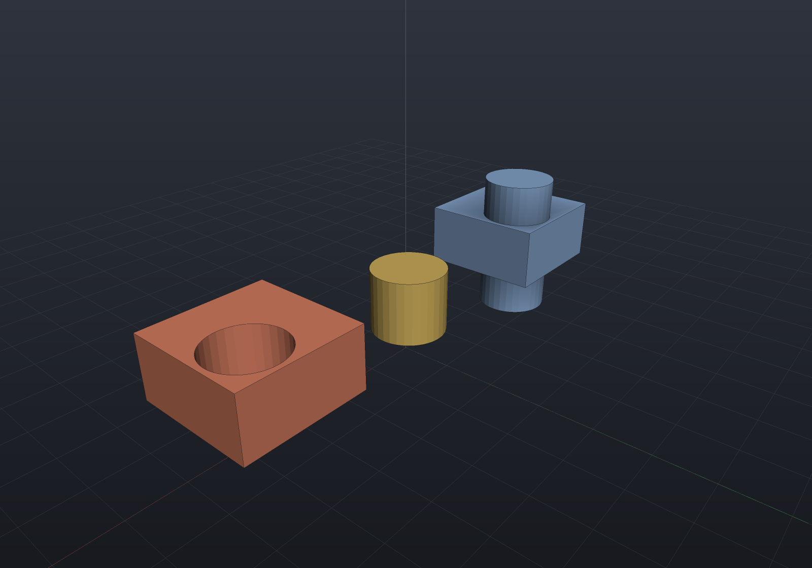
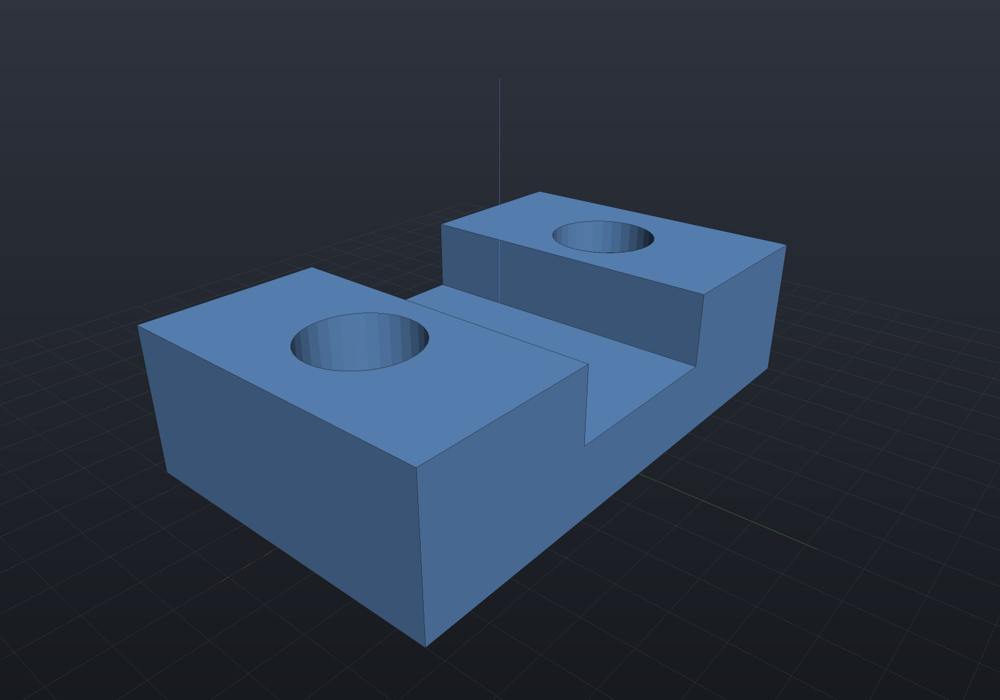
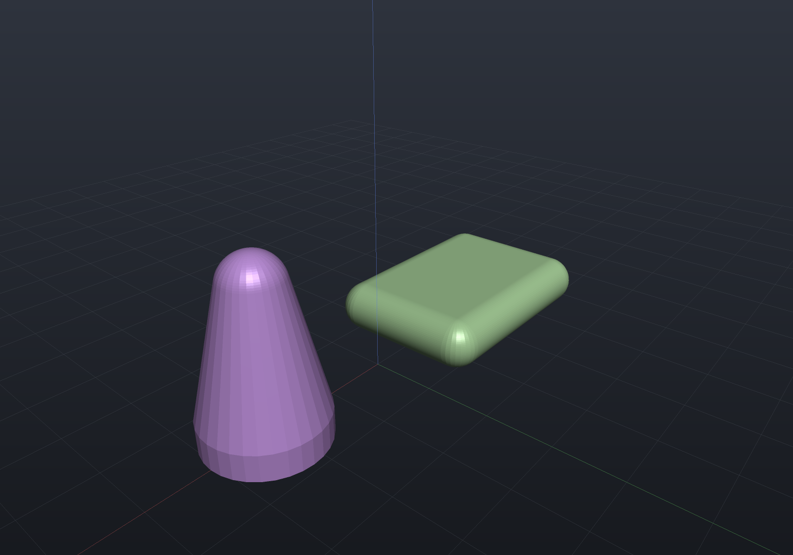

Union, intersection, and difference compose shapes in every representation — exact
`BrepBoolean` topology surgery in B-Rep, min/max in the implicit engine, and mesh
booleans as the fallback. The operators `|`, `&`, and `-` are shorthand for
`Union`, `Intersect`, and `Subtract`:

```csharp render:booleans
var block = Shape.Box(24, 24, 12);
var post = Shape.Cylinder(radius: 7, height: 28).Translate(4, 4, 0);

var scene = new Scene();
scene.Add(new Part("union", block | post, Palette.Steel,
    Matrix4d.CreateTranslation((-36, 0, 14))));
scene.Add(new Part("intersection", block & post, Palette.Brass,
    Matrix4d.CreateTranslation((0, 0, 14))));
scene.Add(new Part("difference", block - post, Palette.Coral,
    Matrix4d.CreateTranslation((36, 0, 14))));
```



A classic machined part is just a chain of differences:

```csharp render:booleans-machined
var block = Shape.Box(60, 36, 16)
    - Shape.Cylinder(6, 30).Translate(-19, 0, 0)     // through bore
    - Shape.Cylinder(6, 30).Translate(19, 0, 0)
    - Shape.Box(20, 40, 12).Translate(0, 0, 6);      // milled top channel

var scene = new Scene();
scene.Add(new Part("machined block", block, Palette.Sky,
    Matrix4d.CreateTranslation((0, 0, 8))));
```



In the B-Rep lowering the result is **topologically sealed** — it passes `Validate()`
and Euler–Poincaré with the correct genus, so downstream operations (tessellation,
STEP export, further booleans) get a watertight solid. For soft, blended joins use
[smooth booleans](implicit.md) instead.

## Convex hull

`Shape.Hull(operands...)` (OpenSCAD's `hull()`) wraps its operands in the tightest
convex skin — the quick way to make rounded pads and tapered transitions without
sketching them:

```csharp render:hull
var pad = Shape.Hull(                           // rounded mounting pad:
    Shape.Sphere(4).Translate(-14, -9, 4),      // the hull of four corner spheres
    Shape.Sphere(4).Translate(14, -9, 4),
    Shape.Sphere(4).Translate(14, 9, 4),
    Shape.Sphere(4).Translate(-14, 9, 4));

var stand = Shape.Hull(                         // tapered transition, disc to ball
    Shape.Cylinder(radius: 9, height: 4),
    Shape.Sphere(4.5).Translate(0, 0, 20));

var scene = new Scene();
scene.Add(new Part("pad", pad, Palette.Sage, Matrix4d.CreateTranslation((-22, 0, 0))));
scene.Add(new Part("stand", stand, Palette.Plum, Matrix4d.CreateTranslation((22, 0, 2))));
```



The honest support story: the hull is computed by **quickhull over the operands'
mesh vertices**. That is exact for polyhedral operands (boxes, polygonal
extrusions); curved operands contribute their *tessellated* vertices, so the result
is the hull of the tessellation — inscribed in the true hull, tightened by raising
`MeshQuality.SegmentsPerCircle`. `Explain` reports hulls as Bridged for every
target, and they can never become B-Rep (there is no mesh→B-Rep import) — see the
[support matrix](representations.md).
