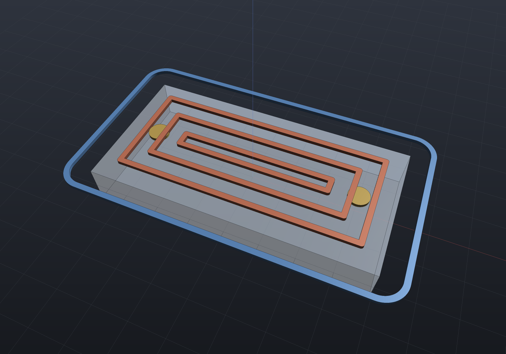
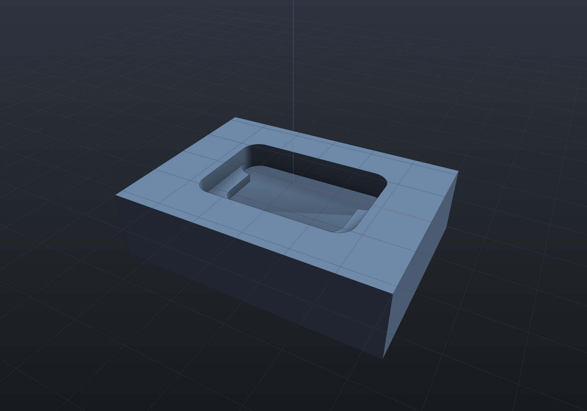
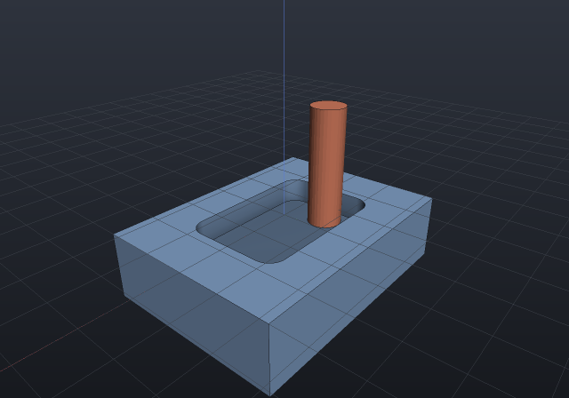
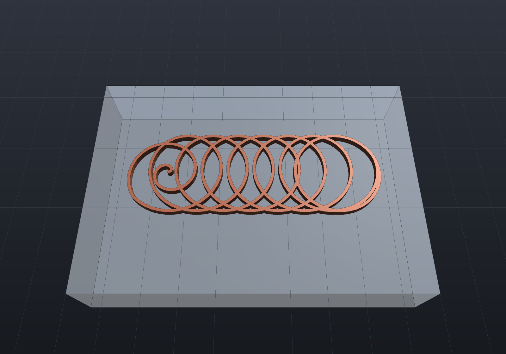

CAM stage 2 — pocketing, profiling and drilling, and like the slicer it is a thin layer over
machinery that already shipped: **pocket clearing is the inward-offset ladder** (`Region2dOffset`
rings one stepover apart, an island's grown boundary ridden like any other loop), **profiling is
one outline offset** by the tool radius (round joins — the path a tool centre physically rolls
around an outside corner), depth arrives in `StepDown` slices with the last clamped to the exact
stated depth, and **drilling ships as expanded peck moves** — plain `G0`/`G1`, so the same twin
decoder reads a drill cycle with nothing new.

**The verification oracle is the morphological opening.** A radius-*r* tool can reach exactly
`grow_r(shrink_r(region))` — internal corners come back rounded — so the union of the passes'
swept footprints (each centreline stroked at the tool diameter: the machined-stock simulation)
must equal the opening, and a rectangular pocket's unreachable corner residue is **closed form**:
`(4 − π)·r²`. The no-gouge claim is exact and point-by-point: every pass point at least the tool
radius from the region boundary.

```csharp run:cam-milling
// The outline comes from the solid itself: a plate sectioned at mid-height.
var plate = Shape.Box(40, 20, 6);
var region = plate.Section(SketchPlane.At(new Vector3d(0, 0, 0), Vector3d.UnitX, Vector3d.UnitY))
    .Single();

var tool = new MillTool(Diameter: 6, FeedRate: 600, StepDown: 2);
var pocket = CncMill.Pocket(region, tool, depth: 4);
var profile = CncMill.Profile(region, tool, depth: 6, ProfileSide.Outside,
    tabs: 3, tabHeight: 2, tabWidth: 8);
var drills = CncMill.Drill([new Vector2d(-15, 0), new Vector2d(15, 0)],
    new MillTool(3), depth: 8, peck: 3);

Console.WriteLine($"pocket: {pocket.Passes.Count} passes, cut {pocket.CutLength:0} mm");
Console.WriteLine($"profile: {profile.Passes.Count} passes (3 holding tabs on the last)");

// The corner residue a round tool cannot reach is closed form: (4 - pi) * r^2.
double r = tool.Radius;
var opening = Region2dBoolean.UnionAll(
    [.. Region2dOffset.Offset(region, -r).SelectMany(s => Region2dOffset.Offset(s, r))]);
Console.WriteLine($"unreachable corner residue: {region.Area - opening.Sum(o => o.Area):0.0000} "
    + $"mm2 vs (4-pi)r2 = {(4 - Math.PI) * r * r:0.0000}");

// One G-code program; the twin decoder recovers the cut length (rapids separated by the
// decoder's own Rapid flag, since feed state persists across G0 and G1 alike).
var decoded = GcodeReader.Read(CncGcodeWriter.Write([pocket, profile, drills]));
double cut = decoded.Moves.Where(m => !m.Rapid && m.XyLength > 0 && m.Feed == tool.FeedRate)
    .Sum(m => m.XyLength);
Console.WriteLine($"decoded cut length {cut:0} mm vs stated "
    + $"{pocket.CutLength + profile.CutLength:0} mm");
```

```csharp render:cam-milling-paths
// The pocket's ring ladder (one depth level), the outside profile pass and the drill
// points, drawn over the translucent plate.
var plate = Shape.Box(40, 20, 6);
var region = plate.Section(SketchPlane.At(new Vector3d(0, 0, 0), Vector3d.UnitX, Vector3d.UnitY))
    .Single();
var tool = new MillTool(Diameter: 6, StepDown: 2);
var pocket = CncMill.Pocket(region, tool, depth: 4);
var profile = CncMill.Profile(region, tool, depth: 6, ProfileSide.Outside);

Shape Ribbons(IEnumerable<MillPass> passes)
{
    var regions = new List<Region2d>();
    foreach (var pass in passes)
    {
        var pts = pass.Points.Select(p => new Vector2d(p.X, p.Y)).ToList();
        if (pass.IsClosed)
            pts.Add(pts[0]);
        regions.AddRange(Region2dOffset.Stroke(pts, 0.8));
    }
    Shape? all = null;
    foreach (var r in Region2dBoolean.UnionAll(regions))
    {
        var sketch = Sketch.Polygon(r.Outer);
        foreach (var hole in r.Holes)
            sketch = sketch.WithHole(Sketch.Polygon(hole));
        var ribbon = Shape.Extrude(sketch, 0.5, SketchPlane.At(
            new Vector3d(0, 0, 3.2), Vector3d.UnitX, Vector3d.UnitY));
        all = all is null ? ribbon : all | ribbon;
    }
    return all!;
}

double topZ = pocket.Passes[0].Points[0].Z; // the first depth level's rings
var scene = new Scene();
scene.Add(new Part("plate", plate, Palette.Steel) { DisplayMode = DisplayMode.Translucent });
scene.Add(new Part("pocket rings",
    Ribbons(pocket.Passes.Where(p => p.Points[0].Z == topZ)), Palette.Coral));
scene.Add(new Part("profile", Ribbons(profile.Passes.Take(1)), Palette.Sky));
scene.Add(new Part("drills",
    Shape.Cylinder(1.5, 0.5).Translate(-15, 0, 3.2) | Shape.Cylinder(1.5, 0.5).Translate(15, 0, 3.2),
    Palette.Brass));
var camera = new CameraState(-Math.PI / 2 + 0.4, 0.9, 62, (0, 0, 0));
```



**Moves mean what their shape says.** Within a pass, an XY move cuts at the feed rate, a
straight-down move plunges at the plunge rate, a straight-up move retracts as a rapid — one
`MillPass` vocabulary carries pockets, tabbed profiles and pecked drills with no per-move
annotations. Holding tabs live on the **final** profile pass only, evenly spaced by arc length (a
stated convention, not rounding luck), each a vertical rise at the tab's own edge — never a
diagonal ramp that would leave the closing stretch part-cut.

`MillTool` carries the process numbers (feeds in mm/min — G-code's `F` verbatim), and its
`Stepover ≤ 0.5` is the value that **provably** covers the whole reachable area (each ring clears
± a radius about its centreline).

## The machined-stock simulation

`CncStock.Simulate` records the stock at N fractions of the total cut length — each state an
ordinary `Shape` a scene can show, export or measure. **The swept volume of a 2.5D pass is
closed form**: a tool at constant z occupies its stroked footprint from the cut level up
through the stock, and a vertical descent bores a disc (an inscribed 32-gon, so a drilled
state's volume is an *exact* prism — polyhedral mesh booleans are exact, which is what makes
the drill check an identity rather than a tolerance). The removal is subtracted as z **bands**
(one level to the next), so successive levels repeating one footprint never hand the boolean
two coincident side walls:

```csharp run:cam-stock
var stock = Shape.Box(30, 22, 8).Translate(0, 0, -4); // stock top at z = 0
var region = new Region2d(
    [new Vector2d(-9, -6), new Vector2d(9, -6), new Vector2d(9, 6), new Vector2d(-9, 6)]);
var tool = new MillTool(Diameter: 4, StepDown: 2);
var ops = new[]
{
    CncMill.Pocket(region, tool, depth: 3),
    CncMill.Drill([new Vector2d(-12, 8), new Vector2d(12, 8)], new MillTool(3), depth: 6),
};

foreach (var state in CncStock.Simulate(stock, ops, states: 5))
    Console.WriteLine($"fraction {state.Fraction:0.00}: cut {state.CutLength,6:0.0} mm, "
        + $"stock {state.Shape.ToMesh().Volume():0.0} mm3");

// The drilled bore is EXACT: an inscribed 32-gon prism, closed form to round-off.
double r = 1.5;
double bore = 32 / 2.0 * r * r * Math.Sin(2 * Math.PI / 32) * 6;
Console.WriteLine($"each bore removes exactly {bore:0.000000} mm3");
```

```csharp render:cam-stock-mid
// The stock mid-cut: the pocket part-cleared, one bore drilled, the second still to come.
var stock = Shape.Box(30, 22, 8).Translate(0, 0, -4);
var region = new Region2d(
    [new Vector2d(-9, -6), new Vector2d(9, -6), new Vector2d(9, 6), new Vector2d(-9, 6)]);
var ops = new[]
{
    CncMill.Pocket(region, new MillTool(Diameter: 4, StepDown: 2), depth: 3),
    CncMill.Drill([new Vector2d(-12, 8), new Vector2d(12, 8)], new MillTool(3), depth: 6),
};
var states = CncStock.Simulate(stock, ops, states: 5);

var scene = new Scene();
scene.Add(new Part("stock", states[3].Shape, Palette.Steel));
var camera = new CameraState(-Math.PI / 2 + 0.5, 0.6, 55, (0, 0, -3));
```



A state is a still or an export, deliberately not a live clip: a changing-geometry animation
has no matrices-only form (the pose-track contract is that only matrices move), so the states
are recorded data — the same reasoning that kept transient thermal playback off the
deformation uniform. **The TOOL, though, animates as an ordinary pose track**: matrices only,
riding the animation system with nothing new —

```csharp animate:cam-milling-tool frames:36
// The tool riding its own toolpath over the machined stock — matrices only.
var stock = Shape.Box(30, 22, 8).Translate(0, 0, -4);
var region = new Region2d(
    [new Vector2d(-9, -6), new Vector2d(9, -6), new Vector2d(9, 6), new Vector2d(-9, 6)]);
var pocket = CncMill.Pocket(region, new MillTool(Diameter: 4, StepDown: 2), depth: 3);
var machined = CncStock.Simulate(stock, [pocket], states: 2)[^1].Shape;

var scene = new Scene();
scene.Add(new Part("stock", machined));
scene.Add(new Part("tool", Shape.Cylinder(2, 14).Translate(0, 0, 7), Palette.Coral));

// The tool part is modeled with its TIP at the origin, so following the pass points
// puts the tip on the cut; a closed ring appends its own first point to complete.
var waypoints = pocket.Passes
    .SelectMany(p => p.IsClosed ? p.Points.Append(p.Points[0]) : p.Points).ToList();
var animation = new Animation(durationSeconds: 6)
    .With(PathTracks.Follow(scene, "tool", waypoints));
```



`PathTracks.Follow` maps t to **arc length** (the explode-path rule — constant speed through
every corner, however unevenly the waypoints are spaced), hits each waypoint exactly at its own
parameter, and leaves every other instance's matrix untouched bit-for-bit.

## HSM: trochoidal slotting

Stage 4's defining invariant is the **engagement angle** — the arc of tool circumference in
material. A conventional slot cut buries the tool's whole leading half (~180°), which is why
slotting is where cutters die; `CncHsm.TrochoidalSlot` keeps it bounded: an Archimedean
spiral-out entry, then circular loops advancing a small step per revolution, so each loop
shaves a thin crescent off material the previous loops already opened.

**The advance is solved against the measured quantity, because the textbook formula is
measurably wrong here.** A straight cut of radial width *a* engages `acos((r − a)/r)` — but a
trochoid cuts against the previous loop's *convex* swept boundary, which engages more of the
circumference at the same radial width: seeding the advance from the straight-cut relation at
a 60° bound *measured* **90°** from the evolving stock. So the constructor bisects the advance
against a steady-state model of the same rule the tests measure with (several loops, the last
loop's tool-circle arc not yet covered by the swept prefix), and the verification re-measures
the real path independently — two constructions checking each other:

```csharp run:cam-trochoidal
var tool = new MillTool(Diameter: 4);
var slot = CncHsm.TrochoidalSlot(new Vector2d(0, 0), new Vector2d(20, 0),
    slotWidth: 10, tool, depth: 4, maxEngagementDegrees: 60);
Console.WriteLine($"{slot.Passes.Count} depth levels, "
    + $"{slot.Passes[0].Points.Count} points per level, cut {slot.CutLength:0} mm");
Console.WriteLine($"a straight slot is 20 mm of cut — the trochoid spends "
    + $"{slot.Passes[0].CutLength / 20:0.0}x of path for a bounded tool load");
```

```csharp render:cam-trochoid
// The trochoid itself: an Archimedean spiral-out, then loops advancing the solved step
// per revolution, one finishing loop at the far end. The figure opens the engagement
// bound so the loops read — at a production 60° they pack too tightly to tell apart.
var tool = new MillTool(Diameter: 4);
var slot = CncHsm.TrochoidalSlot(new Vector2d(-5, 0), new Vector2d(5, 0),
    slotWidth: 9, tool, depth: 2, maxEngagementDegrees: 110, samplesPerLoop: 36);
var path = slot.Passes[0].Points.Select(p => new Vector2d(p.X, p.Y)).ToList();

Shape? ribbon = null;
foreach (var r in Region2dBoolean.UnionAll([.. Region2dOffset.Stroke(path, 0.18)]))
{
    var sketch = Sketch.Polygon(r.Outer);
    foreach (var hole in r.Holes)
        sketch = sketch.WithHole(Sketch.Polygon(hole));
    var piece = Shape.Extrude(sketch, 0.4, SketchPlane.At(
        new Vector3d(0, 0, 0.3), Vector3d.UnitX, Vector3d.UnitY));
    ribbon = ribbon is null ? piece : ribbon | piece;
}

var scene = new Scene();
scene.Add(new Part("stock", Shape.Box(20, 14, 4).Translate(0, 0, -2), Palette.Steel)
    { DisplayMode = DisplayMode.Translucent });
scene.Add(new Part("trochoid", ribbon!, Palette.Coral));
var camera = new CameraState(-Math.PI / 2, 1.1, 26, (0, 0, 0));
```



The entry spiral's honesty is stated rather than hidden: a spiral-out's contact **arc** is
wide but *shallow* — its bounded quantity is the radial step per turn (the chip load), which
is why entry feed reduction exists — so the arc bound is a claim about the trochoidal phase,
measured from one full loop after the spiral reaches the loop radius. The slot's swept
footprint is the stadium `L·W + π(W/2)²` (asserted within 2%), and no path point ever leaves
the slot corridor (no-overcut, point by point).

## Drilling from the model

`CncDrilling.FromShape`/`FromPart` derives the drill program from the model's **own hole
declarations** — the one-declaration rule at the CAM boundary: a `Shape.Drill` or
`Shape.ThreadedHole` call already states the diameter, the depth and the positions (it is
what the drawing's `HoleTable` letters), so the CNC program reads the *same rows* rather
than having coordinates transcribed beside the model. One operation per distinct drill
diameter, ascending — a real setup is one tool per diameter — with a counterbore
contributing its **through** bore (the larger feature is a milling operation, not a drill)
and a threaded hole its **tap-drill pilot**. Depth is to the shoulder, which is the
drill-cycle convention too, so a real drill's tip reaches deeper exactly as the model's own
`WithTipAngle` draws it; a hole on a tilted plane refuses naming its row letter (which face
goes up is the fixture's decision, never a silent re-pose).

```csharp run:cam-drilling
var plate = Shape.Box(60, 40, 8)
    .Drill(StandardHoles.Clearance(5), [(-20, 10), (-20, -10), (20, 10), (20, -10)], depth: 10)
    .ThreadedHole(StandardThreads.Metric(6), [(0, 10), (0, -10)], depth: 6);
var ops = CncDrilling.FromShape(plate);
foreach (var op in ops)
    Console.WriteLine($"{op.Name}: {op.Passes.Count} holes");
var gcode = CncGcodeWriter.Write(ops, cannedDrilling: true);
Console.WriteLine($"{gcode.Split('\n').Count(l => l.StartsWith("G83"))} G83 cycles "
    + "- the M6 rows drill their tap pilot, the clearance rows their bore");
```

## Helical ramp entry

`Pocket(..., rampAngleDegrees: 3)` replaces every straight plunge into material with a
**helix** descending from the previous — already cleared — level about the level's own first
point: radius under the tool radius (no core post is left), inside the *measured* room, pitch
`2π·r·tan(angle)`, one flat closing turn at the level so the ramp's floor is cleared. The
level's rings then run as **one pass linked at depth** (a link cut through one stepover of
web) wherever the straight link stays a tool radius clear of the boundary — exact
segment-to-segment distance, so a link across a concave pocket's gap is refused rather than
gouged — and a pocket too tight to helix falls back to the plunge, honestly. The oracle is
that every stationary-XY descending move ends at a level **top** (cleared air), where the
plunge-only program's end at the level bottoms, in material; ramp 0 is byte-identical.

Landing it fixed a pre-existing ordering defect: the ring ladder linked all of a level's
loops in ONE nearest-endpoint pass, which is pen-dependent and measurably started a level at
its *boundary* ring — contradicting the module's own innermost-first contract and the climb
rule's "inward is already cleared" premise. Loops now link **within each ring level**,
innermost first, in both the plunged and the ramped emission.

## Rest machining

`CncMill.PocketRest(region, roughTool, finishTool, depth)` clears what the rough pocket
could not reach — the corner residues of the morphological opening — with the smaller tool.
The rest region is `region − opening(region, R₁)`, and each residue piece is pocketed over
`intersect(grow(piece, 2·r₂), region)`: the grow is a **derived sufficiency, not a margin**
(for any reachable residue point there is a tool disc within 2·r₂ of it and inside the
region, so its centre lands in exactly the inset the ring ladder walks), letting the tool
centre stand in already-cleared space — the whole point of rest machining, since the residue
is usually smaller than the tool — while the intersect keeps the wall inviolate, so the
no-gouge claim against the *original* boundary survives point by point. Residues thinner
everywhere than a stated minimum (default r₂/4) are flattening noise, skipped rather than
chased with micro-passes.

```csharp run:cam-rest
var region = new Region2d(new List<Vector2d>
    { new(0, 0), new(40, 0), new(40, 24), new(0, 24) });
var rough = new MillTool(12, StepDown: 3);
var finish = new MillTool(3, StepDown: 3);
var restOp = CncMill.PocketRest(region, rough, finish, depth: 3);
// The residue ladder in closed form: (4−π)R² per tool — roughing leaves 30.9 mm²,
// the rest pass takes it to the finish tool's own 1.93 mm², a 16× improvement.
Console.WriteLine($"rough residue {(4 - Math.PI) * 36:0.0} mm² -> "
    + $"finish residue {(4 - Math.PI) * 2.25:0.00} mm²");
Console.WriteLine($"rest pass: {restOp.Passes.Count} passes, "
    + $"cut length {restOp.CutLength:0.0} mm");
```

The oracle is the module's own opening identity, extended: the **combined** rough+rest
footprint equals the finish tool's opening of the region (asserted within 1%), and what
remains uncovered is exactly `(4−π)r₂²` — the closed-form ladder. One arrangement lesson
paid for: the opening touches the wall **tangentially** at every residue cusp, the 2D
arrangement's hostile case, so it is grown by an ε before the difference — transversal
contact, at the cost of an ε-band of residue the 2·r₂ grow immediately wins back.

## Climb, conventional and canned cycles

Every pocket and profile takes a `MillDirection` (climb is the default), and the rule is
**derived rather than transcribed**: an M3 right-hand cutter viewed from +Z spins clockwise,
so a tooth at the contact point with material on the LEFT of travel moves *with* the feed —
the chip starts thick, which is climb milling. Hence climb walks a loop counter-clockwise
when the material is inside it (an outside profile around the part) and clockwise when the
material is beyond it (a pocket ring, an inside profile) — with an island pocket orienting
its outer-derived and island-derived rings *oppositely*, both read off the measured shoelace
sign, never assumed from the offset machinery's emission order. The direction changes
traversal only: same passes, same starts, same cut length.

`CncGcodeWriter.Write(ops, cannedDrilling: true)` re-spells drill passes as canned cycles —
`G81` for a single plunge, `G83 Q` for pecks, under `G98`, closed by `G80` — with Z/R/Q
**reconstructed from the pass's own moves** and verified against the peck arithmetic (an
irregular ladder falls back to expanded emission, which is always correct). The decoder
expands cycles under the Fanuc semantics, modal bare-X/Y re-execution included, and refuses
a cycle missing its Z, R or Q by name — a guessed drill depth is confidently wrong geometry.
The canned spelling pecks from the R plane, so its bites sit R above the expanded twin's:
conservative, never a deeper bite, with the sites and final depths identical through the
decoder.

## Feeds and speeds

`CncToolLibrary.Suggest` derives a starting `MillTool` from the ⚠ verify-against-datasheet
`MillMaterials` catalogue (nominal carbide figures, asserted in the chart's own units) — the
two identities a feeds chart is built on: `rpm = 1000·Vc/(π·D)` and
`feed = rpm × flutes × chip load`, the chip load a stated fraction of the diameter. The
spindle cap preserves the **chip load**, not the feed — a capped rpm drops the feed in
proportion, because holding the feed would thicken every chip past what the flute clears:

```csharp run:cam-toollibrary
foreach (var material in MillMaterials.All)
{
    var tool = CncToolLibrary.Suggest(material, diameter: 6);
    Console.WriteLine($"{material.Name,-16} Ø6 2-flute: "
        + $"{tool.SpindleRpm,6:0} rpm, feed {tool.FeedRate,5:0} mm/min");
}
var small = CncToolLibrary.Suggest(MillMaterials.Aluminum6061, 2, maxRpm: 24000);
Console.WriteLine($"Ø2 in aluminium wants ~40k rpm; capped at 24k the feed follows: "
    + $"{small.FeedRate:0} mm/min (chip load preserved)");
```

## Laser cutting

`CncLaser.Cut` is the 2D machinery's near-free adjacent: a part cut free of sheet stock with
the **kerf spent in the waste**, and one outward offset gives every beam path with the
compensation already right — growing the region by kerf/2 moves its outer loops *out* into
the waste and its hole loops *in* into the holes, which are exactly the two beam
centrelines, so the freed part measures exactly the drawn dimensions with no per-loop case
analysis. Holes cut **first** (the release rule: a freed part is no longer held by the
sheet, so anything cut after the perimeter drifts). The G-code is GRBL's laser flavour —
`M4` dynamic power (the beam gates off during `G0` travels by the controller's own rule),
one `S` word, and **no Z anywhere**, because a laser has no depth axis and emitting one
would make the file mean something on the wrong machine.

```csharp run:cam-laser
var part = new Region2d(
    new List<Vector2d> { new(0, 0), new(40, 0), new(40, 20), new(0, 20) },
    [new List<Vector2d> { new(15, 5), new(15, 15), new(25, 15), new(25, 5) }]);
var cut = CncLaser.Cut(part, new LaserTool(KerfWidth: 0.2, Power: 750, Passes: 2));
Console.WriteLine($"{cut.Passes.Count} paths, hole first; beam path {cut.CutLength:0.00} mm");
Console.WriteLine($"outer = 2(40+20) + 2*pi*0.1 = {2 * (40 + 20) + 2 * Math.PI * 0.1:0.00} "
    + "(round corners carry the kerf compensation exactly)");
var decoded = GcodeReader.Read(CncLaser.WriteGcode(cut));
Console.WriteLine($"decoded cut length {decoded.Moves.Where(m => !m.Rapid).Sum(m => m.XyLength):0.0} mm "
    + "= 2 passes of every path");
```

## Arc output (`G2`/`G3`)

`CncGcodeWriter.Write(operations, arcFitting: true)` emits maximal runs of constant-z
points that lie on one circle as a single `G2`/`G3` in the I/J centre-offset form instead
of the chord run — and this is **recovery, not approximation**: the offset machinery
places its corner vertices *inscribed* on the true tool-compensated arc, so the circle
fitted through them is the arc the chording lost. A 40×24 plate with r6 corners profiled
outside by a Ø6 tool emits exactly four arcs whose I/J radius is the compensated
6 + 3 = 9.

The guard that earns its keep is the **sagitta cap**: each accepted chord's rise under the
fitted arc must stay below the file's own 1e-3 coordinate quantum. An on-circle test alone
cannot protect the path, and the failing case is not hypothetical — IEEE negation is
exact, so two points and their mirrors are *exactly* concyclic, and a symmetric part's
straight side flanked by its two corner tangency vertices reads as four points genuinely
on a 675 mm circle whose arc would bulge 0.027 mm across the 12 mm side: a real gouge that
every sample-based test waves through. Under the cap the substitution is invisible at the
file's own resolution, and the tests assert the no-gouge form directly (every decoded
fitted point within 2e-3 of the source polyline).

`GcodeReader` decodes `G2`/`G3` (I/J form) by expanding each arc into 5°-sampled
sub-moves, so every downstream identity — cut length, move kinds, extrusion conservation —
reads the arc as the fine polyline it machines as; the ambiguous `R` form, a missing
centre and endpoints that disagree about the radius refuse by name. Off is
byte-identical.

```csharp run:cam-arcs
var region = Sketch.RoundedRectangle(40, 24, 6).ToRegions()[0];
var op = CncMill.Profile(region, new MillTool(6), depth: 2, ProfileSide.Outside);
string chords = CncGcodeWriter.Write([op]);
string arcs = CncGcodeWriter.Write([op], arcFitting: true);
Console.WriteLine($"chorded {chords.Split('\n').Length} lines -> fitted {arcs.Split('\n').Length}");
foreach (var line in arcs.Split('\n').Where(l => l.StartsWith("G2 ") || l.StartsWith("G3 ")))
    Console.WriteLine(line);
double length = GcodeReader.Read(arcs).Moves.Where(m => !m.Rapid).Sum(m => m.XyLength);
Console.WriteLine($"decoded cut length {length:0.00} vs closed form "
    + $"2(28+12) + 2*pi*9 = {2 * (28 + 12.0) + 2 * Math.PI * 9:0.00}");
```

Still filed with the campaign: native arcs carried end to end from the exact
curved-profile tier (a `MillPass` whose segments ARE arcs — the fitter above recovers them
from the polyline instead), the 3-axis (surfacing) stock simulation — a raster row's swept
volume is not a prism, so `Simulate` refuses it by name today — and the trochoid ×
stock-record composition (the swept union's scallop cusps are near-tangent crossings, the
mesh imprint boolean's hostile family), plus general adaptive (constant-engagement) pocket
clearing, of which the closed-form cycloid family above is the honest first step.
