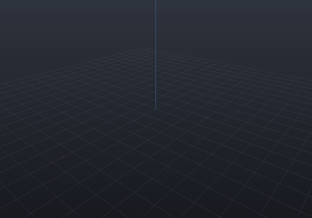

`EngrCAD.Cam` is the CAM campaign's first stage: an FDM slicer whose hard parts had already
shipped without ever being called CAM. Each layer is an **exact section** at the layer's
mid-height (`Shape.Section`'s machinery over ONE lowering — a hundred layers is not a hundred
lowerings), perimeter shells are **inward offsets** (`Region2dOffset` — successive insets *are*
the walls, wall *k*'s centreline at `bead·(k + ½)`), infill is a rectilinear scan clipped by an
**exact even-odd crossing rule** alternating ±45° per layer, and travel ordering is the shared
deterministic `RunLinker`. The G-code writer (Marlin flavour) states its modes — absolute
coordinates, absolute extrusion, millimetres — and its twin-decoder reader (`GcodeReader`)
refuses the modes it must not guess about **by name**: inches (`G20`), relative coordinates
(`G91`), relative extrusion (`M83`).

**The check with teeth is the extrusion bookkeeping identity.** Every E value in the file is
cumulative filament length with `ΔE = segment length × BeadArea / FilamentArea` (the stadium
bead cross-section — the standard model of a bead squashed under the nozzle). The decoder
re-derives *both* sides from the file alone — deposition length from the coordinates, filament
from the E deltas — so a unit slip, a lost segment or an E-mode bug is caught by arithmetic:

```csharp run:cam-slicing
// A drilled plate, sliced and written to G-code.
var plate = Shape.Box(20, 15, 4) - Shape.Cylinder(3, 10);
var profile = new PrinterProfile(LayerHeight: 0.25, WallCount: 2, InfillDensity: 0.3);

var sliced = FdmSlicer.Slice(plate, profile);
Console.WriteLine($"{sliced.Layers.Count} layers, "
    + $"{sliced.Layers.Sum(l => l.Paths.Count)} paths, "
    + $"deposition {sliced.DepositionLength:0} mm, "
    + $"filament {sliced.FilamentUsed:0.0} mm");

// A layer is walls (closed loops — the bore gets its own) then linked infill runs.
var layer = sliced.Layers[8];
Console.WriteLine($"layer 8 at z={layer.Z}: "
    + $"{layer.Paths.Count(p => p.Role == SlicePathRole.Wall)} wall loops, "
    + $"{layer.Paths.Count(p => p.Role == SlicePathRole.Infill)} infill runs");

// The G-code round-trips through the twin decoder, and the extrusion bookkeeping is an
// IDENTITY on the decoded values: filament == deposition length x BeadArea / FilamentArea.
string gcode = GcodeWriter.Write(sliced);
var decoded = GcodeReader.Read(gcode);
double identity = decoded.DepositionLength * profile.BeadArea / profile.FilamentArea;
Console.WriteLine($"decoded {decoded.LayerZs.Count} layers, "
    + $"filament {decoded.FilamentUsed:0.0} mm vs identity {identity:0.0} mm");
if (Math.Abs(decoded.FilamentUsed - identity) > identity * 1e-3)
    throw new Exception("the extrusion bookkeeping identity must hold");
```

## Choosing the print direction

The build orientation is a parameter, not a re-model: `Slice(shape, profile, printDirection)`
rotates the part by the **minimal rotation** taking the chosen axis to bed +Z and slices in bed
coordinates. `+Z` is the identity fast path (byte-identical to passing nothing); the antiparallel
case turns π about the codebase's one arbitrary-perpendicular convention, so it is deterministic
rather than a rounding accident; a zero direction refuses by name.

```csharp run:cam-print-direction
var bracket = Shape.Box(20, 10, 8);
var upright = FdmSlicer.Slice(bracket, new PrinterProfile(LayerHeight: 0.25));
var onSide = FdmSlicer.Slice(bracket, new PrinterProfile(LayerHeight: 0.25), new Vector3d(1, 0, 0));
Console.WriteLine($"upright: {upright.Layers.Count} layers of area "
    + $"{upright.Layers[0].Regions.Sum(r => r.Area)}");
Console.WriteLine($"on its side: {onSide.Layers.Count} layers of area "
    + $"{onSide.Layers[0].Regions.Sum(r => r.Area)}");
```

## Animating the print

A print animation needs **no re-meshing** — for planar slicing, the state of the print at any
instant is exactly the material below a plane, and a clip plane is shader state. So the
animation system's `SectionTrack` sweeps one section plane up the build direction, quantized to
the slice's own **layer count** (the reveal completes whole layers, the way a printer does), and
the whole clip rides the one-upload render batch exactly as the deformation scalar does:

```csharp animate:cam-print frames:36
var plate = Shape.Box(20, 15, 4) - Shape.Cylinder(3, 10);
var sliced = FdmSlicer.Slice(plate, new PrinterProfile(LayerHeight: 0.25));

var scene = new Scene();
scene.Add(new Part("printing", plate, Palette.Coral));

// The reveal steps layer by layer — pass the slice's own layer count.
var animation = new Animation(durationSeconds: 4)
    .With(SectionTracks.Reveal(plate.Bounds(), Vector3d.UnitZ, steps: sliced.Layers.Count));
```



The same track runs in the window (playback drives the viewport's own section state — clamp
semantics, so a finished reveal stays revealed exactly as a finished explode stays exploded), in
`RenderToImage(scene, animation, t, …)` stills (a section track's planes win over the call's
own, the camera-precedence rule applied to the clip), and in this page's APNG — one
`Animation.At(t)`, every consumer.

Three conventions carry the determinism (two slices of one shape are **byte-identical** through
the writer — a toolpath diff is how a CAM regression is caught): the infill scan is anchored to
the *global* grid, so its phase is a function of the stated spacing and never of where the part
sits; a wall loop's seam is the offset output's own first vertex — a stated convention, not
rounding luck; and walls keep their innermost-first emission order (a print-quality decision the
travel linker is deliberately not allowed to reorder — the outer wall lands on settled
neighbours).

Retraction fires only on travels of at least `MinTravelForRetraction` (island hops, not the tiny
hop between concentric shells), written as a stationary negative-E move paired with an equal
unretract so the decoder can *match* the pairs. Temperatures follow write-only-when-stated: a
profile stating `0` produces a file with no temperature commands, never a zero that would cool a
live hotend.

**Not in stage 1** (each filed in the campaign): supports from the measured overhang field,
brim/skirt/raft, seam placement smarter than the deterministic anchor, arc moves (`G2`/`G3` join
with the CNC stages), the tool animated along its own path (a matrices-only pose track; the
material-ADDITION animation above is landed), material-removal animation for the CNC stages
(recorded stock states), and non-planar slicing (deliberately last — it inherits the exp-map
machinery's reported distortion).
