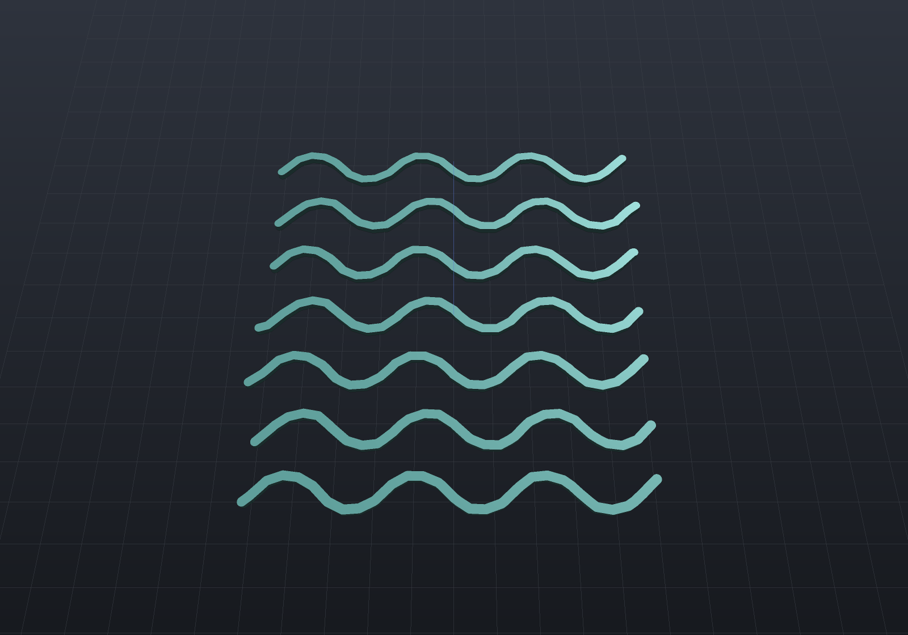

`EngrCAD.Cam` is the CAM campaign's first stage: an FDM slicer whose hard parts had already
shipped without ever being called CAM. Each layer is an **exact section** at the layer's
mid-height (`Shape.Section`'s machinery over ONE lowering — a hundred layers is not a hundred
lowerings), perimeter shells are **inward offsets** (`Region2dOffset` — successive insets *are*
the walls, wall *k*'s centreline at `bead·(k + ½)`), infill is a rectilinear scan clipped by an
**exact even-odd crossing rule** alternating ±45° per layer, and travel ordering is the shared
deterministic `RunLinker`. The G-code writer (Marlin flavour) states its modes — absolute
coordinates, absolute extrusion, millimetres — and its twin-decoder reader (`GcodeReader`)
refuses the modes it must not guess about **by name**: inches (`G20`), relative coordinates
(`G91`), relative extrusion (`M83`).

**The check with teeth is the extrusion bookkeeping identity.** Every E value in the file is
cumulative filament length with `ΔE = segment length × BeadArea / FilamentArea` (the stadium
bead cross-section — the standard model of a bead squashed under the nozzle). The decoder
re-derives *both* sides from the file alone — deposition length from the coordinates, filament
from the E deltas — so a unit slip, a lost segment or an E-mode bug is caught by arithmetic:

```csharp render:cam-slice-layer
// One layer of a drilled plate, drawn as the beads it will print: two wall shells
// (the bore gets its own), ±45° sparse infill inside them — each path stroked a hair
// under the bead width so the individual beads read.
var plate = Shape.Box(20, 15, 4) - Shape.Cylinder(3, 10);
var sliced = FdmSlicer.Slice(plate,
    new PrinterProfile(LayerHeight: 0.25, WallCount: 2, InfillDensity: 0.3));
var layer = sliced.Layers[8];

Shape Ribbons(IEnumerable<SlicePath> paths)
{
    var regions = new List<Region2d>();
    foreach (var path in paths)
    {
        var pts = path.IsClosed ? path.Points.Append(path.Points[0]).ToList() : path.Points;
        regions.AddRange(Region2dOffset.Stroke(pts, 0.35));
    }
    Shape? all = null;
    foreach (var region in Region2dBoolean.UnionAll(regions))
    {
        var sketch = Sketch.Polygon(region.Outer);
        foreach (var hole in region.Holes)
            sketch = sketch.WithHole(Sketch.Polygon(hole));
        var ribbon = Shape.Extrude(sketch, 0.25);
        all = all is null ? ribbon : all | ribbon;
    }
    return all!;
}

var scene = new Scene();
scene.Add(new Part("walls", Ribbons(layer.Paths.Where(p => p.Role == SlicePathRole.Wall)),
    Palette.Steel));
scene.Add(new Part("infill", Ribbons(layer.Paths.Where(p => p.Role == SlicePathRole.Infill)),
    Palette.Coral));
var camera = new CameraState(-Math.PI / 2, 1.15, 34, (0, 0, 0));
```


```csharp run:cam-slicing
// A drilled plate, sliced and written to G-code.
var plate = Shape.Box(20, 15, 4) - Shape.Cylinder(3, 10);
var profile = new PrinterProfile(LayerHeight: 0.25, WallCount: 2, InfillDensity: 0.3);

var sliced = FdmSlicer.Slice(plate, profile);
Console.WriteLine($"{sliced.Layers.Count} layers, "
    + $"{sliced.Layers.Sum(l => l.Paths.Count)} paths, "
    + $"deposition {sliced.DepositionLength:0} mm, "
    + $"filament {sliced.FilamentUsed:0.0} mm");

// A layer is walls (closed loops — the bore gets its own) then linked infill runs.
var layer = sliced.Layers[8];
Console.WriteLine($"layer 8 at z={layer.Z}: "
    + $"{layer.Paths.Count(p => p.Role == SlicePathRole.Wall)} wall loops, "
    + $"{layer.Paths.Count(p => p.Role == SlicePathRole.Infill)} infill runs");

// The G-code round-trips through the twin decoder, and the extrusion bookkeeping is an
// IDENTITY on the decoded values: filament == deposition length x BeadArea / FilamentArea.
string gcode = GcodeWriter.Write(sliced);
var decoded = GcodeReader.Read(gcode);
double identity = decoded.DepositionLength * profile.BeadArea / profile.FilamentArea;
Console.WriteLine($"decoded {decoded.LayerZs.Count} layers, "
    + $"filament {decoded.FilamentUsed:0.0} mm vs identity {identity:0.0} mm");
if (Math.Abs(decoded.FilamentUsed - identity) > identity * 1e-3)
    throw new Exception("the extrusion bookkeeping identity must hold");
```

## Choosing the print direction

The build orientation is a parameter, not a re-model: `Slice(shape, profile, printDirection)`
rotates the part by the **minimal rotation** taking the chosen axis to bed +Z and slices in bed
coordinates. `+Z` is the identity fast path (byte-identical to passing nothing); the antiparallel
case turns π about the codebase's one arbitrary-perpendicular convention, so it is deterministic
rather than a rounding accident; a zero direction refuses by name.

```csharp run:cam-print-direction
var bracket = Shape.Box(20, 10, 8);
var upright = FdmSlicer.Slice(bracket, new PrinterProfile(LayerHeight: 0.25));
var onSide = FdmSlicer.Slice(bracket, new PrinterProfile(LayerHeight: 0.25), new Vector3d(1, 0, 0));
Console.WriteLine($"upright: {upright.Layers.Count} layers of area "
    + $"{upright.Layers[0].Regions.Sum(r => r.Area)}");
Console.WriteLine($"on its side: {onSide.Layers.Count} layers of area "
    + $"{onSide.Layers[0].Regions.Sum(r => r.Area)}");
```

## Animating the print

A print animation needs **no re-meshing** — for planar slicing, the state of the print at any
instant is exactly the material below a plane, and a clip plane is shader state. So the
animation system's `SectionTrack` sweeps one section plane up the build direction, quantized to
the slice's own **layer count** (the reveal completes whole layers, the way a printer does), and
the whole clip rides the one-upload render batch exactly as the deformation scalar does:

```csharp animate:cam-print frames:36
var plate = Shape.Box(20, 15, 4) - Shape.Cylinder(3, 10);
var sliced = FdmSlicer.Slice(plate, new PrinterProfile(LayerHeight: 0.25));

var scene = new Scene();
scene.Add(new Part("printing", plate, Palette.Coral));

// The reveal steps layer by layer — pass the slice's own layer count.
var animation = new Animation(durationSeconds: 4)
    .With(SectionTracks.Reveal(plate.Bounds(), Vector3d.UnitZ, steps: sliced.Layers.Count));
```


The same track runs in the window (playback drives the viewport's own section state — clamp
semantics, so a finished reveal stays revealed exactly as a finished explode stays exploded), in
`RenderToImage(scene, animation, t, …)` stills (a section track's planes win over the call's
own, the camera-precedence rule applied to the clip), and in this page's APNG — one
`Animation.At(t)`, every consumer.

Three conventions carry the determinism (two slices of one shape are **byte-identical** through
the writer — a toolpath diff is how a CAM regression is caught): the infill scan is anchored to
the *global* grid, so its phase is a function of the stated spacing and never of where the part
sits; a wall loop's seam is the offset output's own first vertex — a stated convention, not
rounding luck; and walls keep their innermost-first emission order (a print-quality decision the
travel linker is deliberately not allowed to reorder — the outer wall lands on settled
neighbours).

Retraction fires only on travels of at least `MinTravelForRetraction` (island hops, not the tiny
hop between concentric shells), written as a stationary negative-E move paired with an equal
unretract so the decoder can *match* the pairs. Temperatures follow write-only-when-stated: a
profile stating `0` produces a file with no temperature commands, never a zero that would cool a
live hotend.

**First-layer adhesion is write-only-when-stated**: `BrimWidth` lays brim rings outward from
the part's own outline (a bore gets interior rings too), `SkirtLoops`/`SkirtGap` add a priming
skirt standing clear — printed skirt-first, brim outermost-in so the nozzle finishes at the
part; a profile stating neither slices byte-identically.

## Solid top and bottom shells

`TopSolidLayers`/`BottomSolidLayers` close the biggest visible gap to a real print: a spot of
a layer's infill core is SOLID skin exactly where the neighbouring N layers above (or M
below) do not cover it — a spot within N layers of air — computed as the exact
`Region2dBoolean` intersection of the neighbour window's own sections, subtracted from the
core. Skins fill at the bead spacing (100%), the sparse pattern keeps the remainder, and a
window reaching past the stack meets air, which is why the part's own top and bottom layers
come out wholly solid with no special case. Zero sparse density still lays the skins (a
hollow part keeps its lids), and a profile stating neither slices byte-identically:

```csharp run:cam-shells
// A step: the plateau's top is exposed on the right half only, so the solid/sparse
// split must land exactly at the tower's wall.
var step = Shape.Box(20, 20, 4).Translate(0, 0, 2) | Shape.Box(10, 20, 8).Translate(-5, 0, 4);
var sliced = FdmSlicer.Slice(step, new PrinterProfile(NozzleDiameter: 0.8, LayerHeight: 0.5,
    WallCount: 1, InfillDensity: 0.2, TopSolidLayers: 2, BottomSolidLayers: 2));

var under = sliced.Layers[7]; // just below the exposed plateau top
double solidX = under.Paths.Where(p => p.Role == SlicePathRole.SolidInfill)
    .SelectMany(p => p.Points).Min(p => p.X);
double sparseX = under.Paths.Where(p => p.Role == SlicePathRole.Infill)
    .SelectMany(p => p.Points).Max(p => p.X);
Console.WriteLine($"skin covers x >= {solidX:0.###}, sparse stays x <= {sparseX:0.###} "
    + "(the tower wall is at x = 0)");
foreach (var layer in new[] { sliced.Layers[0], sliced.Layers[^1] })
    Console.WriteLine($"layer {layer.Index}: "
        + $"{layer.Paths.Count(p => p.Role == SlicePathRole.SolidInfill)} skin runs, "
        + $"{layer.Paths.Count(p => p.Role == SlicePathRole.Infill)} sparse runs");
```

```csharp render:cam-shells-layer
// The same step's layer 7 as beads: solid skin (brass, at the bead spacing) on the
// exposed half, sparse fill under the tower, the split exactly at the tower wall.
var step = Shape.Box(20, 20, 4).Translate(0, 0, 2) | Shape.Box(10, 20, 8).Translate(-5, 0, 4);
var sliced = FdmSlicer.Slice(step, new PrinterProfile(NozzleDiameter: 0.8, LayerHeight: 0.5,
    WallCount: 1, InfillDensity: 0.2, TopSolidLayers: 2, BottomSolidLayers: 2));
var layer = sliced.Layers[7];

Shape Ribbons(IEnumerable<SlicePath> paths)
{
    var regions = new List<Region2d>();
    foreach (var path in paths)
    {
        var pts = path.IsClosed ? path.Points.Append(path.Points[0]).ToList() : path.Points;
        regions.AddRange(Region2dOffset.Stroke(pts, 0.7));
    }
    Shape? all = null;
    foreach (var region in Region2dBoolean.UnionAll(regions))
    {
        var sketch = Sketch.Polygon(region.Outer);
        foreach (var hole in region.Holes)
            sketch = sketch.WithHole(Sketch.Polygon(hole));
        var ribbon = Shape.Extrude(sketch, 0.5);
        all = all is null ? ribbon : all | ribbon;
    }
    return all!;
}

var scene = new Scene();
scene.Add(new Part("walls", Ribbons(layer.Paths.Where(p => p.Role == SlicePathRole.Wall)),
    Palette.Steel));
scene.Add(new Part("skin", Ribbons(layer.Paths.Where(p => p.Role == SlicePathRole.SolidInfill)),
    Palette.Brass));
scene.Add(new Part("sparse", Ribbons(layer.Paths.Where(p => p.Role == SlicePathRole.Infill)),
    Palette.Sage));
var camera = new CameraState(-Math.PI / 2, 1.15, 36, (0, 0, 0));
```


## Infill patterns

`InfillPattern` picks the sparse fill's family, and every member holds the stated density by
scaling its spacing to its direction count (grid lays two directions at twice the spacing,
triangles three at three times — a density means one thing across the family): rectilinear,
grid, triangles, concentric loops, **gyroid** — the TPMS level set sectioned at each layer's
own z, the implicit engine's surface, genuinely three-dimensional and self-supporting — and
**Hilbert**, the landed `SpaceFillingInfill` machinery as a print pattern.

```csharp render:cam-infill-gyroid
// Gyroid infill on one layer, drawn as beads: the pattern changes with z because it IS
// a 3D surface's section, not a per-layer recipe.
var box = Shape.Box(24, 24, 4);
var sliced = FdmSlicer.Slice(box, new PrinterProfile(NozzleDiameter: 0.8, LayerHeight: 0.5,
    WallCount: 1, InfillDensity: 0.25, InfillPattern: InfillPattern.Gyroid));
var layer = sliced.Layers[3];

Shape Ribbons(IEnumerable<SlicePath> paths)
{
    var regions = new List<Region2d>();
    foreach (var path in paths)
        regions.AddRange(Region2dOffset.Stroke(path.Points, 0.5));
    Shape? all = null;
    foreach (var region in Region2dBoolean.UnionAll(regions))
    {
        var sketch = Sketch.Polygon(region.Outer);
        foreach (var hole in region.Holes)
            sketch = sketch.WithHole(Sketch.Polygon(hole));
        var ribbon = Shape.Extrude(sketch, 0.4);
        all = all is null ? ribbon : all | ribbon;
    }
    return all!;
}

var scene = new Scene();
scene.Add(new Part("infill", Ribbons(layer.Paths.Where(p => p.Role == SlicePathRole.Infill)),
    Palette.Teal));
var camera = new CameraState(-Math.PI / 2, 1.15, 42, (0, 0, 0));
```



## Spiral vase, seams, wall order

**Spiral vase** (`SpiralVase`) prints one continuous helical wall: above the base layers the
single perimeter's z RAMPS along its own arc length, ending exactly at each layer's top, so
the whole part is one unbroken extrusion. Its contradictions refuse by name (a second wall,
infill, top skins, supports — each names what to state instead), as does any layer that is
not a single unholed island. **`SeamPosition`** rotates each closed wall's start: `Rear`
collects seams at the back, `Aligned` pins them to a fixed per-part anchor so they line up
vertically. **`ExternalPerimetersFirst`** inverts the wall order — the stated trade: outer
first buys dimensional accuracy, inner first overhangs.

## Cooling, the volumetric cap, z-hop

A layer quicker than `MinLayerTime` slows every deposition on it by one factor (floored at
`MinPrintSpeed`) so the plastic below cools before the next layer lands — the time read from
the same speeds the estimator uses. `FanSpeed`/`FanOffLayers` write `M106` once the first
layers have adhered (0 writes nothing). `MaxVolumetricFlow` is a hard ceiling applied LAST
(`speed ≤ cap / BeadArea` — the machine's melt limit outranks every stated speed).
`ZHop` lifts retracted travels and drops back before the unretract.

## Dimensional compensations

`ElephantFootCompensation` insets layer 0 (the squashed first layer bulges out),
`XYCompensation` offsets every section (signed), and `HoleCompensation` grows only the
holes — printed holes come out small. Each is applied to the stored sections, so walls,
skins and supports all read one geometry.

## Supports from the overhang field

Supports follow the same opt-in convention: `SupportOverhangAngle` states the threshold
(0 = off — a profile stating nothing slices byte-identically). Overhang facets are detected
on the **oriented** part's own mesh by the `Manufacturability` rule — the threshold compared
on the *dot product*, never on a derived angle, so a wall built at exactly 45° is not an
overhang at a 45° threshold — projected to the bed and unioned. Each layer then holds columns
under whatever overhang material is still **above** it (a facet partly below the layer plane
contributes only its clipped upper part, so a slanted overhang's supports track its own
height), minus the part's section grown by `SupportGap` so a column never fuses to a wall,
patterned as sparse one-direction breakaway lines at `SupportSpacing`:

```csharp run:cam-supports
// A table: a slab on a column — the underside overhangs everywhere but the column contact.
var table = Shape.Box(4, 10, 8).Translate(0, 0, 4) | Shape.Box(20, 10, 2).Translate(0, 0, 9);
var profile = new PrinterProfile(NozzleDiameter: 0.8, LayerHeight: 0.5,
    SupportOverhangAngle: 45);

var sliced = FdmSlicer.Slice(table, profile);
var supported = sliced.Layers.Where(
    l => l.Paths.Any(p => p.Role == SlicePathRole.Support)).ToList();
Console.WriteLine($"{supported.Count} of {sliced.Layers.Count} layers carry supports, "
    + $"from the bed up to z={supported[^1].Z} (the slab's underside is at z=8)");

// A support column stands clear of the part: the nearest support point to the column's
// wall keeps the stated XY gap, so the breakaway material breaks away.
double nearest = supported.SelectMany(l => l.Paths)
    .Where(p => p.Role == SlicePathRole.Support)
    .SelectMany(p => p.Points)
    .Min(p => Math.Max(Math.Abs(p.X) - 2, 0));
Console.WriteLine($"nearest support to the column wall: {nearest:0.00} mm "
    + $"(SupportGap = {profile.SupportGap})");
```

A facet resting on the bed excludes itself with no special case — nothing of it is above any
layer's top, so no layer ever finds material to support — which is why a plain box with
supports *stated* still writes byte-identical G-code. The part's own bottom face is not an
overhang; it is the print.

**The support stack is complete now**: `SupportZGap` leaves a stated layer of air under the
overhang so the support breaks away cleanly (the columns stop exactly `gap` short of the
underside, pinned by test); `SupportInterfaceLayers` densify and turn perpendicular near the
contact, so the part's first layer lands on a tighter grid; `RaftLayers`/`RaftMargin` print a
sacrificial base under the part *and its supports* (the part lifts by the raft's height while
its geometry stands still, and the skirt/brim move to the raft's own first layer); and
`FdmSupportModifiers` is the code-first paint-on support — BLOCKER shapes mask support
generation over their own sectioned volume, ENFORCER shapes force support under any
downward-facing facet inside them, threshold or no threshold (the test's mutation: a 45°
chamfer that a 50° threshold ignores gains supports exactly where the enforcer covers it).

```csharp render:cam-support-columns
// The support pattern is grid-anchored, so every layer lays the same lines: stroking ONE
// layer's support runs and extruding them bed-to-underside shows the printed support
// walls, standing the XY gap clear of the column.
var table = Shape.Box(4, 10, 8).Translate(0, 0, 4) | Shape.Box(20, 10, 2).Translate(0, 0, 9);
var sliced = FdmSlicer.Slice(table, new PrinterProfile(NozzleDiameter: 0.8, LayerHeight: 0.5,
    InfillDensity: 0, SupportOverhangAngle: 45));

var regions = new List<Region2d>();
foreach (var path in sliced.Layers[4].Paths.Where(p => p.Role == SlicePathRole.Support))
    regions.AddRange(Region2dOffset.Stroke(path.Points, 0.6));
Shape? walls = null;
foreach (var region in Region2dBoolean.UnionAll(regions))
{
    var sheet = Shape.Extrude(Sketch.Polygon(region.Outer), 8);
    walls = walls is null ? sheet : walls | sheet;
}

var scene = new Scene();
scene.Add(new Part("table", table, Palette.Steel) { DisplayMode = DisplayMode.Translucent });
scene.Add(new Part("supports", walls!, Palette.Coral));
var camera = new CameraState(-Math.PI / 2 + 0.6, 0.5, 42, (0, 0, 5));
```


## Per-feature speeds and the print-time bracket

Each path role can carry its own speed (`WallSpeed`/`InfillSpeed`/`SolidInfillSpeed`/
`SupportSpeed`, with `FirstLayerSpeed` winning on layer 0 whatever the role — adhesion wants
slow), resolved by the profile's ONE `SpeedFor` rule the writer reads; stating nothing
resolves everything to `PrintSpeed` byte-identically, and the tests pin the stronger form —
a profile stating speeds differs from the baseline **only in its F words**.

`PrintTime.Estimate` reads the **decoded** program (what the file says, exactly as the
printer will) and answers with an honest bracket: the lower bound runs every move at its own
feed (infinite acceleration), the upper accelerates every move from rest by the closed-form
trapezoid — `d/v + v/a` when the move reaches full speed, `2·√(d/a)` when it stays
triangular — with the real firmware between, depending on junction handling (the filed
refinement narrows the bracket; it cannot move its ends):

```csharp run:cam-time
var slab = Shape.Box(8, 8, 3) | Shape.Box(20, 15, 3).Translate(0, 0, 3);
var profile = new PrinterProfile(NozzleDiameter: 0.8, LayerHeight: 0.5,
    InfillDensity: 0.2, TopSolidLayers: 2, BottomSolidLayers: 2, SupportOverhangAngle: 45,
    WallSpeed: 30, InfillSpeed: 60, SolidInfillSpeed: 45, FirstLayerSpeed: 15);

var decoded = GcodeReader.Read(GcodeWriter.Write(FdmSlicer.Slice(slab, profile)));
var estimate = PrintTime.Estimate(decoded, acceleration: 500);
Console.WriteLine($"print time between {estimate.MinSeconds / 60:0.0} and "
    + $"{estimate.MaxSeconds / 60:0.0} minutes at 500 mm/s2");
```

## Variable layer height

`Slice` takes an explicit bottom-up `layerHeights` table (each height printable, the table
covering the part — both refused by name), and `FdmSlicer.AdaptiveLayerHeights` derives one
from the **stair-step cusp criterion**: a facet of unit normal n stepped by a layer of height
h leaves a cusp of `h·|n_z|`, so bounding the cusp gives `h ≤ cusp/|n_z|` — near-horizontal
surfaces take thin layers, vertical walls the maximum, and the cusp height is a **required
engineering input** (it *is* the stated surface quality; a default would be a print-quality
decision made by a library). The extrusion arithmetic goes per-layer — each layer's E reads
its own stadium cross-section — and the test with teeth asserts both directions: the slicer's
height-aware filament total matches the decoder, and the naive single-ratio identity
*fails* on a mixed-height print, or the table did nothing.

```csharp run:cam-adaptive-layers
// A sphere: vertical at the equator, flattening toward the poles.
var heights = FdmSlicer.AdaptiveLayerHeights(
    Shape.Sphere(8), minHeight: 0.1, maxHeight: 0.4, cuspHeight: 0.1);
Console.WriteLine($"{heights.Count} layers from {heights.Min():0.###} to "
    + $"{heights.Max():0.###} mm (uniform at 0.4 would take {Math.Ceiling(16 / 0.4)})");
Console.WriteLine($"equator {heights[heights.Count / 2]:0.###}, "
    + $"top {heights[^1]:0.###} — thin where the surface flattens");

var sliced = FdmSlicer.Slice(Shape.Sphere(8),
    new PrinterProfile(NozzleDiameter: 0.8, LayerHeight: 0.4, WallCount: 1),
    layerHeights: heights);
Console.WriteLine($"sliced: {sliced.Layers.Count} layers, filament {sliced.FilamentUsed:0} mm");
```

## Fuzzy skin, snippets, plates and the filament bill

**Fuzzy skin** (`FuzzySkinThickness`/`FuzzySkinSpacing`) resamples the OUTERMOST wall and
displaces it ± half the thickness along its local normal by a **deterministic hash** of
(layer, point index) — the pattern-phase rule applied to noise: two slices of one shape are
byte-identical, no clock or RNG state exists to drift, layer 0 and inner shells stay
untouched bit-for-bit. **Custom G-code snippets** (`StartGcode`/`LayerChangeGcode`/`EndGcode`)
pass through with `{layer}`/`{z}` substituted — and the twin decoder still reads the file, so
a snippet smuggling `G91` or `G20` in refuses there by name rather than silently corrupting
the geometry. **`SlicedPart.FilamentByRole`** splits the filament bill per role (walls vs
infill vs supports vs skins vs ironing — they sum to `FilamentUsed` exactly, flow included).

**Multi-part plates** ride the landed `Packing` machinery: `FdmPlating.Plate(parts, w, d,
gap)` arranges the parts (shelf packing, or outline nesting via `PackOptions`), rests each on
the bed plane, and returns ONE shape the slicer takes whole — disjoint parts section into
disjoint islands, so walls, brims, skins and supports all work per island with nothing new,
and the plate that runs out of room refuses loudly naming the part (the packer's own rule):

```csharp run:cam-plating
var plate = FdmPlating.Plate(
    [Shape.Box(20, 15, 4), Shape.Box(15, 15, 6), Shape.Cylinder(8, 5)],
    bedWidth: 120, bedDepth: 120, gap: 6);
var sliced = FdmSlicer.Slice(plate, new PrinterProfile(NozzleDiameter: 0.8, LayerHeight: 0.5,
    InfillDensity: 0.2, TopSolidLayers: 2, BottomSolidLayers: 2, BrimWidth: 2));
Console.WriteLine($"{sliced.Layers[0].Regions.Count} parts on the plate, "
    + $"{sliced.Layers.Count} layers, filament {sliced.FilamentUsed:0} mm");
foreach (var (role, filament) in sliced.FilamentByRole.OrderByDescending(r => r.Value))
    Console.WriteLine($"  {role,-12} {filament,8:0.0} mm");
```

## Bridges, monotonic skins, ironing

`DetectBridges` finds skin the layer *directly* below leaves in air (never the first layer —
the bed is not air) and fills it solid along the region's own long axis at `BridgeSpeed`, so
the strands span anchor to anchor. `MonotonicSkins` keeps skin runs in scanline order, all
one direction, never linked or reversed — overlaps always shingle the same way and the top
reads as one sheet. `IroningFlow`/`IroningSpacing` add a low-flow smoothing sweep over the
*top-exposed* skin only, appended after everything else on the layer; the decoder sees the
reduced flow, and the extrusion identity generalises to `Σ length·flow` exactly.

**What genuinely remains** (each filed in the PrusaSlicer-parity backlog with its reason):
Arachne variable-width perimeters, gap fill and thin walls, lightning infill and tree
supports (the research-grade trio), multi-material and the wipe tower, per-feature widths
and accelerations, arc moves (`G2`/`G3` join with the CNC stages), G-code flavours and
`.bgcode`, and non-planar slicing (deliberately last — it inherits the exp-map machinery's
reported distortion). `RetractionExtraRestart` is filed
WITH a reason rather than built: pushing unmatched extra filament breaks the matched
retract-pair contract the twin decoder verifies, and the identity is worth more than the
knob.
