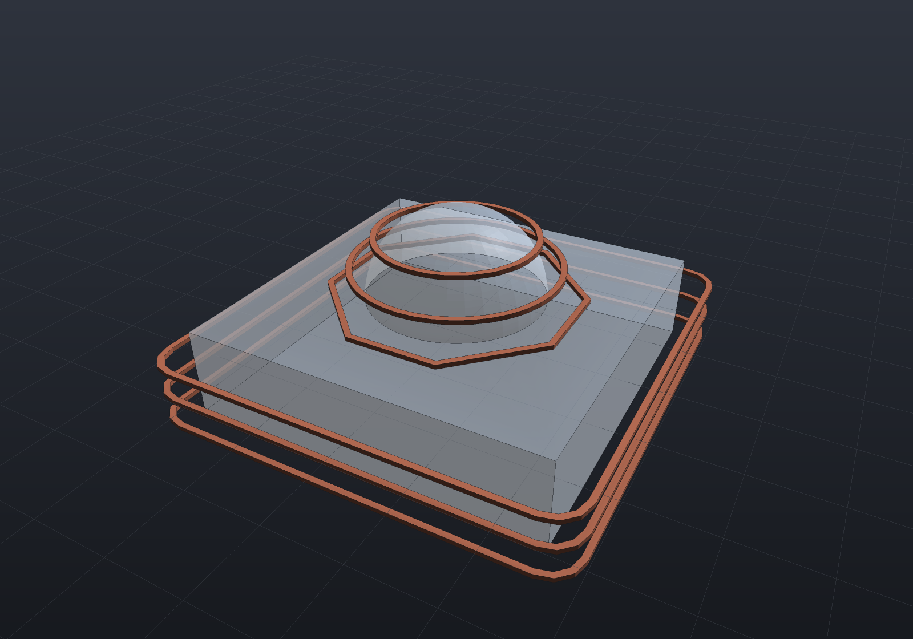
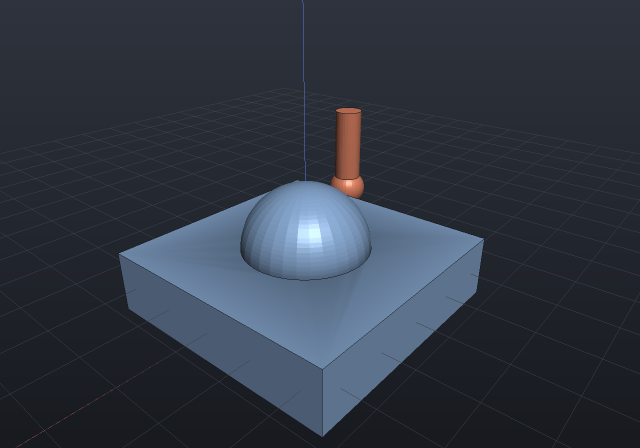

Stage 3 of the CAM campaign — ball-nose finishing — is where the implicit engine pays
directly. **The cutter-location surface of a ball-nose tool IS the field's r-offset**: a ball
of radius *r* touches the part exactly when its centre is at distance *r* from the surface. So
both strategies read the shape's own SDF (`Shape.ToImplicit()`) instead of approximating an
offset mesh:

- **Raster** (parallel finishing) drops the tool at each sample by a **sphere trace** down the
  vertical ray to the r-isolevel. The field's 1-Lipschitz bound makes that gouge-free *by
  construction* — a step of `sdf − r` can never cross the offset surface, so a stalled trace
  stops **high** (stock left, never a gouge). Rows are serpentine, grid-anchored (the slicer's
  phase rule), and extend a tool radius past the part so the edge is machined.
- **Waterline** (constant-z contouring) is the observation that the CL contour at a centre
  plane **is the SDF's r-isolevel there** — `SdfContours.OnPlane`'s marching squares, chained
  into loops by its exact endpoint equality, then polished onto the isolevel by an *in-plane*
  Newton step (the correction must not leave the plane, or the pass stops being a waterline).
  On the steep walls waterline exists for, the path is exact to round-off.

```csharp run:cam-surfacing
// A dome on a plate, finished with a 4 mm ball-nose.
var part = Shape.Box(24, 24, 6) | Shape.Sphere(6).Translate(0, 0, 3);
var ball = new MillTool(Diameter: 4, StepDown: 2);

var raster = CncSurfacing.Raster(part, ball);
var waterline = CncSurfacing.Waterline(part, ball);
Console.WriteLine($"raster: {raster.Passes.Count} rows, cut length {raster.CutLength:0} mm; "
    + $"waterline: {waterline.Passes.Count} contours on "
    + $"{waterline.Passes.Select(p => p.Points[0].Z).Distinct().Count()} levels");

// The no-gouge claim is the field's own inequality: every ball CENTRE reads at least r.
var sdf = part.ToImplicit();
double worst = raster.Passes.SelectMany(p => p.Points)
    .Min(p => sdf.Evaluate(new Vector3d(p.X, p.Y, p.Z + ball.Radius)));
Console.WriteLine($"worst centre clearance {worst:0.#####} against r = {ball.Radius}");

// The scallop between rows is a chord identity — h = r − sqrt(r² − (s/2)²) — and the
// stepover for a stated finish is its exact inverse.
double s = ball.Stepover * ball.Diameter;
Console.WriteLine($"scallop at a {s} mm stepover: {CncSurfacing.ScallopHeight(ball.Radius, s):0.###} mm; "
    + $"a 0.01 mm finish needs {CncSurfacing.StepoverForScallop(ball.Radius, 0.01):0.###} mm");

// The same CncGcodeWriter carries surfacing passes — a move's meaning is its shape.
string gcode = CncGcodeWriter.Write([raster, waterline], safeZ: 15);
Console.WriteLine($"{gcode.Split('\n').Length} lines of G-code");
```

```csharp render:cam-waterline-rings
// The waterline contours in place: one CL loop per StepDown level, each an exact
// r-isolevel of the part's own field, drawn at its tip height over the translucent part.
var part = Shape.Box(24, 24, 6) | Shape.Sphere(6).Translate(0, 0, 3);
var ball = new MillTool(Diameter: 4, StepDown: 2);
var waterline = CncSurfacing.Waterline(part, ball);

Shape? rings = null;
foreach (var pass in waterline.Passes.Where(p => p.IsClosed))
{
    var pts = pass.Points.Select(p => new Vector2d(p.X, p.Y)).ToList();
    pts.Add(pts[0]);
    foreach (var r in Region2dBoolean.UnionAll([.. Region2dOffset.Stroke(pts, 0.4)]))
    {
        var sketch = Sketch.Polygon(r.Outer);
        foreach (var hole in r.Holes)
            sketch = sketch.WithHole(Sketch.Polygon(hole));
        var ring = Shape.Extrude(sketch, 0.3, SketchPlane.At(
            new Vector3d(0, 0, pass.Points[0].Z), Vector3d.UnitX, Vector3d.UnitY));
        rings = rings is null ? ring : rings | ring;
    }
}

var scene = new Scene();
scene.Add(new Part("part", part, Palette.Steel) { DisplayMode = DisplayMode.Translucent });
scene.Add(new Part("waterlines", rings!, Palette.Coral));
var camera = new CameraState(-Math.PI / 2 + 0.5, 0.55, 52, (0, 0, 1));
```



```csharp animate:cam-surfacing-tool frames:36
// The ball-nose riding its raster rows over the dome — the tool part's tip is at its
// origin, so following the pass points puts the tip on the cutter-location surface.
var part = Shape.Box(24, 24, 6) | Shape.Sphere(6).Translate(0, 0, 3);
var ball = new MillTool(Diameter: 4);
var raster = CncSurfacing.Raster(part, ball, sampleStep: 1);

var scene = new Scene();
scene.Add(new Part("part", part, Palette.Steel));
// The shank is slimmer than the ball on purpose: an equal-radius coaxial shank is
// tangent to the sphere along its equator, exactly the coincident curved input the
// B-Rep boolean refuses by name.
scene.Add(new Part("ball",
    Shape.Sphere(2).Translate(0, 0, 2) | Shape.Cylinder(1.4, 9).Translate(0, 0, 6.5),
    Palette.Coral));

// A handful of rows across the dome keeps the motion legible at 36 frames.
var rows = raster.Passes.Skip(raster.Passes.Count / 2 - 3).Take(6);
var waypoints = rows.SelectMany(p => p.Points).ToList();
var animation = new Animation(durationSeconds: 6)
    .With(PathTracks.Follow(scene, "ball", waypoints));
```



The accuracy split is stated rather than averaged: a raster tip is exact to the trace
tolerance everywhere (a flat top reads the face's own height to 1e-6; the dome apex is touched
at its own height, because the global grid anchors a sample at exactly (0, 0)); a waterline
point is exact where the wall is steep — the case waterline is *for* — and honest to the
marching-squares crossing error where the contour crosses a near-horizontal region, where no
in-plane direction changes the field. Where the field is a correct-sign **lower bound** (a CSG
difference near its subtracted tool's fictitious faces), the r-isolevel lies farther from the
part than the true offset — stock left, never a gouge: the conservative direction, inherited
from the field contract rather than arranged.

Passes are in the **shape's own coordinates** (the G-code z word is the tool *tip*, the
machining convention), and the writer is the stage-2 `CncGcodeWriter` unchanged — a move's
meaning is its shape, so an XYZ-combined raster move cuts at the feed rate with nothing new.

## Flat and bull-nose cutters

Raster takes a `MillCutter` — ball-nose, flat end, or bull-nose — and the routing records an
**overturned prediction**: the backlog filed flat/bull as "the rounded-cone distance the SDF
vocabulary already spells", and it does not survive contact with the arithmetic. A
flat-bottomed tool's cutter-location condition is a *minimum over its disc* of the field, and
certifying a minimum to ε through a 1-Lipschitz oracle takes Ω((a/ε)²) evaluations wherever
the field is horizontally flat — which is not the hostile case but the **common** one (every
plateau a flat cutter exists to finish). The ball is special precisely because its disc is a
point. So flat and bull-nose ride the **tessellation** with per-mode contact arithmetic — the
textbook drop-cutter: a vertex lifts the tip by the bottom profile exactly, an edge maximizes
over a bracketed 1D scan (a torus–line tangency is a quartic), a face's contact is closed
form (`ρ* = a + r·s/√(1+s²)`) — while a ball-nose cutter keeps the exact implicit route
byte-for-byte.

```csharp run:cam-flat-cutter
var dome = Shape.Sphere(10);
var tool = new MillTool(8, StepDown: 2);
var flat = CncSurfacing.Raster(dome, tool, cutter: MillCutter.FlatEnd(8));
var ball = CncSurfacing.Raster(dome, tool);
double At(MillOperation op, double x) => op.Passes
    .SelectMany(p => p.Points).First(p => Math.Abs(p.X - x) < 1e-9 && p.Y == 0).Z;
// The flat spot: with the apex under the disc the tip sits AT the apex — exactly —
// where a ball rolls off. Past the disc the rim rides the dome (the APT closed form).
Console.WriteLine($"over the apex offset 2: flat {At(flat, 2):0.####}  ball {At(ball, 2):0.####}");
Console.WriteLine($"rim contact at 6: {At(flat, 6):0.####} vs closed form "
    + $"{Math.Sqrt(100 - 2 * 2):0.####} (inscribed mesh: low, never high)");
```

The oracles are equalities where the geometry makes them possible: the apex vertex sits under
the flat disc where the bottom profile is exactly zero, so the flat spot is `z == S`
*exactly*; a flat plate reads its own top exactly out to one disc radius past the edge (the
edge mode); and a ball pushed through the **mesh** route agrees with the exact field route to
the chord error — two constructions of one surface checking each other, with the band
honestly slope-amplified near the silhouette (`dz/dd` diverges there). Waterline carries them
too, as the **silhouette-dilation contour**: at each tip level the collision region is the
part's XY silhouette above the tip plane dilated by the tool — exact against the mesh for a
flat cutter (the disc collides with exactly the material above its own plane within R) — and
for a bull-nose a **banded conservative ladder**: the corner torus's reach grows with height
above the tip, so band k clips the mesh above `z + r·k/K` and grows by the band's *outer*
reach, over-covering its own slice — the contour stands off at least the true CL distance,
stock never gouge. On a 45° cone the three-sided oracle separates the answers: the banded
standoff addend measures its own closed form 3.661 (Ø8 r1, K = 4), above the exact
`a + r(√2 − 1) = 3.414` and measurably under the sharp envelope's 4.0.

Raster rows run along a stated `rasterAngleDegrees` (both cutter routes, one grid rule):
the grid anchors in the **rotated frame** — the phase rule, a pattern being a function of
the stated spacing and angle, never of where the part sits — and a quarter turn is **exact**
(a sign swap, never a `cos`), so a 90° raster is the transposed grid to the last bit.

Raster rows **link without a retract** (`linkRows: true`, both cutter routes through the
one serpentine rule): the rows merge into one pass, the connecting stretch between a row's
end and the next row's start sampled *on* the cutter-location surface through the same
drop — the link carries exactly the fidelity a within-row chord does, and one plunge
replaces one per row.

## Holder collision (`CncHolder`)

The holder is modelled as a **flat disc** of the holder diameter whose bottom rides
`StickoutLength` above the tool tip — the conservative envelope of any real tapered holder
— so a pass point collides exactly when the surface under the disc reaches above
`cl.z + stickout`, which is the *flat drop-cutter question at the holder's own radius*:
the check rides the same vertex/edge/face contact arithmetic the flat cutter rides, so the
holder check and the flat cutter cannot disagree about what a disc touches.

The deliverable is `MinimumStickout` — the smallest stickout that clears every pass point
— and at exactly that stickout the setup **passes** (zero clearance is resting contact,
not a collision). The check runs against the *finished* part, stated rather than hidden:
in-process stock is more material, so it is exact for finishing passes (where holder
collisions live) and a lower bound for roughing.

```csharp run:cam-holder
var part = Shape.Box(100, 60, 6).Translate(0, 0, -3)
    .Union(Shape.Box(10, 10, 12).Translate(20, 0, 6));
var finish = CncSurfacing.Raster(part, new MillTool(6), sampleStep: 2);
var report = CncHolder.Check(part, finish, new ToolHolder(Diameter: 20, StickoutLength: 8));
Console.WriteLine($"stickout 8: {report.Collisions.Count} collisions, "
    + $"minimum stickout {report.MinimumStickout:0.######}");
Console.WriteLine($"worst deficit {report.Collisions.Max(c => c.Deficit):0.###} "
    + "(how far the disc reaches into the part)");
var fixedUp = CncHolder.Check(part, finish, new ToolHolder(20, report.MinimumStickout));
Console.WriteLine($"at the reported minimum: {(fixedUp.Ok ? "clear" : "still colliding")}");
```

One number in that fixture is worth knowing about: the raster runs one grid step past the
part bounds, and there the ball's CL dips *below* the top face as it wraps the outer edge
(exactly `√(r² − d²) − r`, −1 at a corner sampled √5 away in XY) — so a boss that a rim
point's disc can reach adds that dip to the minimum stickout, and the honest closed form
stops being the obstacle height. Real setup arithmetic, and exactly the kind a machinist
eyeballing "boss height plus a bit" misses the same way.

**Not in stage 3** (each filed in the campaign): adaptive stepover from local curvature,
and HSM adaptive clearing (stage 4). Rest machining landed on the milling page; the
flat/bull waterline above landed as the silhouette-dilation contour.
