`Chamfer(setback, faceSelector)` and `Fillet(radius, faceSelector)` are rim features:
they operate on the closed outer rim of planar faces picked by a **LINQ face
selector** running over the lowered B-Rep solid (`EngrCAD.BRep.BrepQueries` is the
selection vocabulary).

```csharp render:chamfer-fillet
var plate = Shape.Extrude(Sketch.RoundedRectangle(36, 26, 5), 8)
    .Fillet(2.5, s => s.PlanarFacesWithNormal(Vector3d.UnitZ))     // smooth top rim
    .Chamfer(1.5, s => s.PlanarFacesWithNormal(-Vector3d.UnitZ));  // beveled base

var scene = new Scene();
scene.Add(new Part("plate", plate, Palette.Steel));
```

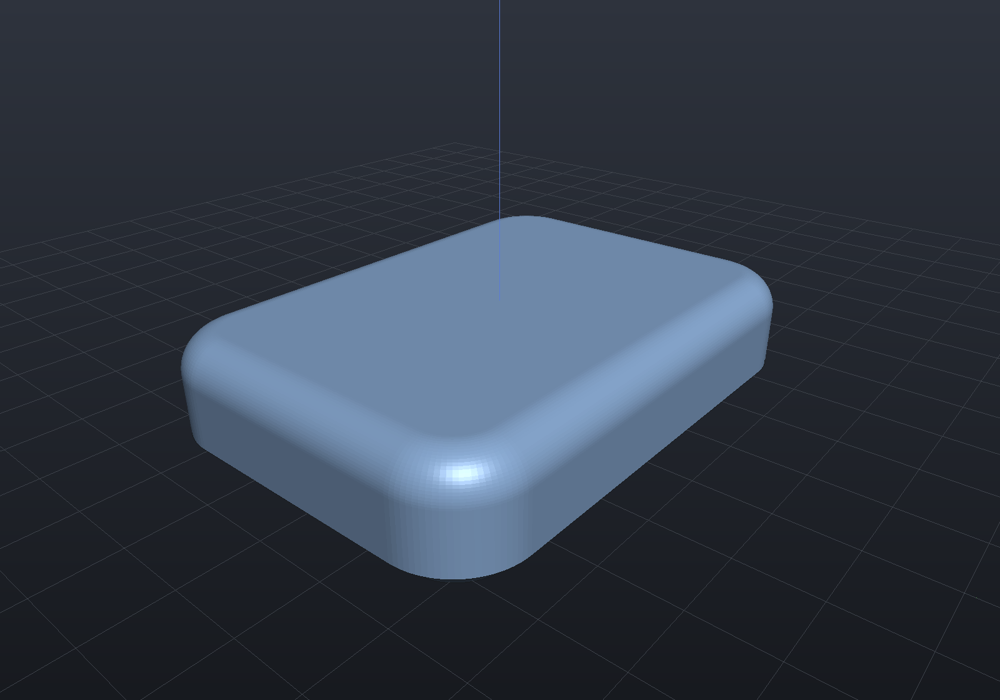

Circular rims get exact cone bands (chamfer) and torus bands (fillet):

```csharp render:chamfer-fillet-round
var boss = Shape.Cylinder(16, 10).Translate(0, 0, 5)
    .Fillet(3, s => s.PlanarFacesWithNormal(Vector3d.UnitZ));

var washer = (Shape.Cylinder(16, 6) - Shape.Cylinder(6, 20)).Translate(0, 0, 3)
    .Chamfer(1.5, s => s.PlanarFacesWithNormal(Vector3d.UnitZ));

var scene = new Scene();
scene.Add(new Part("filleted boss", boss, Palette.Brass,
    Matrix4d.CreateTranslation((-22, 0, 0))));
scene.Add(new Part("chamfered washer", washer, Palette.Steel,
    Matrix4d.CreateTranslation((22, 0, 0))));
```

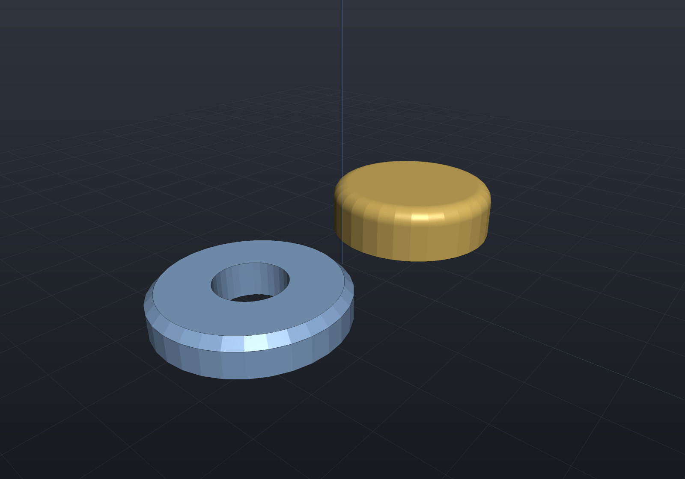

## Sharp corners

A fillet does **not** need its rim rounded first. Where two straight edges meet at a
sharp corner, the band mitres on an exact ellipse — for convex and reflex corners
alike, so an L-bracket works as readily as a box:

```csharp render:fillet-sharp-corners
Func<BrepSolid, IEnumerable<BrepFace>> top = s => s.PlanarFacesWithNormal(Vector3d.UnitZ);

var box = Shape.Box(24, 18, 8).Fillet(2.5, top);

// Reflex corner: the inner corner of an L is filleted by the same construction.
var el = Shape.Extrude(
    Sketch.Start(0, 0).LineTo(24, 0).LineTo(24, 9).LineTo(9, 9).LineTo(9, 18)
                      .LineTo(0, 18).Close(), 8)
    .Fillet(2, top);

var scene = new Scene();
scene.Add(new Part("box", box, Palette.Steel, Matrix4d.CreateTranslation((-16, 0, 0))));
scene.Add(new Part("L", el, Palette.Brass, Matrix4d.CreateTranslation((4, -9, 0))));
```

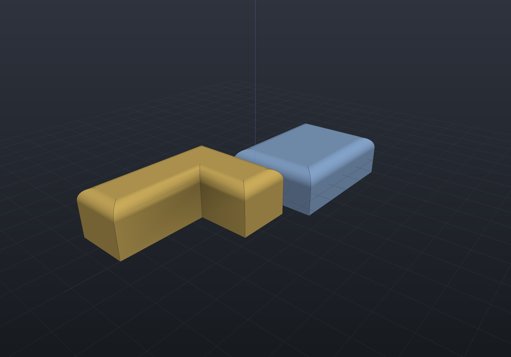

Why an ellipse and not a sphere: at a rim corner only **two** of the three edges are
blended — the two side faces keep their shared sharp edge — so the two quarter
cylinders meet in a crease. Two equal-radius cylinders whose axes intersect form a
bicylinder, and a bicylinder's intersection is an ellipse.

## Selecting edges instead of faces

`FilletEdges` / `ChamferEdges` take an **edge** selector. Any LINQ over the solid's
edges works — `RimEdges()`, `IsLinear`, `IsCircular`, `ConvexEdges()`:

```csharp render:fillet-edge-selection
var plate = Shape.Box(30, 20, 6)
    .FilletEdges(2, s => s.PlanarFacesWithNormal(Vector3d.UnitZ).SelectMany(f => f.RimEdges()))
    .ChamferEdges(1, s => s.PlanarFacesWithNormal(-Vector3d.UnitZ).SelectMany(f => f.RimEdges()));

var scene = new Scene();
scene.Add(new Part("plate", plate, Palette.Sage));
```

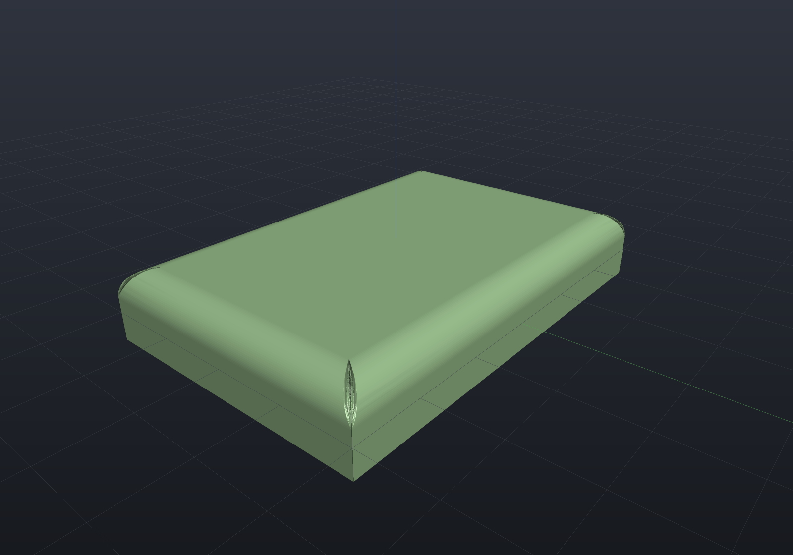

The selection is resolved back to the rim features that reproduce it exactly: complete
rims take rim surgery, and a selection that stops **part-way along a rim** becomes a
terminated run — the band stops at the run's end vertex with a **setback termination**,
a planar face perpendicular to the edge there. It is exact because the band's
cross-section is already planar (a quarter arc for fillets, a segment for chamfers),
and it is the industry-default stop; cliff and vertex-blend terminations remain
refused. The rest of the rim keeps its sharp corners:

```csharp render:fillet-partial-run
var plate = Shape.Box(36, 24, 8)
    .FilletEdges(3, s => s.PlanarFacesWithNormal(Vector3d.UnitZ)
        .SelectMany(f => f.RimEdges())
        .Where(e => e.IsLinear(out var a, out var b) && a.Y + b.Y < -23));

var scene = new Scene();
scene.Add(new Part("partial run", plate, Palette.Steel));
```

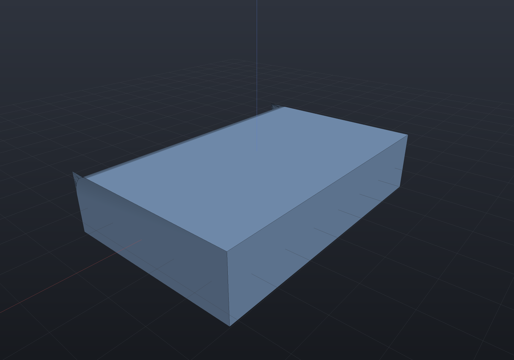

The whole selection is still grouped and validated *before* any surgery runs (rim
surgery rewrites loops in place, so validating up front is what keeps a refusal from
leaving a half-edited solid): runs must be contiguous, start and end on straight edges,
and stay clear of other selected rims and runs — three blended edges meeting at one
vertex is the spherical-corner shape that belongs to `FilletAllEdges`.

## Chamfer by distance and angle

`ChamferAtAngle(setback, degrees)` measures the setback **in** the selected face and
the angle **from** it — the machinist's spelling. 45° reproduces the symmetric chamfer:

```csharp render:chamfer-angle
var scene = new Scene();
double x = -30;
foreach (int angle in new[] { 20, 45, 70 })
{
    var block = Shape.Box(18, 18, 8)
        .ChamferAtAngle(2.5, angle, s => s.PlanarFacesWithNormal(Vector3d.UnitZ));
    scene.Add(new Part($"{angle} deg", block, Palette.Steel,
        Matrix4d.CreateTranslation((x, 0, 0))));
    x += 24;
}
```

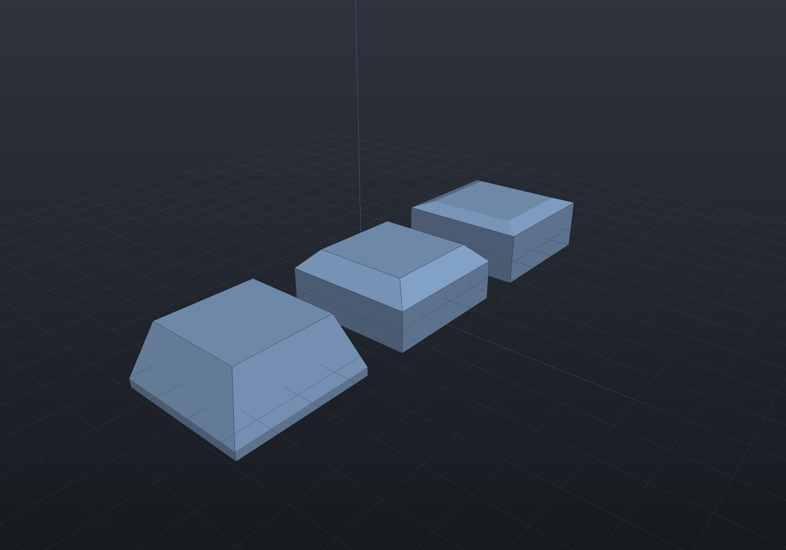

## Variable-setback chamfers

`Chamfer(setbackAt, faceSelector)` takes a **law** instead of a number: it is evaluated
at each rim corner (of the lowered solid, so transforms are visible) and the setback
interpolates linearly along each edge. The result is still exact everywhere — a
linearly varying inset of a straight edge is still a straight line, so miters stay
exact intersections and every strip stays an exact plane:

```csharp render:chamfer-variable
// The chamfer grows from 0.8 at the left end of the slot to 1.4 at the right.
var boss = Shape.Extrude(Sketch.Slot(36, 12), 8)
    .Chamfer(p => 1.1 + 0.025 * p.X, s => s.PlanarFacesWithNormal(Vector3d.UnitZ));

var wedgeCut = Shape.Box(30, 20, 8)
    .ChamferAtAngle(p => 1 + 0.08 * (p.X + 15), 60,
        s => s.PlanarFacesWithNormal(Vector3d.UnitZ));

var scene = new Scene();
scene.Add(new Part("slot boss", boss, Palette.Steel,
    Matrix4d.CreateTranslation((0, 14, 0))));
scene.Add(new Part("wedge chamfer", wedgeCut, Palette.Brass,
    Matrix4d.CreateTranslation((0, -14, 0))));
```

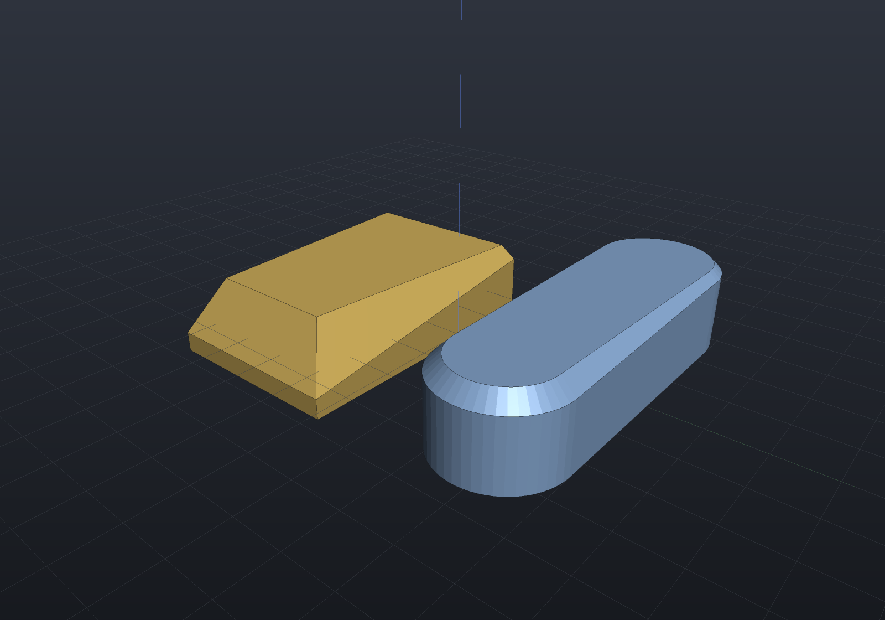

Two rules keep it exact, both enforced loudly: an **arc** rim edge needs the law
constant along the arc, and a **full circular rim** needs it constant everywhere — a
circle offset by a varying amount is a spiral, which has no exact B-Rep form.
`ChamferAtAngle(setbackAt, degrees, faces)` holds the angle constant along the rim,
which is exactly what keeps the strips planar.

## Variable-radius fillets

`Fillet(radiusAt, faceSelector)` is the same idea for a blend: the law is evaluated at
each rim corner and the radius interpolates linearly along each edge.

```csharp render:fillet-variable
// The blend grows from 0.8 at the left end of the slot to 1.4 at the right. Both of a
// slot's end arcs have their two corners at the SAME x, so the law is constant across
// each arc and only the straight runs taper.
var boss = Shape.Extrude(Sketch.Slot(36, 12), 8)
    .Fillet(p => 1.1 + 0.025 * p.X, s => s.PlanarFacesWithNormal(Vector3d.UnitZ));

var scene = new Scene();
scene.Add(new Part("tapered blend", boss, Palette.Brass));
```

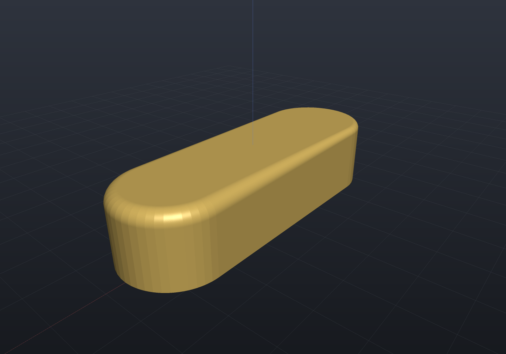

The band is genuinely exact, not a fitted surface. Along a straight run the
cross-section at each station is a **true** quarter circle of the interpolated radius —
the two end arcs are equal-weight rational conics on one frame, so lerping their points
is the same as lerping their control points — and it stays tangent to the flat face
along its top boundary and to the wall along its bottom.

Two things have no exact form and are refused by name rather than approximated:

- a **sharp corner whose two edges carry different radii**. Two variable-radius bands
  are cones that do not circumscribe a common sphere, so they meet in a quartic and
  there is no conic to miter them on. Keep the radius constant across a sharp corner —
  the bands are then equal-radius cylinders again and the exact bicylinder ellipse is
  back — or vary it only along runs whose corners are tangent-continuous, as the slot
  above does.
- a **varying law along an arc**, for the chamfer's reason: a circle offset by a varying
  amount is a spiral.

A constant law reproduces the plain `Fillet(radius, faces)` overload exactly, mesh and
all, so nothing is lost by reaching for the law form.

## Variable laws on partial runs

The two ideas compose: `FilletEdges(radiusAt, edges)` and `ChamferEdges(setbackAt, edges)`
take an **edge selection**, which the kernel groups into complete rims *and* contiguous
partial runs — so a blend can taper along a run that stops in the middle of a rim.

```csharp render:fillet-variable-run
// One top edge of a plate, blended from r = 0.5 at x = 0 to r = 3 at x = 30. The run
// terminates with an exact setback at each end vertex.
double w = 30, d = 20, h = 6;
var plate = Shape.Box(new Aabb((0, 0, 0), (w, d, h)))
    .FilletEdges(
        p => 0.5 + 2.5 * p.X / w,
        s => s.PlanarFacesWithNormal(Vector3d.UnitZ)
            .SelectMany(f => f.RimEdges())
            .Where(e => e.IsLinear(out var a, out var b)
                && Math.Abs(a.Y - d) < 1e-9 && Math.Abs(b.Y - d) < 1e-9));

var scene = new Scene();
scene.Add(new Part("tapered run", plate, Palette.Steel));
```

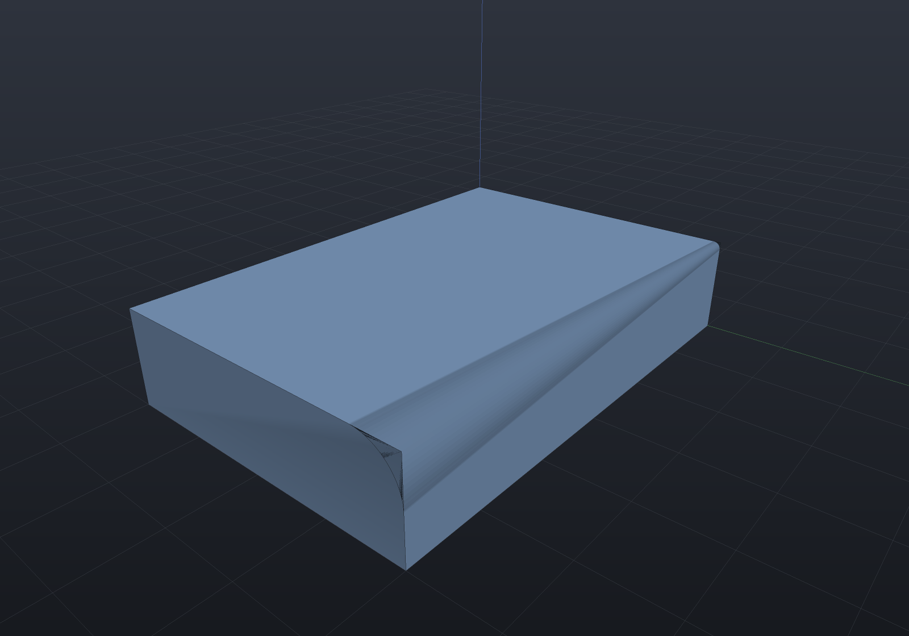

A run's **termination is exact at any law value**, which is what makes this composable
rather than a special case: the end cross-section is a planar quarter arc of whatever
radius the law gives at the stop vertex, so the removed material has a closed form,

```
V = (1 − π/4) · L · (r₀² + r₀r₁ + r₁²) / 3
```

— the integral of the constant-radius `(1 − π/4)·r²` along a linearly varying `r`. On the
plate above it is **23.069697 mm³**, and the tessellated band converges onto it from above
(the band inscribes the true quarter cylinder, so it removes a little too much) at exactly
the second order you would want: 23.078230 / 23.071831 / 23.070231 / 23.069831 at 32 / 64 /
128 / 256 segments per circle, i.e. deficits falling by **4.00 / 4.00 / 3.99**.

The chamfer sibling is exact to round-off, because a linear law leaves every strip a true
plane: at each station the offset endpoints differ by `(0, −c, −c)`, which is parallel for
every `c`, so the strip is ruled by two parallel lines.

```csharp render:chamfer-variable-run
// An L-shaped run over two adjacent top edges, widening as it goes. The interior corner
// still miters exactly — a chamfer's strips are planes whatever the law does.
double w = 30, d = 20, h = 6;
var plate = Shape.Box(new Aabb((0, 0, 0), (w, d, h)))
    .ChamferEdges(
        p => 0.8 + 0.05 * (p.X + p.Y),
        s => s.PlanarFacesWithNormal(Vector3d.UnitZ)
            .SelectMany(f => f.RimEdges())
            .Where(e => e.IsLinear(out var a, out var b)
                && (Math.Abs(a.Y) + Math.Abs(b.Y) < 1e-9
                    || Math.Abs(a.X - w) + Math.Abs(b.X - w) < 1e-9)));

var scene = new Scene();
scene.Add(new Part("tapered L-run", plate, Palette.Brass));
```

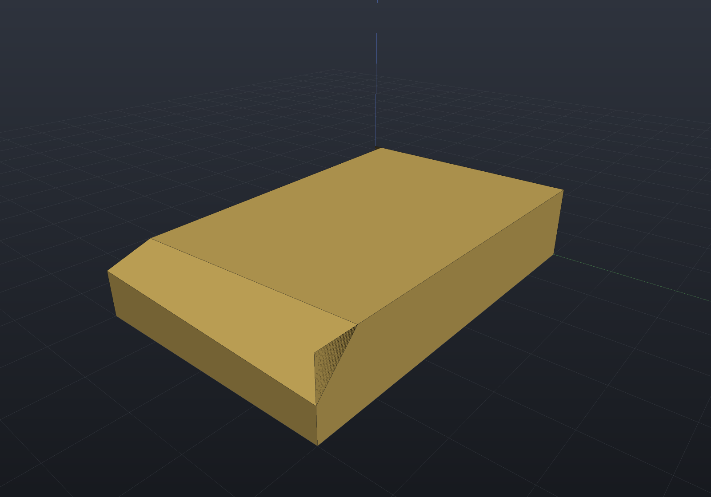

Both overloads also take an `EdgeSetRef`, so a variable blend can be driven from a
serializable selector rather than a lambda:

```csharp
var rounded = plate.FilletEdges(
    p => 1.0 + 0.02 * p.X,
    EdgeSetRef.RimOf(FaceSetRef.PlanarWithNormal(Vector3d.UnitZ)));
```

The refusals are the ones the law form already carries, and they are about the **law**
rather than about the run: a varying radius across a *sharp* corner is still refused (two
variable bands are cones with no common inscribed sphere), and on a run there is a third
way out that a full rim does not have — stop the run before the corner.

## Rounding every edge at once

`Filleting.FilletAllEdges` rounds **every** edge of a convex polyhedron in one call. It
is not a cascade of booleans: it builds the exact morphological *opening*
(K ⊖ B_r) ⊕ B_r, so each face keeps its plane with a shrunk boundary, each edge becomes
a cylindrical band about the eroded edge line, and each vertex becomes a spherical
patch. Nothing intersects anything, so there is no seam to seal:

```csharp render:fillet-all-edges
var rounded = Shape.From(Filleting.FilletAllEdges(Shape.Box(24, 18, 12).ToBrep(), 3));

var scene = new Scene();
scene.Add(new Part("rounded box", rounded, Palette.Brass));
```

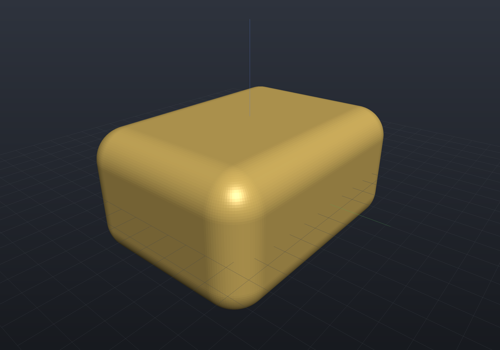

`Shape.RoundEdges(radius)` wires the same operation into the Shape graph — see
[loft, draft & shell](loft-draft-shell.md); the examples here drop down to the kernel
API and come back through `Shape.From` — see
[dropping down](representations.md#dropping-down-to-the-engine-apis).
It requires a **convex** solid with 3-valent vertices. Corners where one incident face
is perpendicular to the other two (boxes, prisms, sheared boxes) get an exact lune
patch — a full-domain surface of revolution. **General trihedral corners** work too: a
drafted block's corners have *no* face perpendicular to the other two, so each corner
becomes a trimmed spherical-triangle patch whose two pole-tangent arcs are exact
meridians of the patch's own revolve:

```csharp render:fillet-all-edges-general
var block = Shape.Box(24, 18, 12).ToBrep();
var sides = new[] { Vector3d.UnitX, -Vector3d.UnitX, Vector3d.UnitY, -Vector3d.UnitY }
    .SelectMany(n => block.PlanarFacesWithNormal(n)).ToList();
var drafted = Draft.Apply(block, new Vector3d(0, 0, -6), Vector3d.UnitZ, 8 * Math.PI / 180,
    f => sides.Any(g => ReferenceEquals(f, g)));
var roundedDraft = Shape.From(Filleting.FilletAllEdges(drafted, 2.5));

var scene = new Scene();
scene.Add(new Part("rounded drafted block", roundedDraft, Palette.Steel));
```

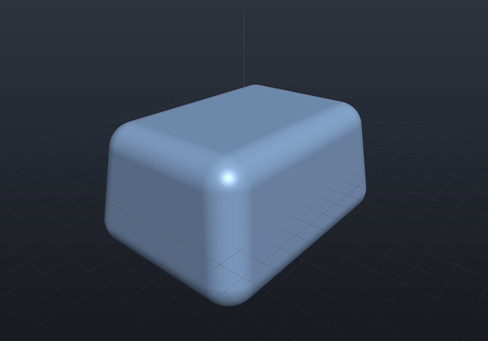

Concave edges and higher-valence vertices are refused by name.

## Selectors, not IDs

The selector is a function `BrepSolid -> IEnumerable<BrepFace>` — a *semantic* query
(`IsPlanar`, `IsCylindrical`, `IsCircular`, `Length`, adjacency via `face.Edges()` /
`solid.FacesOf(edge)`, sugar like `PlanarFacesWithNormal`) that re-runs on every
regeneration. That is the topological-naming story: references survive upstream edits
because they describe *what* to select, not which stored face.

Because selectors run on the **lowered** solid, upstream transforms are visible and
feature sizes scale with uniform scaling.

## Scope

Both features operate on the closed outer rim of planar faces, and reject unsuitable
input with guidance rather than producing bad geometry:

- **Chamfer** takes straight edges (sharp corners miter exactly with planar strips)
  and full circular rims (exact cone bands).
- **Fillet** takes full circular rims, tangent-continuous line+arc chains, and sharp
  corners **between two straight edges** (the ellipse miter above). A sharp corner where
  an **arc** meets another edge is refused: torus ∩ cylinder is not a conic.
- A radius or setback large enough that the mitered offsets cross is refused, naming
  the edge it would have consumed.
- Interior loops (holes) must stay clear of the shrunk boundary.
- Partial edge runs blend with exact setback terminations — see
  [selecting edges](#selecting-edges-instead-of-faces); runs must start and end on
  straight edges and stay clear of other selected rims and runs.

Both are B-Rep-native; the implicit lowering bridges through tessellation. Variable
radius is not supported: the *band* would be exact, but two variable bands meet in a
non-conic intersection with no exact miter to weld them on.
