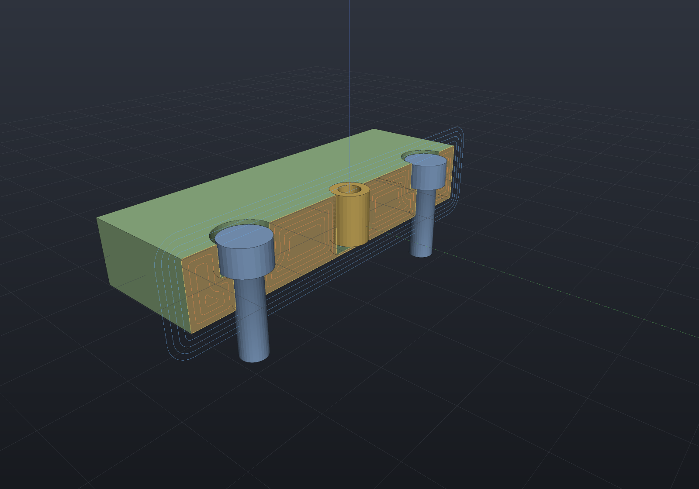
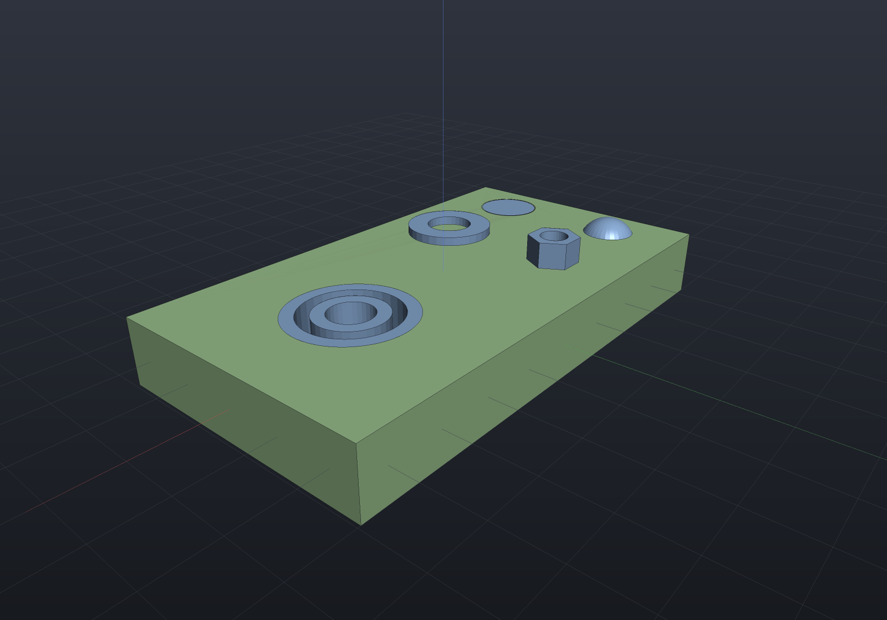
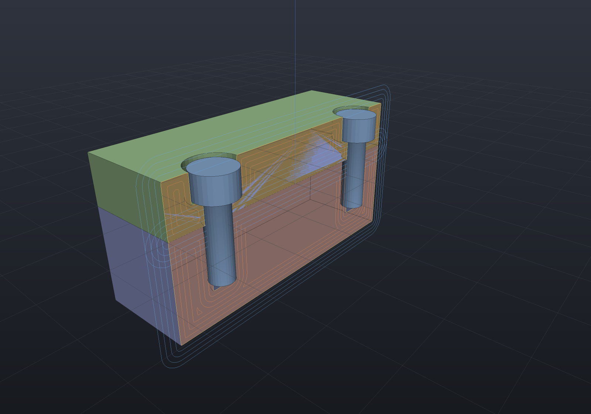

# Standard components ("smart" hardware)

A catalogue component is more than geometry: **placing it modifies the host model and
assembles itself**. `ComponentAssembly.Place` does both jobs in one call — it cuts what
the component needs out of the host (clearance hole, counterbore, insert pilot, reamed
hole) and adds the component to the assembly at the frame it seats in.

```csharp render:smart-fasteners section:y,0
// A plate, two ISO 4762 cap screws and a Tappex Trisert insert. Sectioned at y = 0 so
// you can see what each Place() cut: the counterbores with the heads seated in them,
// the clearance bores through, and the insert flush in its pilot. The fasteners
// themselves stand whole - hardware is drawn unsectioned, as drafting practice requires.
var top = SketchPlane.At((0, 0, 6), Vector3d.UnitX, Vector3d.UnitY);   // Box(70, 44, 12) top

var build = new ComponentAssembly("plate", Shape.Box(70, 44, 12), Palette.Sage);
build.Place(StandardComponents.CapScrew(5, 16), [new(-24, 0), new(24, 0)], top);
build.Place(StandardComponents.TrisertInsert(5), [new(0, 0)], top);

var scene = new Scene();
scene.AddTab("hardware").Add(build.ToAssembly("bracket"));
```



A component carries its own parametric body, a seating convention, and a **host
preparation**:

| Component | Host preparation | Body fidelity |
| --- | --- | --- |
| `StandardComponents.CapScrew(size, length, seating, fit, hexSocket)` — ISO 4762 | ISO 273 clearance hole plus the DIN 974 counterbore when `ScrewSeating.Counterbored` (the default); as an anchor, the coarse tap-drill pilot plus two pitches of runout | head cylinder (dk, k = d) on a plain shank, one exact revolve; the hexagon socket recess is **opt-in** (an exact pocket — see below); no modeled thread (use `Shape.ExternalThread`) |
| `StandardComponents.ButtonScrew(size, length, fit)` — ISO 7380-1 | ISO 273 clearance hole (button heads bear on the face); anchors like the cap screw | exact spherical-cap dome (the profile carries the arc) on a plain shank — no socket (see below) |
| `StandardComponents.CskScrew(size, length, fit)` — ISO 10642 | 90° countersunk clearance hole; anchors like the cap screw | sharp 90° cone + shank, one exact revolve; the head diameter is **derived from the hole table**, so screw and countersink agree by construction; lengths are OVERALL |
| `StandardComponents.Nut(size, fit)` — ISO 4032 | the bolt's ISO 273 clearance hole (a nut implies a through bolt — a nutted joint taps nothing) | exact hex prism, bored to the nominal diameter |
| `StandardComponents.Washer(size)` — ISO 7089 | **nothing** — the hole belongs to the screw the washer spaces | exact annular disk |
| `StandardComponents.Bearing(code)` — 608-style deep groove | flat-bottomed press-fit pocket (OD diameter, one width deep, so the bearing seats flush) | two exact concentric rings (radial thirds: ring, ball gap, ring) — no balls, cage or shields |
| `StandardComponents.TrisertInsert(size)` — Tappex Trisert® | the catalogue pilot bore at `StandardHoles.TrisertMinimumDepth` | plain sleeve bored to the thread's minor diameter |
| `StandardComponents.Dowel(diameter, length, inserted)` — ISO 2338 m6 | reamed hole at the **nominal** diameter (both bodies of a stack) | cylinder with 45° end chamfers |

⚠ Every transcribed table (head dimensions, nut/washer/bearing sizes, the Trisert
columns) carries a verify-against-your-supplier's-datasheet warning in its doc comment.

```csharp render:hardware-breadth
// The breadth families on one plate: a button head and a countersunk screw seated in
// their holes, a hex nut and washer standing on the face, and a 608 bearing pressed
// flush into its pocket.
var top = SketchPlane.At((0, 0, 6), Vector3d.UnitX, Vector3d.UnitY);   // Box(90, 50, 12) top

var build = new ComponentAssembly("plate", Shape.Box(90, 50, 12), Palette.Sage);
build.Place(StandardComponents.ButtonScrew(5, 16), [new(-36, 12)], top);
build.Place(StandardComponents.CskScrew(5, 20), [new(-36, -12)], top);
build.Place(StandardComponents.Nut(5), [new(-16, 12)], top);
build.Place(StandardComponents.Washer(8), [new(-16, -12)], top);
build.Place(StandardComponents.Bearing("608"), [new(22, 0)], top);

var scene = new Scene();
scene.AddTab("hardware").Add(build.ToAssembly("breadth"));
```



### The hex socket, and where it is exact

A hex is not a revolve, so a socket recess has to be a boolean — and it is offered only
where that boolean is exact. `CapScrew(..., hexSocket: true)` models the recess as a
hexagonal pocket whose rim lies in the planar head top (the same exact case as sketch
pockets; internally the socketed body is rebuilt from cylinder primitives so every
boolean stays transverse). The countersunk head's top is planar too, but its primitive
rebuild would make cone and shank tangent along a shared rim — refused by the exact
boolean — and a button head's socket would rim on the dome, a traced curve. Both are
documented refusals rather than approximations.

## Preparation is a feature

`Place` appends a `ComponentFeature` to a `FeatureHistory`, so placements regenerate,
cache and suppress like any other step. **Suppressing a placement removes its bore from
the host and its occurrence from the assembly** — one switch, both halves:

```csharp run:smart-fastener-suppression
var top = SketchPlane.At((0, 0, 4), Vector3d.UnitX, Vector3d.UnitY);
var build = new ComponentAssembly("plate", Shape.Box(60, 40, 8));
build.Place(StandardComponents.CapScrew(4, 16, ScrewSeating.OnFace), [new(-20, 0)], top);
var insert = build.Place(StandardComponents.TrisertInsert(4), [new(0, 12)], top);

var withInsert = build.ToAssembly();
double drilled = build.Host!.GetMesh().Volume();

build.Suppress(insert);                        // one switch...
var withoutInsert = build.ToAssembly();
double undrilled = build.Host!.GetMesh().Volume();

// ...removes the occurrence AND the bore it cut.
if (withInsert.Occurrences.Count != 3 || withoutInsert.Occurrences.Count != 2)
    throw new Exception("suppressing a placement must drop its occurrence");
if (undrilled - drilled < 100)
    throw new Exception("suppressing a placement must remove its bore too");
```

Leave the face argument out and the component seats on the body's top face, re-resolved
on every regeneration: change an upstream thickness parameter and the fasteners move
with the face they sit on, their holes re-cut through the new body.

A placement is also **data**, so a saved [document](documents.md) reopens with its
fasteners still parametric — the bores come back as the history's, not as a snapshot's:

```csharp run:smart-fastener-roundtrip
var history = new FeatureHistory();
history.Add(new ExtrudeSketchFeature(Sketch.Rectangle(60, 40)) { Height = 8 });
history.Add(new ComponentFeature(
    StandardComponents.CapScrew(6, 20, ScrewSeating.OnFace, ClearanceFit.Close, hexSocket: true),
    [new(-15, 0), new(15, 0)]));

var loaded = FeatureHistory.LoadHistory(history.SaveHistory());
if (!loaded.Complete) throw new Exception(string.Join("; ", loaded.Warnings));

// The component comes back by its ARGUMENTS, not by its designation — which carries the
// size and the length and says nothing about the fit, the seating or the socket.
var screw = (SocketHeadCapScrew)((ComponentFeature)loaded.History.Features[1]).Component;
if (screw.Fit != ClearanceFit.Close || screw.Seating != ScrewSeating.OnFace || !screw.HexSocket)
    throw new Exception("a designation-keyed reload would have lost these");
```

The boundary is stated rather than discovered: a `HardwareComponent` of your own is
refused at *save* time (its inputs are simply not written) and comes back only through
`LoadHistory`'s `resolveOpaque` hook — and a host built with
`ComponentAssembly(name, shape)` keeps one opaque record for its base body, because an
arbitrary `Shape` has no serialized form. Start the history with a sketch extrude and
the whole thing is data.

## The full fastener stack

`PlaceThrough` prepares **both** bodies from one call — clearance (and counterbore) in
the near body, the threaded engagement in the far one:

```csharp render:fastener-stack section:y,0
var coverFace = SketchPlane.At((0, 0, 10), Vector3d.UnitX, Vector3d.UnitY);
var mateFace  = SketchPlane.At((0, 0, 0), Vector3d.UnitX, Vector3d.UnitY);

var cover = new ComponentAssembly("cover", Shape.Box(60, 40, 10).Translate(0, 0, 5), Palette.Sage);
var basePlate = new ComponentAssembly("base", Shape.Box(60, 40, 20).Translate(0, 0, -10), Palette.Slate);

cover.PlaceThrough(StandardComponents.CapScrew(5, 16),
                   [new(-20, 0), new(20, 0)], coverFace, basePlate, mateFace);

var scene = new Scene();
var tab = scene.AddTab("stack");
tab.Add(cover.ToAssembly("cover"));
tab.Add(basePlate.ToAssembly("base"));
```



The engagement is geometric, not guessed: the grip is the distance from the screw's
seating datum down to the anchor face, and what is left of its length engages the far
body (plus two pitches of tap runout).

```csharp run:fastener-stack-numbers
var coverFace = SketchPlane.At((0, 0, 10), Vector3d.UnitX, Vector3d.UnitY);
var mateFace  = SketchPlane.At((0, 0, 0), Vector3d.UnitX, Vector3d.UnitY);
var cover = new ComponentAssembly("cover", Shape.Box(60, 40, 10).Translate(0, 0, 5));
var basePlate = new ComponentAssembly("base", Shape.Box(60, 40, 20).Translate(0, 0, -10));
cover.PlaceThrough(StandardComponents.CapScrew(5, 16), [new(-20, 0)], coverFace, basePlate, mateFace);
cover.ToAssembly();
basePlate.ToAssembly();

// Near body: Ø5.5 clearance under a Ø10 counterbore. Far body: the M5 coarse
// tap-drill pilot, Ø4.2, blind at 13.1 deep.
double clearance = cover.History.Result!.ToImplicit().Evaluate((-20, 0, 4));
double pilot = basePlate.History.Result!.ToImplicit().Evaluate((-20, 0, -2));
if (Math.Abs(clearance - 2.75) > 1e-9 || Math.Abs(pilot - 2.1) > 1e-9)
    throw new Exception($"expected the M5 clearance and tap-drill radii, got {clearance} and {pilot}");
```

Placement points are projected onto the anchor face along the fastener axis, so its 2D
axes need not match; non-parallel faces, an anchor above the seat and a component too
short to reach are rejected with the numbers in the message. The screw is placed
**once**, on the near body.

## Anchoring into a placed component

A stack can anchor into a **thread provider placed earlier** — an insert or a nut —
instead of cutting the screw's own tap pilot. Pass the provider's placement as
`anchorInto` and the far body gets **no new cut** (the provider's placement already made
its pilot or clearance); what the overload adds is the checking:

```csharp run:anchor-into-insert
var mateFace  = SketchPlane.At((0, 0, 0), Vector3d.UnitX, Vector3d.UnitY);
var coverFace = SketchPlane.At((0, 0, 10), Vector3d.UnitX, Vector3d.UnitY);

var basePlate = new ComponentAssembly("base", Shape.Box(60, 40, 20).Translate(0, 0, -10));
var inserts = basePlate.Place(StandardComponents.TrisertInsert(5),
                              [new(-20, 0), new(20, 0)], mateFace);

var cover = new ComponentAssembly("cover", Shape.Box(60, 40, 10).Translate(0, 0, 5));
cover.PlaceThrough(StandardComponents.CapScrew(5, 12), [new(-20, 0), new(20, 0)],
                   coverFace, basePlate, mateFace, anchorInto: inserts);

// The checks are real: an M5x16 would engage 11.5 into a 9.5-long insert (bottoms out),
// an M4 screw is a thread mismatch, and a point with no insert under it would miss.
try
{
    cover.PlaceThrough(StandardComponents.CapScrew(5, 16), [new(-20, 0)],
                       coverFace, basePlate, mateFace, anchorInto: inserts);
    throw new Exception("a screw that bottoms out must be refused");
}
catch (ArgumentException) { }
```

The engagement is measured to the face the provider seats on and checked against the
provider's own limits: a blind insert caps it (`MaximumEngagement` — the screw bottoms
out), a nut demands its full height (`MinimumEngagement` — a bolt goes *through* its
nut). Each fastener point must project onto one of the provider's placement points, so a
screw cannot silently miss its insert. For a nutted joint, place the nut on the far
body's outer face (its placement drills the clearance hole through) and anchor into it
the same way.
