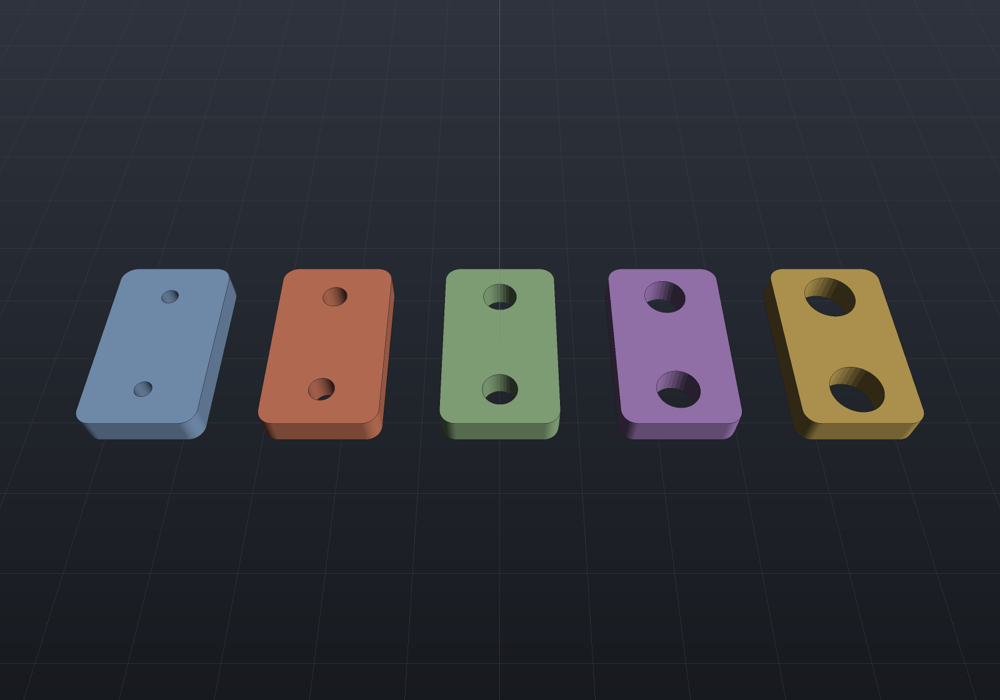

One model, several sizes. A **configuration** is a name plus a `[Param]` value dictionary
over a part's [`FeatureHistory`](features.md) — an M4…M12 family of one bracket is one
history and six named parameter sets, not six models.

The values ride the **same JSON seam** as `FeatureHistory.SaveParameters`: the one a saved
parameter file, an [MCP](mcp.md) `set_param`, a properties-panel edit,
`DocumentEdits.SetParameter` and a [design study's](design-studies.md) answer all speak. A
configuration is another consumer of that seam, never a second way to write a value.

## The family

```csharp render:configuration-family
// One bracket. The bolt size is a [Param], so a size family is parameter sets over it.
sealed class Plate : Feature
{
    [Param(Min = 20, Units = "mm")] public double Length { get; init; } = 50;
    [Param(Min = 10, Units = "mm")] public double Width { get; init; } = 30;
    [Param(Min = 3, Units = "mm")] public double Thickness { get; init; } = 8;

    public override Shape Apply(FeatureContext c) =>
        Shape.Extrude(Sketch.RoundedRectangle(Length, Width, 4), Thickness);
}

sealed class BoltHoles : Feature
{
    [Param(Min = 2, Max = 24, Units = "mm", Description = "Nominal bolt size")]
    public double Size { get; init; } = 6;

    public override Shape Apply(FeatureContext c) =>
        c.Body!.Drill(StandardHoles.Clearance(Size), [new(-15, 0), new(15, 0)], 12, c.TopPlane);
}

var holes = new BoltHoles();
var history = new FeatureHistory();
history.Add(new Plate());
history.Add(holes);

var bracket = history.ToPart("bracket");
var family = bracket.Configurations!;
foreach (double size in new[] { 4.0, 6.0, 8.0, 10.0, 12.0 })
    family.Add($"M{size:0}", (holes, nameof(BoltHoles.Size), size));

// Each variant is the SAME history, regenerated. Snapshot the five bodies side by side so
// the picture is five instants of one parametric model.
var scene = new Scene();
double y = -90;
foreach (string name in family.Names)
{
    family.Activate(name);
    scene.Add(new Part(name, ((Shape)bracket.Geometry).Translate(0, y, 0)));
    y += 45;
}

var camera = new CameraState(0, 0.95, 225, (0, 0, 4));
```



`Add(name, (feature, parameter, value)…)` is the typed spelling: the feature must be in the
history and the parameter must exist on it, both refused **by name**, because a caller
holding the feature object has made a mistake rather than read a stale file. Raw
`SaveParameters` JSON goes in through `Add(name, json)`, which names features by string and
so behaves like `LoadParameters` — see [staleness](#staleness), below.

## A configuration may be partial

Nothing requires a configuration to state every value. The family above names only the bolt
size, so the plate's thickness stays whatever the model currently says and the same six
variants keep working while a designer is still tuning it. `Capture(name)` snapshots the
*whole* history; `Capture(name, features)` narrows it to the features you name.

## Switching

```csharp run:configuration-switch
sealed class Boss : Feature
{
    [Param(Min = 4, Units = "mm")] public double Height { get; init; } = 10;

    public override Shape Apply(FeatureContext c) =>
        Shape.Cylinder(12, Height).Union(Shape.Box(60, 40, 6).Translate(0, 0, -3));
}

var boss = new Boss();
var history = new FeatureHistory();
history.Add(boss);
var part = history.ToPart("post");

var configurations = part.Configurations!;
configurations.Add("short", (boss, nameof(Boss.Height), 10.0));
configurations.Add("tall", (boss, nameof(Boss.Height), 30.0));

configurations.Activate("tall");
double tall = part.GetMesh().Volume();
configurations.Activate("short");
configurations.Activate("tall");

// Switching away and back reproduces the geometry EXACTLY: Apply is a pure function of
// its parameters, so restoring the values reproduces the construction.
if (part.GetMesh().Volume() != tall)
    throw new Exception("a round trip through another configuration changed the geometry");

// The active configuration is document state, and the model can be MODIFIED against it.
Console.WriteLine($"{configurations}");                       // short, [tall]
part.History!.LoadParameters("""{ "Boss": { "Height": 26 } }""");
part.Regenerate();
Console.WriteLine($"{configurations}");                       // short, [tall]*
if (!configurations.ActiveIsModified)
    throw new Exception("an edit should leave the model modified against its configuration");
```

`Activate` applies the whole set through `LoadParameters` and regenerates **once**, however
many parameters it states — composing it out of per-feature edits would rebuild once per
feature. `DocumentEdits.SetConfiguration(part, name)` is the undoable wrapper: one edit, one
rebuild, one Ctrl+Z.

Activating does **not** write back. Editing a parameter while "tall" is active does not
quietly redefine "tall"; it leaves the model modified against it (`ActiveIsModified`), and
`Capture` is the deliberate act of storing the current values. That is what keeps a
configuration's values a function of the document rather than of the order in which someone
clicked.

## Family tables (a BOM per configuration)

```csharp run:configuration-bom
sealed class Bracket : Feature
{
    [Param(Min = 20, Units = "mm")] public double Length { get; init; } = 60;
    [Param(Min = 4, Units = "mm")] public double Thickness { get; init; } = 8;

    public override Shape Apply(FeatureContext c) =>
        Shape.Extrude(Sketch.Rectangle(Length, 30), Thickness);
}

var feature = new Bracket();
var history = new FeatureHistory();
history.Add(feature);
var bracket = history.ToPart("bracket").Of(Materials.Aluminium6061);

var assembly = new Assembly("stack");
assembly.Add(bracket);
assembly.Add(new PlainWasher(6).ToPart());
assembly.Add(new PlainWasher(6).ToPart());

var configurations = bracket.Configurations!;
configurations.Add("short", (feature, nameof(Bracket.Length), 60.0));
configurations.Add("long", (feature, nameof(Bracket.Length), 120.0));

foreach (var row in Bom.ByConfiguration(bracket, assembly, mass: true))
    Console.WriteLine($"{row.Configuration,-6} {row.Bom.LineCount} items, {row.TotalMassGrams:0.#} g");

// A family table is an ANALYSIS, not an edit: the part comes back exactly as it was found.
if (configurations.Active is not null)
    throw new Exception("the walk should have restored the part's original state");
```

Two things about "per configuration" on a document whose parts are **shared**. A `Bom` groups
by part *reference* and a configuration changes a part's parameters rather than replacing the
object, so the configured part is one line in every row. What *can* differ is the rest of the
model — a `ComponentFeature` places catalogue hardware, so an M4 variant lists M4 screws and
an M10 variant M10 ones, and a suppressed placement drops its occurrence — which is why each
row is built from a fresh flatten rather than from one captured instance list.

And read the mass off `ConfigurationBom.TotalMassGrams`, not off the returned `Bom`'s lines:
`BomLine.UnitMassGrams` is a lazy projection that measures the part's *current* geometry, and
the walk restores the part when it is done.

## Saving

Configurations and the active one are **document state**, saved with the part
([documents](documents.md)):

```json
"configurations": {
  "active": "M8",
  "items": [
    { "name": "M4", "parameters": { "BoltHoles": { "Size": 4 } } },
    { "name": "M6", "parameters": { "BoltHoles": { "Size": 6 } } }
  ]
}
```

Written only when a part has some, so a document that uses none is byte-identical to what it
always was. The active *name* round-trips and the load restores it **without re-applying**:
the history was saved carrying those values already, so re-applying would cost a regeneration
and, for a document saved while modified, would silently snap the model back onto the
configuration and lose the edit.

The active configuration is document state rather than session state (which is what the
[undo stack](viewer.md) is) for a simple reason: an undo history records *how* the document
got here, while the active configuration records *where it is* — it names the values the
model currently carries, and those are saved either way.

## Staleness

A configuration naming a feature that has since been removed, or a parameter a feature no
longer has, is **reported, never dropped and never thrown**:

```csharp run:configuration-staleness
sealed class Post : Feature
{
    [Param(Min = 4)] public double Height { get; init; } = 20;

    public override Shape Apply(FeatureContext c) => Shape.Cylinder(10, Height);
}

var history = new FeatureHistory();
history.Add(new Post());
var part = history.ToPart("post");

part.Configurations!.Add("stale", """{ "Gone": { "Height": 30 } }""");
foreach (string warning in part.Configurations!.Validate())
    Console.WriteLine(warning);              // configuration 'stale': unknown feature 'Gone'

var applied = part.Configurations!.Activate("stale");
if (applied.Warnings.Count != 1 || !applied.Succeeded)
    throw new Exception("a stale value is a warning, not a failure");

// Kept, not dropped: the feature it names may yet come back (an undone removal).
if (!part.Configurations!.Names.Contains("stale"))
    throw new Exception("a stale configuration should survive");
```

`Validate()` is the pre-flight that says so *without* applying anything — what a UI shows
beside a configuration it cannot honour. `Activate` reports the same messages at the moment
they matter.

## What a configuration is not

It carries **values only**: it cannot add, remove or suppress a feature. That is what makes a
switch cheap and exact — the feature *instances* never change, so `FeatureHistory`'s prefix
cache re-runs precisely the tail a forward edit would and the part above the change is
`Cached`. Per-configuration *suppression* (a variant without the boss) is a real want and is
filed rather than smuggled in: it is not part of the `SaveParameters` vocabulary, and a second
spelling beside it is exactly the drift the one-seam rule exists to prevent.
