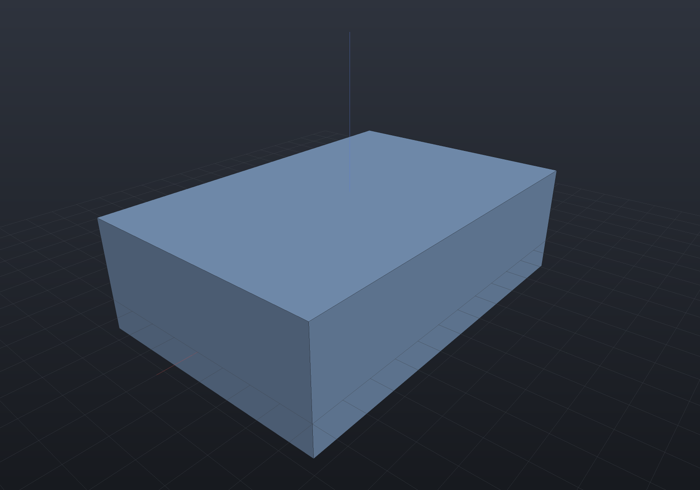
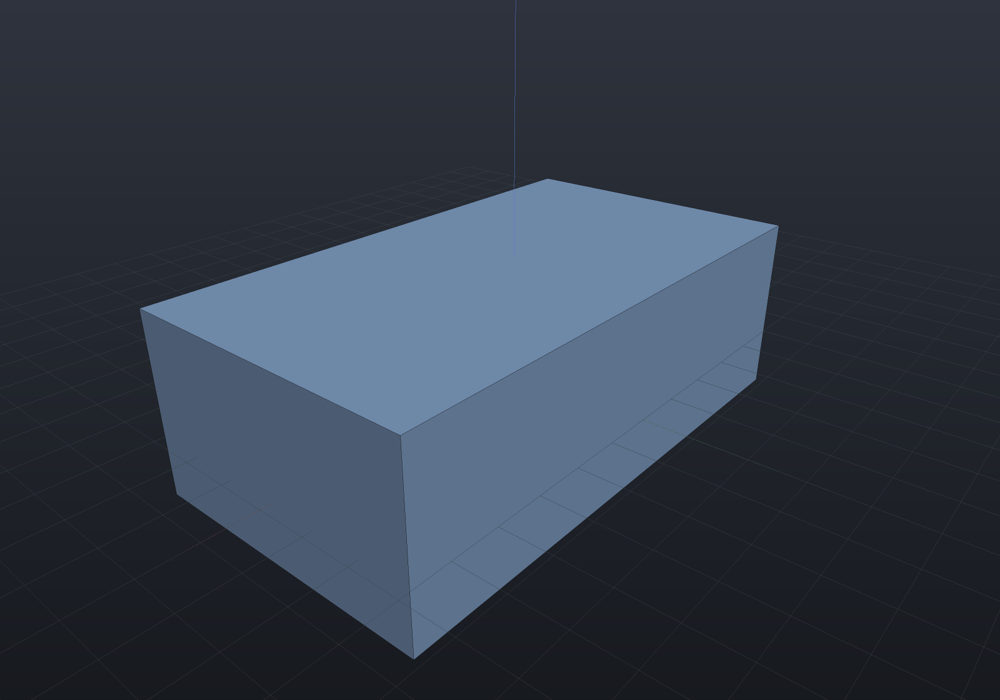
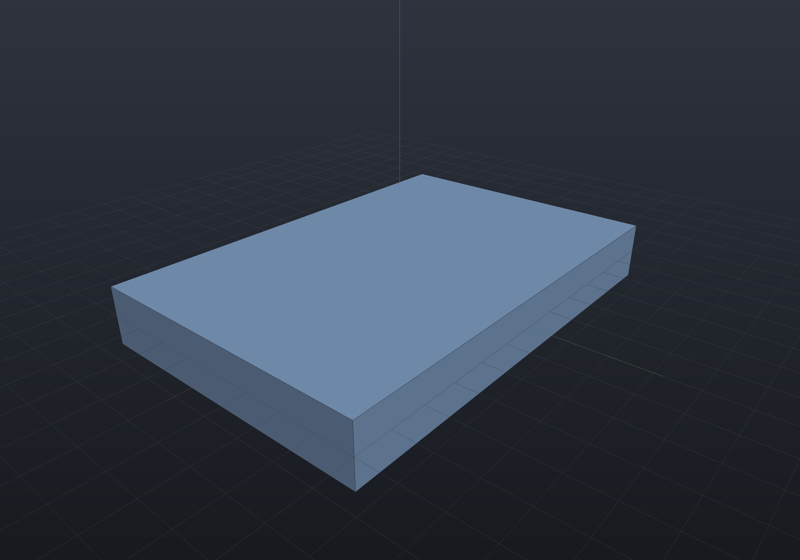
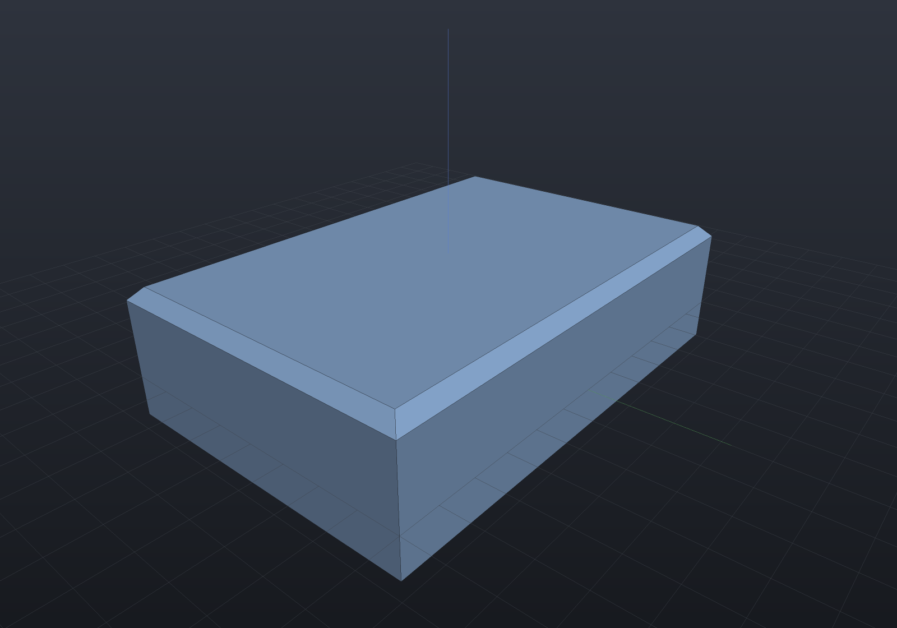

Every other modelling operation on this site changes a *recipe*: you edit a sketch, a
parameter or a feature, and the model rebuilds. **A solid imported from STEP or IGES has
no recipe.** There is nothing to change but the geometry itself, so the only handle on it
is its faces — push one, translate one, or delete a feature and let the neighbours close
up. That is direct editing, and it is what makes an imported body editable at all.

On a shape that *does* have a history, changing the construction is better than editing
its result. These operations exist for the models that have none.

All three are exact B-Rep surgery — no booleans, no tessellation, nothing approximated —
and all three are **B-Rep-Native** under any similarity placement, mirrors included.
Faces are named with the same [`FaceSetRef` vocabulary](selection.md) the rim features and
parametric features use.

## Offsetting a face

`Shape.OffsetFaces` pushes the selected faces along their own outward normals and
re-solves every corner the move disturbs. A positive distance grows the solid.

```csharp render:direct-edit-offset
// Pretend this arrived from a STEP file: a plate with no construction history.
var imported = Shape.Box(60, 40, 10);

// Make it thicker by pushing its top face up 8 mm.
var thicker = imported.OffsetFaces(8, FaceSetRef.PlanarWithNormal(Vector3d.UnitZ));

var scene = new Scene();
scene.Add(new Part("thicker", thicker));
```



The volume identity is worth knowing because it tells you when your intuition is right.
Where every face adjoining the moved one is *parallel to its normal* — a box's top face
against its four sides — the moved face slides without changing shape, so the volume
changes by **exactly area × distance**. Where a neighbour is oblique, the boundary grows
or shrinks as it slides and the change is the frustum integral instead; on a
right-triangular prism pushed 1.5 mm on its hypotenuse the true change is 140.78 against
the 127.28 that `area × distance` predicts, so the difference is 10.6% and not round-off.

Curved faces work the same way, because a cylinder offsets to a cylinder and a cone to a
cone. Pushing a bore's wall is the case where the sign convention surprises people: a bore
wall's outward normal points *into the void*, so a **positive** offset adds material there
and the hole closes in.

```csharp render:direct-edit-bore
var housing = Shape.Cylinder(20, 30) - Shape.Cylinder(9, 40);

// Negative: pull the bore wall outward, widening the hole from 18 to 24 across.
var widened = housing.OffsetFaces(-3, FaceSetRef.Cylindrical(9));

var scene = new Scene();
scene.Add(new Part("widened", widened));
```


## Moving a face

`Shape.MoveFaces` translates the selected planar faces by a vector.

**This is the offset operation under another name, and deliberately so.** A plane is
unchanged by any translation *within itself*, so the plane you reach by displacing a face
by `v` is exactly the plane you reach by offsetting it by `v · n̂`. The implementation is
that reduction rather than a second algorithm beside it, and two consequences follow
rather than being arranged:

- **A face moved parallel to itself does not move at all.** Sliding a plane along itself
  gives the same plane. This surprises people, and it is correct.
- **Moving several faces by one vector moves each by its own amount**, because each takes
  its own projection.

```csharp render:direct-edit-move
var bracket = Shape.Box(50, 30, 12);

// One vector, two faces, two different displacements: the top face rises by 6 and the
// +X face moves out by 4 — each takes its own projection of (4, 0, 6).
var stretched = bracket.MoveFaces(
    new Vector3d(4, 0, 6),
    FaceSetRef.Where("top and +X", face =>
        face.IsPlanar(out _, out var n) && (n.Normalized().Z > 0.99 || n.Normalized().X > 0.99)));

var scene = new Scene();
scene.Add(new Part("stretched", stretched));
```



A **curved** face is refused by name: translating a cylinder moves its axis, and the rim
reconstruction rebuilds each edge as a circle concentric with the original — exactly right
for an offset along the normal, and false for a translation. Use `OffsetFaces` for a curved
face, or move the whole solid.

## Deleting a feature

`Shape.DeleteFaces` removes the named faces and heals the wound. This is how a boss, a
pad or a pocket comes off an imported body.

```csharp render:direct-edit-delete
// A boss unioned onto a plate — again, no history to roll back.
var withBoss = Shape.Box(60, 40, 8) | Shape.Cylinder(9, 10).Translate(10, 0, 4);

// Everything standing proud of the plate's top face IS the boss.
var plain = withBoss.DeleteFaces(
    FaceSetRef.Where("boss", face => face.Bounds().Max.Z > 4.5));

var scene = new Scene();
scene.Add(new Part("plate", plain));
```



The result is not merely *shaped like* a plain plate — it **is** the plate, exactly: the
plate's own faces are never touched by the operation, so its geometry comes back bit for
bit and its volume is the closed-form 60 × 40 × 8.

### What heals, and what is refused

The rule is one condition rather than a list of shapes. Call an edge **wound** when one of
its two faces is deleted and the other is kept. The deletion heals by *dropping loops*
exactly when every wound edge lies on a complete interior loop of a kept **planar** face —
the neighbours already close without it, so the repair is to stop referencing it. A boss,
a pad, a pocket and a counterbore's step all satisfy that.

Two things are refused by name:

- **A wound that only partly bounds a neighbouring loop.** Deleting a chamfer band, whose
  two neighbours must be *extended* until they meet in a new edge, is a different
  operation — and it can have no answer at all (a box's four sides extended past its
  deleted top never meet). Named, not attempted.
- **A neighbour that is not planar.** A plane is bounded by its outer loop alone, so an
  interior loop really is a hole. On a cylinder or an extruded band a second loop is
  routinely the far *end* of the band, and dropping it would leave the surface unbounded —
  an open tube that passes every structural check downstream. So the planar clause is the
  correctness condition, not a convenience.

## Editing composes with the rest of the kernel

An edited solid is an ordinary solid: it goes back into booleans, features and export
unchanged.

```csharp render:direct-edit-composed
var imported = Shape.Box(60, 40, 10);

var part = imported
    .OffsetFaces(6, FaceSetRef.PlanarWithNormal(Vector3d.UnitZ))   // thicken to 16
    .Drill(StandardHoles.Clearance(6), [new(-20, 0), new(20, 0)], depth: 16)    // then drill it
    .FilletEdges(2, EdgeSetRef.Convex);                          // then round it

var scene = new Scene();
scene.Add(new Part("edited", part));
```



`shape.Explain(TargetRep.Brep)` reports every direct edit as Native under any similarity
and Impossible under a shear, which is the honest answer: a non-uniform scale does not
commute with a face edit.
