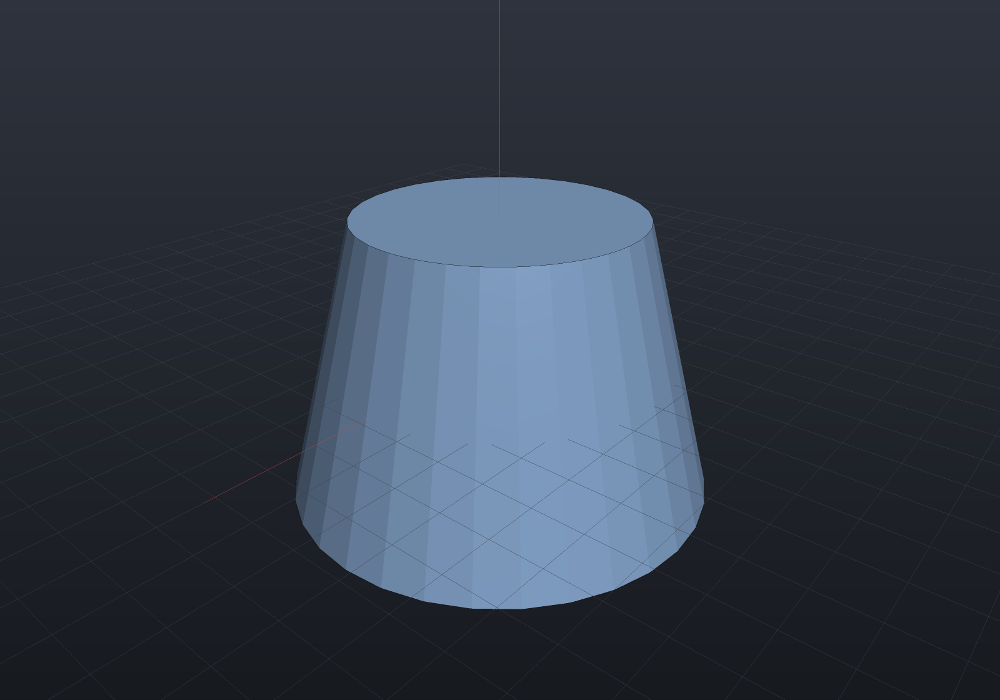
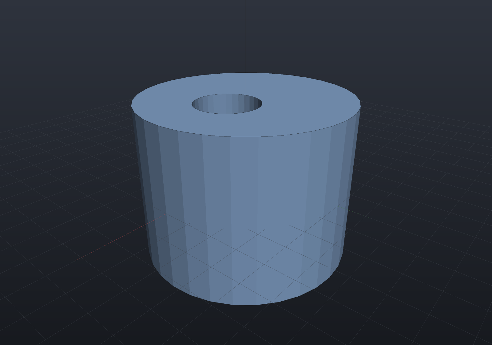
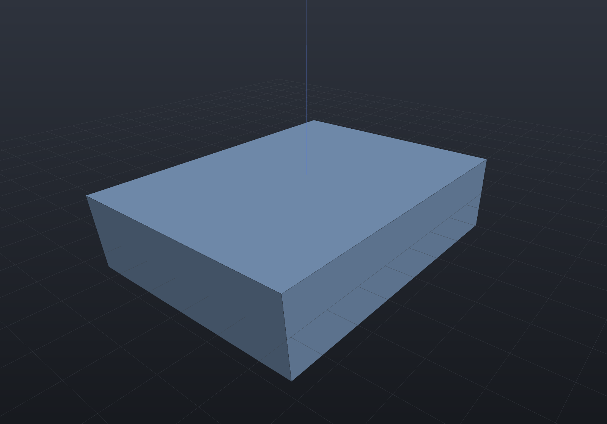
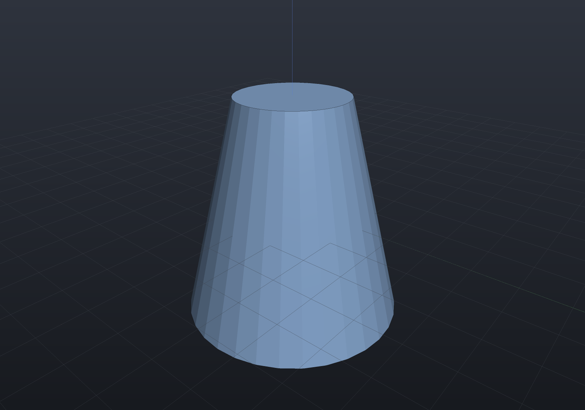
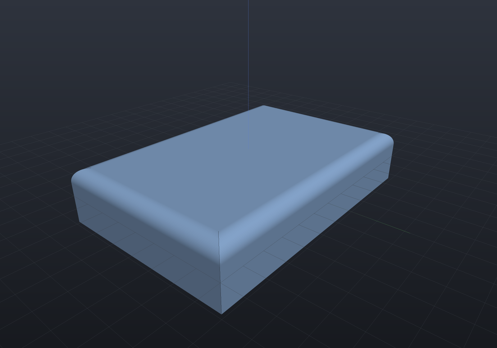
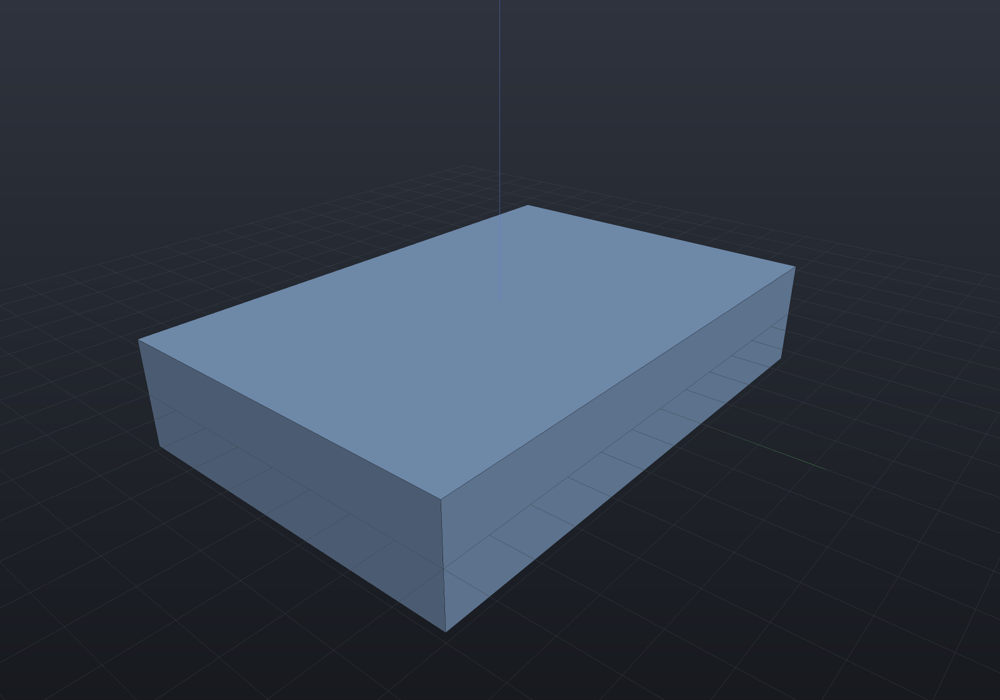

Every other modelling operation on this site changes a *recipe*: you edit a sketch, a
parameter or a feature, and the model rebuilds. **A solid imported from STEP or IGES has
no recipe.** There is nothing to change but the geometry itself, so the only handle on it
is its faces — push one, translate one, turn one, give one a different surface, or delete
a feature and let the neighbours close up. That is direct editing, and it is what makes
an imported body editable at all.

On a shape that *does* have a history, changing the construction is better than editing
its result. These operations exist for the models that have none.

All five are exact B-Rep surgery — no booleans, no tessellation, nothing approximated —
and all five are **B-Rep-Native** under any similarity placement, mirrors included.
Faces are named with the same [`FaceSetRef` vocabulary](selection.md) the rim features and
parametric features use.

## Offsetting a face

`Shape.OffsetFaces` pushes the selected faces along their own outward normals and
re-solves every corner the move disturbs. A positive distance grows the solid.

```csharp render:direct-edit-offset
// Pretend this arrived from a STEP file: a plate with no construction history.
var imported = Shape.Box(60, 40, 10);

// Make it thicker by pushing its top face up 8 mm.
var thicker = imported.OffsetFaces(8, FaceSetRef.PlanarWithNormal(Vector3d.UnitZ));

var scene = new Scene();
scene.Add(new Part("thicker", thicker));
```


The volume identity is worth knowing because it tells you when your intuition is right.
Where every face adjoining the moved one is *parallel to its normal* — a box's top face
against its four sides — the moved face slides without changing shape, so the volume
changes by **exactly area × distance**. Where a neighbour is oblique, the boundary grows
or shrinks as it slides and the change is the frustum integral instead; on a
right-triangular prism pushed 1.5 mm on its hypotenuse the true change is 140.78 against
the 127.28 that `area × distance` predicts, so the difference is 10.6% and not round-off.

Curved faces work the same way, because a cylinder offsets to a cylinder and a cone to a
cone — the offset stays in the same surface family, so the result is exact rather than
approximated:

```csharp render:direct-edit-cone
var cone = Shape.Cone(20, 12, 30);

// Push the slant face out 3 mm along its own normal. The result is still exactly a cone.
var fattened = cone.OffsetFaces(3, FaceSetRef.Where("slant", f => !f.IsPlanar(out _, out _)));

var scene = new Scene();
scene.Add(new Part("fattened", fattened));
```



The sign convention surprises people on a **bore**: a bore wall's outward normal points
*into the void*, so a positive offset adds material there and the hole closes in. A
negative one widens it.

A difference marks the subtracted tool's walls as *reversed*, and an offset moves a face
along its **outward** normal — which for a reversed face is the negative of its surface's.
So offsetting a *curved* face of boolean output works: the offset simply pushes the bore
wall's surface by `−distance` (its outward normal points into the void), which is why a
positive offset on a bore adds material and a negative one widens it, exactly as above.

## Moving a face

`Shape.MoveFaces` translates the selected faces by a vector.

For a **planar** face this is the offset operation under another name, and deliberately
so. A plane is unchanged by any translation *within itself*, so the plane you reach by
displacing a face by `v` is exactly the plane you reach by offsetting it by `v · n̂`. The
implementation is that reduction rather than a second algorithm beside it, and two
consequences follow rather than being arranged:

- **A planar face moved parallel to itself does not move at all.** Sliding a plane along
  itself gives the same plane. This surprises people, and it is correct.
- **Moving several planar faces by one vector moves each by its own amount**, because each
  takes its own projection.

```csharp render:direct-edit-move
var bracket = Shape.Box(50, 30, 12);

// One vector, two faces, two different displacements: the top face rises by 6 and the
// +X face moves out by 4 — each takes its own projection of (4, 0, 6).
var stretched = bracket.MoveFaces(
    new Vector3d(4, 0, 6),
    FaceSetRef.Where("top and +X", face =>
        face.IsPlanar(out _, out var n) && (n.Normalized().Z > 0.99 || n.Normalized().X > 0.99)));

var scene = new Scene();
scene.Add(new Part("stretched", stretched));
```


A **curved** face is carried bodily, axis and all — which is the one place the reduction
to an offset does not apply, and the reason moving a bore is how you *relocate* it rather
than resize it:

```csharp render:direct-edit-move-bore
var housing = Shape.Cylinder(20, 30) - Shape.Cylinder(6, 40);

// Slide the bore 5 mm off the housing's axis. The wall is still exactly a cylinder of
// radius 6 — its axis moved with it, and both rims came back as circles about the new one.
var offCentre = housing.MoveFaces(new Vector3d(5, 0, 0), FaceSetRef.Cylindrical(6));

var scene = new Scene();
scene.Add(new Part("housing", offCentre));
```



The rims are the load-bearing part. Each one is rebuilt as a circle concentric with the
**new** carrier rather than the old one, on the same face it always lay in, and its seam
vertex is turned onto that carrier's own `u = 0` — so a moved bore lands on the
tessellation grid the same way an unmoved one does. Reading the axis from the old edge
would put the rim back where the bore used to be.

## Rotating a face

`Shape.RotateFaces` turns the selected faces about an axis. This is a **draft angle put on
a body that has no history to re-parameterize** — the same result [`Shape.Draft`](loft-draft-shell.md)
gives a modelled part, reached from the other side.

The axis is a *hinge*. A face the axis lies in tilts about that line and keeps the points
on it, which is what a drafting caller means; a face the axis misses swings bodily, which
is legal and usually not what was wanted.

```csharp render:direct-edit-rotate
var block = Shape.Box(40, 30, 10);

// Hinge the +X wall on its own bottom edge and lean it out by 6 degrees.
var drafted = block.RotateFaces(
    new Ray3d(new Vector3d(20, 0, -5), Vector3d.UnitY), 6,
    FaceSetRef.PlanarWithNormal(Vector3d.UnitX));

var scene = new Scene();
scene.Add(new Part("drafted", drafted));
```



The volume is the trapezoid's closed form and not `area × distance`: the section becomes
`depth × height × (width + height·tan θ / 2)`, which for the block above is
`30 × 10 × (40 + 10·tan 6° / 2) = 12157.66`. The carrier itself is turned, so a rotated
plane is still exactly a plane and a rotated cylinder still exactly a cylinder about the
turned axis — nothing is fitted. An **angle** is preserved by every similarity, so this
composes with any placement: the hinge is carried through as an ordinary ray.

:::note[One boundary worth stating]
A uniform **scale** can change which surface family a body's walls lower as, and where a
rotated face's neighbours arrive as extrusions the rim solve wants their generators
lengthened along a direction the extension does not yet reach. The rotation is classified
Native under any similarity and is exact under a rigid placement; a scaled body whose
neighbours lower that way refuses by name rather than guessing.
:::

## Replacing a face's surface

`Shape.ReplaceFaceSurfaces` gives the selected faces a different carrier and re-solves the
edges. It is OCCT's `BRepTools_ReShape` at the granularity that matters here: the topology
is untouched, so the loops, the neighbours and the face count are exactly what they were —
only the surface underneath changes, and every rim moves to where the new surface meets
its neighbour.

```csharp render:direct-edit-replace
var rod = Shape.Cylinder(6, 12);

// Taper it by handing the wall a cone instead of a cylinder. The two end faces are
// untouched; their rims simply move to where the cone meets them.
var cone = new RevolvedSurface(
    new Line3d(new Vector3d(6, 0, -6), new Vector3d(3, 0, 6)),
    Vector3d.Zero, Vector3d.UnitZ);

var frustum = rod.ReplaceFaceSurfaces(cone, FaceSetRef.Cylindrical(6));

var scene = new Scene();
scene.Add(new Part("frustum", frustum));
```



The wall **is** the cone rather than a fit to one, so the result is the exact frustum;
measured through the tessellation it matches Pappus' `π h (R² + Rr + r²) / 3` at the
mass-properties grade.

Three things are checked before anything moves, and each is refused by name:

- **The replacement must face the same way.** A surface whose outward normal opposes the
  original's turns the solid inside out while leaving every loop, every count and the
  Euler number unchanged — nothing downstream can see it, which is exactly why the gate is
  here.
- **Every rim must have an exact intersection with its neighbour.** A replacement whose
  edges would only be traceable is refused rather than chorded in.
- **The selection must not be empty** — a replacement that names no face is a caller
  mistake, not a no-op.

The topology is the input's, carried over rather than rebuilt, so what a replacement can
break is the *geometry* — which is what the first two gates are about. The input itself
must be a valid single-shell solid, and it is `Validate()`d before anything is read.

## Deleting a feature

`Shape.DeleteFaces` removes the named faces and heals the wound. This is how a boss, a
pad, a pocket or a blend comes off an imported body.

```csharp render:direct-edit-delete
// A boss unioned onto a plate — again, no history to roll back.
var withBoss = Shape.Box(60, 40, 8) | Shape.Cylinder(9, 10).Translate(10, 0, 4);

// Everything standing proud of the plate's top face IS the boss.
var plain = withBoss.DeleteFaces(
    FaceSetRef.Where("boss", face => face.Bounds().Max.Z > 4.5));

var scene = new Scene();
scene.Add(new Part("plate", plain));
```


The result is not merely *shaped like* a plain plate — it **is** the plate, exactly: the
plate's own faces are never touched by the operation, so its geometry comes back bit for
bit and its volume is the closed-form 60 × 40 × 8.

### Deleting a blend: the neighbours are extended until they meet

A fillet or chamfer band is the case the boss above does *not* cover. Its wound runs only
part of the way round each neighbour's loop, so there is no loop to drop; the two
neighbours have to be **extended** until they meet in a new edge. Here is the plate with a
3 mm rounded rim:

```csharp render:direct-edit-blend-before
var rounded = Shape.Box(60, 40, 12)
    .Fillet(3, FaceSetRef.PlanarWithNormal(Vector3d.UnitZ));

var scene = new Scene();
scene.Add(new Part("rounded", rounded));
```



and here is the same solid with every band and corner patch deleted:

```csharp render:direct-edit-blend-after
var rounded = Shape.Box(60, 40, 12)
    .Fillet(3, FaceSetRef.PlanarWithNormal(Vector3d.UnitZ));

// The blend is exactly the faces that are not planes: four quarter-cylinder bands plus
// the four mitre patches at the corners.
var sharp = rounded.DeleteFaces(
    FaceSetRef.Where("blend", face => !face.IsPlanar(out _, out _)));

var scene = new Scene();
scene.Add(new Part("sharp", sharp));
```



The heal reproduces the box **bit for bit** — not to a tolerance: every one of the eight
corners comes back at exactly the coordinates a `Shape.Box(60, 40, 12)` has, because each
is re-solved from the same three planes the original box was built from. A chamfer band
comes off the same way, and so does a fillet round a circular rim, which closes a cylinder
back up to three faces at `π r² h` within the mass-properties grade.

### What heals, and what is refused

The rule is one condition rather than a list of shapes. Call an edge **wound** when one of
its two faces is deleted and the other is kept. Two heals are tried in turn:

1. **Drop the loops.** If every wound edge lies on a complete interior loop of a kept
   *planar* face, the neighbours already close without it and the repair is to stop
   referencing it. A boss, a pad, a pocket and a counterbore's step all satisfy that.
2. **Extend the neighbours.** Otherwise, if every deleted face has exactly **two** wound
   edges whose kept neighbours are two distinct faces — the shape of a blend strip — the
   deleted face is replaced by the single new edge where those two neighbours meet. That
   is what makes the replacement two-manifold by construction: one new edge, used once by
   each neighbour.

If neither applies, the deletion is refused with **both** reasons, so the message says
what each heal wanted rather than merely that it failed. What ends up there:

- **A face with more than two wound edges.** A box's top face has four, and its four sides
  extended past it never meet in one edge at all — there is no answer to give, so none is
  guessed. Whole-solid roundings hit the same wall at their corner patches, where three
  blended edges meet at a vertex and a corner *patch* is what would be needed.
- **A neighbour that is not planar, on the drop-loops path.** A plane is bounded by its
  outer loop alone, so an interior loop really is a hole. On a cylinder or an extruded band
  a second loop is routinely the far *end* of the band, and dropping it would leave the
  surface unbounded — an open tube that passes every structural check downstream. So the
  planar clause is the correctness condition, not a convenience.
- **A pair of neighbours with no exact intersection.** The new edge is solved as the
  surface–surface intersection through both corners and taken exactly or not at all.

Every one of those fires **before a single coedge moves**, which is the same all-or-nothing
rule rim surgery follows: a heal that refused halfway would leave a partly rewritten solid.

## Direct edits as parametric features

A direct edit composes and `Explain` reports it, but a `Shape` graph carries no
`[Param]` for anything to *drive*. `OffsetFacesFeature`, `MoveFacesFeature`,
`RotateFacesFeature` and `DeleteFacesFeature` put the vocabulary in a
[feature history](features.md), where the value goes through the same JSON seam a
[design study](design-studies.md), a [configuration](configurations.md), MCP's
`set_param` and the properties panel all write through:

```csharp render:direct-edit-feature
var history = new FeatureHistory();
history.Add(new ExtrudeSketchFeature(Sketch.Rectangle(60, 40)) { Height = 8 });

var thickness = new OffsetFacesFeature
{
    Distance = 6,
    Faces = FaceSetRef.PlanarWithNormal(Vector3d.UnitZ),
};
history.Add(thickness);

history.Add(new RotateFacesFeature
{
    AngleDegrees = 4,
    Axis = AxisRef.Of(new Vector3d(30, 0, 0), Vector3d.UnitY),
    Faces = FaceSetRef.PlanarWithNormal(Vector3d.UnitX),
});

var scene = new Scene();
scene.Add(history.ToPart("plate"));
```


The face sets are `FaceSetRef`s, so they re-resolve against the *current* solid on every
regeneration — changing `Distance` above re-finds the top face rather than remembering an
index. `DeleteFacesFeature` deliberately carries no numeric parameter at all, which is the
point: what a design drives there is the **selection**.

## Editing composes with the rest of the kernel

An edited solid is an ordinary solid: it goes back into booleans, features and export
unchanged.

```csharp render:direct-edit-composed
var imported = Shape.Box(60, 40, 10);

var part = imported
    .OffsetFaces(6, FaceSetRef.PlanarWithNormal(Vector3d.UnitZ))              // thicken 10 -> 16
    .Drill(StandardHoles.Clearance(6), [new(-20, 0), new(20, 0)], depth: 16)  // then drill it
    .Chamfer(1.5, FaceSetRef.PlanarWithNormal(Vector3d.UnitZ));               // then break the rim

var scene = new Scene();
scene.Add(new Part("edited", part));
```


`shape.Explain(TargetRep.Brep)` reports every direct edit as Native under any similarity
and Impossible under a shear, which is the honest answer: a non-uniform scale does not
commute with a face edit.
