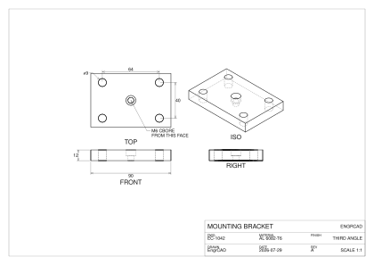
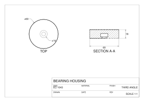
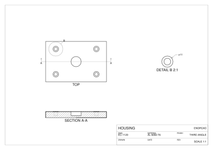
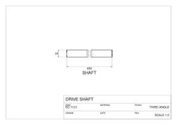
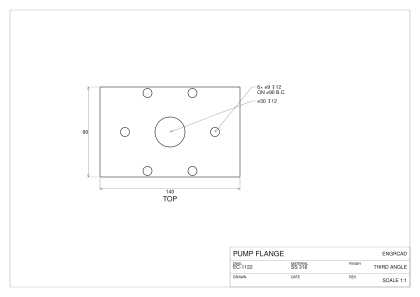
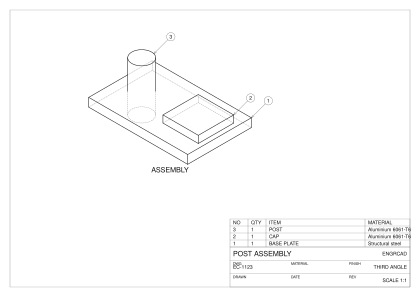
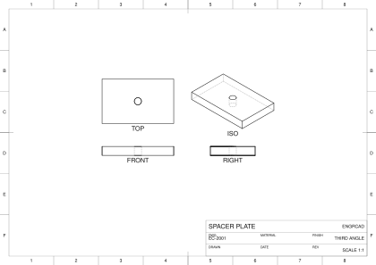
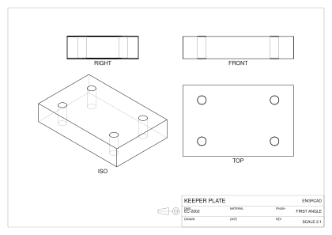
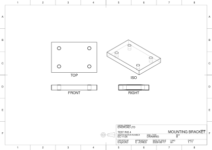
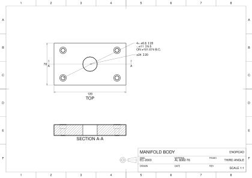

A model becomes a **drawing** in three steps, and EngrCAD owns all three:

1. **Hidden-line removal** (`HiddenLineRemoval`) projects a scene's edges into a view
   plane and classifies each piece *visible* or *hidden*.
2. A **sheet** (`DrawingSheet`) places those views on paper with a border and a title
   block, at a standard scale, in first- or third-angle projection.
3. **Export** writes the sheet as SVG or DXF, with every line class on its own layer,
   so the file opens in a drafting package looking the way a drawing should — or as
   PDF, the format a drawing is actually sent in.

The result is a document you can send to a machinist.

## A three-view sheet

`DrawingSheet.StandardLayout` builds the classic set — front, top, right and an
isometric — at one shared scale, chosen as the largest [ISO 5455](https://www.iso.org/standard/11418.html)
ratio that fits the paper. The three orthographic directions come from
`StandardViews`, which is the **same table the viewer's Front/Top/Right buttons read**,
so a drawing's FRONT and the model on screen can never disagree.

```csharp svg:drawing-sheet
var top = SketchPlane.At((0, 0, 6), Vector3d.UnitX, Vector3d.UnitY);
var bracket = Shape.Box(90, 60, 12)
    .Drill(HoleSpec.Simple(9),
        [new Vector2d(-32, -20), new Vector2d(32, -20),
         new Vector2d(-32, 20), new Vector2d(32, 20)], depth: 14, top)
    .Drill(HoleSpec.Counterbore(6.6, 11, 6.8), [new Vector2d(0, 0)], depth: 14, top);

var scene = new Scene();
scene.Add(new Part("bracket", bracket));

var sheet = DrawingSheet.StandardLayout(scene, SheetFormat.A3);
sheet.Title = sheet.Title with
{
    Title = "MOUNTING BRACKET",
    DrawingNumber = "EC-1042",
    Material = "AL 6082-T6",
    Author = "EngrCAD",
    Date = "2026-07-29",
    Revision = "A",
    Company = "ENGRCAD",
};

// Dimensions are placed in the VIEW's own projected coordinates, so they measure the
// part; their arrowheads and lettering are sized in sheet millimetres, so they stay
// printable whatever scale the layout chose.
var front = sheet.Views[0];
front.Annotate(SheetLinearDimension.Horizontal((-45, -6), (45, -6), -14));
front.Annotate(SheetLinearDimension.Vertical((-45, -6), (-45, 6), 14));

// A positive standoff sits to the LEFT of a->b, so the sign says which side.
var plan = sheet.Views[1];
plan.Annotate(SheetLinearDimension.Horizontal((-32, 20), (32, 20), 12));
plan.Annotate(SheetLinearDimension.Vertical((32, -20), (32, 20), -18));
plan.Annotate(SheetRadialDimension.Diameter((-32, 20), 4.5, 135));
plan.Annotate(new SheetNote((0, 0), (18, -34), "M6 CBORE\nFROM THIS FACE"));

var svg = sheet.ToSvg();
```



Hidden detail comes out dashed automatically — the four bolt holes and the counterbore
are dashed in the front and right views because the probe found material in front of
them, not because anyone said so.

## Section views

A **section view** is an ordinary view with a depth: `SectionThrough` removes
everything nearer the viewer than that point, and the faces the cut lays open are drawn
and hatched.

The cutting plane is perpendicular to the view direction **by construction**, which is
not a limitation but the definition — that is what makes the exposed faces project in
true shape, and therefore worth hatching and dimensioning. (For an oblique cut, take a
view along the oblique normal.)

```csharp svg:drawing-section
var top = SketchPlane.At((0, 0, 9), Vector3d.UnitX, Vector3d.UnitY);
var housing = Shape.Cylinder(30, 18).Translate(0, 0, 9)
    .Drill(HoleSpec.Counterbore(8, 15, 6), [new Vector2d(0, 0)], depth: 20, top);

var part = new Part("housing", housing);
var sheet = new DrawingSheet(SheetFormat.A4);

var plan = new DrawingView(part, StandardViews.DirectionFor("top")!.Value, "TOP")
{
    Scale = 1,
    Center = (90, 140),
};
plan.Annotate(SheetRadialDimension.Diameter((0, 0), 30, 130));
plan.Annotate(SheetRadialDimension.Diameter((0, 0), 7.5, 310));

var section = new DrawingView(part, StandardViews.DirectionFor("front")!.Value, "SECTION A-A")
{
    Scale = 1,
    Center = (215, 140),
    SectionThrough = (0, 0, 0),   // cut on the axis, keep the far half
};
section.Annotate(new SheetLinearDimension((30, 0), (30, 18), -14));
section.Annotate(SheetLinearDimension.Horizontal((-30, 0), (30, 0), -16));

sheet.Add(plan).Add(section);
sheet.Title = sheet.Title with { Title = "BEARING HOUSING", DrawingNumber = "EC-1043" };

var svg = sheet.ToSvg();
```



The hatch is clipped **exactly** to the cut regions by an even-odd scan, so it stops at
the bore rather than crossing it, and every cut face on a sheet shares one continuous
45-degree pattern (hatch lines are anchored to the origin, not to each region's own
bounds).

## Section, detail and broken views

A drawing is rarely three views of the whole part. A **section** shows what is inside, a
**detail** blows up a corner too small to dimension, and a **broken view** elides the dull
middle of something long. All three are derived from a view that already exists, and each
leaves a mark on the view it came from.

`DrawingView.SectionOf` builds a section AND the reference that puts the **cutting line** on
its parent: the chain-dashed line where the plane cuts, an arrow at each end pointing the way
the section looks, and the section's letter beyond each arrow. The plane shows as a *line*
exactly when the section's direction is square to the parent's — projecting a plane along a
direction that is not in it covers the whole sheet — so anything else is refused by name.

`DrawingView.DetailOf` blows up a disc of its parent's projection. It **shares** the parent's
projection rather than re-projecting, so it is a clip of exactly the line work the parent
shows, and the parent gets the circle with the detail's letter beside it.

```csharp svg:drawing-derived-views
var top = SketchPlane.At((0, 0, 12), Vector3d.UnitX, Vector3d.UnitY);
var housing = Shape.Box(120, 80, 12)
    .Drill(StandardHoles.Counterbored(6), LocationSet.Grid(2, 2, 80, 50), depth: 14, top)
    .Drill(HoleSpec.Simple(20), [new Vector2d(0, 0)], depth: 14, top);

var part = new Part("housing", housing);
var sheet = new DrawingSheet(SheetFormat.A3);

var plan = new DrawingView(part, StandardViews.DirectionFor("top")!.Value, "TOP")
{
    Scale = 1,
    Center = (150, 175),
};

// A section of the plan, cut on its own centre line. The cutting line, its arrows and its
// letters appear on the PLAN — the sheet reads the reference and draws the mark.
var section = DrawingView.SectionOf(
    plan, StandardViews.DirectionFor("front")!.Value, new Vector3d(0, 0, 0), "A");
section.Center = (150, 70);

// A detail of one bolt hole, at twice the plan's scale.
var detail = DrawingView.DetailOf(plan, new Vector2d(-40, 25), 14, magnification: 2, "B");
detail.Center = (330, 175);
detail.Annotate(SheetRadialDimension.Diameter((-40, 25), 5.5, 40));

sheet.Add(plan).Add(section).Add(detail);
sheet.Title = sheet.Title with
{
    Title = "HOUSING", DrawingNumber = "EC-1120", Material = "AL 6082-T6", Company = "ENGRCAD",
};

var svg = sheet.ToSvg();
```



A **broken view** removes a band of the view's own coordinates and slides the far side in, so a
long part fits the paper at a scale that shows its detail. The break lines mark where the
material was elided.

**Its dimensions stay true, and that is the whole substance of the feature.** A
`SheetAnnotation` reads its VALUE from its anchors in the view's model coordinates and draws
its anatomy through the view's map onto the sheet — so a dimension spanning the break measures
the shaft's real length while its arrows land on the drawn, shortened view. Nothing has to
remember to state the true value: the value never went through the break at all.

```csharp svg:drawing-broken-view
var shaft = new Part("shaft", Shape.Cylinder(12, 400).Rotate(Vector3d.UnitY, Math.PI / 2));

var sheet = new DrawingSheet(SheetFormat.A4);
var view = new DrawingView(shaft, StandardViews.DirectionFor("front")!.Value, "SHAFT")
{
    Scale = 0.5,
    Center = (150, 120),
    // Elide 260 mm of the middle, leaving 12 mm of drawn gap between the break lines.
    Break = ViewBreak.Between(BreakAxis.Horizontal, -130, 130, gap: 12),
};

// The overall length is dimensioned across the break and reads 400 -- the part's own length,
// not the 152 the drawing spans.
view.Annotate(SheetLinearDimension.Horizontal((-200, -12), (200, -12), -16));
view.Annotate(SheetLinearDimension.Vertical((-200, -12), (-200, 12), 14));

sheet.Add(view);
sheet.Title = sheet.Title with { Title = "DRIVE SHAFT", DrawingNumber = "EC-1121" };

var svg = sheet.ToSvg();
```



The gap is stated in MODEL units rather than paper millimetres, deliberately: a paper gap would
make the view's size a function of the drawing scale and the scale a function of the view's
size, which is circular.

## Auto-dimensioning

`AutoDimension.Apply` places the dimensions a drawing obviously needs — the overall extents of
each view, and one callout per hole family with its diameter, depth and pattern. It reads the
**construction graph**, exactly as [`HoleTable`](annotations.md) does, rather than measuring
circles in the projection: the drill's spec, its depth and its points are already in the model,
which is the same reason a hole table cannot put an M6 callout on an M10 hole.

Only the PATTERN is inferred, and that inference is closed form: a bolt circle is "every point
the same distance from their centroid", which is what `LocationSet.Polar` constructs, so its
diameter comes back as exactly twice that distance. Anything the recogniser does not know is
reported as no pattern rather than as an approximate one.

**Explicit placement stays the contract.** Everything the pass adds is an ordinary
`SheetAnnotation` on the view, so you keep, move or delete any of it. The placement rule is
stated rather than searched — overall width below, overall height left, callouts out to a
common column on the right — which is what makes "nothing it places overlaps anything else or
the view" a property a test can assert rather than a hope.

```csharp svg:drawing-auto-dimension
var top = SketchPlane.At((0, 0, 10), Vector3d.UnitX, Vector3d.UnitY);
var flange = Shape.Box(140, 90, 10)
    .Drill(StandardHoles.Clearance(8), LocationSet.Polar(6, 45), depth: 12, top)
    .Drill(HoleSpec.Simple(30), [new Vector2d(0, 0)], depth: 12, top);

var sheet = new DrawingSheet(SheetFormat.A3);
var plan = new DrawingView(new Part("flange", flange), StandardViews.DirectionFor("top")!.Value, "TOP")
{
    Scale = 1,
    Center = (170, 165),
};

// One call. The extents come from the view, the callouts from the drill nodes.
var placed = AutoDimension.Apply(plan);
if (placed.Count < 4)
    throw new Exception($"expected extents plus two hole callouts, got {placed.Count}");

sheet.Add(plan);
sheet.Title = sheet.Title with
{
    Title = "PUMP FLANGE", DrawingNumber = "EC-1122", Material = "SS 316", Company = "ENGRCAD",
};

var svg = sheet.ToSvg();
```



## Balloons and a parts list

`SheetPartsList` draws the parts list above the title block, and `BomBalloons.Attach` puts a
circled item number on each part in a view. **Both read one `Bom`**, so a drawing cannot label
a part with a number its own list does not carry — the item number is the BOM's own line index,
and there is no second place for it to come from.

The leader anchor is a **visible** point of the line work of the occurrence it labels. A
projection knows which instance produced each run (`HiddenLineRun.Instance`), so the balloon
points at the part it names rather than at whatever is nearest, and never at a dashed edge —
which would be pointing through the material at something the reader cannot see. A part with no
visible line work in that view simply gets no balloon.

```csharp svg:drawing-parts-list
var baseplate = new Part("BASE PLATE", Shape.Box(140, 90, 12)) { Material = Materials.Steel };
var post = new Part("POST", Shape.Cylinder(14, 70).Translate(-40, 0, 12))
{
    Material = Materials.Aluminium6061,
};
var cap = new Part("CAP", Shape.Box(50, 50, 10).Translate(40, 0, 12))
{
    Material = Materials.Aluminium6061,
};

var scene = new Scene();
scene.Add(baseplate);
scene.Add(post);
scene.Add(cap);

var sheet = new DrawingSheet(SheetFormat.A3);
var iso = new DrawingView(scene, StandardViews.DirectionFor("iso")!.Value, "ASSEMBLY")
{
    Scale = 1,
    Center = (170, 190),
};

// One bill of materials feeds both the balloons and the table.
var list = new SheetPartsList(Bom.For(scene));
var balloons = BomBalloons.Attach(iso, list);
if (balloons.Count != 3)
    throw new Exception($"expected a balloon per part, got {balloons.Count}");

sheet.PartsList = list;
sheet.Add(iso);
sheet.Title = sheet.Title with
{
    Title = "POST ASSEMBLY", DrawingNumber = "EC-1123", Company = "ENGRCAD",
};

var svg = sheet.ToSvg();
```




## Exporting a sheet

All three writers — SVG, DXF and PDF — consume the same `DrawingSheet.Compute()`
result, so they cannot disagree about what a drawing looks like — they differ only in
how a polyline, a dash pattern and a piece of text are spelled.

| Class | Layer | SVG | DXF |
| --- | --- | --- | --- |
| Visible edge | `visible` | solid, wide | CONTINUOUS |
| Hidden edge | `hidden` | dashed, narrow | HIDDEN |
| Cut boundary | `section` | solid | CENTER |
| Hatch | `hatch` | narrow solid | CONTINUOUS |
| Dimensions | `dimensions` | narrow solid | CONTINUOUS |
| Detail circles, break lines | `symbol` | narrow solid | CONTINUOUS |
| Cutting line | `section` | chain-dashed | CENTER |
| Border, title block, projection symbol | `border`, `titleblock` | narrow solid | CONTINUOUS |

A DXF that *names* a line type must also **define** it, or every reader falls back to
solid lines and the classification is lost in transit — so the writer emits an LTYPE
table for every pattern its layers use. A **multi-line note travels as one MTEXT**
(with the format's `\P` breaks and its attachment point), so a DXF consumer sees one
note rather than N unrelated strings — while the SVG and PDF outputs keep drawing the
same stacked lines, the grouping being semantic rather than a second geometry. This round-trips the whole sheet through the
landed reader on every docs build:

```csharp run:drawing-dxf
var plate = new Part("plate", Shape.Box(60, 40, 12)
    .Drill(HoleSpec.Simple(10), [new Vector2d(0, 0)], depth: 14,
        SketchPlane.At((0, 0, 6), Vector3d.UnitX, Vector3d.UnitY)));

var sheet = DrawingSheet.StandardLayout(plate, SheetFormat.A4);
sheet.Title = sheet.Title with { Title = "PLATE", DrawingNumber = "EC-0001" };
sheet.SaveDxf(Path.Combine(Scratch, "plate-drawing.dxf"));

var loaded = DxfDocument.LoadFile(Path.Combine(Scratch, "plate-drawing.dxf"));
if (loaded.Diagnostics.Count != 0)
    throw new Exception(string.Join("; ", loaded.Diagnostics));
if (!loaded.Layers.Contains(SheetLayers.Hidden))
    throw new Exception("hidden detail lost its layer");

var titles = loaded.Entities.OfType<DxfText>().Select(t => t.Value).ToList();
if (!titles.Contains("PLATE") || !titles.Contains("EC-0001"))
    throw new Exception("the title block did not survive the round trip");
```

### PDF — the deliverable format

What actually gets *sent* to a manufacturer is usually a PDF, so the sheet has a third
writer over the same `Compute()` result: `sheet.ToPdf()` / `sheet.SavePdf(path)`.
It is hand-written and dependency-free like every format here, and three choices are
worth knowing:

- **The file is uncompressed ASCII with no timestamp and no /ID**, so writing the same
  sheet twice produces byte-identical files — you can diff a drawing revision the way
  you diff its model. (Both fields are optional per the PDF spec; their natural values
  are exactly what would break that property.)
- **There is no y-flip.** PDF's page origin is the bottom-left with y up — the sheet's
  own convention — so the one transform in the file is the millimetre-to-point scale,
  and every coordinate in the content stream is the sheet's own millimetre value.
- **Text is the built-in Helvetica** (the same non-embedded system-font choice the SVG
  writer makes), encoded as WinAnsi. The drafting diameter sign U+2300, which WinAnsi
  lacks, is carried as Ø — the standard typographic stand-in; any other character with
  no WinAnsi form is refused by name rather than silently replaced.

Line classes keep their SVG pens — hidden detail is dashed with exactly the SVG dash
pattern, from the same table, so the two exports cannot disagree. This fence verifies
the round-trip properties on every docs build:

```csharp run:drawing-pdf
var plate = new Part("plate", Shape.Box(60, 40, 12)
    .Drill(HoleSpec.Simple(10), [new Vector2d(0, 0)], depth: 14,
        SketchPlane.At((0, 0, 6), Vector3d.UnitX, Vector3d.UnitY)));

var sheet = DrawingSheet.StandardLayout(plate, SheetFormat.A4);
sheet.Title = sheet.Title with { Title = "PLATE", DrawingNumber = "EC-0001" };
var path = Path.Combine(Scratch, "plate-drawing.pdf");
sheet.SavePdf(path);

// Writing the same sheet twice is a byte fixed point — no timestamps, no random IDs.
byte[] first = File.ReadAllBytes(path);
if (!first.SequenceEqual(sheet.ToPdf()))
    throw new Exception("the PDF is not a deterministic function of the sheet");

// The file is uncompressed ASCII, so its properties are visible to a plain read:
// header and trailer, the hidden line class's dash pattern, and the title text.
string text = System.Text.Encoding.ASCII.GetString(first);
if (!text.StartsWith("%PDF-1.4") || !text.TrimEnd().EndsWith("%%EOF"))
    throw new Exception("not a well-formed PDF envelope");
if (!text.Contains("[1.2 0.8] 0 d"))
    throw new Exception("hidden detail lost its dash pattern");
if (!text.Contains("(PLATE)"))
    throw new Exception("the title block did not reach the PDF");
```

(A PDF cannot render as a docs image the way an SVG can, so this fence verifies the
file rather than showing it; the tests go further, re-reading the file through an
independently written PDF parser and asserting every polyline's coordinates round-trip
bit for bit.)

`sheet.SaveSvg(path)`, `sheet.SaveDxf(path)` and `sheet.SavePdf(path)` write files;
`sheet.ToSvg()`, `sheet.ToDxf()` and `sheet.ToPdf()` hand back the document if you
would rather post-process it.

## The shared frame

The paper, the border and the title block are a `DrawingFrame` — **one value type both this
mechanical sheet and the ECAD [schematic sheet](ecad-schematic-sheet.md) draw from**, so a
drawing and a schematic of one project share one look and cannot drift. It is one *pure
function* of its parameters (`sheet.Frame().Compute()`), which is the whole point: two sheets
given the same paper, the same title-block fields and the same frame options produce
byte-identical furniture because they call one function. The two blocks differ *today* — the
mechanical block is a three-band engineering layout, the schematic block a two-band one — so
the frame carries both parameterisations and each sheet picks its own; the extraction unified
the code and the value type, not the default appearance.

`SheetFormat` is the one paper-size table the frame reads: the ISO 216 **A** and **B** series
and the ANSI/ASME Y14.1 **A–E** sizes (`SheetFormat.All`), all landscape, `.Portrait` to turn
one over.

### Opt-in sheet standards (ISO 5457)

`FrameStandards` adds standard furniture, **off by default** so an existing sheet is
byte-identical. `FrameStandards.Iso5457` draws the ISO 5457 border: a **zone grid** (column
numbers across, row letters down each side, with I and O omitted) and **centring marks** at
the middle of each side — all in the margin band, so they never reach the drawing area.

```csharp svg:drawing-frame-iso5457
var scene = new Scene();
scene.Add(new Part("plate", Shape.Box(80, 50, 10)
    .Drill(HoleSpec.Simple(8), [new Vector2d(0, 0)], depth: 12,
        SketchPlane.At((0, 0, 5), Vector3d.UnitX, Vector3d.UnitY))));

var sheet = DrawingSheet.StandardLayout(scene, SheetFormat.A3);
sheet.Title = sheet.Title with
{
    Title = "SPACER PLATE", DrawingNumber = "EC-2001", Company = "ENGRCAD",
};

// Opt in to the ISO 5457 border: a zone grid and centring marks, drawn in the margin band.
sheet.Standards = FrameStandards.Iso5457;

var svg = sheet.ToSvg();
```



The zone COUNTS are ISO 5457's own, transcribed per sheet size
(`Iso5457Zones`) — A0 is 24 fields along its long side by 16 across, down to A4's 6 by 4 — and a
paper the standard does not tabulate falls back to rounding the border to a nominal field size
(`FrameStandards.NominalZone`), which is not a lesser answer for a custom sheet: 25–75 mm *is*
what the standard says a field should be. The match is on the **paper's own dimensions** rather
than a format name, so a `.Portrait` sheet and a custom format that happens to measure A3 both
get A3's counts — the counts are a property of the paper, and a name is not.

A table replacing a rounding is a change to existing output, so it is worth saying which sheets
move: **A0, A1 and A2 each gain one division** where the rounding fell short (A0 23 → 24
columns, A1 11 → 12 rows, A2 11 → 12 columns), while **A3 and A4 are unchanged** — so every
committed A3 or A4 drawing is byte-identical to what it was.

### The projection symbol (ISO 128)

`FrameStandards.ProjectionSymbol` draws the truncated cone in two views beside the title block.
It is **derived rather than transcribed**: put the frustum's axis along the sheet's x with its
small end to the left, and the other view is the one looking along the axis at that small end —
a view from the LEFT. The sheet's own layout rule places a view from the left on the left in
third angle and on the right in first, so the pair of circles swaps sides while the trapezoid
does not. Reading the symbol off the layout rule rather than off a picture is what stops the
symbol and the layout disagreeing.

It needs both halves to ask for it — the standards must switch it on and the frame must know its
angle — so a frame that predates it draws exactly what it always did.

```csharp svg:drawing-first-angle
var scene = new Scene();
scene.Add(new Part("keeper", Shape.Box(70, 45, 14)
    .Drill(StandardHoles.Clearance(5), LocationSet.Grid(2, 2, 46, 26), depth: 16,
        SketchPlane.At((0, 0, 7), Vector3d.UnitX, Vector3d.UnitY))));

// First angle: every view lands on the OPPOSITE side from third, and the symbol follows,
// because both read the one layout rule.
var sheet = DrawingSheet.StandardLayout(scene, SheetFormat.A3, ProjectionAngle.First);
sheet.Title = sheet.Title with
{
    Title = "KEEPER PLATE", DrawingNumber = "EC-2002", Company = "ENGRCAD",
};
sheet.Standards = FrameStandards.None with { ProjectionSymbol = true };

var svg = sheet.ToSvg();
```



### An ISO 7200 title block

`Iso7200TitleBlock` is a second `TitleBlockLayout` beside the engineering one, printing
[ISO 7200](https://www.iso.org/standard/34490.html)'s data fields: the legal owner, the title
and its supplementary title, the identification number, document type and revision, and who
created and approved it, when, in what language and on which sheet. The four fields the standard
makes **mandatory** — legal owner, identification number, date of issue and sheet number — are
marked as such in `Iso7200TitleBlock.Fields`, which is the transcription a test reads back
rather than a list buried in the layout. ⚠ The field list is transcribed; verify it against the
standard before it goes on a controlled drawing.

A field the drawing has not stated prints its caption and nothing else, which is what a blank
form does. The layout is an override (`DrawingSheet.TitleBlockLayoutOverride`), so a sheet that
says nothing keeps the engineering block.

```csharp svg:drawing-iso7200
var scene = new Scene();
scene.Add(new Part("bracket", Shape.Box(90, 60, 10)
    .Drill(StandardHoles.Clearance(6), LocationSet.Grid(2, 2, 60, 36), depth: 12,
        SketchPlane.At((0, 0, 5), Vector3d.UnitX, Vector3d.UnitY))));

var sheet = DrawingSheet.StandardLayout(scene, SheetFormat.A3);
sheet.Title = sheet.Title with
{
    Company = "ENGRCAD LTD",
    Title = "MOUNTING BRACKET",
    Project = "TEST RIG 4",
    DrawingNumber = "EC-1124",
    DocumentType = "DRAWING",
    Revision = "B",
    Author = "EngrCAD",
    ApprovedBy = "C. JONES",
    Date = "2026-08-17",
    Language = "en",
    Sheet = "1 / 1",
};

// The ISO 7200 field layout, and the ISO 128 projection symbol beside it.
sheet.TitleBlockLayoutOverride = Iso7200TitleBlock.Default;
sheet.Standards = FrameStandards.Iso5457 with { ProjectionSymbol = true };

var svg = sheet.ToSvg();
```



## Putting a whole drawing together

Nothing here is a mode, so the pieces compose: a standard layout, a section marked on its own
parent, auto-dimensions read off the construction graph, and the ISO 5457 border with its
projection symbol — each an ordinary call on the same sheet.

```csharp svg:drawing-complete
var top = SketchPlane.At((0, 0, 9), Vector3d.UnitX, Vector3d.UnitY);
var manifold = Shape.Box(120, 70, 18)
    .Drill(StandardHoles.Counterbored(6), LocationSet.Grid(2, 2, 90, 46), depth: 20, top)
    .Drill(HoleSpec.Simple(24), [new Vector2d(0, 0)], depth: 20, top);

var part = new Part("manifold", manifold);
var sheet = new DrawingSheet(SheetFormat.A3);

var plan = new DrawingView(part, StandardViews.DirectionFor("top")!.Value, "TOP")
{
    Scale = 1,
    Center = (150, 190),
};
AutoDimension.Apply(plan);

// The section marks its own cutting line, arrows and letters on the plan.
var section = DrawingView.SectionOf(
    plan, StandardViews.DirectionFor("front")!.Value, new Vector3d(0, 0, 0), "A");
section.Center = (150, 80);

sheet.Add(plan).Add(section);
sheet.Standards = FrameStandards.Iso5457 with { ProjectionSymbol = true };
sheet.Title = sheet.Title with
{
    Title = "MANIFOLD BODY",
    DrawingNumber = "EC-2003",
    Material = "AL 6082-T6",
    Company = "ENGRCAD",
    Project = "TEST RIG 4",
    Sheet = "1 / 1",
};

var svg = sheet.ToSvg();
```



## What the projection is honest about

The line work is **exact wherever the kernel has it**: for a B-Rep-backed part the
edges are sampled from the actual edge curves at display resolution, so a bore rim is a
smooth circle however coarse the mesh. Two things are not exact, and the output says so
via `HiddenLineRun.Source`:

- **The outline of a smooth surface** (`EdgeSource.Silhouette`). A cylinder seen from
  the side has no modelled edge along its outline, so one is taken from the display
  mesh's view-dependent silhouette. It is faceted at mesh resolution. True silhouette
  curves on curved surfaces are the known upgrade.
- **Visibility itself.** The question "is there material in front of this point" is
  answered against the display mesh, so a coarser mesh means a coarser dash boundary.
  It is refined by bisection to `HiddenLineOptions.SplitFraction` (1e-5 of the model's
  extent by default), which is far finer than a drawn line is wide.

Everything else is decided exactly. The first stage of the visibility test reads the
point's **own** surface: if every face around it points away from the viewer, it is
buried in its own material and is hidden with no ray cast at all — which settles most
of a solid's edges, for free and without touching a mesh.

```csharp run:drawing-hlr
var part = new Part("box", Shape.Box(40, 20, 10));
var iso = StandardViews.SheetFrame(StandardViews.DirectionFor("iso")!.Value);
var result = HiddenLineRemoval.Project(part, iso);

// Seen from a corner, exactly the three edges meeting at the FAR corner are hidden;
// an axis-parallel edge of length L projects to L*sqrt(2/3) from the iso direction.
double expected = (40 + 20 + 10) * Math.Sqrt(2.0 / 3);
double hidden = result.Hidden.Sum(r => r.Length);
if (Math.Abs(hidden - expected) > 0.2)
    throw new Exception($"expected about {expected:F2} of dashed line, got {hidden:F2}");
if (result.Runs.Any(r => r.Source == EdgeSource.Silhouette))
    throw new Exception("a box has no smooth surface to silhouette");
```

## Options

`HiddenLineOptions` is scale-free: every length is a **fraction of the projected
geometry's extent**, so a drawing of a 4 mm dowel and a drawing of a 4 m beam behave
the same.

| Option | Default | What it does |
| --- | --- | --- |
| `BiasFraction` | 1e-3 | How far a probe steps off the surface before casting. Must exceed the tessellation's chord error; raise it for a deliberately coarse mesh. |
| `SampleFraction` | 1/200 | Spacing of visibility samples along an edge. |
| `SplitFraction` | 1e-5 | How precisely a dash boundary is located by bisection. |
| `MinimumRunFraction` | 2e-3 | Runs shorter than this are absorbed into their neighbour — the "shorter than a pen stroke" rule. |
| `IncludeSilhouette` | true | Draw the mesh-derived outline of smooth surfaces. |
| `IncludeHidden` | true | Emit hidden runs at all. |
| `SectionThrough` | null | Cut everything nearer the viewer than this point. |

Parts follow the same visibility rules an export does: a `Hidden` part contributes
nothing (not even occlusion), a `Ghost` part is left off (a translucent line means
nothing on paper), and a part with `ClippedBySection = false` passes through a section
whole — the drafting convention that shafts, bolts, nuts, keys and pins are drawn
unsectioned.

## Related

- [2D views](2d-views.md) — `Shape.Section` and `Shape.Silhouette`, the region-level
  projections a sheet's cut faces are built from.
- [DXF & SVG](dxf-svg.md) — the 2D interchange layer a sheet writes through.
- [3D annotations (PMI)](annotations.md) — the same dimension anatomy attached to the
  model itself rather than to a sheet.
