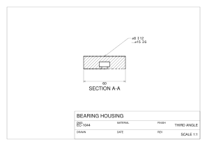

A model becomes a **drawing** in three steps, and EngrCAD owns all three:

1. **Hidden-line removal** (`HiddenLineRemoval`) projects a scene's edges into a view
   plane and classifies each piece *visible* or *hidden*.
2. A **sheet** (`DrawingSheet`) places those views on paper with a border and a title
   block, at a standard scale, in first- or third-angle projection.
3. **Export** writes the sheet as SVG or DXF, with every line class on its own layer,
   so the file opens in a drafting package looking the way a drawing should — or as
   PDF, the format a drawing is actually sent in.

The result is a document you can send to a machinist.

## A three-view sheet

`DrawingSheet.StandardLayout` builds the classic set — front, top, right and an
isometric — at one shared scale, chosen as the largest [ISO 5455](https://www.iso.org/standard/11418.html)
ratio that fits the paper. The three orthographic directions come from
`StandardViews`, which is the **same table the viewer's Front/Top/Right buttons read**,
so a drawing's FRONT and the model on screen can never disagree.

```csharp svg:drawing-sheet
var top = SketchPlane.At((0, 0, 6), Vector3d.UnitX, Vector3d.UnitY);
var bracket = Shape.Box(90, 60, 12)
    .Drill(HoleSpec.Simple(9),
        [new Vector2d(-32, -20), new Vector2d(32, -20),
         new Vector2d(-32, 20), new Vector2d(32, 20)], depth: 14, top)
    .Drill(HoleSpec.Counterbore(6.6, 11, 6.8), [new Vector2d(0, 0)], depth: 14, top);

var scene = new Scene();
scene.Add(new Part("bracket", bracket));

var sheet = DrawingSheet.StandardLayout(scene, SheetFormat.A3);
sheet.Title = sheet.Title with
{
    Title = "MOUNTING BRACKET",
    DrawingNumber = "EC-1042",
    Material = "AL 6082-T6",
    Author = "EngrCAD",
    Date = "2026-07-29",
    Revision = "A",
    Company = "ENGRCAD",
};

// Dimensions are placed in the VIEW's own projected coordinates, so they measure the
// part; their arrowheads and lettering are sized in sheet millimetres, so they stay
// printable whatever scale the layout chose.
var front = sheet.Views[0];
front.Annotate(SheetLinearDimension.Horizontal((-45, -6), (45, -6), -14));
front.Annotate(SheetLinearDimension.Vertical((-45, -6), (-45, 6), 14));

// A positive standoff sits to the LEFT of a->b, so the sign says which side.
var plan = sheet.Views[1];
plan.Annotate(SheetLinearDimension.Horizontal((-32, 20), (32, 20), 12));
plan.Annotate(SheetLinearDimension.Vertical((32, -20), (32, 20), -18));
plan.Annotate(SheetRadialDimension.Diameter((-32, 20), 4.5, 135));
plan.Annotate(new SheetNote((0, 0), (18, -34), "M6 CBORE\nFROM THIS FACE"));

var svg = sheet.ToSvg();
```


Hidden detail comes out dashed automatically — the four bolt holes and the counterbore
are dashed in the front and right views because the probe found material in front of
them, not because anyone said so.

## Section views

A **section view** is an ordinary view with a depth: `SectionThrough` removes
everything nearer the viewer than that point, and the faces the cut lays open are drawn
and hatched.

The cutting plane is perpendicular to the view direction **by construction**, which is
not a limitation but the definition — that is what makes the exposed faces project in
true shape, and therefore worth hatching and dimensioning. (For an oblique cut, take a
view along the oblique normal.)

```csharp svg:drawing-section
var top = SketchPlane.At((0, 0, 9), Vector3d.UnitX, Vector3d.UnitY);
var housing = Shape.Cylinder(30, 18).Translate(0, 0, 9)
    .Drill(HoleSpec.Counterbore(8, 15, 6), [new Vector2d(0, 0)], depth: 20, top);

var part = new Part("housing", housing);
var sheet = new DrawingSheet(SheetFormat.A4);

var plan = new DrawingView(part, StandardViews.DirectionFor("top")!.Value, "TOP")
{
    Scale = 1,
    Center = (90, 140),
};
plan.Annotate(SheetRadialDimension.Diameter((0, 0), 30, 130));
plan.Annotate(SheetRadialDimension.Diameter((0, 0), 7.5, 310));

var section = new DrawingView(part, StandardViews.DirectionFor("front")!.Value, "SECTION A-A")
{
    Scale = 1,
    Center = (215, 140),
    SectionThrough = (0, 0, 0),   // cut on the axis, keep the far half
};
section.Annotate(new SheetLinearDimension((30, 0), (30, 18), -14));
section.Annotate(SheetLinearDimension.Horizontal((-30, 0), (30, 0), -16));

sheet.Add(plan).Add(section);
sheet.Title = sheet.Title with { Title = "BEARING HOUSING", DrawingNumber = "EC-1043" };

var svg = sheet.ToSvg();
```


The hatch is clipped **exactly** to the cut regions by an even-odd scan, so it stops at
the bore rather than crossing it, and every cut face on a sheet shares one continuous
45-degree pattern (hatch lines are anchored to the origin, not to each region's own
bounds).

## Exporting a sheet

All three writers — SVG, DXF and PDF — consume the same `DrawingSheet.Compute()`
result, so they cannot disagree about what a drawing looks like — they differ only in
how a polyline, a dash pattern and a piece of text are spelled.

| Class | Layer | SVG | DXF |
| --- | --- | --- | --- |
| Visible edge | `visible` | solid, wide | CONTINUOUS |
| Hidden edge | `hidden` | dashed, narrow | HIDDEN |
| Cut boundary | `section` | solid | CENTER |
| Hatch | `hatch` | narrow solid | CONTINUOUS |
| Dimensions | `dimensions` | narrow solid | CONTINUOUS |
| Border, title block | `border`, `titleblock` | narrow solid | CONTINUOUS |

A DXF that *names* a line type must also **define** it, or every reader falls back to
solid lines and the classification is lost in transit — so the writer emits an LTYPE
table for every pattern its layers use. A **multi-line note travels as one MTEXT**
(with the format's `\P` breaks and its attachment point), so a DXF consumer sees one
note rather than N unrelated strings — while the SVG and PDF outputs keep drawing the
same stacked lines, the grouping being semantic rather than a second geometry. This round-trips the whole sheet through the
landed reader on every docs build:

```csharp run:drawing-dxf
var plate = new Part("plate", Shape.Box(60, 40, 12)
    .Drill(HoleSpec.Simple(10), [new Vector2d(0, 0)], depth: 14,
        SketchPlane.At((0, 0, 6), Vector3d.UnitX, Vector3d.UnitY)));

var sheet = DrawingSheet.StandardLayout(plate, SheetFormat.A4);
sheet.Title = sheet.Title with { Title = "PLATE", DrawingNumber = "EC-0001" };
sheet.SaveDxf(Path.Combine(Scratch, "plate-drawing.dxf"));

var loaded = DxfDocument.LoadFile(Path.Combine(Scratch, "plate-drawing.dxf"));
if (loaded.Diagnostics.Count != 0)
    throw new Exception(string.Join("; ", loaded.Diagnostics));
if (!loaded.Layers.Contains(SheetLayers.Hidden))
    throw new Exception("hidden detail lost its layer");

var titles = loaded.Entities.OfType<DxfText>().Select(t => t.Value).ToList();
if (!titles.Contains("PLATE") || !titles.Contains("EC-0001"))
    throw new Exception("the title block did not survive the round trip");
```

### PDF — the deliverable format

What actually gets *sent* to a manufacturer is usually a PDF, so the sheet has a third
writer over the same `Compute()` result: `sheet.ToPdf()` / `sheet.SavePdf(path)`.
It is hand-written and dependency-free like every format here, and three choices are
worth knowing:

- **The file is uncompressed ASCII with no timestamp and no /ID**, so writing the same
  sheet twice produces byte-identical files — you can diff a drawing revision the way
  you diff its model. (Both fields are optional per the PDF spec; their natural values
  are exactly what would break that property.)
- **There is no y-flip.** PDF's page origin is the bottom-left with y up — the sheet's
  own convention — so the one transform in the file is the millimetre-to-point scale,
  and every coordinate in the content stream is the sheet's own millimetre value.
- **Text is the built-in Helvetica** (the same non-embedded system-font choice the SVG
  writer makes), encoded as WinAnsi. The drafting diameter sign U+2300, which WinAnsi
  lacks, is carried as Ø — the standard typographic stand-in; any other character with
  no WinAnsi form is refused by name rather than silently replaced.

Line classes keep their SVG pens — hidden detail is dashed with exactly the SVG dash
pattern, from the same table, so the two exports cannot disagree. This fence verifies
the round-trip properties on every docs build:

```csharp run:drawing-pdf
var plate = new Part("plate", Shape.Box(60, 40, 12)
    .Drill(HoleSpec.Simple(10), [new Vector2d(0, 0)], depth: 14,
        SketchPlane.At((0, 0, 6), Vector3d.UnitX, Vector3d.UnitY)));

var sheet = DrawingSheet.StandardLayout(plate, SheetFormat.A4);
sheet.Title = sheet.Title with { Title = "PLATE", DrawingNumber = "EC-0001" };
var path = Path.Combine(Scratch, "plate-drawing.pdf");
sheet.SavePdf(path);

// Writing the same sheet twice is a byte fixed point — no timestamps, no random IDs.
byte[] first = File.ReadAllBytes(path);
if (!first.SequenceEqual(sheet.ToPdf()))
    throw new Exception("the PDF is not a deterministic function of the sheet");

// The file is uncompressed ASCII, so its properties are visible to a plain read:
// header and trailer, the hidden line class's dash pattern, and the title text.
string text = System.Text.Encoding.ASCII.GetString(first);
if (!text.StartsWith("%PDF-1.4") || !text.TrimEnd().EndsWith("%%EOF"))
    throw new Exception("not a well-formed PDF envelope");
if (!text.Contains("[1.2 0.8] 0 d"))
    throw new Exception("hidden detail lost its dash pattern");
if (!text.Contains("(PLATE)"))
    throw new Exception("the title block did not reach the PDF");
```

(A PDF cannot render as a docs image the way an SVG can, so this fence verifies the
file rather than showing it; the figures below show the SHEET each PDF carries, and the
tests go further, re-reading every file through an independently written PDF parser and
asserting the coordinates round-trip bit for bit.)

`sheet.SaveSvg(path)`, `sheet.SaveDxf(path)` and `sheet.SavePdf(path)` write files;
`sheet.ToSvg()`, `sheet.ToDxf()` and `sheet.ToPdf()` hand back the document if you
would rather post-process it.

### What a PDF can carry beyond its line work

Four things the writer will do on request. **Every one of them is opt-in, and asking
for none writes exactly the file above, byte for byte** — that property is asserted by
a byte comparison rather than argued, which is what makes each of them safe to reach
for on a drawing you have already issued.

```csharp
var pdf = sheet.ToPdf(new PdfSheetOptions
{
    Layers = true,                             // toggleable layers in the reader
    Compress = true,                           // Flate, ~5x smaller
    Font = PdfFont.Embed(font),                // the drafting symbols, non-Latin text
});
```

| | plate, A4 | bracket, A3 |
| --- | --- | --- |
| plain | 21 560 B | 108 358 B |
| `Layers` | 22 272 B | 109 070 B |
| `Compress` | **4 490 B (20.8%)** | **20 456 B (18.9%)** |
| both | 4 987 B | 20 988 B |
| `Font` embedded (Segoe UI Symbol) | 29 018 B | — |
| `Font` + `Compress` | 9 631 B | — |

(win-x64. The embedded row is the whole cost of a **subset**: the source font is a
2.5 MB, 9 410-glyph file and the drawing's own characters add 7 458 bytes to the sheet.)

#### An embedded font — the symbols WinAnsi cannot spell

The built-in Helvetica is encoded as WinAnsi, which has no form for the drafting depth
(↧), counterbore (⌴) or countersink (⌵) signs — a hole callout carrying one is refused
by name rather than silently mangled — and the diameter sign ⌀ only survives as its
O-stroke stand-in Ø. `PdfFont.Embed(font)` carries a real TrueType font as a **subset
of the glyphs the drawing actually uses**, addressed by glyph index, so the encoding has
no repertoire to be outside of and the symbols simply travel:

```csharp svg:drawing-pdf-symbols
string fonts = Environment.GetFolderPath(Environment.SpecialFolder.Fonts);
var font = TrueTypeFont.Load(Path.Combine(fonts, "seguisym.ttf"));

var top = SketchPlane.At((0, 0, 9), Vector3d.UnitX, Vector3d.UnitY);
var housing = Shape.Cylinder(30, 18).Translate(0, 0, 9)
    .Drill(HoleSpec.Counterbore(8, 15, 6), [new Vector2d(0, 0)], depth: 20, top);

var sheet = new DrawingSheet(SheetFormat.A4);
var section = new DrawingView(new Part("housing", housing),
                              StandardViews.DirectionFor("front")!.Value, "SECTION A-A")
{
    Scale = 1,
    Center = (150, 120),
    SectionThrough = (0, 0, 0),
};

// The callout a hole table prints. Three of these characters have NO WinAnsi form, so
// the built-in Helvetica refuses the string outright; an embedded font carries them.
section.Annotate(new SheetNote((0, 18), (34, 26), "\u23008 \u21A712\n\u2334\u230015 \u21A76"));
section.Annotate(SheetLinearDimension.Horizontal((-30, 0), (30, 0), -18));
sheet.Add(section);
sheet.Title = sheet.Title with { Title = "BEARING HOUSING", DrawingNumber = "EC-1044" };

// The built-in Helvetica cannot write this sheet AT ALL - the depth sign has no WinAnsi
// form, so the writer refuses BY NAME rather than dropping the character.
try
{
    sheet.ToPdf();
    throw new Exception("the standard-14 font should have refused the depth sign");
}
catch (NotSupportedException refusal) when (refusal.Message.Contains("U+21A7"))
{
    // Named, as it should be.
}

// With the font embedded, the same sheet writes and the symbols travel verbatim.
var bytes = sheet.ToPdf(new PdfSheetOptions { Font = PdfFont.Embed(font) });
if (!System.Text.Encoding.Latin1.GetString(bytes).Contains("/FontFile2"))
    throw new Exception("the subset font program did not reach the file");

var svg = sheet.ToSvg();
```



The subset is a **deterministic function of the glyph set** — the same drawing writes
the same bytes, because the font's own `created`/`modified` date stamps are zeroed on
the way in (they are the /Info problem wearing a font's clothes) and the glyphs are
visited in index order. It keeps the original glyph NUMBERING rather than renumbering,
which is what lets a composite glyph carry its components across untouched; the cost is
stated rather than hidden, in that the tables are sized by the largest glyph index used
rather than by the count. A PostScript (`.otf`) font is refused by name.

#### Toggleable layers

`Layers = true` puts each line class in a PDF **optional-content group**, named with the
same `SheetLayers` names the SVG groups and the DXF layer table use — so hidden detail,
hatch, dimensions and the title block can be switched off in a reader exactly as they
can in a drafting package. It costs a few hundred bytes and moves the declared version
to PDF 1.5 (optional content is a 1.5 feature).

```csharp run:drawing-pdf-layers
var plate = new Part("plate", Shape.Box(60, 40, 12)
    .Drill(HoleSpec.Simple(10), [new Vector2d(0, 0)], depth: 14,
        SketchPlane.At((0, 0, 6), Vector3d.UnitX, Vector3d.UnitY)));
var sheet = DrawingSheet.StandardLayout(plate, SheetFormat.A4);

// Asking for nothing writes the file it always wrote, byte for byte.
if (!sheet.ToPdf().SequenceEqual(sheet.ToPdf(PdfSheetOptions.Default)))
    throw new Exception("an all-default options value must be the incumbent file");

byte[] layered = sheet.ToPdf(new PdfSheetOptions { Layers = true });
string text = System.Text.Encoding.Latin1.GetString(layered);
if (!text.StartsWith("%PDF-1.5"))
    throw new Exception("optional content needs PDF 1.5");
foreach (string layer in new[] { SheetLayers.Visible, SheetLayers.Hidden, SheetLayers.TitleBlock })
{
    if (!text.Contains($"/Type /OCG /Name ({layer})"))
        throw new Exception($"the {layer} layer did not reach the PDF");
}
// Marked content must nest: one EMC for every BDC.
int opened = System.Text.RegularExpressions.Regex.Matches(text, @"/OC /OC\d+ BDC").Count;
int closed = System.Text.RegularExpressions.Regex.Matches(text, @"\bEMC\b").Count;
if (opened == 0 || opened != closed)
    throw new Exception($"unbalanced marked content: {opened} BDC against {closed} EMC");
```

#### Flate compression

`Compress = true` deflates the content stream (and any embedded font program) — about a
**fivefold** reduction on a real sheet. It is off by default because an uncompressed
ASCII drawing is what makes a revision diffable and what every assertion here reads
directly; turn it on for a very large sheet. The byte fixed point survives, and the
stronger claim the tests make is that **inflating recovers the uncompressed writer's own
stream byte for byte** — compression is a re-spelling and nothing else.

#### A loose profile, with the approximation named

PDF paths are lines and **cubic Béziers**, so `PdfDrawing.Add(sketch, ...)` writes a
sketch's straight segments and its Béziers EXACTLY (a quadratic having already elevated
to a cubic losslessly on the way into the sketch) while a circular or elliptical arc —
which has no exact PDF form at all — is approximated in the mode you name, to within the
tolerance you state. The returned `PdfSketchReport` says which segments were which and
measures the deviation from the construction, so nothing has to be guessed at:

```csharp svg:drawing-pdf-profile
// Lines and arcs, plus one cubic: a bracket outline with a bore.
var profile = Sketch.Start(0, 0)
    .LineTo(40, 0)
    .ArcTo((52, 12), radius: 12, clockwise: false)
    .LineTo(52, 30)
    .BezierTo((40, 42), (14, 42), (0, 30))
    .Close()
    .WithHole(Sketch.Circle(new Vector2d(26, 18), 7));

// Cubic Béziers ride into the file verbatim; the arcs do not, so they are approximated
// by the standard k = (4/3)tan(theta/4) construction to a stated 0.01 mm.
var pdf = new PdfDrawing { Margin = 6 };
var report = pdf.Add(profile, PdfCurveMode.Kappa, tolerance: 0.01);
if (report.ApproximatedSegments == 0 || report.MaxDeviation > 0.01)
    throw new Exception($"expected arcs approximated within the tolerance, got {report}");
pdf.SaveFile(Path.Combine(Scratch, "bracket-profile.pdf"));

// The same profile as SVG, which CAN carry an arc exactly - so this picture is the
// geometry the PDF approximates, not the approximation.
var drawing = new SvgDrawing { Margin = 6 };
drawing.Add(profile);
var svg = drawing.ToSvg();
```


`PdfCurveMode.Flatten` writes polylines instead; both honour the same stated deviation,
and the cubic route reaches it far more cheaply — measured on a rounded rectangle with a
bore at a 0.01 mm tolerance, **1 278 bytes against 5 074**, at a measured deviation of
1.6e-3 against 9.8e-3. The error of the cubic construction has an exact closed form,
`PdfDrawing.ArcCubicDeviation`, which is worth knowing for two reasons: the cubic lies
strictly OUTSIDE the arc (it never cuts into the part), and the error falls as the
**sixth** power of the span, so halving the number of spans multiplies it by 64 rather
than by the 16 a fourth-order rule would give. A quarter turn reads 2.7253e-4 of the
radius.

## The shared frame

The paper, the border and the title block are a `DrawingFrame` — **one value type both this
mechanical sheet and the ECAD [schematic sheet](ecad-schematic-sheet.md) draw from**, so a
drawing and a schematic of one project share one look and cannot drift. It is one *pure
function* of its parameters (`sheet.Frame().Compute()`), which is the whole point: two sheets
given the same paper, the same title-block fields and the same frame options produce
byte-identical furniture because they call one function. The two blocks differ *today* — the
mechanical block is a three-band engineering layout, the schematic block a two-band one — so
the frame carries both parameterisations and each sheet picks its own; the extraction unified
the code and the value type, not the default appearance.

`SheetFormat` is the one paper-size table the frame reads: the ISO 216 **A** and **B** series
and the ANSI/ASME Y14.1 **A–E** sizes (`SheetFormat.All`), all landscape, `.Portrait` to turn
one over.

### Opt-in sheet standards (ISO 5457)

`FrameStandards` adds standard furniture, **off by default** so an existing sheet is
byte-identical. `FrameStandards.Iso5457` draws the ISO 5457 border: a **zone grid** (column
numbers across, row letters down each side, with I and O omitted) and **centring marks** at
the middle of each side — all in the margin band, so they never reach the drawing area.

```csharp svg:drawing-frame-iso5457
var scene = new Scene();
scene.Add(new Part("plate", Shape.Box(80, 50, 10)
    .Drill(HoleSpec.Simple(8), [new Vector2d(0, 0)], depth: 12,
        SketchPlane.At((0, 0, 5), Vector3d.UnitX, Vector3d.UnitY))));

var sheet = DrawingSheet.StandardLayout(scene, SheetFormat.A3);
sheet.Title = sheet.Title with
{
    Title = "SPACER PLATE", DrawingNumber = "EC-2001", Company = "ENGRCAD",
};

// Opt in to the ISO 5457 border: a zone grid and centring marks, drawn in the margin band.
sheet.Standards = FrameStandards.Iso5457;

var svg = sheet.ToSvg();
```


The ISO 7200 title-block field layout is a filed follow-up; the zone COUNTS here come from a
nominal field size (`FrameStandards.NominalZone`) rather than ISO 5457's exact per-size table.

## What the projection is honest about

The line work is **exact wherever the kernel has it**: for a B-Rep-backed part the
edges are sampled from the actual edge curves at display resolution, so a bore rim is a
smooth circle however coarse the mesh. Two things are not exact, and the output says so
via `HiddenLineRun.Source`:

- **The outline of a smooth surface** (`EdgeSource.Silhouette`). A cylinder seen from
  the side has no modelled edge along its outline, so one is taken from the display
  mesh's view-dependent silhouette. It is faceted at mesh resolution. True silhouette
  curves on curved surfaces are the known upgrade.
- **Visibility itself.** The question "is there material in front of this point" is
  answered against the display mesh, so a coarser mesh means a coarser dash boundary.
  It is refined by bisection to `HiddenLineOptions.SplitFraction` (1e-5 of the model's
  extent by default), which is far finer than a drawn line is wide.

Everything else is decided exactly. The first stage of the visibility test reads the
point's **own** surface: if every face around it points away from the viewer, it is
buried in its own material and is hidden with no ray cast at all — which settles most
of a solid's edges, for free and without touching a mesh.

```csharp run:drawing-hlr
var part = new Part("box", Shape.Box(40, 20, 10));
var iso = StandardViews.SheetFrame(StandardViews.DirectionFor("iso")!.Value);
var result = HiddenLineRemoval.Project(part, iso);

// Seen from a corner, exactly the three edges meeting at the FAR corner are hidden;
// an axis-parallel edge of length L projects to L*sqrt(2/3) from the iso direction.
double expected = (40 + 20 + 10) * Math.Sqrt(2.0 / 3);
double hidden = result.Hidden.Sum(r => r.Length);
if (Math.Abs(hidden - expected) > 0.2)
    throw new Exception($"expected about {expected:F2} of dashed line, got {hidden:F2}");
if (result.Runs.Any(r => r.Source == EdgeSource.Silhouette))
    throw new Exception("a box has no smooth surface to silhouette");
```

## Options

`HiddenLineOptions` is scale-free: every length is a **fraction of the projected
geometry's extent**, so a drawing of a 4 mm dowel and a drawing of a 4 m beam behave
the same.

| Option | Default | What it does |
| --- | --- | --- |
| `BiasFraction` | 1e-3 | How far a probe steps off the surface before casting. Must exceed the tessellation's chord error; raise it for a deliberately coarse mesh. |
| `SampleFraction` | 1/200 | Spacing of visibility samples along an edge. |
| `SplitFraction` | 1e-5 | How precisely a dash boundary is located by bisection. |
| `MinimumRunFraction` | 2e-3 | Runs shorter than this are absorbed into their neighbour — the "shorter than a pen stroke" rule. |
| `IncludeSilhouette` | true | Draw the mesh-derived outline of smooth surfaces. |
| `IncludeHidden` | true | Emit hidden runs at all. |
| `SectionThrough` | null | Cut everything nearer the viewer than this point. |

Parts follow the same visibility rules an export does: a `Hidden` part contributes
nothing (not even occlusion), a `Ghost` part is left off (a translucent line means
nothing on paper), and a part with `ClippedBySection = false` passes through a section
whole — the drafting convention that shafts, bolts, nuts, keys and pins are drawn
unsectioned.

## Related

- [2D views](2d-views.md) — `Shape.Section` and `Shape.Silhouette`, the region-level
  projections a sheet's cut faces are built from.
- [DXF & SVG](dxf-svg.md) — the 2D interchange layer a sheet writes through.
- [3D annotations (PMI)](annotations.md) — the same dimension anatomy attached to the
  model itself rather than to a sheet.
