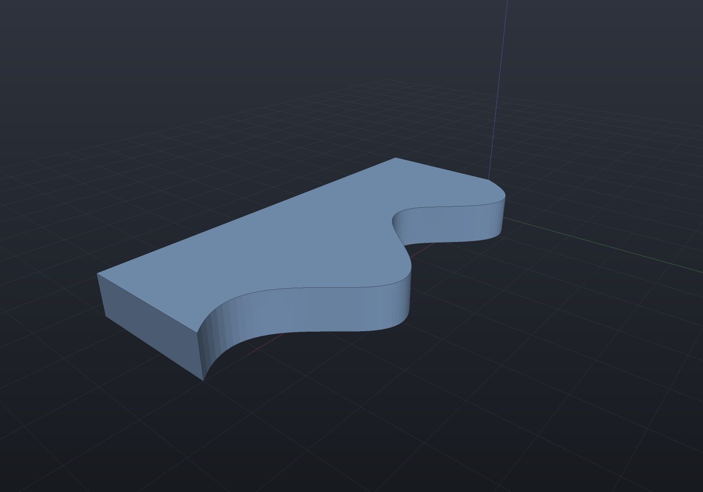

Two-dimensional geometry leaves and enters EngrCAD through two writers and one
reader, all dependency-free:

- **DXF** (`DxfDocument`) — the interchange seam with drafting packages and
  laser/plasma/router CAM: LINE, ARC, CIRCLE, LWPOLYLINE, SPLINE and TEXT entities with
  layers, both directions.
- **SVG** (`SvgDrawing`) — drawings for documentation and browsers, with **line-type
  control driven by edge classification** (visible / hidden / section — the thing
  that makes an exported drawing usable rather than a flat soup of curves).

## DXF out, DXF in

A sketch's lines and arcs are written **exactly**: an LWPOLYLINE vertex carries a
"bulge" (tan of a quarter of the arc's sweep), which encodes a circular arc with no
flattening, and a full-circle loop becomes a CIRCLE entity. Cubic béziers flatten at a
stated chord tolerance by default, or become exact SPLINE entities — see
[below](#cubics-exactly-spline-entities). This snippet round-trips on every docs build
and checks the exact area survived:

```csharp run:dxf-roundtrip
var plate = Sketch.RoundedRectangle(40, 24, 6);

var dxf = new DxfDocument();
dxf.Add(plate, layer: "outline");
dxf.Add(Sketch.Circle((-12, 0), 3), layer: "holes");
dxf.Add(Sketch.Circle((12, 0), 3), layer: "holes");
dxf.SaveFile(Path.Combine(Scratch, "plate.dxf"));

var loaded = DxfDocument.LoadFile(Path.Combine(Scratch, "plate.dxf"));
var sketches = loaded.ToSketches(out var diagnostics);
if (diagnostics.Count != 0) throw new Exception(string.Join("; ", diagnostics));
if (sketches.Count != 3) throw new Exception($"expected 3 loops, got {sketches.Count}");

// The arc encoding is exact, so the area survives to full precision.
double error = Math.Abs(sketches[0].Area() - plate.Area());
if (error > 1e-9) throw new Exception($"area drifted by {error:e2}");
```

Reading is diagnostic, never throwing: unknown entities are skipped and counted,
loose LINE/ARC entities are chained end-to-end into closed loops at the weld
tolerance, and anything that does not close is *reported*, not invented. An imported
sketch is a first-class `Sketch` — extrude it, revolve it, use it as a hole.

```csharp run:dxf-import-extrude
var dxf = new DxfDocument();
dxf.Add(Sketch.Slot(30, 10), layer: "profile");
dxf.SaveFile(Path.Combine(Scratch, "slot.dxf"));

var profile = DxfDocument.LoadFile(Path.Combine(Scratch, "slot.dxf")).ToSketches().Single();
var solid = Shape.Extrude(profile, 8);
if (!solid.ToMesh().IsClosed) throw new Exception("imported profile should extrude clean");
```

## Cubics, exactly: SPLINE entities

A cubic Bézier **is** a clamped degree-3 B-spline with four control points, so DXF's
SPLINE entity carries one with nothing approximated. `DxfCurveMode.Spline` uses it:

```csharp run:dxf-spline
var wave = Sketch.Start(0, 0)
    .BezierTo((3, 4), (7, -4), (10, 0))
    .LineTo(10, -3).LineTo(0, -3).Close();

var dxf = new DxfDocument();
dxf.Add(wave, layer: "profile", curves: DxfCurveMode.Spline);
dxf.SaveFile(Path.Combine(Scratch, "wave.dxf"));

var back = DxfDocument.LoadFile(Path.Combine(Scratch, "wave.dxf")).ToSketches().Single();

// Exact, not "within a chord tolerance": the area survives to full precision.
double error = Math.Abs(back.Area() - wave.Area());
if (error > 1e-9) throw new Exception($"area drifted by {error:e2}");
```

The cost is structural rather than numerical, and it is worth knowing before you choose:
a loop containing a cubic arrives as a **chain** of entities (LWPOLYLINE runs of lines
and arcs, one SPLINE per cubic) instead of one closed polyline, because DXF's polyline
vocabulary has no cubic vertex. `ToSketches` chains it back by endpoint, so the round
trip is exact either way — but a CAM post that expects one closed polyline per part will
prefer the default. **A sketch with no cubics writes byte-for-byte the same file under
either mode**, so the choice only ever affects Béziers.

## Any polynomial spline, whatever its knots

Reading is no longer narrower than writing. A degree-1 spline is its own polyline; anything
else goes through **Bézier decomposition** — knot insertion to full interior multiplicity
(The NURBS Book A5.6), with an unclamped or uniform knot vector clamped first — which is a
change of **basis**, so nothing is fitted or sampled. A file whose splines this library
wrote is unaffected to the last bit: the insertion loop never runs where an interior knot's
multiplicity already equals the degree, so a Bézier-form spline decomposes to itself.

The shape worth showing is the one that used to be refused, because it is the one a
careless reader gets *plausibly* wrong. Seven control points is a Bézier-compatible count
(3k + 1), so splitting them four at a time produces a curve through the same endpoints and
the wrong shape in between:

```csharp render:dxf-spline-general
// A clamped cubic with SINGLE interior knots - a genuine B-spline of four spans, not a
// chain of Beziers. Splitting its control points four at a time would be silently wrong.
Vector2d[] control =
[
    (0, 0), (10, 18), (26, -14), (40, 6), (54, 20), (68, -10), (80, 0),
];
var document = new DxfDocument();
document.Add(new DxfSpline(control, 3, [0, 0, 0, 0, 1, 2, 3, 4, 4, 4, 4]));
document.Add(new DxfLine((80, 0), (80, -26)));
document.Add(new DxfLine((80, -26), (0, -26)));
document.Add(new DxfLine((0, -26), (0, 0)));

// Four knot spans, so four exact cubics - and nothing reported.
var sketch = document.ToSketches(out var diagnostics).Single();
if (diagnostics.Count != 0) throw new Exception(string.Join("; ", diagnostics));

var curves = sketch.ToCurves();
int cubics = curves.Count(c => c is BezierCurve2d);
if (cubics != 4) throw new Exception($"expected one exact cubic per knot span, got {cubics}");
if (curves.Count != 7) throw new Exception($"expected 4 cubics + 3 lines, got {curves.Count}");

var scene = new Scene();
scene.Add(new Part("profile", Shape.Extrude(sketch, 8)));
```



What is still refused is refused for the **sketch's** reason rather than the
decomposition's, and the messages say which — the distinction matters, because the old
message ("needs knot insertion") read as a kernel gap:

- a **rational** spline decomposes perfectly well, into rational Béziers, and a sketch's
  Bézier segment is polynomial with no exact rational form;
- a **degree 4 or higher** spline decomposes perfectly well too, and a sketch's highest
  polynomial segment is a cubic, with no exact degree reduction.

```csharp run:dxf-spline-refusals
var rational = new DxfDocument();
rational.Add(new DxfSpline([(0, 0), (3, 4), (7, -4), (10, 0)], 3, [0, 0, 0, 0, 1, 1, 1, 1], [1, 2, 2, 1]));
rational.ToSketches(out var why);
if (!why.Single().Contains("POLYNOMIAL")) throw new Exception(why.Single());
```

`BSplineDecomposition.ToBezierSegments` is public kernel API in `EngrCAD.BRep`, beside
`BSplineBasis`: it takes any degree and carries weights (insertion runs on homogeneous
coordinates), so a consumer that *can* hold a quartic or a rational piece gets one.

## Units are declared, and honoured

Every file this writer produces states `$INSUNITS` in its header — millimetres by
default, `DxfDocument.Units` to change it. That is the same duty the LTYPE table has:
**a file that does not say what its numbers mean leaves every reader to guess**, and a
laser cutter that guesses inches for millimetres ruins a sheet.

On load the declaration is honoured rather than merely reported: an inch file's
coordinates are scaled into millimetres (`ModelUnits`' convention), the document comes
back labelled millimetres so re-saving it is correct, and a diagnostic names the original
unit and the factor. `Unitless` — the value a great many real files carry — is the file's
honest "no claim" and is never scaled; inventing a factor for it would be exactly the
silent mis-scaling this exists to prevent.

```csharp run:dxf-units
var inches = new DxfDocument { Units = DxfUnits.Inches };
inches.Add(Sketch.Circle((2, 0), 1));                       // a 1 inch radius at x = 2 in
inches.SaveFile(Path.Combine(Scratch, "imperial.dxf"));

var loaded = DxfDocument.LoadFile(Path.Combine(Scratch, "imperial.dxf"));
var circle = (DxfCircle)loaded.Entities.Single();
if (Math.Abs(circle.Radius - 25.4) > 1e-9) throw new Exception($"radius {circle.Radius}");
if (loaded.Units != DxfUnits.Millimetres) throw new Exception("should re-save as mm");
```

## SVG with drawing conventions

`SvgDrawing` takes the output of [2D views](2d-views.md) — `Shape.Section` (regions
of the cut) and `Shape.Silhouette` (the projected outline) — plus exact sketches
(arcs as SVG `A` commands, cubics as `C`, nothing flattened). Each add states its
**line class**; each (layer, class) pair becomes an SVG group with the ISO 128-style
preset — visible solid, hidden dashed, section dash-dot — that a downstream editor
or CAM can toggle wholesale:

```csharp run:svg-drawing
var housing = Shape.Box(40, 30, 20) - Shape.Cylinder(8, 50);

var top = SketchPlane.At((0, 0, 0), Vector3d.UnitX, Vector3d.UnitY);
var drawing = new SvgDrawing();
drawing.Add(housing.Silhouette(top), SvgLineClass.Visible, layer: "outline");
drawing.Add(housing.Section(top), SvgLineClass.Section, layer: "cut");
drawing.SaveFile(Path.Combine(Scratch, "housing.svg"));

var text = File.ReadAllText(Path.Combine(Scratch, "housing.svg"));
if (!text.Contains("stroke-dasharray")) throw new Exception("section lines should be dash-dot");
if (!text.Contains("scale(1,-1)")) throw new Exception("model space is y-up; the flip must be there");
```

The drawing is emitted in model millimetres (1 SVG user unit = 1 mm, viewBox sized
from the content), with one root `scale(1,-1)` handling SVG's y-down convention so
every coordinate in the file matches the model's.
