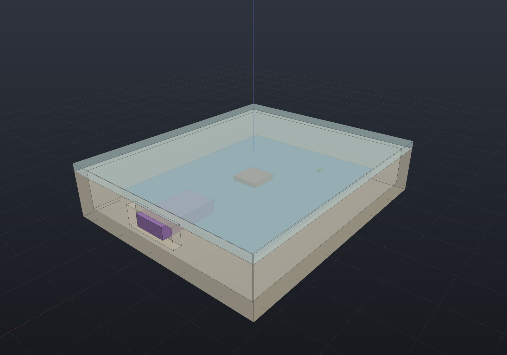

A board that routes and fabricates cleanly can still fail to go in the box — too wide for the
cavity, a capacitor that fouls the lid, a USB connector that misses its panel cutout. **Enclosure
fit** is the MCAD/ECAD boundary: it takes a placed [board](ecad-pcb.md) and an `Enclosure` and
reports every one of those problems, naming and measuring each.

It reuses the SAME clash machinery a mechanism sweep uses — an instance-bounds broad phase then the
transversal `MeshIntersection.Crosses` narrow phase — so **a part resting flush on a lid or seated
on its standoffs is not a clash** (the parts touch; they do not interpenetrate). Where the geometry
is a plane or a rectangle — the board outline against the cavity walls, a part's top against the
lid — the number is closed-form and exact.

## The enclosure

An `Enclosure` is a box built from the ordinary [`Shape`](../getting-started.md) API (a shelled box
with the cutouts drilled — no new solid type): a rectangular interior **cavity**, a **wall** and
**floor** thickness, a board **seating height** (the standoffs the board mounts on above the
floor), a **lid** at a stated height (the headroom ceiling), named **panel cutouts** for protruding
connectors, and interior **keep-out** volumes.

Everything is measured in the enclosure's interior frame (cavity centred on the origin, floor at
z = 0). `SeatFrame()` is where the board mounts — pass it as the layout's `boardFrame` and the
board seats in the cavity, so the fit check reads one geometry, not two hand-kept poses.

## A worked fit

A small board — a microcontroller, an LED and a USB connector — seated in a box whose +X wall has a
cutout for the connector to protrude through.

```csharp run:ecad-enclosure
// A body-carrying part type (the body is modelled +Z out of the board).
PartDefinition Chip(string name, double w, double d, double h) => new(name, "U",
    new[] { new Pin("1", PinType.Passive) },
    body: () => Shape.Box(w, d, h).Translate(0, 0, h / 2));

var sch = new Schematic("gadget");
sch.Add("U1", Chip("MCU", 7, 7, 1.2));
sch.Add("D1", Chip("LED", 1.6, 0.8, 0.7));
sch.Add("J1", new PartDefinition("USB", "J", new[] { new Pin("1", PinType.Passive) },
    body: () => Shape.Box(14, 8, 3).Translate(0, 0, 1.5)));   // reaches out to the +X wall

var board = PcbBoard.Rectangle(50, 40, 1.5);
var enclosure = new Enclosure(60, 50, 10, wallThickness: 2, boardSeatZ: 3)
    .AddPanelConnector("J1")
    .AddCutout(PanelCutout.Rectangular("usb", PanelWall.MaxX,
        centerAlong: 0, centerZ: 6, width: 14, height: 5, forReference: "J1"));

var layout = new PcbLayout(sch, board, enclosure.SeatFrame());
layout.Place("U1", 0, 0);
layout.Place("D1", -15, 10);
layout.Place("J1", 25, 0);   // on the board's +X edge, its body through the wall

var report = enclosure.Fit(layout);
Console.WriteLine(report);
if (!report.Ok) throw new Exception("expected a clean fit: " + report);
Console.WriteLine($"headroom {report.Headroom:g4} mm (tallest {report.TallestComponent})");

// Swap in a tall electrolytic cap that fouls the lid — named with its exact deficit.
sch.Add("C1", Chip("CAP", 8, 8, 9));
layout.Place("C1", 10, -10);
var tight = enclosure.Fit(layout);
Console.WriteLine(tight);
var lid = tight.OfIssue(FitIssue.ComponentClashesLid).Single();
// Top = seat 3 + board 1.5 + body 9 = 13.5; lid underside = 10; deficit = 3.5.
if (Math.Abs(lid.Measured - 13.5) > 1e-6 || Math.Abs(lid.Required - 10) > 1e-6)
    throw new Exception("unexpected lid clearance: " + lid);
```

## What the report names

`EnclosureFit.Check` (or `enclosure.Fit(layout)`) returns a `FitReport` — `Ok` when nothing needs a
second look, an always-present `Headroom` (the tallest part's top vs the lid underside; positive
clears, negative collides), and a `FitProblem` per fault, each **naming its offender and reporting
the measured value against the required one** (the `DrcViolation` / `PcbLayoutCheck` house style).

| `FitIssue` | What it catches |
| --- | --- |
| `BoardTooLarge` | The board outline reaches past a side wall — the wall (`+X`, `−Y`, …) and overhang named. |
| `ComponentClashesWall` | A component body interpenetrates a wall or the floor (transversal `MeshIntersection.Crosses` — a seated part is not a clash). |
| `ComponentClashesLid` | A part reaches past the lid underside — named with its exact clearance deficit (part top − lid height). |
| `ConnectorNoCutout` | A component declared panel-mount (`AddPanelConnector`) has no cutout serving it, or is not placed. |
| `ConnectorMisaligned` | A panel connector's cross-section does not fit through / is not centred in its cutout — the centre offset reported. |
| `ConnectorNotProtruding` | A panel connector's body does not reach the wall its cutout is in — the reach deficit reported. |
| `KeepOutCollision` | A component body intersects an interior keep-out volume (surface crossing OR full containment). |

A panel connector is declared with `AddPanelConnector(reference)` and served by a
`PanelCutout` whose `For` names it; the connector's body must reach the wall AND fit through the
opening, or it is named. Panel connectors are excluded from the wall-clash test — passing through a
wall is what they are for.

## Seeing it

The board seated in the (translucent) enclosure, the USB connector poking through its cutout:

```csharp render:ecad-enclosure-fit
PartDefinition Chip(string name, double w, double d, double h) => new(name, "U",
    new[] { new Pin("1", PinType.Passive) },
    body: () => Shape.Box(w, d, h).Translate(0, 0, h / 2));

var sch = new Schematic("gadget");
sch.Add("U1", Chip("MCU", 7, 7, 1.2));
sch.Add("D1", Chip("LED", 1.6, 0.8, 0.7));
sch.Add("J1", new PartDefinition("USB", "J", new[] { new Pin("1", PinType.Passive) },
    body: () => Shape.Box(14, 8, 3).Translate(0, 0, 1.5)));

var board = PcbBoard.Rectangle(50, 40, 1.5);
var enclosure = new Enclosure(60, 50, 10, wallThickness: 2, boardSeatZ: 3)
    .AddPanelConnector("J1")
    .AddCutout(PanelCutout.Rectangular("usb", PanelWall.MaxX, 0, 6, 14, 5, "J1"));

var layout = new PcbLayout(sch, board, enclosure.SeatFrame());
layout.Place("U1", 0, 0);
layout.Place("D1", -15, 10);
layout.Place("J1", 25, 0);

var scene = new Scene();
var tab = scene.AddTab("Fit");
tab.Add(layout.ToAssembly());
tab.Add(new Part("enclosure", enclosure.Housing(), transform: enclosure.Frame.ToMatrix())
    { DisplayMode = DisplayMode.Translucent });
tab.Add(new Part("lid", enclosure.Lid(), transform: enclosure.Frame.ToMatrix())
    { DisplayMode = DisplayMode.Translucent });
```



## The smallest box that fits

`Enclosure.SmallestFor(layout, clearance, standoff, headroom, wallThickness)` sizes and places a
box so the layout, unmoved, sits centred in the cavity with the stated clearances — a starting
point to refine, not a finished housing (this is a fit-check module, not an enclosure generator).
`SmallestFor(layout, …).Fit(layout)` is clean by construction.

## Not in this stage

**Thermal coupling** — per-component power dissipated into the thermal solver, checked against a
uniformly-dissipating board's analytic temperature rise — is the next stage over this one geometry.
Also filed by name: airflow / CFD cooling, snap-fit and screw-boss detailing, tolerance stack-up
analysis, and auto-generating an enclosure from the board (beyond the `SmallestFor` starting point).
Round panel cutouts are checked against their bounding box in v1 (exact round-hole corner fit is
filed).
