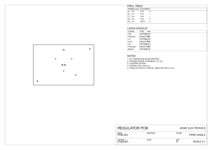
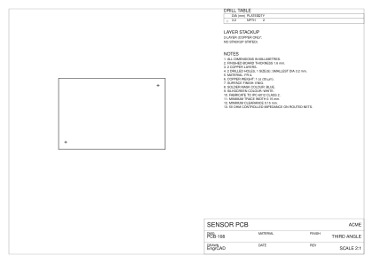

The [Gerbers and the Excellon drill program](ecad-fabrication.md) are what a board house
*machines* from; the **fabrication drawing** is what a board house *reads*. It is the human-
readable sheet that sits beside the fab data: the board outline at a fitted scale, a **drill
map** with a symbol at every drilled feature, a **drill table** (a keyed **legend**) grouping the
board's holes, vias and through-hole pad drills by size, a **layer stackup** table, and a
**fabrication notes** block — all on the shared engineering frame a mechanical drawing uses.

## The one rule: it reads the board, it never edits it

A `PcbFabricationSheet` derives everything from the layout's own public read surface — the board
outline, its holes, the placed vias, the stackup — so it cannot disagree with the board it
documents (the ECAD one-declaration rule, applied to a drawing). The drill table is the sharpest
form of that: its rows **partition** the board's holes, vias and through-hole pad drills exactly,
so `Σ count` equals the number of drilled features and adding a hole (or a through-hole pad) adds
exactly one to its row. That is a closed-form oracle, not a picture.

## The shared frame — the third consumer

A fabrication drawing is an engineering drawing, so its border and title block come from the same
[`DrawingFrame`](drawings.md) the [mechanical drawing sheet](drawings.md) and the
[schematic sheet](ecad-schematic-sheet.md) use — the three-band `EngineeringTitleBlock` on the
`SheetLayers`. Given the same paper and the same title-block fields, `sheet.Frame().Compute()`
is **byte-identical** to a mechanical `DrawingSheet`'s frame. That is the payoff of one shared
frame: a drawing and its fab drawing of one board cannot draw different furniture.

## A drill map, a stackup and notes

A four-layer board with two mounting holes and a couple of via sizes, drawn on A3:

```csharp svg:ecad-fab-drawing
// A 4-layer board (60 x 40) with two Ø3.2 mounting holes and one Ø0.6 board via.
var board = new PcbBoard(
    [
        new Vector2d(-30, -20), new Vector2d(30, -20),
        new Vector2d(30, 20), new Vector2d(-30, 20),
    ],
    LayerStackup.FourLayer(copper: 0.035, prepreg: 0.2, core: 1.13),
    holes:
    [
        new BoardHole(new Vector2d(-26, -16), 3.2, BoardHoleKind.Mounting),
        new BoardHole(new Vector2d(26, 16), 3.2, BoardHoleKind.Mounting),
        new BoardHole(new Vector2d(0, 15), 0.6, BoardHoleKind.Via),
    ]);

// A through-hole header — its Ø0.9 plated pad drills join the SAME drill table as the board's
// own holes and vias (an SMD part's lands would carry no drill and add no row).
var sch = new Schematic("regulator");
sch.Add("J1", new PartDefinition("HDR_1x2", "J",
    [new Pin("1", PinType.Passive), new Pin("2", PinType.Passive)],
    new Footprint("HDR254", [
        Pad.ThroughHole("1", new Vector2d(-1.27, 0), pad: 1.6, drill: 0.9),
        Pad.ThroughHole("2", new Vector2d(1.27, 0), pad: 1.6, drill: 0.9),
    ])));

var layout = new PcbLayout(sch, board);
// Placed vias in two sizes — they join the drill table with the board's own holes.
layout.AddVia("GND", 8, 6, "Top", "Bottom", drill: 0.3, pad: 0.6);
layout.AddVia("GND", -8, 6, "Top", "Bottom", drill: 0.3, pad: 0.6);
layout.AddVia("GND", 0, -6, "Top", "Bottom", drill: 0.3, pad: 0.6);
layout.AddVia("VIN", 12, -10, "Top", "Bottom", drill: 0.4, pad: 0.8);
layout.Place("J1", 0, 0, rotationDegrees: 0, side: CopperSide.Top);

// The fabrication drawing — the shared engineering frame plus the fab content.
var title = new TitleBlock
{
    Title = "REGULATOR PCB", DrawingNumber = "PCB-042", Author = "EngrCAD",
    Revision = "A", Company = "ACME ELECTRONICS",
};
var sheet = new PcbFabricationSheet(layout, SheetFormat.A3, title);
var drawing = sheet.Compute();

// The drill table partitions the board's holes, vias AND the header's through-hole pad drills:
//   Ø0.3 PTH x3, Ø0.4 PTH x1, Ø0.6 PTH x1, Ø0.9 PTH x2, Ø3.2 NPTH x2  — nine features, five sizes.
var svg = drawing.ToSvg();   // also drawing.ToDxf(), drawing.ToPdf()
```



The drill table's counts and diameters are the board's own — the drawing is a *view* of the
layout's drilled features, so it cannot omit a hole nor invent one. The same `Compute()` feeds
the SVG, DXF and PDF writers, so the three cannot disagree about the drawing.

## The drill legend, and through-hole component pad drills

The drill table is a **legend**: its `SYM` column keys each size to a **symbol** — a letter
(`A`, `B`, …) beside its **glyph**, the same glyph the drill map draws at every hole of that size —
so a reader ties a marked hole back to its row. The glyphs come from `PcbFabricationSheet`'s
**canonical, ordered symbol set** (`DrillGlyphPalette`: plus, saltire, square, circle, triangle,
diamond, six-point asterisk, hexagon, down-triangle, pentagon), assigned by **ascending diameter**
(non-plated before plated at equal diameter), so the symbol assignment is a deterministic function
of the board. The letter is the always-distinct key; when a board carries more distinct sizes than
the palette has shapes the glyph *cycles* and the letter distinguishes the repeat. A board with
more distinct drill sizes than the `A`–`Z` alphabet holds (`MaxLegendSizes` = 26) is refused by
name — a real board carries a handful of drill sizes.

The partition covers **through-hole component pad drills** too, not just the board's own holes and
vias. A through-hole pad *has* a drill; a surface-mount land does not — the same SMD-vs-through-hole
distinction the [solder-paste stencil](ecad-fabrication.md) reads off the copper model — so a placed
header's pads join the same `(diameter, plated)` partition (plated, PTH) while an SMD part contributes
no drill row.

## Fabrication requirements: the notes the geometry cannot carry

The geometry states a thickness and a copper-layer count, but a board house also needs the base
material, the copper weight, the surface finish, the mask and legend colours, the IPC-6012 class,
and the minimum trace and clearance — none of which the geometry carries. A
`PcbFabricationSpec` states them, and the fabrication
drawing prints them **write-only-when-stated**: every field is optional, a stated field prints its
note, and an unstated one is simply absent — the drawing never invents a value. The spec rides in
the layout as **layout truth** (`layout.WithFabrication(...)`, `layout.Fabrication`), the same kind
of thing the solder-mask / silkscreen / paste settings are, so it persists in the layout file
write-only-when-stated (a layout that states none saves byte-identically to a pre-spec one).

```csharp svg:ecad-fab-spec
// A 2-layer board (60 x 40 x 1.6) — the geometry says nothing about material or finish.
var board = new PcbBoard(
    [
        new Vector2d(-30, -20), new Vector2d(30, -20),
        new Vector2d(30, 20), new Vector2d(-30, 20),
    ],
    thickness: 1.6,
    holes:
    [
        new BoardHole(new Vector2d(-26, -16), 3.2, BoardHoleKind.Mounting),
        new BoardHole(new Vector2d(26, 16), 3.2, BoardHoleKind.Mounting),
    ]);

// The fabrication REQUIREMENTS the geometry cannot carry. Every field is optional — this spec
// states a material, finish, copper weight, colours, class and minimum trace/clearance, and
// leaves everything else (e.g. an impedance tolerance) to the fabricator's default.
var layout = new PcbLayout(new Schematic("sensor"), board)
    .WithFabrication(new PcbFabricationSpec
    {
        BaseMaterial = "FR-4",
        FinishedThicknessMm = 1.6,
        CopperWeightOz = 1,
        SurfaceFinish = PcbSurfaceFinish.Enig,
        SolderMaskColour = "Blue",
        SilkscreenColour = "White",
        Ipc6012Class = 2,
        MinTraceWidthMm = 0.15,
        MinClearanceMm = 0.15,
        Notes = ["50 OHM CONTROLLED IMPEDANCE ON ROUTED NETS."],
    });

var title = new TitleBlock
{
    Title = "SENSOR PCB", DrawingNumber = "PCB-108", Author = "EngrCAD", Company = "ACME",
};
var drawing = new PcbFabricationSheet(layout, SheetFormat.A3, title).Compute();

// The notes block now carries the stated requirements, e.g. "MATERIAL: FR-4.",
// "SURFACE FINISH: ENIG.", "COPPER WEIGHT: 1 oz (35 um).", "FABRICATE TO IPC-6012 CLASS 2." —
// each printed only because the spec states it.
var svg = drawing.ToSvg();
```



A stated **finished thickness** is authoritative: it is the delivered stackup thickness (copper and
finish) a fabricator quotes to, so it *replaces* the modelled plate thickness in the finished-
thickness note rather than printing a second one. With no spec, that note is the modelled thickness
exactly as before — the drawing is byte-identical to one built before the spec existed.
