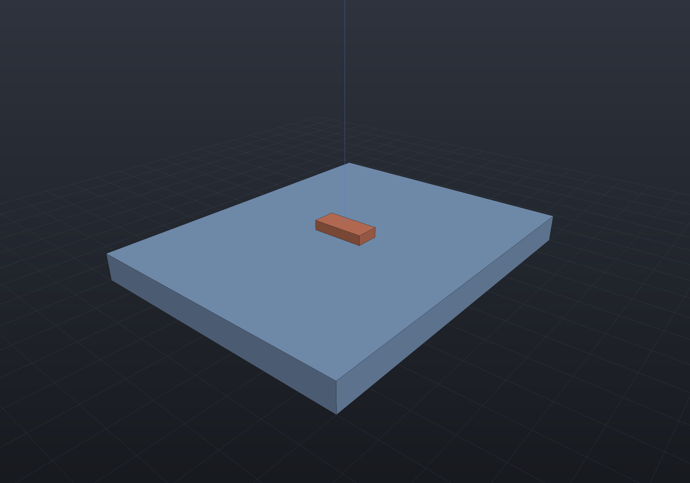

A `PartDefinition` in EngrCAD is built from the **three views** of one part: its 2D
**schematic symbol** (the drawn shape a schematic sheet wires to), its **footprint** (the copper
pads the board places), and its **3D model** (the body an assembly seats) — all sharing one
pin-NUMBER identity, plus the pins that are the netlist terminals. Stage 1 could declare pins
and a footprint by hand; a real library is *imported*, so EngrCAD reads a component from the
**KiCad** interchange (`.kicad_sym` + `.kicad_mod`) or an **Eagle** library (`.lbr`) so it
arrives with all three at once.

## The one identity: one part, one set of pin NUMBERS

The three representations are **one identity by pin number**: symbol pin `"1"` == footprint pad
`"1"` == netlist pin `"1"`. That is the whole point of loading symbol and footprint together —
and a `PinIdentity` check verifies it, naming any symbol pin with no pad, pad with no pin, or
pin with neither. It is the one-declaration rule (the schematic's source of truth) extended to
the drawn symbol.

## Loading a resistor

`ComponentLibrary.Read` (text) / `ComponentLibrary.Load` (files) reads the symbol and the
footprint and unifies them:

```csharp run:ecad-library
// A minimal KiCad symbol library (.kicad_sym) — one resistor, two passive pins, a body.
var symText = """
(kicad_symbol_lib (version 20211014) (generator kicad_symbol_editor)
  (symbol "R_0805"
    (property "Reference" "R" (at 2.032 0 90) (effects (font (size 1.27 1.27))))
    (property "Value" "R_0805" (at 0 0 90) (effects (font (size 1.27 1.27))))
    (property "Footprint" "Resistor_SMD:R_0805_2012Metric" (at 0 0 0)
      (effects (font (size 1.27 1.27)) hide))
    (symbol "R_0805_0_1"
      (rectangle (start -1.016 2.54) (end 1.016 -2.54)
        (stroke (width 0.254) (type default)) (fill (type none))))
    (symbol "R_0805_1_1"
      (pin passive line (at 0 3.81 270) (length 1.27)
        (name "~" (effects (font (size 1.27 1.27))))
        (number "1" (effects (font (size 1.27 1.27)))))
      (pin passive line (at 0 -3.81 90) (length 1.27)
        (name "~" (effects (font (size 1.27 1.27))))
        (number "2" (effects (font (size 1.27 1.27))))))))
""";

// The matching KiCad footprint (.kicad_mod) — two SMD pads, in millimetres.
var modText = """
(footprint "R_0805_2012Metric" (version 20211014) (generator pcbnew) (layer "F.Cu") (attr smd)
  (pad "1" smd roundrect (at -0.9125 0) (size 1.025 1.4)
    (layers "F.Cu" "F.Paste" "F.Mask") (roundrect_rratio 0.243902))
  (pad "2" smd roundrect (at 0.9125 0) (size 1.025 1.4)
    (layers "F.Cu" "F.Paste" "F.Mask") (roundrect_rratio 0.243902)))
""";

var part = ComponentLibrary.Read(symText, modText);
var def = part.Definition;

// It arrives with pins, a footprint AND a symbol — one part, one set of pin numbers.
Console.WriteLine($"{def.Name}: {def.Pins.Count} pins, "
    + $"{def.Footprint!.Pads.Count} pads, {def.Symbol!.Pins.Count} symbol pins");

if (def.Pins.Count != 2) throw new Exception("expected two pins");
if (def.ReferencePrefix != "R") throw new Exception("expected reference prefix R");

// The identity holds: symbol pin "1" == pad "1" == netlist pin "1".
if (!part.Identity.Ok) throw new Exception(part.Identity.ToString());

// A symbol pin's ANCHOR is where a wire lands. Pin 1 sits above the body, pointing down.
var pin1 = def.Symbol.PinNumbered("1");
Console.WriteLine($"pin 1 anchor {pin1.Anchor}, points {pin1.Direction}, "
    + $"meets body at {pin1.Inner}");

// The pad coordinates are STATED in the file, so they are carried exactly.
if (def.Footprint.Pads[0].Center.X != -0.9125) throw new Exception("pad geometry drifted");

// A loaded part is data now: it round-trips through the schematic file byte-for-byte.
var sch = new Schematic("one resistor");
sch.Add("R1", def, value: "330");
var json = sch.Save();
if (Schematic.Load(json).Save() != json)
    throw new Exception("the loaded symbol is not a persistence fixed point");
```

The symbol is the representation a drawn schematic **sheet** consumes — each `SymbolPin` carries
the point where a wire lands (`Anchor`), the direction it points into the body, and its length,
so routing a wire to a placed symbol is exact.

## Loading from Eagle (`.lbr`)

An Eagle library is a single **XML** file (`.lbr`), read with `EagleLibraryReader` — the second
interchange, producing the same `LoadedPart`. Its structure is different: an Eagle symbol's pins
are named in the symbol's own vocabulary, a package's pads are numbered, and a **deviceset**'s
`<connect gate pin pad>` map binds them — so *the `<connect>` map is what unifies the three by pad
number* (symbol pin `"VCC"` → pad `"8"`, so the loaded pin is numbered `"8"` and named `"VCC"`).
Read the library, then load one device by its full name (deviceset + device):

```csharp run:ecad-eagle-library
// A minimal Eagle .lbr library — a resistor deviceset binding a symbol to an 0805 package
// through its <connect> map. Eagle stores coordinates in millimetres.
var lbr = """
<?xml version="1.0" encoding="utf-8"?>
<eagle version="7.7.0">
  <drawing>
    <library>
      <packages>
        <package name="R0805">
          <smd name="1" x="-0.9125" y="0" dx="1.025" dy="1.4" layer="1" roundness="25"/>
          <smd name="2" x="0.9125" y="0" dx="1.025" dy="1.4" layer="1" roundness="25"/>
        </package>
      </packages>
      <symbols>
        <symbol name="R">
          <rectangle x1="-1.016" y1="-2.54" x2="1.016" y2="2.54" layer="94"/>
          <pin name="1" x="0" y="3.81" length="short" direction="pas" rot="R270"/>
          <pin name="2" x="0" y="-3.81" length="short" direction="pas" rot="R90"/>
        </symbol>
      </symbols>
      <devicesets>
        <deviceset name="R-EU_" prefix="R">
          <gates><gate name="G$1" symbol="R" x="0" y="0"/></gates>
          <devices>
            <device name="R0805" package="R0805">
              <connects>
                <connect gate="G$1" pin="1" pad="1"/>
                <connect gate="G$1" pin="2" pad="2"/>
              </connects>
            </device>
          </devices>
        </deviceset>
      </devicesets>
    </library>
  </drawing>
</eagle>
""";

// Read the library, then load one device by its full name (deviceset + device).
var lib = EagleLibraryReader.Read(lbr);
Console.WriteLine("devices: " + string.Join(", ", lib.Devices.Select(d => d.Name)));

var part = lib.Load("R-EU_R0805");
var def = part.Definition;
Console.WriteLine($"{def.Name}: {def.Pins.Count} pins, {def.Footprint!.Pads.Count} pads, "
    + $"{def.Symbol!.Pins.Count} symbol pins");

// The <connect> map unifies the three: symbol pin "1" == pad "1" == netlist pin "1".
if (!part.Identity.Ok) throw new Exception(part.Identity.ToString());
if (def.ReferencePrefix != "R") throw new Exception("expected reference prefix R");

// Pad coordinates are STATED in the file (millimetres), so they are carried exactly.
if (def.Footprint.Pads[0].Center.X != -0.9125) throw new Exception("pad geometry drifted");

// A symbol pin's ANCHOR is where a wire lands; rot=R270 points the pin down.
var pin1 = def.Symbol.PinNumbered("1");
Console.WriteLine($"pin 1 anchor {pin1.Anchor}, points {pin1.Direction}");
if (pin1.Direction != SymbolPinDirection.Down) throw new Exception("pin direction drifted");

// The loaded part is data: it round-trips through the schematic file byte-for-byte.
var sch = new Schematic("one resistor");
sch.Add("R1", def, value: "330");
var json = sch.Save();
if (Schematic.Load(json).Save() != json) throw new Exception("not a persistence fixed point");
```

Eagle's covered subset mirrors KiCad's: symbol `wire`/`rectangle`/`circle`/`polygon`/`text`
graphics and `pin`s (a pin's `rot` gives its direction, `length` its length, `direction` its
`PinType`), and package `smd` pads and `pad` plated through-holes of the standard shapes
(round/square/octagon/long) with their drill. A package `<hole>`/`<via>` (not a pad), a graphic
kind outside the set, a multi-gate deviceset (a gate array), and a symbol pin with no `<connect>`
(an unmapped pin) are each **ignored with a diagnostic or refused by name**; whole `.brd`/`.sch`
board/schematic import is out of scope, refused at the root.

## Loading a whole schematic (`.kicad_sch`)

Loading a component gives one part; loading a `.kicad_sch` gives a whole **schematic** — the
connectivity. The board twin (`.kicad_pcb`) already exists; `KiCadSchReader.Read` is the schematic
member of the KiCad set. The crux is that a schematic **never lists its netlist** — it draws it, so
the connectivity is IMPLICIT in the geometry. The reader reconstructs it with a **union-find over the
connection points**, the same "two things are one net iff they touch" rule the copper connectivity
uses: a wire joins its two endpoints; a pin, a label, a power-symbol pin or a junction lying on a wire
joins it (a junction at a crossing joins *both* crossing wires); two points carrying the same label are
one net; a `no_connect` marks a pin unconnected. Two wires crossing with **no** junction stay two nets:

```csharp run:ecad-schematic-import
// A minimal KiCad schematic (.kicad_sch): a two-resistor divider between VCC and GND, with the
// mid-point wire named by a local label. Nothing in the file lists the netlist — the reader works
// out which pins share a net from the WIRE GEOMETRY (a placed Device:R at (x, y, 0) puts pin "1" at
// (x, y - 3.81) and pin "2" at (x, y + 3.81), so a wire endpoint there connects that pin).
var schText = """
(kicad_sch (version 20230121) (generator eeschema) (paper "A4") (title_block (title "divider"))
  (lib_symbols
    (symbol "Device:R" (property "Reference" "R" (at 2.032 0 90)) (property "Value" "R" (at 0 0 90))
      (symbol "R_1_1"
        (pin passive line (at 0 3.81 270) (length 1.27) (name "~") (number "1"))
        (pin passive line (at 0 -3.81 90) (length 1.27) (name "~") (number "2"))))
    (symbol "power:VCC" (power) (property "Reference" "#PWR" (at 0 0 0)) (property "Value" "VCC" (at 0 3.556 0))
      (symbol "VCC_1_1" (pin power_in line (at 0 0 90) (length 0) (name "VCC") (number "1"))))
    (symbol "power:GND" (power) (property "Reference" "#PWR" (at 0 0 0)) (property "Value" "GND" (at 0 -3.81 0))
      (symbol "GND_1_1" (pin power_in line (at 0 0 270) (length 0) (name "GND") (number "1")))))

  (symbol (lib_id "Device:R") (at 50 40 0) (property "Reference" "R1" (at 53 40 0)) (property "Value" "10k" (at 53 42 0)))
  (symbol (lib_id "Device:R") (at 50 60 0) (property "Reference" "R2" (at 53 60 0)) (property "Value" "20k" (at 53 62 0)))
  (symbol (lib_id "power:VCC") (at 50 30 0) (property "Reference" "#PWR01" (at 50 27 0)) (property "Value" "VCC" (at 50 26 0)))
  (symbol (lib_id "power:GND") (at 50 70 0) (property "Reference" "#PWR02" (at 50 74 0)) (property "Value" "GND" (at 50 75 0)))

  (wire (pts (xy 50 30) (xy 50 36.19)))
  (wire (pts (xy 50 43.81) (xy 50 56.19)))
  (wire (pts (xy 50 63.81) (xy 50 70)))
  (label "MID" (at 50 50 0) (effects (font (size 1.27 1.27))))
  (sheet_instances (path "/" (page "1"))))
""";

var read = KiCadSchReader.Read(schText);
var sch = read.Schematic;

// Power symbols name nets, they are not components — so three symbols place two components.
Console.WriteLine($"{sch.Name}: {sch.Components.Count} components, {sch.Nets.Count} nets");
Console.WriteLine(sch.ToNetlist().ToText());

// The MID label names the wire joining R1.2 and R2.1 — reconstructed from the geometry.
var netlist = sch.ToNetlist();
var mid = netlist.NetOf(sch.Find("R1")!.Pin("2"));
if (mid?.Name != "MID") throw new Exception("MID net not reconstructed");
if (!ReferenceEquals(mid, netlist.NetOf(sch.Find("R2")!.Pin("1"))))
    throw new Exception("R1.2 and R2.1 should share the MID net");

// Every component's pins come from its lib_symbol, so the symbol == netlist identity holds by number.
foreach (var component in sch.Components)
    if (!PinIdentity.Check(component.Definition).Ok) throw new Exception("pin identity");

// The counting identity holds — every pin is on exactly one net.
if (!sch.Check().Ok) throw new Exception(sch.Check().ToString());
```

`KiCadSchReader.Read` covers a **single sheet**: the embedded `lib_symbols` (mapped to
`PartDefinition`s), placed `(symbol …)` instances, power symbols (their `Value` is the net name),
`wire`, `junction`, local `label`, `global_label`, `no_connect`, and **buses** (see below). **Refused
by name**: a NESTED bus group (`{A {B C}}`) and a malformed bus range (`DATA[]`, a
non-integer bound); and — in the single-sheet `Read` only — **hierarchical sheets** (`sheet`
subsheets, `hierarchical_label`), so a flat import cannot silently drop a whole subsheet. A netless
wire, an instance referencing an unknown symbol, a dangling pin, or a dangling / non-member bus entry
is **reported** as a diagnostic, not thrown; a non-`(kicad_sch …)` root — a board or a symbol library
handed here — or a malformed S-expression is refused by name.

### Buses

A **bus** is a labelled bundle of signal nets: `DATA[0..7]` is the eight nets DATA0..DATA7 (KiCad's
bus-vector notation). A `(bus …)` wire carries the bundle, a `(bus_entry …)` rips a member off it onto
a signal wire, and — this is KiCad's rule — that ripped wire is **labelled with the member's own name**
(`DATA3`), so the member's net is reconstructed like any other labelled wire. The honest finding is
that **a ripped tap's net is its own local label**, and same-named labels are already one net by
local-label equivalence, so on a flat sheet the bus's *connecting* role is subsumed. Buses are
therefore **sugar**: the reader expands a bus label into its members (so a bus label is
NOT mistaken for a signal net — `DATA[0..7]` is never a net) and validates that each tap is a declared
member, reporting a stray tap by name. All three KiCad bus forms are handled — a **vector**
`NAME[m..n]` (a reversed range `DATA[7..0]` is legal, the same members), an anonymous **group**
`{SDA SCL DATA[0..1]}` (its whitespace-separated tokens, each a bare signal or a vector expanded in
turn), and a named **alias** (a `(bus_alias "PCI" (members …))` definition, a bare label matching an
alias read as that bus). **Across sheets** the connecting role *is* load-bearing, and it is supported:
a **bus sheet pin** (a sheet pin whose name is a bus) matched with the sub-sheet's hierarchical bus
label of the same name carries each member over the boundary — for each member M, the parent's local
net named M joins the child's — so a `DATA[0..1]` bundle into a subsheet gives DATA0 and DATA1 each
spanning the boundary while staying two distinct nets. A nested group (`{A {B C}}`) is refused by name.

```csharp run:ecad-schematic-buses
// A DATA[0..1] bus. The DATA[0..1] label declares the members DATA0, DATA1; each bus_entry rips a
// member off the bus onto a signal wire that carries the member's OWN label. DATA0 is ripped TWICE
// (at R0 and R1) — the same member label at both taps, so the bus links them into one net — while
// DATA1 taps R2. The bus-vector label DATA[0..1] is NOT itself a net.
var schText = """
(kicad_sch (version 20230121) (generator eeschema) (paper "A4") (title_block (title "bus"))
  (lib_symbols
    (symbol "Device:R" (property "Reference" "R" (at 0 0 0)) (property "Value" "R" (at 0 0 0))
      (symbol "R_1_1"
        (pin passive line (at 0 3.81 270) (length 1.27) (name "~") (number "1"))
        (pin passive line (at 0 -3.81 90) (length 1.27) (name "~") (number "2")))))

  (bus (pts (xy 94 40) (xy 166 40)))
  (label "DATA[0..1]" (at 96 40 0))

  (symbol (lib_id "Device:R") (at 100 60 0) (property "Reference" "R0" (at 103 60 0)) (property "Value" "R" (at 103 62 0)))
  (wire (pts (xy 100 56.19) (xy 100 42.54))) (bus_entry (at 100 42.54) (size 0 -2.54))
  (label "DATA0" (at 100 49 0)) (no_connect (at 100 63.81))

  (symbol (lib_id "Device:R") (at 130 60 0) (property "Reference" "R2" (at 133 60 0)) (property "Value" "R" (at 133 62 0)))
  (wire (pts (xy 130 56.19) (xy 130 42.54))) (bus_entry (at 130 42.54) (size 0 -2.54))
  (label "DATA1" (at 130 49 0)) (no_connect (at 130 63.81))

  (symbol (lib_id "Device:R") (at 160 60 0) (property "Reference" "R1" (at 163 60 0)) (property "Value" "R" (at 163 62 0)))
  (wire (pts (xy 160 56.19) (xy 160 42.54))) (bus_entry (at 160 42.54) (size 0 -2.54))
  (label "DATA0" (at 160 49 0)) (no_connect (at 160 63.81))

  (sheet_instances (path "/" (page "1"))))
""";

var sch = KiCadSchReader.Read(schText).Schematic;

// The bus-vector label declares members but is NOT itself a net.
if (sch.Nets.Any(n => n.Name == "DATA[0..1]")) throw new Exception("a bus label is not a net");

// DATA0 links R0 and R1 across the bus (the same member label at both taps); DATA1 taps R2.
var netlist = sch.ToNetlist();
var data0 = netlist.NetOf(sch.Find("R0")!.Pin("1"));
Console.WriteLine($"DATA0 links: {string.Join(", ", data0!.Pins.Select(p => p.ToString()))}");
Console.WriteLine($"R2.1 is on net: {netlist.NetOf(sch.Find("R2")!.Pin("1"))!.Name}");
if (!ReferenceEquals(data0, netlist.NetOf(sch.Find("R1")!.Pin("1"))))
    throw new Exception("R0.1 and R1.1 should share DATA0 across the bus");
if (data0.Name != "DATA0") throw new Exception("member net name");
if (!sch.Check().Ok) throw new Exception(sch.Check().ToString());
```

## Hierarchical / multi-sheet import

Real KiCad schematics are **hierarchical**: a root sheet places `(sheet …)` instances, each
referencing a sub-sheet FILE, and connectivity is stitched ACROSS sheets. `KiCadSchReader.ReadProject`
reads the root `.kicad_sch` and resolves its `Sheetfile` references relative to the root's directory,
recursively; `ReadProjectFrom(rootFile, map)` is the testable IN-MEMORY twin over a `sheetfile → text`
map. Both flatten the hierarchy into ONE `Schematic`.

**Cross-sheet net stitching is the whole job**, and it is name-matching, not geometry: a parent
**sheet pin** joins the parent net at its position to the sub-sheet's `hierarchical_label` of the same
name (scoped to that sheet instance); `global_label`s and power symbols span EVERY sheet; a **local**
`label` stays local to its sheet — two sheets' "CLK" locals are two nets. Components get
**hierarchical reference designators** (`"PowerSupply/U1"`, the occurrence-path convention), so a
sheet placed TWICE gives distinct instances with distinct internal nets.

```csharp run:ecad-schematic-hierarchy
// A root sheet with one sub-sheet. The root's R1.2 is wired to a sheet pin "VOUT"; the sub-sheet's
// R2.1 is wired to a hierarchical_label "VOUT". The name match stitches them into ONE net.
const string lib = """
  (lib_symbols
    (symbol "Device:R" (property "Reference" "R" (at 0 0 0)) (property "Value" "R" (at 0 0 0))
      (symbol "R_1_1"
        (pin passive line (at 0 3.81 270) (length 1.27) (name "~") (number "1"))
        (pin passive line (at 0 -3.81 90) (length 1.27) (name "~") (number "2")))))
  """;

string root = $$"""
(kicad_sch (version 20230121) (paper "A4") (title_block (title "top"))
{{lib}}
  (symbol (lib_id "Device:R") (at 100 60 0) (property "Reference" "R1" (at 103 60 0)) (property "Value" "10k" (at 103 62 0)))
  (sheet (at 130 55) (size 30 20)
    (property "Sheetname" "amp" (at 130 54 0)) (property "Sheetfile" "amp.kicad_sch" (at 130 76 0))
    (pin "VOUT" input (at 100 70 0)))
  (wire (pts (xy 100 63.81) (xy 100 70)))
  (no_connect (at 100 56.19))
  (sheet_instances (path "/" (page "1"))))
""";

string amp = $$"""
(kicad_sch (version 20230121) (paper "A4") (title_block (title "amp"))
{{lib}}
  (symbol (lib_id "Device:R") (at 100 60 0) (property "Reference" "R2" (at 103 60 0)) (property "Value" "20k" (at 103 62 0)))
  (wire (pts (xy 100 56.19) (xy 100 50)))
  (hierarchical_label "VOUT" (at 100 50 0) (shape input))
  (no_connect (at 100 63.81))
  (sheet_instances (path "/" (page "1"))))
""";

var project = new Dictionary<string, string> { ["root.kicad_sch"] = root, ["amp.kicad_sch"] = amp };
var read = KiCadSchReader.ReadProjectFrom("root.kicad_sch", project);
var sch = read.Schematic;

// The sub-sheet's component carries a hierarchical refdes; the two pins are ONE net named "VOUT".
Console.WriteLine($"{sch.Components.Count} components: {string.Join(", ", sch.Components.Select(c => c.ReferenceDesignator))}");
var net = sch.ToNetlist().NetOf(sch.Find("R1")!.Pin("2"));
Console.WriteLine($"stitched net: {net}");
if (net?.Name != "VOUT") throw new Exception("the sheet pin did not stitch the parent net to the child");
if (!ReferenceEquals(net, sch.ToNetlist().NetOf(sch.Find("amp/R2")!.Pin("1"))))
    throw new Exception("R1.2 and amp/R2.1 should share the stitched VOUT net");
if (!sch.Check().Ok) throw new Exception(sch.Check().ToString());
```

**Refused / reported by name.** A **recursive** sheet reference (a sheet including itself, directly
or transitively) is refused by name — a self-including hierarchy cannot be flattened. A **missing or
unreadable** sub-sheet file is *reported* in `read.Diagnostics` and its subtree skipped (never
thrown — the readers-never-throw-on-dirty culture), as is a hierarchical label with no matching parent
sheet pin (a dangling port). Still out of scope across sheets: **buses**.

### Multi-unit symbols

Many ICs are **multi-unit**: a dual op-amp is ONE physical package (one footprint, one reference
designator) drawn as SEVERAL schematic symbols — amp A, amp B, and often a power unit. KiCad's
`.kicad_sym` draws them as unit sub-symbols (`_1_1`, `_2_1`, `_3_1` — the `<unit>_<style>` suffix),
and a schematic places a multi-unit part as several `(symbol …)` instances **sharing one reference
designator**, each carrying its own `(unit N)`. EngrCAD keeps that as **one `Component` with all the
pins**: a `PartDefinition` gains `Units` (one `Symbol` per unit, each with its own pins at its own
anchors) while `Pins` is their **union** — the netlist terminals of the whole package — and the pin
NUMBER identity spans the units (symbol pin `"1"` in amp A == pad `"1"` == netlist pin `"1"`). The
reader **merges** the same-refdes instances into that one component, placing each unit's pins where
that unit is drawn, so a net wired to amp A's output and one to amp B's input are distinct nets on
one IC. The board never sees the split — one footprint, all pads.

```csharp run:ecad-multi-unit
// A dual op-amp .kicad_sym: three unit sub-symbols — amp A (pins 1,2,3), amp B (pins 5,6,7) and a
// power unit (pins 4,8) — under one package "Dual_Opamp".
var symText = """
(kicad_symbol_lib (version 20211014) (generator kicad_symbol_editor)
  (symbol "Dual_Opamp"
    (property "Reference" "U" (at 0 5 0) (effects (font (size 1.27 1.27))))
    (property "Value" "Dual_Opamp" (at 0 -5 0) (effects (font (size 1.27 1.27))))
    (property "Footprint" "Package_SO:SOIC-8_3.9x4.9mm_P1.27mm" (at 0 0 0) (effects (font (size 1.27 1.27)) hide))
    (symbol "Dual_Opamp_1_1"
      (pin output line (at 7.62 0 180) (length 2.54) (name "~") (number "1"))
      (pin input line (at -7.62 -2.54 0) (length 2.54) (name "-") (number "2"))
      (pin input line (at -7.62 2.54 0) (length 2.54) (name "+") (number "3")))
    (symbol "Dual_Opamp_2_1"
      (pin input line (at -7.62 2.54 0) (length 2.54) (name "+") (number "5"))
      (pin input line (at -7.62 -2.54 0) (length 2.54) (name "-") (number "6"))
      (pin output line (at 7.62 0 180) (length 2.54) (name "~") (number "7")))
    (symbol "Dual_Opamp_3_1"
      (pin power_in line (at 0 -7.62 90) (length 2.54) (name "V-") (number "4"))
      (pin power_in line (at 0 7.62 270) (length 2.54) (name "V+") (number "8")))))
""";

var symbol = KiCadSymbolReader.Read(symText);
var def = new PartDefinition(symbol.Symbol.Name, symbol.ReferencePrefix, symbol.Pins,
    symbol: null, units: symbol.Units);

// Three units, but ONE set of pins — the union of every unit's pins is the package's terminals.
Console.WriteLine($"{def.Name}: {def.Units.Count} units, {def.Pins.Count} pins "
    + $"({string.Join(", ", def.Pins.Select(p => p.Number))})");
Console.WriteLine("amp A: " + string.Join(",", def.Units[0].PinNumbers)
    + " | amp B: " + string.Join(",", def.Units[1].PinNumbers)
    + " | power: " + string.Join(",", def.Units[2].PinNumbers));
if (!def.IsMultiUnit || def.Units.Count != 3 || def.Pins.Count != 8)
    throw new Exception("expected three units and eight pins");

// A schematic places amp A, amp B and the power unit as three instances under ONE reference
// designator "U1" (each with its own (unit N)). The reader merges them into one component.
var schText = """
(kicad_sch (version 20230121) (paper "A4") (title_block (title "dual"))
  (lib_symbols
    (symbol "Amp:Dual_Opamp"
      (property "Reference" "U" (at 0 0 0)) (property "Value" "Dual_Opamp" (at 0 0 0))
      (symbol "Dual_Opamp_1_1"
        (pin output line (at 7.62 0 180) (length 2.54) (name "~") (number "1"))
        (pin input line (at -7.62 -2.54 0) (length 2.54) (name "-") (number "2"))
        (pin input line (at -7.62 2.54 0) (length 2.54) (name "+") (number "3")))
      (symbol "Dual_Opamp_2_1"
        (pin input line (at -7.62 2.54 0) (length 2.54) (name "+") (number "5"))
        (pin input line (at -7.62 -2.54 0) (length 2.54) (name "-") (number "6"))
        (pin output line (at 7.62 0 180) (length 2.54) (name "~") (number "7")))
      (symbol "Dual_Opamp_3_1"
        (pin power_in line (at 0 -7.62 90) (length 2.54) (name "V-") (number "4"))
        (pin power_in line (at 0 7.62 270) (length 2.54) (name "V+") (number "8")))))
  (symbol (lib_id "Amp:Dual_Opamp") (at 100 100 0) (unit 1) (property "Reference" "U1" (at 100 92 0)) (property "Value" "LM358" (at 100 108 0)))
  (symbol (lib_id "Amp:Dual_Opamp") (at 150 100 0) (unit 2) (property "Reference" "U1" (at 150 92 0)) (property "Value" "LM358" (at 150 108 0)))
  (symbol (lib_id "Amp:Dual_Opamp") (at 100 130 0) (unit 3) (property "Reference" "U1" (at 100 138 0)) (property "Value" "LM358" (at 100 145 0)))
  (wire (pts (xy 107.62 100) (xy 112 100))) (label "OUTA" (at 112 100 0))
  (wire (pts (xy 142.38 97.46) (xy 137 97.46))) (label "INB" (at 137 97.46 0))
  (sheet_instances (path "/" (page "1"))))
""";

var sch = KiCadSchReader.Read(schText).Schematic;

// The three same-refdes instances MERGE into one component "U1" carrying all eight pins.
Console.WriteLine($"{sch.Components.Count} component: {sch.Components[0].ReferenceDesignator} "
    + $"with {sch.Components[0].AllPins.Count()} pins");
if (sch.Components.Count != 1) throw new Exception("expected one merged component");

// A net on amp A's output and one on amp B's input are DISTINCT nets on the SAME IC.
var netlist = sch.ToNetlist();
var outA = netlist.NetOf(sch.Find("U1")!.Pin("1"));
var inB = netlist.NetOf(sch.Find("U1")!.Pin("5"));
Console.WriteLine($"U1.1 -> {outA?.Name}, U1.5 -> {inB?.Name}");
if (outA?.Name != "OUTA" || inB?.Name != "INB" || ReferenceEquals(outA, inB))
    throw new Exception("the two units' nets should be distinct and named right");
```

Where the units genuinely disagree — two units claiming pin `"1"` with different types — the reader
**reports it by name** and keeps the first (it never throws on dirty input), and a De Morgan
**alternate body style** (`_1_2`) is out of scope, ignored with a named diagnostic. Multi-unit
schematic **drawing** (placing each unit at its own location on a sheet) is a follow-up.

## The 3D model — the third view

The third view is the **3D model**, a first-class `ComponentModel3D` peer of the symbol and
footprint (not a bare `Func<Shape>`). It unifies a body **source** with a `ModelPlacement`
relative to the footprint origin — the KiCad `(model …)` shape. The source is either a **file**
reference (`.stl`/`.obj`/`.off`/`.step`, which travels through the schematic/board file as DATA
and loads on demand) or **code** (a `Func<Shape>`, opaque, re-attached from a `PartLibrary` — the
legacy `Body` is exactly a code model with the identity placement). The board seats the model
into the pose, applying the placement in the footprint's own frame before the side reflection —
so a quarter turn transposes the footprint-plane bounds **exactly** (a sign swap, not a `cos`):

```csharp render:ecad-library-trinity
// A resistor built from its THREE views — symbol, footprint, 3D model. Here a code model,
// rotated 90° about Z (an EXACT quarter turn) so its 3.2 × 1.4 body seats as 1.4 × 3.2.
var sym = new Symbol("R_0805",
    new[] {
        new SymbolPin("1", "", new Vector2d(-2.54, 0), SymbolPinDirection.Right, 1.27, PinType.Passive),
        new SymbolPin("2", "", new Vector2d(2.54, 0), SymbolPinDirection.Left, 1.27, PinType.Passive),
    },
    new SymbolGraphic[] { new SymbolRectangle(new Vector2d(-1.0, -0.5), new Vector2d(1.0, 0.5)) });

var model = ComponentModel3D.FromShape(
    () => Shape.Box(3.2, 1.4, 0.6).Translate(0, 0, 0.3),
    new ModelPlacement(new Vector3d(0, 0, 0), new Vector3d(0, 0, 90)));

var resistor = new PartDefinition("R_0805", "R",
    new[] { new Pin("1", PinType.Passive), new Pin("2", PinType.Passive) },
    new Footprint("R0805", new[] {
        Pad.Smd("1", new Vector2d(-1.6, 0), 1.2, 1.4),
        Pad.Smd("2", new Vector2d(1.6, 0), 1.2, 1.4),
    }),
    symbol: sym, model: model);

var sch = new Schematic("trinity");
sch.Add("R1", resistor, "330");

var board = new PcbBoard(
    new[] { new Vector2d(-10, -8), new Vector2d(10, -8), new Vector2d(10, 8), new Vector2d(-10, 8) },
    thickness: 1.6);
var layout = new PcbLayout(sch, board);
layout.Place("R1", 0, 0, 0, CopperSide.Top);

var scene = new Scene();
scene.AddTab("Board").Add(layout.ToAssembly());
```



A **file-referenced** model is the other source — `ComponentModel3D.FromFile("models/R_0805.step",
placement)` — and it travels as data (`{ path, offset?, rotate?, scale? }`, write-only-when-stated),
a **byte-identical fixed point** through the schematic and board files. Loading is an explicit act
(`model.TryLoad(out var error)` soft, `model.Load()` hard): a missing or unreadable file, a `.wrl`
(VRML — KiCad's default 3D format, which has no reader) or an `.igs`/`.iges` is RECORDED but refused
**by name**, never a data-load crash — so a data-only model that only references a path is honest
and complete for persistence and connectivity.

## When the symbol and footprint disagree

A `PinIdentity.Check` names every mismatch. If a footprint were missing pad `"8"` and carried a
stray pad `"99"`, the report would say so by number — `pin '8' has no footprint pad`,
`footprint pad '99' is not a pin of the definition` — so a wrong pairing fails loudly rather
than shipping a part whose copper does not match its schematic.

## What the reader covers

The reader maps the **common subset** and NAMES anything else rather than mis-reading it:

- **Symbol** (`.kicad_sym`): the `Reference`/`Footprint` properties, the **unit sub-symbols** (each
  `<name>_<unit>_<style>` kept as its own `Symbol` in `Units`, unit `0` common to every unit, the
  union of their pins the netlist terminals), graphic `rectangle`/`circle`/`arc`/`polyline`/`text`,
  and `pin`s (electrical type → `PinType`, name, number, position, angle → direction, length). A
  bezier graphic, an alternate pin function, a De Morgan alternate body style (`_1_2`), or an
  electrical type with no exact `PinType` is ignored **with a named diagnostic**; two units
  disagreeing about one pin are reported by name (the first is kept).
- **Footprint** (`.kicad_mod`): SMD and plated through-hole pads of the standard shapes
  (`circle`/`rect`/`roundrect`/`oval`) with their `at`/`size`/`drill`. A pad rotation (not
  carried by a footprint pad), a `trapezoid`/`custom` shape, or an oval drill is approximated
  **with a note**.
- **3D model** (`.kicad_mod`'s `(model …)`): the footprint's `(model "path" (offset (xyz …))
  (rotate (xyz …)) (scale (xyz …)))` becomes the definition's `Model` — a `FromFile` reference
  carrying the path plus the placement (offset in mm, rotate in degrees, scale unitless). The file
  is NOT force-loaded (an empty library directory is normal); the reference is recorded and loaded
  on demand.

Malformed input — a file that is not a KiCad symbol library or footprint, an unbalanced
parenthesis, an unterminated string; or an Eagle file that is not a library, or whose XML is
malformed — is refused **by name** (the `StepReader`/`IgesReader` rule). IPC-7351 footprint
*generation*, EDIF and whole `.brd`/`.sch` board/schematic import are later work; a VRML (`.wrl`)
reader and IGES (`.igs`) 3D-model loading stay filed (both refused by name, the reference recorded).
