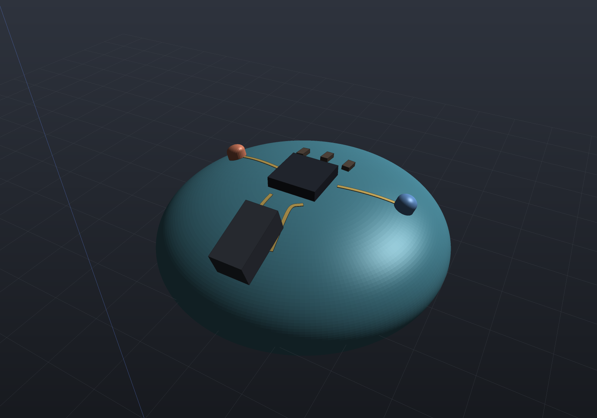
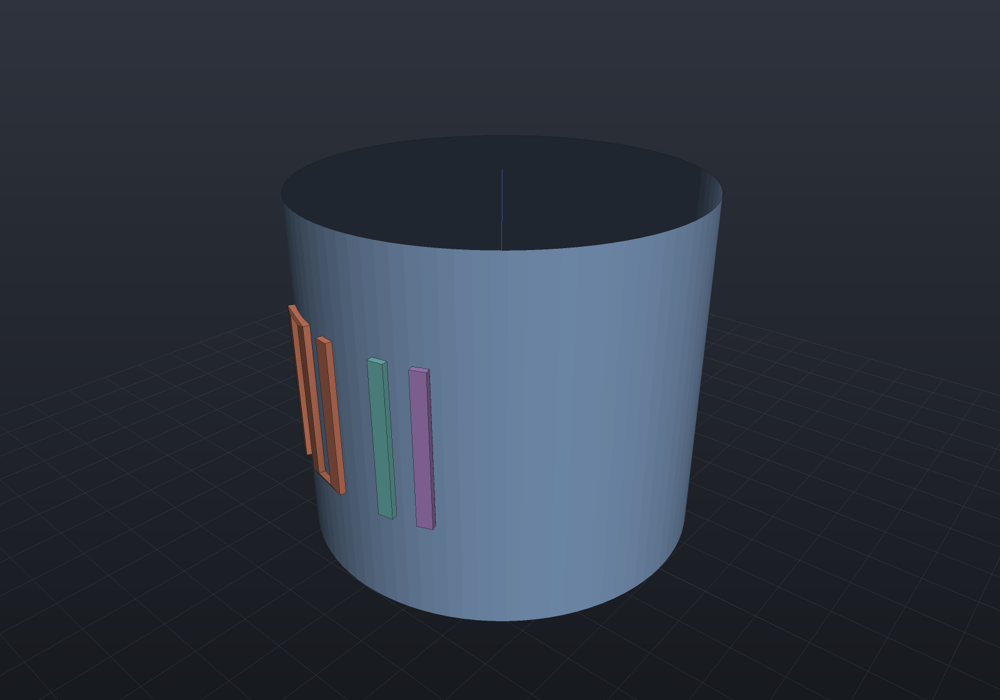

The flagship of the ECAD campaign: routing conductors and seating components on a **moulded,
doubly-curved surface** rather than a flat board — the **MID** (moulded interconnect device) / **LDS**
(laser direct structuring) construction, where a plastic housing carries its own circuit on its shaped
wall.

**It works on *any* surface — a torus, a bumpy blob, a whole closed shell — not one exp-map chart.** A
`MidSurface` wraps an arbitrary triangle mesh and answers the
three questions the routing asks *intrinsically*: where the nearest surface point is (a pad states its
world position and snaps to the shell), what tangent frame sits there (a component poses on the
surface), and what the surface does *locally* — a small exponential-map chart around a point, the
geodesic-distance approximator the DRC measures a clearance in and reads the distortion from. **No
feature depends on a chart covering the whole part**; every chart is local and per query, so a closed
surface that a single global exp map would wrap onto itself is routed with no chart at all.

## The showcase: a moulded wearable

A wide, low ellipsoidal **wearable dome** — a moulded pebble — carrying its own circuit: an MCU, two
LEDs, a connector and passives **seated on the shaped surface**, wired by conductors the board
**routes itself** as geodesics along the dome. Pads are placed and `MidRouting.Route` lays a DRC-clean
geodesic per net; the whole layout is verified on the surface — every net connects its pads and the 3D
DRC is clean — before it is rendered.

```csharp render:ecad-mid-wearable
// The moulded shell: a wide, low ellipsoidal dome (a wearable puck), genuinely doubly-curved so no
// single exp-map chart is an isometry — exactly what the intrinsic model exists for.
double R = 10; var scale = new Vector3d(1.5, 1.5, 0.62);
var shell = MeshPrimitives.UvSphere(R, 200, 100).Transformed(Matrix4d.CreateScale(scale));
var board = MidBoard.OnMesh(shell);              // INTRINSIC: no seed, no radius, works on any geometry

// A dome surface point above a footprint (x, y) — "place this here on the wearable's top".
Vector3d Above(double x, double y) {
    double rx = R * scale.X, rz = R * scale.Z;
    double z = rz * Math.Sqrt(Math.Max(1 - (x * x + y * y) / (rx * rx), 0));
    return new Vector3d(x, y, z + 0.01);
}

// Small electronic-component bodies, modeled +Z out of the surface with the seating datum at the
// origin, so the seat convention drops them onto the dome pointing outward.
Shape Qfn()       => Shape.Box(5, 5, 1.1).Translate(new Vector3d(0, 0, 0.55));
Shape Connector() => Shape.Box(6, 3.2, 2.6).Translate(new Vector3d(0, 0, 1.3));
Shape Led()       => Shape.Cylinder(1.0, 0.7).Translate(new Vector3d(0, 0, 0.35))
                         .Union(Shape.Sphere(1.0).Scale(1, 1, 0.7).Translate(new Vector3d(0, 0, 0.7)));
Shape Passive()   => Shape.Box(1.6, 0.8, 0.45).Translate(new Vector3d(0, 0, 0.225));

// Seat the components on the surface (Z = surface normal), each snapped to the dome. The whole scene
// is displayed offset from the origin so the world axis gizmo stays out of the composition.
var chip = new PartColor(0.16f, 0.18f, 0.22f);
var dark = new PartColor(0.24f, 0.26f, 0.30f);
var brown = new PartColor(0.35f, 0.30f, 0.26f);
var move = Matrix4d.CreateTranslation(new Vector3d(0, 24, 0));
Part P(string name, Shape s, PartColor c) => new(name, s, c, move);
var scene = new Scene();
scene.Add(new Part("shell", shell, new PartColor(0.30f, 0.55f, 0.62f), move));
scene.Add(P("mcu",   board.Seat(Qfn(),       Above(0, 0)).Body,        chip));
scene.Add(P("conn",  board.Seat(Connector(), Above(0, -9.5)).Body,     dark));
scene.Add(P("led1",  board.Seat(Led(),       Above(-9.5, 2.5)).Body,   Palette.Coral));
scene.Add(P("led2",  board.Seat(Led(),       Above(9.5, 2.5)).Body,    Palette.Sky));
scene.Add(P("r1",    board.Seat(Passive(),   Above(-2.6, 4.8)).Body,   brown));
scene.Add(P("r2",    board.Seat(Passive(),   Above(0, 5.2)).Body,      brown));
scene.Add(P("r3",    board.Seat(Passive(),   Above(2.6, 4.8)).Body,    brown));

// Pads for four nets, radiating from the central MCU: connector power/ground to the MCU's south pads,
// and each LED to a side pad.
var nets = new[] {
    ("5V",  Above(-1.7, -9.0), Above(-1.7, -3.2)),
    ("GND", Above( 1.7, -9.0), Above( 1.7, -3.2)),
    ("D1",  Above(-3.2,  0.9), Above(-8.8,  2.5)),
    ("D2",  Above( 3.2,  0.9), Above( 8.8,  2.5)),
};
foreach (var (net, a, b) in nets) {
    board.PlacePad(net, a, 0.6, $"{net}.a");
    board.PlacePad(net, b, 0.6, $"{net}.b");
}

// AUTO-ROUTE: the board routes itself — a DRC-aware geodesic per net over the mesh vertex graph, each
// committed only after the exact 3D DRC certifies it clean. A net it cannot route is reported by name.
var routed = MidRouting.Route(board, null, new SurfaceRouteOptions { TraceWidth = 0.35 });
Console.WriteLine($"auto-routed {routed.RoutedNets.Count} nets: {routed}");
if (!routed.FullyRouted)
    throw new Exception("the wearable did not fully route: " + routed);
foreach (var trace in routed.Traces)
    scene.Add(P($"copper-{trace.Net}", trace.Conductor(0.06), Palette.Brass));

// Verify on the surface: every routed net connects its pads, the 3D DRC is clean. Self-checking, so
// this example cannot rot.
var report = MidRouting.Verify(board);
Console.WriteLine($"nets connected: {report.Ratsnest.Count == 0}; DRC ok: {report.Ok}");
if (!report.Ok || report.Ratsnest.Count != 0)
    throw new Exception("the wearable did not verify: " + report);

var camera = new CameraState(-Math.PI / 2 + 0.5, 0.66, 50, (0, 23, 3.4));
```



## The surface auto-router

`MidRouting.Route` is the **geodesic analogue of the flat autorouter** ([`PcbRouter`](ecad-routing.md)):
it turns the ratsnest of an intrinsic board into DRC-clean copper. Each unrouted net is decomposed into
2-pin connections over an MST and routed as a **DRC-aware geodesic maze search over the mesh vertex
graph** (edge weight the geodesic edge length, an A\* whose 3D-straight-line heuristic is admissible
because a chord never exceeds a geodesic), then straightened.

```csharp
var board = MidBoard.OnMesh(shell);              // an INTRINSIC board (OnMesh, any geometry)
// ... place the pads carrying each net ...
var result = MidRouting.Route(board, rules, new SurfaceRouteOptions { TraceWidth = 0.35 });
// result.RoutedNets / result.UnroutedNets / result.Traces / result.RipUps
```

The verification bar is the flat router's, lifted onto the surface — an autorouter that connects while
violating clearance is the classic silent failure, so the router is built so that cannot happen:

- **The mesh vertex graph is an accelerator; the exact 3D DRC is the source of truth.** A candidate
  geodesic is committed only after `Mid3dDrc.RouteCandidateClears` certifies it adds *no* violation
  (and an `Uncertain` pair — one the surface cannot certify — is treated as not passable), so a
  graph-resolution error can never ship a clearance-violating trace, and the partial result of a board
  it cannot fully route is still clean.
- **A net that cannot be routed cleanly is reported UNROUTABLE by name** — never a silent violation.
- **Rip-up-and-reroute for congestion**, exactly the flat router's negotiated-congestion doctrine: a
  net with no clean geodesic routes *across* the committed traces that block it (soft obstacles, a
  per-net bitmask; pads and the mesh boundary are hard), rips those up, re-routes cleanly without them,
  and re-queues them — bounded, so a truly boxed-in net terminates and is named.

Because the exact DRC decides every commit, the search's obstacle model can safely **over-block**: a
vertex is blocked when laying the net's copper there comes within the clearance of an other-net feature,
measured as the 3D **chord** (a lower bound on the geodesic), plus half a longest edge so the raw
edge-graph path is DRC-clean by construction. Over-blocking only costs a detour or a named refusal,
never correctness.

## The certified geodesic DRC

On an intrinsic board the clearance between two different-net conductors is a **geodesic surface
distance**, measured on the mesh. Two certified facts make the three-valued verdict honest:

- **A 3D chord is never longer than a surface geodesic**, so a chord edge-to-edge distance at or above
  the clearance *proves* the surface clearance whatever the curvature — the broad phase, and the
  reason a pair on the far side of the dome is certified **Clear** with no chart at all.
- A closer pair is measured tightly in a **local exp-map chart** built around it (the
  geodesic-distance approximator, exact on a developable patch) with the **same grow-and-intersect**
  the [flat copper DRC](ecad-drc.md) uses and the local distortion folded in.

The result is three-valued: **Clear**, **Violation**, or **Uncertain** — where the distortion band
straddles the limit (the clearance is comparable to the curvature radius) or the curvature is too high
to cover the pair in a chart, the pair is **refused**, not passed false-precise (the near-tangency rule
the [anti-drill tamper mesh](tamper-mesh.md) refuses conformal placement over). A **plane never
straddles**; a small sphere with a clearance a large fraction of its radius does — and the DRC says so
rather than guessing.

## Exact where one chart applies — the developable oracle

Where a single chart *is* an isometry — a flat or **developable** patch (a cylinder, a cone) —
`MidBoard.OnSurface` authors features in one exp map's `(u, v)`,
which is the intrinsic geodesic exactly. The decisive test builds a **cylindrical** MID board and the
**flat unrolled sheet**, routes the *same* nets on both, and asserts the verdicts and measured
separations agree — bit for bit.

```csharp run:ecad-mid
// A finely tessellated CYLINDER WALL (a developable moulded surface), and a flat unrolled sheet.
HalfEdgeMesh Tube(double r, double h, int around, int along) {
    var pos = new List<Vector3d>();
    for (int j = 0; j <= along; j++)
        for (int i = 0; i < around; i++) {
            double a = 2 * Math.PI * i / around;
            pos.Add(new Vector3d(r * Math.Cos(a), r * Math.Sin(a), h * j / along));
        }
    var faces = new List<int[]>();
    for (int j = 0; j < along; j++)
        for (int i = 0; i < around; i++) {
            int p = j * around + i, q = j * around + (i + 1) % around;
            faces.Add(new[] { p, q, q + around });
            faces.Add(new[] { p, q + around, p + around });
        }
    return HalfEdgeMesh.Build(pos, faces);
}
HalfEdgeMesh Plane(int n, double size) {
    var pos = new List<Vector3d>();
    for (int j = 0; j <= n; j++) for (int i = 0; i <= n; i++)
        pos.Add(new Vector3d(-size / 2 + size * i / n, -size / 2 + size * j / n, 0));
    var faces = new List<int[]>();
    for (int j = 0; j < n; j++) for (int i = 0; i < n; i++) {
        int a = j * (n + 1) + i;
        faces.Add(new[] { a, a + 1, a + n + 2 });
        faces.Add(new[] { a, a + n + 2, a + n + 1 });
    }
    return HalfEdgeMesh.Build(pos, faces);
}

var tube = Tube(6, 8, 64, 40);
var plane = Plane(40, 8);

// Parameterize each surface by the exp map from a stated origin — the routing PATCH, a real design
// parameter (which part of the moulding carries the circuit).
var cylinder = MidBoard.OnSurface(tube, seedVertex: 20 * 64, referenceDirection: Vector3d.UnitY, radius: 2.5);
var flat     = MidBoard.OnSurface(plane, seedVertex: 20 * 41 + 20, referenceDirection: Vector3d.UnitX, radius: 5.0);
Console.WriteLine($"cylinder exp-map distortion: {cylinder.MaxDistortion:E2}  (developable => tiny)");
Console.WriteLine($"plane exp-map distortion:    {flat.MaxDistortion:E2}  (the identity)");

// Route the SAME nets in exp-map (u, v) coordinates on both surfaces.
void Route(MidBoard b) {
    b.PlacePad("A", new Vector2d(0, 0), 0.3, "A");
    b.PlacePad("B", new Vector2d(0.30 + 0.30, 0), 0.3, "B");   // 0.30 mm edge-to-edge gap: clear
    b.PlacePad("C", new Vector2d(0, 1), 0.3, "C");
    b.PlacePad("D", new Vector2d(0.30 + 0.05, 1), 0.3, "D");   // 0.05 mm gap: too close
}
Route(cylinder);
Route(flat);

var rules = DrcRuleSet.Default;               // 0.15 mm clearance
var on3d = Mid3dDrc.Check(cylinder, rules);   // the 3D DRC on the moulded cylinder
var on2d = Mid3dDrc.Check(flat, rules);       // the unrolled 2D DRC on the flat sheet

Console.WriteLine($"3D DRC on the cylinder: {on3d.Violations.Count} violation(s), {on3d.Uncertain.Count} uncertain");
Console.WriteLine($"unrolled 2D DRC:        {on2d.Violations.Count} violation(s), {on2d.Uncertain.Count} uncertain");
var v3 = on3d.Violations.Single();
var v2 = on2d.Violations.Single();
Console.WriteLine($"same verdict ({v3.Rule}), same measured separation: "
    + $"{v3.MeasuredParameter:R} == {v2.MeasuredParameter:R}  (bit for bit)");
Console.WriteLine($"the cylinder folds the distortion into the surface clearance: "
    + $"[{v3.SurfaceSeparationMin:g4}, {v3.SurfaceSeparationMax:g4}] mm");
```

The verdicts and the measured `(u, v)` separations are identical because both run the *same*
grow-and-intersect on the *same* `(u, v)` geometry; the only thing the cylinder adds is the surface
clearance **band** the fold reports, which on a developable surface is a hair wide. The **intrinsic**
board reaches the same answer on a cylinder to the discretisation grade — the developable oracle under
the general formulation.

## Conductors lifted onto the moulded surface

A `SurfaceTrace` is a centre-line lifted onto the surface, so its endpoints land **exactly** on the pad
points it connects. On an intrinsic board it is a **geodesic path on the mesh**
(`MidRouting.Connect` uses `DijkstraGraphDistance`'s edge-graph
geodesic), so a straight `(u, v)` line does not cut through a curved shell; on a global-chart board it
is the straight `(u, v)` line, which on a developable patch *is* the geodesic. Its exported form
(`Conductor`) is a thin conductive `Shape` — a ribbon offset in the surface tangent plane and extruded
along the surface normal — that round-trips through STL / STEP like any part, and each trace **reports
the distortion it carried** (`MinScale`, `MaxScale`).

```csharp render:ecad-mid-conductors
HalfEdgeMesh Tube(double r, double h, int around, int along) {
    var pos = new List<Vector3d>();
    for (int j = 0; j <= along; j++)
        for (int i = 0; i < around; i++) {
            double a = 2 * Math.PI * i / around;
            pos.Add(new Vector3d(r * Math.Cos(a), r * Math.Sin(a), h * j / along));
        }
    var faces = new List<int[]>();
    for (int j = 0; j < along; j++)
        for (int i = 0; i < around; i++) {
            int p = j * around + i, q = j * around + (i + 1) % around;
            faces.Add(new[] { p, q, q + around });
            faces.Add(new[] { p, q + around, p + around });
        }
    return HalfEdgeMesh.Build(pos, faces);
}

var tube = Tube(8, 14, 96, 60);
// The map radius is a GRAPH distance (it over-estimates the straight-line one), so state it
// comfortably above the furthest feature's reach.
var board = MidBoard.OnSurface(tube, seedVertex: 30 * 96, referenceDirection: Vector3d.UnitY, radius: 9.0);

// A serpentine and two straight conductors, routed in (u, v) and lifted onto the curved wall.
var serpentine = board.PlaceTrace("SIG", new[] {
    new Vector2d(-4, -3), new Vector2d(-4, 3), new Vector2d(-2.5, 3),
    new Vector2d(-2.5, -3), new Vector2d(-1, -3), new Vector2d(-1, 3) }, 0.6, "S");
var vcc = board.PlaceTrace("VCC", new[] { new Vector2d(1.5, -3), new Vector2d(1.5, 3) }, 0.6, "V");
var gnd = board.PlaceTrace("GND", new[] { new Vector2d(3, -3), new Vector2d(3, 3) }, 0.6, "G");

var scene = new Scene();
scene.Add(new Part("wall", Shape.From(tube), Palette.Steel));
scene.Add(new Part("SIG", serpentine.Conductor(0.25), Palette.Coral));
scene.Add(new Part("VCC", vcc.Conductor(0.25), Palette.Teal));
scene.Add(new Part("GND", gnd.Conductor(0.25), Palette.Plum));
```



## Seating a component

A catalogue `HardwareComponent` — or a raw `Shape` body (an MCU, an LED, a connector modelled as a
small solid) — seats on the surface at a world position, its body posed in the surface's own tangent
frame (Z the surface normal), on **any** geometry:

```csharp
var board = MidBoard.OnMesh(mesh);
var located = board.Locate(worldPoint);                          // snap to the surface
var seated = board.Seat(StandardComponents.CapScrew(6, 12), worldPoint);
var chip   = board.Seat(Shape.Box(5, 5, 1), worldPoint);         // a raw electronic-component body
// seated.Body is the component posed on the surface, ready to be an assembly occurrence.
```

The global-chart board seats by `(u, v)` instead (`board.Seat(component, new Vector2d(u, v))`).

## Scope, v1

`MidRouting.Route` **auto-routes** an intrinsic board and `MidRouting.Connect` **places** one trace
between two given pads; both lay geodesics on the mesh and both are certified by the same 3D DRC. The
auto-router runs on an **intrinsic** board (`OnMesh`); a global-chart board (`OnSurface`, kept for the
exact developable DRC oracle) is refused by name with a pointer to `OnMesh`. Filed as later stages:
**topological / shove** routing on the surface (v1 detours around obstacles but does not push them),
**multi-shell** MID (traces on an inner moulded shell as well as the outer), **length matching**, and
a conformal **solder mask / pour** on the surface (refused for the distortion reason, exactly as copper
pours already refuse curved walls). LDS process specifics (laser activation paths) are out of scope.

## Verification

The bar is higher than usual because ECAD fails plausibly. **On any surface**: a **torus** (a closed
surface a single global chart would wrap — measured `MaxDistortion > 1`) is routed and verified with no
chart; a **sphere geodesic** matches its great-circle closed form `R·θ` to the edge-graph discretisation
grade; a **bumpy blob** routes clean with its distortion reported per region; a pair on the far side is
certified **Clear**, a near pair a **Violation**, and a near-limit pair on a high-curvature patch
**refused** (`Uncertain`) while the same pair on a plane is certified. **Where one chart applies**: the
cylinder's 3D DRC verdicts and measured separations equal the unrolled sheet's, **bit for bit**. A
geodesic trace's endpoints land **exactly** on their pads; the exported conductor is a **closed solid**
that round-trips through STL; the whole check is **deterministic**; and the **showcase itself
self-verifies** (its render throws if the nets do not route, connect or pass the DRC).

**The auto-router** clears the same bar: a 2-pin net on a cylinder and on a sphere cap routes clean and
connected; several nets **route around** each other (a net's copper detours where its straight geodesic
would cross another's); a congested board that a greedy pass leaves unrouted is **completed by rip-up**
(both clean); a pin walled in by other-net copper is **unroutable by name** with the rest routed and
clean; a dense knot's **partial result is always DRC-clean** with the failures named; on a developable
cylinder the routed **connectivity matches the unrolled flat board's** (both clean, both fully routed —
a search need not be bit-identical); and two runs are **deterministic** vertex for vertex.
