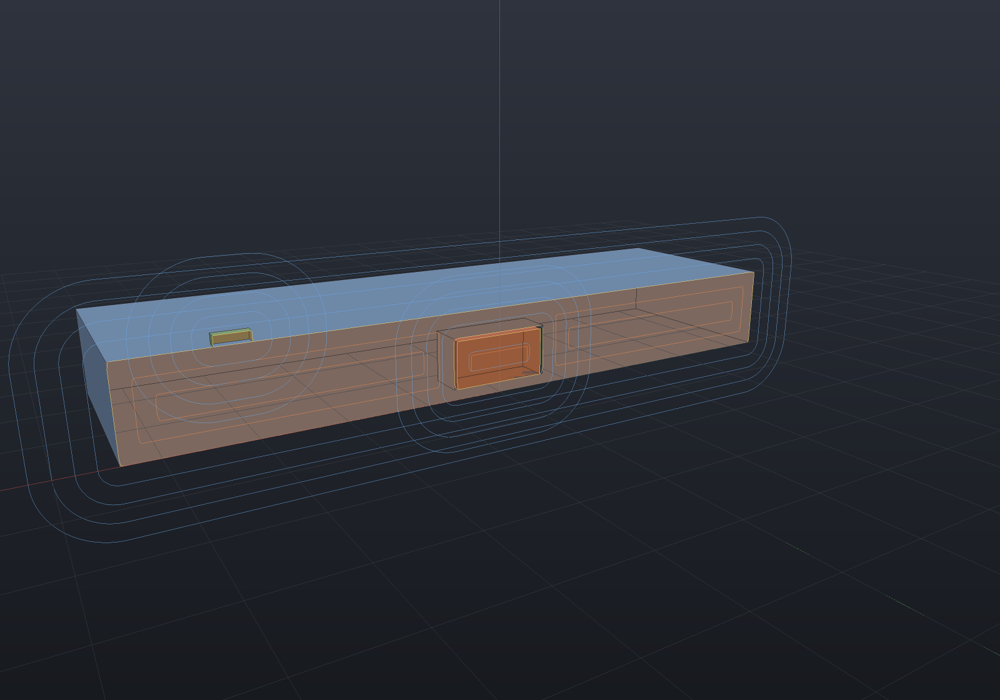
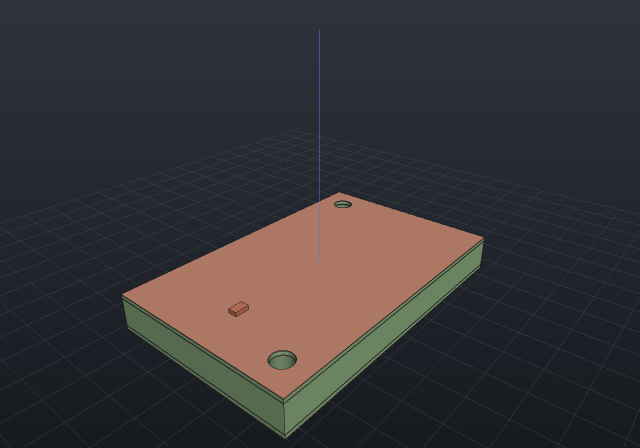

Stage 2 of the ECAD campaign turns a [schematic](ecad-schematics.md) into a **board**: a plate
with a copper stackup, a set of placed components, and the 3D assembly that falls out of them.
The load-bearing rule carries over — **one declaration produces both**. The schematic graph is
the single source; the board copper, the footprint placement and the 3D bodies all *derive*
from it, so a pin and its pad are one identity (pin `1` ↔ pad `1`) and nothing can drift.

## A board is geometry the kernel already builds

A `PcbBoard` is a polygon outline, a thickness, a copper stackup (top and bottom copper by
default, N layers for a multilayer board) and its own holes (mounting holes and vias). The
**plate** is built with the ordinary `Shape` API — the outline extruded, the holes drilled — so
it is an exact B-Rep with a closed-form volume:

> plate volume = outline area × thickness − Σ πr² × thickness

which is the oracle the tests hold it against (the tessellated volume approaches it from below
by each round hole's inscribed-polygon chord deficit).

## Placing components derives copper, drills and bodies

A `PcbLayout` is a schematic, a board, and a list of placements — each a `(x, y, rotation, side)`
pose naming a component the schematic declares. From that one declaration a placement derives:

- its **footprint pads** projected onto the correct copper layer at the placed pose (an SMD pad
  lands on its side's copper; a through-hole pad appears on every layer);
- its **through-hole pads drilled** into the plate (the same hole serves both faces);
- for a component whose definition carries a 3D `Body`, its **body posed** into the assembly.

A bottom-side placement is a genuine reflection: the body hangs below the board and its
through-holes keep the same world `(x, y)`. The reflection lives on the component's part
transform and its square is the identity (`Mirror(Mirror(x)) == x`), so the board's own +Z — world
up — is never touched (the *FlipX-not-FlipZ* doctrine: the reflection is spent on the part, the
pose stays a proper frame).

## The one-declaration identity check

`PcbLayout.Check()` is the geometric lift of the schematic's pin-counting identity: every pin of
every placed component resolves to **exactly one** placed pad at a known copper location. The two
counts (`PlacedPinCount == PlacedPadCount`, every pin covered once) are exposed so the identity can
be asserted numerically, and the lists it splits into — a pad with no pin, a pin with no pad, a
pad off the board — name which way it failed. A net's pins then resolve to specific copper regions
(`PadsOfNet`), which is the seam DRC and routing (later stages) consume.

```csharp run:ecad-pcb-check
// A schematic — the single source (bodies + footprints named once, instanced as components).
var resistor = new PartDefinition("R_0805", "R",
    new[] { new Pin("1", PinType.Passive), new Pin("2", PinType.Passive) },
    new Footprint("R0805", new[] {
        Pad.Smd("1", new Vector2d(-1.0, 0), 1.2, 1.4),
        Pad.Smd("2", new Vector2d(1.0, 0), 1.2, 1.4),
    }),
    body: () => Shape.Box(2.0, 1.25, 0.6).Translate(0, 0, 0.3));
var header = new PartDefinition("HDR_1x2", "J",
    new[] { new Pin("1", PinType.Passive), new Pin("2", PinType.Passive) },
    new Footprint("HDR254", new[] {
        Pad.ThroughHole("1", new Vector2d(-1.27, 0), pad: 1.6, drill: 0.9),
        Pad.ThroughHole("2", new Vector2d(1.27, 0), pad: 1.6, drill: 0.9),
    }),
    body: () => Shape.Box(5.08, 2.54, 4.0).Translate(0, 0, 2.0));

var sch = new Schematic("blinky");
var r = sch.Add("R1", resistor, "330");
var j = sch.Add("J1", header);
sch.Connect("VCC", j.Pin("1"), r.Pin("1"));
sch.Connect("SIG", r.Pin("2"), j.Pin("2"));

// A board, and the components placed on it.
var board = new PcbBoard(
    new[] {
        new Vector2d(-20, -15), new Vector2d(20, -15),
        new Vector2d(20, 15), new Vector2d(-20, 15),
    },
    thickness: 1.6,
    holes: new[] {
        new BoardHole(new Vector2d(-17, -12), 3.0, BoardHoleKind.Mounting),
        new BoardHole(new Vector2d(17, 12), 3.0, BoardHoleKind.Mounting),
    });

var layout = new PcbLayout(sch, board);
layout.Place("R1", 6, 0, rotationDegrees: 0, side: CopperSide.Top);
layout.Place("J1", -8, 0, rotationDegrees: 90, side: CopperSide.Top);

// The identity check — the geometric lift of the schematic's pin count.
var check = layout.Check();
if (!check.Ok) throw new Exception(check.ToString());
Console.WriteLine($"pins {check.PlacedPinCount} == pads {check.PlacedPadCount}, identity holds: {check.IdentityHolds}");

// VCC's two pins resolve to two copper locations.
var vcc = layout.Schematic.Nets.First(n => n.Name == "VCC");
foreach (var pad in layout.PadsOfNet(vcc))
    Console.WriteLine($"  VCC -> {pad.Name} at ({pad.World.X:g4}, {pad.World.Y:g4})");

// The plate volume matches the closed form (a through-hole header drilled two 0.9 mm holes).
Console.WriteLine($"plate volume (closed form): {layout.ExpectedPlateVolume():g6} mm^3");

// The layout is a byte-identical save -> load -> save fixed point.
var jsonText = layout.Save();
if (PcbLayout.Load(jsonText, new PartLibrary()).Save() != jsonText)
    throw new Exception("the layout is not a persistence fixed point");
```

## The board as an assembly

`ToAssembly()` builds the drilled plate plus one occurrence per placed component whose definition
carries a body — the same `Assembly` / `PartInstance` flattening the viewer, the BOM and every
exporter already consume. The 3D render below is that assembly:

```csharp render:ecad-pcb-board
var resistor = new PartDefinition("R_0805", "R",
    new[] { new Pin("1", PinType.Passive), new Pin("2", PinType.Passive) },
    new Footprint("R0805", new[] {
        Pad.Smd("1", new Vector2d(-1.6, 0), 1.2, 1.4),
        Pad.Smd("2", new Vector2d(1.6, 0), 1.2, 1.4),
    }),
    body: () => Shape.Box(3.2, 1.6, 0.6).Translate(0, 0, 0.3));
var led = new PartDefinition("LED_1206", "D",
    new[] { new Pin("A", "anode", PinType.Passive), new Pin("K", "cathode", PinType.Passive) },
    new Footprint("LED1206", new[] {
        Pad.Smd("A", new Vector2d(-1.6, 0), 1.4, 1.6),
        Pad.Smd("K", new Vector2d(1.6, 0), 1.4, 1.6),
    }),
    body: () => Shape.Cylinder(1.4, 1.2).Translate(0, 0, 0.6));
var header = new PartDefinition("HDR_1x3", "J",
    new[] { new Pin("1", PinType.Passive), new Pin("2", PinType.Passive), new Pin("3", PinType.Passive) },
    new Footprint("HDR254", new[] {
        Pad.ThroughHole("1", new Vector2d(-2.54, 0), 1.6, 0.9),
        Pad.ThroughHole("2", new Vector2d(0.0, 0), 1.6, 0.9),
        Pad.ThroughHole("3", new Vector2d(2.54, 0), 1.6, 0.9),
    }),
    body: () => Shape.Box(7.62, 2.54, 6.0).Translate(0, 0, 3.0));

var sch = new Schematic("blinky");
sch.Add("R1", resistor, "330");
sch.Add("D1", led);
sch.Add("J1", header);

var board = new PcbBoard(
    new[] {
        new Vector2d(-22, -16), new Vector2d(22, -16),
        new Vector2d(22, 16), new Vector2d(-22, 16),
    },
    thickness: 1.6,
    holes: new[] {
        new BoardHole(new Vector2d(-18, -12), 3.2, BoardHoleKind.Mounting),
        new BoardHole(new Vector2d(18, -12), 3.2, BoardHoleKind.Mounting),
        new BoardHole(new Vector2d(-18, 12), 3.2, BoardHoleKind.Mounting),
        new BoardHole(new Vector2d(18, 12), 3.2, BoardHoleKind.Mounting),
    });

var layout = new PcbLayout(sch, board);
layout.Place("R1", 2, 6, 0, CopperSide.Top);
layout.Place("D1", 10, 6, 0, CopperSide.Top);
layout.Place("J1", -12, 0, 0, CopperSide.Top);

var scene = new Scene();
scene.AddTab("Board").Add(layout.ToAssembly());
```


## Multilayer stackups and embedded components

A board is more than two copper layers, and a component is not always on a surface. A full
`LayerStackup` is an ordered list of **copper and dielectric layers, each with a thickness**
(copper–dielectric–…–copper — the standard 2 / 4 / 6-layer builds). The board is extruded through
the *whole* build-up, and each copper plane's z is **derived** from it: the top and bottom coppers
sit at the two faces, the inner coppers between.

A component placed with `Embed(reference, layer, x, y)` seats on an **inner copper layer** — inside
the board, in a cavity milled into the plate. Two embedding styles:

- **Enclosed** (the default): a buried, internal cavity. The build-up above and below stays intact,
  so the die has no external access and its body is strictly inside the board volume.
- **Open cavity**: a well milled down from the placement's face, so the component is accessible and
  the well breaks that surface.

The cavity is sized to the component's footprint (and body) plus a stated clearance, and its volume
comes off the plate **exactly** (footprint-plus-clearance area × depth). The one-declaration
identity holds across layers: an embedded component's pads map to their inner layer's copper, the
identity `Check` still passes, and the copper DRC is fully N-layer aware.

```csharp run:ecad-multilayer-facts
// A 4-layer build-up: Top / prepreg / In1 / core / In2 / prepreg / Bottom.
var stackup = LayerStackup.FourLayer(copper: 0.035, prepreg: 0.2, core: 1.13);
Console.WriteLine($"total thickness = {stackup.TotalThickness:g4} mm (== the sum of every layer)");
foreach (var c in stackup.Coppers)
    Console.WriteLine($"  copper '{c.Name}' at z = {c.Z:g5} mm");

var board = new PcbBoard(
    new[] { new Vector2d(-25, -20), new Vector2d(25, -20), new Vector2d(25, 20), new Vector2d(-25, 20) },
    stackup);

// A die (body + footprint) to bury on an inner layer, and a surface resistor.
var die = new PartDefinition("DIE", "U",
    new[] { new Pin("1", PinType.Passive), new Pin("2", PinType.Passive) },
    new Footprint("DIE_SMD", new[] {
        Pad.Smd("1", new Vector2d(-1.5, 0), 1.4, 2.0),
        Pad.Smd("2", new Vector2d(1.5, 0), 1.4, 2.0),
    }),
    body: () => Shape.Box(4.0, 2.5, 0.5).Translate(0, 0, 0.25));
var res = new PartDefinition("R_0805", "R",
    new[] { new Pin("1", PinType.Passive), new Pin("2", PinType.Passive) },
    new Footprint("R0805", new[] {
        Pad.Smd("1", new Vector2d(-1.0, 0), 1.2, 1.4),
        Pad.Smd("2", new Vector2d(1.0, 0), 1.2, 1.4),
    }),
    body: () => Shape.Box(2.0, 1.25, 0.5).Translate(0, 0, 0.25));

var sch = new Schematic("stack");
var u1 = sch.Add("U1", die);
var r1 = sch.Add("R1", res);
sch.Connect("A", u1.Pin("1"), r1.Pin("1"));
sch.Connect("B", u1.Pin("2"), r1.Pin("2"));

var layout = new PcbLayout(sch, board);
layout.Embed("U1", "In2", 0, 0, cavityClearance: 0.15);   // buried on the inner layer In2
layout.Place("R1", 14, 0, 0, CopperSide.Top);             // on the surface

// The enclosed cavity removes exactly its pocket, and the die is buried inside the board volume.
var cavity = layout.Cavities().Single();
Console.WriteLine($"cavity removes {cavity.RemovedVolume:g4} mm^3, buried z in [{cavity.ZLow:g3}, {cavity.ZHigh:g3}]");
Console.WriteLine($"plate volume = {layout.ExpectedPlateVolume():g6} mm^3");

// The pin-count identity still holds across layers; U1's pads land on the inner copper.
var check = layout.Check();
if (!check.Ok) throw new Exception(check.ToString());
Console.WriteLine($"identity holds across layers: {check.IdentityHolds}");
var in2 = layout.CopperLayers().First(l => l.Name == "In2");
Console.WriteLine($"In2 copper carries: {string.Join(", ", in2.Pads.Select(p => p.Name))}");
```

The section render below cuts the same idea through the middle, revealing the die sitting in its
cavity between the copper layers:

```csharp render:ecad-multilayer section:y,0
// Look edge-on at the y = 0 cut face, so the section reveals the buried die.
var camera = new CameraState(Math.PI / 2 - 0.55, 0.28, 52, (0, 0, 2.7));

// A thick illustrative build-up so the section reads (total ≈ 5.4 mm).
var stackup = LayerStackup.FourLayer(copper: 0.1, prepreg: 0.5, core: 4.0);
var board = new PcbBoard(
    new[] { new Vector2d(-22, -13), new Vector2d(22, -13), new Vector2d(22, 13), new Vector2d(-22, 13) },
    stackup);

// A die whose body is the cavity's whole depth, buried on the inner layer In2.
var die = new PartDefinition("DIE", "U",
    new[] { new Pin("1", PinType.Passive), new Pin("2", PinType.Passive) },
    new Footprint("DIE", new[] {
        Pad.Smd("1", new Vector2d(-2.2, 0), 1.6, 2.4),
        Pad.Smd("2", new Vector2d(2.2, 0), 1.6, 2.4),
    }),
    body: () => Shape.Box(6.0, 4.0, 3.0).Translate(0, 0, 1.5));
var res = new PartDefinition("R_0805", "R",
    new[] { new Pin("1", PinType.Passive), new Pin("2", PinType.Passive) },
    new Footprint("R0805", new[] {
        Pad.Smd("1", new Vector2d(-1.0, 0), 1.2, 1.4),
        Pad.Smd("2", new Vector2d(1.0, 0), 1.2, 1.4),
    }),
    body: () => Shape.Box(2.0, 1.25, 0.6).Translate(0, 0, 0.3));

var sch = new Schematic("stack");
var u1 = sch.Add("U1", die);
var r1 = sch.Add("R1", res);
sch.Connect("A", u1.Pin("1"), r1.Pin("1"));
sch.Connect("B", u1.Pin("2"), r1.Pin("2"));

var layout = new PcbLayout(sch, board);
layout.Embed("U1", "In2", 0, 0, cavityClearance: 0.2);   // buried, enclosed, in an internal cavity
layout.Place("R1", 16, 0, 0, CopperSide.Top);            // proud on the top surface

var scene = new Scene();
scene.AddTab("Board").Add(layout.ToAssembly());
```



An embedded component's cavity wall is a milled edge, so other copper on its seat layer must clear
it (`DrcRule.CavityClearance`), and clearance / shorts are checked **per copper layer including the
inner ones**. A net whose pads sit on different layers is joined by a **via** — see below.

## Vias and cross-layer connectivity

A **via** is a net-carrying, plated cross-layer connection: a drilled, plated hole at `(x, y)`
spanning the copper layers `[from, to]`, with an annular copper **pad** on every layer it touches. A
signal via transitions a routed trace between layers; a stitching via ties a plane — either way it
belongs to a net, so a via with no net is refused by name.

The via **type is derived from the span, never stored twice**: outer-face to outer-face is a
`Through` via, an outer face to an inner layer is `Blind`, buried between inner layers is `Buried`,
and a single dielectric hop (adjacent copper layers) is a `Microvia`.

The engine underneath is the one an autorouter reuses — a **per-net connectivity graph**. Two copper
features join when they *touch* on the same layer (an exact region intersection) **or** are the two
ends of a via (a plated barrel across the layers). A net is **connected** when all its pads lie in
one component. This is the real answer to *"a net whose pads sit on different layers"* — a via that
touches each is a genuine connection, not an unrouted ratsnest:

```csharp run:ecad-via-connectivity
// A 4-layer board: copper planes Top / In1 / In2 / Bottom.
var stackup = LayerStackup.FourLayer(copper: 0.035, prepreg: 0.2, core: 1.13);
var board = PcbBoard.Rectangle(30, 20, stackup);

// A round pad, instanced on the top and on the bottom, wired into one net — a signal that has to
// change layers to get from one to the other.
var pad = new PartDefinition("PAD", "U",
    new[] { new Pin("1", PinType.Passive) },
    new Footprint("PAD", new[] { Pad.Smd("1", new Vector2d(0, 0), 1.2, 1.2, PadShape.Round) }));

var sch = new Schematic("stitch");
var top = sch.Add("U1", pad);
var bot = sch.Add("U2", pad);
sch.Connect("SIG", top.Pin("1"), bot.Pin("1"));

var layout = new PcbLayout(sch, board);
layout.Place("U1", 0, 0, side: CopperSide.Top);      // SIG on the top copper
layout.Place("U2", 0, 0, side: CopperSide.Bottom);   // SIG on the bottom copper

// Before any via, SIG's two pads sit on different layers — an UNROUTED ratsnest.
Console.WriteLine($"before the via: SIG connected = {layout.IsNetConnected("SIG")}, "
    + $"ratsnest = [{string.Join(", ", PcbDrc.Check(layout).Ratsnest)}]");

// A via ties the two layers. Its type is DERIVED from the span (Top..Bottom is a through via),
// and it touches every copper layer it crosses.
var stitch = new Via("SIG", 0, 0, "Top", "Bottom", DrillDiameter: 0.4, PadDiameter: 1.0);
Console.WriteLine($"via Top..Bottom is a {layout.ViaTypeOf(stitch)} via touching "
    + $"[{string.Join(", ", layout.ViaLayers(stitch))}]");
layout.WithVia(stitch);

// Now the via's annular pads touch each pad — SIG is CONNECTED, and its ratsnest is empty.
var connectivity = layout.Connectivity();
Console.WriteLine($"after the via:  SIG connected = {connectivity.Of("SIG").IsConnected}, "
    + $"ratsnest = [{string.Join(", ", connectivity.Unrouted)}]");

// The DRC catches a via with too thin an annular ring — a via IS a drilled pad, so (pad - drill)/2
// must clear the minimum annular ring (0.15 mm by default).
var check = new PcbLayout(new Schematic("drc"), board);
check.AddVia("N", 8, 5, "Top", "Bottom", drill: 0.5, pad: 0.6);   // ring (0.6 - 0.5)/2 = 0.05 mm
foreach (var v in PcbDrc.Check(check).OfRule(DrcRule.AnnularRing))
    Console.WriteLine($"DRC: {v.Message}");
```

Because a via pad is ordinary copper and a via drill is a drilled hole, the general DRC rules reach
them for free — a via pad to *different-net* copper rides the copper-clearance rule, a via drill to
different-net copper the drill-to-copper rule, and a same-net via touching its own copper is the
*intended* connection and is never flagged (the one-declaration identity). The one genuinely new via
rule is **via-to-via** (`DrcRule.ViaToVia`): the minimum web between two drilled holes, applied to
all via pairs regardless of net (a manufacturing spacing). Vias are **layout truth**, so they
round-trip in the layout file; a via-free layout saves byte-identically.

## Exploding the stack

The reason a full `LayerStackup` — copper AND dielectric, each with a thickness — is worth carrying
is that the board is then a *sandwich the kernel knows how to take apart*. `ToExplodedAssembly()`
slices the plate into **one slab per physical layer** (a dielectric core, or a thin copper film)
and assembles them with the placed components, fanned along the **stackup normal**. It is the
sibling of `ToAssembly()` (the board as one part) and rides the same `Assembly` / `Occurrence`
machinery, so the ordinary exploded-view slider and `ExplodeTrack` animate it with no new code.

Every decision is fixed by the fact that a PCB's one interesting relationship is its z-stacking:

- The **layers fan up from the bottom layer as the datum** (it stays put — the natural datum, since
  the stackup itself accumulates from the bottom face at z = 0). A layer's offset is
  `stackup-normal · gap · rank`, counting rank from the bottom, so **stack order is explode order**:
  a layer above another when assembled is above it when exploded, and because the offset adds to the
  layer's *original* (contiguous) position, `gap` is the clean empty gap between consecutive layers
  whatever their thickness.
- **Surface components lift off their face** — a top part up clear of the fan, a bottom part down
  below the datum. Pure Z.
- **Embedded components come out of their cavity along Z first, then spread aside** — an
  `Occurrence.ExplodePath` **dogleg** whose first leg is pure ±normal (straight out of the cavity)
  and whose final offset carries a lateral step, so the die does not tunnel straight up through the
  layers above it (a diagonal reads as *insert at an angle*).

The slabs are disjoint, tile the stackup z-range exactly, and — being the outline drilled by every
through hole and milled by every cavity — their **union is the plate**: `Σ slab volume` equals
`ExpectedPlateVolume()`. At explode factor 0 the whole thing is the assembled board (each
component's world transform is bit-identical to `ToAssembly`'s), so the animation genuinely opens
*from* the board and closes back *to* it.

```csharp animate:ecad-explode frames:28
// A thick illustrative 4-layer build-up so the fanned slabs read (total ≈ 5.4 mm).
var stackup = LayerStackup.FourLayer(copper: 0.1, prepreg: 0.5, core: 4.0);
var board = new PcbBoard(
    new[] { new Vector2d(-22, -14), new Vector2d(22, -14), new Vector2d(22, 14), new Vector2d(-22, 14) },
    stackup,
    holes: new[] {
        new BoardHole(new Vector2d(-18, -10), 3.0, BoardHoleKind.Mounting),
        new BoardHole(new Vector2d(18, 10), 3.0, BoardHoleKind.Mounting),
    });

var die = new PartDefinition("DIE", "U",
    new[] { new Pin("1", PinType.Passive), new Pin("2", PinType.Passive) },
    new Footprint("DIE", new[] {
        Pad.Smd("1", new Vector2d(-2.2, 0), 1.6, 2.4),
        Pad.Smd("2", new Vector2d(2.2, 0), 1.6, 2.4),
    }),
    body: () => Shape.Box(6.0, 4.0, 3.0).Translate(0, 0, 1.5));
var res = new PartDefinition("R_0805", "R",
    new[] { new Pin("1", PinType.Passive), new Pin("2", PinType.Passive) },
    new Footprint("R0805", new[] {
        Pad.Smd("1", new Vector2d(-1.0, 0), 1.2, 1.4),
        Pad.Smd("2", new Vector2d(1.0, 0), 1.2, 1.4),
    }),
    body: () => Shape.Box(2.0, 1.25, 0.6).Translate(0, 0, 0.3));

var sch = new Schematic("stack");
var u1 = sch.Add("U1", die);
var r1 = sch.Add("R1", res);
sch.Connect("A", u1.Pin("1"), r1.Pin("1"));
sch.Connect("B", u1.Pin("2"), r1.Pin("2"));

var layout = new PcbLayout(sch, board);
layout.Embed("U1", "In2", 0, 0, cavityClearance: 0.2);   // a die buried between the copper layers
layout.Place("R1", 15, 0, 0, CopperSide.Top);            // a resistor proud on top

// Slice the board into per-layer slabs and fan them along the stackup normal.
var assembly = layout.ToExplodedAssembly();

var scene = new Scene();
scene.AddTab("Board").Add(assembly);

// Sequence it: the layers fan open first, the surface part lifts, and the buried die comes out
// LAST — straight up out of its cavity, then aside — once the layers above it have cleared.
var track = new ExplodeTrack(scene, deriveOffsets: false);
foreach (var occurrence in assembly.Occurrences)
{
    if (occurrence.Name == "U1") track.Stagger(occurrence, 0.55, 1.0);
    else if (occurrence.Name == "R1") track.Stagger(occurrence, 0.35, 0.85);
    else track.Stagger(occurrence, 0.0, 0.6);
}
var animation = new Animation(durationSeconds: 5, AnimationEasing.Smoothstep).With(track);
```



`deriveOffsets: false` keeps the offsets `ToExplodedAssembly` computed (the generic
`Assembly.AutoExplode` would derive a mechanical radial explode instead, and would move the datum
layer). The offsets are pure geometry, so this — like `AutoExplode` — is off-the-render-thread work;
evaluating the animation is then matrices only, the instance count and order independent of the
factor.

## Copper pours (ground planes)

A **copper pour** floods a layer with copper on one net — a ground plane, a power plane, a poured
fill. It is [layout truth](ecad-pcb.md) (a plane is part of the design), so a `CopperPour` derives
into copper features the [DRC](ecad-drc.md) and the [connectivity engine](ecad-pcb.md) read exactly
like any other copper: a `GND` pour **joins every GND pad it touches**, so the GND ratsnest empties.

The fill region is exact and the tamper-mesh construction — the board area (or a stated outline),
inset from the edge, **minus** every other-net copper and drill grown by the clearance, **minus** a
thermal-relief annulus around each same-net through-hole pad (bridged by spokes). So the pour clears
every other net *by construction* and a poured board passes the DRC:

```csharp run:ecad-pour
// A through-hole part (GND on pin 1) and an SMD part (GND on pin 1), spread across the board.
PartDefinition Header() => new("HDR", "J",
    new[] { new Pin("1", PinType.Passive), new Pin("2", PinType.Passive) },
    new Footprint("HDR_fp", new[] {
        Pad.ThroughHole("1", new Vector2d(0, 0), pad: 1.8, drill: 1.0),
        Pad.ThroughHole("2", new Vector2d(4, 0), pad: 1.8, drill: 1.0) }));
PartDefinition Res() => new("R", "R",
    new[] { new Pin("1", PinType.Passive), new Pin("2", PinType.Passive) },
    new Footprint("R_fp", new[] {
        Pad.Smd("1", new Vector2d(-0.8, 0), 1.0, 1.0), Pad.Smd("2", new Vector2d(0.8, 0), 1.0, 1.0) }));

var sch = new Schematic("pour-demo");
var j = sch.Add("J1", Header()); var r = sch.Add("R1", Res());
sch.Connect("GND", j.Pin("1"), r.Pin("1"));     // a THT GND pin and an SMD GND pin, far apart
sch.Connect("SIG", j.Pin("2"), r.Pin("2"));

var board = new PcbBoard(new[] {
    new Vector2d(-15, -10), new Vector2d(15, -10), new Vector2d(15, 10), new Vector2d(-15, 10) }, 1.6);
var layout = new PcbLayout(sch, board);
layout.Place("J1", 0, 0);          // J1.1 (GND, THT) at the origin — gets a thermal relief
layout.Place("R1", -10, 0);        // a second GND pad

Console.WriteLine($"before pour: GND connected = {layout.Connectivity().Of("GND").IsConnected}");

layout.AddPour(new CopperPour("GND", "Top"));   // default: four-spoke thermal relief on THT pads

var gnd = layout.Connectivity().Of("GND");
var rules = DrcRuleSet.Default with { MinAcuteAngleDegrees = 45 };   // a realistic acid-trap threshold
var report = PcbDrc.Check(layout, rules);
var model = PcbCopperModel.FromLayout(layout);

// The relief: a point in the annular gap between the spokes carries NO copper, yet the THT pad is
// still connected to the plane through the spokes.
bool gapIsAir = !model.Copper.Any(f => f.Layer == "Top" && f.Region.Contains(new Vector2d(1.1, 0)));

Console.WriteLine($"after pour:  GND connected = {gnd.IsConnected}, ratsnest = [{string.Join(", ", report.Ratsnest)}]");
Console.WriteLine($"THT relief gap is air: {gapIsAir}; DRC violations: {report.Violations.Count}");

if (!gnd.IsConnected || report.Ratsnest.Contains("GND") || !report.Ok || !gapIsAir)
    throw new Exception("a GND pour must connect every GND pin (incl. through spokes) and stay DRC-clean");
```

**Thermal relief** keeps a same-net through-hole pad solderable: instead of flooding over it (which
would sink all its heat into the plane), the pour leaves an annular air gap around the pad bridged by
thin radial spokes (four on the diagonals, by default). The pad stays *connected* through the spokes
and *relieved* by the gap — asserted both ways above. SMD pads and vias are direct-connected
(flooded); `ThermalRelief.None` floods a through-hole pad too. Spokes meet the plane at ~90° corners,
so a poured board with thermal reliefs wants an acid-trap threshold at or below 90° (a realistic
board sets it well under 90° regardless).

A `PourFill.Hatched` variant intersects the fill with a crosshatch grid — the region ∩ a line
pattern — for a lighter, more flexible plane. **Dead copper** — a piece of the pour the net cannot
reach, walled off by other-net copper — is removed by default (kept only when
`DeadCopper = DeadCopperPolicy.Keep`) and always reported (`PouredPour.DeadCopperArea`). A pour
exports to [Gerber](ecad-fabrication.md) as a `G36`/`G37` region fill and round-trips, and rides in
the layout file (write-only-when-stated, so a pour-free layout is byte-identical).

## Interchange: IDF import

`IdfReader` imports an IDF 3.0/4.0 board (`.emn`) file — board outline, thickness, drilled holes,
component placements and keep-outs — into a `PcbImport`, honouring the header's unit declaration
(MM / THOU, scaled to millimetres, recorded in `Diagnostics`). IDF carries no connectivity, so
`ToLayout()` synthesizes a data-only schematic (one component per placement, named by package) to
hold the placements against — honest: the layout's identity check then reports the components have
no footprints. `IdfWriter` closes the loop, so `read → write → read → write` is a byte-identical
fixed point for the geometry IDF carries. Section structure is validated up front and a malformed
file is refused by name.

## What is next

Positioning constraints, copper DRC (a region-offset clearance query over the placed pads),
autorouting, panel cutouts and MID/LDS 3D routing are later campaign stages over this one graph —
each reads the netlist↔copper identity stage 2 establishes.
