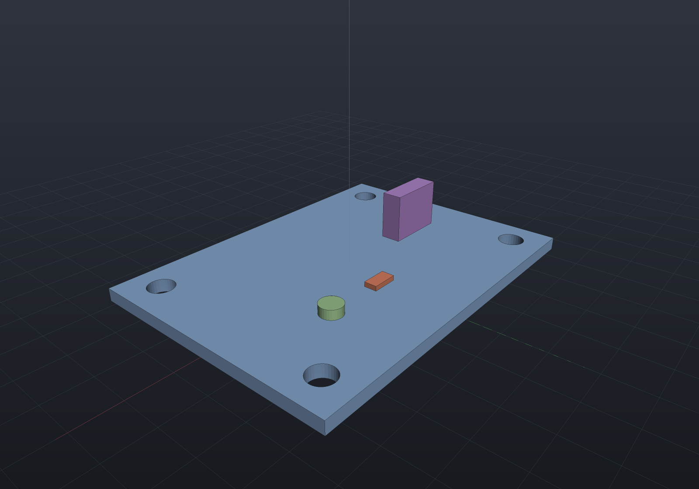

Stage 2 of the ECAD campaign turns a [schematic](ecad-schematics.md) into a **board**: a plate
with a copper stackup, a set of placed components, and the 3D assembly that falls out of them.
The load-bearing rule carries over — **one declaration produces both**. The schematic graph is
the single source; the board copper, the footprint placement and the 3D bodies all *derive*
from it, so a pin and its pad are one identity (pin `1` ↔ pad `1`) and nothing can drift.

## A board is geometry the kernel already builds

A `PcbBoard` is a polygon outline, a thickness, a copper stackup (top and bottom copper by
default, N layers for a multilayer board) and its own holes (mounting holes and vias). The
**plate** is built with the ordinary `Shape` API — the outline extruded, the holes drilled — so
it is an exact B-Rep with a closed-form volume:

> plate volume = outline area × thickness − Σ πr² × thickness

which is the oracle the tests hold it against (the tessellated volume approaches it from below
by each round hole's inscribed-polygon chord deficit).

## Placing components derives copper, drills and bodies

A `PcbLayout` is a schematic, a board, and a list of placements — each a `(x, y, rotation, side)`
pose naming a component the schematic declares. From that one declaration a placement derives:

- its **footprint pads** projected onto the correct copper layer at the placed pose (an SMD pad
  lands on its side's copper; a through-hole pad appears on every layer);
- its **through-hole pads drilled** into the plate (the same hole serves both faces);
- for a component whose definition carries a 3D `Body`, its **body posed** into the assembly.

A bottom-side placement is a genuine reflection: the body hangs below the board and its
through-holes keep the same world `(x, y)`. The reflection lives on the component's part
transform and its square is the identity (`Mirror(Mirror(x)) == x`), so the board's own +Z — world
up — is never touched (the *FlipX-not-FlipZ* doctrine: the reflection is spent on the part, the
pose stays a proper frame).

## The one-declaration identity check

`PcbLayout.Check()` is the geometric lift of the schematic's pin-counting identity: every pin of
every placed component resolves to **exactly one** placed pad at a known copper location. The two
counts (`PlacedPinCount == PlacedPadCount`, every pin covered once) are exposed so the identity can
be asserted numerically, and the lists it splits into — a pad with no pin, a pin with no pad, a
pad off the board — name which way it failed. A net's pins then resolve to specific copper regions
(`PadsOfNet`), which is the seam DRC and routing (later stages) consume.

```csharp run:ecad-pcb-check
// A schematic — the single source (bodies + footprints named once, instanced as components).
var resistor = new PartDefinition("R_0805", "R",
    new[] { new Pin("1", PinType.Passive), new Pin("2", PinType.Passive) },
    new Footprint("R0805", new[] {
        Pad.Smd("1", new Vector2d(-1.0, 0), 1.2, 1.4),
        Pad.Smd("2", new Vector2d(1.0, 0), 1.2, 1.4),
    }),
    body: () => Shape.Box(2.0, 1.25, 0.6).Translate(0, 0, 0.3));
var header = new PartDefinition("HDR_1x2", "J",
    new[] { new Pin("1", PinType.Passive), new Pin("2", PinType.Passive) },
    new Footprint("HDR254", new[] {
        Pad.ThroughHole("1", new Vector2d(-1.27, 0), pad: 1.6, drill: 0.9),
        Pad.ThroughHole("2", new Vector2d(1.27, 0), pad: 1.6, drill: 0.9),
    }),
    body: () => Shape.Box(5.08, 2.54, 4.0).Translate(0, 0, 2.0));

var sch = new Schematic("blinky");
var r = sch.Add("R1", resistor, "330");
var j = sch.Add("J1", header);
sch.Connect("VCC", j.Pin("1"), r.Pin("1"));
sch.Connect("SIG", r.Pin("2"), j.Pin("2"));

// A board, and the components placed on it.
var board = new PcbBoard(
    new[] {
        new Vector2d(-20, -15), new Vector2d(20, -15),
        new Vector2d(20, 15), new Vector2d(-20, 15),
    },
    thickness: 1.6,
    holes: new[] {
        new BoardHole(new Vector2d(-17, -12), 3.0, BoardHoleKind.Mounting),
        new BoardHole(new Vector2d(17, 12), 3.0, BoardHoleKind.Mounting),
    });

var layout = new PcbLayout(sch, board);
layout.Place("R1", 6, 0, rotationDegrees: 0, side: CopperSide.Top);
layout.Place("J1", -8, 0, rotationDegrees: 90, side: CopperSide.Top);

// The identity check — the geometric lift of the schematic's pin count.
var check = layout.Check();
if (!check.Ok) throw new Exception(check.ToString());
Console.WriteLine($"pins {check.PlacedPinCount} == pads {check.PlacedPadCount}, identity holds: {check.IdentityHolds}");

// VCC's two pins resolve to two copper locations.
var vcc = layout.Schematic.Nets.First(n => n.Name == "VCC");
foreach (var pad in layout.PadsOfNet(vcc))
    Console.WriteLine($"  VCC -> {pad.Name} at ({pad.World.X:g4}, {pad.World.Y:g4})");

// The plate volume matches the closed form (a through-hole header drilled two 0.9 mm holes).
Console.WriteLine($"plate volume (closed form): {layout.ExpectedPlateVolume():g6} mm^3");

// The layout is a byte-identical save -> load -> save fixed point.
var jsonText = layout.Save();
if (PcbLayout.Load(jsonText, new PartLibrary()).Save() != jsonText)
    throw new Exception("the layout is not a persistence fixed point");
```

## The board as an assembly

`ToAssembly()` builds the drilled plate plus one occurrence per placed component whose definition
carries a body — the same `Assembly` / `PartInstance` flattening the viewer, the BOM and every
exporter already consume. The 3D render below is that assembly:

```csharp render:ecad-pcb-board
var resistor = new PartDefinition("R_0805", "R",
    new[] { new Pin("1", PinType.Passive), new Pin("2", PinType.Passive) },
    new Footprint("R0805", new[] {
        Pad.Smd("1", new Vector2d(-1.6, 0), 1.2, 1.4),
        Pad.Smd("2", new Vector2d(1.6, 0), 1.2, 1.4),
    }),
    body: () => Shape.Box(3.2, 1.6, 0.6).Translate(0, 0, 0.3));
var led = new PartDefinition("LED_1206", "D",
    new[] { new Pin("A", "anode", PinType.Passive), new Pin("K", "cathode", PinType.Passive) },
    new Footprint("LED1206", new[] {
        Pad.Smd("A", new Vector2d(-1.6, 0), 1.4, 1.6),
        Pad.Smd("K", new Vector2d(1.6, 0), 1.4, 1.6),
    }),
    body: () => Shape.Cylinder(1.4, 1.2).Translate(0, 0, 0.6));
var header = new PartDefinition("HDR_1x3", "J",
    new[] { new Pin("1", PinType.Passive), new Pin("2", PinType.Passive), new Pin("3", PinType.Passive) },
    new Footprint("HDR254", new[] {
        Pad.ThroughHole("1", new Vector2d(-2.54, 0), 1.6, 0.9),
        Pad.ThroughHole("2", new Vector2d(0.0, 0), 1.6, 0.9),
        Pad.ThroughHole("3", new Vector2d(2.54, 0), 1.6, 0.9),
    }),
    body: () => Shape.Box(7.62, 2.54, 6.0).Translate(0, 0, 3.0));

var sch = new Schematic("blinky");
sch.Add("R1", resistor, "330");
sch.Add("D1", led);
sch.Add("J1", header);

var board = new PcbBoard(
    new[] {
        new Vector2d(-22, -16), new Vector2d(22, -16),
        new Vector2d(22, 16), new Vector2d(-22, 16),
    },
    thickness: 1.6,
    holes: new[] {
        new BoardHole(new Vector2d(-18, -12), 3.2, BoardHoleKind.Mounting),
        new BoardHole(new Vector2d(18, -12), 3.2, BoardHoleKind.Mounting),
        new BoardHole(new Vector2d(-18, 12), 3.2, BoardHoleKind.Mounting),
        new BoardHole(new Vector2d(18, 12), 3.2, BoardHoleKind.Mounting),
    });

var layout = new PcbLayout(sch, board);
layout.Place("R1", 2, 6, 0, CopperSide.Top);
layout.Place("D1", 10, 6, 0, CopperSide.Top);
layout.Place("J1", -12, 0, 0, CopperSide.Top);

var scene = new Scene();
scene.AddTab("Board").Add(layout.ToAssembly());
```



## Interchange: IDF import

`IdfReader` imports an IDF 3.0/4.0 board (`.emn`) file — board outline, thickness, drilled holes,
component placements and keep-outs — into a `PcbImport`, honouring the header's unit declaration
(MM / THOU, scaled to millimetres, recorded in `Diagnostics`). IDF carries no connectivity, so
`ToLayout()` synthesizes a data-only schematic (one component per placement, named by package) to
hold the placements against — honest: the layout's identity check then reports the components have
no footprints. `IdfWriter` closes the loop, so `read → write → read → write` is a byte-identical
fixed point for the geometry IDF carries. Section structure is validated up front and a malformed
file is refused by name.

## What is next

Positioning constraints, copper DRC (a region-offset clearance query over the placed pads),
autorouting, panel cutouts and MID/LDS 3D routing are later campaign stages over this one graph —
each reads the netlist↔copper identity stage 2 establishes.
