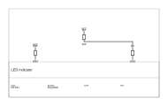

A [code-defined schematic](ecad-schematics.md) is a graph — components, pins, nets. The
**drawn sheet** is the human-readable VIEW of that graph: placed symbols, orthogonal wires
between connected pins, junction dots, net labels, reference designators and values, a border
and a title block, written to **SVG / DXF / PDF**. It replaces `Netlist.ToText()` as the way
to look at a schematic.

## The one rule: the sheet is DERIVED, so it cannot disagree with the netlist

A `SchematicDrawing` is a deterministic FUNCTION of the graph and the placement — the same
schematic and the same placement produce byte-identical SVG. It is never a second editable
thing, so it cannot omit a connection the netlist has, nor invent one it does not. That is why
the drawing carries its own `Verify()`: the connectivity is *reconstructed from the drawn
primitives* (the wire segments, the pin anchors, the net labels) and checked against the
graph.

## A small sheet

The LED indicator — a battery, a current-limiting resistor and an LED — with each part's 2D
`Symbol` and a hand-placed position on the sheet:

```csharp svg:ecad-schematic-sheet
// A 2-pin passive part with a box symbol (pin at the top, pin at the bottom).
PartDefinition Passive(string name, string prefix,
    (string N, string Nm, PinType T) top, (string N, string Nm, PinType T) bot)
{
    var symbol = new Symbol(name,
    [
        new SymbolPin(top.N, top.Nm, new Vector2d(0, 5.08), SymbolPinDirection.Down, 2.54, top.T),
        new SymbolPin(bot.N, bot.Nm, new Vector2d(0, -5.08), SymbolPinDirection.Up, 2.54, bot.T),
    ],
    [new SymbolRectangle(new Vector2d(-1.4, -2.8), new Vector2d(1.4, 2.8))]);
    return new PartDefinition(name, prefix,
        [new Pin(top.N, top.Nm, top.T), new Pin(bot.N, bot.Nm, bot.T)], symbol: symbol);
}

var resistor = Passive("R_0805", "R", ("1", "", PinType.Passive), ("2", "", PinType.Passive));
var led      = Passive("LED_3MM", "D", ("A", "anode", PinType.Passive), ("K", "cathode", PinType.Passive));
var battery  = Passive("BATT", "BT", ("+", "V+", PinType.Power), ("-", "V-", PinType.Ground));

// The schematic (the graph).
var sch = new Schematic("LED indicator");
var bt = sch.Add("BT1", battery);
var r  = sch.Add("R1", resistor, value: "330");
var d  = sch.Add("D1", led);
sch.Connect("VCC",   bt.Pin("+"), r.Pin("1"));
sch.Connect("LED_A", r.Pin("2"),  d.Pin("A"));
sch.Connect("GND",   d.Pin("K"),  bt.Pin("-"));

// Place the symbols by hand (v1 does not invent a good layout).
var placement = new SchematicPlacement()
    .Place("BT1", new Vector2d(40, 60))
    .Place("R1",  new Vector2d(95, 78))
    .Place("D1",  new Vector2d(150, 60));

var sheet = new SchematicSheet(sch, placement,
    format: SheetFormat.Custom("A6", 190, 120),
    title: new TitleBlock { Title = "LED indicator", DrawingNumber = "EX-001", Author = "EngrCAD" });

var svg = sheet.Draw().ToSvg();
```



`VCC` and `GND` are power/ground rails, so each is drawn as a **label** at its pins rather than
one long wire (a `GND` rail is not one wire across the sheet). `LED_A` is an ordinary signal
net, drawn as an orthogonal **wire** from R1.2 to D1.A.

The border and title block come from the same `DrawingFrame` the [mechanical drawing
sheet](drawings.md#the-shared-frame) draws — one shared value type, so a schematic and a
mechanical drawing of one project cannot look inconsistent. A schematic configures its own
two-band title block (no scale, no projection angle) on the ECAD schematic layers; that is the
only thing that differs. The frame's opt-in `FrameStandards` (the ISO 5457 zone grid and
centring marks) reach a schematic sheet too, via the `standards:` constructor argument.

## The verification: the drawing joins exactly the pins the netlist connects

`SchematicDrawing.Verify()` asserts the bar in both directions — no connection omitted, none
invented — reading the drawn primitives, not the router's bookkeeping:

```csharp run:ecad-schematic-verify
PartDefinition Passive(string name, string prefix,
    (string N, string Nm, PinType T) top, (string N, string Nm, PinType T) bot)
{
    var symbol = new Symbol(name,
    [
        new SymbolPin(top.N, top.Nm, new Vector2d(0, 5.08), SymbolPinDirection.Down, 2.54, top.T),
        new SymbolPin(bot.N, bot.Nm, new Vector2d(0, -5.08), SymbolPinDirection.Up, 2.54, bot.T),
    ], [new SymbolRectangle(new Vector2d(-1.4, -2.8), new Vector2d(1.4, 2.8))]);
    return new PartDefinition(name, prefix,
        [new Pin(top.N, top.Nm, top.T), new Pin(bot.N, bot.Nm, bot.T)], symbol: symbol);
}
var resistor = Passive("R", "R", ("1", "", PinType.Passive), ("2", "", PinType.Passive));
var led      = Passive("D", "D", ("A", "", PinType.Passive), ("K", "", PinType.Passive));
var battery  = Passive("BT", "BT", ("+", "", PinType.Power), ("-", "", PinType.Ground));

var sch = new Schematic("LED indicator");
var bt = sch.Add("BT1", battery);
var r  = sch.Add("R1", resistor, value: "330");
var d  = sch.Add("D1", led);
sch.Connect("VCC",   bt.Pin("+"), r.Pin("1"));
sch.Connect("LED_A", r.Pin("2"),  d.Pin("A"));
sch.Connect("GND",   d.Pin("K"),  bt.Pin("-"));

var drawing = new SchematicSheet(sch, SchematicPlacement.Grid(sch)).Draw();
var c = drawing.Connectivity;

// Each net's two pins are JOINED — VCC/GND by a shared label, LED_A by a wire.
if (!c.AreJoined(bt.Pin("+"), r.Pin("1"))) throw new Exception("VCC not joined");
if (!c.AreJoined(r.Pin("2"),  d.Pin("A"))) throw new Exception("LED_A not joined");
if (!c.AreJoined(d.Pin("K"),  bt.Pin("-"))) throw new Exception("GND not joined");

var report = drawing.Verify();
if (!report.Ok) throw new Exception(report.ToString());

// The sheet is a deterministic function of the graph.
if (new SchematicSheet(sch, SchematicPlacement.Grid(sch)).Draw().ToSvg() != drawing.ToSvg())
    throw new Exception("the sheet is not deterministic");

// Write all three formats.
drawing.SaveSvg(Path.Combine(Scratch, "led.svg"));
drawing.SaveDxf(Path.Combine(Scratch, "led.dxf"));
drawing.SavePdf(Path.Combine(Scratch, "led.pdf"));
```

## Placement — hand-placed in v1

Positions are given by a `SchematicPlacement`: `Place(refdes, position, quarterTurns, mirror)`
sets a symbol's origin (sheet millimetres), an orthogonal rotation (90° steps — the schematic
convention) and an optional mirror. A quarter turn is an exact sign swap, so a pin's world
anchor coincides with its wire endpoint to the bit.

A **multi-unit part** — a dual op-amp, whose package is drawn as separate amplifier symbols —
places each **unit** at its own location with `Place(refdes, unit, position, …)` (1-based unit
number); the sheet draws each unit as its own symbol, labelled `U1A` / `U1B` / …, and a net between
two units of one package draws as two symbols wired together. The connectivity is reconstructed
from the drawn wire geometry, so it does not care how the part is split into units. A single-unit
part uses the plain `Place(refdes, position, …)` (unit 1) and draws exactly as before; a multi-unit
part with any unit left unplaced is refused by name.

`SchematicPlacement.Grid(schematic, format)` is a deterministic grid **placeholder**, clearly
labelled as such — enough to see a schematic at all (it places every unit of every part). A real
auto-placer that produces a *good* layout is its own problem and is deliberately not attempted.

## Wires, junctions and labels

- **Wires** are orthogonal (Manhattan): two pins take an L, three or more a horizontal trunk
  at the pins' median height with a vertical stub from each pin. It is a small SCHEMATIC
  router — no layers, no clearance — and it may cross a symbol or another net (a crossing is
  not a connection); an obstacle-avoiding route is a separate problem.
- **Junction dots** mark points where three or more wires meet (a T or a cross). Two nets
  passing over one another mid-segment are NOT a junction — wires join only where a dot says
  so, the schematic convention.
- **Net labels** carry a net drawn as labels rather than wires. A net is labelled when it is a
  power/ground rail — any pin typed `Power` or `Ground`, or a recognised rail name
  (`VCC`, `GND`, `+3V3`, …) — **or** when its pin count passes the fanout threshold (default
  4). Both are configurable on `SchematicSheetOptions`.

## Buses — a caller-declared bundle

A **bus** is a labelled bundle of signal nets, drawn as a **thick** wire with diagonal **entry**
stubs ripping members off it and a bus-vector label `NAME[m..n]` (KiCad's notation — member
`NAME`+i, so `DATA[0..3]` is `DATA0`…`DATA3`, and a reversed `DATA[3..0]` the same four in the
drawn direction). It is **DRAWING SUGAR**: the members are the signal wires' *own* labels, so
the bus draws a bundle but **connects nothing** — its line-work is deliberately kept out of the
wire graph, so a bus wire crossing two member wires can never merge their nets, and
`Verify()` is unaffected.

A bus is **caller-declared, never auto-routed** — you give the bus wire polyline and the entry
stubs, exactly as a `SchematicPlacement` gives symbol poses. Pass a `SchematicBus` (or several)
to the sheet with `buses:`:

```csharp svg:ecad-schematic-sheet-bus
// A 4-pin IC with four passive data pins on its left edge (D0..D3, pin numbers 1..4).
PartDefinition BusIc(string name)
{
    var symbol = new Symbol(name,
    [
        new SymbolPin("1", "D0", new Vector2d(-7.62, 3.81), SymbolPinDirection.Right, 2.54, PinType.Passive),
        new SymbolPin("2", "D1", new Vector2d(-7.62, 1.27), SymbolPinDirection.Right, 2.54, PinType.Passive),
        new SymbolPin("3", "D2", new Vector2d(-7.62, -1.27), SymbolPinDirection.Right, 2.54, PinType.Passive),
        new SymbolPin("4", "D3", new Vector2d(-7.62, -3.81), SymbolPinDirection.Right, 2.54, PinType.Passive),
    ],
    [new SymbolRectangle(new Vector2d(-5.08, -5.08), new Vector2d(5.08, 5.08))]);
    return new PartDefinition(name, "U",
    [
        new Pin("1", "D0", PinType.Passive), new Pin("2", "D1", PinType.Passive),
        new Pin("3", "D2", PinType.Passive), new Pin("4", "D3", PinType.Passive),
    ], symbol: symbol);
}

// Two ICs, wired member-by-member over a 4-bit bus DATA0..DATA3. Each member is an ordinary
// 2-pin signal wire — the bus does NOT connect them, the member nets do.
var sch = new Schematic("data bus");
var u1 = sch.Add("U1", BusIc("SRC"));
var u2 = sch.Add("U2", BusIc("DST"));
for (int i = 0; i < 4; i++)
    sch.Connect($"DATA{i}", u1.Pin($"{i + 1}"), u2.Pin($"{i + 1}"));

var placement = new SchematicPlacement()
    .Place("U1", new Vector2d(40, 55))
    .Place("U2", new Vector2d(120, 55));

// Declare the bus: a thick vertical bundle wire between the two ICs, a 45° entry ripping each
// member off it, and the DATA[0..3] vector label. Caller-placed — never auto-routed.
double busX = 80;
var entries = new List<SchematicBusEntry>();
for (int i = 0; i < 4; i++)
{
    double y = 47 + i * 5;
    entries.Add(new SchematicBusEntry(new Vector2d(busX, y), new Vector2d(busX + 2.54, y + 2.54)));
}
var bus = new SchematicBus("DATA", 0, 3,
    [new Vector2d(busX, 40), new Vector2d(busX, 78)], entries,
    labelPosition: new Vector2d(busX, 80), labelAnchor: SheetTextAnchor.Center);

var sheet = new SchematicSheet(sch, placement,
    format: SheetFormat.Custom("A6", 170, 110),
    title: new TitleBlock { Title = "Data bus", DrawingNumber = "EX-002", Author = "EngrCAD" },
    buses: [bus]);

var svg = sheet.Draw().ToSvg();
```

![A schematic sheet with a DATA[0..3] bus](images/ecad-schematic-sheet-bus.svg)

The bus reads off the drawing as `drawing.Buses` — each a `DrawnBus` with the base `Name`, the
expanded `Members` (`DATA0`…`DATA3`), the `Path` (the thick wire), the `Entries` (the diagonal
stubs) and the vector `Label`. Because none of it is in the wire graph, the drawing with the bus
reconstructs **exactly the same nets** as the same sheet drawn with plain labelled wires — the
member nets do the connecting, the bus is only how they are drawn as a bundle. The bus-wire pen
width is `SchematicSheetOptions.BusWireWidth` (default 0.8 mm, wider than a wire's 0.5 mm).

> Bus **groups** (`{…}` aliases) and buses **across sheets** are not modelled — one sheet's bus
> is a member namespace whose taps carry their own labels, which is all a bus needs to draw.

## Refused, by name

- A component with **no symbol** cannot be drawn (attach one, e.g. imported from KiCad by
  [`ComponentLibrary`](ecad-library.md)).
- A net that connects a **pin the symbol does not draw** — the symbol and the netlist
  disagreeing about the part's pins (a [`PinIdentity`](ecad-library.md) failure).
- A component the **placement does not cover** (or pass a null placement to grid-place all).

## See also

- [Code-defined schematics](ecad-schematics.md) — the graph this draws.
- [Loading a component](ecad-library.md) — where symbols come from (KiCad `.kicad_sym`).
- [Engineering drawings](drawings.md) — the mechanical-drawing sheet the SVG/DXF/PDF
  writers are shared with.
