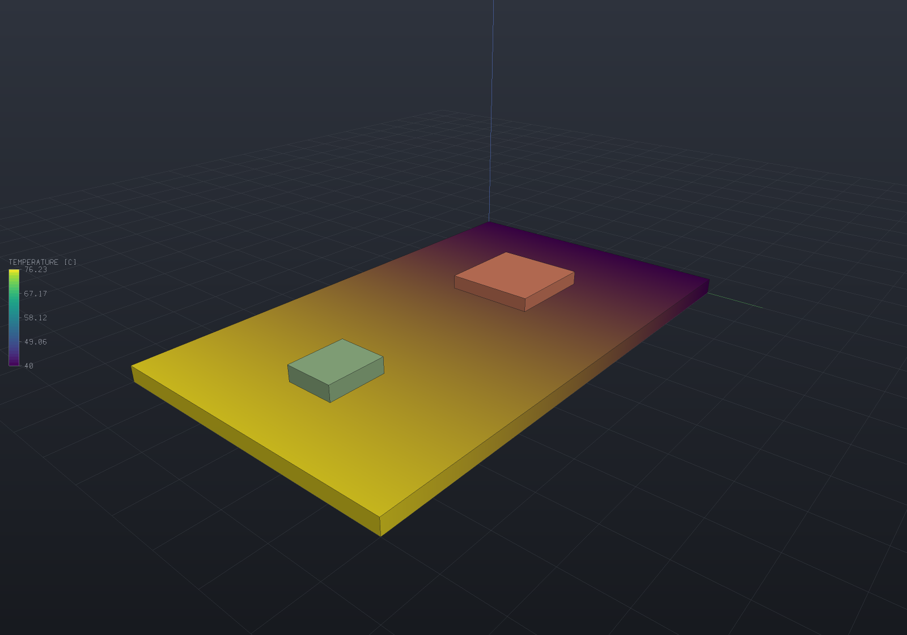

Where does the heat go? A powered board is a heat-conduction problem, and `PcbThermal` solves it
on the **landed [FEA thermal solver](fea-thermal.md)** — not a lumped estimate — so its answers
are verifiable against closed forms. Each component's dissipation becomes a volumetric heat source
in the board; the copper spreads it sideways; a cold edge or a convecting face carries it away; and
the result is a temperature field the [viewer's colour map](fields.md) picks up with no extra
wiring, plus a hot-spot temperature per component.

## The model: an effective conductivity over a slab

A board is a copper–dielectric sandwich, and v1 uses the standard **board-level model**: the copper
is not meshed as discrete traces and planes, it is *smeared* into an effective conductivity over a
homogeneous slab. The mixing rule is the physics of the sandwich:

- **In-plane** the copper layers are PARALLEL heat paths, so the effective conductivity is the
  area-fraction rule of mixtures, `k_in = f·k_Cu + (1 − f)·k_FR4`.
- **Through-thickness** the layers are in SERIES, so it is the harmonic mean,
  `k_th = 1 / (f/k_Cu + (1 − f)/k_FR4)`.

`f` is the copper VOLUME fraction — (total copper thickness × average coverage) / board thickness —
the one honest knob. A bare board (`f = 0`) collapses both to the dielectric's own conductivity (an
isotropic slab). This is the standard model because it needs no conforming multi-material mesh; a
future stage can refine it by meshing the copper explicitly.

## A powered board

A small board with a hot regulator and a warm microcontroller, edge-clamped to a chassis and
cooling through its faces:

```csharp run:ecad-thermal-solve
var mcu = new PartDefinition("MCU", "U", new[] { new Pin("1", PinType.Passive) },
    new Footprint("qfp", new[] { new Pad("1", new Vector2d(0, 0), 7, 7, PadShape.Rectangular) }));
var reg = new PartDefinition("REG", "U", new[] { new Pin("1", PinType.Passive) },
    new Footprint("sot", new[] { new Pad("1", new Vector2d(0, 0), 4, 4, PadShape.Rectangular) }));

var sch = new Schematic("gadget");
sch.Add("U1", mcu);
sch.Add("U2", reg);

var board = new PcbBoard(
    new[] { new Vector2d(0, 0), new Vector2d(50, 0), new Vector2d(50, 30), new Vector2d(0, 30) },
    thickness: 1.6);
var layout = new PcbLayout(sch, board);
layout.Place("U1", 15, 15);   // the MCU, mid-board
layout.Place("U2", 40, 15);   // the regulator, out near the far edge

var spec = new PcbThermalSpec
{
    // A modest ground-plane fraction: two 35 um layers at ~55% average coverage.
    CopperFraction = 2 * 0.035 * 0.55 / 1.6,
    ComponentPower = new Dictionary<string, double> { ["U1"] = 0.4, ["U2"] = 1.2 },   // watts
    Boundaries = new[]
    {
        // The −X edge clamps to a 40 C chassis rail; the faces convect to 40 C air.
        PcbThermalBoundary.FixedTemperature("chassis",
            Facets.OnPlane(new Vector3d(0, 0, 0), Vector3d.UnitX), 40),
        PcbThermalBoundary.Convection(BoardSurface.Top, 15, 40),
        PcbThermalBoundary.Convection(BoardSurface.Bottom, 15, 40),
    },
};

var result = PcbThermal.Solve(layout, spec);
Console.WriteLine(result);   // temperature range, effective conductivities, applied watts
foreach (var (reference, temp) in result.ComponentTemperature)
    Console.WriteLine($"  {reference} hot-spot: {temp:g5} C");

// The regulator dissipates 3x the MCU and sits further from the cold rail, so it runs hotter.
if (result.TemperatureOf("U2") <= result.TemperatureOf("U1"))
    throw new Exception("the regulator should be the hot spot");
```

`result` is a `PcbThermalResult`: the board's `PeakTemperature` / `MinTemperature`, a
`ComponentTemperature` map (each component's hot-spot — the peak under its footprint), the effective
`ConductivityInPlane` / `ConductivityThrough`, and the underlying FEA `ThermalResults.Fea` (heat
flux, `.vtu` export, the solve report). Power is stated in **watts** — the domain's universal unit —
and converted once to the model's milliwatt; a convection film coefficient is stated in
**W/(m²·K)** (natural air ~10, a fan ~50).

## Seeing it

The board coloured by temperature, the two sources standing on it:

```csharp render:ecad-thermal-board
var mcu = new PartDefinition("MCU", "U", new[] { new Pin("1", PinType.Passive) },
    new Footprint("qfp", new[] { new Pad("1", new Vector2d(0, 0), 7, 7, PadShape.Rectangular) }),
    body: () => Shape.Box(9, 9, 1.4).Translate(0, 0, 0.7));
var reg = new PartDefinition("REG", "U", new[] { new Pin("1", PinType.Passive) },
    new Footprint("sot", new[] { new Pad("1", new Vector2d(0, 0), 4, 4, PadShape.Rectangular) }),
    body: () => Shape.Box(6, 5, 1.6).Translate(0, 0, 0.8));

var sch = new Schematic("gadget");
sch.Add("U1", mcu);
sch.Add("U2", reg);

var board = new PcbBoard(
    new[] { new Vector2d(0, 0), new Vector2d(50, 0), new Vector2d(50, 30), new Vector2d(0, 30) },
    thickness: 1.6);
var layout = new PcbLayout(sch, board);
layout.Place("U1", 15, 15);
layout.Place("U2", 40, 15);

var spec = new PcbThermalSpec
{
    CopperFraction = 2 * 0.035 * 0.55 / 1.6,
    ComponentPower = new Dictionary<string, double> { ["U1"] = 0.4, ["U2"] = 1.2 },
    Boundaries = new[]
    {
        PcbThermalBoundary.FixedTemperature("chassis",
            Facets.OnPlane(new Vector3d(0, 0, 0), Vector3d.UnitX), 40),
        PcbThermalBoundary.Convection(BoardSurface.Top, 15, 40),
        PcbThermalBoundary.Convection(BoardSurface.Bottom, 15, 40),
    },
};
var result = PcbThermal.Solve(layout, spec);

// The board part, coloured by the sampled temperature field.
var boardPart = new Part("board", board.Plate());
foreach (var field in result.SampleOnto(boardPart.GetMesh()))
    boardPart.AddResult(field);
boardPart.FieldDisplay = new FieldDisplay { Field = ThermalResults.FieldNames.Temperature };

var assembly = new Assembly("thermal");
assembly.Add(boardPart, layout.BoardFrame, "board");
foreach (var placement in layout.Placements)
{
    var definition = layout.Schematic.Find(placement.Reference).Definition;
    if (definition.Body is null) continue;
    var part = new Part(placement.Reference, definition.Body())
    {
        Transform = PcbLayout.PartTransform(placement.Side),
    };
    assembly.Add(part, layout.OccurrenceFrame(placement), placement.Reference);
}

var scene = new Scene();
scene.AddTab("Thermal").Add(assembly);
```



The dark band is the clamped 40 °C edge; the board warms toward the regulator, whose footprint is
the peak. The copper plane smears the two sources into one smooth field.

## Verified against closed forms

An ECAD thermal answer fails plausibly, so the module is held against analytic conduction rather
than against a picture (the FEA house style):

- **A uniformly-dissipating board** to a fixed cold edge settles into the parabola
  `T(x) = T0 + (q/2k)(L² − x²)` — which lives in the quadratic element space, so the solve
  reproduces it to **3e-12 relative** (round-off). The stated watts come out as exactly `P × 1000`
  mW of applied heat (the units check).
- **A single hot component** past a cold edge carries all its power as a constant flux, so the
  far-field profile is the series-resistance line `T = T0 + Q(L − x)/(kA)`, matched to **3.6e-5**
  (the 3D discretization of a localized source), with the energy balance — all the generated heat
  leaves the cold edge — exact to round-off.
- **Copper raises spreading.** The same 0.3 W source over real FR4 (k = 0.3) versus FR4 with 2.6 %
  copper lifts the effective in-plane conductivity from 0.3 to 10.4 and drops the peak rise
  **1129 K → 32.6 K (34.7× lower)**; the far-field rise ratio is exactly `k_copper / k_bare`.
- A board with **no boundary condition** is an undriven conduction problem, refused by name (the
  `ThermalSolver` convention); a **zero-power** board is isothermal at its held temperature exactly;
  and a solve is deterministic to the bit.

## Not in v1

Filed as later stages, each with its own oracle:

- **Transient** board warm-up — the [`SolveTransient`](fea-thermal.md#transient-conduction) path exists, so it
  is a bounded follow-on with its own erfc-style oracle; the effective slab already carries a
  volume-weighted heat capacity.
- **Thermal vias** as discrete high-conductivity paths — v1's effective conductivity smears the
  copper, so it smears the vias too.
- **Airflow / CFD** convection — v1 takes a stated film coefficient, not a flow field.
- **Detailed die/package** thermal models — v1 spreads a component's power uniformly over its
  footprint volume, not through a junction-to-case network.
