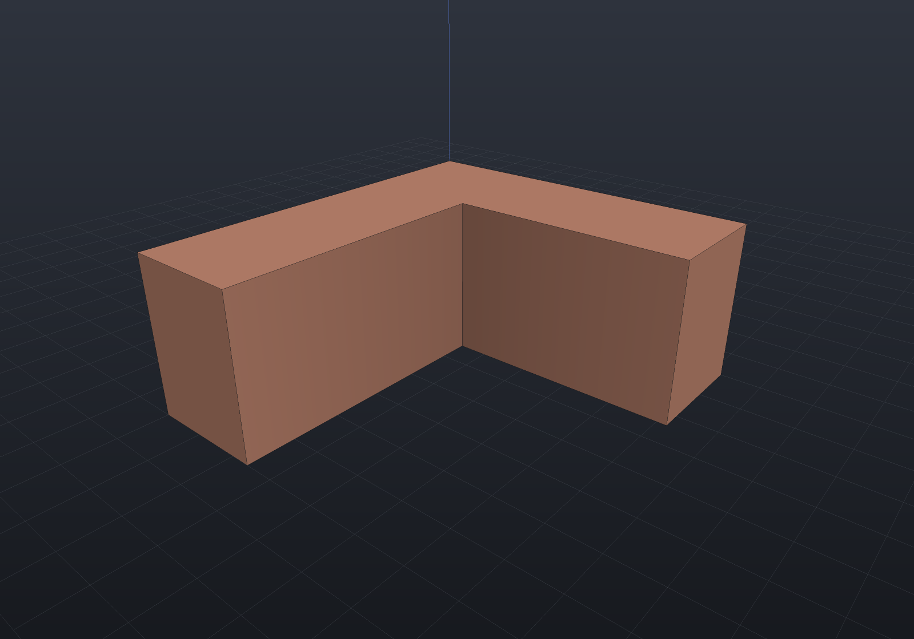
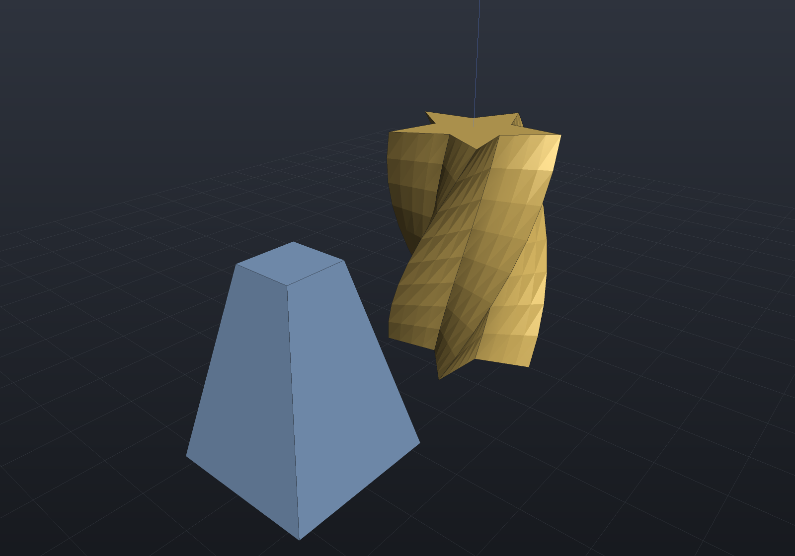
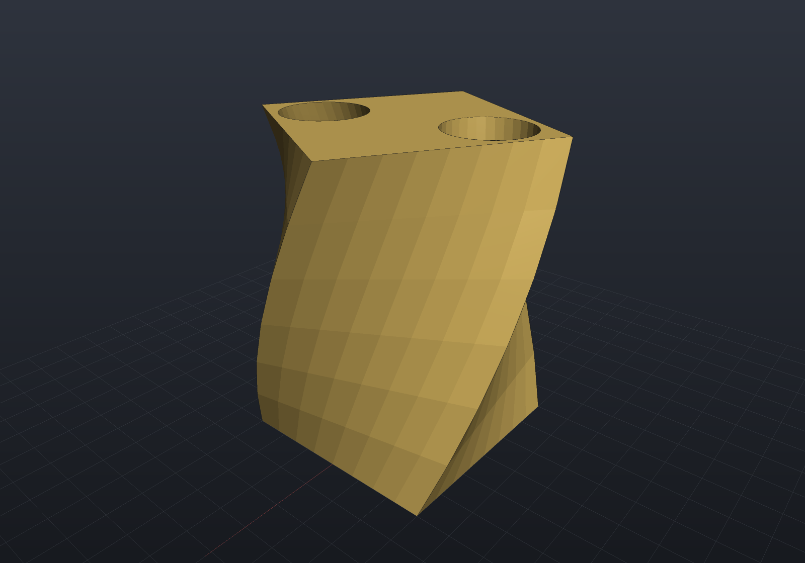
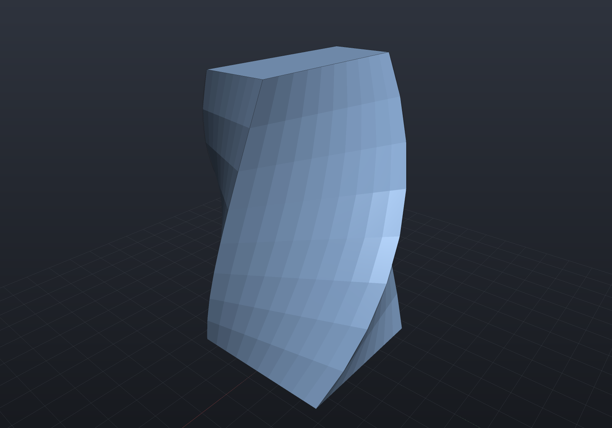
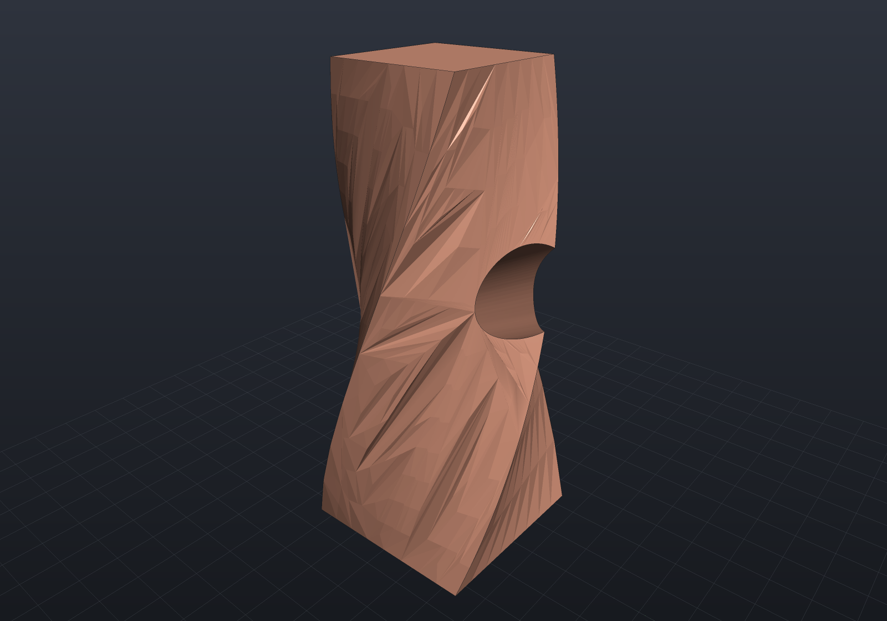
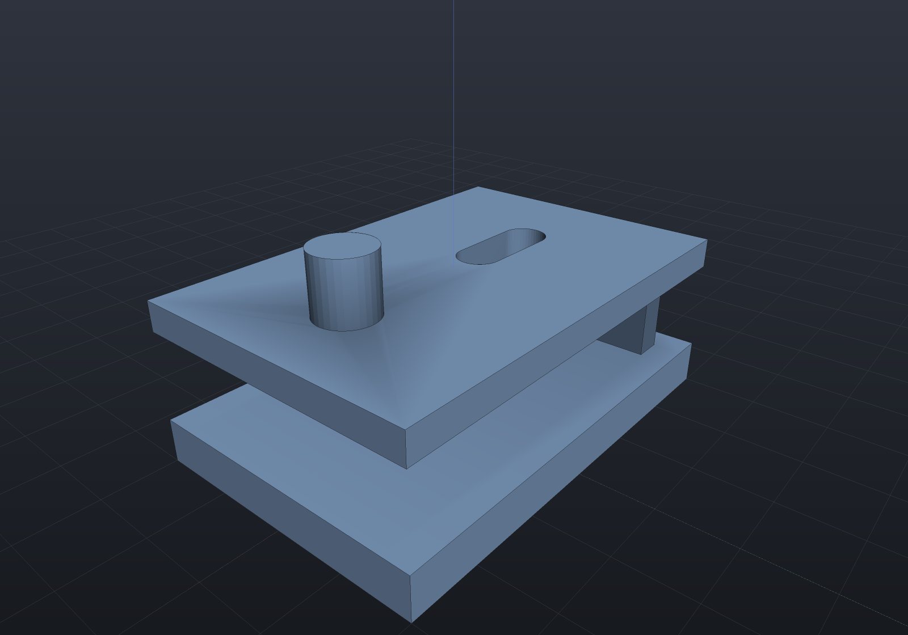
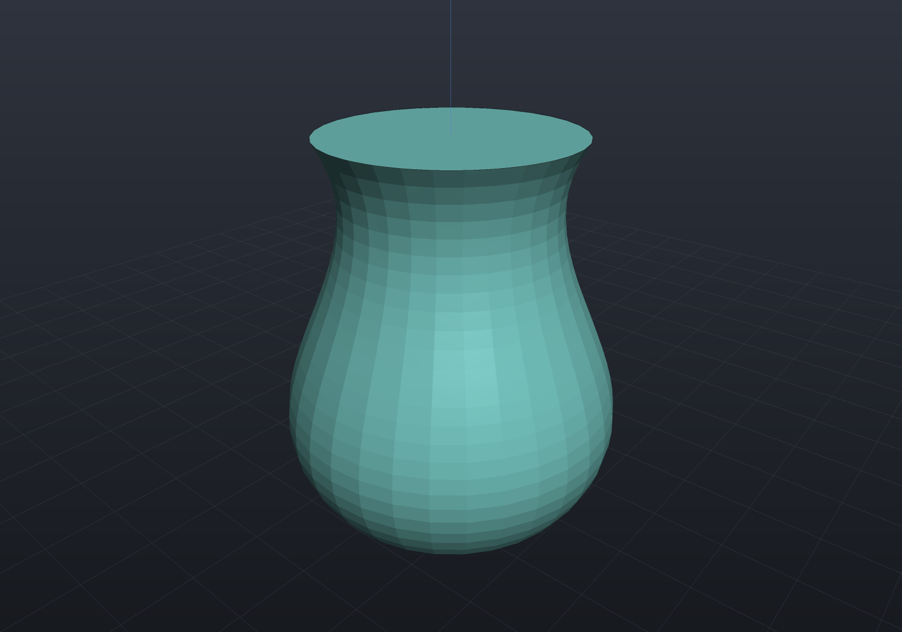
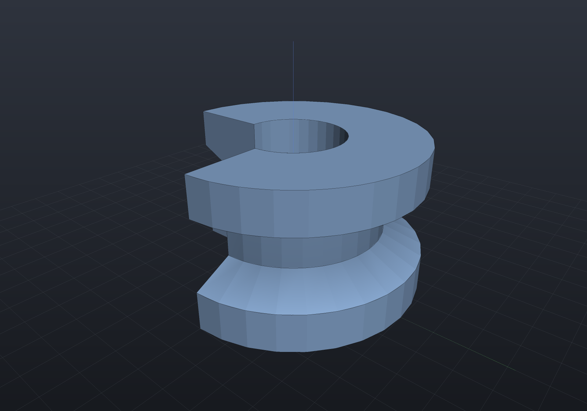
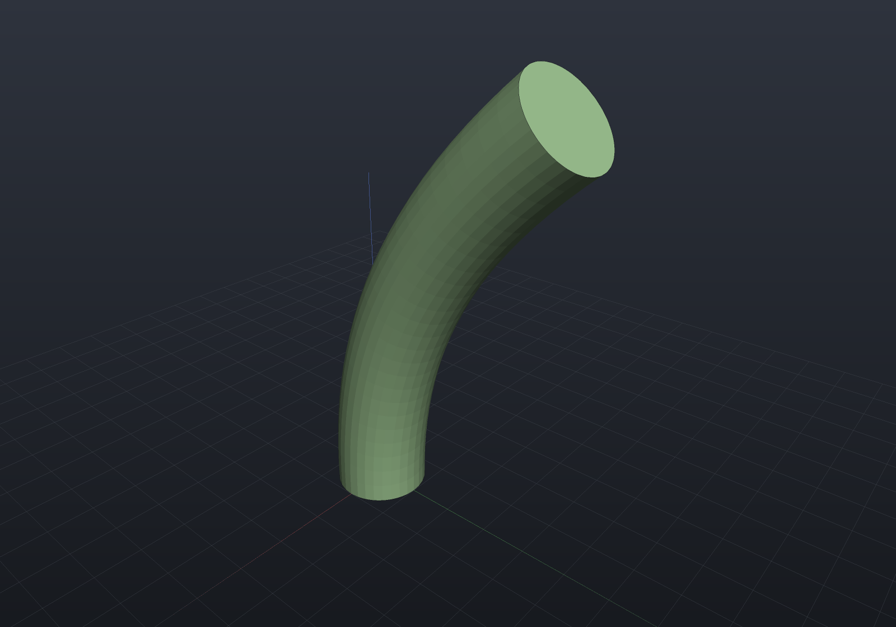

The three sketch-consuming operations turn 2D profiles into solids. All are native in
every representation (see [the support matrix](representations.md)).

## Extrude

`Shape.Extrude(sketch, height, plane?)` extrudes along the plane normal (default:
world XY, so height is +Z):

```csharp render:extrude
var bracket = Sketch.Start(0, 0)
    .LineTo(40, 0).LineTo(40, 12).LineTo(12, 12).LineTo(12, 36).LineTo(0, 36)
    .Close();

var scene = new Scene();
scene.Add(new Part("L-bracket", Shape.Extrude(bracket, 16), Palette.Copper));
```



### Twist and taper

`Shape.Extrude(sketch, height, twist, scale, plane?, slices?)` is OpenSCAD's
`linear_extrude(twist, scale, slices)`: the cross-section at height fraction `t` is
the sketch scaled by `lerp(1, scale, t)` (per axis, about the plane origin) and
rotated by `twist·t` about the plane normal — radians, counter-clockwise (OpenSCAD's
`twist` is the opposite sign). A call with zero twist and unit scale is exactly the
plain extrusion:

```csharp render:extrude-twist
var star = Sketch.Polygon(Enumerable.Range(0, 10)
    .Select(i =>
    {
        double a = Math.PI / 2 + i * Math.PI / 5;
        double r = i % 2 == 0 ? 14.0 : 6.5;
        return new Vector2d(r * Math.Cos(a), r * Math.Sin(a));
    }).ToList());

var scene = new Scene();
scene.Add(new Part("twisted star", Shape.Extrude(star, 40, twist: Math.PI / 2), Palette.Brass));
scene.Add(new Part("tapered boss",
    Shape.Extrude(Sketch.Rectangle(24, 24), 30, twist: 0, scale: 0.4).Translate(40, 0, 0),
    Palette.Steel));
```



**Both cases are B-Rep-Native**, and each for its own reason:

- A **pure taper** (`twist: 0`) is a ruled loft — every straight side sweeps an exact
  plane through the scaling centre, so the solid is the skin between the base section
  and the scaled top, holes included.
- A **twist** has an exact analytic side surface too. `TwistedSurface` is
  `P(u, v) = R_z(theta*v) . diag(lerp(1, sx, v), lerp(1, sy, v)) . C(u) + h*v*zhat`:
  one surface per profile segment, with both partials in closed form, so the twisted
  body carries the same guarantees every other exact solid does — `Validate()` passes,
  it survives booleans, it archives losslessly, and its volume converges quadratically.

`slices` sizes the direct section sweep, which is now reached only where the B-Rep
cannot lower — `ToMesh` takes the highest-fidelity route available, so a twisted body
tessellates its exact solid and a 2-slice call and a 64-slice one produce the *same*
mesh. `Explain(target)` reports each case.

The volume is the identity that says the surface is right. Every section of a twisted
prism is the base section *rotated*, and a rotation preserves area — so a pure twist
encloses **exactly** the untwisted volume `A*h`, whatever the twist angle. A linear
taper multiplies it by the prismatoid factor `(1 + s + s^2)/3`, and a per-axis taper by
`(2 + sx + sy + 2*sx*sy)/6`, which reduces to the frustum factor at `sx == sy`. Measured
on a 20x20 square twisted a quarter turn over 40 (win-x64, 128 segments per circle):
16000.000584 against 16000 for the pure twist, and 3.8e-8 to 5.4e-8 relative for the
tapered cases — the grade of reading a volume off the tessellation, not of the geometry.

### A twisted profile with holes

A hole twists about the **same axis** as the outline, so its inner skin is one more
twisted surface per hole segment and nothing about the construction changes:

```csharp render:extrude-twist-holes
var plate = Sketch.Rectangle(30, 30)
    .WithHole(Sketch.Circle(new Vector2d(8, 8), 6))
    .WithHole(Sketch.Circle(new Vector2d(-8, -8), 6));

var scene = new Scene();
scene.Add(new Part("twisted plate", Shape.Extrude(plate, 45, twist: Math.PI / 3), Palette.Brass));
```



### Twist and taper together

The two compose — the section at height fraction `t` is scaled per axis *and* rotated,
so an anisotropic taper is an ordinary case rather than a third parameter:

```csharp render:extrude-twist-taper
var scene = new Scene();
scene.Add(new Part("square to slot",
    Shape.Extrude(Sketch.Rectangle(26, 26), 50, twist: Math.PI / 2, scale: (0.4, 1.1)),
    Palette.Steel));
```



### What being exact buys: booleans on a twisted body

This is the figure the mesh route could not produce. A cross-hole through a twisted,
tapered column is an ordinary exact B-Rep boolean — the tool's cylinder meets each
twisted band transversally, the bore rim is a real edge, and the result passes
`Validate()`:

```csharp render:extrude-twist-boolean
var column = Shape.Extrude(Sketch.Rectangle(24, 24), 60, twist: Math.PI / 2, scale: 0.7);
var bore = Shape.Cylinder(5, 60).Rotate(Vector3d.UnitX, 90).Translate(0, 0, 30);

var scene = new Scene();
scene.Add(new Part("bored column", column - bore, Palette.Copper));
```



Refused by name rather than approximated: a **STEP export** of a twisted body (the
format has no entity for the surface — the swept bucket, alongside helical threads and
lofts; `BrepArchive` round-trips it losslessly instead), and a **sheared or
non-uniformly scaled placement** (it would change the section family, so it is not a
re-placement at all). Rim features refuse on a twisted side face for the reason they
always do — a straight rim edge needs planar neighbours.

## Extrude and cut *until* a face

`ExtrudeUntil` (boss) and `CutUntil` (pocket) stop against the body instead of at a
typed depth — build123d/CadQuery's `until=NEXT/LAST`. `Until.Next` stops at the first
surface met (a boss lands on the body; a cut punches through the first wall and stops
in the void behind it); `Until.Last` continues to the far boundary (flush boss;
through-all cut with the standard overshoot). Both extrude from the sketch plane
along −normal, the `Drill` convention:

```csharp render:extrude-until
// A base plate with a shelf floating above it (one body, a void between).
var body = Shape.Extrude(Sketch.Rectangle(60, 40), 6)
         | (Shape.Extrude(Sketch.Rectangle(60, 40), 4).Translate(0, 0, 18)
            | Shape.Box(4, 32, 16).Translate(-24, 0, 12));

var above = SketchPlane.At((0, 0, 30), Vector3d.UnitX, Vector3d.UnitY);

// A post that grows DOWN from z=30 until it lands on the shelf (Until.Next)...
var withPost = body.ExtrudeUntil(Sketch.Circle(new Vector2d(18, 0), 4), above, Until.Next);
// ...and a slot cut down through the shelf that stops in the void (Until.Next),
// leaving the base plate untouched.
var slotPlane = SketchPlane.At((-10, 0, 30), Vector3d.UnitX, Vector3d.UnitY);
var finished = withPost.CutUntil(Sketch.Slot(16, 6), slotPlane, Until.Next);

var scene = new Scene();
scene.Add(new Part("until-features", finished, Palette.Steel));
```



The stop is found by probe rays from the profile's interior against the body's mesh,
and it must be **one plane perpendicular to the extrusion** — a flat extrusion cannot
honestly conform to a curved or slanted stop, so anything ambiguous refuses loudly
naming the candidates: hit-distance clusters with their ray counts for a curved stop,
the number of rays that missed for an overhanging profile, the probe point that saw a
tangent graze. Resolution is **eager** (measured at the call, like `Resized`) — wrap
the call in a `Feature` to re-measure per regeneration. Overshoots follow the `Drill`
lessons so booleans never see coplanar faces: a `Next` boss reaches slightly *into*
the body, a `Next` cut slightly into the void behind the wall, a `Last` cut through
the far face; only a `Last` boss ends exactly flush (its union is a coplanar boolean
where material adjoins — the B-Rep lowering may refuse it, mesh/implicit handle it).

## Revolve

`Shape.Revolve(sketch, angle?, plane?)` spins the sketch about its plane's y axis;
sketch x is the radial direction (must be ≥ 0). The default plane (XZ) puts the axis
on world Z. Sketches may **touch the axis** on full turns — on-axis stretches revolve
to nothing and their endpoints become poles, which is how vases, domes, and spheres
close up in all three representations:

```csharp render:revolve-vase
var vaseProfile = Sketch.Start(0, 0)
    .LineTo(10, 0)                                    // base disc (touches the axis)
    .BezierTo(new(17, 9), new(3.5, 17), new(9, 26))   // curved wall
    .LineTo(0, 26)                                    // rim back to the axis
    .Close();

var scene = new Scene();
scene.Add(new Part("vase", Shape.Revolve(vaseProfile), Palette.Teal));
```



Partial revolves (`angle < 2π`) need axis clearance and are rejected at construction
when the sketch touches the axis:

```csharp render:revolve-partial
var section = Sketch.Start(8, 0)
    .LineTo(20, 0).LineTo(20, 6).LineTo(14, 9).LineTo(14, 14).LineTo(20, 17)
    .LineTo(20, 23).LineTo(8, 23)
    .Close();

var scene = new Scene();
scene.Add(new Part("pulley section", Shape.Revolve(section, angle: 1.5 * Math.PI),
    Palette.Steel));
```



## Sweep

`Shape.Sweep(sketch, path, plane?)` sweeps the profile along a 3D curve using
rotation-minimizing frames. The sketch plane must sit at the path start,
perpendicular to its tangent:

```csharp render:sweep
// A quadratic NURBS path rising along +Z then bending toward +Y;
// it starts at the origin with tangent +Z, matching the default XY sketch plane.
var path = new NurbsCurve(2,
    [(0, 0, 0), (0, 0, 26), (0, 22, 44)], null,
    [0, 0, 0, 1, 1, 1]);

var scene = new Scene();
scene.Add(new Part("swept tube", Shape.Sweep(Sketch.Circle(5), path), Palette.Sage));
```



Profile-based overloads (`Shape.Extrude(Profile, direction, holes?)`,
`Shape.Revolve(Profile, axisOrigin, axisDirection, angle?, holes?)`,
`Shape.Sweep(Profile, path, holes?)`) expose the lower-level B-Rep factory directly —
including sheared extrusions and pipe elbows from closed profiles.
