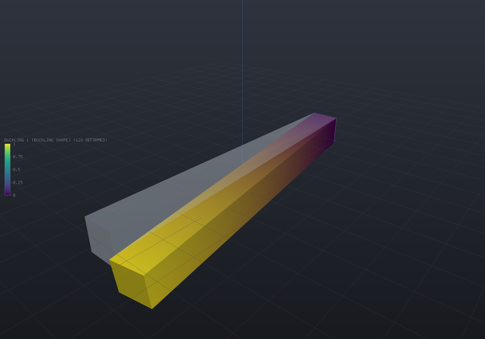

# Buckling, damping and frequency response

A slender part under compression can fail long before its material yields: it goes unstable
and folds sideways. `EngrCAD.Fea` finds the load at which that happens with a **linear
buckling** analysis on the same tetrahedral meshes [the mesher](fea-meshing.md) produces, with
the same materials and the same supports the [structural](fea-structural.md) and
[modal](fea-modal.md) solvers already take. The eigenproblem is

```
(K + lambda·Kg) phi = 0
```

where `Kg` is the **geometric stiffness** the prestress from a prior static solve produces, and
`lambda` is the multiple of that load case at which the structure loses stability.

```csharp render:fea-buckling-column
var part = new Part("strut", Shape.Box(100, 10, 10));

var surface = part.GetMesh();
var tets = TetMesher.Mesh(surface, new TetMeshOptions
{
    RefineQuality = true,
    MaxElementSize = 14,     // deliberately coarse - this page is a picture, not a study
});

// QUADRATIC elements, and it matters more here than anywhere else: a buckling load is a
// ratio of a bending stiffness to a geometric softening, so linear tetrahedra's bending
// over-stiffness enters the answer undiluted. See "Use quadratic elements" below.
var model = new StructuralModel(AnalysisMesh.Quadratic(tets), Materials.Steel);
model.Fix(Facets.OnPlane(new Vector3d(-50, 0, 0), Vector3d.UnitX));
model.Force(Facets.OnPlane(new Vector3d(50, 0, 0), Vector3d.UnitX), new Vector3d(-1000, 0, 0));

var statics = StructuralSolver.Solve(model);                  // the prestress
var buckling = BucklingSolver.Solve(statics, new BucklingSolveOptions { ModeCount = 1 });

// The factor multiplies the WHOLE load case, so the critical load is 1000 N times it.
foreach (var field in buckling.SampleOnto(surface))
    part.AddResult(field);
part.FieldDisplay = new FieldDisplay
{
    Field = BucklingResults.FieldNames.Shape(1),
    Deform = BucklingResults.FieldNames.Shape(1),
    DeformScale = 12,
};

var scene = new Scene();
scene.Add(part);
```



A 100 × 10 × 10 steel strut built in at one end and pushed axially at the free one, shown in
its first buckling mode with the unloaded shape ghosted behind: 738 elements, 4 524 degrees of
freedom, and a critical load factor of **43.454** — so a 1 000 N reference load means the strut
buckles at **43 454 N**. Euler's `pi²EI/(2L)²` for this fixed–free case is 43 180 N and the
shear-corrected value is 42 904 N, so this deliberately coarse mesh is 1.28% above the truth,
**from above**, which is where a Rayleigh quotient over a finite element subspace has to be.

## The load factor multiplies the load CASE, not a number in it

A linear static solve's stress field is homogeneous of degree one in every load it was given —
forces, pressures, tractions, gravity, a thermal field, an enforced displacement — so the
geometric stiffness scales with all of them together and the eigenvalue is a factor on the case
as a whole.

Nothing in the API is called "the critical load", deliberately. A strut pushed from **both**
ends has an applied resultant of exactly zero while its stress field is precisely what buckles
it, so a scalar critical load would either read zero or would have to guess which half of the
load case was meant. Multiply your own reference load by the factor:

```csharp
double margin = buckling.CriticalLoadFactor;        // > 1 is stable, with that much margin
double criticalLoad = margin * appliedLoad;         // whatever "the load" means to you
```

## Only positive factors are reported

A negative factor is the multiple at which the **reversed** load case buckles. That is a real
answer to a different question — a bending prestress routinely produces both signs — so the
solver returns the positive family in ascending order and stops at the first non-positive
value rather than skipping past it. A load case with no positive factor at all (a body entirely
in tension is the ordinary example) is refused by name rather than reported as an empty list.

## Use quadratic elements

4-node tetrahedra are known to be too stiff in bending, and a buckling load is a **ratio** of a
bending stiffness to a geometric softening — so the over-stiffness enters undiluted instead of
being averaged against anything. Measured on a 120 × 6 × 6 pinned-pinned column whose true
critical load is 15 468 N:

| mesh | linear elements | quadratic elements |
| --- | --- | --- |
| 8×1×1 | 171 602 N (**+1 009%**) | 15 554 N (+0.55%) |
| 16×2×2 | 55 108 N (+256%) | 15 450 N (−0.12%) |
| 32×3×3 | 26 137 N (+69.0%) | 15 438 N (−0.20%) |
| 48×4×4 | 20 402 N (+31.9%) | — |

Where the static cantilever's tip deflection is 14% low at 12 288 linear elements, the same
elements put a column's critical load an order of magnitude high on a coarse mesh, and are
still 32% high at 3 550 degrees of freedom where the quadratic answer converged to 0.2% with
414. Use `AnalysisMesh.Quadratic` for any stability analysis.

## Verification: all four Euler end conditions

A 120 × 6 × 6 steel column at slenderness 69.3, 24 × 2 × 2 quadratic elements, Poisson's ratio
exactly zero so the lateral end restraints are satisfied identically and the prestress is
exactly `-P/A` (measured deviation from uniform: 5.45e-13 relative). Against
`P = pi²EI/(K·L)²`:

| ends | K | Euler | Engesser | measured | vs Euler | vs Engesser |
| --- | --- | --- | --- | --- | --- | --- |
| pinned–pinned | 1.0000 | 15 544.6 N | 15 468.3 N | 15 440.3 N | −0.671% | **−0.181%** |
| fixed–free | 2.0000 | 3 886.2 N | 3 881.4 N | 3 879.6 N | −0.169% | **−0.046%** |
| fixed–pinned | 0.6992 | 31 800.4 N | 31 482.6 N | 31 338.4 N | −1.453% | **−0.458%** |
| fixed–fixed | 0.5000 | 62 178.5 N | 60 974.9 N | 60 550.5 N | −2.618% | **−0.696%** |

Euler's derivation has no shear deformation and a three-dimensional solid has it, so the
measured load converges **below** the Euler value by Engesser's ratio `1/(1 + P_E/(kAG))` —
the buckling twin of the Timoshenko correction the [modal page](fea-modal.md) quotes. That is
why the fixed–fixed row, whose Euler load is four times larger and whose shear correction is
therefore four times bigger, is the furthest from Euler and no further from the truth.

Refinement is monotone **from above** — 16 122.23 / 15 553.67 / 15 449.65 / 15 438.52 N at
4 / 8 / 16 / 32 elements along the length — which is a theorem rather than a property of the
fixture: the discrete factor is a Rayleigh quotient minimised over the element subspace, and a
coarser mesh is a smaller subspace.

The buckled shape is the half sine to **2.4e-6** over 49 centroidal nodes, and doubling the
reference load halves the factor so their product is unchanged to **0.00e0** relative — the
cheapest possible check that the geometric stiffness is linear in the prestress.

## Stress stiffening: the frequencies of a preloaded part

The same geometric stiffness answers a second question. A guitar string, a spinning blade and a
preloaded bolted joint all ring at frequencies their preload sets, and
`ModalSolveOptions.Prestress` adds `Kg` to the modal problem:

```csharp
var statics = StructuralSolver.Solve(loadedModel);        // the preload case
var results = ModalSolver.Solve(model, new ModalSolveOptions
{
    ModeCount = 3,
    Prestress = statics,
    PrestressScale = 0.5,                                 // half the reference load
});
```

`PrestressScale` multiplies the stress field without re-solving, because a linear solve's
stress is homogeneous of degree one in its loads — so a frequency-versus-load curve is **one**
static solve and N eigen-solves.

Tension raises every frequency and compression lowers them, and the two features meet exactly
at the critical load: `K + lambda_cr·Kg` is singular by definition, its null vector is the
buckling shape, and the lowest natural frequency is zero. Past it there is no vibration
problem left, and the factorization refuses by name.

The classical law for a pinned-pinned beam is `omega²(P)/omega²(0) = 1 + P/P_cr`, with P
positive in tension. Measured on the discrete three-dimensional column with `P_cr` taken from
the buckling solve, it holds to **7.4e-10 relative** across the whole range:

| P/P_cr | −1.0 | −0.5 | 0 | +0.25 | +0.5 | +0.9 |
| --- | --- | --- | --- | --- | --- | --- |
| f (Hz) | 1 377.77 | 1 193.19 | 974.23 | 843.71 | 688.89 | 308.08 |
| ω²/ω²(0) | 2.000000 | 1.500000 | 1.000000 | 0.750000 | 0.500000 | 0.100000 |
| relative error | −7.4e-10 | −4.1e-10 | 0 | 1.9e-10 | 4.3e-10 | 6.5e-10 |

It is that tight because this column's buckling shape and its first vibration shape are the
same half sine, so the ratio of two Rayleigh quotients over one vector is the ratio of their
numerators. One table checks the geometric stiffness, the load factor and the stress-stiffened
modal path against each other.

## Damping

`RayleighDamping` is `C = alpha·M + beta·K`, whose point is that the **undamped** modes still
diagonalise it: the equations separate into one scalar oscillator per mode and the damping is a
per-mode ratio `zeta_n = alpha/(2·omega_n) + beta·omega_n/2`.

```csharp
var damping = RayleighDamping.FromRatios(50, 0.02, 500, 0.02);   // 2% at both ends
double zeta = damping.RatioAtFrequency(180);                     // 1.05% in between
```

The curve is a **U** — the mass term falls as `1/omega`, the stiffness term rises linearly —
so two fitted points pin it everywhere and *everything outside the fitted range is damped more
than either fitted value*. Fitting 3% at 20 Hz and 1% at 800 Hz gives 11.5% at 5 Hz and 6.2% at
5 kHz, which is how a high mode nobody looked at comes to be nearly over-damped.
`HarmonicResponse.DampingRatios` reports the ratio used for every mode for exactly that reason,
and a fit with no solution (a ratio falling faster than `1/omega`) is refused rather than
returned with a negative coefficient — negative damping adds energy.

**What proportional damping does not cover, stated rather than implied away.** It is the
special case in which one damping matrix happens to be diagonalised by the undamped real modes.
Physical damping usually is not: a discrete dashpot, two materials with different loss factors
in one model, viscoelasticity, joint friction and structural (hysteretic) damping all leave
`phi' C phi` with off-diagonal terms — and then the damped system's modes are no longer the
undamped ones. The eigenproblem becomes the **quadratic**
`(lambda²M + lambda·C + K) phi = 0`, whose eigenvalues and eigenvectors are complex and whose
standard solution linearises it into a `2n`-dimensional state-space problem in a non-symmetric
matrix pair. That is a different solver, not a bigger version of this one, and nothing here
attempts it. `ModalDamping.Uniform` (a flat ratio) and `ModalDamping.PerMode` (a measured
table) are the other two forms, both proportional by construction.

## Frequency response

Each mode is a scalar oscillator, so the steady-state response to a harmonic load is a closed
form and the whole sweep costs one dot product per mode plus a complex division per
(mode, frequency) pair. Nothing is assembled and nothing is factorized.

```csharp run:fea-harmonic-sweep
var tets = TetMesher.Mesh(
    new Part("beam", Shape.Box(80, 12, 8)).GetMesh(),
    new TetMeshOptions { RefineQuality = true, MaxElementSize = 12 });

var model = new StructuralModel(AnalysisMesh.Quadratic(tets), Materials.Steel);
model.Fix(Facets.OnPlane(new Vector3d(-40, 0, 0), Vector3d.UnitX));
model.Force(Facets.OnPlane(new Vector3d(40, 0, 0), Vector3d.UnitX), new Vector3d(0, 0, -50));

var modes = ModalSolver.Solve(model, new ModalSolveOptions { ModeCount = 4 });
var statics = StructuralSolver.Solve(model);            // for the truncation correction

var response = HarmonicSolver.Solve(modes, new HarmonicSolveOptions
{
    Frequencies = HarmonicSweep.Around(modes.Mode(1).Frequency, 0.05, 201),
    Damping = ModalDamping.Rayleigh(
        modes.Mode(1).Frequency, 0.02, modes.Mode(4).Frequency, 0.02),
    StaticCorrection = statics,
});

// The peak of the sweep lands on the first natural frequency.
double peak = response.Frequencies[response.PeakFrequencyIndex];
if (Math.Abs(peak - modes.Mode(1).Frequency) > 0.01 * peak)
    throw new Exception($"the sweep peaked at {peak:N1} Hz, not at {modes.Mode(1).Frequency:N1}");

// And the fitted ratios reach the modes unchanged.
if (Math.Abs(response.DampingRatios[0] - 0.02) > 1e-12)
    throw new Exception($"mode 1 was damped {response.DampingRatios[0]:P4}, not 2%");

Console.WriteLine(response.ToText());
```

**The load comes from the modal model's own applied forces.** Every load type reduces to
consistent nodal forces when it is applied, so one model carries the supports, the loads and
the modes computed from it, and there is no second place for a load to be specified and
forgotten. A thermal load is refused by name — it enters a static solve as an element integral
rather than a nodal force, so accepting it would silently drop it — and so is a free-free
model, whose rigid modes contribute `F_n/(0 - W²)` and grow without bound as the frequency
falls.

**Damping is required rather than defaulted**, because a default would be this library
inventing a material property. `ModalDamping.None` is allowed and says so explicitly; an
undamped mode driven at exactly its own frequency then returns a non-finite modal coordinate,
left alone rather than clamped to a large number nobody chose.

### Truncation is a correction, not a caveat

Modal superposition keeps only the modes that were extracted, so it misses the static
flexibility of every mode above them. Passing `StaticCorrection` switches on the
mode-acceleration form

```
u(W) = u_static + sum_n phi_n F_n [1/(w_n² - W² + 2i·zeta·w_n·W) - 1/w_n²]
```

whose bracket vanishes at `W = 0` — so the response is **exactly** the static answer there
however few modes were kept, and the missing modes' static flexibility is carried at every
other frequency. Measured: a one-mode response reproduces the full static tip deflection to
1.8e-16 relative, where the uncorrected one-mode sum is 3.01% short.
`HarmonicResponse.TruncationError` reports what the plain sum would have missed, and is **NaN**
without a static solve — because then it is not small, it is unknown.

### Verification against the single-oscillator closed forms

On a tip-driven cantilever:

| quantity | closed form | measured |
| --- | --- | --- |
| resonant amplification | `1/(2·zeta)` = 25.000 | **25.006** (0.02%) |
| half-power bandwidth, zeta = 1% | 2.0000% | **2.0005%** |
| half-power bandwidth, zeta = 2% | 4.0000% | **4.0034%** |
| half-power bandwidth, zeta = 5% | 10.0000% | **10.0541%** |
| phase lag at resonance | 90° | **90.073°** |
| static limit with the correction | exact | **1.8e-16** relative |

Two of those numbers have a trap in them. The amplification is measured against that **mode's**
static contribution, not the structure's whole static deflection — the other modes supply 3.01%
of this cantilever's static tip, and dividing by the whole thing reads as a 3% solver error
that is entirely a mistake in the measurement. And the phase is read **at** the mode's own
frequency rather than at the sweep's peak sample: those are two steps apart at this resolution,
and detuning by 0.04% of the frequency rotates the phase 1.15° at 2% damping, so probing the
peak sample would measure the sweep instead of the response.

## The direct per-frequency solve

`DirectHarmonicSolver` factorizes the full complex system `(K - W²M + i·W·C)` at every sweep
point over `SparseLdlt`'s complex symmetric LDLᵀ. **Its value is fidelity, not speed** — the
cost is one complex factorization per frequency, hundreds of times a modal sweep, and nothing
amortises across sweep points because the matrix carries the frequency — so reach for it where
modal superposition structurally cannot go: **non-proportional damping**, where `phi' C phi`
has off-diagonal terms and the per-mode scalar oscillators the modal method is made of no
longer exist.

That damping lives on the **model**, not on the solve options, because it is geometry-attached
data no per-mode ratio can carry: `SetDamping` states Rayleigh coefficients model-wide or per
region (two regions with different values are already non-proportional), and `Dashpot` places
a discrete viscous damper at a node or between two — whose coupling block can land where the
stiffness pattern has no entry at all, the union-pattern case the factorization exists for.

```csharp run:fea-harmonic-direct
var tets = TetMesher.Mesh(
    new Part("beam", Shape.Box(80, 12, 8)).GetMesh(),
    new TetMeshOptions { RefineQuality = true, MaxElementSize = 12 });

var model = new StructuralModel(AnalysisMesh.Quadratic(tets), Materials.Steel);
model.Fix(Facets.OnPlane(new Vector3d(-40, 0, 0), Vector3d.UnitX));
model.Force(Facets.OnPlane(new Vector3d(40, 0, 0), Vector3d.UnitX), new Vector3d(0, 0, -50));

// Damping on the MODEL: material damping everywhere, plus a discrete damper to ground at
// the tip — the non-proportional combination no per-mode ratio can express.
model.SetDamping(new RayleighDamping(0, 2 * 0.02 / (2 * Math.PI * 900)));
int tip = 0;
for (int v = 0; v < model.Mesh.NodeCount; v++)
    if (model.Mesh.Position(v).X > model.Mesh.Position(tip).X) tip = v;
model.Dashpot(tip, new Vector3d(0, 0, 1), 0.05);

var response = DirectHarmonicSolver.Solve(model, new DirectHarmonicOptions
{
    Frequencies = HarmonicSweep.Logarithmic(50, 5000, 12),
});

if (!response.Report.NonProportional)
    throw new Exception("a dashpot beside material damping is non-proportional");
if (response.Report.WorstRelativeResidual > 1e-7)
    throw new Exception($"backward residual {response.Report.WorstRelativeResidual:E1}");
Console.WriteLine(response.ToText());
```

Three behaviours are decided rather than discovered. **An undamped model is accepted** — the
response is real and grows without bound toward each resonance, which is the true answer —
but driven *exactly* at a resonance the factorization refuses loudly, naming the physics: an
undamped structure at its own natural frequency has no steady state to report. **A non-zero
prescribed support offset is refused** (it is a static answer riding on the oscillation —
superpose a static solve; an oscillating support is base excitation, filed). **An
unrestrained body is accepted**: `K - W²M` is nonsingular at almost every frequency, and the
low-frequency answer is the rigid body's own `|u| = F/(W²·m)` — verified against exactly that
closed form.

The two methods check each other where both apply: on a proportionally damped model the
direct solve and the corrected modal sweep agree to **3.5e-6 relative** over a six-point
sweep bracketing the first resonance (the gap is the modal truncation the correction cannot
carry at non-zero frequency), exactly (1e-9) on a model whose one mode is the complete basis,
and against a hand-built complex 2x2 oracle for a dashpot coupling two nodes that share no
element. The report carries the worst backward residual `|Zu - f|/|f|` over the sweep —
7.4e-9 measured near resonance, the honest figure for an unpivoted factorization — and the
smallest pivot magnitude met, which is the conditioning tell.

What still needs the modal route's vocabulary but not its basis is filed: frequency-dependent
moduli and frequency-dependent load distributions have no vocabulary here yet, and the damped
NATURAL MODES under non-proportional damping remain the quadratic eigenproblem — a different
solver this one deliberately is not.

## What this does not do

- **Linear buckling only.** The factor is the eigenvalue of a problem linearised about one
  static state; it says nothing about post-buckling behaviour, imperfection sensitivity, or a
  structure whose prestress redistributes as it deforms. An imperfection-sensitive shell can
  buckle at a fraction of this number — a property of the theory, not of the implementation.
- **Steady state only, on this page.** Frequency response answers what a structure settles into
  under a sustained sine; an arbitrary load history needs
  [direct time integration](fea-transient.md), which is a different stepping loop and needs no
  modes at all.
- **Nodal-force excitation only.** Base acceleration would ride the participation factors the
  modal results already carry.
- **Multiplicity three and above** inherits the [modal solver's](fea-modal.md) limitation.
