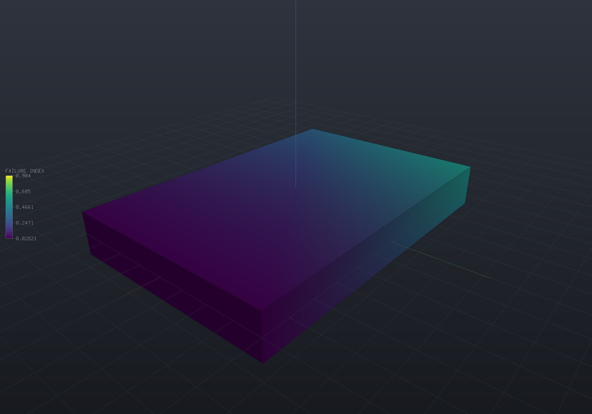

A composite part is directional twice over: it is **stiffer** along the fibre than across
it, which [`ElasticLaw`](fea-structural.md) already carries, and it is **stronger** along
the fibre than across it, which no scalar equivalent stress can express. This page covers
the two things that follow — turning a layup into a constitutive law with classical
lamination theory, and measuring the recovered stress against per-direction allowables.

> [!IMPORTANT]
> **`MaxVonMises` on a composite part is a number with no engineering meaning.** A scalar
> equivalent stress compares a state against *one* allowable, which presumes the material is
> equally strong in every direction. A carbon/epoxy ply is 37× stronger along the fibre than
> across it — 1500 MPa against 40 — so the same von Mises number can be comfortably safe in
> one direction and well past failure in another. Use `FailureAnalysis`.

## A laminate is a property derivation

`Laminate` is a stack of plies and the classical lamination theory over it. It adds no
element type and no solver path: it produces an `ElasticLaw`, which rides
`StructuralModel.SetElasticity` exactly as a hand-stated orthotropic law does.

```csharp run:fea-composites-clt
// T300/5208 graphite/epoxy - the canonical row (verify against a real data sheet).
var t300 = new LaminaProperties(e1: 181_000, e2: 10_300, nu12: 0.28, g12: 7_170, name: "T300/5208");

// [0/90]s - Symmetric() appends the mirror image, so this is 0/90/90/0.
var crossPly = Laminate.Symmetric(t300, plyThickness: 0.125, 0.0, 90.0);

Console.WriteLine($"h = {crossPly.Thickness} mm, symmetric = {crossPly.IsSymmetric}, "
    + $"balanced = {crossPly.IsBalanced}");
Console.WriteLine($"in-plane  Ex {crossPly.InPlane.Ex:F0}  Ey {crossPly.InPlane.Ey:F0}  "
    + $"Gxy {crossPly.InPlane.Gxy:F0} MPa,  nu_xy {crossPly.InPlane.NuXy:F4}");
Console.WriteLine($"flexural  Ex {crossPly.Flexural.Ex:F0}  Ey {crossPly.Flexural.Ey:F0} MPa");
Console.WriteLine($"smearing cost (flexural discrepancy) {crossPly.FlexuralDiscrepancy:F3}");

// The ABD matrices are there in the textbook's own terms - 3x3 row-major over (x, y, xy).
Console.WriteLine($"A11 = {crossPly.A[0]:F1} N/mm, A16 = {crossPly.A[2]:F1} (exactly zero)");

if (crossPly.A[2] != 0.0 || crossPly.A[5] != 0.0)
    throw new Exception("a cross-ply has no shear-extension coupling");
```

Which prints:

```
h = 0.5 mm, symmetric = True, balanced = True
in-plane  Ex 95991  Ey 95991  Gxy 7170 MPa,  nu_xy 0.0302
flexural  Ex 160114  Ey 31727 MPa
smearing cost (flexural discrepancy) 0.401
A11 = 48039.3 N/mm, A16 = 0.0 (exactly zero)
```

Three of those numbers are worth reading twice. `Gxy` is the *lamina's own* 7170 MPa —
cross-plying does nothing for shear, because a 0° ply and a 90° ply have the same `Qbar66`.
`nu_xy` collapses to 0.0302 because the 90° plies restrain the contraction the 0° plies
want. And the flexural `Ex` is **1.67× the in-plane one**, which is the next section.

| Layup | Ex (MPa) | Gxy (MPa) | nu_xy |
| --- | --- | --- | --- |
| `[0]₄` unidirectional | 181 000 | 7 170 | 0.280 |
| `[0/90]s` cross-ply | 95 991 | 7 170 | 0.030 |
| `[±45]s` angle-ply | 25 051 | **46 591** | **0.747** |
| `[0/45/-45/90]s` quasi-isotropic | 69 676 | 26 880 | 0.296 |

The `[±45]s` row is the reason that layup exists: its shear modulus is 6.5× the lamina's,
because ±45 fibres carry shear as tension. Its Poisson's ratio of 0.747 is not a mistake
either — the isotropic bound of 0.5 is a statement about isotropic materials.

## What smearing drops, as a number

A solid element carrying one constitutive law has no memory of the stacking sequence
through its thickness. Two consequences, both reported rather than implied:

- **Bending–extension coupling cannot be represented at all.** A non-symmetric layup has a
  non-zero `B` matrix — in-plane load produces curvature — and `ToElasticLaw()` **refuses it
  by name** rather than returning a law that is quietly wrong about warping.
- **Flexural stiffness survives only to the extent that `D` agrees with `h²·A/12`.**
  `FlexuralDiscrepancy` measures exactly that gap: **0.401** for the `[0/90]s` above, because
  its outer 0° plies dominate the section modulus and the smearing does not know they are
  outside. A plate model of that laminate under bending will be wrong by about that much.

Both have the same way out: mesh the plies as separate regions through the thickness and
give each its own `ElasticLaw`. Interlaminar stress and delamination are outside the smeared
model entirely — it has no ply interfaces to separate.

What the smearing does **not** cost is in-plane accuracy. The homogenisation is *mixed* —
plies share the in-plane strain (they are bonded) and share the through-thickness stress
(they stack), which is the same parallel/series split the [PCB thermal
model](ecad-thermal.md) rests on — and condensing the resulting 6×6 back to plane stress
returns `A/h` **exactly**. A solved bar reproduces the CLT modulus to nine digits:
95 991.30 MPa against 95 991.30.

## Failure criteria

`FailureAnalysis.Evaluate` rotates the recovered stress into the **material frame** — the
one the region's own `ElasticLaw` was built with, never a second copy that could drift —
and measures it against a `LaminaStrength`.

```csharp render:fea-composites-plate
var plate = Shape.Box(60, 40, 8)
    .Subtract(Shape.Cylinder(6, 40).Translate(0, 0, -20));
var part = new Part("panel", plate);

var surface = part.GetMesh();
var tets = TetMesher.Mesh(surface, new TetMeshOptions
{
    RefineQuality = true,
    MaxElementSize = 14,     // coarse on purpose - this page is a picture, not a study
});

// A quasi-isotropic layup, 8 plies of 1 mm: [0/45/-45/90]s.
var t300 = new LaminaProperties(181_000, 10_300, 0.28, 7_170, name: "T300/5208");
var layup = Laminate.Symmetric(t300, 1.0, 0.0, 45.0, -45.0, 90.0);

var model = new StructuralModel(
    AnalysisMesh.Quadratic(tets), new Material("T300/5208", 70_000, 0.3, 1.6e-9));

// The laminate's 0-degree direction is +X and it stacks along +Z.
model.SetElasticity(0, layup.ToElasticLaw(Frame3d.WorldXY));
model.SetStrength(0, new LaminaStrength(xt: 1500, xc: 1500, yt: 40, yc: 246, s: 68));

model.Fix(Facets.OnPlane(new Vector3d(-30, 0, 0), Vector3d.UnitX));
model.Traction(Facets.OnPlane(new Vector3d(30, 0, 0), Vector3d.UnitX), new Vector3d(45, 0, 0));

var results = StructuralSolver.Solve(model);
var failure = FailureAnalysis.Evaluate(results, FailureCriterion.TsaiWu);

Console.WriteLine($"peak failure index {failure.MaxFailureIndex:F3}, "
    + $"strength ratio {failure.MinStrengthRatio:F3}, "
    + $"out-of-plane fraction {failure.MaxOutOfPlaneFraction:E1}");
if (!(failure.MaxFailureIndex > 0))
    throw new Exception("the criterion found nothing to measure");

foreach (var field in failure.SampleOnto(surface))
    part.AddResult(field);
part.FieldDisplay = new FieldDisplay { Field = FailureResults.FieldNames.FailureIndex };

var scene = new Scene();
scene.Add(part);
```



The colour is the **failure index**: 1 is exactly at the limit, above 1 has failed. This panel
peaks at 0.968 — inside the envelope, with 3% left — so `MinStrengthRatio` reads 1.033 and the
load could rise by 3% before Tsai–Wu says the laminate is done. Note what a von Mises plot of
the same solve could not have told you: at 45 MPa of applied tension the quasi-isotropic
laminate is nowhere near its 1500 MPa fibre strength, and it is *still* almost at its limit,
because the 90° plies are carrying transverse stress against a 40 MPa allowable.

### Three criteria, and what separates them

| Criterion | Interaction | Names a mode | Tension ≠ compression |
| --- | --- | --- | --- |
| `MaxStress` | none | yes | yes (per component) |
| `TsaiHill` | quadratic | no | by the sign of each component |
| `TsaiWu` | quadratic + linear | no | continuously |

They agree exactly on the five uniaxial tests they are all calibrated on — a pure
fibre-direction tension reaches failure at exactly `Xt` for all three — and diverge in the
interior. At `σ₁ = 900, σ₂ = 25, τ₁₂ = 40` MPa, max-stress reads **0.625** while Tsai–Hill
reads **1.042** and Tsai–Wu **1.090**: the non-interactive criterion calls a failed state
safe, which is the classic reason not to use it alone.

`MaxStress` earns its place by naming the **mode**, which is a real engineering distinction —
matrix cracking at `Yt` is a different event from fibre failure at `Xt`, and a designer treats
them differently. At `σ₁ = 600, σ₂ = 30` the index is 0.750 and the mode is `MatrixTension`:
a transverse stress a twentieth the size of the fibre stress is what governs.

### The index is load-normalised, not the raw polynomial

`FailureIndex` is `1 / StrengthRatio`, not the quadratic's left-hand side. That is what makes
the three criteria comparable with each other and linear in the load — and it makes the
strength ratio, `R`, the number an engineer actually wants: **R = 2 means the load can
double**. The definition is verified through the solver rather than restated: scale the
traction by `R`, re-solve, and the peak index lands on 1.000000000000 for all three criteria.

### Off-axis strength

A unidirectional lamina pulled at an angle to its fibres has a strength that collapses
astonishingly fast, and both criteria reproduce their classical closed forms exactly:

| Angle | Max-stress (MPa) | Tsai–Hill (MPa) |
| --- | --- | --- |
| 0° | 1500.00 | 1500.00 |
| 15° | 272.00 | 244.85 |
| 30° | 157.04 | 111.96 |
| 45° | 80.00 | 68.95 |
| 90° | 40.00 | 40.00 |

Ten degrees off the fibre throws away three quarters of the strength (1500 → 370 MPa). That
is the whole argument for a laminate rather than a unidirectional layup.

### The interaction coefficient is a stated choice

Tsai–Wu's `F12*` is the one coefficient no uniaxial test determines — measuring it needs a
biaxial test, and published values scatter. It is therefore a parameter with a stated default
(`-0.5`, the generalised von Mises choice) rather than a constant buried in the evaluator, and
the choice measurably moves the answer in the biaxial interior (`R` = 1.628 at −0.5 against
1.421 at 0) while leaving every uniaxial reduction untouched. `|F12*| ≥ 1` is refused by name:
past that the failure surface opens into a hyperboloid and some arbitrarily large biaxial
state would be reported safe.

## What is reported rather than consumed

The criteria are **plane-stress**: they read σ₁, σ₂ and τ₁₂ in the material frame. A lamina's
allowables are quoted in-plane, and interlaminar failure is *delamination* — a different
mechanism against different allowables, and one a smeared law cannot see.

So the out-of-plane stress is not silently ignored. `MaxOutOfPlaneFraction` is the largest
out-of-plane stress magnitude anywhere evaluated, as a fraction of the largest **in-plane**
one: near zero for a thin laminate loaded in its plane (2e-16 on the off-axis bar fixture),
and appreciable at a free edge, under a bolt or beneath a contact patch — exactly where
interlaminar failure starts. Read it before believing the index there.

Both extremes are global on purpose. A *per-node* ratio is dominated by whichever node
happens to carry almost no in-plane stress, where the quotient is large and means nothing:
that form measured **4.4** — "440% out-of-plane" — on a panel loaded purely in its plane.
Same small-denominator lesson as the epsilon ladder, in a diagnostic.

## No value means NaN

A region that states no `LaminaStrength` publishes **NaN**, the "no value" spelling the
colour map and the field range already skip — never zero, which would paint the safest
possible colour on a part nobody has checked. Asking for a criterion when **no** region
states a strength is refused by name instead: an all-NaN field looks like a solve that ran
and found nothing.

At a material interface a node has one honest answer per material, and
`FailureIndexIn(region, node)` gives it. The published per-node field takes the **worst** of
them, deliberately: a failure index is a max-type quantity, and averaging two materials'
indices would report a number neither material carries.

## Verification

Every figure on this page comes from `LaminateTests` and `CompositeFailureTests`, which check
closed forms rather than agreement between features:

| Check | Result |
| --- | --- |
| `Qbar` against an independent 4th-order tensor rotation | 1e-16 relative, 7 angles |
| Condensing the 3D law → classical plane-stress `Q` | 1e-10 relative |
| `[0]₄` equivalent constants = the lamina's own | 1e-12 relative |
| `[0/90]s` and `[±45]s` `A` matrices against closed forms | 1e-10 relative |
| Cross-ply `A16`, `A26`, `D16`, `D26` | **exactly** 0.0 |
| Balanced `[±45]s` `A16`, `A26` | **exactly** 0.0 (and `D16` ≠ 0) |
| Smeared law condensed to plane stress vs `A/h` | difference **0.0** |
| Solved bar modulus vs CLT | 95 991.30 vs 95 991.30 |
| Tsai–Wu uniaxial reduction = `Xt/σ` | 1e-12 relative, all five allowables |
| Off-axis strength vs closed form | 1e-12 relative, 7 angles |
| Scale the load by `R`, re-solve | index 1.000000000000 |

The `Qbar` oracle is built by index summation over a 2×2×2×2 tensor and shares nothing with
the production path, which asks `ElasticLaw` for a rotated 6×6 and condenses it — two
derivations with only the physics in common, which is what makes agreement evidence.

## Not in v1

Named rather than left to be discovered: thermal and moisture loads on a laminate (CLT's
`N_T`/`M_T` vectors), progressive first-ply failure with stiffness degradation, Hashin's
mode-separated criteria, interlaminar/delamination criteria, and buckling of a laminated
plate from `D` (which needs a shell element, not a smeared solid).

## See also

- [Structural analysis](fea-structural.md) — the solve these results come from
- [Fields & simulation results](fields.md) — how a failure index reaches the viewer
- [Materials & mass](materials.md) — the unit convention throughout
