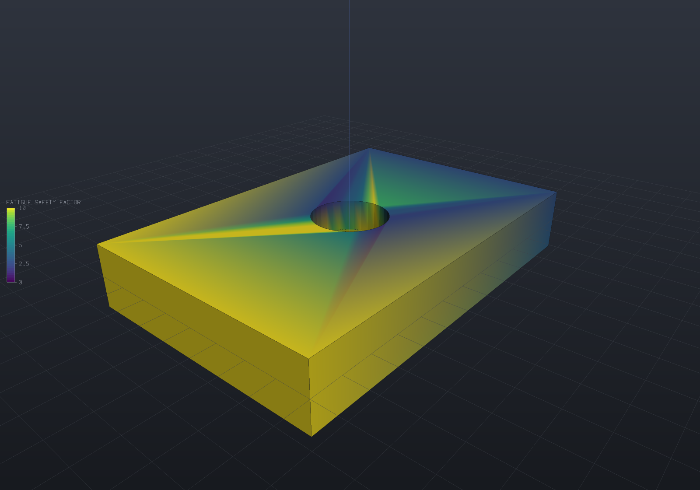

# Fatigue (S-N life and safety factors)

Stress-life fatigue post-processing over the [structural results](fea-structural.md)
that already exist — **arithmetic, not a solver**: two static load cases become a
per-node alternating/mean stress cycle, an S-N curve and a mean-stress correction turn
the cycle into a life and a safety factor, and both publish as [fields](fields.md) the
viewer colours with no new display code.

```csharp render:fea-fatigue-bracket
// The structural page's bracket with its pocket turned up, so the concentration the
// safety factor finds is on the face the camera sees.
var bracket = Shape.Box(60, 40, 10)
    .Subtract(Shape.Cylinder(6, 40).Translate(0, 0, 20));
var part = new Part("bracket", bracket);

var surface = part.GetMesh();
var tets = TetMesher.Mesh(surface, new TetMeshOptions
{
    RefineQuality = true,
    MaxElementSize = 14,     // deliberately coarse - this page is a picture, not a study
});
var mesh = AnalysisMesh.Quadratic(tets);

// The two EXTREMES of the duty cycle - full down-load and a partial reverse - solved
// through ONE factorization: SolveAll is exactly the entry point this consumes.
StructuralModel Case(double load)
{
    var model = new StructuralModel(mesh, Materials.Steel);
    model.Fix(Facets.OnPlane(new Vector3d(-30, 0, 0), Vector3d.UnitX));
    model.Force(Facets.OnPlane(new Vector3d(30, 0, 0), Vector3d.UnitX),
        new Vector3d(0, 0, load));
    return model;
}
var cases = StructuralSolver.SolveAll([Case(-1800), Case(600)]);

var fatigue = FatigueAnalysis.Evaluate(cases[0], cases[1], FatigueMaterials.Steel1045);

foreach (var field in fatigue.SampleOnto(surface))
    part.AddResult(field);                       // same name REPLACES, so a re-run updates
part.FieldDisplay = new FieldDisplay
{
    Field = FatigueResults.FieldNames.SafetyFactor,
    // The actionable band. Lightly stressed nodes carry factors in the hundreds, so the
    // field's own range would spend the whole legend on them; an explicit range is what
    // FieldDisplay.Range exists for.
    Range = new FieldRange(0, 10),
};

var scene = new Scene();
scene.Add(part);
```



The load cycles between 1800 N downward and 600 N upward. Dark is close to failure: the
factors fall toward the built-in end, where the bending stress peaks, and dip around the
pocket — the stress concentration — while the lightly stressed free end saturates the
top of the band.

> [!NOTE]
> The mesh is coarse on purpose so this page builds quickly, and a coarse mesh
> **understates a concentration's stress — which overstates its fatigue life**. Real
> fatigue numbers need the peak stress converged (see the error estimate on the
> [structural page](fea-structural.md)), and life is brutally sensitive: with a Basquin
> slope near −0.1, a 2% stress error is roughly a 24% life error.

## The loading model: two cases, proportional

`FatigueAnalysis.Evaluate(a, b, curve)` takes the two **extremes of one proportional
load history** — the assumption under which every stress component scales together, so
one scalar per node captures the cycle. The pair is what
`StructuralSolver.SolveAll` returns from one assembly and one factorization; results
solved on different meshes, or answering with different stress-recovery settings, are
refused by name (differencing a `Direct` field against a `Superconvergent` one would
book the recovery gap as alternating stress).

The scalar is the **signed von Mises** equivalent: the von Mises magnitude carrying the
sign of the hydrostatic trace, so a fully reversed load reads R = −1 rather than a
pulsating magnitude. The convention is recorded with its reasons: the common alternative
(the sign of the absolutely largest principal stress) needs an eigensolve and *jumps*
when two nearly equal principals of opposite sign swap magnitude, while the trace is
linear in the stress components — and in the uniaxial state the S-N data was measured
in, the two agree exactly.

Per node, with `s₁`/`s₂` the signed equivalents under the two cases:

| Quantity | Definition |
| --- | --- |
| alternating stress `σ_a` | `(max(s₁,s₂) − min(s₁,s₂)) / 2` |
| mean stress `σ_m` | `(max(s₁,s₂) + min(s₁,s₂)) / 2` (signed; negative is compressive) |

The max and min are taken **per node**, so which case is "worse" may differ across the
part, and the case order never matters (asserted as bits).

## The S-N catalogue

`SnCurve` is the Basquin line `σ_a = σ'_f·(2N)^b` — the amplitude a fully reversed
uniaxial test survives for N cycles — plus the ultimate strength the mean-stress
corrections anchor on. `FatigueMaterials` transcribes a handful of rows from the
SAE J1099 / Dowling compilations, **flagged verify-against-datasheet** exactly as
`StandardHoles`' Trisert table and `SheetMaterials`' K-factors are: fatigue constants
are fitted to particular material batches, heat treatments and polished laboratory
specimens, published sources genuinely disagree, and the authority is the datasheet for
*your* material condition, not this file.

| Curve | σ'_f (MPa) | b | S_ut (MPa) | endurance |
| --- | ---: | ---: | ---: | --- |
| `Steel1015` (SAE 1015 normalized) | 827 | −0.11 | 415 | 168 MPa at 10⁶ |
| `Steel1045` (SAE 1045 HR) | 948 | −0.092 | 621 | 250 MPa at 10⁶ |
| `Steel4340` (AISI 4340 QT) | 1758 | −0.0977 | 1241 | 426 MPa at 10⁶ |
| `Aluminium2024T351` | 927 | −0.113 | 469 | — |
| `Aluminium6061T6` | 535 | −0.102 | 310 | — |
| `Aluminium7075T6` | 1466 | −0.143 | 578 | — |

Two decisions carry the table. **The endurance limit is DERIVED, never stored beside
the line** — a steel's limit is the Basquin line evaluated at its own 10⁶-cycle knee,
so the two cannot drift (the same one-source-of-truth rule that keeps the fine-pitch
thread table from carrying a tap-drill column), and beyond the knee the curve is flat
at that value. And **the aluminium rows carry no endurance limit because the material
has none** — steels arrest small cracks below a threshold stress, face-centred-cubic
aluminium does not — a real metallurgical distinction the API keeps rather than
smoothing over: below its limit a steel node lives forever, while an aluminium node
always has a finite life and a safety factor for it needs a stated design life.

The constants are stored in the form a human can check — MPa, which is both the
datasheet unit and the model unit (`ModelUnits`), so unlike the density lesson there is
no conversion for a transcription test to hide behind. Basquin is a **high-cycle**
model: below roughly 10³ cycles plastic strain dominates and the numbers are
extrapolations that should be read as "fails fast", not as a schedule.

## Mean-stress corrections

A tensile mean stress shortens life at the same amplitude. The correction folds the
cycle onto the R = −1 curve as an *equivalent fully reversed amplitude*, selectable per
run:

| `MeanStressCorrection` | Equivalent amplitude (σ_m > 0) | Character |
| --- | --- | --- |
| `Goodman` (default) | `σ_a / (1 − σ_m/S_ut)` | Linear line to S_ut — conservative for ductile metals |
| `Gerber` | `σ_a / (1 − (σ_m/S_ut)²)` | Parabola — tracks test data closer, less conservative |
| `None` | `σ_a` | Only right for a genuinely reversed history |

Three behaviours are structural and pinned by test: at **zero mean** both corrections
are the identity *exactly*; at a mean of **exactly S_ut** the allowable alternating
stress is *exactly zero* (both lines meet the axis there); and a **compressive mean
takes no benefit by default** — compression genuinely retards crack growth, but
crediting it requires confidence the mean stays compressive over the whole service life
at the surface where cracks start (residual-stress relaxation alone can void it), so
the amplitude passes through unchanged on the compressive side, which is what every
standard tool defaults to. A mean at or beyond S_ut has failed *statically*, not in
fatigue, and is reported as the life floor below.

## Life, the safety factor, and their spellings

```csharp run:fea-fatigue-life
// A bar under a fully reversed +/-300 MPa axial load, end to end: two solves, the
// decomposition, the (identity) correction, the life - against the Basquin inversion
// worked by hand: N = 0.5*(300/948)^(1/-0.092) = 1.35e5 cycles, log10 = 5.1303.
// nu = 0 makes the uniaxial state EXACT in the element space, so the check is tight.
var bar = new Part("bar", Shape.Box(40, 10, 10));
var tets = TetMesher.Mesh(bar.GetMesh(),
    new TetMeshOptions { RefineQuality = true, MaxElementSize = 4 });
var mesh = AnalysisMesh.Of(tets);

StructuralModel Case(double sigma)
{
    var model = new StructuralModel(mesh, new Material("steel (nu 0)", 210_000, 0.0));
    model.Fix(Facets.OnPlane(new Vector3d(-20, 0, 0), Vector3d.UnitX));
    model.Traction(Facets.OnPlane(new Vector3d(20, 0, 0), Vector3d.UnitX),
        new Vector3d(sigma, 0, 0));
    return model;
}
var cases = StructuralSolver.SolveAll([Case(300), Case(-300)]);
var fatigue = FatigueAnalysis.Evaluate(cases[0], cases[1], FatigueMaterials.Steel1045);

if (Math.Abs(fatigue.MinLog10Life - 5.1303) > 0.001)
    throw new Exception($"log10 life {fatigue.MinLog10Life} vs the hand-computed 5.1303");
if (fatigue.MinSafetyFactor >= 1)
    throw new Exception("300 MPa is above the 250 MPa endurance limit - the factor must fail");
```

Four fields publish per node (`FatigueResults.Fields()` /
`SampleOnto(displayMesh)`), each with a deliberate spelling:

- **`Fatigue safety factor`** (dimensionless) — the **load multiplier to the
  mean-stress line**: scale the whole history by this factor and the node sits exactly
  on the line, which is also how the tests verify it (re-solve with the loads scaled by
  the measured factor; the minimum reads 1.0). Against the endurance limit by default;
  a material with no endurance limit **requires `FatigueOptions.DesignLife`**, refused
  by name, because a safety factor against infinite life does not exist for it. A node
  with zero amplitude and no tensile mean has no fatigue mechanism at all and reads
  NaN — the no-value spelling — rather than an infinity that would poison the legend.
- **`Fatigue life`** as **log10(cycles)** — published as the logarithm because lives
  spread over many decades and the colour pipeline's range mapping is linear, so raw
  cycles would spend the whole legend on the longest-lived node (a native log-scale
  display mode is filed in todo.md; the units string says what the numbers are
  meanwhile). **Infinite life is NaN** — at or below the endurance limit, or zero
  amplitude — the same "no value" convention the [VTU writer](fields.md) uses, which
  the ranging machinery already skips, so a part that mostly lives forever still gets
  a usable legend over the nodes that do not. A life below **one cycle** (including
  the static-failure branch, mean ≥ S_ut) is floored at 1, i.e. log10 = 0: ranging
  skips only NaN, so a −∞ would poison the minimum, and sub-cycle "lives" are outside
  Basquin's validity anyway.
- **`Alternating stress`** and **`Mean stress`** (MPa) — the decomposition itself,
  published so the inputs to the correction are inspectable beside its output.

## What this deliberately is not

Named rather than approximated, the discipline's own boundaries:

- **Welds.** A welded joint's life is governed by its detail class and geometric
  (hot-spot) stress, not by the parent metal's Basquin line — the IIW / Eurocode
  nominal-stress and hot-spot methods are their own discipline, and running this over
  a weld answers the wrong question.
- **Multiaxial criteria beyond von Mises equivalence.** Non-proportional load paths
  rotate the principal frame and need critical-plane methods (Findley, Fatemi–Socie) —
  a different computation over a different input. The structural tell lives inside the
  signed von Mises itself: a reversed **pure shear** cycle is invisible to *any* scalar
  signed equivalent, because negating a pure shear tensor is a rotation of it — no
  invariant can tell the two halves apart. That is precisely the case critical-plane
  methods exist for.
- **Surface and size effects applied silently.** The catalogue's constants are
  polished-specimen values and stay that way; `WithFactors` (below) is how a real
  part's surface, size and reliability knock the endurance end down — a derivation
  the caller asks for, never a default.

## Marin factors: the corrected curve is derived, the row stays pristine

The catalogue rows are polished-specimen fits, which makes them upper bounds for any
real part. `SnCurve.WithFactors(surface, diameter, reliability)` derives a corrected
curve from the classical Marin correlations — `MarinFactors.Surface` (the
`a·S_ut^b` finish rows), `MarinFactors.Size` (the rotating-bending diameter effect;
omit the diameter for axial loading, which has none) and `MarinFactors.Reliability`
(the tabulated 8%-scatter shifts) — **without the transcribed row ever being edited**,
the same derived-vs-stored rule the endurance limit itself follows.

```csharp run:fea-fatigue-marin
var pristine = FatigueMaterials.Steel1045;
var machined = pristine.WithFactors(
    SurfaceFinish.Machined, diameterMm: 25, reliability: 0.99);

Console.WriteLine(pristine);
Console.WriteLine(machined);

// The construction pivots at 10^3 cycles (where plastic strain dominates and the
// factors classically do not apply) and scales the endurance end exactly.
if (Math.Abs(machined.StressAt(1e3) - pristine.StressAt(1e3)) > 1e-9 * pristine.StressAt(1e3))
    throw new Exception("the 10^3-cycle pivot must be unchanged");
if (machined.EnduranceLimit! >= pristine.EnduranceLimit!)
    throw new Exception("the corrected endurance must fall");
```

The **factors multiply the endurance limit, not σ'_f**: surface finish, size and
scatter govern crack *initiation*, which dominates at long life, so the corrected line
passes through the pristine line's own 10³-cycle point (Basquin's validity floor) and
through `k·S_e` at the unchanged knee — Shigley's two-anchor construction with the
curve's own low-cycle value as the anchor rather than a second transcribed constant.
The ultimate strength is untouched (a finish does not change a static failure), a
factor of exactly 1 returns the pristine curve verbatim, and the correlations refuse
what they cannot answer by name: aluminium (no endurance limit to anchor on — a
knee-less material needs a stated reference life, a different construction), diameters
past the 254 mm data, and reliabilities off the standard table (interpolating a
quantile through it would invent precision the 8%-scatter assumption does not have).
The correlations themselves are transcribed **verify-against-datasheet** like every
constant table here — the classic worked values (machined at 690 MPa → 0.798, 32 mm →
0.858, 99% → 0.814) are the transcription tests.

## Variable amplitude: rainflow over a transient run

Two static cases cannot carry a time history; a [transient solve](fea-transient.md)'s
stored states can, and are exactly what the rainflow overload consumes. `Rainflow.Count`
is ASTM E1049's own three-point algorithm — the standard's worked example is transcribed
as a test, cycle for cycle — and
`FatigueAnalysis.Evaluate(transient, curve, rainflowOptions)` runs it over every node's
signed von Mises history with **Miner's-rule** damage accumulation, the mean-stress
correction applied *per counted cycle* through the same `EquivalentAlternating` the
static path uses.

```csharp run:fea-fatigue-rainflow
// The ASTM E1049 worked example: seven counts, one of them the full cycle E-F.
double[] series = [-2, 1, -3, 5, -1, 3, -4, 4, -2];
foreach (var cycle in Rainflow.Count(series))
    Console.WriteLine(cycle);

// The pipeline: an irregular load history no static pair can carry, counted per node.
var tets = TetMesher.Mesh(
    new Part("bar", Shape.Box(40, 10, 10)).GetMesh(),
    new TetMeshOptions { RefineQuality = true, MaxElementSize = 10 });
var model = new StructuralModel(AnalysisMesh.Of(tets), Materials.Steel);
model.Fix(Facets.OnPlane(new Vector3d(-20, 0, 0), Vector3d.UnitX));
model.Force(Facets.OnPlane(new Vector3d(20, 0, 0), Vector3d.UnitX), new Vector3d(30000, 0, 0));

var run = TransientSolver.Solve(model, new TransientSolveOptions(2e-5, 120)
{
    LoadFactor = t => Math.Sin(90000.0 * t) + 0.4 * Math.Sin(23000.0 * t),
});

var fatigue = FatigueAnalysis.Evaluate(run, FatigueMaterials.Steel1045);
Console.WriteLine(fatigue);
if (fatigue.MaxDamage <= 0)
    throw new Exception("an over-endurance swing must accumulate damage somewhere");
```

**What the counting sees is the *stored* states**: a reversal that fell between stored
steps was never sampled and is never counted, so a run that feeds fatigue should store
every step (`StoreEvery = 1`, the default). The per-node series costs one scalar per
stored state — small beside the full fields each state already retains — which is why
the extraction runs at every node rather than at preselected hot spots: the "which node
is worst" answer is the point of the field.

**The open end of the history is an option, because ASTM E1049 names two honest
readings.** By default the history is **one-shot** — a load event with a beginning and
an end, which is what a transient run is — and the residual ranges the counting cannot
close are the standard's *half* cycles. `AssumeRepeating = true` reads it as **one
period of a repeating load**: the series is rearranged to begin at its
largest-magnitude extremum (E1049's own prescription, under which every count closes)
and the residual halves pair into full cycles, so a block program counted per block
accumulates no phantom boundary halves. The two modes agree on damage for a
constant-amplitude history; what changes is the cycle structure reported.

The answer publishes as two fields: **`Fatigue damage`** — Miner damage per pass of the
stored history, the quantity that composes (k passes accumulate k·damage; life is
`1/damage` repetitions) — and **`Fatigue repetitions`** as log10(repetitions), with the
static path's spellings (NaN = no damage anywhere = infinite life; the one-repetition
floor covers the static-failure branch). A **variable-amplitude safety factor** is
deliberately absent: scaling the loads scales every cycle at once and Basquin is a power
law, so the factor to a damage target needs an iteration and a stated target life — a
different quantity from the static pair's radial factor, filed rather than approximated.

## Verification

From the test suite (`FatigueTests`, `SnCurveTests`), on the bar whose uniaxial state
is exact in the element space (ν = 0, the same trick the multi-material bar uses):

| Check | Measured |
| --- | --- |
| σ_a/σ_m from two load cases vs an oracle re-derived from the **displacement** solution | 40 / 60 MPa, ≤ 1e-10 relative at every node |
| equal-and-opposite loads read R = −1 | mean ≤ 1e-13 of the amplitude (measures exactly 0: negation commutes with IEEE rounding bit for bit) |
| the line at one reversal is σ'_f | **bit-exact** (Math.Pow(1, b) is 1) |
| the endurance knee is on the line, and the curve is flat beyond it | **bit-exact** |
| SAE 1045 endurance limit vs the hand-worked 948·(2·10⁶)^(−0.092) | 249.53 MPa |
| life/stress inverse round-trip below the knee | ≤ 1e-12 relative |
| Goodman and Gerber at zero mean | identity, **bit-exact** |
| allowable amplitude at σ_m = S_ut | **exactly zero**, both lines |
| loads scaled by the measured safety factor | the critical node lands ON the line: min factor 1.0 to 1e-9 |
| R = −1 at 400 MPa, full pipeline, vs the hand-computed life | 5.92e3 cycles, log10 within 1e-6 of the Basquin inversion |
| steel endurance limits vs their ultimate strengths | 0.40 / 0.40 / 0.34 — near the classical one-half correlation, inside the asserted 0.30–0.55 band a mistyped exponent cannot survive |
| ASTM E1049 Fig. 6 worked example (`RainflowTests`) | all seven counts reproduced — range, mean AND half/full status, in algorithm order |
| rainflow decomposes the total variation, `sum(2·count·range)` vs the turning points' own `sum|Δ|` | exact on a 257-sample pseudo-random history — the identity that catches a dropped or double-counted range on inputs nobody hand-checked |
| a constant-amplitude history (transient states alternating between the SolveAll pair) vs the static-pair answer | the counted cycle's amplitude and mean **bit-equal** the static decomposition; damage exactly `count/life` |
