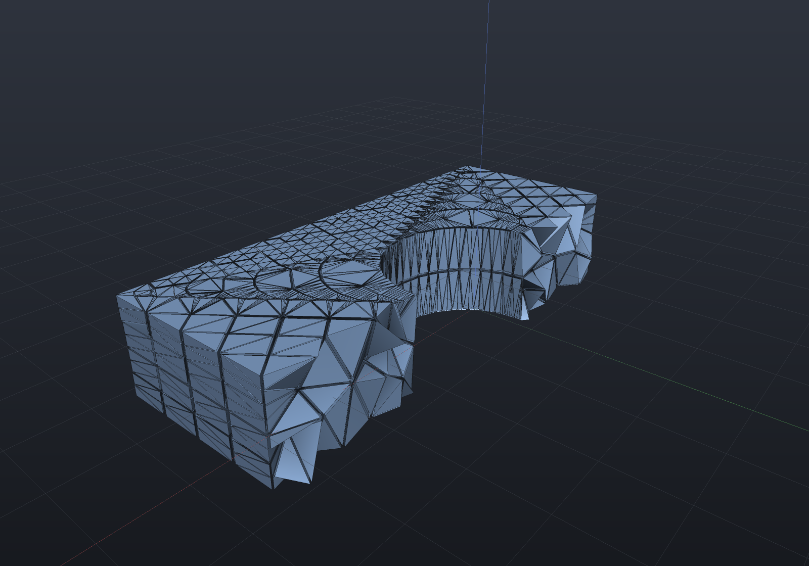
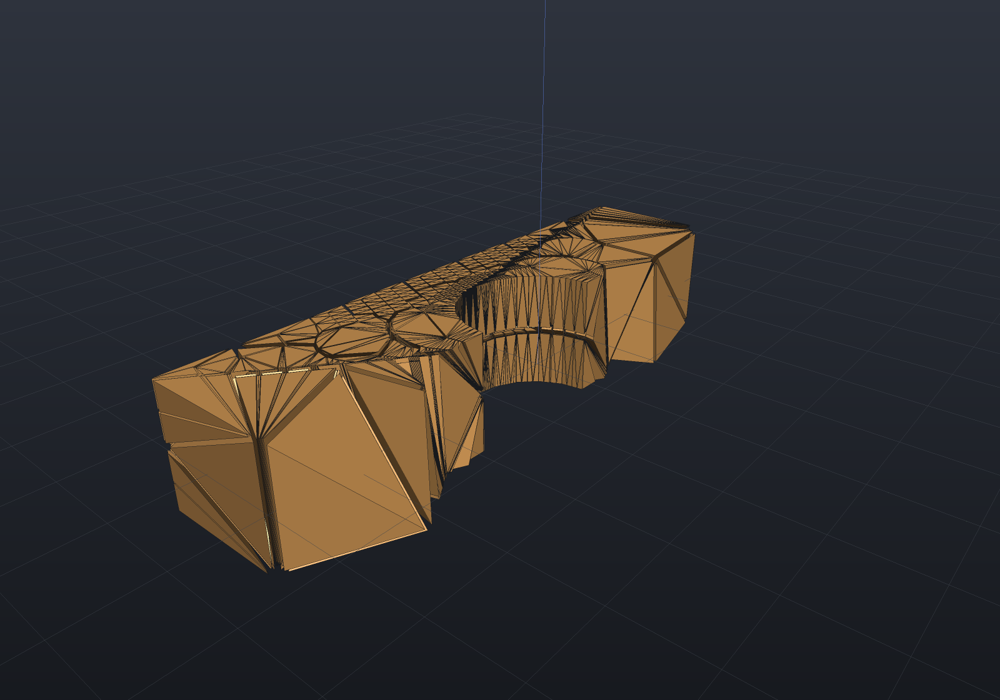

`TetMesher` fills a closed surface with tetrahedra. Any EngrCAD representation reaches a
surface mesh — `Shape.ToMesh()`, a B-Rep tessellation, Surface Nets over an SDF, an imported
STL — so anything you can model, you can mesh.

```csharp run:fea-first-mesh
var surface = Shape.Box(40, 30, 6)
    .Subtract(Shape.Cylinder(6, 20))
    .ToMesh();

var tets = TetMesher.Mesh(surface, null, out var report);

// One line naming every count and the volume residual: elements, input triangles and
// patches, Steiner points added per phase, recovery rounds, and how far the filled
// volume sits from the surface's own.
Console.WriteLine(report);

if (report.VolumeResidual > 1e-9)
    throw new Exception($"the tet mesh does not fill its own surface: {report.VolumeResidual:E2}");
if (Math.Abs(tets.Volume - surface.Volume()) > 1e-6)
    throw new Exception("volume identity failed");
```

The **volume identity** is the check to reach for first: the sum of the elements' volumes
equals the input surface's enclosed volume. Every element is stored positively oriented
(verified with exact arithmetic at construction), so that sum has no cancellation in it and a
crack or an inverted element cannot hide.

## Seeing the elements

The boundary of the tet mesh is the input surface — that is the contract — so rendering it
alone tells you nothing new. `TetMesh.SurfaceOf` takes a predicate over elements and returns
the outer surface of just those, which is how you look *inside* the mesh.

Its `shrink` parameter decides what kind of answer you get. At the default `1.0` the
selection is welded into one surface — the true cut face, whose enclosed volume is exactly
the selected elements' volume. Below 1 each element becomes its own tetrahedron scaled about
its centroid: disjoint bodies, so every element is individually visible *and* the result is
manifold whatever you selected. That second point matters — an arbitrary half-space of a tet
mesh can leave two elements meeting at a single vertex, which is a bow-tie, and
`HalfEdgeMesh.Build` rejects those by design.

```csharp render:fea-tet-cutaway style:shaded-edges
var surface = Shape.Box(40, 30, 8)
    .Subtract(Shape.Cylinder(7, 30))
    .ToMesh(new MeshQuality { SegmentsPerCircle = 24 });

var tets = TetMesher.Mesh(surface, new TetMeshOptions
{
    RefineQuality = true,
    RadiusEdgeRatio = 2.0,
    MaxElementSize = 6.0,
});

// Keep the elements on one side of a plane, drawn slightly shrunk so each one is
// individually visible (shrink also makes the result manifold whatever you select).
var cutaway = tets.SurfaceOf(t =>
{
    var e = tets.GetTet(t);
    var centroid = (tets.Position(e.A) + tets.Position(e.B)
                  + tets.Position(e.C) + tets.Position(e.D)) * 0.25;
    return centroid.Y < 0;
}, shrink: 0.88);

var scene = new Scene();
scene.Add(new Part("tet mesh", cutaway) { Color = new PartColor(0.55f, 0.68f, 0.85f) });
```



## Quality — and why one number is never enough

```csharp run:fea-quality
var surface = MeshPrimitives.Box(new Aabb((0, 0, 0), (20, 20, 20)));
var tets = TetMesher.Mesh(surface, new TetMeshOptions
{
    RefineQuality = true,
    RadiusEdgeRatio = 2.0,
    MaxElementSize = 4.0,
});

var quality = TetQuality.Analyze(tets);
Console.WriteLine(quality.ToText());

if (quality.MaxRadiusEdgeRatio > 2.5)
    throw new Exception($"radius-edge target missed: {quality.MaxRadiusEdgeRatio:F2}");
if (quality.MeanMinDihedralDegrees < 25)
    throw new Exception($"mesh is too flat on average: {quality.MeanMinDihedralDegrees:F1} deg");
```

`TetQualityReport` carries **two** shape measures, and the reason is worth knowing before you
trust either.

The **radius-edge ratio** (circumradius ÷ shortest edge) is what Delaunay refinement can
bound. Bounding it excludes every badly shaped tetrahedron *except one*: the **sliver** — four
nearly-coplanar vertices, whose circumradius and shortest edge are both perfectly ordinary. A
mesh can have a flawless radius-edge histogram and still be useless for analysis.

The **minimum dihedral angle** is what actually governs the stiffness matrix's conditioning,
and it is the number that sees slivers. `SliverCount` counts elements below a threshold you
choose, so you can ask the question your solver cares about rather than the one the mesher
finds flattering.

> [!NOTE]
> `RadiusEdgeRatio` defaults to exactly **2.0** because that is the bound below which Delaunay
> refinement is not guaranteed to terminate. Smaller values are allowed; the Steiner-point
> budget is what catches a run that will not converge, and it refuses by name rather than
> returning a half-refined mesh.

### Refinement is not optional on curved bodies

Measured on a Ø20 UV sphere (win-x64, Release):

| | elements | mean min-dihedral | slivers below 10° |
| --- | ---: | ---: | ---: |
| conforming only | 3 402 | 5.5° | 85.9% |
| `RefineQuality`, `MaxElementSize = 2.5` | 14 583 | 39.8° | 4.8% |

A sphere's tessellation vertices are **all exactly cospherical**, so a tetrahedralization
built from them alone has no interior vertices at all — every element spans the whole body and
the result is slivers by construction. Refinement adds the interior points that give the mesh
a shape. This is a property of the input, not a defect in the mesher, and it is why the
quality report exists.

## Sizing fields

A sizing field asks for smaller elements where the analysis needs them. It is a plain
`Func<Vector3d, double>` returning the desired element size at a point, so an `Sdf` composes
into it directly — which is the natural way to grade away from a feature.

```csharp render:fea-sizing-field style:shaded-edges
var bore = Sdf.Cylinder(5, 40);
var surface = Shape.Box(40, 18, 8).Subtract(Shape.Cylinder(5, 40))
    .ToMesh(new MeshQuality { SegmentsPerCircle = 20 });

var tets = TetMesher.Mesh(surface, new TetMeshOptions
{
    RefineQuality = true,
    RadiusEdgeRatio = 2.0,
    // Fine at the bore wall, coarsening with distance from it. Element count grows as the
    // CUBE of the reciprocal size, so halving the base here would be an eightfold bill.
    SizingField = p => 4.5 + 1.1 * Math.Max(0, bore.Evaluate(p)),
});

var cutaway = tets.SurfaceOf(t =>
{
    var e = tets.GetTet(t);
    var centroid = (tets.Position(e.A) + tets.Position(e.B)
                  + tets.Position(e.C) + tets.Position(e.D)) * 0.25;
    return centroid.Y < 0;
}, shrink: 0.88);

var scene = new Scene();
scene.Add(new Part("graded mesh", cutaway) { Color = new PartColor(0.85f, 0.62f, 0.35f) });
```



`MaxElementSize` is the uniform form of the same idea; supply both and the smaller wins.

## Anisotropic boundary layers

A sizing field refines a region *isotropically* — smaller elements in every direction at
once, at a cost that grows as the cube. When the thing you need to resolve is a steep gradient
**normal to a surface** (a viscous wall, a thermal skin, a contact face) that is the wrong
shape of refinement: you want elements that are thin across the wall and as coarse as ever
along it.

`BoundaryLayerSpec` marches a graded stack of exactly those elements inward from a wall you
name, and the ordinary pipeline fills whatever is left.

```csharp run:fea-boundary-layer
// A duct: a bore with rings along it and flat ends. Tag 1 = wall, 2 = inlet, 3 = outlet.
// Note the RINGS: the wall is divided along its length, not left as two tall triangles per
// segment, because a layer's in-plane element size comes from the surface mesh (see below).
static (HalfEdgeMesh Surface, int[] Tags) Duct(double radius, double length, int segments, int rings)
{
    var p = new List<Vector3d>();
    for (int k = 0; k <= rings; k++)
        for (int i = 0; i < segments; i++)
        {
            double a = 2 * Math.PI * i / segments;
            p.Add(new Vector3d(radius * Math.Cos(a), radius * Math.Sin(a), length * k / rings));
        }
    int bottom = p.Count; p.Add(new Vector3d(0, 0, 0));
    int top = p.Count; p.Add(new Vector3d(0, 0, length));

    var faces = new List<int[]>();
    var tags = new List<int>();
    for (int k = 0; k < rings; k++)
        for (int i = 0; i < segments; i++)
        {
            int j = (i + 1) % segments;
            int a = k * segments + i, b = k * segments + j;
            int c = (k + 1) * segments + j, d = (k + 1) * segments + i;
            faces.Add([a, b, c]); tags.Add(1);
            faces.Add([a, c, d]); tags.Add(1);
        }
    for (int i = 0; i < segments; i++)
    {
        int j = (i + 1) % segments;
        faces.Add([bottom, j, i]); tags.Add(2);
        faces.Add([top, rings * segments + i, rings * segments + j]); tags.Add(3);
    }
    return (HalfEdgeMesh.Build(p, faces), [.. tags]);
}

var (surface, tags) = Duct(radius: 5, length: 20, segments: 32, rings: 12);

var tets = TetMesher.Mesh(surface, new TetMeshOptions
{
    FacetTags = tags,
    RefineQuality = true,
    MaxElementSize = 2.0,
    BoundaryLayer = new BoundaryLayerSpec
    {
        // The SAME selector a no-slip condition would use later.
        Wall = Facets.Tag(1),
        FirstLayerThickness = 0.15,
        LayerCount = 4,
        GrowthRatio = 1.3,
    },
}, out var report);

var layer = report.BoundaryLayer!.Value;
Console.WriteLine($"{tets.TetCount} elements, {layer.ElementCount} of them in the layer");
Console.WriteLine($"first layer {layer.FirstLayerThickness:G6} (asked {0.15}), " +
                  $"growth {layer.MeasuredGrowthRatio:G6} (asked {1.3}), " +
                  $"stack {layer.TotalThickness:G6} tall");
Console.WriteLine($"volume residual {report.VolumeResidual:E2}");

// The mesher's own oracle survives the layer: the elements still fill exactly the surface.
if (report.VolumeResidual > 1e-9)
    throw new Exception($"volume identity failed: {report.VolumeResidual:E2}");

// The quality report tells the two populations apart and applies the right rule to each.
var quality = TetQuality.Analyze(tets);
Console.WriteLine($"{quality.AnisotropicCount} anisotropic elements " +
                  $"(max stretch {quality.MaxStretch:F1}x, un-stretched min dihedral " +
                  $"{quality.MinStretchedDihedralDegrees:F1} deg); " +
                  $"{quality.SliverCount} slivers among the {quality.IsotropicCount} isotropic ones");
```

**Walls are named the way boundary conditions are named.** `Wall` is a `Facets` predicate over
the input surface's triangles, so `Facets.Tag(id)` picks the same face for the layer that it
picks for a load or a support later.

The stack's elements come out **first**, so `[0, layer.ElementCount)` names them.

### Reading the quality report

`TetQuality`'s sliver rule is tuned for isotropic elements and would call every legitimate
layer element degenerate — a tetrahedron cut from a prism 0.15 mm thick and 1 mm wide has a
minimum dihedral under a degree and a radius-edge ratio in the tens, and it is exactly right.
So the report **partitions** by measured stretch and gives each half the rule that means
something for it:

| number | over which elements |
| --- | --- |
| `SliverCount`, `MaxRadiusEdgeRatio`, `MeanRadiusEdgeRatio` | isotropic only |
| `AnisotropicCount`, `MaxStretch`, `MeanAnisotropicStretch` | the stretched ones |
| `MinStretchedDihedralDegrees` | the stretched ones, measured after un-stretching each along its own thinnest axis |

A mesh with nothing stretched in it reports exactly what it always did, number for number.

### Removing the slivers

Bounding the radius-edge ratio is what Delaunay refinement can do, and it **provably** cannot
exclude the sliver. `TetSmoothing.Smooth` is the post-pass that acts on what the dihedral
measure sees: it moves **interior** vertices to raise the worst dihedral angle, leaving the
topology and the boundary exactly as they were.

```csharp run:fea-smoothing
var surface = Shape.Box(20, 20, 20).ToMesh();
var tets = TetMesher.Mesh(surface, new TetMeshOptions
{
    RefineQuality = true,
    MaxElementSize = 3.0,
});

var smoothed = TetSmoothing.Smooth(tets, null, out var report);
Console.WriteLine(report);

var before = TetQuality.Analyze(tets);
var after = TetQuality.Analyze(smoothed);
Console.WriteLine($"slivers {before.SliverCount} -> {after.SliverCount}, " +
                  $"worst dihedral {before.MinDihedralDegrees:F2} -> {after.MinDihedralDegrees:F2} deg");

// The worst element must improve and the sliver count must fall — and the volume must not
// move, because the boundary never did.
if (after.MinDihedralDegrees <= before.MinDihedralDegrees || after.SliverCount >= before.SliverCount)
    throw new Exception("smoothing should raise the worst dihedral and remove slivers");
if (report.VolumeChangeRelative > 1e-12)
    throw new Exception("smoothing must not move the volume");
```

Measured on a 20³ box (win-x64, Release):

| target size | elements | ms | min dihedral | mean min-dihedral | slivers < 10° | volume drift |
| ---: | ---: | ---: | ---: | ---: | ---: | ---: |
| 3.0 | 15 834 | 3 947 | 0.00° → **13.86°** | 42.4° → 39.5° | 190 → **0** | 1.3e-14 |
| 2.0 | 40 593 | 4 924 | 0.00° → **17.00°** | 44.4° → 41.2° | 399 → **0** | 7.8e-15 |
| 1.5 | 103 103 | 12 865 | 0.01° → **10.07°** | 43.6° → 39.9° | 1 149 → **0** | 2.1e-14 |

Every sliver goes at every size on that fixture — but **the residual is input-dependent**, and
the snippet above is the demonstration: it is the same 20³ box with its faces triangulated by
the B-Rep tessellator rather than by `MeshPrimitives.Box`, it starts from the identical 190
slivers, and it ends with **2** rather than 0. A pattern search is a heuristic local optimizer,
so a small difference in the input changes which candidate wins a near-tie and with it the whole
path. (Two things that are *not* the cause, both guessed first and both wrong: translation — the
same primitive at a corner and at the origin both reach 0 — and the build, since Release and
Debug agree bit for bit.) Read the table as "essentially all" rather than as a guarantee: what
the pass promises is a *deterministic* answer for a given input on a given build, not a
sliver-free one.

Two further counterweights belong beside that. The **mean**
minimum dihedral falls by 2–4°, because the objective is the *worst* incident angle and lifting
it moves a vertex slightly away from what its other elements would have preferred; that is the
right trade when the worst element is what conditions the matrix, but it is a trade. And it is
**expensive**: 4.9 s against 504 ms to build the 40 593-element mesh, which is why it is
something you ask for rather than something the mesher does.

The volume drift column is pure round-off, and that is structural rather than lucky: the
boundary never moves, so the elements go on tiling the same region and the volume identity holds
by construction. Every candidate position is also checked with the **exact** orientation
predicate before it is accepted, so the mesh's positive-orientation invariant is preserved
rather than re-checked and hoped for.

> [!IMPORTANT]
> **A deliberate boundary layer is never "repaired".** Every vertex touching an element
> stretched past `TetQualityOptions.AnisotropyThreshold` is frozen, and
> `TetSmoothReport.FrozenAnisotropicVertices` counts them. Smoothing a layer back towards
> isotropy would destroy exactly the resolution it exists to provide. This inherits the
> partition's honest limit: a layer element and an accidental sliver are affinely equivalent,
> so freezing by measured stretch necessarily freezes accidental stretched slivers too.

> [!NOTE]
> A legitimate layer element and an accidental sliver are **affinely equivalent** — the stack
> element is four nearly-coplanar points too — so no purely local geometric measure separates
> them, and `MinStretchedDihedralDegrees` rates an unintended sliver just as kindly. What
> distinguishes them is whether the thin direction is shared with the neighbours and with the
> physics, which is intent, not geometry. That is why `AnisotropicCount` is reported *beside*
> the stretched quality: on a mesh you did not ask to be anisotropic, any value above zero is
> the finding, and on one you did, it should equal `layer.ElementCount`.

### The surface mesh sets the in-plane size

Once the stack has elements against its inner face, the fill must not insert a vertex into it
— so refinement is blocked inside that face's triangles. On a plain
two-triangles-per-face box those blocked regions are half the box and *nothing* refines.

**Refine the wall surface to the size you want before growing the layer.**
`report.RefinementBlockedByFrozenBoundary` counts the refinement points declined for this
reason, so the limitation is a number you can look at rather than a surprise.

### It refuses rather than inverting elements

A stack that does not fit would otherwise produce inverted elements, which is far worse than
no mesh at all. Each refusal names what to change:

```csharp run:fea-boundary-layer-refusal
// An L-shaped section whose corners turn much faster than a 14 mm stack can follow.
Vector2d[] outline =
    [new(0, 0), new(20, 0), new(20, 10), new(10, 10), new(10, 20), new(0, 20)];
var points = new List<Vector3d>();
foreach (var q in outline) points.Add(new Vector3d(q.X, q.Y, 0));
foreach (var q in outline) points.Add(new Vector3d(q.X, q.Y, 20));

int n = outline.Length;
var prismFaces = new List<int[]>();
foreach (var (a, b, c) in PolygonTriangulator.Triangulate(outline))
{
    prismFaces.Add([a, c, b]);
    prismFaces.Add([n + a, n + b, n + c]);
}
for (int i = 0; i < n; i++)
{
    int j = (i + 1) % n;
    prismFaces.Add([i, j, n + j]);
    prismFaces.Add([i, n + j, n + i]);
}
var body = HalfEdgeMesh.Build(points, prismFaces);

try
{
    TetMesher.Mesh(body, new TetMeshOptions
    {
        BoundaryLayer = new BoundaryLayerSpec
        {
            Wall = f => Math.Abs(f.Normal.Z) < 0.5,
            FirstLayerThickness = 2.0,
            LayerCount = 4,
            GrowthRatio = 1.4,
        },
    });
    throw new Exception("a stack that cannot fit should not have meshed");
}
catch (TetMeshException ex)
{
    Console.WriteLine(ex.Message);
    // "...folds the wall facet 8 ... The wall turns faster there than the stack is tall..."
}

// The same body with a stack that fits meshes exactly.
var ok = TetMesher.Mesh(body, new TetMeshOptions
{
    BoundaryLayer = new BoundaryLayerSpec
    {
        Wall = f => Math.Abs(f.Normal.Z) < 0.5,
        FirstLayerThickness = 0.4,
        LayerCount = 3,
        GrowthRatio = 1.2,
    },
}, out var report);

Console.WriteLine($"{ok.TetCount} elements, volume residual {report.VolumeResidual:E2}");
if (Math.Abs(ok.Volume - body.Volume()) > Math.Abs(body.Volume()) * 1e-9)
    throw new Exception("volume identity failed on the L-section");
```

The other two nets are a face **turning inside out** (two flat walls swapping places across a
thin part) and the leftover volume going **non-positive** (a stack that swallows its body).

> [!NOTE]
> What this gives CFD is the **mesh**, not the physics: a graded near-wall stack with the
> boundary conditions already named. There is no flow solver here.

## Boundary facet tags — the seam for boundary conditions

Every boundary facet names the input triangle it came from
(`TetFacet.SourceTriangle`). Supply `FacetTags` — one tag per input triangle, typically a
B-Rep face id — and the facets come back carrying it. Refinement may **subdivide** an input
triangle, but the mapping is many-to-one and never many-to-many, so a tag survives.

```csharp run:fea-facet-tags
var surface = Shape.Box(30, 20, 5).ToMesh().Triangulated();
var (positions, faces) = surface.ToIndexed();

// Tag 0 = top face, 1 = bottom face, 2 = the sides.
var tags = new int[faces.Count];
for (int f = 0; f < faces.Count; f++)
{
    var c = (positions[faces[f][0]] + positions[faces[f][1]] + positions[faces[f][2]]) / 3.0;
    tags[f] = c.Z > 2.49 ? 0 : c.Z < -2.49 ? 1 : 2;
}

var tets = TetMesher.Mesh(surface, new TetMeshOptions { FacetTags = tags });

// A load on the top face is now just "the facets tagged 0".
double topArea = 0;
foreach (var facet in tets.BoundaryFacets)
{
    if (facet.SourceTriangle != 0) continue;
    var a = tets.Position(facet.V0);
    var b = tets.Position(facet.V1);
    var c = tets.Position(facet.V2);
    topArea += 0.5 * (b - a).Cross(c - a).Length;
}

if (Math.Abs(topArea - 30 * 20) > 1e-9)
    throw new Exception($"top face area came back as {topArea}");
```

## Multiple bodies, one mesh

Pass several disjoint closed bodies and each element is tagged with the body it fills
(`TetMesh.RegionOf`) — the seam for per-material properties.

```csharp run:fea-regions
var steel = MeshPrimitives.Box(new Aabb((0, 0, 0), (10, 10, 10)));
var alloy = MeshPrimitives.Box(new Aabb((14, 0, 0), (24, 10, 10)));

var tets = TetMesher.Mesh([steel, alloy], null, out var report);

Console.WriteLine($"regions: {string.Join(", ", tets.Regions)}");
foreach (int region in tets.Regions)
{
    double volume = 0;
    for (int t = 0; t < tets.TetCount; t++)
        if (tets.RegionOf(t) == region)
            volume += tets.TetVolume(t);
    if (Math.Abs(volume - 1000) > 1e-6)
        throw new Exception($"region {region} has volume {volume}, expected 1000");
}
```

Overlapping bodies are refused by name rather than meshed wrongly.

## Second-order (10-node) elements

`QuadraticTetMesh.From` adds mid-edge nodes for second-order analysis. It is a **pure
function** of the linear mesh — nothing re-meshes and no corner moves — so the geometry is
unchanged and the volume is an exact identity.

```csharp run:fea-quadratic
var surface = Shape.Box(20, 10, 5).Subtract(Shape.Cylinder(3, 20)).ToMesh();
var linear = TetMesher.Mesh(surface);
var quadratic = QuadraticTetMesh.From(linear);

Console.WriteLine($"{linear.TetCount} elements, {linear.VertexCount} corner nodes " +
                  $"-> {quadratic.NodeCount} total nodes");

if (Math.Abs(quadratic.Volume - linear.Volume) > Math.Abs(linear.Volume) * 1e-12)
    throw new Exception("straight-sided quadratic elements must reproduce the linear volume");
if (quadratic.CornerNodeCount != linear.VertexCount)
    throw new Exception("corner nodes must keep their linear indices");
```

Mid-edge nodes are **shared**, keyed on the canonical `(min, max)` corner pair, so two
elements meeting on an edge get the same node and the assembled system is continuous. Corner
nodes keep their linear indices, so anything you computed per corner on the linear mesh
transfers with no mapping. Node ordering is the Abaqus C3D10 / VTK `VTK_QUADRATIC_TETRA`
convention.

## What the mesher refuses

It never returns a mesh it cannot stand behind. Each refusal names the specific thing that
failed:

| Input | Response |
| --- | --- |
| Open shell | Refuses, pointing at `MeshRepair.AutoRepair` / `HoleFiller.FillAll` |
| Inward-wound surface | Refuses, naming the non-positive enclosed volume |
| Duplicate vertices | Refuses, pointing at `MeshRepair.Clean` |
| A patch it cannot recover | Refuses, naming the patch, its area, how much was covered, and the input triangles it spans |
| Steiner budget exhausted | Refuses, naming the phase and the option to raise |
| Overlapping bodies | Refuses, naming both bodies |

```csharp run:fea-refusals
var box = MeshPrimitives.Box(new Aabb((0, 0, 0), (1, 1, 1)));
var (positions, faces) = box.Triangulated().ToIndexed();
faces.RemoveAt(0);
var open = HalfEdgeMesh.Build(positions, faces);

try
{
    TetMesher.Mesh(open);
    throw new Exception("an open shell should not have meshed");
}
catch (TetMeshException ex)
{
    Console.WriteLine(ex.Message);
    // "Body 0 is not CLOSED: an open shell has no inside to fill. Run MeshRepair.AutoRepair ..."
}
```

## Determinism

Insertion order is a fixed spatial (Morton) sort of the coordinates, point location is a
deterministic walk, and there is no RNG anywhere. Two runs on the same input produce
bit-identical output, including the order of the elements — so a mesh can be a regression
baseline.

## What kind of surface it wants

Boundary recovery is happy with **CAD tessellations**: B-Rep output, primitives, Surface Nets
fields, anything with structured triangle rows. Every fixture on this page recovers in
**zero rounds** — the input triangles are already faces of the Delaunay tetrahedralization.

**A remeshed surface is fine too, as long as its triangulation is Delaunay-clean.** That
sentence used to read "recovery is not yet happy with irregular remeshed surfaces", and it was
wrong in two directions. Measured:

| input | worst angle | worst radius-edge | patches / triangles | recovery rounds |
| --- | ---: | ---: | ---: | ---: |
| remeshed sphere, `PreventLongEdgeFlips` | 36.3° | 0.84 | 832 / 832 | **0** |
| remeshed sphere, plain | 14.6° | 1.99 | — | *refused* |
| remeshed sphere, plain, coarser | 27.9° | 1.07 | — | *refused* |
| remeshed box, plain | 0.145° | 198 | 7 / 1638 | **0** |
| structured cylinder (no remesh) | 3.74° | 7.66 | 50 / 188 | **0** |

Two things fall out of that table. A remesh is **not** the obstacle — the sphere meshes in zero
rounds at three different target edge lengths with *one patch per triangle*, which is exactly
the configuration the old explanation blamed. And triangle **quality** is not the criterion
either: the box at a 0.145° worst angle meshes, while a sphere at 27.9° is refused.

What decides it is whether the surface triangulation is **already the boundary of the Delaunay
tetrahedralization of its own vertices**:

- Where the surface is **flat**, a patch (a maximal coplanar group) lets the triangulation pick
  its own diagonals, so there is nothing to recover — a box is six or seven patches however
  badly it is triangulated.
- Where it is **curved**, every triangle is its own patch and must appear *verbatim* as a face.
  Refinement cannot manufacture that, so a surface triangle that is not locally Delaunay is a
  permanent failure rather than a slow one.

The practical rule is one flag. The remesher's flip stage is valence-driven with **no length
term**, so it can replace a Delaunay diagonal with a longer one;
[`RemeshOptions.PreventLongEdgeFlips`](remeshing.md) stops that, and with it a remeshed curved
surface tetrahedralizes with no recovery at all.

```csharp run:fea-remesh-clean
var raw = Shape.Sphere(10).ToMesh(new MeshQuality { SegmentsPerCircle = 32 });

// Delaunay-clean remesh: the flip stage may not lengthen an edge.
var clean = Remesher.Remesh(raw, new RemeshOptions(TargetEdgeLength: 3.0)
{
    Iterations = 20,
    FeatureAngleDegrees = 0,
    PreventLongEdgeFlips = true,
});

var tets = TetMesher.Mesh(clean.Mesh, null, out var report);
Console.WriteLine($"{tets.TetCount} elements, {report.RecoveryRounds} recovery round(s), " +
                  $"{report.SurfacePatches} patches for {clean.Mesh.Triangulated().FaceCount} triangles");
if (report.RecoveryRounds != 0)
    throw new Exception("a Delaunay-clean remesh should need no recovery");
```

### When it does refuse

A refusal now measures the input and says which of the two causes it is — and it no longer
advises "remesh the surface", which was backwards for the input that most often reached it.
`MeshPrimitives.Cylinder`'s n-gon caps triangulate as a one-corner fan (3.74° before any
remeshing), and remeshing that makes it *worse*: across six settings the worst angle lands
between 0.013° and 7.7° with a radius-edge ratio up to 2124. Conforming a Delaunay
tetrahedralization to a 0.013° sliver is expensive by theory, not by implementation.

Recovery also **stops as soon as it is not converging** rather than spending everything it was
allowed: if the offending-face count has not improved on its best for five rounds, more rounds
and a bigger Steiner budget provably will not help, and the message says so.

```csharp run:fea-remesh-limitation
var raw = Shape.Cylinder(10, 20).ToMesh(new MeshQuality { SegmentsPerCircle = 48 });
var even = Remesher.Remesh(raw, new RemeshOptions(TargetEdgeLength: 3.0) { Iterations = 12 });

try
{
    TetMesher.Mesh(even.Mesh, new TetMeshOptions { MaxSteinerPoints = 20_000 });
    throw new Exception("this limitation appears to be fixed — update the docs!");
}
catch (TetMeshException ex)
{
    // It refuses by name, reporting the INPUT's own worst triangle rather than blaming
    // recovery — and never suggesting the remesh that produced the slivers.
    Console.WriteLine(ex.Message);
}

// The tessellation it came from meshes without a single recovery round.
var direct = TetMesher.Mesh(raw, null, out var report);
Console.WriteLine($"{direct.TetCount} elements, {report.RecoveryRounds} recovery round(s)");
if (report.RecoveryRounds != 0)
    throw new Exception("a CAD tessellation should need no recovery");
```

So: mesh the CAD tessellation directly where you have one, remesh with
`PreventLongEdgeFlips` where you need a better surface, and reach for a sizing field rather
than a remesh when all you want is to control element size.
