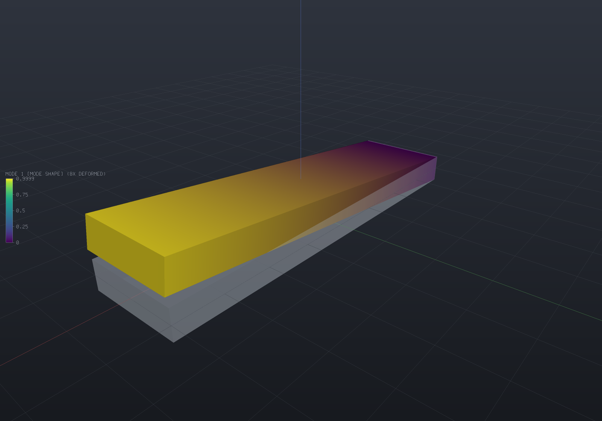

`EngrCAD.Fea` finds a part's **natural frequencies and mode shapes** on the same tetrahedral
meshes [the mesher](fea-meshing.md) produces, with the same materials and the same supports
the [structural solver](fea-structural.md) already takes. It solves the generalized
eigenproblem

```
K·phi = lambda·M·phi,    omega = sqrt(lambda),    f = omega / 2·pi
```

by shift-and-invert Lanczos over one sparse Cholesky factorization, and publishes each mode
shape as a [field](fields.md) a viewer can colour by and deform.

```csharp render:fea-modal-blade
var part = new Part("blade", Shape.Box(80, 20, 6));

// Meshing the PART's display mesh means the mode shapes land back on it exactly:
// every display vertex is an analysis boundary node, matched by value.
var surface = part.GetMesh();
var tets = TetMesher.Mesh(surface, new TetMeshOptions
{
    RefineQuality = true,
    MaxElementSize = 10,     // deliberately coarse - this page is a picture, not a study
});

var model = new StructuralModel(AnalysisMesh.Of(tets), Materials.Steel);
model.Fix(Facets.OnPlane(new Vector3d(-40, 0, 0), Vector3d.UnitX));

var results = ModalSolver.Solve(model, new ModalSolveOptions { ModeCount = 3 });

foreach (var field in results.SampleOnto(surface))
    part.AddResult(field);
part.FieldDisplay = new FieldDisplay
{
    Field = ModalResults.FieldNames.Shape(1),
    Deform = ModalResults.FieldNames.Shape(1),
    DeformScale = 8,
};

var scene = new Scene();
scene.Add(part);
```



The shape is the first bending mode, drawn at a deliberate exaggeration with the undeformed
blade ghosted behind it. `results.ToText()` prints the frequencies, the effective masses and
what the solve cost.

## Units, and why they come out in hertz

The **mm / N / MPa / tonne / s** system `ModelUnits` states once
([Materials & mass](materials.md#units-one-convention-stated-once)) is *consistent in
seconds*: one tonne is one N·s²/mm, so `lambda = K/M` has units
of 1/s² and `omega` and `f` come out in rad/s and Hz with no conversion. Use SI (m / N / kg)
and the same holds. Mix the two — a density in kg/m³ against a modulus in MPa — and the
frequencies are wrong by a factor of a thousand with nothing to catch it, which is why
`ModalSolver` refuses a zero density by name and quotes 7.85e-9 in the message.

## Rigid-body modes are an answer, not an error

The static solver **refuses** an unrestrained body: a linear static solve of one has no
unique answer, and it says which motions survive its supports rather than reporting a rank.
A modal analysis of the same body is perfectly well posed, and its six zero-frequency modes
are part of the answer — so the **same machinery** finds and describes them, and the modal
solver keeps them:

```csharp
var results = ModalSolver.Solve(model, new ModalSolveOptions { ModeCount = 3 });

foreach (var rigid in results.RigidBodyModes)
    Console.WriteLine($"{rigid.Description}: {rigid.Frequency:E2} Hz");
// translation along (1, 0, 0): 0.00E+000 Hz
// rotation about the axis through (50, 6, 4) along (1, 0, 0): 9.82E-004 Hz
// ...

Console.WriteLine(results.Mode(1).Frequency);   // the SEVENTH mode of the body
```

They are deliberately **not** part of `Modes`, and `VibrationMode.Number` starts at 1 on the
lowest mode that stores strain energy. Counting them among the structural modes is how a
report comes to claim a bracket's first natural frequency is 3e-4 Hz.

Underneath, they are also *deflated* out of the Krylov space, so the eigensolver never
spends iterations rediscovering them; and because `K` is singular when they exist, the
factorization takes a small negative shift (`ModalSolveReport.Shift`, reported). A fully
restrained model needs no shift at all and the report says **exactly zero** — that
factorization is literally the static solver's.

`RigidBodyMode.Eigenvalue` is the **measured** Rayleigh quotient of the exact rigid field.
In exact arithmetic it is zero; what it actually reads is how much round-off the assembled
stiffness carries, which makes it a conditioning measurement of that particular model rather
than a constant. Measured on the free-free beam below: the six values run from 3.8e-5 to
1.6e-3 against a first elastic eigenvalue of 6.8e8, i.e. **2.4e-12 of it at worst**, and the
corresponding frequencies are all below 3e-3 Hz against 4 162 Hz.

## Mode shapes have no amplitude and no sign

`phi` and `−2.7·phi` solve `K phi = lambda M phi` equally well, so a mode shape is a
direction in displacement space, not a displacement. Two conventions make the answer
reproducible without pretending otherwise:

- **`VibrationMode.Shape` is mass-normalised** (`phi' M phi = 1`). That is the scale every
  modal identity is stated in and the one `EffectiveMass` needs. Its magnitude is one over
  the square root of a mass, so it is *not* a displacement — plotting it directly would make
  a heavy part's mode look small and would change if the density did.
- **The published field is rescaled to a peak nodal magnitude of exactly 1** model length
  unit, and labelled `"mode shape"` rather than `"mm"`. So `DeformScale = 8` means "the
  most-displaced node moves 8 mm", which is a number a person can picture.
- **The sign is pinned** by making the largest-magnitude component positive. Re-solving the
  same model twice gives the same vector, which is what an animation or a committed image
  needs — but the negated vector is an equally valid mode, and that is a convention rather
  than physics.

Field names are `"Mode 1"`, `"Mode 2"`, … through `ModalResults.FieldNames.Shape(n)`. The
frequency is deliberately **not** in the name: a field name is a document-level handle that a
`FieldDisplay` stores and a saved document round-trips, and a name carrying a computed number
would stop resolving the moment a wall thickness changed.

## The mass matrix

The mass matrix is the thermal solver's [capacity matrix](fea-thermal.md) under another
name — both are `integral(constant · N_i · N_j dV)` — so it is one implementation with `rho`
in place of `rho·c`, replicated onto the 3x3 identity block per node pair because an
isotropic inertia couples no two axes.

**It needs a quadrature rule two degrees above the stiffness's**, and getting that wrong is
silent. A stiffness integrates `grad N · grad N`, degree `2(p−1)`; a mass integrates `N·N`,
degree `2p`. Use the stiffness's rule and an n-point rule gives a matrix of rank n — rank 1
of 4 for a linear element, rank 4 of 10 for a quadratic one, **singular either way** — while
`sum_ij N_i N_j = (sum_i N_i)² = 1` exactly, so the total is still exactly `rho·V`. The
obvious sanity check passes it.

The negative control that has teeth is the **rotational inertia**. A rigid rotation is linear
in position, so both element orders represent it exactly and `u' M u` must equal the
tetrahedron's own `omega' I omega`. Against `MeshMassProperties`' closed-form polyhedral
moments — independent arithmetic in another project — the production rule agrees to
**2.2e-16 … 9.4e-15 relative**, while the stiffness's one-point rule reports **−2.4e-27
against a true 1.4e-10**: no rotational inertia at all, because every entry being equal
collapses `u' M u` to the square of the mean nodal value and the mean of a rotation about the
centroid is zero.

### Lumping

| `MassLumping` | Available | What it buys |
| --- | --- | --- |
| `Consistent` | both orders (default) | the Galerkin matrix; converges at the element's own order, from **above** |
| `Hrz` | both orders | the consistent diagonal, rescaled to preserve the mass; converges from **below** |
| `RowSum` | **linear only** | the textbook diagonal; identical to `Hrz` for a 4-node tet |

**Row-sum lumping is refused by name for 10-node elements**, because there it is not an
approximation but a wrong answer: a quadratic tetrahedron's row sums are `−V/20` at every
*corner* node — a negative mass, a node that accelerates towards a force pushing it away. It
is the same integral that makes a quadratic element's consistent gravity load negative at the
corners, and no sign convention rescues it. HRZ takes the consistent matrix's own diagonal,
`rho·integral(N_i² dV)`, which is strictly positive for every shape function of every order,
and rescales it so the element's mass is preserved.

The reason to offer a lumped option at all is not accuracy — it is that the two **bracket**
the truth. Measured on a 16-element axial bar whose exact first frequency is 25 860.97 Hz:

| | measured | error |
| --- | ---: | ---: |
| Consistent | 25 895.53 Hz | **+0.134%** |
| HRZ / row sum | 25 812.76 Hz | **−0.186%** |

## Solving: this is where a direct factorization genuinely pays

`FeaSolveMethod.Direct` records, honestly, that the usual second argument for a direct solver
— factor once, solve many right-hand sides — **does not apply to the static solver**, which
factors and discards, so a second load case pays for a second factorization.

**Here it applies.** Shift-and-invert Lanczos factorizes `K − sigma·M` once and then spends
**one back-substitution per Lanczos step**. `ModalSolveReport.Iterations` says how many that
was, and it is the number that makes the argument concrete rather than rhetorical: on the
cases in this project's test suite, 18 to 23 solves off a single factorization for three to
eight modes. No iterative linear solver is offered for the modal path for the same reason —
it would have to converge afresh for every one of those steps.

The operator is `A^-1 M` in the M inner product, whose eigenvalues are `1/(lambda − sigma)`,
so the frequencies nearest the shift become the *largest* of the operator — and extreme
eigenvalues are what Lanczos converges to first. Every new basis vector is re-orthogonalized
against every previous one (two passes), which is what stops round-off manufacturing spurious
duplicate eigenvalues.

That reorthogonalization creates its own problem, and the fix is worth knowing about because
it explains the restart count in the report. A single-vector Krylov space contains **one**
vector from each eigenspace, so a genuine multiplicity — a square shaft's two identical
bending modes, every axisymmetric part — is invisible to it. Converged modes are therefore
*locked*: they join the deflation set, a fresh start vector is orthogonalized against them,
and the next run's extreme eigenvalue is the second copy. For multiplicity three and above,
`ModalSolveOptions.BlockSize` advances a whole block of vectors per step so up to that many
copies are carried by construction (see the limitations below).

## Verification

All of these are in `tests/EngrCAD.Fea.Tests`, on **structured** meshes (Kuhn's subdivision)
so that a measured convergence order means something.

### The axial bar, where there is no modelling gap

Every beam comparison below is against a beam *theory*, so its error is a discretization
error **plus** a modelling difference that no refinement removes. The bar fixture has
neither: with Poisson's ratio exactly zero the axial and transverse directions decouple
completely, and with the transverse degrees of freedom removed the three-dimensional problem
*is* the one-dimensional one, whose free-free frequencies are `n/(2L)·sqrt(E/rho)` exactly.

100 mm steel bar, 40 linear elements, against `n/(2L)·sqrt(E/rho)`:

| n | exact | measured | error |
| ---: | ---: | ---: | ---: |
| 1 | 25 861.0 Hz | 25 866.5 Hz | **+0.021%** |
| 2 | 51 721.9 Hz | 51 763.9 Hz | +0.081% |
| 3 | 77 582.9 Hz | 77 714.9 Hz | +0.170% |

Every one is *above* the exact value, and that is asserted as a strict inequality rather than
a tolerance: a consistent-mass finite element model is a Rayleigh quotient over a subspace,
so it can only be stiffer than the continuum.

**Convergence order** on the same bar, first mode, relative frequency error:

| linear | error | | quadratic | error |
| ---: | ---: | --- | ---: | ---: |
| 8 elements | 5.479e-3 | | 2 elements | 3.309e-3 |
| 16 | 1.336e-3 | | 4 | 1.885e-4 |
| 32 | 3.317e-4 | | 8 | 9.925e-6 |
| 64 | 8.278e-5 | | 16 | 5.691e-7 |
| **measured orders** | **2.04, 2.01, 2.00** | | | **4.13, 4.25, 4.12** |

against theory 2 and 4 — an eigenvalue converges at `O(h^2p)` for a degree-p element.

The fixed-fixed version of the same bar has no rigid-body modes, so its shift is **exactly
zero** and its errors are +0.025% / +0.095% / +0.194%.

### Cantilever, 100 × 10 × 10 mm steel, quadratic elements

`beta·L` = 1.875104 / 4.694091 / 7.854757; the square section makes every bending mode a
degenerate **pair**, so the three bending modes are numbers 1, 3 and 7 (a torsional mode and
an axial mode fall between the second and third pairs).

| | Euler-Bernoulli | measured | |
| --- | ---: | ---: | ---: |
| bending 1 (mode 1) | 835.5 Hz | 834.9 Hz | **−0.07%** |
| bending 2 (mode 3) | 5 236.1 Hz | 5 008.9 Hz | −4.34% |
| bending 3 (mode 7) | 14 661.2 Hz | 13 198.3 Hz | −9.98% |

**The gap grows with the mode number, and that is beam theory rather than a solver error.**
Euler-Bernoulli has no shear deformation and no rotary inertia; a solid has both, and both
soften it, increasingly so as the wavelength shortens while the section does not. Each
measurement is asserted to be *below* Euler-Bernoulli for that reason, and the size is
reported rather than tuned.

Refinement, first mode:

| mesh | elements | free DOF | measured | vs Euler-Bernoulli |
| --- | ---: | ---: | ---: | ---: |
| 5×1×1 | 30 | 270 | 852.10 Hz | +1.985% |
| 10×2×2 | 240 | 1 500 | 838.30 Hz | +0.334% |
| 20×2×2 | 480 | 3 000 | 834.92 Hz | −0.071% |
| 30×3×3 | 1 620 | 8 820 | 833.78 Hz | −0.208% |

Monotone from above, which is again a theorem rather than an observation: a coarser mesh is a
smaller subspace, so its Rayleigh quotient can only be larger. The sequence converges onto
the *3D* answer, which sits a little below the Euler-Bernoulli one — so the last row being
further from the formula than the row above it is the study working, not failing.

The degenerate pairs split by **0.043% / 0.076% / 0.132%**, and that split is a direct
measurement of the discretization: the two bending directions are geometrically identical,
but Kuhn's subdivision picks its diagonals by index order and no reflection preserves that —
the same asymmetry the static solver's stress-concentration "mesh spread" measures.

### Simply-supported beam, 100 × 12 × 8 mm

`beta·L = n·pi`. A rectangular section, so the two bending directions separate and each mode
can be identified with the `beta·L` it belongs to. This is the one case where the shear
correction has a closed form (the mode shape is a pure sine), so Timoshenko's first-order
factor is quoted beside it:

| mode | `beta·L` | Euler-Bernoulli | Timoshenko | measured | vs EB | vs Timoshenko |
| ---: | --- | ---: | ---: | ---: | ---: | ---: |
| 1 | 1·pi (weak) | 1 876.3 Hz | 1 856.2 Hz | 1 857.8 Hz | −0.98% | **+0.09%** |
| 2 | 1·pi (strong) | 2 814.4 Hz | 2 748.1 Hz | 2 751.5 Hz | −2.23% | **+0.12%** |
| 3 | 2·pi (weak) | 7 505.1 Hz | 7 199.3 Hz | 7 225.8 Hz | −3.72% | **+0.37%** |
| 4 | 2·pi (strong) | 11 257.6 Hz | 10 297.4 Hz | 10 361.7 Hz | −7.96% | **+0.62%** |

The 3D solve agrees with Timoshenko to under 0.7% at every mode while diverging from
Euler-Bernoulli by up to 8% — which is the clearest statement available that the divergence
belongs to the *theory*.

**A finding this fixture cost, and it is worth stating because it is a modelling trap rather
than a solver one.** The axial rigid translation has to be removed somehow, and the obvious
device — pinning `u_x` at a single node, exactly what a static 3-2-1 restraint does — is
wrong in dynamics. In statics a single-node restraint is a local disturbance Saint-Venant
confines to its own neighbourhood. In dynamics it creates a genuine mode in which the whole
body translates axially while a few elements around the pinned node deform, and its frequency
is set by the *mesh* rather than by the beam: measured on this fixture, a spurious mode at
**5 540 Hz**, sitting between the second and third bending modes and carrying 96% of the
axial effective mass. Holding `u_x = 0` along the beam's own **centroidal line** removes the
axial family instead, and adds no bending stiffness at all, because pure bending has
`u_x = −z·w'(x)` measured from the neutral axis and that is identically zero on it.

### Free-free beam, 100 × 12 × 8 mm

No supports at all — the model the static solver refuses.

- **Six rigid-body modes**, three named as translations and three as located rotation axes.
  Measured eigenvalues −1.110e-3, 2.005e-4, −1.648e-3, 3.807e-5, −1.080e-4, 1.611e-4 against
  a first elastic eigenvalue of 6.84e8: at worst **2.41e-12 of it**. The corresponding
  frequencies are all under 2.3e-3 Hz.
- **The seventh mode is the first elastic one**: `beta·L = 4.730041`, Euler-Bernoulli
  4 253.3 Hz, measured **4 162.1 Hz (−2.14%)**. The second is 6 379.9 Hz against 6 082.1 Hz
  (−4.67%).

### Orthogonality

`phi_i' M phi_j` and `phi_i' K phi_j` assembled **independently of the solver**, element by
element, on a 6×2×2 cantilever with five modes:

| | worst `abs(phi_i' M phi_j − delta_ij)` | worst `abs(phi_i' K phi_j − lambda_i·delta_ij) / lambda_i` |
| --- | ---: | ---: |
| Linear | 7.105e-15 | 5.766e-13 |
| Quadratic | 7.550e-15 | 1.642e-11 |

### Effective mass

Summed over *all* modes the effective masses recover `iota' M iota` exactly, which is what
makes "have I extracted enough modes?" a question with a numeric answer (the usual bar is
90%). A uniform cantilever's first bending mode classically carries **0.6132** of the beam's
mass; measured on the 100 × 12 × 8 quadratic cantilever, **61.09%**.

On a *square* section that number splits in a way worth knowing about: modes 1 and 2 are
degenerate, and the eigenvectors of a degenerate eigenspace are an arbitrary orthonormal
basis of it, so each comes out as a mixture of the two bending directions and carries half
the effective mass in each (measured: 2.399e-5 in Y **and** 2.399e-5 in Z, for both). A
per-direction effective mass is therefore a property of an *eigenspace*, not of a mode,
wherever the spectrum is degenerate.

## Limitations

- **These are UNDAMPED natural frequencies**, which is what a modal analysis means. Damping,
  and the steady-state response it makes finite, are on the
  [buckling and frequency response page](fea-buckling.md).
- **No transient dynamics.** Direct time integration needs a different stepping loop, and is
  filed.
- **Prestress is available but off by default.** A spinning or preloaded part's frequencies
  shift, and `ModalSolveOptions.Prestress` adds the geometric stiffness a static solve's
  stress field produces — see [stress stiffening](fea-buckling.md#stress-stiffening-the-frequencies-of-a-preloaded-part).
- **Multiplicity three and above wants a BLOCK, and there is one.**
  `ModalSolveOptions.BlockSize` (default 1, the incumbent scalar path byte for byte) advances
  b vectors per Lanczos step, so a repeated eigenvalue of multiplicity up to b is recovered by
  construction — measured on synthetic exact triples and quadruples, where the scalar path
  returns `{f1, f1, f2}` for a truth of `{f1, f1, f1}` with every returned mode carrying a
  tiny residual (each IS an eigenpair, which is why nothing inside the iteration can notice a
  copy is missing). Set it to the largest multiplicity the model's symmetry can produce;
  real meshes usually SPLIT their theoretical multiplicities, which is why 1 stays the
  default.
- **Sliver elements are the real constraint, and they belong to the mesher** — refused by
  name here by the same shared guard both other solvers ask.
