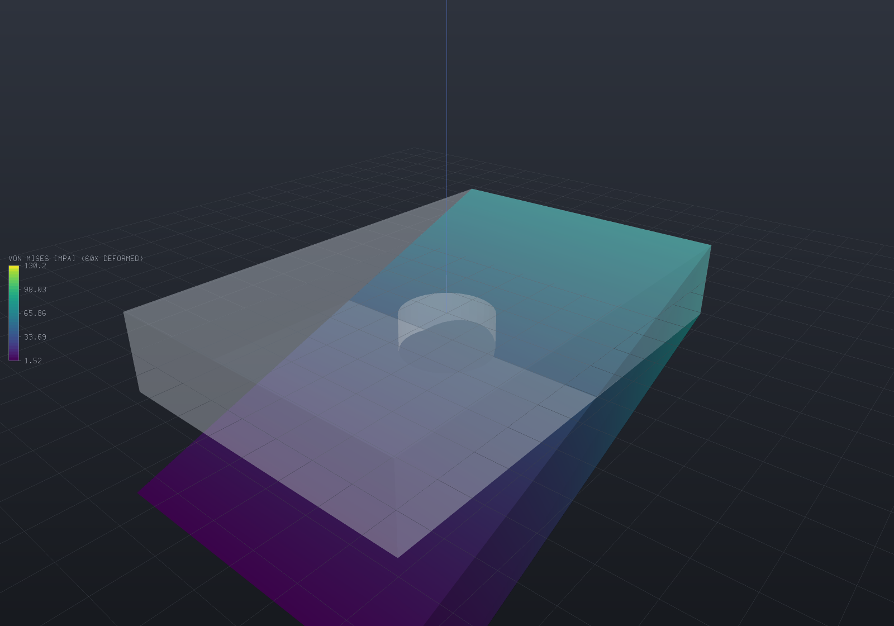

# Structural analysis (linear static)

`EngrCAD.Fea` solves **small-strain linear elasticity** on the tetrahedral meshes
[the mesher](fea-meshing.md) produces: 4-node or 10-node elements, boundary conditions
named through the same facet tags the mesher carries, a sparse symmetric solve on
`EngrCAD.Core.Solvers`, and results published as [fields](fields.md) that the viewer's
colour map and deformed-shape overlay pick up with no extra wiring.

The whole pipeline is five statements: mesh the surface, wrap it in a model, say what is
held and what pushes, solve, publish.

```csharp render:fea-structural-bracket
var bracket = Shape.Box(60, 40, 10)
    .Subtract(Shape.Cylinder(6, 40).Translate(0, 0, -20));
var part = new Part("bracket", bracket);

// Meshing the PART's display mesh means the results land back on it exactly:
// every display vertex is an analysis boundary node, matched by value.
var surface = part.GetMesh();
var tets = TetMesher.Mesh(surface, new TetMeshOptions
{
    RefineQuality = true,
    MaxElementSize = 14,     // deliberately coarse - this page is a picture, not a study
});

var model = new StructuralModel(AnalysisMesh.Quadratic(tets), Materials.Aluminium6061);
model.Fix(Facets.OnPlane(new Vector3d(-30, 0, 0), Vector3d.UnitX));
model.Force(Facets.OnPlane(new Vector3d(30, 0, 0), Vector3d.UnitX), new Vector3d(0, 0, -1200));

var results = StructuralSolver.Solve(model);

foreach (var field in results.SampleOnto(surface))
    part.AddResult(field);
part.FieldDisplay = new FieldDisplay
{
    Field = StructuralResults.FieldNames.VonMises,
    Deform = StructuralResults.FieldNames.Displacement,
    DeformScale = 60,
};

var scene = new Scene();
scene.Add(part);
```



The bracket is fixed on its left face and pulled down by 1200 N on its right. The shape
drawn is the **deformed** one at 60x exaggeration, ghosted over the original, and the
colours are von Mises stress in MPa. The maximum is on the bore wall — measured, the peak
node sits at radius 6.000 on a radius-6 hole — which is the classic stress concentration
rather than the built-in edge an eye goes to first.

> [!NOTE]
> That mesh is coarse on purpose, so this page builds in about four seconds. Its
> displacement is converged to under a percent but its **peak stress is not** — a
> concentration needs a much finer mesh at the feature. The verification numbers below are
> from the test suite, not from this picture.

## Units

The **mm / N / MPa / tonne / s** system `ModelUnits` states once for the whole repository:
lengths and displacements in mm, forces in N, stresses and moduli in MPa = N/mm² (steel
E = 210 000), **densities in tonne/mm³** (steel 7.85e-9), accelerations in mm/s²
(`Materials.GravityMillimetres` = 9806.65). The quantity table and the reasoning behind
the density choice are on the [Materials & mass](materials.md#units-one-convention-stated-once)
page — one statement, cross-referenced, rather than a copy per solver that could drift.

## Saying what is held and what pushes

A boundary condition names a **facet selector**. Tags are the durable handle: pass B-Rep
face ids through `TetMeshOptions.FacetTags` and a condition names a face rather than a
coordinate, the way the rest of EngrCAD's [selection vocabulary](selection.md) works. The
geometric selectors are for meshes that carry no tags — an imported STL, or a quick script.

| Selector | Picks |
| --- | --- |
| `Facets.Tag(id)` / `Facets.Tags(...)` | Facets carrying those tags |
| `Facets.OnPlane(point, normal)` | Facets lying in a plane (centroid on it **and** normal parallel to it) |
| `Facets.FacingAlong(direction, angle)` | "The top surface", "the loaded flank" |
| `Facets.InBox(aabb)` | Facets whose centroid is inside a box |
| `Facets.All`, `Facets.And`, `Facets.Or` | Everything, and the combinators |

| Condition | Meaning |
| --- | --- |
| `Fix(selector, dofs)` | A support. `Dof.All` clamps; `Dof.Z` alone is a roller |
| `FixNode(node, dofs)` | One node — how a statically determinate 3-2-1 restraint is built |
| `Prescribe(selector, displacement, dofs)` | An enforced deflection; the reaction is what a support at that displacement carries |
| `Pressure(selector, p)` | Uniform pressure. **Positive pushes INTO the body** |
| `Traction(selector, vector)` | Uniform force per unit area |
| `Force(selector, total)` | A total force spread over the selection — the resultant is exact |
| `Gravity(acceleration)` | Body load from the elements' own material densities |
| `BodyForce(p => vector)` | A general body force per unit volume |
| `NodalForce(node, force)` | A point load (whose local stress does not converge — see below) |

A selector that matches **nothing** is refused where it was written, naming the tags that
do exist. A quietly ineffective support surfaces much later as a singular system, and the
message there cannot point at the typo.

## Several materials in one model

`TetMesher` tags each element with the index of the body it filled, and
`SetMaterial(region, material)` assigns a material to a region id — a correspondence that
is right only as long as two separately written lists stay in the same order.
**`AnalysisBody` makes it a fact rather than a convention**: one list of
`(surface, material, name)` drives both the mesh and the model, and it is also the seam
with the document model, since a `Part` already knows both halves.

```csharp run:fea-two-materials
var steelBar = new Part("steel bar", Shape.Box(40, 6, 6).Translate(20, -6, 3))
    .Of(Materials.Steel);
var alloyBar = new Part("alloy bar", Shape.Box(40, 6, 6).Translate(20, 6, 3))
    .Of(Materials.Aluminium6061);

// The ONE list. Nothing below names a region id.
var bodies = new[] { steelBar, alloyBar }
    .Select(p => new AnalysisBody(p.GetMesh(), p.Material, p.Name))
    .ToList();

var tets = TetMesher.Mesh(bodies, new TetMeshOptions { RefineQuality = true, MaxElementSize = 3.0 });
var model = StructuralModel.For(tets, bodies);       // region i takes bodies[i].Material
model.Fix(Facets.OnPlane(new Vector3d(0, 0, 0), Vector3d.UnitX));
model.Force(Facets.OnPlane(new Vector3d(40, 0, 0), Vector3d.UnitX), new Vector3d(0, 0, -200));

var results = StructuralSolver.Solve(model);

double Tip(int side)
{
    double worst = 0;
    for (int n = 0; n < model.Mesh.NodeCount; n++)
    {
        var p = model.Mesh.Position(n);
        if (Math.Abs(p.X - 40) > 1e-9 || Math.Sign(p.Y) != side) continue;
        worst = Math.Min(worst, results.DisplacementAt(n).Z);
    }
    return -worst;
}

// A cantilever's deflection goes as 1/E, so the aluminium bar sinks about three times
// as far as its steel twin - measured 0.0756 mm against 0.2284 mm, a ratio of 3.02
// against the moduli's 3.05 (the small gap is that the mesher gave the two bars
// slightly different discretizations, not the materials).
double ratio = Tip(+1) / Tip(-1);
if (ratio < 2.9 || ratio > 3.2) throw new Exception($"expected ~3.05, got {ratio}");
```

`ThermalModel.For` reads the same list to the same answer, so a coupled run states what
things are made of exactly once. Refused by name, before anything is assembled: a body
with no material, a mesh region no body declares, and a declared body that contributed no
elements.

> [!IMPORTANT]
> **v1 meshes DISJOINT bodies — two mating along a face are refused.** Welding the shared
> vertices *would* mesh, and the result would look right and be wrong: an inter-body face
> is never recovered onto the input plane, so an element straddling the interface takes one
> material for its whole volume and the material boundary becomes a jagged surface of the
> mesher's choosing rather than the plane that was drawn. Until conforming interfaces land,
> a bonded bi-material part is meshed as one surface with one material, and `AnalysisBody`
> serves genuinely separate bodies analysed together.

## Directional materials — orthotropic and anisotropic

A laminate, a rolled plate and a printed part are all stiffer in one direction than
another, and `Material` cannot say so: it is an *isotropic* description, and it lives in
`EngrCAD.Core` because a bill of materials and a viewer need it too. **`ElasticLaw` sits
beside it rather than replacing it** — the law supplies the elasticity (and, if it states
one, the directional thermal expansion), while density, name and the thermal transport
properties still come from the `Material`, so a modal solve of a composite part integrates
the same density a BOM weighs it with.

The frame is the other half of the statement, and it is deliberately an input to the law
rather than a property of the material: *which way the fibres run in this part* is not a
property of the stuff.

```csharp run:fea-orthotropic-lamina
// A unidirectional carbon/epoxy lamina - nominal figures, verify against a datasheet.
const double e1 = 135_000, e2 = 9_000, nu12 = 0.30, nu23 = 0.45, g12 = 4_800;

// Fibres at 30 degrees to the bar's axis, in the XY plane.
double angle = 30 * Math.PI / 180;
var fibreFrame = Frame3d.FromOrthonormal(
    Vector3d.Zero,
    new Vector3d(Math.Cos(angle), Math.Sin(angle), 0),
    new Vector3d(-Math.Sin(angle), Math.Cos(angle), 0));

var lamina = ElasticLaw.TransverselyIsotropic(fibreFrame, e1, e2, nu12, nu23, g12, "carbon UD");

var bar = new Part("bar", Shape.Box(40, 10, 4).Translate(20, 0, 0));   // x from 0 to 40
var tets = TetMesher.Mesh(bar.GetMesh(), new TetMeshOptions { RefineQuality = true, MaxElementSize = 3.0 });

// The Material still carries the density and the name; the law carries the stiffness.
var carrier = new Material("carbon UD", e1, 0.30, 1.6e-9);
var model = new StructuralModel(tets, carrier);
model.SetElasticity(0, lamina);

// Statically determinate: the whole end face held axially, then just enough more to
// remove the two transverse translations and the roll. A uniform uniaxial STRESS state
// satisfies all of it exactly, whatever the anisotropy.
const double sigma = 25.0;                       // MPa, a uniform end pull
model.Fix(Facets.OnPlane(Vector3d.Zero, Vector3d.UnitX), Dof.X);

int Corner(double y, double z)
{
    int best = -1;
    double bestScore = double.MaxValue;
    for (int n = 0; n < model.Mesh.NodeCount; n++)
    {
        var p = model.Mesh.Position(n);
        if (Math.Abs(p.X) > 1e-9) continue;
        double score = Math.Abs(p.Y - y) + Math.Abs(p.Z - z);
        if (score < bestScore) { bestScore = score; best = n; }
    }
    return best;
}

model.FixNode(Corner(-5, -2), Dof.Y | Dof.Z);
model.FixNode(Corner(+5, -2), Dof.Z);
model.Traction(Facets.OnPlane(new Vector3d(40, 0, 0), Vector3d.UnitX), new Vector3d(sigma, 0, 0));

var results = StructuralSolver.Solve(model);
var strain = results.ElementStrain(0);
double apparent = sigma / strain.Xx;

// The classical off-axis modulus: 1/Ex = c^4/E1 + s^4/E2 + (1/G12 - 2 nu12/E1) s^2 c^2.
double c2 = Math.Cos(angle) * Math.Cos(angle), s2 = Math.Sin(angle) * Math.Sin(angle);
double classical = 1.0 / (c2 * c2 / e1 + s2 * s2 / e2 + (1.0 / g12 - 2.0 * nu12 / e1) * s2 * c2);

// 20 267 MPa - a seventh of the fibre-direction stiffness, at 30 degrees off axis.
if (Math.Abs(apparent - classical) > 1e-6 * classical)
    throw new Exception($"expected {classical:F1} MPa, got {apparent:F1}");

// And the bar SHEARS under a pure pull, which is the behaviour no isotropic law has.
if (Math.Abs(strain.Xy) < 1e-3 * Math.Abs(strain.Xx))
    throw new Exception("an off-axis lamina must show shear-extension coupling");
```

Three factories, in increasing generality:

| | states | for |
| --- | --- | --- |
| `ElasticLaw.TransverselyIsotropic` | 5 constants + frame | a unidirectional lamina, a drawn bar, a printed part's layer stack |
| `ElasticLaw.Orthotropic` | 9 constants + frame | a woven laminate, a rolled plate, wood |
| `ElasticLaw.Anisotropic` | the 6x6 matrix + frame | anything else, including a homogenised microstructure |

The **minor** Poisson's ratios are derived from the symmetry `nu_ji / E_j = nu_ij / E_i`
rather than taken as inputs — supplying both is how a datasheet transcription comes to
contradict itself, and the contradiction would make the matrix non-symmetric with nothing
to catch it. What *is* checked, by name, is that the compliance matrix is **positive
definite**: the classical restriction `|nu_ij| < sqrt(E_i / E_j)` plus a determinant
condition coupling all three *is* that statement, and a Cholesky is the statement rather
than a re-derivation of it. Without the check a plausible-looking transcription gives a
material that releases energy when strained, and the symptom is a factorization failure
deep in the solver rather than a message about the material.

Thermal expansion is directional too, and it is stated on the **law**:

```csharp
var withExpansion = lamina.WithThermalExpansion(fibreFrame, -0.5e-6, 28e-6, 28e-6);
```

An expansion stated on the law always wins over the `Material`'s scalar coefficient, and a
*directional* region that states none is **refused by name** rather than inheriting one —
the scalar route builds its load from the material's Lamé parameters, which are not that
region's stiffness at all, so the inherited number would have no well-defined meaning.
Rotating a directional expansion off its own axes produces genuine **shear** terms (a heated
off-axis lamina shears), which is why the free strain is carried as a six-component vector
rather than three numbers.

> [!NOTE]
> An isotropic model is untouched by all of this, deliberately and provably: the assembly
> branches on `ElasticLaw.IsIsotropic`, so a model that states no law assembles through
> exactly the arithmetic it did before — bit for bit, asserted — while the general `B'DB`
> path is separately asserted to agree with the index form to round-off on an isotropic
> law. Anisotropy costs nothing until it is asked for, and cannot silently change what a
> plain steel bracket reports.

Modal, buckling, harmonic and transient solves all read the same law, because they all
assemble their stiffness through `FeaAssembly`.

## Reading the answer

```csharp run:fea-structural-report
var plate = Shape.Box(50, 30, 8);
var part = new Part("plate", plate);
var surface = part.GetMesh();
var tets = TetMesher.Mesh(surface, new TetMeshOptions { RefineQuality = true, MaxElementSize = 12 });

var model = new StructuralModel(AnalysisMesh.Of(tets), Materials.Steel);
model.Fix(Facets.OnPlane(new Vector3d(-25, 0, 0), Vector3d.UnitX));
model.Force(Facets.OnPlane(new Vector3d(25, 0, 0), Vector3d.UnitX), new Vector3d(0, 0, -800));
model.Gravity(Materials.GravityMillimetres);

var results = StructuralSolver.Solve(model);
Console.WriteLine(results.Report.ToText());
Console.WriteLine($"peak von Mises {results.MaxVonMises:F2} MPa at node {results.MaxVonMisesNode}");
Console.WriteLine($"largest displacement {results.MaxDisplacement:F4} mm");

// Global force equilibrium must hold to round-off for ANY correct model - it is the
// cheapest end-to-end check there is, and nothing about it is visible in a stress plot.
if (results.Report.EquilibriumResidual > 1e-9)
    throw new Exception($"equilibrium residual {results.Report.EquilibriumResidual:E3}");

// ParaView, for anything the viewer does not show.
results.WriteVtu(Path.Combine(Path.GetTempPath(), "plate.vtu"));
```

`FeaSolveReport` is a value, not a log line: sizes, factor fill, timings per phase, the
solve residual, strain energy, the applied and reaction resultants, and the equilibrium
check. `StructuralSolveOptions.EstimateCondition` adds a power-iteration estimate of the
stiffness matrix's condition number — the number that tells a badly shaped mesh from a
badly posed model.

Beyond the report, `StructuralResults` gives nodal `Displacement`, averaged `NodalStress`
and `NodalVonMises`, `PrincipalStress`, per-element `ElementStress`/`ElementStrain`, and
`Reactions`. **Element values are kept public on purpose**: the nodal values are a
volume-weighted average of the elements meeting at a node, which is what a colour map
wants and what converges — and it also smooths a genuine discontinuity at a material
interface or a re-entrant corner. The jump between neighbouring elements is the standard
error indicator, and averaging is the standard way to hide a mesh that is too coarse.

## Is the mesh good enough? Stress recovery and the error estimate

A solve returns a number whatever the mesh. `StructuralResults.ErrorEstimate` is the answer
to whether that number is worth anything — the energy-norm gap between the element stress
field and its **superconvergent recovery**, per element and overall.

The premise is where the stress is sampled. A displacement-based element's stress is one
order lower than its displacement and jumps across faces, and inside the element it is most
accurate at the Gauss points and *least* accurate at the nodes — which is where a colour map
reads it. `StressRecovery.Superconvergent` fits a polynomial to the good points over each
patch of elements and evaluates it at the nodes.

```csharp run:fea-error-estimate
var part = new Part("bracket", Shape.Box(50, 30, 8));
var tets = TetMesher.Mesh(part.GetMesh(), new TetMeshOptions { RefineQuality = true, MaxElementSize = 6 });

var model = new StructuralModel(tets, Materials.Steel);
model.Fix(Facets.OnPlane(new Vector3d(-25, 0, 0), Vector3d.UnitX));
model.Force(Facets.OnPlane(new Vector3d(25, 0, 0), Vector3d.UnitX), new Vector3d(0, 0, -400));

var results = StructuralSolver.Solve(model);

double direct = results.MaxVonMises;
results.Recovery = StressRecovery.Superconvergent;
double recovered = results.MaxVonMises;

var estimate = results.ErrorEstimate;
Console.WriteLine(estimate);                       // "estimated error 12.4% (...)"
Console.WriteLine($"peak {direct:F1} -> {recovered:F1} MPa");

// The per-element map is what an adaptive refinement loop would consume.
int worst = estimate.WorstElement;
Console.WriteLine($"worst element {worst}, error {estimate.ElementError[worst]:E3}");

if (estimate.ElementError.Count != model.Mesh.ElementCount) throw new Exception("one value per element");
if (double.IsNaN(estimate.RelativeError)) throw new Exception("this mesh has interior nodes, so it must estimate");
if (!(estimate.RelativeError > 0)) throw new Exception("a coarse mesh should report some error");
```

`Direct` remains the default: every verification figure in this project was measured through
it, and a recovered field is smooth by construction, so at a *genuine* discontinuity — a
material interface, a re-entrant corner — it smooths harder than averaging does. Recovery is
a better answer for the common case, not a better answer.

> [!IMPORTANT]
> **The estimate reports `NaN`, not zero, when it cannot estimate.** A mesh with no interior
> corner node has no patch to fit, so the "recovered" field *is* the finite-element field and
> the arithmetic gives the distance from something to itself — measured on a 24-element box,
> 9.9e-15 against a true error of 0.313. That would call the mesh perfect on exactly the mesh
> too coarse to assess. `ErrorEstimate.FallbackNodes` counts the partial case for the same
> reason: a recovery that quietly did not happen must not look like one that did.

## Elements

| | Linear (4-node) | Quadratic (10-node) |
| --- | --- | --- |
| Built by | `AnalysisMesh.Of(tets)` | `AnalysisMesh.Quadratic(tets)` |
| Strain within an element | constant | linear |
| Integration | 1 point (exact) | 4 points, degree 2 (exact for straight-sided elements) |
| Nodes | the mesh's vertices | vertices + one per edge, about 7-8x as many |
| Displacement convergence | O(h²) | O(h³) |
| Energy convergence | O(h) | O(h²) |

Quadratic elements are worth their cost for anything involving bending or a stress
concentration, and the tables below say by how much. `QuadraticTetMesh` is a pure function
of the linear mesh — mid-edge nodes at exact midpoints, so elements stay straight-sided,
which is what makes the 4-point rule exact.

## Solving

The default is sparse Cholesky with an **AMD fill-reducing ordering**, and that ordering is
not a micro-optimisation. On a 6 552-DOF 10-node cantilever it cut the factor from 19.4
million entries to 1.7 million and the factor time from 64.8 s to 0.34 s — **11.3x less
fill and 191x faster** — because fill is what decides whether a quadratic solve is
practical at all.

`FeaSolveMethod.ConjugateGradient` is the alternative, and the honest measurement is that
**it usually wins** — by a lot, on anything big. Interleaved in one sitting (Release):

| | free DOF | direct | CG | winner |
| --- | ---: | ---: | ---: | :-- |
| linear | 2 160 | 247 ms | 122 ms | CG 2.0x |
| linear | 14 688 | 10 754 ms | 705 ms | CG 15.3x |
| linear | 46 800 | 108 459 ms | 2 232 ms | **CG 48.6x** |
| quadratic | 6 552 | 308 ms | 354 ms | direct 1.1x |
| quadratic | 14 688 | 2 688 ms | 1 094 ms | CG 2.5x |

That is the opposite of the crossover measured on a Laplacian, which is the point: such a
comparison measures the *operator's conditioning*, not the two algorithms.

**The direct solver keeps the default because it is exact, not because it is fast.** The
verification numbers below — a patch test reproduced to round-off, strain at 1e-13 — are
statements that cannot be made about an iterative solve stopped at a relative residual, and
a default of CG would make every one of them a claim about an opt-in path. **Pass
`ConjugateGradient` for a large single solve**; past ~15 000 unknowns it is not close. No
automatic size-based switch is offered, deliberately: a threshold taken from one cantilever
would be the same mistake the table above documents.

You do not have to remember that, though — **the report tells you**. When a direct
factorization both takes real time and dominates its own solve, `FeaSolveReport.Advisory`
says what this run spent where and what the benchmark measured at a comparable size, and
`ToText()` prints it. It fires on what *happened*, not on size: a system that factors
quickly stays silent however large it is.

### Several load cases at once

The other classic argument for a direct solver — factor once, substitute many right-hand
sides — is what `SolveAll` exists for. Build every case over **one** `AnalysisMesh` object,
vary the loads (and prescribed *values*, if you use them), and the assembly and
factorization happen once:

```csharp
var cases = loads.Select(f =>
{
    var m = new StructuralModel(mesh, Materials.Steel);
    m.Fix(Facets.Tag(1));
    m.Force(Facets.Tag(2), f);
    return m;
}).ToList();

var results = StructuralSolver.SolveAll(cases);
```

Measured against the same cases solved one at a time (Release, alternating in one sitting):
**3.5–3.8x for four cases and 6.9x for eight**, because an extra right-hand side costs
0.7–27 ms where the factorization costs 34–4 706 ms. It also moves the direct-vs-iterative
comparison, since CG reuses nothing and would pay for N whole runs.

What the cases must share — the mesh *object*, the restraint mask, the materials — is
checked and refused by name. That matters more than it sounds: pushing one case's loads
through another's factorization returns a displacement field that converges, passes its own
residual check, and is the answer to a different model.

A `SolveAll` pair is also exactly what [fatigue post-processing](fea-fatigue.md)
consumes: the two extremes of a duty cycle, decomposed into per-node alternating and
mean stress.

### Watching, and stopping

That advisory helps the second run and not the first, so every solve entry point also takes
Core's optional trailing `ProgressCancel`:

```csharp
using var source = new CancellationTokenSource();   // wire this to a Cancel button
var watch = new ProgressCancel(source.Token, fraction => Console.WriteLine($"{fraction:P0}"));

var results = StructuralSolver.Solve(model, null, watch);
```

Cancellation reaches `SparseCholesky.Factorize`'s per-column elimination loop, which is the
only thing that makes the parameter honest — the factorization is 99% of a slow solve, so a
cancellation that could not reach it would advertise something it cannot do. It reaches the
conjugate-gradient path too, and the transient thermal stepper.

The **fraction** is the factorization's own, and that is a measurement rather than a
shortcut: on any model slow enough to want a progress bar the factorization *is* the solve.
Inside it the fraction counts *work*, not columns — a factor that fills has done only about
an eighth of its arithmetic at the halfway column. Assembly and the reaction pass poll for
cancellation but report no fraction, and an iterative solve reports none at all, because an
iteration count is not progress.

Supports are **eliminated, not penalised**: constrained degrees of freedom are removed from
the system rather than given a large diagonal, so the reduced matrix is genuinely positive
definite and its conditioning is the model's own.

## Refusals

An unrestrained body is refused **before** the factorization, per connected body, with the
surviving motion described rather than counted:

```
The model is not restrained: 3 rigid-body modes survive the supports
(rotation about the axis through (10, 7.5, 5) along (1, 0, 0); ...).
1 node is restrained in all. A linear static solve of an unrestrained body has no
unique answer; add supports, or restrain the six rigid-body degrees of freedom
statically (a 3-2-1 scheme) if the loads are self-equilibrated.
```

The check is per **connected body**, because a fully fixed part beside a floating one is
singular in a way no whole-model rigid mode describes. Letting the factorization discover
it instead gives "nonpositive pivot at column 4713", which tells nobody anything.

Also refused by name: a selector matching no facets; a model with every degree of freedom
restrained; an element whose Jacobian is non-positive in double precision (which a sliver
can be while the exact predicate still calls it valid — see the limitations below); and a
Poisson's ratio at or past 0.5, where the material is incompressible and a
displacement-based element cannot represent it.

## Verification

A solver is worth exactly what its verification is worth, so here is all of it. Every
number is from `tests/EngrCAD.Fea.Tests`, on structured meshes so that a measured
convergence order means something.

**Patch tests** — a constant-strain state must be reproduced *exactly*, to round-off, by
both element types. This is the standard correctness gate and it catches essentially every
assembly, indexing and Jacobian error outright.

| Test | Linear | Quadratic |
| --- | --- | --- |
| Displacement patch: relative displacement error | 2.4e-15 | 1.8e-14 |
| Displacement patch: relative strain error | 9.1e-14 | 1.5e-13 |
| Traction patch: stress error against 25 MPa | 3.9e-12 | 1.1e-11 |
| Traction patch: relative displacement error | 4.0e-14 | 2.5e-13 |

**Convergence order** (manufactured solution, cubic displacement field, Dirichlet
everywhere — no singularity for the rate to be limited by):

| | L2 order measured | theory | energy order measured | theory |
| --- | ---: | ---: | ---: | ---: |
| Linear | **2.00** | 2 | **1.00** | 1 |
| Quadratic | **3.03** | 3 | **2.02** | 2 |

**Cantilever tip deflection**, 100 x 10 x 10 mm, 1000 N tip load, steel:

| | h | elements | tip (mm) | error |
| --- | ---: | ---: | ---: | ---: |
| linear | 5.00 | 192 | 0.55157 | -71.0% |
| linear | 2.50 | 1 536 | 1.15880 | -39.2% |
| linear | 1.25 | 12 288 | 1.63297 | -14.3% |
| quadratic | 10.00 | 24 | 1.81094 | -4.9% |
| quadratic | 5.00 | 192 | 1.87899 | -1.4% |
| quadratic | 2.50 | 1 536 | **1.89778** | **-0.4%** |

Euler-Bernoulli `PL³/3EI` gives **1.90476 mm**; Timoshenko, adding the shear term
`PL/(kGA)` with k = 5/6, gives **1.91962 mm**. The extrapolated finite-element limit is
**1.90494 mm** — **+0.01% from Euler-Bernoulli and -0.76% from Timoshenko**.

That near-perfect agreement with the *simpler* beam model is a coincidence of two effects
cancelling, and saying so is the point: a 3D solve includes shear deformation, which
softens it towards Timoshenko, while the built-in end here is a genuine three-dimensional
clamp — every displacement zero over that whole face — which suppresses the Poisson
contraction and warping beam theory allows and stiffens it back. Note also that linear
tetrahedra are **very** stiff in bending: 14% low with twelve thousand elements, against
0.4% for quadratic elements with an eighth as many.

**Stress concentration**, a 120 x 40 x 2 mm plate with a Ø10 central hole (d/W = 0.25) in
plane strain:

| | elements | K_tn measured | vs Howland |
| --- | ---: | ---: | ---: |
| linear | 768 | 1.8352 | -24.6% |
| linear | 3 072 | 2.1941 | -9.8% |
| linear | 12 288 | 2.3566 | -3.1% |
| quadratic | 768 | 2.3206 | -4.6% |
| quadratic | 3 072 | **2.4216** | **-0.4%** |

Kirsch's classical answer for an *infinite* plate is K_t = 3. **The finite-width
correction matters and has to be stated**: Howland's exact strip solution in Peterson's
polynomial fit (Chart 4.1), against the **net** section stress, is
`K_tn = 2 + 0.284L - 0.600L² + 1.32L³` with `L = 1 - d/W`, which at d/W = 0.25 gives
**2.4324** — equivalently 3.2432 against the gross section, nearly 8% above the textbook 3.
The far-field stress is recovered to 0.03% on the finest quadratic mesh and 0.37% on the
coarsest linear one, which is the check that makes every K_t above mean anything.

**Stress recovery** — the claim is a rate, so it is measured as an L2 norm of the nodal
stress field against the exact one, integrated inside the elements over a refinement
sequence on the same manufactured solution:

| | direct | recovered | direct rate | recovered rate |
| --- | ---: | ---: | ---: | ---: |
| linear, 12 288 el | 2.302e-2 | **1.599e-3** | 1.418 | **2.300** |
| quadratic, 1 536 el | 2.669e-3 | **2.348e-4** | 2.000 | **2.761** |

against theory 1/2 and 2/3 — **14.4× and 11.4× more accurate**, at a clearly higher rate.
The quadratic rate settling near 2.76 rather than 3.00 is reported as measured: full p+1
recovery on tetrahedra is weaker than on hexahedra. The **effectivity index** (estimated over
true error, energy norm) runs 0.9544 → 0.9848 → **0.9955** for linear elements and
1.0187 → 1.0150 → **1.0128** for quadratic — monotone toward 1 from below and above — and a
linear stress field is recovered **exactly** (1.1e-12 of 3.2e2) with the estimated error
0.00%.

**Directional materials**, all exact rather than converging — a uniform stress state in a
prismatic bar is a constant strain, hence a linear displacement field, which is *in* the
linear-tetrahedron space:

| | measured | reference |
| --- | ---: | --- |
| off-axis lamina at 0° | 135 000.00 MPa | E1 exactly |
| at 30° | 20 267.42 MPa | classical `1/Ex = c⁴/E1 + s⁴/E2 + (1/G12 - 2ν12/E1)s²c²` |
| at 45° | 12 406.66 MPa | same, agreeing to 1e-12 relative |
| at 90° | 9 000.00 MPa | E2 exactly |

with the whole strain tensor reproduced to **4.4e-17 against a 2.0e-3 scale** and the
uniform stress state to 1.4e-12 of 25 MPa. The expected strain is built by **3x3 tensor
rotation** — rotate the stress into the material frame, apply the compliance there, rotate
the strain back — which shares nothing with the production path's Voigt stress
transformation but the physics; the classical modulus formula is then a third reading of
the same number. The **shear-extension coupling** is asserted separately (−7.9e-4 at 30°,
exactly zero on axis), because it is the one behaviour no isotropic law can produce and the
one a transposed rotation would lose. Directional expansion: a free bar strains by exactly
`alpha_i·dT` (1.1e-17 of 1.7e-3) with residual stress at 1.2e-13 of the 15.12 MPa a
restrained bar would carry, and a fully restrained bar carries σ = (−12.72, −27.95, −27.95)
MPa — three genuinely different numbers — to 3.6e-15.

**Rigid-body and equilibrium** properties, all satisfied to round-off:

- Every element's stiffness annihilates all six rigid-body modes (both orders).
- A rigid motion prescribed on the boundary produces a rigid motion inside, with strain at
  1e-14 of the field's own scale and energy at 1e-15 of a comparable straining motion's.
- A self-equilibrated load gives **identical strains** (4.6e-13 relative) and identical
  strain energy under two different statically determinate 3-2-1 restraints, with both
  reactions at 1e-13 of the applied load.
- The whole answer is **frame-indifferent**: strain energy and peak von Mises agree to
  1e-12 when the model, its loads and its supports are rigidly placed somewhere else.
- Gravity reacts the body's exact weight; a uniform pressure over a closed surface has no
  resultant; a total force distributed over a face set sums back to itself exactly.
- The two element orders agree on strain energy to twelve digits wherever both reproduce
  the field exactly.

## Limitations

- **Sliver elements are the real constraint, and they belong to the mesher.** The
  Delaunay mesher's own README names sliver removal as its top quality gap, and a
  structural solve is where it bites: measured on a 100 x 10 x 10 beam at a 5.0 size
  target, 32% of the elements are slivers below 10°, two have a non-positive
  double-precision volume, and the factorization fails outright. The solver refuses those
  by name rather than absorbing them. Compact bodies mesh well; long thin ones do not yet.
- **Element-associated results have nowhere to go.** `MeshField` is vertex-only in v1, so
  a per-element stress cannot be exported or displayed directly; `ElementStress` is
  available in code.
- Stress at a quadratic element's nodes is evaluated directly rather than extrapolated
  from the integration points. Superconvergent recovery is the standard refinement and is
  filed.
- No contact, no plasticity, no large deformation. Every one of those is a different
  mathematical problem rather than a bigger version of this one. **Modal analysis has
  landed** and reuses this assembly unchanged — see [natural frequencies and mode
  shapes](fea-modal.md).
