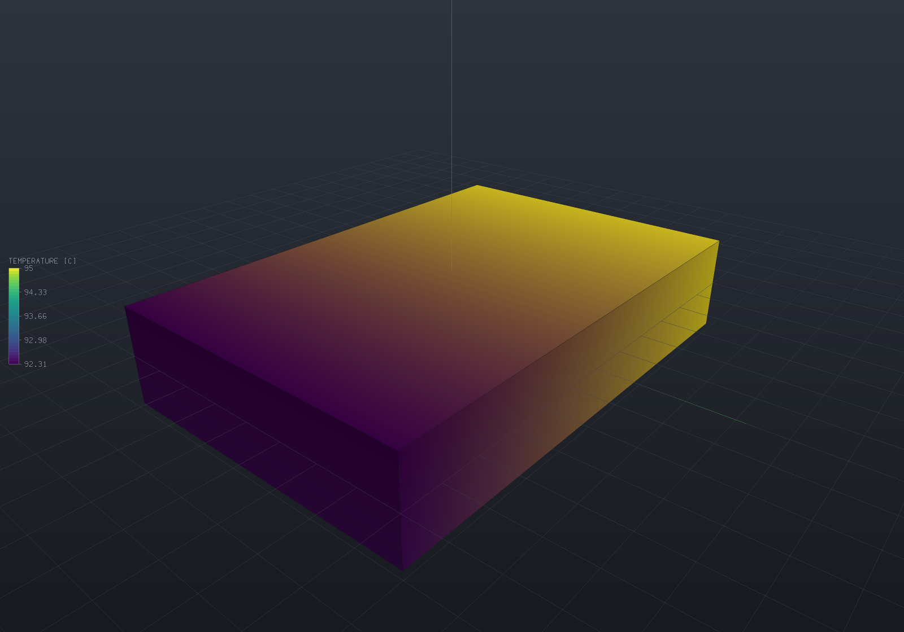

`EngrCAD.Fea` solves **heat conduction** on the same tetrahedral meshes
[the mesher](fea-meshing.md) produces and the [structural solver](fea-structural.md) uses —
steady or transient, 4-node or 10-node elements, boundary conditions named through the same
facet selectors, and results published as [fields](fields.md) the viewer's colour map picks
up with no extra wiring.

A thermal model reads like a structural one because it **is** one with the physics swapped:
one temperature degree of freedom per node instead of three displacements.

```csharp render:fea-thermal-spreader
var body = Shape.Box(60, 40, 12)
    .Subtract(Shape.Cylinder(6, 40).Translate(0, 0, -20));
var part = new Part("spreader", body);

// Meshing the PART's display mesh means the results land back on it exactly:
// every display vertex is an analysis boundary node, matched by value.
var surface = part.GetMesh();
var tets = TetMesher.Mesh(surface, new TetMeshOptions
{
    RefineQuality = true,
    MaxElementSize = 14,     // deliberately coarse - this page is a picture, not a study
});

var model = new ThermalModel(AnalysisMesh.Of(tets), Materials.Aluminium6061);
model.Temperature(Facets.OnPlane(new Vector3d(-30, 0, 0), Vector3d.UnitX), 95);
model.Convection(Facets.FacingAlong(Vector3d.UnitZ), 0.03, 25);
model.Convection(Facets.OnPlane(new Vector3d(30, 0, 0), Vector3d.UnitX), 0.03, 25);

var results = ThermalSolver.Solve(model);

foreach (var field in results.SampleOnto(surface))
    part.AddResult(field);
part.FieldDisplay = new FieldDisplay { Field = ThermalResults.FieldNames.Temperature };

var scene = new Scene();
scene.Add(part);
```



The left face is held at 95 °C; the top and right faces lose heat to 25 °C air through a
film; every other face is unmentioned and therefore insulated. The colours are temperature,
and the gradient runs left to right with the bore forcing it around — nothing is applied to
the bore itself.

## Units

The base system is `ModelUnits`' **mm / N / MPa / tonne / s**, stated once on the
[Materials & mass](materials.md#units-one-convention-stated-once) page. What that implies
for heat is worth a table of its own, because energy comes out as N·mm = mJ and power as
mW, and two of these surprise people:

| Quantity | Unit here | Against SI |
| --- | --- | --- |
| Temperature | K or °C | the same (only differences matter) |
| Conductivity `k` | mW/(mm·K) | **numerically identical** to W/(m·K) — steel is 50 either way |
| Specific heat `c` | mm²/(s²·K) | the SI J/(kg·K) **times 1e6** — steel's 460 becomes 4.6e8 |
| Expansion `alpha` | 1/K | the same |
| Film coefficient `h` | mW/(mm²·K) | SI W/(m²·K) × 1e-3 — air at ~10 is **0.01** here |
| Heat flux | mW/mm² | SI W/m² × 1e-3 |
| Generation | mW/mm³ | SI W/m³ × 1e-6 |
| Diffusivity `k/(rho·c)` | mm²/s | steel 13.85, i.e. SI 1.385e-5 m²/s |

The conductivity coincidence is not luck — the milli- in the power cancels the milli- in the
length. The specific-heat factor is the one that catches people, and
`Material.VolumetricHeatCapacity` (steel 3.611) is the product worth sanity-checking.

## Saying what is hot and what cools

Every selector from the [structural page](fea-structural.md) works unchanged —
`Facets.Tag`, `OnPlane`, `FacingAlong`, `InBox`, `All`, `And`, `Or` — and the conditions map
one to one:

| Structural | Thermal | Meaning |
| --- | --- | --- |
| `Fix` / `Prescribe` | `Temperature(selector, T)` | A held temperature (Dirichlet) |
| `FixNode` | `TemperatureNode(node, T)` | One node — enough to set a datum |
| `Pressure` | `HeatFlux(selector, q)` | Uniform flux. **Positive flows INTO the body** |
| `Force` | `HeatLoad(selector, Q)` | A total power spread over the selection — exact resultant |
| `Gravity` | `Generation(rate)` | Uniform volumetric generation |
| `BodyForce` | `Generation(p => rate)` | A generation field |
| `NodalForce` | `NodalHeat(node, Q)` | A point source (whose local peak does not converge) |
| — | `Convection(selector, h, Tinf)` | `q = h(T - Tinf)` — **the one with no structural analogue** |

Two things have no spelling because they need none. An **insulated** surface is one you do
not mention: zero flux is the weak form's natural boundary condition, so an unnamed face is
already adiabatic. And there is no partial restraint — a scalar field has no axes to hold
separately, which is why `Fix` and `Prescribe` collapse into one call.

**Convection is structurally different, not just differently named.** Newton's law of
cooling has a term proportional to the unknown temperature, so it contributes to the
conduction *matrix* as well as to the load vector. That is why it is the one condition not
reduced to nodal heat when you add it: its two halves are meaningless apart. It is also what
lets a model with no held temperature anywhere be solvable at all — see the refusals below.

## Steady conduction

```csharp run:fea-thermal-report
var plate = Shape.Box(80, 40, 6);
var part = new Part("plate", plate);
var surface = part.GetMesh();
var tets = TetMesher.Mesh(surface, new TetMeshOptions { RefineQuality = true, MaxElementSize = 12 });

var model = new ThermalModel(AnalysisMesh.Of(tets), Materials.Steel);
model.Temperature(Facets.OnPlane(new Vector3d(-40, 0, 0), Vector3d.UnitX), 150);
model.Convection(Facets.All, 0.02, 20);
model.Generation(0.001);                      // 1 kW per litre of resistive heating

var results = ThermalSolver.Solve(model);
Console.WriteLine(results.Report.ToText());
Console.WriteLine($"peak {results.MaxTemperature:F2} C at node {results.MaxTemperatureNode}");
Console.WriteLine($"peak heat flux {results.MaxFluxMagnitude:F1} mW/mm^2");

// The first law, discretely: heat in through sources and held boundaries must equal heat
// out through the films. It costs nothing, holds to round-off for any correct answer, and
// nothing about it is visible in a temperature plot.
if (results.Report.EnergyBalanceResidual > 1e-9)
    throw new Exception($"energy balance {results.Report.EnergyBalanceResidual:E3}");

results.WriteVtu(Path.Combine(Path.GetTempPath(), "plate-thermal.vtu"));
```

`ThermalSolveReport` is the thermal twin of `FeaSolveReport`: sizes, factor fill, timings,
the solve residual, the temperature range, and the four heat terms — applied, through
prescribed boundaries, through convection, and into storage — with the balance between them.
Beyond it, `ThermalResults` gives nodal `Temperature`, averaged `NodalFlux`, per-material
`NodalFluxIn`, per-element `ElementFlux`/`ElementGradient`, and `TemperatureIn` for a point
inside an element.

Element values are public for the same reason the structural solver keeps `ElementStress`
public: `q = -k·grad T` is one derivative down from the solved field, so it jumps across
element faces, and the nodal values are a volume-weighted average. The size of that jump is
the standard error indicator, and averaging it away is the standard way to hide a mesh that
is too coarse.

### At a material interface, ask for the material

Where two conductivities meet, the jump is not a discretization artefact but the answer.
Temperature is continuous across a bonded interface, so the *tangential* gradient is
continuous and the tangential flux jumps with `k`; only the component *normal* to the
interface is continuous, by conservation. A node sitting on that interface therefore has one
right answer per material, and `NodalFlux` — being indexed by node, as any colour-map field
must be — holds one value and reports the blend.

```csharp
// How many nodes are affected: zero for a single-material model, and for separate bodies,
// which share no node.
Console.WriteLine($"{mesh.InterfaceNodeCount} nodes blend two materials");

// The honest value, per material. Away from an interface it is bit-for-bit what NodalFlux
// says, so the two accessors are safe to mix; a region the node does not touch is refused
// by name rather than answered with a neighbour's number.
foreach (int region in mesh.RegionsAt(node))
    Console.WriteLine($"  region {region}: {results.NodalFluxIn(region, node)}");
```

The magnitude is worth stating: on a two-material bar carrying 5000 and 1250 mW/mm², the one
value an interface node can report is wrong by 75% to 225% for one of the two materials, while
`NodalFluxIn` is exact. `StructuralResults.NodalStressIn` is the same rule for the same reason.

### A directional conductor

A carbon laminate conducts well along its fibres and poorly across them, so `k` is a tensor, not
a scalar. `ConductivityLaw` states one — isotropic, orthotropic or fully anisotropic — with a
material frame, and `ThermalModel.SetConductivity` sets it per region. It is the thermal twin of
[`ElasticLaw`](fea-structural.md): the same part strains orthotropically in a structural solve,
so it must conduct orthotropically here, and the frame is a property of how the stuff was laid
into *this part* rather than of the stuff, which is why the law sits beside `Material` rather
than inside it. It is a separate type from `ElasticLaw` on purpose — a laminate's conduction axes
need not be its stiffness axes, so one object carrying both would make the name a claim it cannot
keep.

```csharp run:fea-thermal-directional
// A laminate bar whose fibres run at 30 degrees to its long axis. The carrier states only
// density and name; the conductivity is the LAW.
var bar = Shape.Box(60, 30, 10);
var part = new Part("laminate", bar);
// Refine so the bar has INTERIOR nodes: the field below is prescribed on the whole boundary,
// so the interior is what is actually solved for.
var tets = TetMesher.Mesh(part.GetMesh(), new TetMeshOptions { RefineQuality = true, MaxElementSize = 5 });
var mesh = AnalysisMesh.Of(tets);

var carrier = new Material("carbon UD carrier", 135_000, 0.30, 1.6e-9);
double angle = 30 * Math.PI / 180;
var fibre = Frame3d.FromXY(
    Vector3d.Zero, new Vector3d(Math.Cos(angle), Math.Sin(angle), 0), Vector3d.UnitY);
var model = new ThermalModel(mesh, carrier);
model.SetConductivity(0, ConductivityLaw.Orthotropic(fibre, 40, 5, 12));   // kx, ky, kz

// A uniform temperature gradient of 2 K/mm along x on the whole boundary. The field is then
// exactly linear, so the flux is a constant vector any element reports.
const double gradient = 2.0;
foreach (int node in model.NodesOn(Facets.All))
    model.TemperatureNode(node, gradient * mesh.Position(node).X);

var results = ThermalSolver.Solve(model);
var q = results.ElementFlux(0);

Console.WriteLine($"axial conductivity  {-q.X / gradient:F2} mW/(mm.K)   (40 along fibre, 5 across)");
Console.WriteLine($"cross flux q_y      {q.Y:F2} mW/mm^2   heat carried ACROSS the gradient");
Console.WriteLine(Math.Abs(q.Y) > 1e-3
    ? "the flux is NOT parallel to the gradient -- cross-conduction, which no isotropic k can do"
    : "the flux is parallel to the gradient");
```

The effective axial conductivity is `kx·cos²θ + ky·sin²θ` — here 40·¾ + 5·¼ = **31.25**, between
the fibre value 40 and the transverse value 5. And the flux carries a component **across** the
imposed gradient (the cross-conduction term), which is the one behaviour a scalar `k` cannot
produce: an isotropic conductor's flux is always parallel to its gradient. An anisotropic
conductor's is not, off-axis. The isotropic path is untouched — a model that states no law
conducts exactly as it always did, bit for bit — and a non-symmetric or non-positive-definite
tensor is refused by name, because a conductivity that let heat flow up its own gradient
somewhere is unphysical.

### Superconvergent flux recovery, and the error estimate

`q = -k·grad T` is one derivative down from the solved temperature, exactly as stress is one
down from displacement, so it carries the same choice. `FluxRecovery.Direct` (the default)
averages the element flux at each node; `FluxRecovery.Superconvergent` fits a polynomial per
corner-node patch to the flux at the element's *superconvergent* points and reads it there —
the same machinery `StressRecovery.Superconvergent` runs, at three components rather than six,
over the same `(node, region)` slot table. On a manufactured solution the recovered flux
converges one order faster than the averaged one: measured rates **2.34 (linear) and 2.66
(quadratic)** against direct evaluation's 1.43 and 2.00, and 15× / 8× lower nodal error at the
finest mesh.

The reason to build it is the estimate that comes with it. `ErrorEstimate` is the
Zienkiewicz–Zhu figure — the energy-norm distance between the finite-element flux and its own
recovery, per element and overall — which is the answer to "is this conduction mesh good
enough" a solve otherwise never gives, and the per-element map an adaptive refinement loop
would consume.

```csharp run:fea-thermal-recovery
var block = Shape.Box(60, 40, 20);
var part = new Part("block", block);
var tets = TetMesher.Mesh(part.GetMesh(), new TetMeshOptions { RefineQuality = true, MaxElementSize = 6 });

var model = new ThermalModel(AnalysisMesh.Of(tets), Materials.Steel);
model.Temperature(Facets.OnPlane(new Vector3d(-30, 0, 0), Vector3d.UnitX), 150);
model.Convection(Facets.All, 0.02, 20);
model.Generation(0.001);
var results = ThermalSolver.Solve(model);

// Is the mesh good enough? The estimate answers, and names the worst element. A large figure
// here (this is a deliberately coarse block) says: refine, and refine where WorstElement is.
Console.WriteLine(results.ErrorEstimate);       // "estimated error 43.83% (...)"
Console.WriteLine($"worst element: {results.ErrorEstimate.WorstElement}");

// The recovered flux converges one order faster; Direct stays the default so nothing moves.
results.FluxRecovery = FluxRecovery.Superconvergent;
Console.WriteLine($"peak recovered flux {results.MaxFluxMagnitude:F1} mW/mm^2");
```

`Direct` is the default for the same reason it is on the structural side: every thermal
verification figure this project quotes was measured through the simple path, and a recovered
field is smooth by construction — at a genuine discontinuity (a material interface, a
re-entrant corner) it smooths harder than averaging does. Where no patch can be assembled at
all (a mesh with no interior corner node), the estimate is **NaN** rather than a
suspiciously-perfect zero: the honest reading is UNKNOWN, and it is the one answer that cannot
be mistaken for good news.

## Transient conduction

```csharp run:fea-thermal-transient
var bar = Shape.Box(40, 8, 8);
var part = new Part("quenched bar", bar);
var tets = TetMesher.Mesh(part.GetMesh(), new TetMeshOptions { RefineQuality = true, MaxElementSize = 6 });

var model = new ThermalModel(AnalysisMesh.Of(tets), Materials.Steel);
model.Temperature(Facets.OnPlane(new Vector3d(-20, 0, 0), Vector3d.UnitX), 500);

var run = ThermalSolver.SolveTransient(
    model,
    new ThermalTransientOptions(timeStep: 0.05, steps: 200)
    {
        Scheme = ThermalTimeScheme.BackwardEuler,
        InitialTemperature = 20,
        StoreEvery = 50,
    });

Console.WriteLine(run.Report.ToText());
foreach (var state in run.States)
    Console.WriteLine($"  t = {state.Time,5:F2} s: {state.MinTemperature,7:F2} to {state.MaxTemperature,7:F2} C");
```

Each stored state is a full `ThermalResults`, so flux recovery, `SampleOnto` and `.vtu`
export work at any time exactly as they do for a steady solve.

**The step is constant, and that is a design decision rather than a simplification**: the
stepping matrix `C/dt + theta·K` depends on the step and nothing else, so it is factored
**once** for the whole run and every step is a back-substitution. `Report.Factorizations`
says so. This is the "factor once, solve many right-hand sides" case that makes the direct
solver's default pay for itself — the structural solver's own documentation notes it cannot
yet claim that, and here it can.

### Which scheme

| | Backward Euler (default) | Crank–Nicolson |
| --- | --- | --- |
| Order in time | 1 (measured **1.05**) | 2 (measured **2.00**) |
| Stiff modes | amplification → 0 | amplification → **−1**: they ring |
| Step change | no backward move at all | swings back by up to **106% of the step** |

Both are unconditionally stable in the A-stable sense, but that is not the property a
thermal transient needs. A conduction system's fastest mode is roughly `alpha/h²`, and
Crank–Nicolson's amplification factor for it approaches −1, so a sharp initial transient does
not decay — it alternates sign. Measured on a 40 mm bar with 1 mm elements whose face is
stepped from 20 to 100 °C (a backward step in temperature is numerical, since heat only
enters):

| `dt` | `lambda·dt` | Backward Euler | Crank–Nicolson |
| ---: | ---: | --- | --- |
| 2.0 s | 20 | 0 backward moves | 190 moves, worst 105.9% (64.8% after step 5) |
| 1.0 s | 10 | 0 backward moves | 143 moves, worst 81.5% (42.6% after step 5) |
| 0.5 s | 5 | 0 backward moves | 242 moves, worst 56.3% (24.0% after step 5) |

Use Crank–Nicolson when the transient is smooth, or when the step is short against the mesh's
own diffusion time `h²/alpha` — there the ringing does not arise and the second order is free.

**The honest counterweight**, because it is easy to over-claim here: at a *short* step both
schemes move backwards, and that is the **consistent capacity matrix**, not the time
integration. At `dt = 0.005 s` backward Euler undershoots the initial temperature by 5.8% and
Crank–Nicolson by 7.1%. "Backward Euler is monotone" is true of a *lumped* capacity, not of
this one.

### Consistent capacity, and what lumping would change

The capacity matrix here is the **consistent** Galerkin one, `integral(rho·c·N_i·N_j dV)`.
It is what makes the measured time orders come out at theory and what lets a spatially
converged transient converge at the element's own order.

A lumped (diagonal) capacity would buy two things — a monotone answer under backward Euler,
since a diagonal capacity with a positive conduction matrix gives a discrete maximum
principle, and the possibility of explicit stepping, where a diagonal matrix means no solve
at all. It costs accuracy: a node's temperature becomes an average over its patch, and
lumping and consistency bracket the true answer at a moving front.

**What is not available is the obvious way to lump.** Row-sum lumping sets
`C_ii = sum_j C_ij = rho·c·integral(N_i dV)`, which for a 10-node tetrahedron is
**−V/20 at every corner node** — a negative heat capacity, a node that cools when heated.
It is the same integral, and the same surprising number, that a quadratic element's gravity
load already has. Any lumping for quadratic elements has to be a scaled-diagonal scheme
instead, which is a different approximation with its own error, so it is filed rather than
smuggled in under one name.

## Thermal stress

A temperature field becomes a thermal-expansion load on a structural model over the **same**
mesh:

```csharp run:fea-thermal-stress
var bar = Shape.Box(60, 20, 10);
var part = new Part("restrained bar", bar);
var tets = TetMesher.Mesh(part.GetMesh(), new TetMeshOptions { RefineQuality = true, MaxElementSize = 10 });
var mesh = AnalysisMesh.Of(tets);
var steel = Materials.Steel;

// One conduction solve...
var thermal = new ThermalModel(mesh, steel);
thermal.Temperature(Facets.OnPlane(new Vector3d(-30, 0, 0), Vector3d.UnitX), 120);
thermal.Temperature(Facets.OnPlane(new Vector3d(30, 0, 0), Vector3d.UnitX), 120);
var temperature = ThermalSolver.Solve(thermal);

// ...driving one structural solve. Held against axial growth at both ends, and on rollers
// at one y face and one z face so the bar is still free to grow sideways.
var structural = new StructuralModel(mesh, steel);
structural.Fix(Facets.OnPlane(new Vector3d(-30, 0, 0), Vector3d.UnitX), Dof.X);
structural.Fix(Facets.OnPlane(new Vector3d(30, 0, 0), Vector3d.UnitX), Dof.X);
structural.Fix(Facets.OnPlane(new Vector3d(0, -10, 0), Vector3d.UnitY), Dof.Y);
structural.Fix(Facets.OnPlane(new Vector3d(0, 0, -5), Vector3d.UnitZ), Dof.Z);
structural.ThermalLoad(temperature, referenceTemperature: 20);

var results = StructuralSolver.Solve(structural);

double expected = -steel.YoungsModulus * steel.ThermalExpansion * (120 - 20);
Console.WriteLine($"sigma_xx measured {results.ElementStress(0).Xx:F3} MPa");
Console.WriteLine($"        -E.alpha.dT {expected:F3} MPa");
```

Two halves make that work, and forgetting the second is the classic way to get thermal
stress wrong. The **load** is `integral(B' · D · eps0)`, which for an isotropic material
collapses to `E/(1-2·nu)·alpha·dT` times a shape-function gradient. The **stress recovery**
must then use `sigma = D(eps - eps0)`, not `D·eps` — a bar free to expand develops the full
thermal strain and carries *zero* stress, and without the subtraction it would report
`E·alpha·dT` (126 MPa for steel at a 50 K rise) on a body under no load at all. Both halves
come from one stored field, so applying the load is what turns the subtraction on and there
is no second call to forget.

A thermal load is **self-equilibrated by construction** — the shape functions are a partition
of unity, so their gradients sum to exactly zero — which means it adds nothing to the applied
resultant and the solver's equilibrium check keeps its meaning through a coupled solve.

> [!NOTE]
> The two models must share the same `AnalysisMesh` **instance**, and that is checked. A
> temperature field crosses by node index, and two meshes of the same body can number their
> nodes differently, so the alternative is applying each node's temperature to some other
> node — a plausible wrong answer, which is the one outcome worth refusing.

## Refusals

An **undriven** body is refused before the factorization, per connected body:

```
The model has no prescribed temperature and no convective surface, so its conduction
matrix is singular: adding any constant to the temperature everywhere leaves every
gradient, and therefore every heat flux and every boundary condition, exactly as it was.
There is no unique answer to return, and a field that merely looked reasonable would be
wrong by an unknowable offset. Prescribe a temperature somewhere (one node is enough to
set the datum), or give a surface a convective condition.
```

This is conduction's analogue of an unrestrained structural body, and it is both simpler and
sharper. The conduction operator's null space on a connected body is **exactly** the
constants, so the check is a boolean — is there a held temperature or a convective facet
anywhere? — where the structural check needs an eigen-decomposition to find *which* of six
rigid modes partly survive. A pure heat flux does not count: it is a Neumann condition and
says nothing about the level. If heat is going in with nowhere to leave, the message says
that too, because no steady state exists at all and a transient is the honest model.

A **transient** of a perfectly insulated body is *not* refused: the capacity term is positive
definite on its own, so it removes the constant null space the steady operator has. The body
holds its energy, which is the right answer.

Also refused by name: a material with no conductivity (the matrix would be identically zero —
the answer would not be inaccurate, it would not exist); a transient on a material with no
heat capacity, pointing at the steady solver, since a body with no capacity *is* its steady
state; a selector matching no facets, naming the tags that do exist; a non-positive film
coefficient, explaining that zero is not a condition and a negative one would make the matrix
indefinite; every node prescribed; and a thermal load whose field is the wrong length, naming
the quadratic mid-edge nodes that are usually the cause.

## Verification

A solver is worth exactly what its verification is worth, so here is all of it. Every number
is from `tests/EngrCAD.Fea.Tests`, on structured meshes so a measured convergence order means
something.

**Element matrices** against closed forms and independent quadrature rules:

| Check | Measured |
| --- | ---: |
| Conductivity annihilates a constant field (both orders) | 1.1e-16 / 1.6e-16 |
| 4-node conductivity vs `k·V·grad L_i · grad L_j` | 7.1e-15 |
| 4-node capacity vs `rho·c·V/20 · (2, 1)` | 2.2e-16 |
| Capacity row sums vs `rho·c·integral(N_i dV)` | 6.7e-16 / 1.1e-14 |
| 3-node convection matrix vs `h·A/12 · (2, 1)` | 1.0e-17 |
| 6-node convection, degree 4 vs degree 5 | 9.9e-16 |
| Thermal-expansion load sums to zero (both orders) | 5.6e-15 / 1.7e-14 |

Each "the cheap rule is exact" claim has a **negative control**, because two rules agreeing
proves nothing if the code ignores the rule it was handed:

- Quadratic conductivity, degree 2 vs degree 3: **1.1e-15 straight-sided**, and
  **3.0e-2 when one mid-edge node is moved off the midpoint**. The exactness really is the
  straight-sidedness.
- Linear capacity with the *conductivity's* one-point rule: every entry is `rho·c·V/16`
  (spread exactly 0), so the matrix is **rank one and singular** — while its total is
  `rho·c·V` to 1e-14. A "does the capacity sum right" check passes it.
- Under-integrating the generation load with a degree-1 rule instead of degree 5:
  **1.28e3× worse** (7.8e-1 against 6.1e-4).

**Steady solutions** — three of the five are exact to round-off, which is why they were
chosen: a linear field, and the linear field a slab with a convective end settles into, lie
inside *both* element spaces.

| Case | Linear | Quadratic |
| --- | ---: | ---: |
| Patch test (linear field, temperature) | 2.4e-16 | 7.3e-16 |
| Patch test (element flux) | 2.3e-15 | 8.0e-15 |
| 1D slab, fixed faces, vs the linear profile | 1.4e-15 | 3.8e-15 |
| 1D slab, heat through vs `k·A·dT/L` | 4.7e-16 | 1.5e-15 |
| Slab with generation, nodal, vs the parabola | 8.8e-14 | 1.4e-13 |
| Convective face, vs the mixed-BC solution | 9.0e-14 | 3.9e-13 |
| Convective face, heat out vs `h·A(Ts − Tinf)` | 2.6e-15 | 1.1e-14 |

The generation case carries a lesson. **Both orders are nodally exact, for two different
reasons** — a parabola is *in* the quadratic space, and linear elements have the classical
one-dimensional nodal superconvergence (the discrete equations reduce to a central
difference, which a quadratic satisfies with no truncation error). Measuring "the error" at
nodes therefore reports round-off at every refinement and no order at all; the first version
of that test asserted a ratio of 4 and measured 0.72, which is the ratio of two numbers that
are both nothing. The genuine O(h²) is *inside* the elements, and measured there the ratio is
**4.00, 4.00**.

**Radial**, a hollow cylinder against `T(r) = Ta + (Tb − Ta)·ln(r/a)/ln(b/a)`:

| | nRadial 2 | 4 | 8 | order |
| --- | ---: | ---: | ---: | ---: |
| Linear | 5.3e-3 | 2.4e-3 | 1.0e-3 | 1.28 |
| Quadratic | 9.4e-3 | 2.3e-3 | 5.8e-4 | 2.00 |

Both are **below theory (2 and 3), and the cause is measured rather than guessed**: the
fixture's rings are polygons, so refining the mesh refines the *domain* too, and the boundary
condition is constant along each chord where the true logarithmic profile is not. Refining
the angular direction as `n²` instead of `n` — which drops the chord sagitta from O(h²) to
O(h⁴) — lifts quadratic to **2.28** and its finest error to **1.1e-4**, while leaving the
linear sequence unchanged at 1.28 and 1.0e-3. So the two are limited by different things: the
quadratic element is good enough that the polygonal boundary holds it back, and the linear
one is still limited by its own radial approximation.

There is a fixture trap here worth keeping. Spacing the rings **geometrically** makes the
nodal values *exact* (4.3e-14 on a 120 K drop at every refinement), because the nodes then
sit at equal intervals of `ln r` *and* every ring-to-ring conductance is equal — so the exact
values satisfy the discrete equations identically. The first version of that study reported
convergence orders of **−2.50 and −1.27**, which is what a ratio of two round-off figures
looks like when mistaken for a signal.

**Convergence order** by the method of manufactured solutions, on a box the mesh represents
exactly:

| | L2 measured | theory | energy measured | theory |
| --- | ---: | ---: | ---: | ---: |
| Linear | **2.01** | 2 | **1.00** | 1 |
| Quadratic | **3.05** | 3 | **2.02** | 2 |

The manufactured field is **quartic**, and that is a trap the suite walked into with a cubic
one first: a cubic field on a uniform mesh is reproduced exactly at the nodes by both element
types, because the stencil's truncation error is proportional to a fourth derivative a cubic
does not have. The study then reports round-off (2.2e-13 on a field of scale 113) and no
order whatsoever.

**Transient**:

| Check | Measured |
| --- | ---: |
| Lumped capacitance vs `Tinf + (T0−Tinf)·exp(−t/tau)`, Bi = 2.1e-3 | 3.0e-4 / 5.3e-4 of the initial excess |
| Semi-infinite solid vs the erfc profile (h = 1 mm, dt = 5 ms) | 0.184 K on an 80 K step, 2.3e-3 |
| Transient run to 20 tau vs the steady solve | 3.4e-9 relative |
| Time order, backward Euler | **1.05** (theory 1) |
| Time order, Crank–Nicolson | **2.00** (theory 2) |
| First law over a whole run | 1.3e-14 … 8.5e-13 |
| Insulated body's stored energy over 10 steps | drift < 1e-14 |

The time order is measured against a reference solve of the *same semi-discrete system*, not
against the analytic exponential: comparing to the latter folds the spatial discretization
into the error and caps the measured order at whatever the mesh contributes. The step range
also has to put **every** mode in the asymptotic regime — run over a full time constant with
eight steps, Crank–Nicolson reported 1.80, 3.72 and 3.21 across one sequence, a genuine sign
change in the error rather than noise.

**Coupling** — both bars are exact to round-off, which is why they were chosen: the free
bar's answer is a linear displacement field and the constrained bar's a uniform strain state,
so both lie inside both element spaces and there is no discretization error to hide a
factor-of-two in.

| Check | Linear | Quadratic |
| --- | ---: | ---: |
| Free bar, expansion `alpha·dT·L` | 6.9e-15 | 8.7e-15 |
| Free bar, stress (must vanish) vs `E·alpha·dT` | 8.5e-15 | 3.6e-14 |
| Constrained bar, `sigma_xx` vs `−E·alpha·dT` | 2.0e-15 | 5.0e-15 |
| Constrained bar, `sigma_yy`/`sigma_zz` (must vanish) | 5.8e-13 MPa | 1.0e-12 MPa |
| Constrained bar, lateral growth vs `beta·y` | 3.1e-18 | 1.0e-17 |
| Stress linear and correctly signed at dT = −40, −5, 5, 80 | 1.3e-15 | — |

The constrained bar is the case that catches a wrong modulus: it is independent of length
*and* of Poisson's ratio, so a coupling using `E` where it should use `E/(1−2·nu)` gets the
free bar right and this one wrong by 2.5 at nu = 0.3.

A coupled pipeline check adds one more, and it carries its own trap. A **linear** temperature
field is stress-free in an unconstrained body — that is the exact condition, since
Saint-Venant compatibility forces every second derivative of `dT` to vanish — but the
stress-free *displacement* field is **quadratic**: `u_x` needs a `−(b/2)(y² + z²)` term to
cancel a shear the obvious guess introduces. Which means whole symmetry planes over-constrain
it, and the model then genuinely carries stress from the restraints alone (measured 67 MPa, a
quarter of `E·alpha·dT`). A statically determinate 3-2-1 restraint gives 1e-10.

## Limitations

- **Constant material properties.** `k`, `c` and `alpha` do not vary with temperature, so
  the problem stays linear and the solve is one factorization. Temperature-dependent
  properties make it nonlinear and are a different solver wrapping this one.
- **No radiation.** `sigma·epsilon·(T⁴ − Tsurr⁴)` is nonlinear in the unknown for the same
  reason; a linearised film coefficient is the usual workaround and `Convection` takes one.
- **Time-varying boundary conditions are not exposed**, though the stepping is written for
  them (the previous state is carried whole rather than collapsed, so a per-step boundary
  value is one line). The step is constant, deliberately: it is what makes one factorization
  serve the whole run.
- **The capacity matrix is consistent only**; see above for what lumping would change and
  why row-sum lumping is not available for 10-node elements.
- **Sliver elements are the real constraint, and they belong to the mesher** — the same
  limitation the structural page records, refused by name here by the same shared guard.
