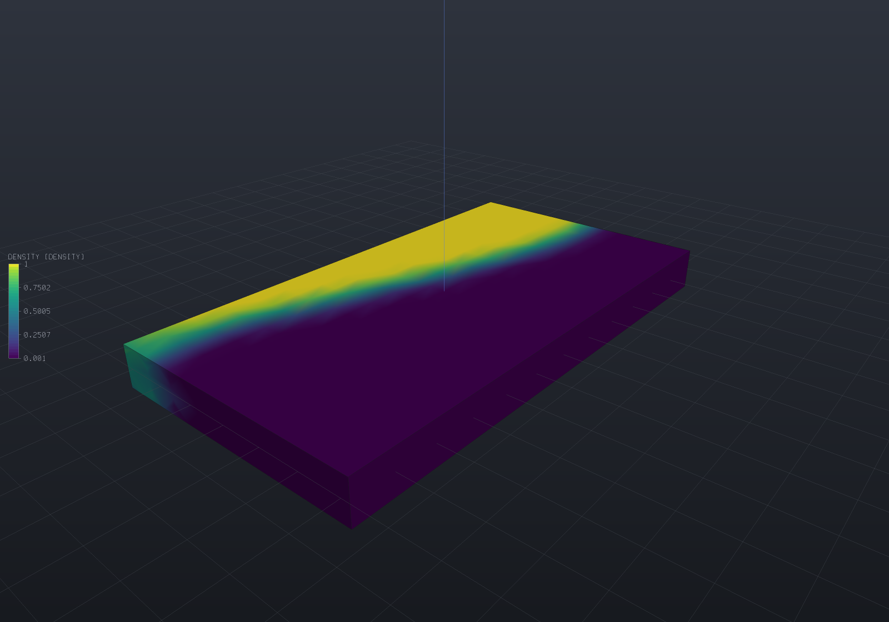
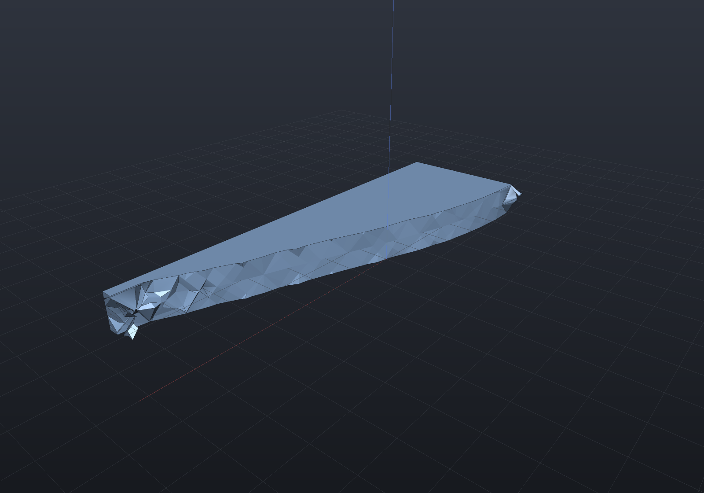

Every other solver here answers *how does this part behave*. This one answers **where should
the material go**: given a design space, a set of supports, a load and a volume budget,
`TopologyOptimizer` returns a density per element saying how much material each part of the
space is worth.

It minimises **compliance** — `c = u'Ku`, the work the load does, so the smallest compliance is
the stiffest structure — by SIMP (Solid Isotropic Material with Penalisation), which
interpolates the modulus as `E(rho) = rho^p·E0`. The exponent's whole job is to make
half-dense material *less* than half as useful as solid material, so the answer tends toward
solid-or-void rather than settling into a uniform grey mush.

```csharp render:fea-topology-cantilever
// The DESIGN SPACE: everywhere the material is allowed to be.
var part = new Part("bracket", Shape.Box(60, 20, 8));
var surface = part.GetMesh();
var tets = TetMesher.Mesh(surface, new TetMeshOptions
{
    RefineQuality = true,
    MaxElementSize = 5,       // deliberately coarse - this page is a picture, not a study
});

var model = new StructuralModel(AnalysisMesh.Of(tets), Materials.Steel);
model.Fix(Facets.OnPlane(new Vector3d(-30, 0, 0), Vector3d.UnitX));
model.Force(Facets.OnPlane(new Vector3d(30, 0, 0), Vector3d.UnitX), new Vector3d(0, 0, -2000));

var result = TopologyOptimizer.Minimize(model, new TopologyOptions
{
    VolumeFraction = 0.35,    // keep about a third of the box
    FilterRadius = 5.0,       // the MINIMUM MEMBER SIZE, in millimetres - see below
    MaxIterations = 60,
});

foreach (var field in result.SampleOnto(surface))
    part.AddResult(field);
part.FieldDisplay = new FieldDisplay
{
    Field = TopologyResult.FieldNames.Density,
    ColorMap = FieldColorMap.Viridis,
};

var scene = new Scene();
scene.Add(part);
```



Yellow is material worth keeping, dark blue is material worth removing. The load path comes out
as a truss: a tension tie along the top, a compression strut along the bottom, and diagonals
carrying the shear back to the root.

## Which optimiser: this or a design study?

Both search, and they are **complements rather than competitors**. The rule is short:

| | [`DesignStudy`](design-studies.md) | `TopologyOptimizer` |
| --- | --- | --- |
| variables | a handful of `[Param]` values | one density per element — thousands |
| gradients | **impossible**, so derivative-free | **mandatory**, and free |
| what changes | dimensions of a shape you drew | which shape there is |
| use it to | size a part | find out what to draw |

The gradient row is the whole story. A design study is derivative-free *because* a parameter
change can alter topology — a hole breaks through, a fillet stops fitting — and the two sides of
such a step are different solids, so a finite difference across it is meaningless rather than
merely noisy. Here the topology changing **is** the answer, and with one variable per element no
derivative-free method reaches the dimension at all.

What makes the gradient free is that compliance is **self-adjoint**: with `E(rho) = rho^p·E0`
and a load that does not depend on the design,

```
dc/drho_e = -p·rho_e^(p-1)·(u_e' k0 u_e)
```

and `u_e' k0 u_e` is the element strain energy — a quantity the solve has already produced. No
adjoint system, no second factorization. Every refusal below exists to protect that property.

## The filter is not optional

Unfiltered SIMP fails in two ways at once, and neither is a tolerance question.

**It checkerboards.** Alternating solid and void elements is an *artefact*: that pattern
overestimates its own stiffness in a displacement-based element, so the optimiser finds it and
exploits it. Measured on the fixture in the tests, an unfiltered run leaves each element **0.555**
away from the mean of its face neighbours against **0.020** filtered — 28× — and reports a
compliance **37% lower** for the same volume. A lower compliance that is not a better structure
is exactly the failure a picture cannot show you.

**And it is mesh-dependent**: refining gives a different, finer truss forever rather than
converging on one. Measured over three meshes at a fixed radius, the structure moves **0.137 then
0.068** between refinement levels unfiltered against **0.014 and 0.014** with a density filter —
an order of magnitude.

A filter of radius `r_min` fixes both, and since it is also what sets the smallest member the
answer can contain, **`r_min` is an engineering input rather than a numerical knob**: it is the
thinnest wall your printer holds, or the diameter of your cutter. It is stated in model units,
it has no default, and if you find yourself turning it until the picture looks right then you
are choosing a manufacturing constraint by eye.

Two filters are offered and the difference matters:

- **`TopologyFilter.Density`** (the default) convolves the design variable into a physical
  density, so the problem being solved is a genuine optimisation problem in the design variables
  and the reported sensitivity is its **exact gradient** — which is what lets the tests check it
  against a finite difference.
- **`TopologyFilter.Sensitivity`** (Sigmund 1997, the one the 99-line paper uses) smooths the
  *sensitivity* instead and leaves the densities alone. It converges much faster (22 iterations
  against 89 on the same fixture) and comes out crisper, but the filtered sensitivity is **not
  the gradient of anything**, so it is a heuristic and is documented as one.
- **`TopologyFilter.None`** is not a setting, it is the defect above. It exists so the defect can
  be measured, and the tests do exactly that.

## The volume constraint is an identity

The optimality-criteria update bisects a Lagrange multiplier until the volume is met, so it is
met **exactly** — the worst relative miss over a whole run measures **7e-16**, which is round-off.
`TopologyIteration.VolumeConstraintMet` reports the one case where it cannot be: a target the
move limits cannot reach in a single step.

One subtlety worth stating because getting it wrong is invisible. The constraint is on the
**physical** volume — the material the structure actually contains — not on the mean of the
design variables. A row-normalised filter is not volume-preserving (a boundary element's
neighbourhood is truncated), so the two differ, and constraining the design variables lets the
answer hold more material than was asked for. That is not hypothetical: on the uniform-bar
fixture, whose convex optimum at `p = 1` is exactly `c0/f`, the design-variable form returned
**1.79·c0** against the closed form's **2.00·c0** — a compliance *below* the true optimum, which
is only reachable by spending volume the constraint said was not there.
`TopologyResult.DesignVolumeFraction` reports the other number beside it.

## The answer is a field, not a shape

An element at 0.5 is **an unresolved decision, not half material**. That is the honest form of
the result and it is why `TopologyResult.Discreteness` exists: the volume-weighted mean of
`4·rho·(1 − rho)`, zero for a fully solid-or-void design and one for a uniformly grey one. Read
it before believing a threshold.

Turning the field into geometry is a threshold plus a polygonisation, and the threshold is a
stated parameter whose effect on the volume is reported rather than chosen quietly:

```csharp render:fea-topology-extracted
var box = Shape.Box(60, 20, 8);
var surface = box.ToMesh();
var tets = TetMesher.Mesh(surface, new TetMeshOptions
{
    RefineQuality = true,
    MaxElementSize = 5,
});

var model = new StructuralModel(AnalysisMesh.Of(tets), Materials.Steel);
model.Fix(Facets.OnPlane(new Vector3d(-30, 0, 0), Vector3d.UnitX));
model.Force(Facets.OnPlane(new Vector3d(30, 0, 0), Vector3d.UnitX), new Vector3d(0, 0, -2000));

var result = TopologyOptimizer.Minimize(model, new TopologyOptions
{
    VolumeFraction = 0.35,
    FilterRadius = 5.0,
    Filter = TopologyFilter.Sensitivity,   // crisper, which is what a threshold wants
    MaxIterations = 60,
});

// The threshold is a PARAMETER of the extraction, and it moves the volume: read
// result.ExtractedVolumeFraction(0.5) against the 0.35 that was asked for.
var solid = Shape.From(result.ExtractSurface(0.5));

var scene = new Scene();
scene.Add(new Part("structure", solid) { Color = PartColor.Steel });
```



`ExtractSurface` marches the mesh's **own tetrahedra**, which is exact for the piecewise-linear
nodal field and introduces no second discretisation. It is deliberately not `Sdf` + Surface Nets,
this repository's usual answer to "polygonise a field", for a reason with teeth:
`SurfaceNets.Polygonize` culls blocks using the **1-Lipschitz** property of a signed distance
field, and a density field is not 1-Lipschitz and has no useful bound — it goes from 0 to 1
across one element, whatever an element's size happens to be. The cull would drop surface
silently.

**A B-Rep is refused by name.** The level set of a piecewise-linear field is a faceted surface
with as many facets as the mesh has crossings, and there is no parametric surface in it to
recover — offering one would mean *fitting*, whose tolerance would silently become part of the
answer. Re-modelling the result by hand is a step every topology-optimisation workflow has, and
`Shape.From(...)` is where it starts.

## What it refuses, and why each is wrong rather than hard

| refused | why the sensitivity would be wrong |
| --- | --- |
| `Gravity` / `BodyForce` | self-weight is **design-dependent**: it is integrated over the full-density body once, so a run would minimise one structure's compliance under a different structure's weight — and with a load that moves with the design, compliance stops being self-adjoint |
| a prescribed non-zero displacement | the applied force then moves with the stiffness, so minimising `f'u` makes the structure as *compliant* as possible. The sign of the whole problem flips |
| a thermal load | `alpha·dT` enters through `D`, so the load scales with `rho^p` — design-dependent by construction |
| local stress constraints | they need aggregation (p-norm or Kreisselmeier–Steinhauser), and the aggregation parameter **changes the answer**, so it is a separate feature with its own verification rather than a flag on this one |
| several load cases | the objective is then a weighted sum, and the weighting is the design decision. Hence one model per call, and no overload that would have to invent one |

Nothing here publishes a stress, and that is deliberate: the stiffness carries a *penalised*
modulus, so an element's stress would be the SIMP stress rather than a physical one.

## What is verified

Not "it looks like a truss" — that is this feature's actual failure mode, since a plausible
picture is persuasive and no other output in this repository flatters itself so readily. The
published 99-line-paper compliances are also **not** reproducible here and pretending otherwise
would be worse than useless: those are 2D plane-stress figures on structured quadrilaterals,
while this solves 3D elasticity on tetrahedra. What is asserted instead:

| claim | measured |
| --- | --- |
| uniform bar, `c = c0/f^p` (closed form) | exact to 9 decimals at `p = 1` and `p = 3` |
| stepped bar reaches the fully-stressed design `rho_i ∝ N_i` (closed form) | compliance within **0.04%** and **0.12%** of `(L/2)(N1+N2)²/(2fEA)`; half-means 0.5997 / 0.2004 against 0.6 / 0.2 |
| the sensitivity against a central finite difference | worst relative difference **1.8e-7** unfiltered, **9.9e-8** through the density filter's chain rule |
| `c = f'u` against `sum rho^p·(u_e' k0 u_e)` | **1.5e-15** relative — two constructions, one answer |
| the volume constraint at every iteration | worst relative miss **7e-16** |
| compliance monotone under the update | 0 rises over 60 iterations, all three filters |
| refining at fixed `r_min` keeps the structure | 0.014 / 0.014 filtered against 0.137 / 0.068 unfiltered |
| extraction of a uniform field | exactly the body's own volume |
| extraction of a linear field | exactly the analytic slab, to 8 decimals |

## Practical notes

- **Linear elements are the right choice here**, unlike buckling. Topology optimisation wants
  many small elements rather than few accurate ones, and every iteration pays for a
  factorization.
- **AMD ordering is the default** on this path, where it is opt-in elsewhere. The argument that
  makes it opt-in — a permutation is not bit-identical arithmetic and committed numbers were
  measured natural — does not apply to numbers a run produces for the first time, and a
  topology run pays for one factorization per iteration.
- **Cost is one factorization per iteration.** Measured on win-x64: 288 elements converge in
  0.43 s, 1 152 in 2.5 s, 10 800 in about 50 s at 60 iterations.
- `TopologyResult.MeanNeighbours` says how much neighbourhood the radius found in *this* mesh.
  A value near 1 means the radius is smaller than an element, and a radius that small is
  refused by name.
- `result.ToText()` prints the per-iteration table a convergence plot is read off.
