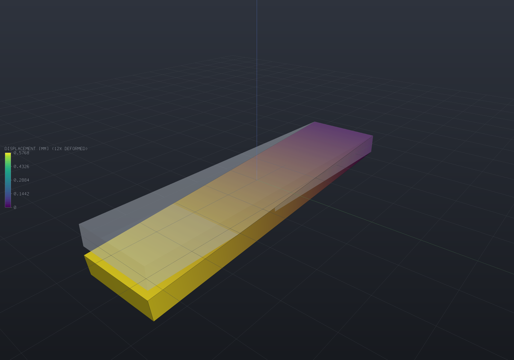

# Transient dynamics (direct time integration)

`TransientSolver` steps the equation of motion

```
M·a + C·v + K·u = f(t)
```

forward in time by the **Newmark / HHT-alpha** family, over the same tetrahedral meshes
[the mesher](fea-meshing.md) produces, the same materials, and the same supports and load
selectors the [structural solver](fea-structural.md) takes. It answers "what does this
structure do *next*" for an arbitrary load history — a suddenly applied force, an impact, a
ramp, a shaker trace — where [modal analysis](fea-modal.md) answers "what does it like to do"
and [harmonic response](fea-buckling.md#frequency-response) answers "what does it do under a
steady sine".

## The one number everybody wants: dynamic amplification

A load applied *suddenly* deflects a structure roughly **twice** as far as the same load
applied slowly. That factor is exactly 2 for an undamped single oscillator, and a real part
lands near it. Here is a steel plate cantilevered from one end with a tip load switched on at
`t = 0`:

```csharp render:fea-transient-cantilever
var part = new Part("plate", Shape.Box(80, 20, 5));

// Meshing the PART's display mesh means the results land back on it exactly:
// every display vertex is an analysis boundary node, matched by value.
var surface = part.GetMesh();
var tets = TetMesher.Mesh(surface, new TetMeshOptions
{
    RefineQuality = true,
    MaxElementSize = 10,     // deliberately coarse - this page is a picture, not a study
});

var mesh = AnalysisMesh.Of(tets);
var clamped = Facets.OnPlane(new Vector3d(-40, 0, 0), Vector3d.UnitX);
var tip = Facets.OnPlane(new Vector3d(40, 0, 0), Vector3d.UnitX);

StructuralModel Case() =>
    new StructuralModel(mesh, Materials.Steel)
        .Fix(clamped)
        .Force(tip, new Vector3d(0, 0, -400));

// The natural period sets the step: 40 steps per cycle of the mode being excited.
var modes = ModalSolver.Solve(
    new StructuralModel(mesh, Materials.Steel).Fix(clamped),
    new ModalSolveOptions { ModeCount = 1 });
double period = 1.0 / modes.Mode(1).Frequency;

// The prose below quotes this band; asserting it here is what keeps the two from drifting.
if (modes.Mode(1).Frequency is < 300 or > 3000)
    throw new Exception($"first mode {modes.Mode(1).Frequency:F0} Hz is outside the quoted band");

var results = TransientSolver.Solve(
    Case(), new TransientSolveOptions(period / 40, 120));

// The instant of largest deflection, and the same load solved statically.
var peak = results.States[0];
foreach (var state in results.States)
{
    if (state.MaxDisplacement > peak.MaxDisplacement)
        peak = state;
}
var statics = StructuralSolver.Solve(Case());

double amplification = peak.MaxDisplacement / statics.MaxDisplacement;
if (amplification < 1.7 || amplification > 2.1)
    throw new Exception($"dynamic amplification {amplification:F3} is not near 2");

foreach (var field in peak.Results.SampleOnto(surface))
    part.AddResult(field);
part.FieldDisplay = new FieldDisplay
{
    Field = StructuralResults.FieldNames.Displacement,
    Deform = StructuralResults.FieldNames.Displacement,
    // The camera frames the UNDEFORMED bounds, so an exaggeration large enough to
    // push the tip outside them would crop the picture.
    DeformScale = 12,
};

var scene = new Scene();
scene.Add(part);
```



The shape is the plate at the *peak* of its first swing, drawn at a deliberate exaggeration
with the undeformed plate ghosted behind it. The peak deflection is close to twice the static
one, and the plate then oscillates about the static position for ever — because nothing here
is damped.

**On the time scale, honestly.** This plate's first bending mode is a few hundred hertz, so the
three cycles above span a few *milliseconds*. A transient of a stiff metal part is always like
that — hundreds of hertz to tens of kilohertz — so if you animate one you are watching a
slowdown of a thousand or more, and the caption should say so rather than implying the clip
runs at true speed. Only structures like buildings and long spans are slow enough to watch
honestly. (It is the same caveat `DeformationTracks.Oscillate` carries for a mode shape, and
the one readers most often assume a solver has arranged away.)

## Choosing a step

There is no stability limit to respect — every scheme this solver will construct is
unconditionally stable (see [what is refused](#what-is-refused)) — so the step is chosen
purely on **accuracy**, and the quantity that decides it is `omega·dt` for the highest mode
you care about.

Newmark's default member has an exactly known error: its algorithmic frequency is
`omega·(1 - (omega·dt)²/12)`, so a mode resolved at *N* steps per period runs slow by
`(2·pi/N)²/12` and the phase falls behind by `2·pi·(2·pi/N)²/12` radians per period. That is
the whole error budget for a linear problem:

| steps per period | period error | phase lag after 10 cycles |
| --- | --- | --- |
| 20 | 0.82% | 0.52 rad (30°) |
| 40 | 0.21% | 0.13 rad (7.4°) |
| 100 | 0.033% | 0.021 rad (1.2°) |
| 200 | 0.0082% | 0.0052 rad (0.3°) |

Twenty to forty steps per period of the highest mode that carries real energy is the usual
engineering choice. Note what the table is *not*: it says nothing about modes the step cannot
resolve, which is the next section.

## Numerical damping, and why the default has none

A finite element mesh has as many modes as degrees of freedom, and the top ones are
discretization artefacts — they have no physical content and no physical damping. Newmark's
default member is **neutrally damped**: it preserves the amplitude of every mode exactly,
artefacts included, which is what makes its energy identity exact and also what leaves that
numerical noise ringing through the whole run.

`TimeIntegration.ForSpectralRadius(rho)` selects the HHT member that multiplies the amplitude
of an unresolvable mode by `rho` each step:

```csharp run:fea-transient-damping
var neutral = TimeIntegration.ForSpectralRadius(1.0);
var damped = TimeIntegration.ForSpectralRadius(0.8);

// rho = 1 IS Newmark's average acceleration, by value.
if (neutral != TimeIntegration.AverageAcceleration)
    throw new Exception("a neutral spectral radius should be the default member");

// Both are second order - which is the whole point of HHT over a raised Newmark gamma.
if (!damped.IsSecondOrder || !damped.IsUnconditionallyStable)
    throw new Exception("HHT should keep second order and unconditional stability");

// The relation is alpha = (rho - 1)/(rho + 1).
if (Math.Abs(damped.Alpha - (0.8 - 1) / (0.8 + 1)) > 1e-15)
    throw new Exception("unexpected alpha");
```

The three families available, and what each costs:

| scheme | order | high-frequency amplitude per step | use it when |
| --- | --- | --- | --- |
| `AverageAcceleration` (default) | 2 | 1 — nothing decays | you want the exact energy identity, and the mesh's top modes are not being excited |
| `ForSpectralRadius(rho)` / `HilberHughesTaylor(alpha)` | 2 | `rho`, chosen | an impact, a contact-like step change, or any load that rings the mesh |
| `NumericallyDamped(gamma)` | **1** | falls with `gamma` | you specifically want Newmark's own amplification; otherwise HHT is strictly better |

Two rules worth stating. `gamma = 1/2` **exactly** is what makes a Newmark member second
order, so `NumericallyDamped` trades an order for its damping and says so in its own name.
And HHT's dissipation is aimed at `omega·dt` large — a well-resolved mode is barely touched,
which is the property that makes it safe to leave on.

## Damping

`RayleighDamping` gives `C = alpha·M + beta·K`, fitted the way anyone actually picks it — two
frequencies and two ratios:

```csharp run:fea-transient-rayleigh
var damping = RayleighDamping.FromRatios(
    frequency1: 500, ratio1: 0.02,
    frequency2: 5000, ratio2: 0.02);

// A U-shaped curve: the fitted points are met, and everything between them is damped LESS.
if (Math.Abs(damping.RatioAtFrequency(500) - 0.02) > 1e-12)
    throw new Exception("the fit should meet its first point");
if (damping.RatioAtFrequency(1581) >= 0.02)
    throw new Exception("the minimum sits between the fitted points");

// Outside the fitted range it damps MORE - often much more, which is the trap.
if (damping.RatioAtFrequency(50_000) < 0.05)
    throw new Exception("a stiffness-proportional term over-damps the high end");
```

**No damping matrix is ever assembled**, here or anywhere in this project. Every appearance of
`C` is either a product `C·x = alpha·(M·x) + beta·(K·x)` — two matrix-vector products the
solver already performs — or a scalar multiple that folds into the effective stiffness as
`(…)·M + (…)·K`. Forming `C` would cost a third sparse matrix with the *stiffness's* sparsity
and buy an operation more expensive than the two products it replaces.

Damping that is **not** proportional — a discrete dashpot, two materials with different loss
factors, viscoelasticity, joint friction — is a genuinely different problem: the undamped
modes stop diagonalising `C`, the eigenproblem becomes quadratic, and its solution is a
`2n`-dimensional non-symmetric state-space problem. Nothing here attempts it.

## Initial conditions

A run starts from rest unless told otherwise. `InitialDisplacement` and `InitialVelocity` are
per **node** of the analysis mesh (which for quadratic elements includes the mid-edge nodes),
and the initial **acceleration** is *solved for*:

```
a(0) = M⁻¹·(f(0) - C·v(0) - K·u(0))
```

That is a solve against **M**, not against K, and it is the second factorization a run pays
for. It matters: a body released from a displaced position, or one whose load is already on at
`t = 0`, is accelerating at that instant, and starting from `a(0) = 0` instead puts a spurious
half-step into the answer whose symptom — a startup wobble that decays — looks exactly like
physics.

The value of the load history at `t = 0` is yours. A step written with `g(0) = 1` starts the
body accelerating immediately; written with `g(0) = 0` it starts at rest and the first step
applies the load. Both are legitimate readings of "suddenly applied".

## One factorization for the run

The step is **constant**, and that is a design decision rather than a simplification: the
stepping matrix `a0·M + (1+alpha)·a1·C + (1+alpha)·K` depends on the step, the scheme and the
model and on nothing else, so it is factored once before the loop and every step after that is
a back-substitution. `TransientSolveReport.Factorizations` reports the count — one for the
stepping matrix, plus one for the mass matrix when the initial acceleration has to be solved.
Adaptive stepping would refactor at every change, which is the entire cost of the method.

## The energy balance is an identity, not a diagnostic

`TransientSolveReport.EnergyBalanceResidual` measures

```
|(E_final - E_initial) - WorkDone + Dissipated|
```

relative to the magnitudes involved. For the default scheme **this is exact algebra**, damped
and loaded cases included. The trapezoidal update relations give
`u(n+1) - u(n) = (dt/2)(v(n) + v(n+1))` and `v(n+1) - v(n) = (dt/2)(a(n) + a(n+1))`, from which

```
E(n+1) - E(n) = (dt/4)·(v(n)+v(n+1))'·[M(a(n)+a(n+1)) + K(u(n)+u(n+1))]
```

and putting the equation of motion at both ends into the bracket turns it into exactly the
work and dissipation terms. Nothing is approximated, so a drift there is a defect rather than a
tolerance — measured on this project's fixtures, **4.4e-13** relative over 3000 steps.

For a dissipative scheme the same number becomes the *measurement* instead of the check: it is
the energy the algorithm removed, which is what a user of numerical damping wants reported.
`Integration.IsSecondOrder` and `Integration.SpectralRadiusAtInfinity` say which case a run is
in.

## What a run gives back

`TransientResults` carries every stored state (`StoreEvery` thins them), and each
`TransientState` is a full [`StructuralResults`](fea-structural.md) — so stress, von Mises,
field publishing and `.vtu` export all work per instant — plus the velocity, the acceleration
and the energies:

```csharp run:fea-transient-state
var tets = TetMesher.Mesh(Shape.Box(60, 12, 8).ToMesh(), new TetMeshOptions
{
    RefineQuality = true,
    MaxElementSize = 12,
});
var mesh = AnalysisMesh.Of(tets);
var model = new StructuralModel(mesh, Materials.Steel)
    .Fix(Facets.OnPlane(new Vector3d(-30, 0, 0), Vector3d.UnitX))
    .Force(Facets.OnPlane(new Vector3d(30, 0, 0), Vector3d.UnitX), new Vector3d(0, 0, -200));

var results = TransientSolver.Solve(
    model,
    new TransientSolveOptions(2e-6, 100)
    {
        Damping = RayleighDamping.MassProportional(2000, 0.03),
        StoreEvery = 5,
        LoadFactor = t => 1.0,       // a step, held
    });

var final = results.Final;
_ = final.Velocity;                  // per node
_ = final.Acceleration;              // per node
_ = final.KineticEnergy;             // ½ v'Mv
_ = final.StrainEnergy;              // ½ u'Ku
_ = final.Results.MaxVonMises;       // stress recovery, per instant
_ = results.DisplacementHistory(0);  // one node over the whole run
_ = results.At(1.0e-4);              // the nearest STORED instant, never interpolated

// The energy balance holds as an identity even with damping and a load present.
if (results.Report.EnergyBalanceResidual > 1e-10)
    throw new Exception($"energy balance {results.Report.EnergyBalanceResidual:E2}");

// Global equilibrium in d'Alembert's form: applied + reaction = inertia + damping.
if (results.Report.WorstEquilibriumResidual > 1e-9)
    throw new Exception($"equilibrium {results.Report.WorstEquilibriumResidual:E2}");
```

`At(time)` returns the nearest **stored** state rather than interpolating, deliberately: an
interpolated displacement satisfies neither the equation of motion nor the scheme's own update
relations, so it would be a plausible field with no provenance.

## Verification

Every figure below is measured by the test suite, and every *prediction* it is compared
against is derived rather than quoted.

### The single oscillator

A model whose reduced system is exactly `1 x 1` — every degree of freedom restrained but one —
so there is **no discretization error at all** and every difference belongs to the time
integrator. Its stiffness comes from a static solve and its frequency from a modal solve, so
the references are never the transient's own arithmetic.

| case | closed form | measured |
| --- | --- | --- |
| step load, dynamic amplification | exactly 2 | **2.0000** |
| damped step, `zeta` = 5% | 1.8544679 | **1.8544825** |
| free vibration, 10 periods at 100 steps/period | 2.067% phase error | **2.014%** |
| initial velocity (impulse) | 2.067% | **2.066%** |
| damped step response, worst error | 0.06051% of static | **0.06058%** |
| damped free vibration, worst error | 0.1513% of `u0` | **0.1513%** |
| harmonic drive at `r` = 0.8, `zeta` = 5% | closed-form magnification | **0.027%** |
| the same, against `HarmonicSolver` | — | **0.027%** |

The phase-error predictions are the algorithmic-frequency result stated above: after *N*
periods the displacement error is `amplitude · 2·pi·N·(omega·dt)²/12`, and for a damped run
that product peaks at `t = 1/(zeta·omega)` with value `amplitude·(omega·dt)²/(12·zeta·e)`.

### Energy

| case | expected | measured |
| --- | --- | --- |
| undamped free vibration, 50 periods (3000 steps) | conserved exactly | **4.4e-13** relative drift |
| largest excursion at any step of that run | — | **5.2e-13** |
| damped + loaded, work 1.44 and dissipation 6.28 | balance is an identity | **1.4e-13** |
| `rho_inf` = 1 at `omega·dt` from 0.1 to 1000 | amplitude preserved | **1.0** to 1e-11 |

### Convergence in time

| scheme | theory | measured |
| --- | --- | --- |
| Newmark `(1/4, 1/2)` | 2 | **2.000** |
| HHT `alpha = -0.05` | 2 | **2.000** |
| Newmark `gamma = 0.6` | **1** | **0.9925** |
| Newmark through a real mesh's mode 1 | 2 | **2.000** |

The first-order row is the control. A study measuring 2 for a second-order scheme proves
nothing on its own; measuring 1 for a first-order one is what shows it can tell the
difference.

### Against the modal solver

A free vibration seeded with a single mode shape must stay in that mode and oscillate at that
mode's frequency — exactly, for the *discrete* system, because `K·phi = omega²·M·phi` turns
`M·u'' + K·u = 0` into `M·phi·(q'' + omega²·q) = 0`.

| quantity | measured |
| --- | --- |
| leak out of mode 1 (369-node quadratic bar) | **8.5e-11** |
| leak out of mode 2 | **7.9e-11** |
| measured frequency vs the predicted algorithmic ratio | **eleven digits** (0.999979438361 against 0.999979438324) |
| free body: `sum(M·a)` against the applied force | **1.2e-11** |

The two solvers share nothing but the assembly, so they can only agree if both are right.

### The schemes themselves

`HilberHughesTaylor(0)` produces output **bit-identical** to `AverageAcceleration` (4824
values over a damped, loaded, 200-step run), and the spectral radius is measured rather than
transcribed: driven at `omega·dt = 1e5`, the per-step decay matches
`rho = (1+alpha)/(1-alpha)` to within 1e-4 relative at `rho` = 0.95, 0.9, 0.8, 0.6 and 0.5.

## What is refused

Named rather than approximated:

- **Everything is linear.** The stiffness is evaluated once about the undeformed configuration
  and never updated, so **contact, plasticity, large deformation and follower loads** are
  outside it. Each of those makes the problem a nonlinear solve *wrapping* this one, with a
  residual iteration inside every step — a different solver, not an option on this one.
- **`gamma < 1/2`** is refused: it has *negative* numerical damping, so the amplitude grows at
  every step size. That is not a trade, it is an answer that diverges while looking like a
  resonance.
- **`2·beta < gamma`** is refused. Central difference (`beta = 0`) and linear acceleration
  (`beta = 1/6`) are legitimate schemes, but they are conditionally stable and their safe step
  is set by the largest eigenvalue of `K·phi = lambda·M·phi`, which nothing here computes — so
  this solver cannot tell you whether your step is safe and will not run something that
  silently explodes when it is not.
- **Explicit integration**, for a structural reason rather than effort: it pays for itself only
  with a *diagonal* mass matrix, and row-sum lumping is refused by name for 10-node tetrahedra
  because the corner row sums are `-V/20`, a negative mass. An explicit step over a consistent
  mass matrix would still solve a linear system, which is what explicit integration exists to
  avoid.
- **Non-proportional damping**, per above.
- **Adaptive time stepping** — it would refactor at every change.
- **Base excitation** (a support whose motion is a history) and **several load patterns with
  independent histories**. A prescribed displacement is held constant and is *not* scaled by
  the load factor: a support that has been moved stays moved.

## What is deliberately **not** refused

An **unrestrained body** is a legitimate transient problem and the solver accepts it, even
though `StructuralSolver` refuses the same model by name. `K` alone is singular for a free
body; the effective stiffness carries `a0·M` with `a0 = 1/(beta·dt²) > 0`, and a consistent
mass matrix is positive definite, so the stepping matrix is positive definite whatever the
supports do. A free body under a transient load flies away, and that is the answer — the same
exemption [the thermal solver](fea-thermal.md) makes for an insulated body.
