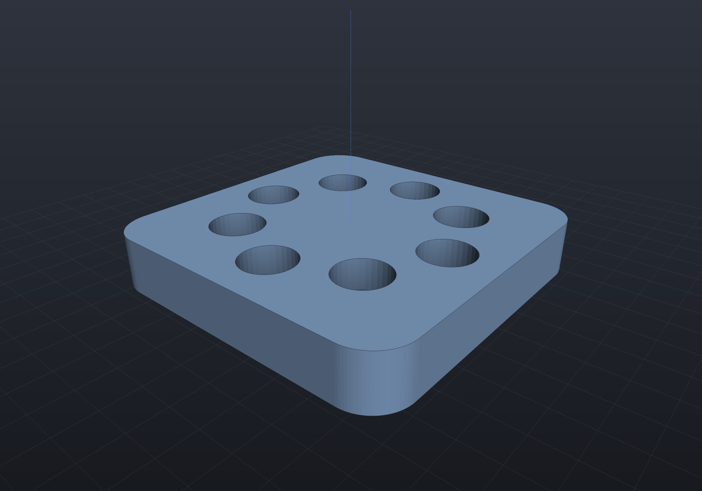

# Parametric features

A feature is a class with `[Param]` properties and a pure `Apply` body; a model is an
ordered `FeatureHistory` that regenerates on change — FeatureScript, but plain C#.

```csharp render:feature-history
sealed class BasePlate : Feature
{
    [Param(Min = 20, Units = "mm")] public double Width { get; init; } = 48;
    [Param(Min = 20, Units = "mm")] public double Depth { get; init; } = 48;
    [Param(Min = 4, Units = "mm")] public double Thickness { get; init; } = 8;

    public override Shape Apply(FeatureContext c) =>
        Shape.Extrude(Sketch.RoundedRectangle(Width, Depth, 6), Thickness);
}

sealed class BoltCircle : Feature
{
    [Param(Min = 2, Max = 24)] public int Count { get; init; } = 6;
    [Param(Min = 5, Units = "mm")] public double Radius { get; init; } = 16;

    public override Shape Apply(FeatureContext c)
    {
        var points = Enumerable.Range(0, Count)
            .Select(i => 2 * Math.PI * i / Count)
            .Select(a => new Vector2d(Radius * Math.Cos(a), Radius * Math.Sin(a)))
            .ToList();
        return c.Body!.Drill(StandardHoles.Counterbored(4), points, depth: 12, c.TopPlane);
    }
}

var history = new FeatureHistory();
history.Add(new BasePlate());
history.Add(new BoltCircle { Count = 8 });

var scene = new Scene();
scene.Add(history.ToPart("bracket", Palette.Steel));
```



`FeatureContext` gives `Apply` the running body (`c.Body`), a lazily lowered B-Rep
for [selector queries](chamfer-fillet.md) (`c.Lowered`), and the current top plane
(`c.TopPlane`). Features can also *declare* the geometry they need — a plane, a face,
an axis — as typed properties that validate up front and re-resolve every
regeneration: see [geometry inputs](geometry-inputs.md).

## Regeneration

`FeatureHistory.Regenerate` replays the list with **prefix caching** — editing
feature 5 re-runs only 5..n, keyed by instance identity + a `[Param]` snapshot (a
fresh instance always re-runs, which safely covers non-param inputs like sketches and
selectors). Validation runs first (`Min`/`Max` ranges); the first failure keeps the
last good prefix and skips the rest, and per-feature statuses report what happened.
Features can be suppressed (`Suppressed = true`), and `Feature.FromFunc` handles
one-off steps without a class.

Keep `Apply` a **pure function** of its parameters and context — the cache assumes it.

## JSON parameters

`SaveParameters` / `LoadParameters` round-trip every `[Param]` value, so a design is
re-tunable without recompiling:

```csharp run:feature-json
sealed class Plate : Feature
{
    [Param(Min = 10, Max = 100, Units = "mm")] public double Width { get; init; } = 40;

    public override Shape Apply(FeatureContext c) =>
        Shape.Extrude(Sketch.Rectangle(Width, 20), 5);
}

var history = new FeatureHistory();
history.Add(new Plate());
var result = history.Regenerate();
if (!result.Succeeded) throw new Exception(result.ToString());

var json = history.SaveParameters();          // {"Plate":{"Width":40}} (shape may evolve)
Console.WriteLine(json);

var warnings = history.LoadParameters(json);  // re-applies values; reports unknown keys
if (warnings.Count != 0) throw new Exception(string.Join("; ", warnings));
if (!history.Regenerate().Succeeded) throw new Exception("regeneration after load failed");
```

Standard features (`ExtrudeSketchFeature`, `RevolveSketchFeature`, `HoleFeature`,
`FilletRimFeature`, `ChamferRimFeature`, `BooleanFeature`, linear/circular pattern
features) cover simple histories out of the box. Their geometry inputs — the drilling
plane, the rim faces, the pattern axis — are [typed
references](geometry-inputs.md) that round-trip through the same JSON.
