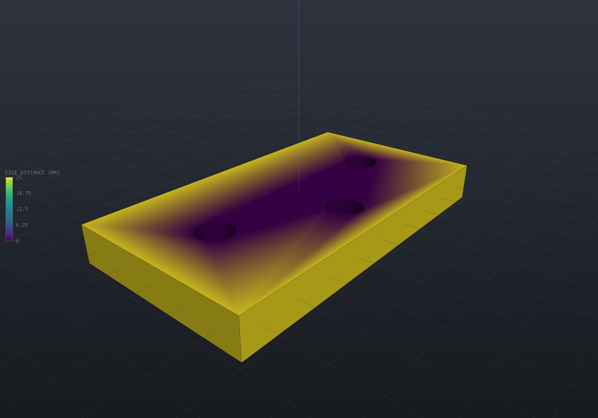
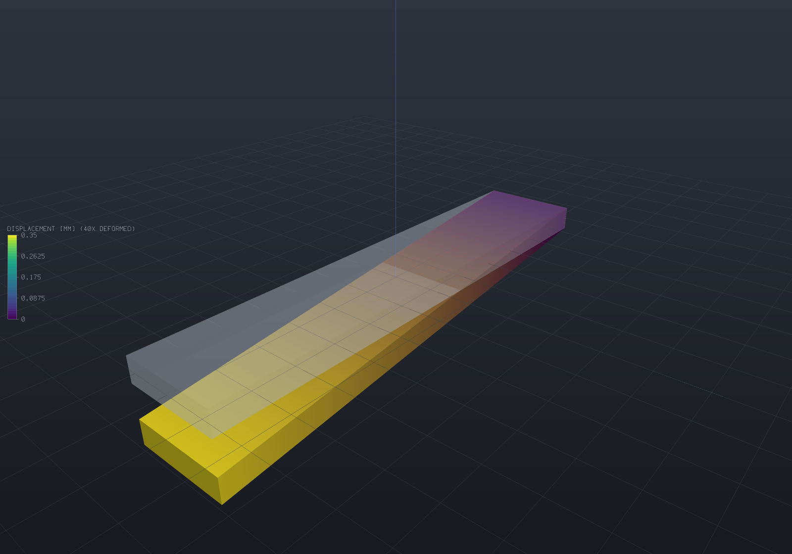
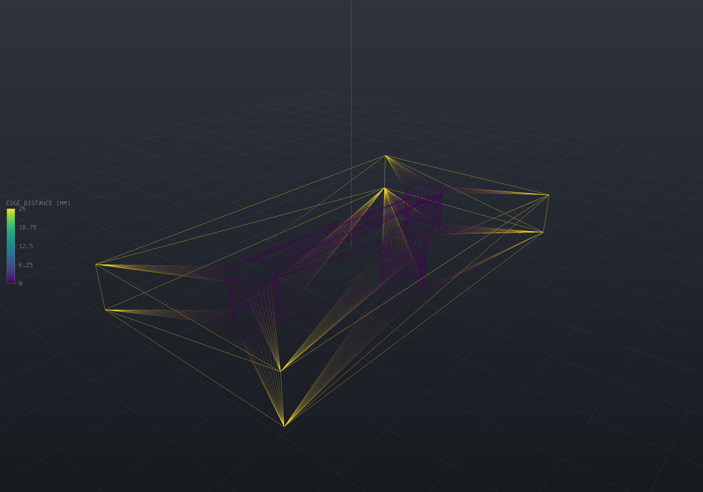

A simulation result is **data on a mesh**: one number (or one vector) per vertex, with a
name and a unit. EngrCAD carries those as `MeshField`s attached to a `Part`, colour-maps
them in every viewer, and exports them to ParaView — and none of that needs a solver,
because a field is just values. Anything that can produce a number at a point can drive
the whole pipeline: a distance, a clearance, a hand-written load case, or eventually an
FEA solve.

## Attaching a result

`MeshField.Sample` evaluates a function at every vertex of a part's display mesh, in
vertex-index order — which is exactly what a `MeshField` is indexed by.

```csharp render:field-edge-distance
// A drilled plate coloured by how far each surface point is from the nearest bore -- the
// ligament / edge-distance check, evaluated straight off the bores' own distance field.
var top = SketchPlane.At((0, 0, 5), Vector3d.UnitX, Vector3d.UnitY);
var plate = Shape.Box(90, 50, 10)
    .Drill(StandardHoles.Clearance(8), [new(-28, 0), new(0, 14), new(28, 0)], depth: 12, top);

var part = new Part("plate", plate);
var mesh = part.GetMesh();

// The bores as their own field: Evaluate is the signed distance to that surface, so on
// the plate's skin it reads "how much material to the nearest hole".
var bores = Sdf.Union(
    Sdf.Cylinder(4.5, 40).Translate((-28, 0, 0)),
    Sdf.Cylinder(4.5, 40).Translate((0, 14, 0)),
    Sdf.Cylinder(4.5, 40).Translate((28, 0, 0)));

part.AddResult(MeshField.Sample(mesh, "edge distance", "mm", p => bores.Evaluate(p)));
part.FieldDisplay = new FieldDisplay
{
    Field = "edge distance",
    Range = new FieldRange(0, 25),   // a scale chosen by the engineer, not by the data
};

var scene = new Scene();
scene.Add(part);
```



Three things are in that picture and all three come from the same handful of lines: the
plate is painted through a **perceptual colour map**, the **legend** on the left states
what the colours mean and over what range, and the range is the one the model asked for.
Several visible parts showing genuinely different displays each get their **own bar**,
stacked top-to-bottom in draw order (as many as fit vertically) — one bar over two
scales would be a legend that lies — while parts sharing one display share one bar.
Leave `Range` out and the field's own min and max are used instead — which is the right
default for a first look and the wrong one for a figure, since the bore walls sit at
distance zero give or take a rounding error and the legend would say so.

`Part.Results` is a list, so a part can carry several and `FieldDisplay` names the one to
show. Re-adding a result under an existing name **replaces** it, so re-running a solve
updates the display instead of accumulating stale twins.

```csharp run:field-attach
var part = new Part("plate", Shape.Box(40, 20, 4));
var mesh = part.GetMesh();

part.AddResult(MeshField.Sample(mesh, "von Mises", "MPa", p => 120 - 2 * Math.Abs(p.X)));
part.AddResult(MeshField.SampleVector(mesh, "displacement", "mm",
    p => new Vector3d(0, 0, -0.001 * p.X * p.X)));

if (part.Results.Count != 2) throw new Exception("both results should attach");

// A second result under the same name replaces the first (a re-solve, not a twin).
part.AddResult(MeshField.Sample(mesh, "von Mises", "MPa", _ => 0));
if (part.Results.Count != 2) throw new Exception("re-solving must not accumulate twins");
if (part.Result("von Mises")!.Range.Max != 0) throw new Exception("the live result should win");
```

## Scalars, vectors and derived fields

A vector field (a displacement, a heat flux) reads as its **magnitude** wherever one
number is wanted — colouring, the legend, the range — so `FieldDisplay { Field = "displacement" }`
plots the deflection magnitude with no extra call. `Magnitude()` and `Component(i)` produce
the derived field as an object of its own, for export or for its own legend.

```csharp run:field-derived
var mesh = Shape.Box(10, 10, 10).ToMesh();
var u = MeshField.SampleVector(mesh, "displacement", "mm", p => new Vector3d(0, 0, p.Z * 0.1));

// ScalarAt is the magnitude for a vector field; the range follows it.
if (Math.Abs(u.Range.Max - 0.5) > 1e-9) throw new Exception($"range was {u.Range}");

var magnitude = u.Magnitude();          // named "|displacement|", same units
var uz = u.Component(2);                // named "displacement.Z"
if (magnitude.IsVector || uz.IsVector) throw new Exception("both derivations are scalar");

// The magnitude is unsigned by construction; a COMPONENT keeps its sign, which is
// exactly when the diverging map earns its keep.
if (magnitude.Range.Min < 0) throw new Exception("a magnitude cannot be negative");
if (Math.Abs(uz.Range.Min + 0.5) > 1e-9) throw new Exception($"uz should reach -0.5, was {uz.Range}");
```

## The deformed shape

A displacement result can *move* the model, with the undeformed shape ghosted behind it,
because the comparison is the point.

```csharp render:field-deformed
// A cantilever plate under an analytic deflection, exaggerated 40x. The colour is the
// deflection magnitude; the faint body behind it is the undeformed plate.
var part = new Part("cantilever", Shape.Box(120, 24, 6), Palette.Steel);
var mesh = part.GetMesh();

// A tip-loaded cantilever's shape: w(x) proportional to x^2 (3L - x), fixed at x = 0.
const double L = 120, tip = 0.35;
double Deflection(double x) => -tip * (x * x * (3 * L - x)) / (2 * L * L * L);

part.AddResult(MeshField.SampleVector(mesh, "displacement", "mm",
    p => new Vector3d(0, 0, Deflection(p.X + 60))));
part.FieldDisplay = new FieldDisplay
{
    Field = "displacement",     // a vector result colours by its magnitude
    Deform = "displacement",
    DeformScale = 40,           // real deflections are invisible; the legend states the factor
};

var scene = new Scene();
scene.Add(part);
```



The legend's title carries `40X DEFORMED`, deliberately: a deformed plot whose
exaggeration is not stated is a picture of a shape that does not exist. Set
`ShowUndeformed = false` to drop the ghost, or `DeformScale = 0` to leave the geometry
alone entirely.

A deformed part **draws its feature-edge overlay, displaced with the shape**: each edge
sample carries its own displacement (interpolated from the field at the sample's nearest
mesh facet — exact for any affine displacement, and within the facets' own interpolation
otherwise), riding a line-program attribute under the same `uDeformScale` the fills
follow, so the outline is right at every exaggeration and animating it is still one
float per frame. The wireframe view follows the displacement the same way — its
endpoints are mesh vertices, so they take their own displacement vectors exactly.
Picking follows what is drawn at the part's own scale, so a click selects the part
where it is on screen.

**The displacement is sent once, as a vertex attribute**, and the shader applies
`position + uDeformScale * displacement`. A mesh with no displacement buffer reads zero,
so a part with no results is untouched however the uniform is set — the same
constant-when-absent rule the colour attribute follows. Two consequences worth knowing:
the exaggeration is one float, so **animating it is free** (see
[the load ramp](animation.md#a-structural-result-under-load)); and the shading is exact
rather than carried over, because a facet normal is exactly quadratic in the scale, so
three coefficients reproduce it at every exaggeration.

## Every view style reads the field

A field-coloured part keeps its result colours in **Wireframe** and **Points** too:
the wireframe's segments take each endpoint's own vertex colour (from the same
mapping the fills use, so the two readings cannot disagree) and the point sprites
read the mesh's colour buffer directly. A part with no result keeps its part colour,
exactly as before — and a **cell**-associated field keeps the part colour in
wireframe, honestly: a mesh edge borders two faces, so an endpoint has no one cell
colour to take.

```csharp render:field-wireframe
// The edge-distance plate again, drawn as a wireframe: the mesh edges carry the
// field's colours, so the structure and the values read together.
var top = SketchPlane.At((0, 0, 5), Vector3d.UnitX, Vector3d.UnitY);
var plate = Shape.Box(90, 50, 10)
    .Drill(StandardHoles.Clearance(8), [new(-28, 0), new(0, 14), new(28, 0)], depth: 12, top);

var part = new Part("plate", plate) { DisplayMode = DisplayMode.Wireframe };
var mesh = part.GetMesh();

var bores = Sdf.Union(
    Sdf.Cylinder(4.5, 40).Translate((-28, 0, 0)),
    Sdf.Cylinder(4.5, 40).Translate((0, 14, 0)),
    Sdf.Cylinder(4.5, 40).Translate((28, 0, 0)));

part.AddResult(MeshField.Sample(mesh, "edge distance", "mm", p => bores.Evaluate(p)));
part.FieldDisplay = new FieldDisplay
{
    Field = "edge distance",
    Range = new FieldRange(0, 25),
};

var scene = new Scene();
scene.Add(part);
```



## Transient playback

A transient run's stored steps play back as a **field-sequence track** — the fifth
animation slot, and the one whose sample is a result *selection* rather than matrices,
a camera or a scalar. Steps are (result name, **real seconds**) pairs; `t` maps
linearly over the run's real span with **hold-last-step** semantics, because the
stored states are the answers at their own instants — holding is honest where tweening
colours between two solutions would invent a state the solver never produced. A part
participates when it carries a display and *all* the run's steps as results; the clip
shows **one range** throughout (the display's explicit range, else the union of the
steps' own), since a legend that rescales per frame lies. Applying a step re-uploads
one colour buffer and nothing else — measured at 0.042/0.68 ms per frame on
12k/195k-vertex meshes — and a still of the animation at a step is byte-identical to a
static render of the same configuration. The batched APNG/frame export applies the same
rule per frame through the shared upload cache, and the browser viewer applies it
through a colours-only buffer update — so an exported clip, the desktop window and the
web viewer all play a transient run's steps from one rule.

The axis itself is **document data**: `Part.AddResultSequence` publishes a run's states
as ordinary results under derived names ("T @ 0.5s") and records a `ResultSequence` —
the order and the instants — which persists with the document (write-only-when-stated,
so a document using none is byte-identical) and from which `FieldSequenceTrack.For`
builds the playback by one rule. A reloaded document then knows not just its states but
WHEN they were; the track and the saved axis cannot disagree. A re-published sequence
under the same name replaces the old one and removes any steps it no longer uses, so a
re-solve with different instants cannot leave stale twins behind.

```csharp run:field-sequence
var part = new Part("plate", Shape.Box(20, 10, 2));
var mesh = part.GetMesh();

// Publish the run WITH its time axis: each step becomes a result named "T @ ...s",
// and the ResultSequence records the order and instants a saved document used to lose.
part.AddResultSequence("T", [
    (MeshField.Sample(mesh, "state", "K", p => 300 + p.X), 0.0),
    (MeshField.Sample(mesh, "state", "K", p => 300 + 4 * p.X), 5.0),
]);
part.FieldDisplay = new FieldDisplay { Field = "T @ 0s" };

var track = FieldSequenceTrack.For(part, "T");   // the saved axis IS the playback
if (track.FieldAt(0) != "T @ 0s" || track.FieldAt(1) != "T @ 5s")
    throw new Exception("t maps over the run's real time");
if (track.FieldAt(0.49) != "T @ 0s")
    throw new Exception("hold-last: 2.45 s still shows the 0 s step");

// The run's one range: the union of the steps' own.
var range = track.RunRange(part);
if (range.Min != 260 || range.Max != 340)
    throw new Exception($"the clip's range is the union, was {range.Min}..{range.Max}");
```

## Colour maps and ranges

Two maps, and the choice matters:

| `FieldColorMap` | For |
| --- | --- |
| `Viridis` (default) | A **magnitude** — stress, temperature, deflection — where only "more" and "less" mean anything. Monotone in lightness, so it survives greyscale printing and colour-vision deficiency. |
| `Diverging` | A **signed** quantity where the crossing is the interesting value. Blue–grey–red, with the neutral midpoint at the middle of the range. |

A diverging map only means what it looks like over a range centred on zero, and EngrCAD
will not silently re-centre one for you — quietly widening a range would change what the
numbers on the legend say. Ask for it:

```csharp run:field-diverging
var mesh = Shape.Box(60, 20, 4).ToMesh();
var bending = MeshField.Sample(mesh, "bending stress", "MPa", p => 12 * p.Z);

var display = new FieldDisplay
{
    Field = "bending stress",
    ColorMap = FieldColorMap.Diverging,
    Range = bending.Range.SymmetricAboutZero(),   // so grey means zero
};

var range = display.Range!.Value;
if (Math.Abs(range.Min + range.Max) > 1e-12) throw new Exception("the range should straddle zero");
if (Math.Abs(range.Normalize(0) - 0.5) > 1e-12) throw new Exception("zero should land mid-map");
```

An explicit `Range` is also how several parts — or several load cases — are made
**comparable**: without one, each field spans its own min and max and every picture gets
its own private scale.

Two range behaviours are worth knowing. A **constant** field normalizes to 0.5 rather
than to an end, because a field with no variation has no position to report and an
extreme colour would read as a hot spot. And **NaN is skipped** when ranging, so one
undefined value does not collapse a legend — and it **paints a distinct neutral grey**
(`ColorMaps.NoValueColor`): NaN is "no value" (an infinite fatigue life, a part with
no data in a merged export), not "small", so it must not take the bottom of the ramp
and read as the smallest finite value. When the displayed field carries a no-value
node the legend adds a matching **NO VALUE** swatch below the bar; a finite field's
legend is unchanged. A `LogScale` display's non-positive values land in the same
grey for the same reason — a log scale has no position for them.

### Log-scale fields

A field whose values are **base-10 logarithms** declares it in its units string —
`log10(cycles)`, the convention the [fatigue life field](fea-fatigue.md) established —
and the legend reads that declaration: tick labels print the **anti-logged** values,
ticks sit on the integer decades where the range spans at least two of them (with the
end ticks always printing the true range), and the title states the base units with a
`LOG SCALE` tag. The units string is the one opt-in, made by the field's producer and
carried by the field itself, so it round-trips wherever the field does; the colour
mapping stays linear over the log values, which is exactly what a log colour axis is.

```csharp run:field-log-legend
var life = MeshField.Scalar("life", "log10(cycles)", [2.0, 6.5, 10.0]);
if (!FieldLegend.TryLogUnits(life.Units, out var baseUnits) || baseUnits != "cycles")
    throw new Exception("the units string declares the log transform");

var display = new ResolvedFieldDisplay(
    life, new FieldRange(2, 10), FieldColorMap.Viridis, null, 1, true);
var ticks = FieldLegend.TickMarks(display);
if (ticks[0].Label != "100" || ticks[^1].Label != "1E+10")
    throw new Exception("ticks must print anti-logged values");
if (FieldLegend.Title(display) != "LIFE [CYCLES, LOG SCALE]")
    throw new Exception("the title must state the base units and the scale");
```

A field carrying **real values** that span decades (raw cycle counts, contact
pressure) takes the other spelling: **`FieldDisplay.LogScale`**. The colour position
becomes `(log₁₀v − log₁₀min)/(log₁₀max − log₁₀min)`, so a value one decade up the
range moves one decade up the ramp; a non-positive value has no log position and
paints the no-value grey (NaN's own convention); the legend prints
the **same decade ticks** the units spelling prints for the same data — the two
share one tick builder, so they cannot drift — and the title tags the field's own
units `LOG SCALE`. A log display needs a **strictly positive range** and is refused
by name when it resolves otherwise; the flag rides in the document file
write-only-when-set, so a file that never uses it is byte-identical. A display wants
one spelling or the other, never both: the units string says the *values* are
already logged, the flag says the *colours* should log them.

```csharp run:field-logscale-flag
var life = MeshField.Scalar("life", "cycles", [10.0, 1e3, 1e5]);
var display = new ResolvedFieldDisplay(
    life, new FieldRange(10, 1e5), FieldColorMap.Viridis, null, 1, true, LogScale: true);

// 10^3 is the LOG midpoint of [10, 10^5] — linearly it would sit at t = 0.0099.
var colors = FieldRendering.SourceColors(life, display.Range, display.ColorMap, logScale: true);
if (colors[1] != ColorMaps.Sample(FieldColorMap.Viridis, 0.5))
    throw new Exception("the decade midpoint must take the map's middle colour");
if (FieldLegend.Title(display) != "LIFE [CYCLES, LOG SCALE]")
    throw new Exception("the title must tag the scale");
```

```csharp run:field-range
if (new FieldRange(4, 4).Normalize(4) != 0.5) throw new Exception("a constant field sits mid-map");
if (!FieldRange.Of([1, double.NaN, 5]).Equals(new FieldRange(1, 5)))
    throw new Exception("NaN must not poison a range");

// The colours the legend and the fills both use come from one call.
var cold = ColorMaps.Sample(FieldColorMap.Viridis, new FieldRange(0, 100), 0);
var hot = ColorMaps.Sample(FieldColorMap.Viridis, new FieldRange(0, 100), 100);
if (cold.B <= cold.R || hot.R <= hot.B) throw new Exception("viridis runs blue to yellow");
```

## Exporting to ParaView (`.vtu`)

`--export scene.vtu` writes a VTK XML unstructured grid: the flattened instances' geometry
merged into one grid, plus every part's results as point-data arrays.

```csharp run:field-vtu
var part = new Part("plate", Shape.Box(40, 20, 4));
var mesh = part.GetMesh();
part.AddResult(MeshField.Sample(mesh, "von Mises", "MPa", p => 40 + p.Z * 4));
part.AddResult(MeshField.SampleVector(mesh, "displacement", "mm",
    p => new Vector3d(0, 0, -0.002 * p.X * p.X)));

string path = Path.Combine(Scratch, "plate.vtu");
VtuWriter.WriteFile(mesh, part.Results, path);

var root = System.Xml.Linq.XDocument.Load(path).Root!;
if ((string?)root.Attribute("type") != "UnstructuredGrid") throw new Exception("wrong grid type");

var arrays = root.Descendants("PointData").Single().Elements("DataArray")
    .ToDictionary(e => (string)e.Attribute("Name")!, e => (string?)e.Attribute("NumberOfComponents"));
if (arrays["von Mises"] != "1") throw new Exception("stress should be a scalar array");
if (arrays["displacement"] != "3") throw new Exception("displacement should be a vector array");
```

The writer's seam is deliberately **(points, cells, cell types, point data)** rather than
a mesh type: a surface result writes triangles, quads and polygons today, and a
volumetric mesher writes `VtkCellType.Tetra` through the same call with nothing in the
writer changing.

When a scene merges several parts, the arrays are the **union** of their result names and
a part that lacks one contributes `NaN` — VTK's own "no value", which ParaView paints in
the map's NaN colour. Dropping the array would lose the result that does exist, and zeros
would show a fake safe region.

## Where results fit in the document

Results live on the `Part`, not in a viewport. That is what makes them survive tab and
scene plumbing, appear identically in the desktop window, a headless render and the
browser client, and be visible to a script with no viewer reference at all.

Attaching a result is free and **never meshes anything**, so it does not interfere with
`Scene.PreMesh` running parts in parallel. The one contract to keep is that a field's
values index the part's **display-mesh vertices, in vertex order** —
`part.GetMesh().VertexCount` of them. A field of the wrong length is reported by name
when something tries to draw it, never silently ignored:

```csharp run:field-mismatch
var part = new Part("plate", Shape.Box(10, 10, 10));
part.AddResult(MeshField.Scalar("stress", "MPa", [1, 2, 3]));   // far too short
part.FieldDisplay = new FieldDisplay { Field = "stress" };

// Resolution itself succeeds -- it does not mesh, deliberately, so a properties panel or
// an MCP tool can call it with no GL. The length check belongs to whatever draws it.
if (!part.TryResolveFieldDisplay(out var display, out _)) throw new Exception("should resolve");
if (display.Field.Count == part.GetMesh().VertexCount) throw new Exception("this field is short");

// A display naming a result that is not there fails loudly, and says what IS there.
part.FieldDisplay = new FieldDisplay { Field = "temperature" };
if (part.TryResolveFieldDisplay(out _, out string? error)) throw new Exception("should fail");
if (error is null || !error.Contains("stress")) throw new Exception("the error should list the results");
```

In the viewer the **Fields** toolbar toggle switches the whole thing off (every part back
to its own colour and undeformed shape) and the properties panel shows the selected part's
results, the one being displayed, its range and any deformation scale — with a **Result
dropdown** switching which result the part shows (the load-step/frequency selector in its
honest discrete form: results are named states, so the control is a choice, not a range).
Switching keeps the rest of the display — deformation, range, map — and it is one
undoable edit through the same seam saving and MCP share. Headlessly,
`EngrCad.RenderToImage(scene, path, fields: false)` does the same — which is how a
geometry figure is taken of a model that also carries results.

## Cell-associated fields

A field is **vertex**-associated by default, and interpolates across faces; a
**cell**-associated field (`MeshField.CellScalar`, or the constructor's
`FieldAssociation.Cell`) carries one value per face — an element quality, a material id, a
per-element stress — and renders *flat* on each. The association is part of the field's
identity: every derived operation (`Magnitude`, `Component`, `Renamed`, `Scaled`)
preserves it, `VtuWriter` routes each field to `PointData` or `CellData` by it (counts
validated against the right total), and the flat render mesh's source-face map places a
cell value on every duplicate of its face's corners, so the flat look needs no shader
change. A *smooth* render mesh shares vertices between faces, so it honestly carries no
face map and a cell display on one refuses with the reason. A structural `.vtu` now
carries the per-element von Mises as cell data beside the recovered nodal field — the
value the assembly actually integrated, before any nodal recovery.
