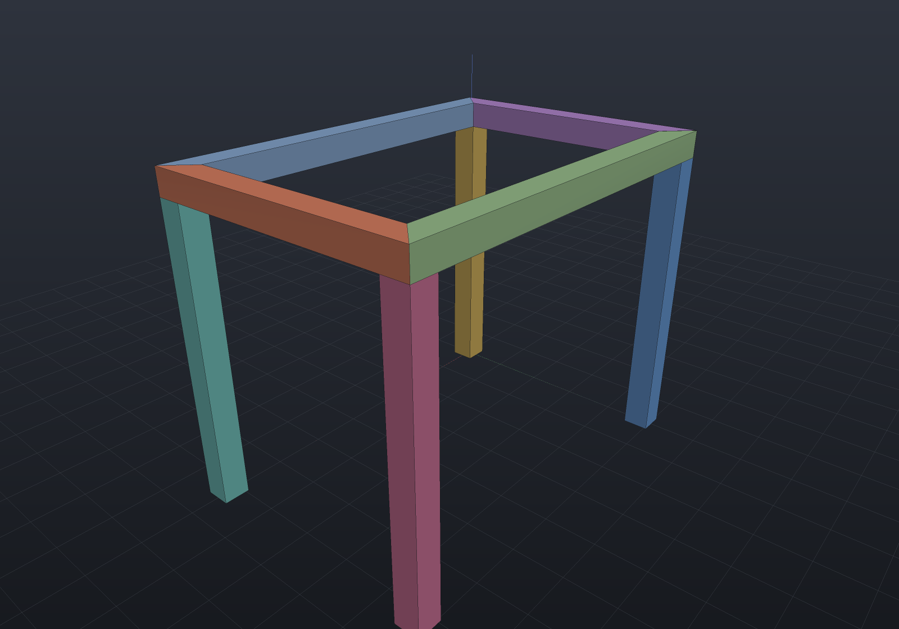
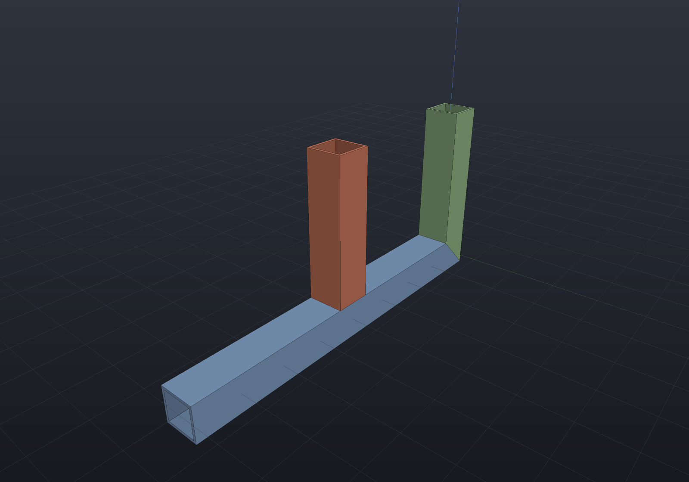

`Weldment` builds a frame of straight structural members on a skeleton of runs — the
SolidWorks-weldments capability, assembled from machinery that already exists: a
profile is a [sketch](extrude-revolve-sweep.md) (so a hollow section's wall thickness
is exact), each member is one extrusion of it, a joint is an exact bisector-plane cut,
and the cut list is the [BOM](assemblies.md) reading each member's stock length.

`FrameProfile` has factories for flat bar, SHS/RHS box sections, equal angles, plain
channels and round tube (plus a small `StandardSections` catalogue of common metric
sizes — nominal EN-series dimension sets, verify against the current datasheet), and
any custom closed sketch works. The run line passes through the profile sketch's
origin: symmetric sections are centred on it, an angle sits with its heel on it.

```csharp render:frames-stand
var shs = StandardSections.Shs25x2;

// A table frame: a mitred top rectangle on four legs.
var top = Weldment.Path(shs,
    [new Vector3d(0, 0, 300), new Vector3d(360, 0, 300),
     new Vector3d(360, 240, 300), new Vector3d(0, 240, 300)],
    closed: true, new WeldmentOptions { Material = Materials.Steel, Name = "top" });
var legs = Weldment.Build(shs,
[
    (new Vector3d(0, 0, 0), new Vector3d(0, 0, 287.5)),
    (new Vector3d(360, 0, 0), new Vector3d(360, 0, 287.5)),
    (new Vector3d(360, 240, 0), new Vector3d(360, 240, 287.5)),
    (new Vector3d(0, 240, 0), new Vector3d(0, 240, 287.5)),
], new WeldmentOptions { Material = Materials.Steel, Name = "legs" });

var scene = new Scene();
var tab = scene.AddTab("stand");
tab.Add(top.ToAssembly());
tab.Add(legs.ToAssembly());
```



Joints are detected wherever exactly two runs share an endpoint (a `Path` shares them
by construction). Under the default `FrameJointStyle.Miter` both members are cut back
by the **exact bisector plane** — for a joint at `j` between members leaving along
unit directions `a` and `b`, the plane through `j` with normal `a − b`, which
contains both the angle bisector and the axes' common normal with no division
anywhere. Each member is extruded overlong past the joint and a box tool whose base
face lies exactly on that plane subtracts the stub, so every boolean is transversal
(never coplanar input) and every cut curve is analytic: plane∩plane lines on
polygonal sections, the exact plane∩cylinder ellipse on a mitred round tube.

The two halves of a joint are separate parts meeting face-to-face on the
bit-identical plane, which is what makes the volumes verifiable in closed form: a
prism cut by planes at both ends has volume `A · (axial distance between the planes'
crossings of the centroid fiber)` — so a mitred member of a centred profile is
exactly `A·L`, and a closed rectangular frame totals exactly `A · perimeter`.

## T-joints

A run ending on another run's **interior** is a T-joint: the through member keeps its
full section past the joint — the same role the butt joint's through run plays — and
the abutting member is trimmed back by the through member's facing wall plane, so the
weld gap is exactly zero and the volumes stay closed forms (the rail below keeps
exactly `A · (run length − half the post's width)`).

```csharp render:frames-tee
var shs = StandardSections.Shs40x3;
var frame = Weldment.Build(shs,
[
    // The through rail, a mid-post butting its side, and an ordinary corner post.
    (new Vector3d(0, 0, 0), new Vector3d(400, 0, 0)),
    (new Vector3d(200, 0, 180), new Vector3d(200, 0, 0)),
    (new Vector3d(0, 0, 180), new Vector3d(0, 0, 0)),
], new WeldmentOptions { Up = Vector3d.UnitY, Material = Materials.Steel });

var scene = new Scene();
scene.AddTab("tee").Add(frame.ToAssembly());
```



What a T-joint refuses is the shapes with no one honest answer, each by name: a
**collinear** landing (the members overlap along one line — split the through run
instead), an endpoint on **two** interiors (which wall trims is ambiguous), a
**three-member confluence** (an end joint whose point also lies on a third run's
interior), and a **round-walled** through member — that is the coped saddle again,
refused with the tracer reason.

## The BOM is the cut list

Every member's `Part` carries `CutLength` — its exact overall axial extent after
trimming (a mitred end counts to its longest point), which is the stock you order.
`BomLine.CutLength` projects it, the BOM's text and CSV reports gain a CUT column
plus a total-stock footer whenever any line states one, and identical members share
their name (`designation x cut length`) so `Bom.ByItem()` rolls them up into one
cut-list line per stock length:

```csharp run:frames-cutlist
var shs = StandardSections.Shs40x3;
var frame = Weldment.Path(shs,
    [new Vector3d(0, 0, 0), new Vector3d(500, 0, 0),
     new Vector3d(500, 0, 300), new Vector3d(0, 0, 300)],
    closed: true,
    new WeldmentOptions { Up = Vector3d.UnitY, Material = Materials.Steel });

var bom = Bom.For(frame.ToAssembly());
Console.WriteLine(bom.ToText(mass: true));
foreach (var (item, quantity, _) in bom.ByItem())
    Console.WriteLine($"cut {quantity} x {item}");
```

## Scope, honestly

Straight members of one profile per weldment; joints of exactly two members. `Butt`
joints trim the later run back to the earlier (through) member's flat wall, and a
T-joint trims a run ending mid-member back the same way — while a
round tube as the through member is the **coped saddle** joint, which is refused by
name rather than approximated: the saddle is a transcendental cylinder∩cylinder
intersection the surface-intersection tracer is known to under-seed at
structural-section scales, so the cut would be a sampled polyline whose error no
tessellation density can lower. Multi-member joints, zero-angle joints, members
consumed by their own end cuts and joint trims of Bézier-outline profiles are all
refused by name; curved members, mixed profiles per skeleton and corner reliefs are
future work.
