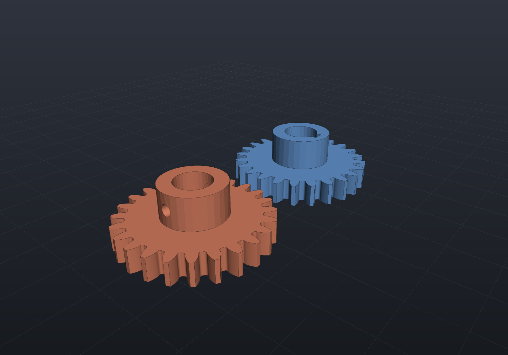
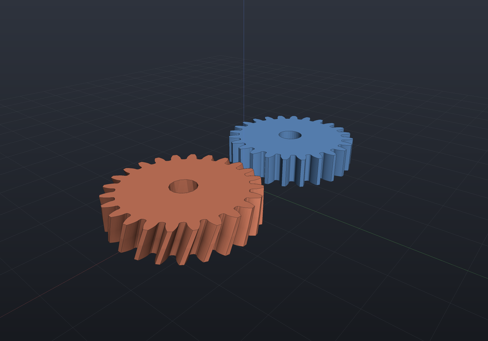
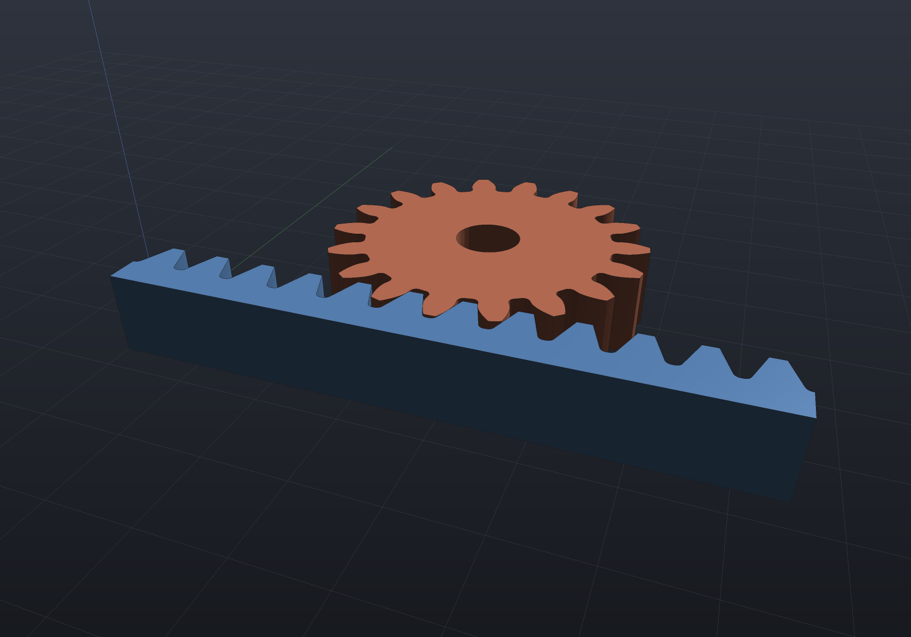
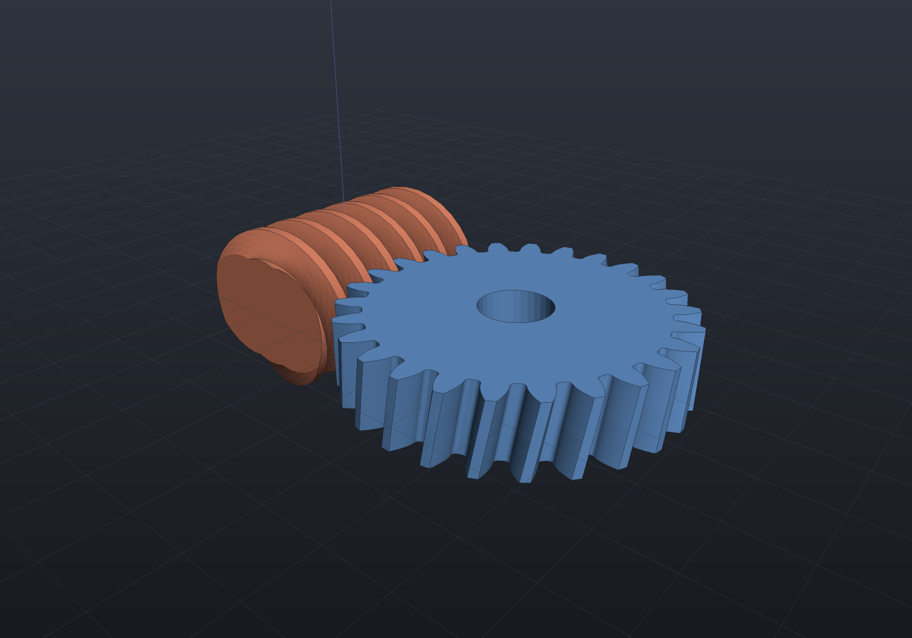
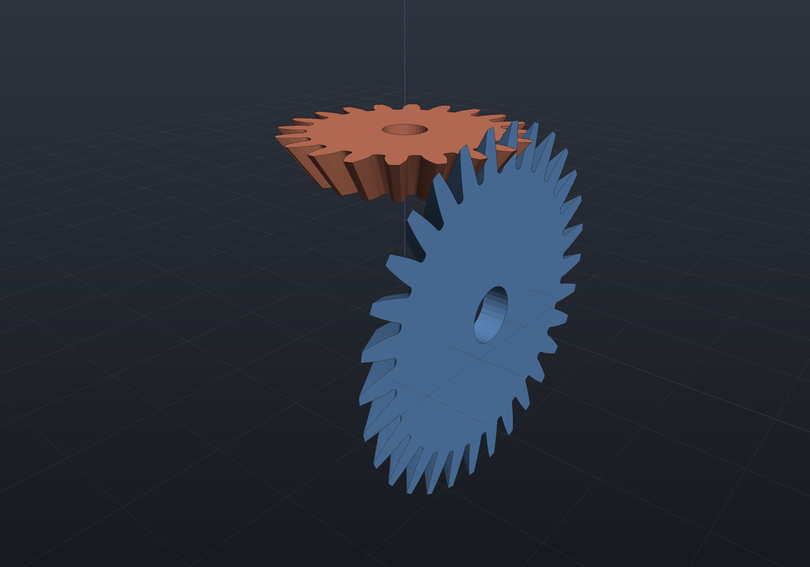
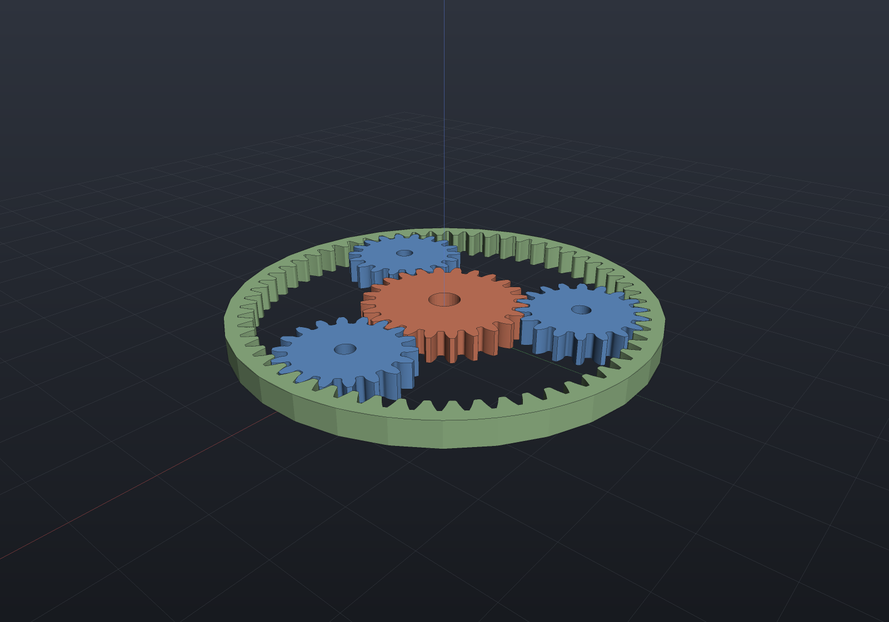
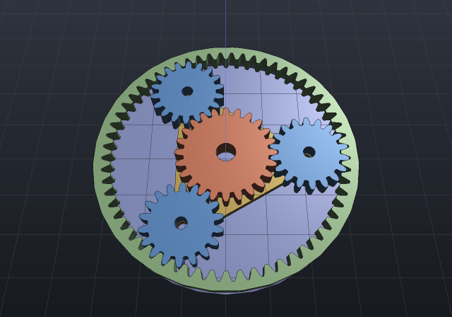
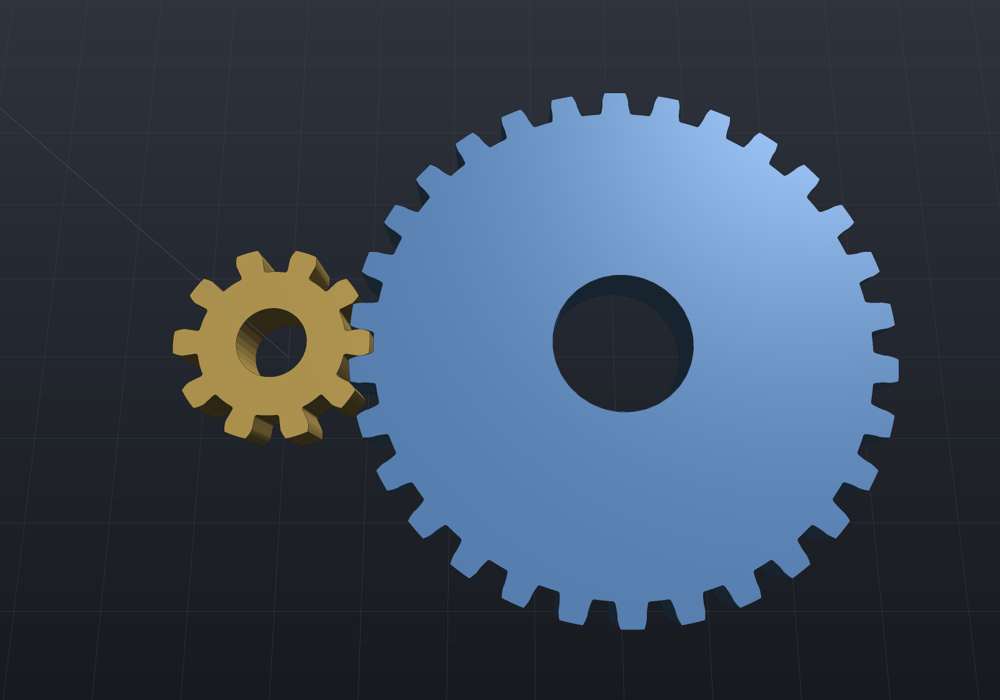
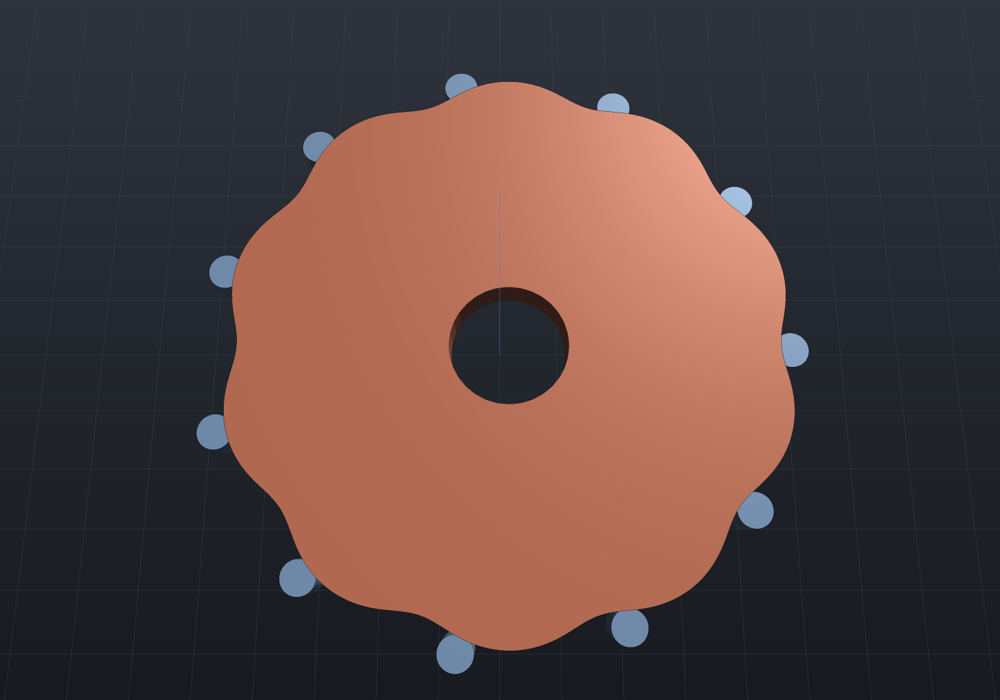

Gear geometry lives in `EngrCAD.Modeling`, beside the [mechanisms](mechanisms.md)
layer that drives it. The two are deliberately separate concerns: this page is
about **tooth form** — what the flanks are and how exactly they are represented —
while a `Coupling.Gear` in a `Mechanism` constrains the *ratio* and cares nothing
about whether a tooth was ever drawn.

That separation is also why the verification here never leans on the solver. A
gear coupling **enforces** the ratio a conjugacy test would be asserting, so
measuring transmission through one proves nothing about the flanks; every claim
below is measured from **contact**, by bisecting a generated sketch's exact signed
distance against its mate's outline.

## What is supported

| Form | Route | Exact in | The honest limit |
|---|---|---|---|
| **Spur** (involute) | biarc-fitted involute flanks, deviation reported | all three | — |
| **Helical** | the spur profile as the *transverse* section, twisted extrusion | mesh, implicit | a twist has no exact B-Rep form |
| **Herringbone** | two opposite-hand halves welded by index at a mirror plane | mesh, implicit | the apex relief groove is refused — see below |
| **Crossed helical** | two helicals on skew shafts, `Σ = β₁ + β₂` | mesh, implicit | **point** contact, so it carries little load |
| **Rack** | straight flanks — the involute's own limit | all three | — |
| **Worm** | a thread: one boolean-free helical sweep of a ZA profile | all three | — |
| **Worm wheel** | a helical gear at the worm's lead angle | mesh, implicit | the **crossed-helical approximation**, not a throated wheel |
| **Straight bevel** | Tredgold's back cone, lofted toward the apex | all three | an approximation *by construction*; ends are planes, not cones |
| **Spiral bevel / hypoid** | — | — | **refused by name**: machine-tool kinematics, not a profile |
| **Planetary** | an arrangement; internal ring needs no boolean | all three | interference checks are the external pair's |
| **Cycloidal** | epicycloid faces, hypocycloid flanks, fitted | all three | conjugate only at the **design centre distance** |
| **Cycloidal drive** | the same family offset by the roller radius | all three | one-lobe difference is a **theorem**, not a limit |

Every profile enters the `Sketch` vocabulary as lines and circular arcs, which is
what makes most of these exact in all three representations rather than a
tessellation: a fitted flank is a tangent-continuous **biarc chain whose deviation
from the closed form is measured and reported** (`MaxFitDeviation`), and the tip
arcs, root arcs and root fillets are exact by construction. Where a form is
mesh-only it is because of its *sweep* — a twist — and not its tooth form.

**The rack is the one member with no fit at all**, which is why `RackProfile`
carries no `MaxFitDeviation` for there to be: straight `Line2d` flanks and exact
`Arc2d` fillets. Its absence is the statement.

## Involute gear geometry

`Coupling.Gear` constrains a ratio; `Gears.Spur` draws the teeth. A `GearSpec` is
the standard vocabulary — module, tooth count, pressure angle (20° default),
profile shift — with the ISO 53 basic rack (profile A) proportions as overridable
coefficients, and its derived properties state the base-circle identities as
arithmetic: base pitch = π·m·cos α, base diameter = z·m·cos α, tooth thickness
= m·(π/2 + 2x·tan α).

The flank is the closed-form involute of the base circle, entered into the sketch
vocabulary as a tangent-continuous **biarc chain with the deviation reported**
(`GearProfile.MaxFitDeviation`, `BiArcFit`'s convention) — at the default
tolerance of module·10⁻⁴ a flank costs about 16 arcs. Everything else in the
outline is exact by construction: the tip and root arcs, the root fillets (whose
involute tangency is a closed form), and the radial stretch below the base circle,
which meets the involute's cusp tangent-continuously because that cusp tangent
*is* radial. What the factory cannot stand behind it refuses by name: tooth
counts below the rack undercut limit z_min = 2(h_a* − x)/sin²α (where a
generating cutter would trochoid-trim the root), pointed teeth, and fillets that
do not fit their gap.

```csharp render:mechanism-involute
var pinionSpec = new GearSpec(module: 2, teeth: 18);
var wheelSpec = new GearSpec(module: 2, teeth: 28);

var pinion = Gears.Spur(pinionSpec);          // the profile, deviation reported
if (pinion.MaxFitDeviation > pinion.FitTolerance)
    throw new Exception("the fit must honor its stated tolerance");
if (Math.Abs(pinionSpec.BasePitch - Math.PI * pinionSpec.BaseDiameter / 18) > 1e-12)
    throw new Exception("base pitch is an identity");

// Where the wheel sits and how far it must be turned, DERIVED rather than
// re-derived at the call site - see "Putting a pair in mesh" below.
if (Math.Abs(GearMeshing.ExternalCentreDistance(pinionSpec, wheelSpec)
        - (pinionSpec.PitchDiameter + wheelSpec.PitchDiameter) / 2) > 1e-12)
    throw new Exception("the standard centre distance is m(z1 + z2)/2");

var placement = GearMeshing.External(pinionSpec, wheelSpec);
var pinionShape = Gears.SpurGear(pinionSpec, faceWidth: 8, boreDiameter: 8);
var wheelShape = placement.Place(Gears.SpurGear(wheelSpec, faceWidth: 8, boreDiameter: 12));

var scene = new Scene();
var tab = scene.AddTab("gears");
tab.Add(new Part("pinion", pinionShape, Palette.Coral));
tab.Add(new Part("wheel", wheelShape, Palette.Sky));
```


The verification behind it is the law of gearing *asked rather than assumed*: two
generated gears are mounted at an extended centre distance (which an involute pair
tolerates — the ratio is set by the base circles, not the mounting) and rotated
into drive-flank contact by bisecting the pinion sketch's exact signed distance
over the wheel's outline. Through a sweep long enough to hand contact from tooth
pair to tooth pair, the measured transmission stays constant to ~9×10⁻⁶ rad —
and the same instrument reads 5.6×10⁻³ rad for a 25° wheel forced against a 20°
pinion, so it can see a wrong flank, not just a wrong ratio.

Because the tooth profile is lines and circular arcs, a spur gear is exact in all
three representations; a bore is one `boreDiameter` argument, and keyways are a
filed follow-up. Everything below is this profile put to work — swept along a
helix, mirrored, laid flat, or replaced by a different flank curve entirely.

## Backlash, and the inspection dimensions

A real pair runs with clearance: `GearSpec.Backlash` thins **this gear's** teeth by
`j` at the pitch circle (each flank rotates `j/(2·r_pitch)` toward the tooth centre —
exact, since an involute rotated about its own centre is the same involute at another
phase), so a pair's circumferential play is the *sum* of the two members' allowances.
The default 0 is the zero-backlash nominal every existing gear draws, bit for bit.

The two dimensions an inspector actually measures ride as arithmetic on the spec, and
each is held to the drawn sketch rather than to its own formula: the **span (base
tangent) measurement** over k teeth, `W = (k−1)·p_b + cos α·(s + m·z·inv α)` — the
textbook `m·cos α·((k−½)π + z·inv α) + 2x·m·sin α` at zero backlash, dropping by
exactly `j·cos α` with the allowance — and the **measurement over pins**, whose
contact pressure angle solves `inv α_M` in closed form and inverts by Newton (even
tooth counts measure across a diameter, odd across `cos(90°/z)`). A span whose caliper
contact would miss the flank, a pin too small to reach it (it would seat on the root
fillet) and a pin too large to seat are each refused by name.

```csharp run:gear-measurements
var spec = new GearSpec(module: 2, teeth: 20) { Backlash = 0.1 };
if (Math.Abs(spec.ToothThicknessAtPitch - (Math.PI - 0.1)) > 1e-12)
    throw new Exception("the allowance thins the pitch thickness by exactly j");

double nominal = new GearSpec(module: 2, teeth: 20).SpanOverTeeth(3);
double alpha = Math.PI / 9;
if (Math.Abs(spec.SpanOverTeeth(3) - (nominal - 0.1 * Math.Cos(alpha))) > 1e-12)
    throw new Exception("a pitch-circle thinning is a base-circle thinning times cos(alpha)");

double overPins = spec.MeasurementOverPins(3.5);
if (!(overPins > spec.TipDiameter))
    throw new Exception("the pins stand proud of the tips on a standard gear");
```

## A keyed bore

A gear drives through a key, and the hub's half of a DIN 6885 parallel-key seat is a
notch in the bore: `StandardKeys.For(shaftDiameter)` transcribes the standard's key
width and hub depth t2 (⚠ verify against the datasheet for your fit class, the
`StandardHoles` convention), and passing the spec as `keyway:` to `SpurGear` or
`HelicalGear` cuts it. The notch corners sit exactly **on** the bore circle, so the
hole profile is one arc and three lines — exact in all three representations — and its
area is closed form, which is what the tests hold the sketch and the solid to.

```csharp run:gear-keyed-bore
var keyway = StandardKeys.For(20);      // 6 wide, hub depth 2.8
var bore = Gears.KeyedBore(20, keyway);

double r = 10, half = keyway.Width / 2, chord = Math.Sqrt(r * r - half * half);
double area = Math.PI * r * r + keyway.Width * (r + keyway.HubDepth)
    - keyway.Width * chord / 2 - r * r * Math.Asin(half / r);
if (Math.Abs(bore.Area() - area) > 1e-9)
    throw new Exception("the keyed bore's area is closed form");

var gear = Gears.SpurGear(new GearSpec(2.5, 24), faceWidth: 8, boreDiameter: 20, keyway);
if (gear.ToMesh().Volume() <= 0) throw new Exception("the keyed gear is a solid");

// Web lightening: N holes on a bolt circle (default: the web's own middle), each
// removing exactly pi*d^2/4 of blank area; holes reaching the bore, the root circle
// or each other are refused by name.
var light = Gears.SpurGear(new GearSpec(2.5, 30), faceWidth: 8, boreDiameter: 16,
    lightening: new LighteningSpec(count: 5, holeDiameter: 9));
if (light.ToMesh().Volume() <= 0) throw new Exception("the lightened gear is a solid");
```

## A set-screw hub

A gear that grips a shaft usually needs more bearing length than its face width, so
it carries a **hub**: a cylinder proud of the web, with the bore (and its keyway)
continuing through it. `GearHubSpec` states the boss's diameter and how far it stands
proud, and — with a plain bore — an optional radial set-screw pilot.

The construction order is what makes every boolean legal. The gear is built **without
its bore** and unioned with the hub **disc**, so the interface is a flush planar ring
(the coplanar-fusion case) rather than two coaxial equal-radius bore walls, which is a
coincident curved pair the kernel refuses; the bore is then subtracted **once**,
through both levels, overshooting each end so the cut is transversal (the `Drill`
overshoot doctrine). A set screw is cut *before* the bore, while the hub's centre is
still solid — an ordinary blind flat-bottom hole whose floor the bore then removes,
opening it into the bore without its cap ever meeting a face.

```csharp render:gear-hub
var spec = new GearSpec(module: 2.5, teeth: 24);

// A keyed hub: the DIN 6885 seat runs the full height of the boss.
var keyed = Gears.SpurGear(spec, faceWidth: 10, boreDiameter: 16,
    keyway: StandardKeys.For(16), hub: new GearHubSpec(Diameter: 28, Projection: 14));

// A plain-bore hub with a radial set-screw pilot crossing the wall into the bore.
// The pilot diameter is the caller's — typically a tap drill from StandardThreads.
var screwed = Gears.SpurGear(spec, faceWidth: 10, boreDiameter: 16,
    hub: new GearHubSpec(28, 14, SetScrewDiameter: 5));

// The two together are refused BY NAME rather than silently mis-built (see below).
try
{
    Gears.SpurGear(spec, 10, 16, StandardKeys.For(16),
        hub: new GearHubSpec(28, 14, SetScrewDiameter: 5));
    throw new Exception("a keyway beside a set screw must be refused");
}
catch (ArgumentOutOfRangeException) { }

var scene = new Scene();
var tab = scene.AddTab("hub");
var a = new Part("keyed hub", keyed, Palette.Sky, Matrix4d.CreateTranslation((-36, 0, 0)));
var b = new Part("set-screw hub", screwed, Palette.Coral, Matrix4d.CreateTranslation((36, 0, 0)));
if (a.GetMesh().Volume() <= 0 || b.GetMesh().Volume() <= 0)
    throw new Exception("both hubbed gears are solids");
tab.Add(a);
tab.Add(b);
```



What the tests hold this to is an **additive identity**: a hubbed gear's volume is the
same gear without a hub *plus* exactly `(pi*R^2 - bore area) * projection`, to 1e-6
relative — which is the statement that the flush ring genuinely fused (one shell, not
two touching solids) and that the bore continued through rather than being re-cut. The
set screw's claim is topological as well as volumetric: a blind pocket leaves the genus
alone, so **genus 2** is the assertion that the pilot broke through into the bore, and
the metal it removes matches the closed-form cylinder-between-two-cylinders integral —
158.06 mm³ exact against 157.12 measured on the docs' own proportions.

That last figure is a **floor rather than a chord error**: it reads 157.22 / 157.12 /
157.21 at 32 / 64 / 128 segments per circle, so it does not converge. Both of the
pilot's cut curves are perpendicular-cylinder pairs, which the marching tracer samples
by its own arc-length step, and density cannot lower that. It is one-sided (an
inscribed cross hole can only under-remove), so the measured removal is bounded by the
exact one.

**A keyway and a set screw together are refused by name**, and the reason is worth
stating because the result *looks* fine: the keyed bore is subtracted as one prism
whose wall is a partial **arc** extrusion, and that wall against the radial pilot is a
surface pair the B-Rep boolean measurably misclassifies. The output is closed,
`Validate`-clean and genus-correct, and **69 of the pilot's 158 mm³ of wall removal
simply stays** — the wrong-but-closed outcome no downstream check can see. Splitting
the bore into a circle prism plus a rectangular notch was tried and fails differently
(the notch's vertical corner line against the bore cylinder clips to the tool's own
extent and strands a traced curve inside the face), so the honest answer is the gate:
use the keyway alone and drill the pilot in a second setup, or use the set screw with a
plain bore. The kernel finding is filed in `todo.md` with its reproduction.

Refused by name, each naming its number: a hub with no bore to grip, a hub that does
not clear the bore (or the keyway's reach), a hub reaching the root circle, a
non-positive projection, a set screw as large as the projection or sitting off the hub
band, and lightening holes the boss would blind.

## Putting a pair in mesh

Drawing two gears is not the same as meshing them. `GearMeshing` answers the
second question: **where the driven member's centre goes, and how far it must be
turned about its own axis** for its teeth to enter the other's spaces.

**The rule depends on the tooth counts and the drawing datum, not on the tooth
form.** Two gears mesh when the pitch circles roll together and a tooth of one
sits in a space of the other — neither statement mentions the flank curve, which
is why one helper serves involute, cycloidal and anything else drawn to the same
datum. The datum is stated rather than assumed: `Gears.Spur` and
`CycloidalGears.Spur` draw a **tooth** centred on +X, while
`PlanetaryGears.RingProfile` draws a tooth **space** there (its bore is a cutter
gear's outline, and the cutter's tooth is the ring's space). Both are measured in
the tests rather than trusted.

The derivation is one idea used three times. Give a gear of *z* teeth, turned by
φ from a datum whose tooth centre lies at τ, the **tooth-index coordinate** along
a direction θ in its own frame:

```
u(θ) = z·(θ − φ − τ) / 2π
```

which is an integer exactly when a tooth centre lies along θ and a half-integer
exactly when a space centre does. What makes the mesh a *constraint* rather than
a coincidence is that a combination of the two members' coordinates is invariant
under rolling — and which combination depends on how they roll:

| Pair | Engaging directions | Rolling | Condition |
|---|---|---|---|
| **External** | ψ from A, ψ+π from B | counter-rotating, ω_B = −(z_A/z_B)ω_A | `u_A + u_B ≡ ½` |
| **Internal** | ψ from **both** (the pinion's tooth points outward) | co-rotating, ω_P = (z_R/z_P)ω_R | `u_R − u_P ≡ ½` |
| **Rack** | −π/2 from the pinion | x = −r·φ | `u_pinion − x/p ≡ 0` |

Each solves in closed form, and the rack's reduces to something worth
remembering on its own: `φ = −π/2 − x/r`. The two terms are the whole story — a
quarter turn to point the drawn tooth down at the rack, and −x/r for how far the
pinion has *rolled* to get there.

```csharp run:gear-mesh-phase
var pinionSpec = new GearSpec(module: 2, teeth: 18);
var wheelSpec = new GearSpec(module: 2, teeth: 27);

// The ordinary layout: driven member on +X, driver as drawn. The phase is the
// familiar half turn less half a tooth pitch.
var side = GearMeshing.External(pinionSpec, wheelSpec);
if (Math.Abs(side.Phase - (Math.PI - Math.PI / 27)) > 1e-12)
    throw new Exception("pi - pi/z at the ordinary layout");

// ...and it holds at any azimuth, and for any driver phase: turning the driver
// by delta turns the driven member by -(z1/z2)*delta, which is the mesh.
var above = GearMeshing.External(pinionSpec, wheelSpec, azimuth: Math.PI / 2, driverPhase: 0.4);
if (Math.Abs(above.Centre.Y - GearMeshing.ExternalCentreDistance(pinionSpec, wheelSpec)) > 1e-9)
    throw new Exception("azimuth pi/2 puts the wheel on +Y");
if (Math.Abs((above.Phase - GearMeshing.External(pinionSpec, wheelSpec, Math.PI / 2).Phase)
        - -(18.0 / 27.0) * 0.4) > 1e-12)
    throw new Exception("a driver phase carries through at the ratio");

// An internal pair: the ring at the origin, the pinion inside it. Note the
// centre distance is m(z_ring - z_pinion)/2, and the phase depends on the
// azimuth the OTHER way round - see below.
var ringSpec = new GearSpec(module: 2, teeth: 60);
var inside = GearMeshing.Internal(ringSpec, pinionSpec, azimuth: 0.9);
if (Math.Abs(inside.Centre.Length - 42) > 1e-9)
    throw new Exception("m(z_ring - z_pinion)/2 = 42");

// A rack and pinion. Gears.Rack puts a tooth SPACE at x = 0, so the pinion's
// phase is just a quarter turn plus however far it has rolled.
var rackSpec = new RackSpec(module: 2);
var onRack = GearMeshing.Rack(rackSpec, rackSpec.MatingGear(teeth: 18), x: 25);
if (Math.Abs(onRack.Phase - (-Math.PI / 2 - 25.0 / 18.0)) > 1e-12)
    throw new Exception("-pi/2 - x/r");
```

**External and internal depend on the azimuth with opposite signs**, and that is
not a sign slip in one of them: an external pair counter-rotates where an
internal pair co-rotates, so carrying the driven member round to a different
azimuth spins it the other way. The two rules differ by `2ψ(z_A + z_B)/z_B`,
which is a whole tooth pitch — i.e. the same placement — exactly when
`(z_sun + z_ring)` is divisible by the planet count. **That is what the planetary
assembly condition IS**, and it is why `PlanetarySet` can satisfy both of a
planet's meshes with one number. Away from it the two genuinely differ (a
five-planet set violating divisibility lands them 16.8 tooth pitches apart), so
the caller asks for the mesh they have.

**Which flank drives is the caller's.** The phase a factory returns is the
*symmetric* one — the tooth centred in the space, which at the standard centre
distance and standard proportions is zero-backlash contact on both flanks at
once. A real pair runs with backlash (an extended centre distance, which an
involute pair tolerates exactly, or thinned teeth) and touches on one flank only;
`GearMesh.RolledBy(radians)` rolls the member onto whichever side the design
wants, and nothing guesses.

**A helical pair needs nothing extra.** A twisted extrusion's transverse section
at height *z* is the drawn section turned by ψ(z) = z·tan β / r, so the mesh
condition holds at every section at once iff `ψ_A·z_A + ψ_B·z_B` is constant in
*z* — which, since ψ·z = 2z·tan β / m, is exactly the requirement that the two
helix angles be equal and opposite. Phase a correctly paired helical set at its
drawn section and it is phased everywhere; measured clearance is 0.141 mm at 0,
¼, ½ and the full face width.

Every claim above is verified from **contact** — one member's outline probed
against the other's exact 2D signed distance — and never through `Coupling.Gear`,
which enforces a ratio and says nothing whatever about phase. The nominal
external clearance at 0.4 mm of extra centre distance measures 0.1413 mm; half a
tooth pitch of phase error reads −1.66 mm, and the *wrong sign* on the azimuth
term reads −0.017 to −1.67 mm depending on the azimuth. That smallest figure is
the near miss worth knowing about: at ψ = 0.7 rad the wrong sign lands 10.03
tooth pitches from the right answer, so it very nearly meshes — and still bites
by eighty times the flank fit deviation.

## Helical gears

`Gears.HelicalGear(spec, faceWidth, helixAngleDegrees, boreDiameter)` takes the
spur profile as the **transverse** section and rides the twisted extrusion, so the
helix angle is realised as a twist of `faceWidth·tan β / r_pitch` radians over the
face.

The representation cost is real and `Explain` states it: a twist has no exact
B-Rep form, so a helical gear is **mesh and implicit only** where a spur gear is
exact in all three. Helix angles are limited to ±60°.

```csharp render:gear-helical
// The same 24-tooth spec cut straight and at a 20-degree helix, side by side.
var spec = new GearSpec(module: 2.5, teeth: 24);

var spur = Gears.SpurGear(spec, faceWidth: 14, boreDiameter: 12);
var helical = Gears.HelicalGear(spec, faceWidth: 14, helixAngleDegrees: 20, boreDiameter: 12);

// The transverse section is the SAME profile, so both share every pitch-circle
// identity; only the axial sweep differs.
if (Math.Abs(spec.PitchDiameter - 60) > 1e-12)
    throw new Exception("m*z is the pitch diameter");

var scene = new Scene();
var tab = scene.AddTab("helix");
tab.Add(new Part("spur", spur, Palette.Sky, Matrix4d.CreateTranslation((-38, 0, 0))));
tab.Add(new Part("helical 20 deg", helical, Palette.Coral, Matrix4d.CreateTranslation((38, 0, 0))));
```



A helix buys quieter, more gradual tooth engagement — the contact line crosses the
face rather than arriving all at once — at the cost of an **axial thrust** the
bearings must carry, which is what a herringbone arrangement exists to cancel.

## Herringbone (double-helical)

Two helical halves of *opposite hand* in one solid. Their axial thrusts are equal
and opposite, so they cancel in the bearings — which is the whole reason the form
exists, and the geometric statement behind it is that the mid-plane is a plane of
**exact mirror symmetry**.

That symmetry is how the solid is built rather than a property checked afterwards.
Both halves share the same transverse section at the apex — the twist law is
Λ-shaped in z — so `HerringboneGears.Herringbone` sweeps the lower half through
the ordinary twisted extrusion, reflects its mesh in z = W/2 and welds the two
**by index**: the apex ring's vertices are exact fixed points of the reflection,
so nothing is welded by tolerance and the two coincident cap facets are simply
dropped. A union of two separately built halves would hand a large coincident
planar region to a boolean for an answer the symmetry already gives.

```csharp render:mechanism-herringbone
var spec = new GearSpec(module: 2, teeth: 24);
double width = 18, beta = 25;

var gear = HerringboneGears.Herringbone(spec, width, beta, boreDiameter: 12);

// The two halves' helix angles are equal and opposite: the section rotation law
// is Lambda-shaped, so it depends on z only through |z - W/2|.
double below = HerringboneGears.SectionAngleAt(spec, width, beta, 4);
double above = HerringboneGears.SectionAngleAt(spec, width, beta, width - 4);
if (Math.Abs(below - above) > 1e-15)
    throw new Exception("the mid-plane must be a mirror plane");

var scene = new Scene();
scene.AddTab("herringbone").Add(new Part("gear", gear, Palette.Brass));
```


The **apex relief groove** a hobbed double-helical gear carries is deliberately
not a parameter yet, and the reason is a measurement rather than an omission: a
groove is material genuinely *removed*, so it wants a boolean rather than another
weld, and subtracting an axial band from a gear fails in both engines — the exact
mesh boolean's imprint at every relief diameter, gap width and density tried, and
the B-Rep boolean as an unclosed solid with 1522 unpaired edges for the same band
against an ordinary spur gear. What the groove wants instead is a mixed-section
ring stack (a helical toothed run, an annular transition face, a plain relief
band, then the mirror), which is a construction rather than an argument, and it is
filed with those figures.

## Crossed helical (screw) gears

Two ordinary helical gears on **skew** shafts. The geometry is nothing new, so
what `CrossedHelicalPair` carries is the pairing arithmetic and the placement:
the two members must share a **normal** module and normal pressure angle (the same
hob cuts them), the shaft angle is Σ = β₁ + β₂ over *signed* helix angles, and the
centre distance is the sum of the pitch radii, m_n/2·(z₁/cos β₁ + z₂/cos β₂).

The signed form is one rule where the textbook states two: "β₁ + β₂ for the same
hand, β₁ − β₂ for opposite hands" is what Σ = β₁ + β₂ says once the second gear's
hand rides in the sign of its own angle.

> [!WARNING]
> **Crossed helical gears make POINT contact, not line contact.** Two helicoids on
> skew axes touch at a single point which travels across the flank as the pair
> turns, so the contact stress is concentrated and the load capacity is a small
> fraction of an equivalent parallel-axis pair's. These are for light drives,
> instrument trains and motion transfer between skew shafts — not for power. The
> wear-in that broadens the point into a patch is why they are usually run in
> dissimilar materials.

```csharp render:mechanism-crossed-helical
// A right-angle screw pair: 45 degrees on each member, same hand.
var pair = CrossedHelicalPair.Create(
    normalModule: 2, teeth1: 18, teeth2: 24,
    helixAngle1Degrees: 45, helixAngle2Degrees: 45);

if (Math.Abs(pair.ShaftAngleDegrees - 90) > 1e-12)
    throw new Exception("shaft angle is the signed sum of the helix angles");

// The ratio follows the TEETH, never the pitch radii - on skew axes those differ.
if (Math.Abs(pair.Ratio - 24.0 / 18.0) > 1e-12)
    throw new Exception("ratio is z2/z1");

var scene = new Scene();
var tab = scene.AddTab("screw pair");
tab.Add(new Part("driver", pair.FirstGear(faceWidth: 10, boreDiameter: 10), Palette.Coral));
tab.Add(new Part("driven", pair.SecondGear(faceWidth: 10, boreDiameter: 10), Palette.Sky));
```


Two things the arithmetic gets right that a habit gets wrong. The **ratio is
z₂/z₁ and not the pitch-radius ratio** — on parallel axes those coincide and the
habit is harmless, but r = m_n·z/(2·cos β), so a pair at 20° and 50° has radii out
by cos β₁/cos β₂ = 1.46, a 46% error for anyone who reads the radii. And every
**per-module coefficient scales by cos β** when a gear ordered in normal terms is
turned into a `GearSpec`, which reads them against the *transverse* module: the
addendum, dedendum, root fillet radius and profile shift are all radial *lengths*,
so `HelicalGearGeometry.FromNormal` divides each by m_t/m_n. Unscaled, a 0.38·m
root fillet reads 1.34× too large at 45° and a 24-tooth member is refused outright
for overlapping root fillets — a plausible-looking pair that cannot be drawn.

The pair is placed at the correct centre distance and shaft angle with its pitch
cylinders tangent at `ContactPoint`; the angular *phase* that would put a tooth of
one in the gap of the other is not solved, because that is a mate or a mechanism
driver rather than a property of the pairing.

## The rack, and why it is the definition

As the tooth count grows the base circle recedes and the involute flattens into a
**straight line** at the pressure angle. That limit is not merely one more member of
the family: it is the *basic rack*, the profile ISO 53 uses to define the whole tooth
system. `Gears.Rack` draws it with straight `Line2d` flanks and exact `Arc2d` root
fillets, so — unlike `GearProfile` — there is no fit deviation to report, and
`RackProfile` deliberately has no `MaxFitDeviation` for there to be.

`RackSpec` carries the same coefficients `GearSpec` does, and `MatingGear`/`For`
convert both ways so a pair cannot drift apart in the tooth system it claims to
share. The profile shift does not travel across that conversion, and the omission is
the point: a shift says where a *gear* sits against this rack, not what the rack is.
`MaximumRootFilletRadius` is ISO 53's ρ_fP,max = (π·m/4 − h_f·tan α)·cos α/(1 − sin α)
— 0.4719·m at the standard 20°/1.25 pair, which is why the standard 0.38·m fits, and
why the *same* 0.38 is refused by name at 25°, where the maximum falls to 0.318·m.

The bar spans a whole number of pitches beginning and ending at a tooth-**space**
centre, so two bars laid end to end at a `Length` offset form one continuous rack.

```csharp render:rack-and-pinion
var rackSpec = new RackSpec(module: 2);
var pinionSpec = rackSpec.MatingGear(teeth: 18);   // one tooth system, stated once

const int teeth = 12;
var rack = Gears.Rack(rackSpec, teeth, backHeight: 4);
if (Math.Abs(rackSpec.ToothThicknessAtPitch - rackSpec.CircularPitch / 2) > 1e-12)
    throw new Exception("a rack tooth is exactly half the pitch thick");
if (Math.Abs(rack.Sketch.Area() - rack.ClosedFormArea) > 1e-9)
    throw new Exception("the outline is exact, so the area is an equality");

// The pitch line is y = 0 and the teeth point +Y, so the pinion rolls on y = 0 with
// its centre one pitch radius above. x = 0 is a space centre, and an even tooth
// count puts another at the bar's midpoint - where a pinion tooth turned to point
// straight down will sit.
double midpoint = rack.Length / 2;
// Looking down the rack, slightly above the pitch line, so the engagement shows.
var camera = new CameraState(-Math.PI / 2 + 0.35, 0.55, 90, (midpoint, 6, 5));
var scene = new Scene();
var tab = scene.AddTab("rack and pinion");
tab.Add(new Part("rack", Gears.RackBar(rackSpec, teeth, faceWidth: 10, backHeight: 4),
    Palette.Sky));
tab.Add(new Part("pinion",
    Gears.SpurGear(pinionSpec, faceWidth: 10, boreDiameter: 8)
        .RotateZ(-Math.PI / 2)
        .Translate(midpoint, pinionSpec.PitchDiameter / 2, 0),
    Palette.Coral));
```



`Coupling.RackAndPinion` supplies the kinematics; the verification here is again the
law of gearing *measured from contact*, and it is the rack's own version of it — the
bar must advance exactly one pitch radius per radian of pinion rotation. The pinion
is lifted 0.4 mm to open real backlash, which is legal precisely because an involute
against a straight rack transmits the same ratio at *any* mounting height: the rack
flank's normal direction is fixed, so its supporting line is tangent to the base
circle and translates by exactly r_b·dφ. Measured over 1.2 tooth pitches, through
handover, the advance varied by **6.9×10⁻⁵ mm**. The same instrument reads
**1.2×10⁻¹ mm** — 1740× more — for a 25° rack forced against a 20° pinion, so it
sees flank *form* and not merely that contact happened.

## Worm and worm wheel

**The worm is a thread.** A cylindrical worm of the ZA form is straight-sided in the
*axial* plane, so its body is one helical sweep of a trapezoidal (radius, axial)
profile — exactly the family `SolidFactory.MakeThreadedRod` already builds every
modelled thread from, with the axial module taking a pitch's place. It is
boolean-free for the same reason a thread is: the root lands are part of the sweep,
so no core cylinder and no coaxial tangent seam ever exists. Multi-start is not a
different construction either — a helical sweep repeats every **lead**, so the
profile simply contains z₁ teeth.

A worm's "one tooth" is one **start**, and the reduction ratio is the wheel's tooth
count over that number: a two-start worm on a 40-tooth wheel is 20:1, not 40:1.
Unlike a gear, the worm's pitch diameter is a free choice — it sets the lead angle
tan γ = lead/(π·d₁) = z₁/q, hence the efficiency and whether the drive self-locks.

**The wheel is honestly an approximation, and the caveat is the design.** A true worm
wheel is *throated*: its teeth wrap the worm and their surface is the **envelope** of
the worm's motion — hobbing kinematics, with no closed form to draw. What
`Gears.WormWheel` gives instead is an ordinary helical gear whose helix angle equals
the worm's **lead** angle, which is the exact geometry of a crossed-helical (screw)
pair. It meshes, it transmits the stated ratio, and it touches the worm at a
**point** rather than along a line — right for a motion drive, a print or a layout,
and wrong for a load-carrying reducer, where the throat is what carries the contact.

Two identities make the pairing work, and both are asserted rather than assumed: the
worm's **axial** pitch is the wheel's **transverse** circular pitch, and at a 90°
shaft angle the worm's axial plane *is* the wheel's transverse plane at the central
point — so the wheel's transverse pressure angle is the worm's axial one, with
nothing to convert.

```csharp render:mechanism-worm
var wormSpec = new WormSpec(axialModule: 2, starts: 2, pitchDiameter: 24);
var pair = Gears.WormPair(wormSpec, wheelTeeth: 26);

if (Math.Abs(wormSpec.AxialPitch - pair.Wheel.CircularPitch) > 1e-12)
    throw new Exception("the worm's axial pitch IS the wheel's transverse pitch");
if (Math.Abs(wormSpec.HelixAngleDegrees + pair.WheelHelixAngleDegrees - 90) > 1e-12)
    throw new Exception("the shaft angle is the sum of the two helix angles");
if (Math.Abs(pair.GearRatio - 26.0 / 2) > 1e-12)
    throw new Exception("starts, not teeth: 26 teeth over 2 starts is 13:1");

// Worm along X (an integer number of axial pitches, so a crest lands on x = 0, and
// pre-spun a quarter turn so the profile facing the wheel is the drawn one); wheel
// flat about Z at the centre distance along Y. The wheel is then turned to put a
// tooth SPACE on the line of centres, less half its own twist so the section that
// meets the worm is the section that was drawn.
double px = wormSpec.AxialPitch;
const double faceWidth = 12;
double twist = faceWidth * Math.Tan(pair.WheelHelixAngleDegrees * Math.PI / 180)
    / (pair.WheelPitchDiameter / 2);

var scene = new Scene();
var tab = scene.AddTab("worm drive");
tab.Add(new Part("worm",
    Gears.Worm(wormSpec, length: 6 * px)
        .Translate(0, 0, -3 * px)
        .RotateZ(Math.PI / 2)
        .RotateY(Math.PI / 2),
    Palette.Coral));
tab.Add(new Part("wheel",
    Gears.WormWheel(pair, faceWidth, boreDiameter: 12)
        .Translate(0, 0, -faceWidth / 2)
        .RotateZ(-Math.PI / 2 - Math.PI / pair.WheelTeeth - twist / 2)
        .Translate(0, pair.CentreDistance, 0),
    Palette.Sky));
```



The worm's own geometry is verified from its **field** rather than restated. The
axial tooth thickness at three radii lands one-sided against a *derived* chord bias
(the helical bands are chorded in phase only, since the generator is straight and a
v-chord is exactly on the surface): 0.0267 mm predicted at r = 7.6 and the default 32
segments per circle, against 0.0275 measured. The axial flank angle follows from how
fast that thickness closes with radius — the ZA property itself — reading 20.10°
against 20.00°. And the **lead and the hand** come from the tooth *centre* at
azimuths a quarter and a half turn apart, which reads to **10⁻¹⁴**: a centre is the
mean of two flank crossings, so the chord bias cancels exactly where a thickness
doubles it.

That handedness check is worth its keep for a specific reason. The worm is a helical
sweep in the B-Rep kernel and the wheel is a twisted extrusion in the modelling
layer — two independent constructions that must agree about what "right-handed"
means, or a correctly specified pair would be *built* meshing the wrong way. Both
are read off the geometry, and a left-hand worm takes a left-hand wheel (at a 90°
shaft angle the two members always match).

Volume is Pappus over the sweep — V = L·(2π/lead)·∫½R² dz over one lead, so any
length works and the phase washes out — cross-checked against a numerical integral
over one *axial pitch*, a different decomposition since the radius has period p_x
while the sweep has period lead.

`Gears.Worm` refuses by name what it cannot draw: a non-positive root diameter
(naming the diameter factor), a pointed thread, and adjacent starts overlapping at
the root cylinder.

## Straight bevel gears

`BevelPair` turns two tooth counts and a shaft angle into the two pitch cone angles
— `tan δ₁ = sin Σ / (z₂/z₁ + cos Σ)`, which at the usual 90° is just `z₁/z₂` — and
the wheel takes the complement, `δ₁ + δ₂ = Σ`. `BevelGears.StraightGear` then draws
each member: the tooth section at the heel, lofted toward the shared pitch apex.

```csharp render:mechanism-bevel
var pair = new BevelPair(pinionTeeth: 20, wheelTeeth: 30);
if (Math.Abs(pair.PinionConeAngleDegrees + pair.WheelConeAngleDegrees - 90) > 1e-12)
    throw new Exception("the cone angles must sum to the shaft angle");

var spec = new GearSpec(module: 3, teeth: pair.PinionTeeth);
var profile = BevelGears.Straight(spec, pair.PinionConeAngleDegrees, faceWidth: 14);

// The section reproduces the standard cone angles as an identity, read back off
// its own radii rather than off a stored number.
double faceCone = Math.Atan(profile.SectionTipRadius / profile.HeelPlaneZ) * 180 / Math.PI;
if (Math.Abs(faceCone - profile.FaceConeAngleDegrees) > 1e-9)
    throw new Exception("face cone angle is an identity");

var pinion = BevelGears.StraightGear(spec, pair.PinionConeAngleDegrees, 14, boreDiameter: 12);
var wheel = BevelGears.StraightGear(
    new GearSpec(3, pair.WheelTeeth), pair.WheelConeAngleDegrees, 14, boreDiameter: 16);

// Both apexes sit at the origin and the wheel's axis is the pinion's turned by the
// shaft angle, so the two pitch cones share the element at delta1 from +Z. PhaseFor
// solves the tooth phasing: spin the wheel about its OWN axis, then tilt it onto its
// mounted axis (azimuth pi/2 from +X, so the tilt is RotateX(-pi/2)).
double phase = pair.PhaseFor(BevelMember.Wheel, azimuth: Math.PI / 2);

// For THESE counts the answer is a whole number of wheel pitches - 27 of them - so
// the wheel is where an unphased placement would have put it. That is the coincidence
// this example used to rely on, now derived rather than assumed.
if (Math.Abs(phase / (2 * Math.PI / pair.WheelTeeth) - 27) > 1e-9)
    throw new Exception("the solved phase must be 27 wheel pitches for 20:30 at 90 deg");

var scene = new Scene();
var tab = scene.AddTab("bevel pair");
tab.Add(new Part("pinion", pinion, Palette.Coral));
tab.Add(new Part("wheel", wheel.RotateZ(phase).RotateX(-Math.PI / 2), Palette.Sky));
```



The construction is **Tredgold's back-cone approximation, and the docs say so**.
The virtual spur gear on the back cone has `z_v = z / cos δ` teeth at the same
module — generally not a whole number, which is why it is a construction rather
than a gear — and its involute is wrapped onto the back cone and projected from
the pitch apex onto the section plane. Everything a bevel is dimensioned by comes
out exact: the pitch diameter, the arc tooth thickness `πm/2`, and the face and
root cone angles `δ ± arctan(h/R_e)` to machine precision. What is approximate is
the flank's shape away from the pitch point, measured at **7×10⁻⁴ to 3×10⁻² of a
module** against the true spherical involute over a family spanning m 1–5, z 12–60
and δ 20–70°. Treat these as modelling-grade teeth — right pitch, right cone
angles, sound for kinematics, assembly, casting patterns and printing — and not as
a substitute for a generated flank on a ground gear (production straight bevels
are octoid, which is neither of these curves).

**The pair's tooth phasing is solved, and the derivation lands somewhere worth
stating.** `BevelPair.PhaseFor(member, azimuth, otherPhase)` gives the rotation a
member needs about its own axis before it is tilted onto its mounted axis. The two
members roll on their pitch *cones* rather than on a line of centres, so the
condition has to be derived for spherical rolling — and it comes out to the
parallel-axis **external** rule. Two facts do it: the shared cone element sits at
azimuth ψ in the fixed member's frame and at ψ + π in the tilted member's own frame,
for *every* shaft angle (the minimal rotation's Σ-dependence cancels); and rolling
through the pitch radii `r = R·sin δ` makes the two spin as `ω₂ = −(z₁/z₂)·ω₁` in
their own frames, so a bevel pair counter-rotates exactly as an external spur pair
does. The rolling invariant is therefore `u₁ + u₂ ≡ ½ (mod 1)` in
[`GearMeshing`](#putting-a-pair-in-mesh)'s tooth-index coordinate, and `PhaseFor`
*delegates* to `GearMeshing.ExternalPhase` bit for bit rather than restating it.
**So the shaft angle decides the cone angles and never the phase.**

It is verified from **contact**, not from the formula it was built with: the wheel's
outline is carried through the mounting and projected centrally from the shared apex
onto the pinion's own section — exact, because every straight bevel flank is ruled
through that apex, which also makes the whole question two-dimensional (both bodies
are sets of rays from one point). At the solved phase the conjugate flanks *touch*,
measuring 7×10⁻⁵ mm on the 20:30 pair at 90° and −1.6×10⁻⁴ mm on an 18:45 pair at 60°
— 0.3 and 0.7 of the flank fit's own deviation, so the phase contributes nothing
above the grade of the curves being measured — and the reading holds through tooth
handover as the pinion is rolled. Half a tooth pitch of phase error reads **−2.577 mm
and −2.581 mm**, some 12 000× that fit deviation; a *quarter* pitch still reads −2.27
and −2.22 mm, so the instrument is not tuned to the deepest possible error.

Two limits are reported rather than hidden. The end faces are **planes**, not the
back and front cones, because a loft section must be planar — so the model's heel
section is deeper than a real back-cone tooth, and both `SectionTipRadius` and the
standard `BackConeTipRadius` are there to compare. That same depth is what caps the
cone angle near 68° with the ISO 53 profile-A root fillet; past it the refusal names
the cause and the remedy (a smaller `RootFilletCoefficient` — 0.30 reaches 75°, 0.20
reaches 80°), which is what a 3:1 or 4:1 pair's wheel needs. Undercut is decided by
the *virtual* tooth count, so a bevel tolerates fewer real teeth than a spur gear:
13 teeth is undercut as a spur at 20° and perfectly fine on a 45° cone.

**Spiral bevel and hypoid gears are refused by name.** A spiral flank is the
envelope swept by a face-mill or face-hob cutter under a generating machine's
motion — cutter radius, machine settings and roll ratio all enter the surface — not
a closed-form curve this kernel could fit and stand behind; a hypoid's axes do not
even intersect, so there is no common apex and the pitch surfaces are hyperboloids.
Transcribing a published approximation would be a guess wearing a standard's name.

## Planetary gear sets

A planetary set is an *arrangement* rather than a tooth form, and `PlanetarySet`
owns the arithmetic that makes ordinary involute gears fit together: the ring count
is **derived** from coaxiality (`z_ring = z_sun + 2·z_planet`), so an inconsistent
set cannot be spelled, and two conditions are checked and refused by name — equally
spaced planets need `(z_sun + z_ring)` divisible by the planet count, and adjacent
planets must clear each other along the centre chord.

```csharp render:mechanism-planetary
var set = new PlanetarySet(module: 2, sunTeeth: 24, planetTeeth: 18, planetCount: 3);
if (set.RingTeeth != 60 || (set.SunTeeth + set.RingTeeth) % set.PlanetCount != 0)
    throw new Exception("the assembly condition must hold");

// Every member drawn and placed, phases solved so each planet meshes with BOTH
// the sun and the ring at its own angular position.
var members = PlanetaryGears.Layout(
    set, faceWidth: 8, sunBore: 10, planetBore: 6);

var scene = new Scene();
var tab = scene.AddTab("planetary");
var colors = new[] { Palette.Coral, Palette.Sky, Palette.Sky, Palette.Sky, Palette.Sage };
for (int i = 0; i < members.Count; i++)
    tab.Add(new Part(members[i].Name, members[i].Shape, colors[i % colors.Length]));
```



The **internal ring needs no boolean at all**. An internal gear's tooth *space* is
bounded by involutes of the same base circle as an external gear of the same
module, tooth count and pressure angle, with the same arc thickness at the pitch
circle — only the tip and root swap roles, the tips pointing inward. So the ring's
bore is exactly the outline of a "cutter" gear whose addendum reaches the ring's
root, and the ring is that outline used as a hole in a disc: lines and arcs, exact
in all three representations. Two consequences are stated rather than hidden — the
ring's tooth tips carry the cutter's root fillet (rounded, which is closer to a
real chamfered tip than a sharp corner), its roots are sharp, and the internal-mesh
interference conditions (tip, involute and trimming) are not checked in v1.

Getting the **phases** right is the substance. Each mesh fixes a relation — along
the line of centres the sun shows a tooth where the planet shows a space, and the
planet shows a tooth where the ring shows a space — and solving the pair gives each
planet's own rotation. It is verified from *contact*, by measuring each placed
planet's outline against the sun's and the ring's material with the sketches' own
exact signed distance: every planet touches within the flank fit's own deviation,
while a quarter-pitch phase error buries it 1.5 mm deep.

`PlanetarySet.PlanetPhase` is now literally `GearMeshing.InternalPhase` — the
general rule from [Putting a pair in mesh](#putting-a-pair-in-mesh), which is
where the derivation and the assembly-condition identity live. What was solved
here first was the *internal* half; the external half runs the other way with the
azimuth, and the assembly condition is exactly what lets one number satisfy both.

### The Willis equation, as a test rather than a constraint

`PlanetaryGears.Mechanism` builds the kinematics from **one `Coupling.Gear` per
mesh** — sun to each planet, each planet to the ring — and states no train ratio
anywhere. What makes that work is which bodies the joints connect: the sun and the
ring pin to the **carrier**, not to the housing, so every coupling is written on
angles that are already relative to the rotating line of centres. (Pinning the sun
to the housing instead would constrain ω_sun where the mesh constrains
ω_sun − ω_carrier, and the set would run happily and return a wrong ratio.)

```csharp run:mechanism-willis
var set = new PlanetarySet(module: 2, sunTeeth: 24, planetTeeth: 18, planetCount: 3);

var rig = new Assembly("planetary");
Part Body(string n) => new(n, MeshPrimitives.Box(4, 2, 1));
var housing = rig.Add(Body("housing"));
var carrier = rig.Add(Body("carrier"));
var sun = rig.Add(Body("sun"));
var ring = rig.Add(Body("ring"));
var planets = new List<Occurrence>();
for (int k = 0; k < set.PlanetCount; k++)
{
    double a = set.PlanetAzimuth(k);
    planets.Add(rig.Add(Body($"planet.{k + 1}"), Frame3d.FromXY(
        (set.CentreDistance * Math.Cos(a), set.CentreDistance * Math.Sin(a), 0),
        Vector3d.UnitX, Vector3d.UnitY)));
}

var planetary = PlanetaryGears.Mechanism(set, rig, housing, carrier, sun, ring, planets);
planetary.Mechanism.Ground(ring);          // the ordinary reduction drive

// One degree of freedom, though Kutzbach predicts a deeply negative number:
// three planets carry the same relation three times, which is load sharing.
if (planetary.Mechanism.Assemble().RemainingDegreesOfFreedom != 1)
    throw new Exception("a planetary set with a held ring has one DOF");

planetary.Mechanism.SolveAt(MechanismDriver.Angle(planetary.CarrierPin), 0.4);

// The Willis relation - EMERGENT from the composed couplings, not enforced.
double willis = planetary.SunPin.Angle / planetary.RingPin.Angle;
if (Math.Abs(willis - set.WillisRatio) > 1e-9)
    throw new Exception($"Willis: {willis} != {set.WillisRatio}");

// ... and the familiar held-ring reduction 1 + z_ring/z_sun = 3.5.
double sunAbsolute = planetary.SunPin.Angle + planetary.CarrierPin.Angle;
if (Math.Abs(sunAbsolute / planetary.CarrierPin.Angle - set.RingHeldRatio) > 1e-9)
    throw new Exception("the held-ring ratio must emerge too");
```

Asserting the Willis relation against the solver is not circular, which is the
whole reason it is worth doing: `Coupling.Gear` does enforce a ratio, but only for
*one mesh at a time*, and the train value is what those compose to through a third
body neither of them mentions. A wrong choice of which body a joint hangs from
would leave every individual coupling satisfied and the assembled ratio wrong.

One characterization is worth knowing because the failure looks like a modelling
error: a gear coupling is written on the *change* in each joint's coordinate, so a
cold solve has to cross the **largest** change in the train rather than the driven
one. Here the planet turns 3.33× the carrier, so driving the carrier 0.8 rad
converges while 1.0 rad — asking the planet for more than half a turn in one
step — does not. Use `Sweep`, which is continuation and seeds each step from the
previous converged pose.

### Running it

**A still only has to be right at one instant; a running set has to be right at
every one.** A wrong phase or a wrong ratio is invisible in a static render that
was phased by hand — the picture was approved at the one angle it was drawn at —
and becomes teeth passing through each other the moment the thing turns. So the
clip below is a *by-product* of a verified motion rather than a picture somebody
looked at: `GearTrainMotionTests` drives a meshed pair through a sweep and probes
the exact profiles at every recorded pose, with two mutations to prove the
instrument is not blind (half a tooth pitch of phase error reads −1.66 mm at
every frame; one tooth of ratio error starts clear at +0.14 mm and walks into
−0.39 mm by the end of the sweep, which is the failure no single still can show).

```csharp animate:animate-planetary frames:24
var set = new PlanetarySet(module: 2, sunTeeth: 24, planetTeeth: 18, planetCount: 3);
const double faceWidth = 8;
double ringOuter = 2 * set.RingRootRadius + 4 * set.Module;

// The gears are drawn about their OWN axes and the mesh phases live in the
// occurrence frames, which is what lets all three planets share ONE Part - and
// so one B-Rep lowering, one mesh and one GPU upload for the whole clip.
var sunPart = new Part("sun", Gears.SpurGear(set.Sun, faceWidth, boreDiameter: 10), Palette.Coral);
var planetPart = new Part("planet", Gears.SpurGear(set.Planet, faceWidth, boreDiameter: 6), Palette.Sky);
var ringPart = new Part("ring", PlanetaryGears.RingGear(set.Ring, faceWidth, ringOuter), Palette.Sage);

// A triangular carrier plate under the gears, its corners carrying the planet
// pins - one sketch with three holes, so no boolean is involved.
Vector2d Centre(double azimuth, double radius) =>
    new(radius * Math.Cos(azimuth), radius * Math.Sin(azimuth));
var corners = new List<Vector2d>();
for (int k = 0; k < set.PlanetCount; k++)
    corners.Add(Centre(set.PlanetAzimuth(k), set.CentreDistance + 10));
var plate = Sketch.Polygon(corners).WithHole(Sketch.Circle(6));
for (int k = 0; k < set.PlanetCount; k++)
    plate = plate.WithHole(Sketch.Circle(Centre(set.PlanetAzimuth(k), set.CentreDistance), 3));

var carrierPart = new Part("carrier", Shape.Extrude(plate, 4).Translate(0, 0, -5), Palette.Brass);
var basePart = new Part("base", Shape.Cylinder(ringOuter / 2, 3).Translate(0, 0, -10), Palette.Slate);

// Every placement comes from GearMeshing: the ring is a pure phase at the origin,
// each planet an internal mesh inside it at its own azimuth.
var rig = new Assembly("planetary");
var housing = rig.Add(basePart);
var carrier = rig.Add(carrierPart);
var sun = rig.Add(sunPart);
var ring = rig.Add(ringPart, new GearMesh(Vector3d.Zero, set.RingPhase).Frame);
var planets = new List<Occurrence>();
for (int k = 0; k < set.PlanetCount; k++)
{
    var mesh = GearMeshing.Internal(set.Ring, set.Planet, set.PlanetAzimuth(k), set.RingPhase);
    if (Math.Abs(mesh.Phase - set.PlanetPhase(k)) > 0)
        throw new Exception("the set's own phase IS the general internal rule");
    planets.Add(rig.Add(planetPart, mesh.Frame, $"planet.{k + 1}"));
}

var planetary = PlanetaryGears.Mechanism(set, rig, housing, carrier, sun, ring, planets);
planetary.Mechanism.Ground(ring);              // the ordinary reduction drive
if (planetary.Mechanism.Assemble().RemainingDegreesOfFreedom != 1)
    throw new Exception("a planetary set with a held ring has one DOF");

// 30 degrees of carrier, 25 recorded poses - so the 24 rendered frames land ON
// recorded samples and the track interpolates nothing at all.
var study = planetary.Mechanism.Sweep(
    MechanismDriver.Angle(planetary.CarrierPin), 0, Math.PI / 6, frames: 25);
if (!study.Completed) throw new Exception(study.ToString());

var scene = new Scene();
scene.AddTab("planetary").Add(rig);

var animation = new Animation(durationSeconds: 4).With(new MechanismTrack(study, scene));
var camera = new CameraState(-Math.PI / 2, 1.15, 200, (0, 0, 0));
```



> [!NOTE]
> **A gear clip aliases, and the aliasing is not cosmetic — it misreports the
> ratio.** Over 30° of carrier the sun turns 105° and a planet 130°, which at 24
> frames is 0.29 and 0.27 of a tooth pitch per frame: under the half-pitch
> Nyquist limit, so the teeth read as moving forward and the 3.5:1 reduction is
> visible. Turn the carrier a full 120° instead — the smallest angle that makes
> the clip a *seamless loop*, since the three planets swap places and each has
> advanced a whole number of teeth — and the same 24 frames put the sun at 1.17
> and a planet at 1.08 pitches per frame. Both alias to a slow forward creep, and
> a viewer would read the sun as turning *slower* than the carrier. Restoring the
> same comfort takes `z_planet + z_ring` = 78 frames (bare Nyquist would need 52)
> — three times the committed file for a clip that is no more informative — and
> no choice of tooth counts helps, because fitting 24 frames needs
> `z_sun + 3·z_planet ≤ 24` where the 20° undercut limit already forces 72.
> **So this clip does not loop, by
> choice**, exactly as `animate-explode` does not: the honest reading beat the
> seamless one. It is the same family as the mode-shape caveat on
> [the animation page](animation.md) — a clip's *timing* is a viewing parameter,
> and a figure that quietly rescales it is a figure that lies.

A helical pair's conjugate action needs no second instrument. At every transverse
section the pair **is** a spur pair, since a helical gear's section at height z is
its own spur profile rotated by ψ(z) and a meshing pair's two members are rotated
by +ψ(z) and −ψ(z); rotating both members rigidly moves the *phase* of contact and
not the ratio. So what the tests measure is the half that could actually be wrong
— that a real transverse section of the built solid, rotated back by ψ(z), lands
on the exact spur region's zero level, within a bound derived from the three error
sources (arc flattening, the wall-panel chord, the biarc fit) and mutation-checked
against a 5% twist error.

## Cycloidal gear geometry

The clock and instrument tooth form. Above the pitch circle the flank is an
**epicycloid** — the trace of a point on a circle rolling *outside* the pitch
circle — and below it a **hypocycloid**, the same circle rolling *inside*. Both
curves leave the pitch circle at a cusp whose tangent is exactly radial, so face
and flank meet tangent-continuously there with nothing to arrange. Each enters the
sketch vocabulary the way the involute does: a biarc chain against the closed form
with the deviation reported.

What a cycloidal system carries instead of a pressure angle is the **generating
(describing) circle**, and it belongs to the *pair* rather than to one gear: a
wheel's epicycloidal face rolls against a pinion's hypocycloidal flank only if one
circle traced both, so `CycloidalGears.Mesh` refuses two gears whose circles differ.
`CycloidalGears.Pair` defaults to the classic clock choice — half the pinion's pitch
diameter — which is the ρ = r/2 identity that makes the pinion's hypocycloidal
flanks **exactly straight radial lines**, the leaves a clockmaker cuts. Nothing in
the factory special-cases that: the general cycloid formula and the general biarc
fit reach it on their own, and the test measures it off the generated sketch (the
boundary crossings sit on one ray to better than 10⁻¹² rad, and the fitted pieces
come back as literal straight segments).

```csharp render:mechanism-cycloidal
var mesh = CycloidalGears.Pair(module: 2, pinionTeeth: 10, wheelTeeth: 30);
if (!mesh.Pinion.HasRadialFlanks || mesh.Wheel.HasRadialFlanks)
    throw new Exception("the classic choice gives the PINION radial leaves, not the wheel");

var pinion = CycloidalGears.Spur(mesh.Pinion);   // the profile, deviation reported
if (pinion.MaxFitDeviation > pinion.FitTolerance)
    throw new Exception("the fit must honor its stated tolerance");

// A cycloidal pair runs at its DESIGN centre distance, and only there - so the
// distance is stated and GearMeshing supplies only the phase, which depends on
// the tooth COUNTS and not on the tooth form.
var placement = GearMeshing.External(mesh.Pinion.Teeth, mesh.Wheel.Teeth, mesh.CentreDistance);
var pinionShape = CycloidalGears.SpurGear(mesh.Pinion, faceWidth: 8, boreDiameter: 8);
var wheelShape = placement.Place(CycloidalGears.SpurGear(mesh.Wheel, faceWidth: 8, boreDiameter: 16));

var scene = new Scene();
var tab = scene.AddTab("cycloidal");
tab.Add(new Part("pinion", pinionShape, Palette.Brass));
tab.Add(new Part("wheel", wheelShape, Palette.Sky));

// Near-overhead: the tooth FORM is the subject, and it is a plane curve.
var camera = new CameraState(-Math.PI / 2, 1.35, 100, (26, 0, 4));
```



Conjugate action is asked rather than assumed, and by the same instrument the
involute uses — the pinion sketch's exact signed distance over the wheel's outline,
bisected to the touching angle — but at the **design** centre distance, with
backlash coming from *thinning* the teeth instead of from mounting the pair long.
Thinning is exact here: rotating a cycloid about its own pitch circle's centre is
the same cycloid at another phase. Through a sweep long enough to hand contact from
tooth pair to tooth pair the measured transmission stays constant to ~4×10⁻⁶ rad,
and a wheel cut with a 1.6× describing circle reads ~300× that on the same
instrument.

And here is the honest contrast with the involute, measured rather than warned
about. An involute pair is centre-distance invariant, because its ratio is set by
the base circles rather than by the mounting; a cycloidal pair's describing circle
has to roll on *both* pitch circles at once, so it is not. Mounted 0.3 mm long, the
same 10/30 pair still runs and its transmission ripples by 1.3×10⁻³ rad — three
hundred times the design-distance figure. That is a property of the tooth form, and
it is why cycloidal gearing wants accurate centres and involute gearing forgives
them.

`ClockGearProportions` supplies the BS 978-2 horological addendum table (⚠ a
transcription — verify against the current standard). Only the addendum columns are
stored: each member's dedendum is *derived* as its mate's addendum plus a clearance,
since a second stored column could only drift from that.

## Cycloidal drives

The same curve family, offset. A cycloidal drive's disc has one lobe fewer than the
ring has pins, rides an eccentric, and rolls backwards one lobe per input turn.

The curve the pin *centres* ride in the disc's own frame is derived rather than
transcribed, and the derivation pays for itself three times: with the disc centre at
`e·(cos φ, sin φ)` and the disc turning at `λφ`, pin *j* appears at
`Rot(−λφ)(P_j − O(φ))`, which collapses to `C(s) = R(cos s, sin s) − e(cos Ns, sin Ns)`
for **every pin at once** exactly when `λ = −1/(N−1)`. Out of that fall the lobe
count `N − 1`, a peak-to-valley depth of exactly `2e`, and the counter-rotating rate
— none of them asserted. It also settles the scope: repeat the derivation for a lobe
difference *d* and the pin phase is `2πj/d`, a whole number of turns for every pin
only at *d* = 1, so any other difference is refused by name as structural rather than
as a v1 gap.

The cut profile is that curve offset by the pin radius, and it reuses the cam
machinery's finding — an offset curve's unit tangent *is* the base curve's, since
`D′ = (1 − R_r·κ)·C′`. So the biarc fit gets exact tangents for nothing, and the same
factor states the validity condition: the pin must be smaller than the lobe tip's
radius of curvature `(R + eN)²/(R + eN²)`, or the offset cusps and the disc
self-intersects.

```csharp render:cycloidal-drive
var drive = new CycloidalDiscSpec(pins: 11, pinCircleRadius: 50, pinRadius: 3, eccentricity: 1.5);
if (drive.Lobes != 10 || drive.ReductionRatio != 10 || drive.RingOutputRatio != 11)
    throw new Exception("the two arrangements give different ratios off one geometry");
if (drive.DiscTurnsPerInputTurn >= 0)
    throw new Exception("the disc counter-rotates - the sign is the trap");

var profile = CycloidalDrives.Disc(drive);
if (Math.Abs(drive.LobeDepth - 2 * drive.Eccentricity) > 1e-12)
    throw new Exception("lobe depth is exactly twice the eccentricity");

// The construction pose: input angle 0 puts the disc centre on the eccentric.
var disc = CycloidalDrives.DiscShape(drive, thickness: 8, boreDiameter: 20)
    .Translate(drive.Eccentricity, 0, 0);

var scene = new Scene();
var tab = scene.AddTab("reducer");
tab.Add(new Part("disc", disc, Palette.Coral));
var pins = CycloidalDrives.PinShapes(drive, length: 8);
for (int j = 0; j < pins.Count; j++)
    tab.Add(new Part($"pin {j + 1}", pins[j], Palette.Steel));

var camera = new CameraState(-Math.PI / 2, 1.35, 145, (0, 0, 4));
```



The verification is the derivation's own identity and it is exact: because every pin
lies *on* the roller-centre curve at every input angle, the disc sketch's signed
distance reads exactly the pin radius at every pin through a full input rotation.
The measured residual is 3.06×10⁻⁴ against a fit deviation of 3.06×10⁻⁴ — the pose
relation contributes nothing — and that one number is simultaneously the clash check
(no pin ever reads *less*) and the ratio measurement: sweeping candidate rates −1/8,
−1/9, −1/11, −1/12 and +1/10 drives the pins hundreds of times the fit deviation into
the disc, so only the derived rate holds contact.

Two ratios are named rather than one being called *the* ratio, because the same
geometry gives different numbers in the two classic arrangements: pins fixed with the
disc as output is `z_lobes/(z_pins − z_lobes)` = 10, counter-rotating, and the disc
held with the ring as output is `z_pins/(z_pins − z_lobes)` = 11, co-rotating.

v1 draws the lobe profile and an optional central bore; output roller holes, a
running clearance and the eccentric shaft are filed follow-ups.

## The honest boundaries

Two properties are worth stating because they decide which form a design should
use, and neither is visible in a picture:

- **An involute pair is centre-distance invariant.** The ratio is set by the base
  circles, not the mounting, so a mounting error changes the backlash and the
  pressure angle but *not* the transmission. That is the property that made the
  involute dominant, and it is verified here by measuring conjugacy at a
  deliberately **extended** centre distance.
- **A tooth form is not a load rating.** Nothing here computes bending or contact
  stress (Lewis, AGMA/ISO 6336), so a generated gear is geometry, not a
  qualified part. The [FEA pages](fea-structural.md) will integrate a real gear
  body, but the standard rating formulae are not implemented.
