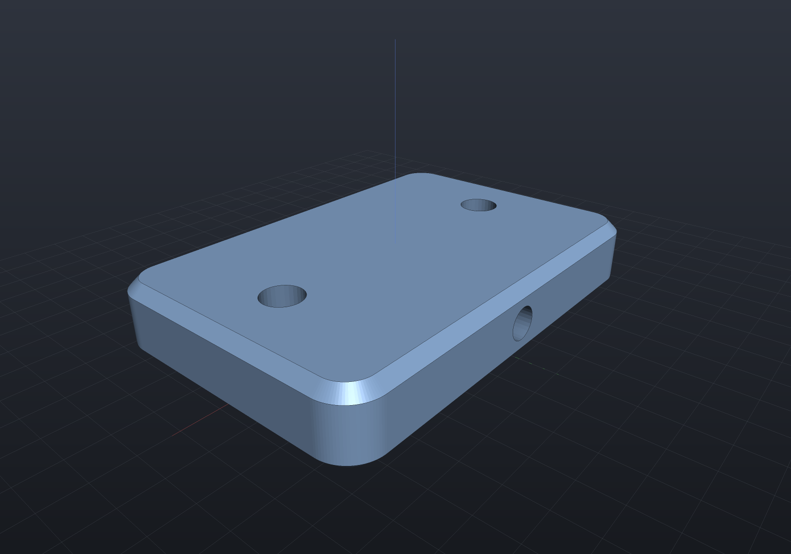

# Geometry inputs for features

A feature usually needs more than numbers: it needs *somewhere to build*. A
`GeometryRef` says which geometry, declaratively — "the top face", "the one
planar face facing +Y", "the bore of radius 3" — and re-resolves that query
against whatever the model looks like on this regeneration. No indices are
persisted, so an upstream parameter edit re-seats the feature instead of
breaking it.

Five reference types cover the vocabulary:

| Type | Resolves to | Cardinality |
| --- | --- | --- |
| `PlaneRef` | `SketchPlane` | exactly one |
| `FaceRef` | `BrepFace` | exactly one |
| `FaceSetRef` | `IReadOnlyList<BrepFace>` | at least one (`.Optional()` allows none) |
| `EdgeSetRef` | `IReadOnlyList<BrepEdge>` | at least one |
| `AxisRef` | `Ray3d` (origin + unit direction) | exactly one |

Declare one as a property and the history resolves it *before* `Apply` runs.

```csharp render:geometry-inputs
sealed class BasePlate : Feature
{
    [Param(Min = 20, Units = "mm")] public double Width { get; init; } = 60;
    [Param(Min = 20, Units = "mm")] public double Depth { get; init; } = 40;
    [Param(Min = 4, Units = "mm")] public double Thickness { get; init; } = 10;

    public override Shape Apply(FeatureContext c) =>
        Shape.Extrude(Sketch.RoundedRectangle(Width, Depth, 5), Thickness);
}

var history = new FeatureHistory();
history.Add(new BasePlate());

// Default: the body's top plane, re-resolved every regeneration. Change the
// plate's Thickness and these holes move up with the face they sit on.
history.Add(new HoleFeature(StandardHoles.Clearance(5), [(-20, 0), (20, 0)])
{
    Name = "TopHoles",
    Depth = 20,
});

// A named face instead: the single planar face whose outward normal is +Y.
// Points are then measured in THAT face's own 2D coordinates, so (0, 0) is the
// middle of the side wall however wide the plate becomes.
history.Add(new HoleFeature(StandardHoles.Clearance(4), [(0, 0)])
{
    Name = "SideHole",
    Depth = 8,
    Plane = PlaneRef.On(FaceRef.One(FaceSetRef.PlanarWithNormal(Vector3d.UnitY))),
});

// Rim features take a face SET; the default is the +Z faces.
history.Add(new ChamferRimFeature { Setback = 1.5, Name = "TopEdge" });
history.Add(new ChamferRimFeature
{
    Name = "BottomEdge",
    Setback = 1.5,
    Faces = FaceSetRef.PlanarWithNormal(-Vector3d.UnitZ),
});

var scene = new Scene();
scene.Add(history.ToPart("bracket", Palette.Steel));
```



## Naming geometry

Every reference is built from a small set of named queries, and they nest:

```csharp
FaceSetRef.PlanarWithNormal(Vector3d.UnitZ)   // upward planar faces
FaceSetRef.Cylindrical(radius: 3.3)           // bores of that radius
FaceSetRef.All.Optional()                     // an empty match is legal
FaceRef.Top                                   // the highest upward planar face
FaceRef.One(FaceSetRef.Cylindrical())         // fails if the query is ambiguous
FaceRef.Extreme(faces, Vector3d.UnitX)        // furthest along a direction
PlaneRef.TopPlane                             // world-aligned, at the top face's height
PlaneRef.OnTopFace                            // the same face, in the face's own frame
PlaneRef.On(faceRef)                          // sketch on any planar face
PlaneRef.At(SketchPlane.XY)                   // explicit; needs no body
EdgeSetRef.RimOf(faces)                       // those faces' outer-loop edges
EdgeSetRef.Convex                             // the edges a chamfer removes material from
EdgeSetRef.Circular(radius: 2)                // bore rims
FaceSetRef.RimFacesOf(edges)                  // the complete rims covering an edge set
AxisRef.OfCylindrical(FaceSetRef.Cylindrical(3))  // "pattern about that bore"
AxisRef.Of(origin, direction)                 // explicit; needs no body
```

`PlaneRef.TopPlane` and `PlaneRef.OnTopFace` pick the **same face** and differ
only in where 2D coordinates are measured from: `TopPlane` gives a
world-axis-aligned plane at `(0, 0, z)` (so drill coordinates stay world
coordinates), `OnTopFace` gives the face's own frame, centred on the face.

A `SketchPlane` converts implicitly wherever a `PlaneRef` is wanted, and so does
a `SketchPlane?` whose null means "the top plane" — so existing code keeps
working unchanged.

When no named query fits, drop to a lambda:

```csharp
FaceSetRef.From("wide bores", s => s.Faces.Where(f => f.IsCylindrical(out _, out _, out var r) && r > 5))
FaceSetRef.Where("upward", f => f.IsPlanar(out _, out var n) && n.Z > 0.99)
EdgeSetRef.From("long edges", s => s.Edges.Where(e => e.Length() > 30))
```

Lambda-backed references work everywhere a named one does, but they cannot be
written to (or read from) a parameter file — they print as `opaque(label)`.

## Validation names the input

Declared references resolve **before** `Apply`, all-or-nothing. A query that
matches nothing is a `Failed` status naming the property, not an exception from
somewhere inside the operation — and, as always, the last good body survives and
later features are skipped:

```csharp run:geometry-input-failure
sealed class Plate : Feature
{
    public override Shape Apply(FeatureContext c) => Shape.Extrude(Sketch.Rectangle(40, 30), 8);
}

sealed class Counterbore : Feature
{
    [Param(Description = "Face to counterbore")]
    public FaceRef Face { get; init; } = FaceRef.One(FaceSetRef.Cylindrical());

    public override Shape Apply(FeatureContext c) => c.Body!;   // never reached here
}

var history = new FeatureHistory();
history.Add(new Plate());
history.Add(new Counterbore());

var result = history.Regenerate();
Console.WriteLine(result.Statuses[1].Error);
// Face: expected exactly one cylindrical face, found 0.

if (result.Succeeded) throw new Exception("the broken reference should have failed");
if (result.Body is null) throw new Exception("the last good body should survive");
```

The same applies to ambiguity: `FaceRef` contracts to *exactly one*, so a query
matching six faces fails with `found 6` rather than silently taking the first.

## References in parameter files

A named reference is a value, so it round-trips through
`SaveParameters`/`LoadParameters` alongside the numbers — a design can be
re-targeted without recompiling:

```csharp run:geometry-input-json
sealed class Plate : Feature
{
    [Param(Min = 1)] public double Thickness { get; init; } = 8;

    public override Shape Apply(FeatureContext c) =>
        Shape.Extrude(Sketch.Rectangle(40, 30), Thickness);
}

var history = new FeatureHistory();
history.Add(new Plate());
history.Add(new HoleFeature(StandardHoles.Clearance(4), [(0, 0)]) { Depth = 20 });
if (!history.Regenerate().Succeeded) throw new Exception("initial regeneration failed");

Console.WriteLine(history.SaveParameters());
// { "Plate": { "Thickness": 8 }, "HoleFeature": { "Depth": 20, "Plane": "topPlane" } }

var warnings = history.LoadParameters("""
    { "HoleFeature": { "Plane": "plane([0,0,8],[1,0,0],[0,1,0])" } }
    """);
if (warnings.Count != 0) throw new Exception(string.Join("; ", warnings));
if (!history.Regenerate().Succeeded) throw new Exception("regeneration after retarget failed");
```

The descriptor string is not only the serialized form — it is also what the
regeneration cache keys on, so changing a reference invalidates exactly the
features downstream of it. A lambda-backed reference prints its `opaque(...)`
marker instead and declines to load with a warning, never a crash.

## Deferred inputs

`FilletRimFeature` and `ChamferRimFeature` mark their `Faces` input
`[DeferredInput]`. The `Shape` graph resolves rim selections at lowering time
against its own solid, so resolving them during validation would force an extra
B-Rep lowering per regeneration and learn nothing new. The deferred resolution
still names the input when it fails:

```csharp
history.Add(new FilletRimFeature { Radius = 1, Faces = FaceSetRef.Cylindrical() });
history.Regenerate();          // succeeds - nothing has been lowered yet
history.Result!.ToBrep();      // GeometryInputException:
                               // "Faces: expected at least one cylindrical face, found none."
```
