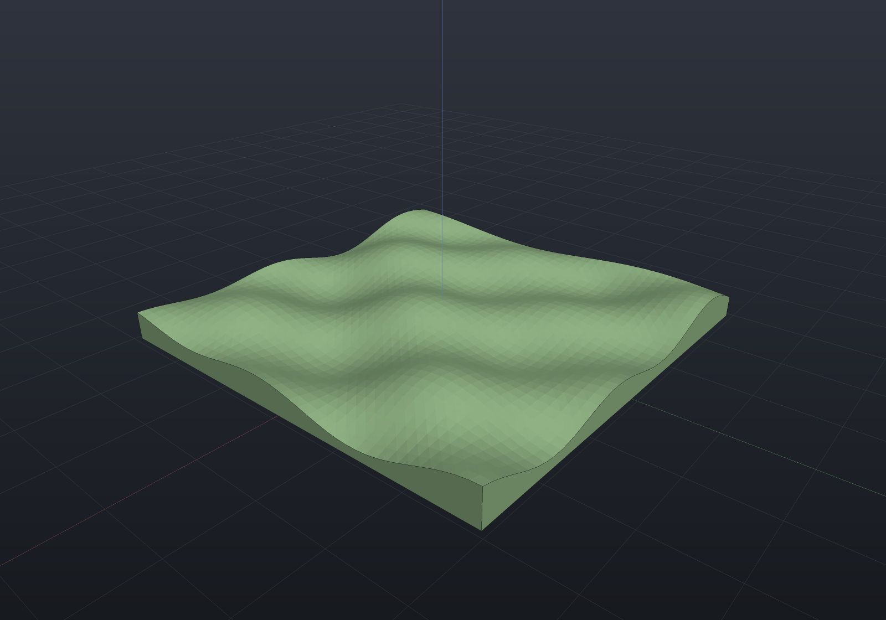
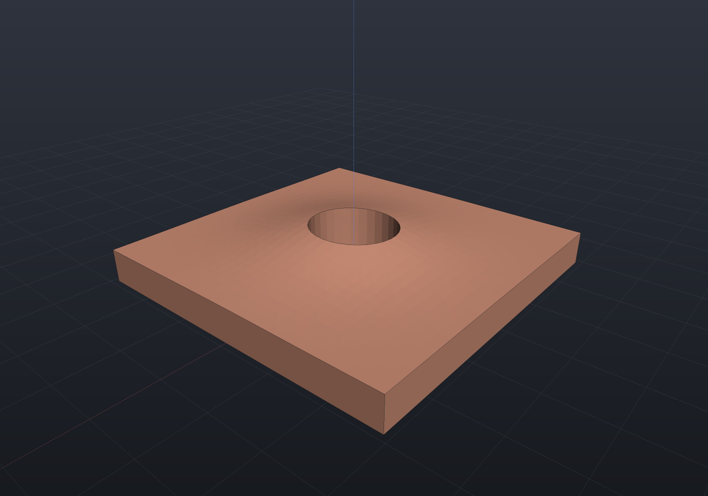

# Heightmap terrain

`Shape.Heightmap` is OpenSCAD's `surface()`: a rectangular grid of heights becomes a
closed solid — the grid as the top surface, a flat base, and perimeter walls sharing
the boundary vertices, so the mesh is manifold by construction. It is a mesh-backed
shape (`Shape.From` under the hood): booleans, transforms, and the implicit route all
work; B-Rep is honestly Impossible (meshes cannot be imported into B-Rep).

```csharp render:heightmap-terrain
// A procedural dune field; any double[,] works - computed, read from an OpenSCAD
// .dat text matrix (Heightmap.ReadDat), or from a grayscale PNG (Heightmap.ReadPng).
var heights = new double[40, 40];
for (int r = 0; r < 40; r++)
    for (int c = 0; c < 40; c++)
        heights[r, c] = 3
            + 1.5 * Math.Sin(c * 0.35) * Math.Cos(r * 0.3)
            + 0.8 * Math.Sin((c + r) * 0.2);

var terrain = Shape.Heightmap(heights, cellSize: 1.5);

var scene = new Scene();
scene.Add(new Part("terrain", terrain, Palette.Sage));
```



## Where the heights come from

- **Your own `double[,]`** — `heights[row, column]`, columns along +X and rows along
  −Y (image order, so a picture lands the way it looks). Every height must sit
  strictly above the base level.
- **`Heightmap.ReadDat(path)`** — OpenSCAD-style text matrices: one row of numbers
  per line, `#` comments and blank lines skipped.
- **`Heightmap.ReadPng(path)`** — grayscale PNG, 8- or 16-bit (alpha ignored),
  values normalized to 0..1. The reader is hand-rolled and dependency-free, like the
  TrueType reader; color, palette, and interlaced PNGs are **rejected with a clear
  message** rather than mis-read (a color-to-height rule is not something to invent
  silently). Pair it with `heightScale` to give normalized data its real peak height:

```csharp
var terrain = Shape.Heightmap(Heightmap.ReadPng("relief.png"),
                              cellSize: 2, heightScale: 120);
```

## Terrain is a shape like any other

Cut a core sample, drape a footprint, or intersect with a boundary — the mesh boolean
route handles it:

```csharp render:heightmap-cut
var heights = new double[30, 30];
for (int r = 0; r < 30; r++)
    for (int c = 0; c < 30; c++)
        heights[r, c] = 3 + 2 * Math.Exp(-((c - 15.0) * (c - 15.0) + (r - 15.0) * (r - 15.0)) / 60.0);

var hill = Shape.Heightmap(heights, cellSize: 1);
var cored = hill - Shape.Cylinder(4, 20).Translate(0, 0, 8);

var scene = new Scene();
scene.Add(new Part("cored hill", cored, Palette.Copper));
```


