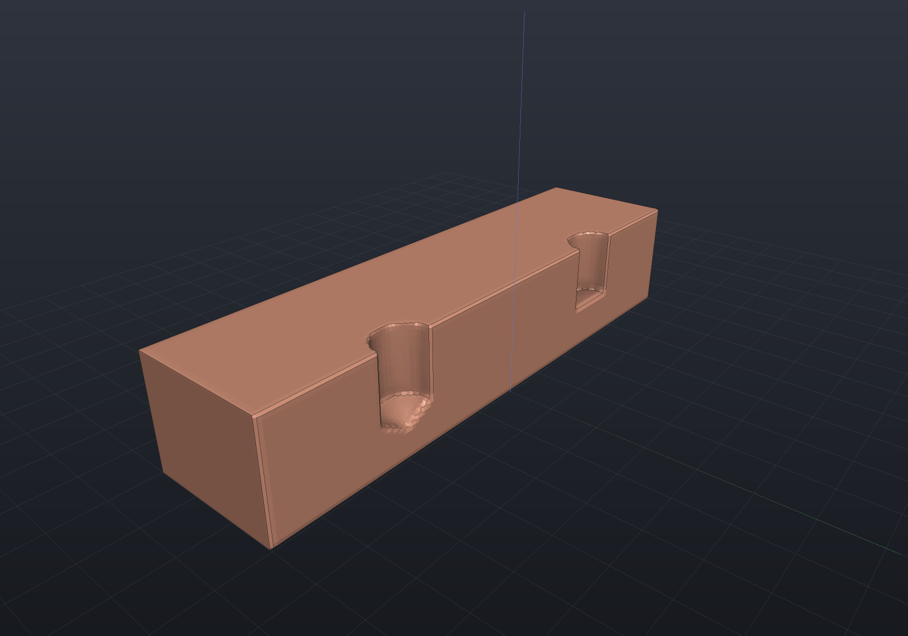
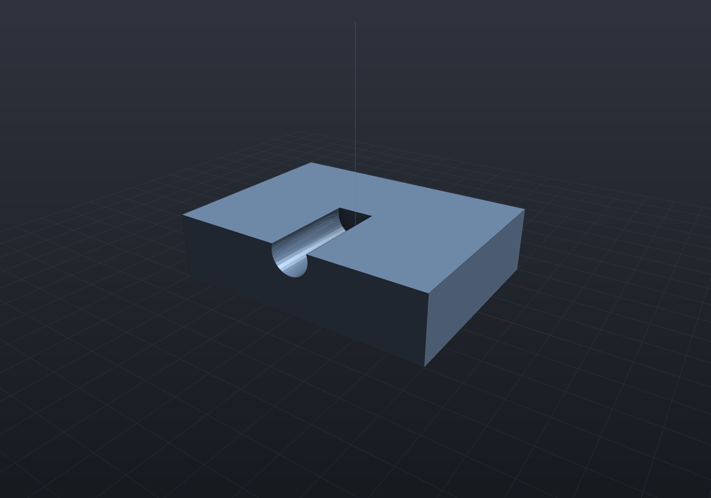

`Shape.Drill(hole, points, depth, plane?)` places one hole recipe at a list of 2D
points on a sketch plane, cutting along −normal. Every tool is an axis-touching
revolved sketch, so drilling is **exact in all three representations**.

## Explicit dimensions

`HoleSpec.Simple`, `Counterbore`, and `Countersink` take explicit dimensions:

```csharp render:holes-spec
var top = SketchPlane.At((0, 0, 6), Vector3d.UnitX, Vector3d.UnitY);

var plate = Shape.Box(60, 30, 12)
    .Drill(HoleSpec.Simple(6), [new(-20, 0)], depth: 14, top)
    .Drill(HoleSpec.Counterbore(5, counterboreDiameter: 10, counterboreDepth: 4),
           [new(0, 0)], depth: 14, top)
    .Drill(HoleSpec.Countersink(5, countersinkDiameter: 11), [new(20, 0)], depth: 14, top);

var scene = new Scene();
scene.Add(new Part("drilled plate", plate, Palette.Steel,
    Matrix4d.CreateTranslation((0, 0, 6))));    // rest the plate on the ground plane
```


A depth past the far side gives a through-hole; a shorter depth gives a blind hole
with a flat bottom. The tools overshoot the surface so the booleans never see
coplanar faces, and the countersink cone continues its slope past the surface so the
surface diameter stays exact.

## Drill points

A real twist drill leaves a cone at the bottom of a blind hole.
`spec.WithTipAngle(degrees)` models it — `StandardHoles.TwistDrillPoint` is the
general-purpose 118°, `SplitDrillPoint` the 135° of split-point drills:

```csharp render:holes-tip
var top = SketchPlane.At((0, 0, 6), Vector3d.UnitX, Vector3d.UnitY);
var flat = HoleSpec.Simple(6);
var drilled = flat.WithTipAngle(StandardHoles.TwistDrillPoint);

var plate = Shape.Box(60, 30, 12)
    .Drill(flat, [new(-15, 0)], depth: 7, top)       // flat bottom: reamed or bored
    .Drill(drilled, [new(15, 0)], depth: 7, top);    // 118 degrees: as drilled

// Both bores are 7 mm deep to the SHOULDER; the point reaches further.
var sectioned = Shape.From(plate.ToImplicit())
    - Shape.Box(62, 32, 16).Translate(0, 16, 0);

var scene = new Scene(new MeshQuality { SdfResolution = 160 });
scene.Add(new Part("flat and drilled bottoms", sectioned, Palette.Copper,
    Matrix4d.CreateTranslation((0, 0, 6))));
```



**Depth is measured to the shoulder** — the deepest full-diameter point — with the tip
reaching `(diameter / 2) / tan(angle / 2)` further, which is how a drawing dimensions a
blind hole. So adding a point is strictly additive: the same `depth` removes the same
cylinder either way, plus the cone. `spec.TipLength` reports the overhang, which is the
number to check against the far face — a blind depth that cleared it may not once the
point is there. The default stays flat, so existing designs are unchanged and a through
hole (where the point never survives into the finished part) needs nothing.

## A blind hole that breaks out of a face

Drilling near an edge is ordinary practice, and a blind bore's **flat bottom** can end up
crossing the face the bore has already broken out of. Both faces cut cleanly:

```csharp render:holes-breakout
var wall = SketchPlane.At((0, -15, 9), Vector3d.UnitX, Vector3d.UnitZ);

var plate = Shape.Extrude(Sketch.Rectangle(40, 30), 10)
    .Drill(HoleSpec.Simple(6), [new(0, 0)], depth: 15, wall);   // in from the front wall

var camera = new CameraState(-Math.PI / 2 + 0.6, 0.45, 90, (0, 0, 4));
var scene = new Scene();
scene.Add(new Part("blind bore off the top edge", plate, Palette.Steel));
```



The bore's axis sits 1 mm below the top face and its radius is 3, so the hole opens into a
slot along the top — and because it is BLIND, the tool's flat end stops inside the plate
and that end is cut by the top face too. The removed volume converges quadratically onto
the analytic disc-less-a-segment figure, and onto the same cut made with a plain
`Shape.Cylinder`.

A bore whose axis lands **exactly** on the face it breaks out of works too, and it is the
hardest member of the family rather than the easiest: the flat end is then cut along a full
diameter, straight through the one point of that face where its own parameterization — an
azimuth about the pole — does not exist.

```csharp run:holes-diametral
var level = SketchPlane.At((0, -15, 10), Vector3d.UnitX, Vector3d.UnitZ);   // axis ON the top face

var halved = Shape.Extrude(Sketch.Rectangle(40, 30), 10)
    .Drill(HoleSpec.Simple(6), [new(0, 0)], depth: 15, level);

// Exactly half the bore is inside the plate, so the removal is (pi * 3^2 / 2) * 15.
var removed = 40 * 30 * 10 - BrepMassProperties.Compute(halved.ToBrep()).Volume;
Console.WriteLine($"{removed:F2} removed");   // 212.06 removed
```

The remaining limit is a **grazing** breakout — one whose opening is a small fraction of the
bore's diameter. That still fails loudly rather than returning a solid with a crack in it.

## The standards catalog

`StandardHoles` (metric, mm) supplies ISO 273 clearance fits, DIN 974-style
counterbores for socket cap screws, 90° countersinks for ISO 10642 flat-heads, coarse
tap pilot holes, and Tappex Trisert® insert pilots:

```csharp render:holes-standard
var top = SketchPlane.At((0, 0, 6), Vector3d.UnitX, Vector3d.UnitY);

var plate = Shape.Box(30, 20, 12)
    .Drill(StandardHoles.Countersunk(3), [new(-10, 5)], depth: 14, top)   // M3 flat-head
    .Drill(StandardHoles.Counterbored(4), [new(0, 5)], depth: 14, top)    // M4 socket cap
    .Drill(StandardHoles.Clearance(5), [new(10, 5)], depth: 14, top)      // M5 clearance
    .Drill(StandardHoles.Tapped(6), [new(-5, -5)], depth: 10, top)        // M6 tap pilot (blind)
    .Drill(StandardHoles.Trisert(4), [new(5, -5)],
           StandardHoles.TrisertMinimumDepth(4), top);                    // M4 insert pilot

var scene = new Scene();
scene.Add(new Part("standard holes", plate, Palette.Brass,
    Matrix4d.CreateTranslation((0, 0, 6))));
```


`Clearance` takes a `ClearanceFit` (`Close`/`Normal`/`Loose`); `Tapped` models the
pilot hole only — for real modeled thread geometry see [threads](threads.md).
⚠ The Trisert table should be verified against the current Tappex datasheet before
production use.

## Seeing inside

A real **section plane** through the hole axes shows the counterbore step and
countersink cone the recipes produce — the same cut the viewer's
[section mode](viewer.md) makes interactively, here as a render option (`section:y,0`
on the fence), so the geometry stays the exact B-Rep and the cut faces shade as flat
cut material. The contour rings on the cut are the automatic
[SDF isolines](viewer.md#sdf-isolines-on-the-cut) — drilling is exact in the
implicit engine too, and the gold ring is the exact surface cross-section:

```csharp render:holes-section section:y,0
var top = SketchPlane.At((0, 0, 6), Vector3d.UnitX, Vector3d.UnitY);

var plate = Shape.Box(60, 30, 12)
    .Drill(HoleSpec.Counterbore(5, 10, 4), [new(-15, 0)], depth: 14, top)
    .Drill(HoleSpec.Countersink(5, 11), [new(15, 0)], depth: 14, top);

var scene = new Scene();
scene.Add(new Part("plate", plate, Palette.Sky,
    Matrix4d.CreateTranslation((0, 0, 6))));
```


