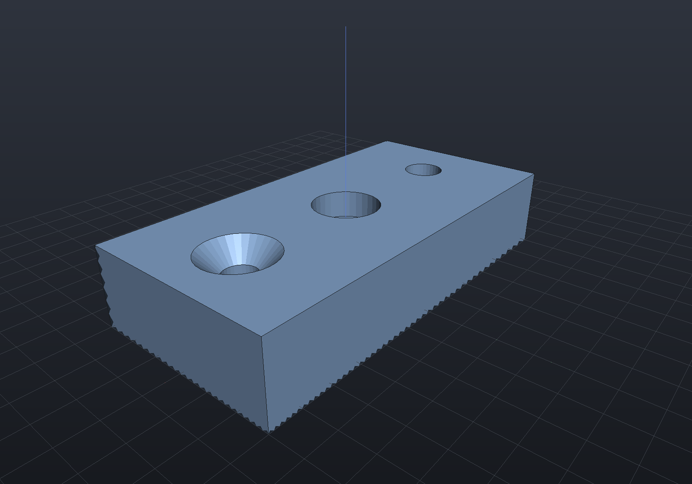
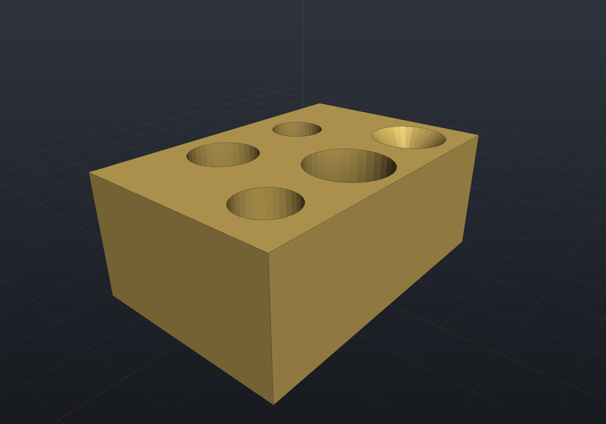
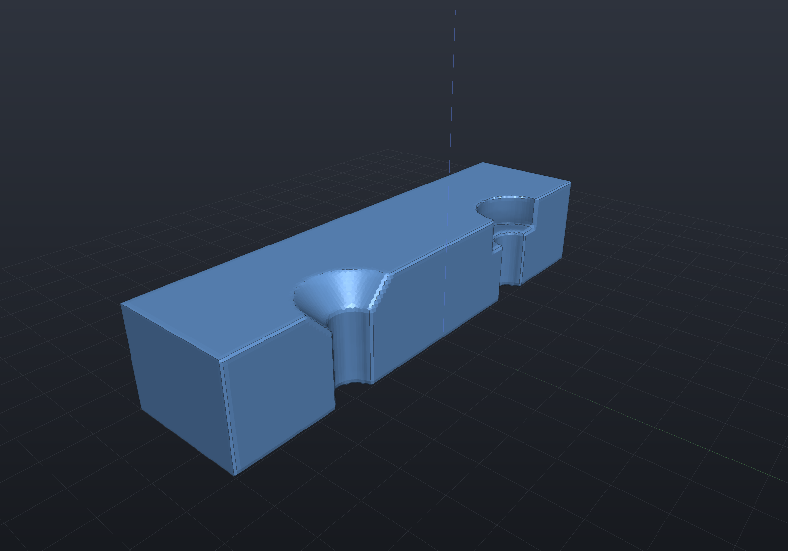

# Holes & standard sizes

`Shape.Drill(hole, points, depth, plane?)` places one hole recipe at a list of 2D
points on a sketch plane, cutting along −normal. Every tool is an axis-touching
revolved sketch, so drilling is **exact in all three representations**.

## Explicit dimensions

`HoleSpec.Simple`, `Counterbore`, and `Countersink` take explicit dimensions:

```csharp render:holes-spec
var top = SketchPlane.At((0, 0, 6), Vector3d.UnitX, Vector3d.UnitY);

var plate = Shape.Box(60, 30, 12)
    .Drill(HoleSpec.Simple(6), [new(-20, 0)], depth: 14, top)
    .Drill(HoleSpec.Counterbore(5, counterboreDiameter: 10, counterboreDepth: 4),
           [new(0, 0)], depth: 14, top)
    .Drill(HoleSpec.Countersink(5, countersinkDiameter: 11), [new(20, 0)], depth: 14, top);

var scene = new Scene();
scene.Add(new Part("drilled plate", plate, Palette.Steel,
    Matrix4d.CreateTranslation((0, 0, 6))));    // rest the plate on the ground plane
```



A depth past the far side gives a through-hole; a shorter depth gives a blind hole
with a flat bottom. The tools overshoot the surface so the booleans never see
coplanar faces, and the countersink cone continues its slope past the surface so the
surface diameter stays exact.

## The standards catalog

`StandardHoles` (metric, mm) supplies ISO 273 clearance fits, DIN 974-style
counterbores for socket cap screws, 90° countersinks for ISO 10642 flat-heads, coarse
tap pilot holes, and Tappex Trisert® insert pilots:

```csharp render:holes-standard
var top = SketchPlane.At((0, 0, 6), Vector3d.UnitX, Vector3d.UnitY);

var plate = Shape.Box(30, 20, 12)
    .Drill(StandardHoles.Countersunk(3), [new(-10, 5)], depth: 14, top)   // M3 flat-head
    .Drill(StandardHoles.Counterbored(4), [new(0, 5)], depth: 14, top)    // M4 socket cap
    .Drill(StandardHoles.Clearance(5), [new(10, 5)], depth: 14, top)      // M5 clearance
    .Drill(StandardHoles.Tapped(6), [new(-5, -5)], depth: 10, top)        // M6 tap pilot (blind)
    .Drill(StandardHoles.Trisert(4), [new(5, -5)],
           StandardHoles.TrisertMinimumDepth(4), top);                    // M4 insert pilot

var scene = new Scene();
scene.Add(new Part("standard holes", plate, Palette.Brass,
    Matrix4d.CreateTranslation((0, 0, 6))));
```



`Clearance` takes a `ClearanceFit` (`Close`/`Normal`/`Loose`); `Tapped` models the
pilot hole only — for real modeled thread geometry see [threads](threads.md).
⚠ The Trisert table should be verified against the current Tappex datasheet before
production use.

## Seeing inside

Cutting the drilled plate in half shows the counterbore step and countersink cone the
recipes produce (the viewer's [section mode](viewer.md) does this interactively):

```csharp render:holes-section
var top = SketchPlane.At((0, 0, 6), Vector3d.UnitX, Vector3d.UnitY);

var plate = Shape.Box(60, 30, 12)
    .Drill(HoleSpec.Counterbore(5, 10, 4), [new(-15, 0)], depth: 14, top)
    .Drill(HoleSpec.Countersink(5, 11), [new(15, 0)], depth: 14, top);

// Drilling is exact in the implicit engine too: lower to the signed distance
// field and cut the near half away to expose the hole profiles.
var sectioned = Shape.From(plate.ToImplicit())
    - Shape.Box(62, 32, 16).Translate(0, 16, 0);

var scene = new Scene(new MeshQuality { SdfResolution = 160 });
scene.Add(new Part("cross-section", sectioned, Palette.Sky,
    Matrix4d.CreateTranslation((0, 0, 6))));
```


