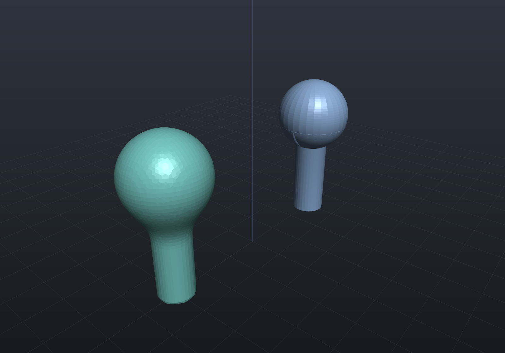
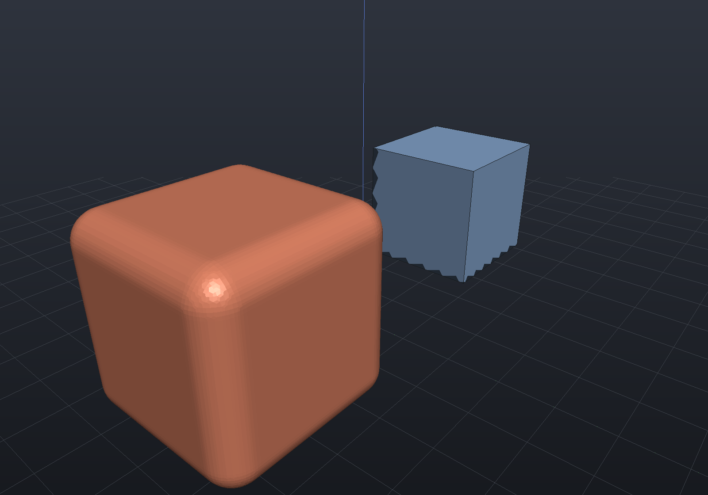
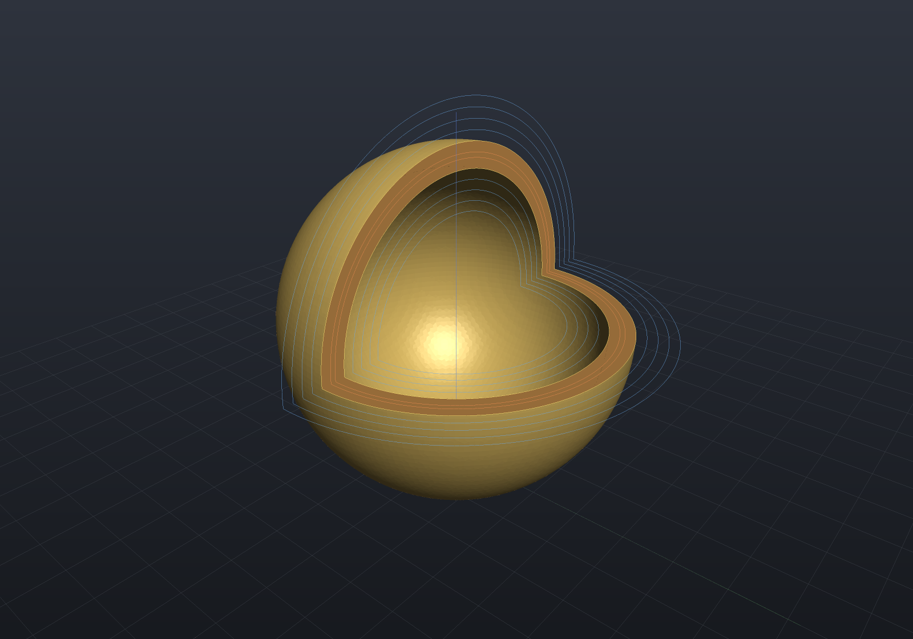
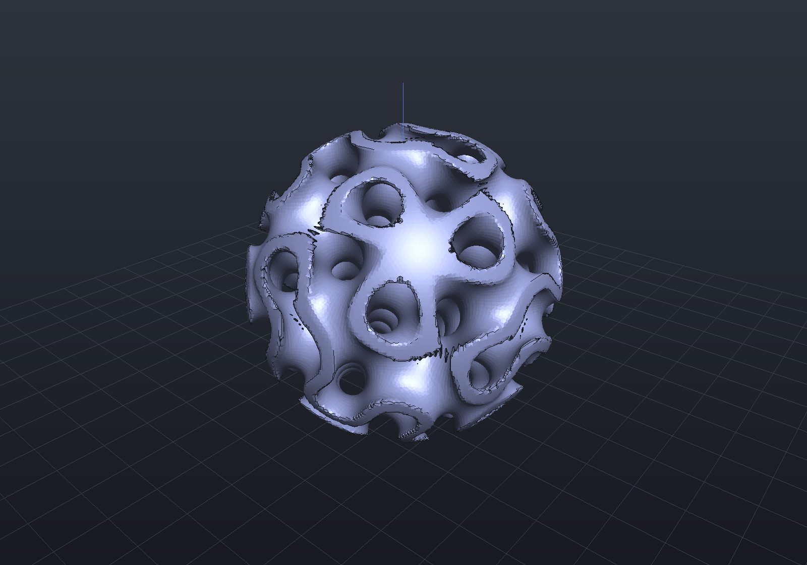

# Blends, offset, shell, lattice

These operations come from the implicit engine (signed distance fields) and have no
exact B-Rep form — `ToBrep()` rejects them with a clear report, while `ToMesh()`
polygonizes the field with Surface Nets. Everything here still composes freely with
the rest of the `Shape` vocabulary.

## Smooth booleans

`SmoothUnion` / `SmoothIntersect` / `SmoothSubtract` take a blend distance that
rounds the junction — the organic fillet the hard [booleans](booleans.md) can't give:

```csharp render:smooth-blend
var stem = Shape.Cylinder(5, 30);
var bulb = Shape.Sphere(11).Translate(0, 0, 18);

var scene = new Scene();
scene.Add(new Part("hard union", stem | bulb, Palette.Steel,
    Matrix4d.CreateTranslation((-30, 0, 0))));
scene.Add(new Part("smooth union", stem.SmoothUnion(bulb, blend: 6), Palette.Teal,
    Matrix4d.CreateTranslation((30, 0, 0))));
```



## Offset

`Offset(distance)` grows (or shrinks, when negative) the solid by a uniform distance —
offsetting a box rounds its edges and corners exactly:

```csharp render:offset
var scene = new Scene();
scene.Add(new Part("box", Shape.Box(24, 24, 24), Palette.Steel,
    Matrix4d.CreateTranslation((-30, 0, 0))));
scene.Add(new Part("offset +5", Shape.Box(24, 24, 24).Offset(5), Palette.Coral,
    Matrix4d.CreateTranslation((30, 0, 0))));
```



## Shell

`Shell(thickness)` hollows a solid into a constant-thickness skin. Subtracting a box
here exposes the interior wall:

```csharp render:shell
var hollow = Shape.Sphere(16).Shell(2.5)
    - Shape.Box(40, 40, 40).Translate(0, -20, 20);   // cut a quarter away to look inside

var scene = new Scene();
scene.Add(new Part("shelled sphere", hollow, Palette.Brass));
```



## Lattice

`Lattice(pattern)` intersects a solid with a periodic SDF such as
`Sdf.Gyroid(cellSize, thickness)` — the additive-manufacturing infill workhorse:

```csharp render:lattice
var scene = new Scene();
scene.Add(new Part("gyroid lattice",
    Shape.Sphere(16).Lattice(Sdf.Gyroid(cellSize: 10, thickness: 2.2)),
    Palette.Slate));
```



Any hand-written `Sdf` works as the pattern, and `Shape.From(sdf)` wraps arbitrary
fields back into the modeling vocabulary — see
[dropping down to the engines](representations.md#dropping-down-to-the-engine-apis).
