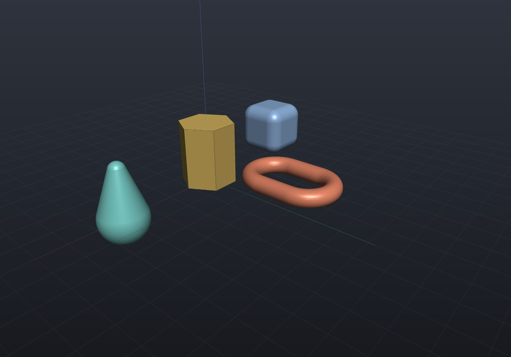
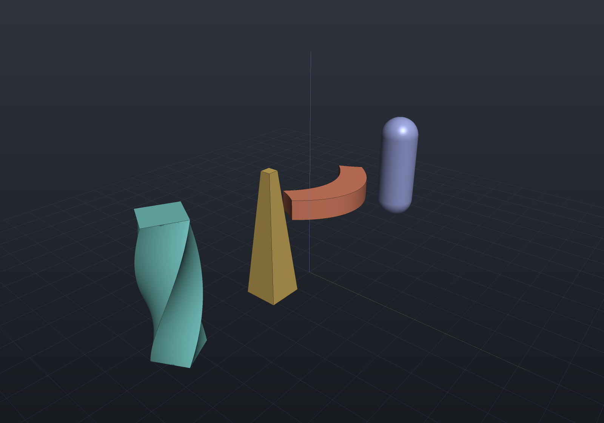
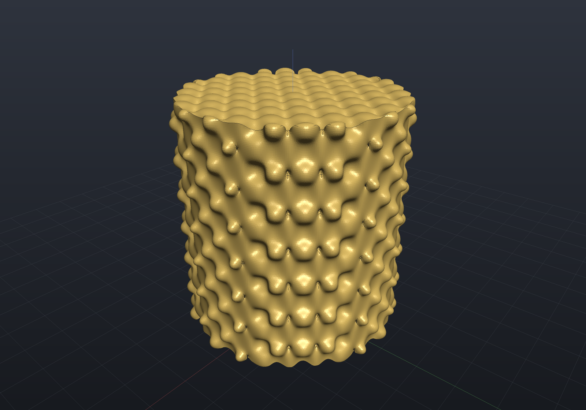
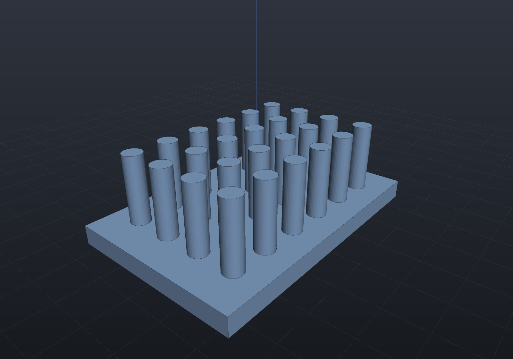

These operations come from the implicit engine (signed distance fields) and have no
exact B-Rep form — `ToBrep()` rejects them with a clear report, while `ToMesh()`
polygonizes the field with Surface Nets. Everything here still composes freely with
the rest of the `Shape` vocabulary.

## Smooth booleans

`SmoothUnion` / `SmoothIntersect` / `SmoothSubtract` take a blend distance that
rounds the junction — the organic fillet the hard [booleans](booleans.md) can't give:

```csharp render:smooth-blend
var stem = Shape.Cylinder(5, 30);
var bulb = Shape.Sphere(11).Translate(0, 0, 18);

var scene = new Scene();
scene.Add(new Part("hard union", stem | bulb, Palette.Steel,
    Matrix4d.CreateTranslation((-30, 0, 15))));
scene.Add(new Part("smooth union", stem.SmoothUnion(bulb, blend: 6), Palette.Teal,
    Matrix4d.CreateTranslation((30, 0, 15))));
```


## Offset

`Offset(distance)` grows (or shrinks, when negative) the solid by a uniform distance —
offsetting a box rounds its edges and corners exactly:

```csharp render:offset
var scene = new Scene();
scene.Add(new Part("box", Shape.Box(24, 24, 24), Palette.Steel,
    Matrix4d.CreateTranslation((-30, 0, 17))));
scene.Add(new Part("offset +5", Shape.Box(24, 24, 24).Offset(5), Palette.Coral,
    Matrix4d.CreateTranslation((30, 0, 17))));
```


### Minkowski sums (what OpenSCAD's `minkowski()` is for)

OpenSCAD models rounding as `minkowski() { part(); sphere(r); }` — the Minkowski sum
with a ball. **That exact operation is `Offset(r)`**: for any solid, the sum with a
ball of radius r is the set of points within r of it, which is precisely what the
signed distance field's offset computes — same geometry, evaluated in microseconds
instead of OpenSCAD's notoriously expensive convolution. The common recipes map
directly:

| OpenSCAD | EngrCAD | Notes |
|---|---|---|
| `minkowski { part; sphere(r) }` | `part.Offset(r)` | exact as a field; polygonized on the way to a mesh |
| erode then dilate (opening) | `part.Offset(-r).Offset(r)` | rounds convex edges, preserves size |
| dilate then erode (closing) | `part.Offset(r).Offset(-r)` | rounds concave corners |
| rounding a convex polyhedron | `part.RoundEdges(r)` | **exact B-Rep** — the morphological opening as real planes, cylindrical bands and spherical corner patches, no field involved |
| rounding one rim | `part.Fillet(r, faces)` | exact B-Rep rim surgery |
| `minkowski` with a cube | — | axis-aligned box dilation ≈ `Offset` under the Chebyshev metric; not provided — see below |

For rounding, prefer the B-Rep routes (`RoundEdges`, `Fillet`, `Chamfer`) when they
apply: they produce exact analytic surfaces that export to STEP and measure exactly,
where the offset field polygonizes. Use `Offset` when the shape lives in field land
anyway (blends, lattices, imported meshes) or when the B-Rep route refuses.

**General `minkowski()` — an arbitrary solid swept by an arbitrary solid — is
deliberately not planned.** The ball case covers rounding, which is nearly every real
use; the general polyhedron⊕polyhedron sum is a different algorithm entirely (convex
decomposition of both operands, pairwise convex sums, then a union of the pieces —
combinatorially explosive for non-convex parts, which is exactly why OpenSCAD's is
slow), and its engineering uses (tolerance zones, cam envelopes, clearance sweeps)
are better served by `Offset` on the exact field of the real geometry. If you truly
need a convex⊕convex sum, `Shape.Hull` of translated copies gives it:
`Hull(a.Translate(v₀), a.Translate(v₁), …)` over b's vertices `vᵢ` is exact for
convex polyhedral `a` and `b`.

## Shell

`Shell(thickness)` hollows a solid into a constant-thickness skin. A real **quarter
cut** (two section planes on the render, the viewer's
[section mode](viewer.md)) exposes the interior wall — and because a shelled shape is
SDF-native, the cut carries its [isolines](viewer.md#sdf-isolines-on-the-cut): the
two gold contours are the exact inner and outer surfaces, and the constant gap
between them IS the wall thickness, readable at a glance:

```csharp render:shell section:y,0;z,16
var hollow = Shape.Sphere(16).Shell(2.5);

var scene = new Scene();
scene.Add(new Part("shelled sphere", hollow, Palette.Brass,
    Matrix4d.CreateTranslation((0, 0, 16))));
```


## Lattice

`Lattice(pattern)` intersects a solid with a periodic SDF such as
`Sdf.Gyroid(cellSize, thickness)` — the additive-manufacturing infill workhorse:

```csharp render:lattice
var scene = new Scene(new MeshQuality { SdfResolution = 110 });
scene.Add(new Part("gyroid lattice",
    Shape.Sphere(16).Lattice(Sdf.Gyroid(cellSize: 12, thickness: 1.2)),
    Palette.Slate, Matrix4d.CreateTranslation((0, 0, 16))));
```


Any hand-written `Sdf` works as the pattern, and `Shape.From(sdf)` wraps arbitrary
fields back into the modeling vocabulary — see
[dropping down to the engines](representations.md#dropping-down-to-the-engine-apis).

## Field primitives

Beyond the shapes the `Shape` API builds exactly, the implicit engine carries its own
primitive set — reach for these through `Shape.From(sdf)` when you are already in field
land. Each states whether it is an **exact distance** or a **bound**:

| primitive | fidelity |
|---|---|
| `Sdf.RoundedBox(x, y, z, r)` | exact |
| `Sdf.RoundCone(r0, r1, h)` | exact — the hull of two spheres |
| `Sdf.Link(major, minor, halfLength)` | exact |
| `Sdf.Prism(sides, circumradius, height)` | exact — regular n-gon, so `3` and `6` are the triangular and hexagonal prisms |
| `Sdf.Wedge(x, y, z, topX, topOffsetX)` | exact — the field twin of `Shape.Wedge` |
| `Sdf.Pyramid(baseSize, height)` | exact |
| `Sdf.Ellipsoid(a, b, c)` | **a bound** — see below |
| `Sdf.ConvexPolyhedron(halfSpaces)` | exact inside, a lower bound outside |

```csharp render:sdf-primitives
var scene = new Scene();
scene.Add(new Part("rounded box", Shape.From(Sdf.RoundedBox(20, 20, 20, 5)), Palette.Steel,
    Matrix4d.CreateTranslation((-40, 0, 12))));
scene.Add(new Part("hex prism", Shape.From(Sdf.Prism(6, 11, 24)), Palette.Brass,
    Matrix4d.CreateTranslation((0, 0, 12))));
scene.Add(new Part("round cone", Shape.From(Sdf.RoundCone(9, 3, 18)), Palette.Teal,
    Matrix4d.CreateTranslation((40, 0, 0))));
scene.Add(new Part("link", Shape.From(Sdf.Link(9, 3, 6)), Palette.Coral,
    Matrix4d.CreateTranslation((0, 40, 12))));
```



### The ellipsoid is the one with no closed form

A point's distance to an ellipsoid is the root of a degree-6 polynomial, so every
practical ellipsoid field is an approximation. `Sdf.Ellipsoid` uses the standard
scaled-implicit form, and rather than repeat the folklore that "the error grows with
eccentricity", here is the measurement — reported distance over true distance, against an
exact Lagrange-multiplier oracle:

| aspect ratio | 1 | 1.25 | 1.67 | 3 | 4 | 10 |
|---|---|---|---|---|---|---|
| **outside** | 1.000 | 0.983 | 0.916 | 0.675 | 0.544 | 0.238 |
| **inside** | 1.000 | 1.081 | 1.369 | 2.076 | 2.673 | 6.585 |

Two things follow. Outside the solid it is a genuine **lower bound** — never nearer than
the truth, which is what meshing, culling and offsetting need — and equal semi-axes
reduce it to the sphere's exact distance. Inside, it over-reports depth, so do not read a
wall thickness off an eccentric ellipsoid's field. The **sign is exact everywhere**.

## Domain operations

These reshape *space itself* rather than combining two solids, which is what makes them
cheap: the field is evaluated at a moved query point, so a lattice of ten thousand
instances costs one primitive.

```csharp render:sdf-domain-ops
var bar = Sdf.Box(11, 11, 40);

// The default view looks down −X, so the parts read left to right in decreasing x.
var scene = new Scene(new MeshQuality { SdfResolution = 140 });
scene.Add(new Part("twist", Shape.From(bar.Twist(radiansPerUnit: 0.055)), Palette.Teal,
    Matrix4d.CreateTranslation((54, 0, 22))));
scene.Add(new Part("taper", Shape.From(bar.Taper(bottomScale: 1.0, topScale: 0.3)), Palette.Brass,
    Matrix4d.CreateTranslation((18, 0, 22))));
scene.Add(new Part("bend", Shape.From(Sdf.Box(40, 11, 7).Bend(curvature: 0.028)), Palette.Coral,
    Matrix4d.CreateTranslation((-18, 0, 22))));
scene.Add(new Part("elongate", Shape.From(Sdf.Sphere(7).Elongate((0, 0, 13))), Palette.Slate,
    Matrix4d.CreateTranslation((-54, 0, 22))));
```



`Displace(amplitude, frequency)` adds a sinusoidal ripple — knurling, texture, a
grip surface:

```csharp render:sdf-displace
var knurled = Sdf.Cylinder(14, 30).Displace(amplitude: 0.9, frequency: (1.4, 1.4, 1.4));

var scene = new Scene(new MeshQuality { SdfResolution = 190 });
scene.Add(new Part("knurled boss", Shape.From(knurled), Palette.Brass,
    Matrix4d.CreateTranslation((0, 0, 16))));
```



### Repetition

`Repeat(spacing)` tiles a solid over an infinite lattice, and `Repeat(spacing, counts)`
gives it a finite count. Both cost one child evaluation per neighbouring cell rather than
one per instance, so the count is free:

```csharp render:sdf-repeat
var pins = Sdf.Cylinder(2.5, 18).Repeat((10, 10, 0), new Vector3i(6, 4, 1));
var plate = Sdf.Box(70, 46, 5).Translate((25, 15, -11));

var scene = new Scene(new MeshQuality { SdfResolution = 200 });
scene.Add(new Part("pin field", Shape.From(pins | plate), Palette.Steel,
    Matrix4d.CreateTranslation((-25, -15, 14))));
```



The child must fit inside one cell, and that is **enforced rather than assumed**: outside
that condition a query point can lie inside an instance the evaluation never visits, and
the sign would be wrong. The refusal names the span it measured.

### What these cost you: the distance stops being a distance

A translate, a rotate, a mirror and a repetition are **isometries** — they move points
without changing lengths — so the field stays an exact distance. A **twist, a bend and a
taper are not**: they shear or stretch space, so the value changes faster than the query
point moves. Three consequences, all handled for you but worth knowing:

- the **sign stays exact everywhere** (the solid is exactly the pre-image of the child),
  so booleans, meshing and inside/outside classification are unaffected;
- the **magnitude becomes an over-estimate** of the true distance, by at most a factor the
  node computes and reports (`Sdf.LipschitzBound`), so do not read a wall thickness or a
  clearance off a twisted field;
- the polygonizer, the narrow-band grid and the remesher's projection each **widen by
  exactly that factor**, which is why a twisted lattice meshes correctly instead of losing
  slivers of geometry. That factor is 1 for every exact field, so nothing else pays for it.

## Compiling a field

`Sdf.Compile()` flattens a whole AST into one delegate, removing the virtual call per node
per query. It is **bit-for-bit identical** to the un-compiled field, and it composes like
any other node:

```csharp
var probe = body.Compile();       // an Sdf, with the same Bounds and the same field
double d = probe.Evaluate(point);
```

Measured (win-x64, Mpts/s):

| case | scalar walk | compiled | batch (SIMD) |
|---|---|---|---|
| single sphere | 434.0 | 444.5 | **519.2** |
| bracket CSG tree | 10.8 | 13.3 | **45.2** |
| deep union chain (24 nodes) | 4.8 | 12.8 | **28.0** |

So it buys 1.02×–2.67× over per-point evaluation — the win tracks how much of the cost is
dispatch rather than arithmetic — and it **loses to the batch path in every case**. Since
`Evaluate(points, distances)` is what meshing, grid bakes and section contours already use,
reach for `Compile()` only when you are genuinely stuck with one point at a time: a
marching solver, an interactive probe, a scattered query loop.
