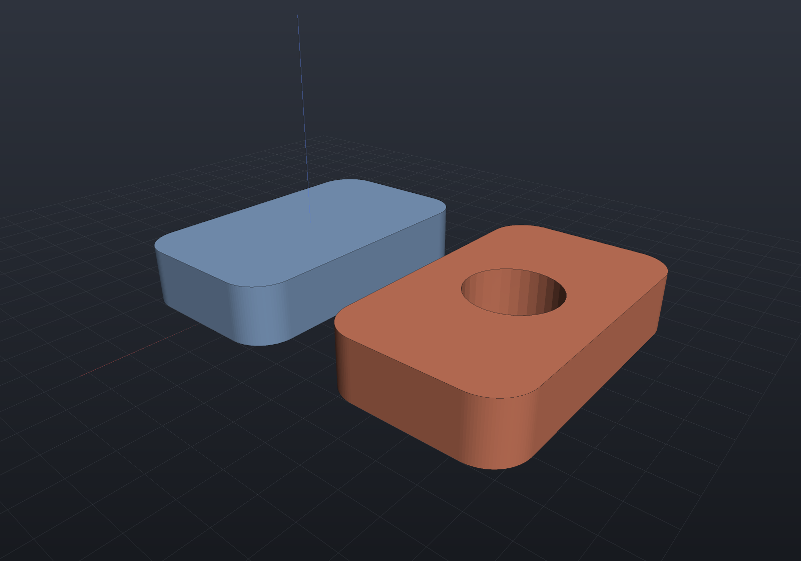

`Shape.From(path)` imports a mesh file — STL (binary or ASCII, autodetected), OBJ,
OFF, or VRML97 (`.wrl`) — as a mesh-backed shape. Underneath it is
`MeshReader.ReadAndRepair`: dirty files
weld instead of throwing, the repair pipeline runs (crack welding,
degenerate/duplicate removal, consistent outward orientation, T-junction zipping), and
the result composes with everything else in the vocabulary — booleans, transforms,
the implicit route.

This example round-trips through a real file on every docs build: write an STL (which
is an *unindexed facet soup* by design — 12 triangles arrive as 36 unrelated
vertices), import it back, and check the repair actually happened:

```csharp run:import-repair
var path = Path.Combine(Scratch, "imported.stl");
StlWriter.WriteFile(Shape.Box(20, 10, 5).ToMesh(), path);

var imported = Shape.From(path, out var report);
var mesh = imported.ToMesh();

if (!mesh.IsClosed) throw new Exception("import should come back watertight");
if (report.ComponentCount != 1) throw new Exception($"one body expected, got {report.ComponentCount}");
Console.WriteLine($"imported {mesh.FaceCount} faces, volume {mesh.Volume():F1}");
```

An imported shape is a full citizen — here one is drilled and shown beside the
original:

```csharp render:import-drilled
var path = Path.Combine(Scratch, "bracket-import.stl");
StlWriter.WriteFile(Shape.Extrude(Sketch.RoundedRectangle(40, 24, 5), 8).ToMesh(), path);

var imported = Shape.From(path);
var scene = new Scene();
scene.Add(new Part("as imported", imported, Palette.Steel));
scene.Add(new Part("imported, then drilled", imported - Shape.Cylinder(6, 30).Translate(0, 0, 4),
    Palette.Coral, Matrix4d.CreateTranslation((0, 34, 0))));
```



## What repair does and does not do

- **Always**: exact vertex welding at read (1e-9, or the float32 quantization an STL
  forces), then the soup passes — degenerate and duplicate faces dropped, every
  component re-wound consistently outward, T-junctions zipped.
- **Only when asked**: `Shape.From(path, out var report, fillHolesAndCracks: true)`
  additionally welds boundary cracks pair-wise and fills holes — off by default
  because closing a hole *invents geometry*, which an importer should only do
  deliberately.
- **Never silently**: files whose defects need topological surgery beyond the
  pipeline throw with the defect named; the `out MeshRepairReport` overload reports
  exactly what was repaired (vertices merged, faces rewound, cracks welded, holes
  filled and skipped).

The engine layer is available directly when you want the diagnostics without the
shape wrapper: `MeshReader.ReadFile` returns mesh-or-soup plus warnings and never
throws on dirty geometry; `MeshRepair.Clean`/`AutoRepair` are the pipeline.
An imported mesh has no exact B-Rep — `imported.ToBrep()` honestly refuses
(mesh-to-B-Rep reconstruction is future work); `ToMesh` and `ToImplicit` both work.

A `.wrl` (VRML97 — KiCad's default 3D component-model format) reads its
`IndexedFaceSet` meshes through the `Transform`/`DEF`/`USE` scene graph, with
non-mesh geometry and external `Inline`s skipped by name; coordinates are read
**verbatim**, since VRML is unitless — the KiCad convention (1 VRML unit = 0.1 inch
= 2.54 mm) is applied by the ECAD component-model loader, which knows its `.wrl`
files are KiCad's, not by the reader.

## Importing exact geometry: STEP, `.ecb` and IGES

Three exact-geometry importers sit beside the mesh ones, each returning diagnostics as
**data** rather than log lines:

| Format | Entry point | What you get |
| --- | --- | --- |
| STEP (AP214) | `StepReader.ReadFile` | `BrepSolid`s, assembly instances, units scaled to mm |
| EngrCAD `.ecb` | `BrepArchive.ReadFile` | The kernel's own solids, losslessly ([exports](exports.md)) |
| IGES 5.3 | `IgesReader.ReadFile` | Trimmed surfaces, loose curves and surfaces |

### IGES

IGES is **import-only** here, deliberately: it is a legacy format whose remaining use is
receiving files from old CAM and surfacing systems, and writing it would mean maintaining
a second, lossier encoding of geometry STEP already carries better.

The supported entities are the ones that map onto geometry the kernel already has —
110 line, 100 circular arc, 104 conic arc (classified from its coefficients, so an
ellipse mislabelled as a hyperbola still imports correctly), 126/128 rational B-spline
curve and surface, 102 composite curve, 108 plane, 118 ruled surface, 120 surface of
revolution, 122 tabulated cylinder, 124 transformation matrix, and 142/144 trimmed
parametric surfaces.

**The result is a face soup and says so.** IGES carries no shared topology: every trimmed
surface owns its boundary curves, so two neighbouring faces reference two
coincident-but-distinct curves and the assembled shell's edges are used once rather than
twice. `IgesReadResult.IsFaceSoup` reports that, and `ShapeHealing.Heal` — which exists
for exactly this case — is the next step:

```csharp
var result = IgesReader.ReadFile("legacy.igs");
foreach (var note in result.Diagnostics)
    Console.WriteLine(note);

if (result.Solid is { } soup)
{
    var (healed, report) = ShapeHealing.Heal(soup);
    Console.WriteLine($"{report.EdgesSewn} edges sewn; manifold = {report.IsManifold}");
    if (report.IsManifold)
        DoSomethingWith(Shape.From(healed));
}
```

`Shape.From(path)` deliberately does **not** learn `.igs`: it would hand back geometry
that fails at lowering, and the healing step is a decision the caller should make
explicitly.

Units are read from the Global section and scaled to millimetres (the same rule the STEP
importer follows), unknown entity types are skipped once with a diagnostic naming the
type and its first offender, and a bad *record* structure — a wrong section letter, a
broken directory pair, a non-numeric sequence number — throws `FormatException` rather
than being sniffed past.
