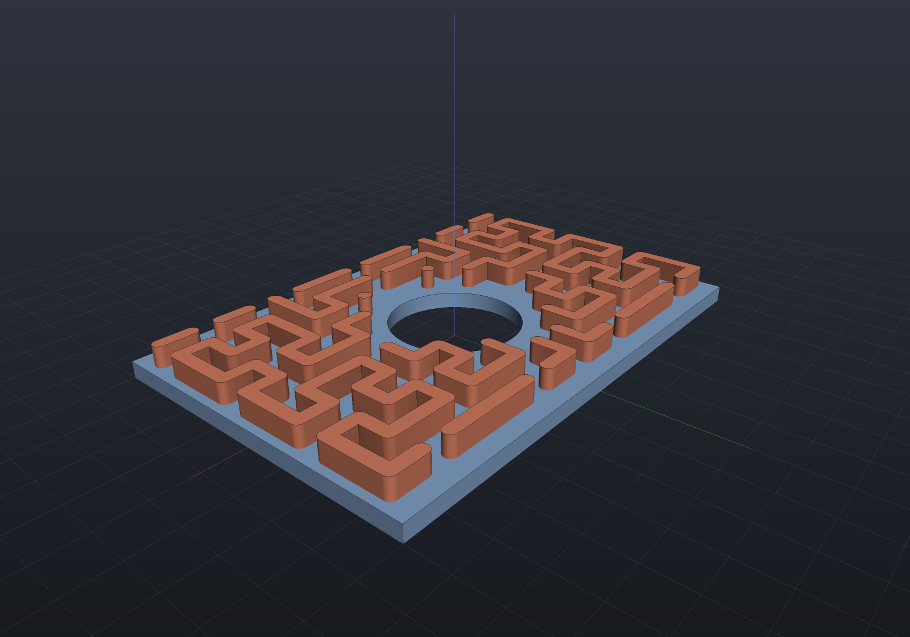
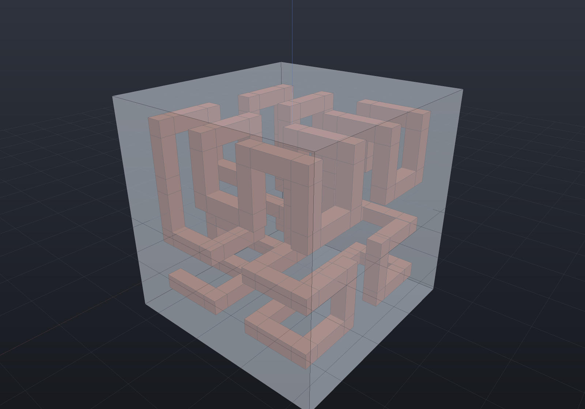
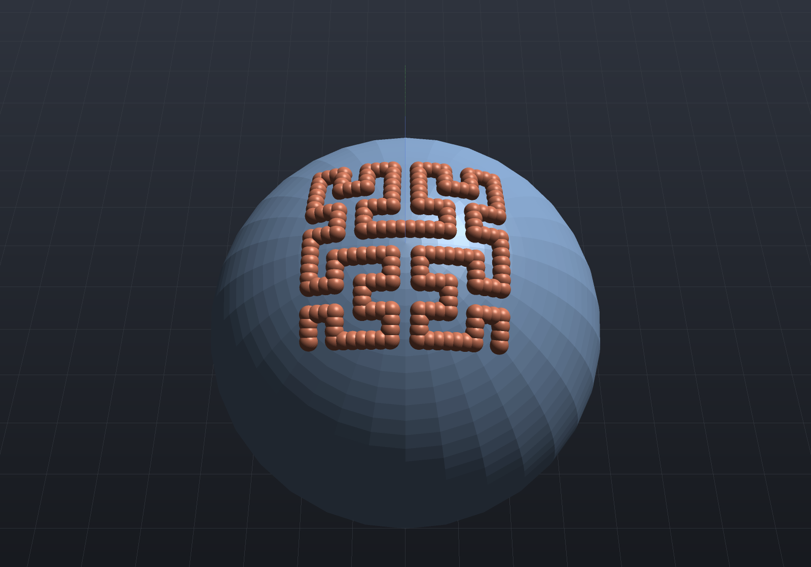

A **space-filling curve** reaches every part of a region along one continuous path. That is
exactly what a printed infill, a pocket-clearing pass, an engraved fill or a serpentine heater
track wants: full coverage with as few travel moves as possible.

`SpaceFillingCurve` (in `EngrCAD.Core.Geometry2`) generates the curve; `SpaceFillingInfill`
clips it to a sketch and reports what it did.

## The name overpromises, so start there

A *true* space-filling curve is the limit of an infinite sequence and has infinite length. What
is built here is one finite member of that sequence, and the **order** is the parameter. You do
not state an order — you state a **spacing**, the distance you want between neighbouring
passes, and the generator picks the order whose cell size is at or under it and **reports the
spacing it achieved**:

```csharp run:infill-spacing-report
var plate = Sketch.Rectangle(60, 40).WithHole(Sketch.Circle(8));
var fill = SpaceFillingInfill.Fill(plate, spacing: 5.0);

// 60 wide, so the curve's footprint is a 60 mm square and 60 / 2^4 = 3.75 is the first cell
// size at or under 5. The order is an integer, so the surplus has to land somewhere.
if (fill.RequestedSpacing != 5.0) throw new Exception("the request is kept");
if (fill.Order != 4) throw new Exception($"expected order 4, got {fill.Order}");
if (Math.Abs(fill.Spacing - 3.75) > 1e-12) throw new Exception($"achieved {fill.Spacing}");
if (fill.Spacing > fill.RequestedSpacing) throw new Exception("never coarser than asked");
```

The achieved spacing is never coarser than the request and can be up to a factor of the
family's radix finer. Read `Spacing`, never `RequestedSpacing`, when you size a bead.

> **Which quantity quantises is a decision.** The order comes from one inequality,
> `side ≤ spacing × radix^n`, and the surplus has to go somewhere: hold the *footprint* to the
> region and the spacing comes out finer than asked; hold the *spacing* and the footprint comes
> out bigger than the region. Both give the same order, so neither is cheaper. EngrCAD holds
> the footprint — a curve is laid *over* a region, and a footprint overhanging by an arbitrary
> amount would put the pattern's phase somewhere you never stated, which for a layered infill
> is the one thing that has to be reproducible.

## A filled plate

```csharp render:infill-hilbert
var plate = Sketch.Rectangle(60, 40).WithHole(Sketch.Circle(8));
var fill = SpaceFillingInfill.Fill(plate, spacing: 5.0);

Shape Extruded(Region2d region, double height)
{
    var (outer, holes) = Profile.FromRegion(region);
    return Shape.Extrude(outer, Vector3d.UnitZ * height, holes);
}

var scene = new Scene();
scene.Add(new Part("plate", Extruded(plate.ToRegions()[0], 2), Palette.Steel));

// The bead is deliberately narrower than the spacing, so the passes stay visible; at
// width == Spacing they just touch and the fill reads as a solid skin.
int index = 0;
foreach (var piece in fill.Footprint(width: fill.Spacing * 0.45))
{
    scene.Add(new Part($"pass {++index}", Extruded(piece, 3.5), Palette.Coral,
        Matrix4d.CreateTranslation((0, 0, 1))));
}
```



Everything below the placement into model coordinates is integer arithmetic: consecutive cells
of the lattice differ by exactly one step, the cells are counted in closed form and visited
exactly once, and the path length is the segment count times the spacing exactly. Only the
coverage is a measurement.

## Choosing a family

Pick by what the consumer needs, not by fame. The differences are small, real, and measured
rather than asserted:

| Family | Radix | Closed? | Longest straight run | Use it for |
| --- | --- | --- | --- | --- |
| `Hilbert` | 2 | no | 3 cells | the isotropy default — no preferred direction |
| `Moore` | 2 | **yes** | 3 cells | a path that must return to its start |
| `Peano` | 3 | no | 5 cells | fewer direction changes, so quicker to machine |
| `Gosper` | 7 | no | 2 cells | a hexagonal lattice the square families cannot tile |
| `ZOrder` | 2 | no | — | indexing only; **not** a path (see below) |

The longest straight run **saturates**: it is 3 cells for Hilbert at order 3 and at order 6
alike, and 5 for Peano at every order. That is the isotropy claim as a number.

```csharp run:infill-families
var plate = Sketch.Rectangle(60, 40).WithHole(Sketch.Circle(8));

foreach (var family in new[]
{
    SpaceFillingFamily.Hilbert, SpaceFillingFamily.Moore,
    SpaceFillingFamily.Peano, SpaceFillingFamily.Gosper,
})
{
    var fill = SpaceFillingInfill.Fill(plate, spacing: 4.0, family);
    Console.WriteLine(
        $"{family,-8} order {fill.Order}  spacing {fill.Spacing:F3}  "
        + $"{fill.PointCount} points in {fill.Runs.Count} runs, {fill.Length:F0} mm drawn");
    if (fill.Length <= 0) throw new Exception("every family draws something");
}

// A Moore fill of its own square, with nothing clipped away, comes back as ONE closed run.
var moore = SpaceFillingInfill.Fill(
    Sketch.Rectangle(40, 40), 3.0, SpaceFillingFamily.Moore, clearance: 0);
if (moore.Runs.Count != 1) throw new Exception("one run");
double gap = moore.Runs[0][^1].DistanceTo(moore.Runs[0][0]);
if (Math.Abs(gap - moore.Spacing) > 1e-9) throw new Exception($"not closed: {gap}");
```

**Z-order is refused for a fill, by name.** It is a bijective spatial *ordering* — the same
Morton code `PlanarSection`'s silhouette fold sorts by — and its consecutive cells are up to a
whole grid width apart, so a "toolpath" made of it would be mostly rapid moves. The generator
still offers it; the fill does not.

```csharp run:infill-zorder-refused
var curve = SpaceFillingCurve.Over(
    new Aabb((0, 0, 0), (32, 32, 0)), SpaceFillingFamily.ZOrder, 2.0);
if (curve.IsContinuous) throw new Exception("Z-order is not a curve");
if (curve.MaxLatticeStep != 15) throw new Exception($"it jumps the grid: {curve.MaxLatticeStep}");

try
{
    SpaceFillingInfill.Fill(Sketch.Rectangle(40, 40), 3.0, SpaceFillingFamily.ZOrder);
    throw new Exception("should have refused");
}
catch (ArgumentOutOfRangeException e) when (e.Message.Contains("spatial ORDERING")) { }
```

## Clipping is exact; coverage is measured

The clip asks `SketchRegion` — the sketch's own exact 2D signed distance, closed form for lines
and arcs and Newton-refined for béziers — whether a point is at least `clearance` inside the
wall. That is a comparison against an exact number, not a tolerant containment test. The
default clearance is **half the achieved spacing**, which is what stops a bead of that width
running into the perimeter; pass `clearance: 0` to fill right up to the boundary.

Coverage is not inferred from the path length. `Footprint()` strokes the path through
`Region2dOffset.Stroke` — already the toolpath-footprint operation — and `CoveredArea()`
intersects that with the region:

```csharp run:infill-coverage
var plate = Sketch.Rectangle(60, 40).WithHole(Sketch.Circle(8));
double previous = 0;

foreach (double spacing in new[] { 8.0, 5.0, 3.0 })
{
    var fill = SpaceFillingInfill.Fill(plate, spacing);
    double covered = fill.CoveredArea();

    // A stroke of length L and width w covers at most L*w plus its caps, and LESS wherever the
    // path turns back over itself — which is why this is measured rather than taken as L*w.
    double caps = Math.PI * fill.Spacing * fill.Spacing / 4 * fill.Runs.Count;
    if (covered > fill.Length * fill.Spacing + caps) throw new Exception("over L*w");
    if (covered <= previous) throw new Exception("coverage must rise with order");
    previous = covered;

    Console.WriteLine($"spacing {fill.Spacing:F3}: {fill.CoveredFraction():P1} covered");
}
```

The fraction converges on 1 rather than reaching it: the clearance band along every wall is
uncovered by design, and so is the outer half-cell ring (the curve visits cell *centres*). A
clipped curve is straight segments only, so the polygonal stroke and the exact curved one
differ solely in the round joins and caps — inscribed fans against exact sectors — which makes
the reported number a one-sided under-estimate, the safe direction for a coverage claim.

### The exact footprint

`CoveredFraction` measures through the polygonal `Region2dOffset.Stroke`, whose round
joins are *inscribed* fans — a one-sided under-estimate, the safe direction for a coverage
claim. `ExactCoveredFraction` is the **named alternative** (two estimators answering one
question must both be nameable): the curved-tier stroke's round joins and caps are exact
sectors and half-discs, so the footprint *is* the path's Minkowski sum with the bead disc,
and a single straight run's area is the stadium `L·w + π(w/2)²` as an equality. The
denominator deliberately stays the flattened region — that is the region the path was
clipped against, so the ratio is the covered fraction of the region the fill was actually
computed on. Ask for it when the fill's own bead width is the deliverable; it is costlier,
since every union runs the curved arrangement.

## What is refused, and why

A fill that quietly misses part of the region is the one failure it must not have, so both ways
that can happen are named:

```csharp run:infill-refusals
// (a) Nothing fits: eroding the region by the clearance leaves nothing at all.
try
{
    SpaceFillingInfill.Fill(Sketch.Rectangle(80, 1.5), 3.0);
    throw new Exception("should have refused");
}
catch (ArgumentException e) when (e.Message.Contains("would miss it entirely")) { }

// (b) There IS room, and the lattice's phase stepped over it. The same 80 x 1.5 plate with no
// clearance at all still misses: the achieved spacing is set by the plate's LENGTH, because
// the curve's footprint is the region's bounding square.
try
{
    SpaceFillingInfill.Fill(Sketch.Rectangle(80, 1.5), 3.0, clearance: 0);
    throw new Exception("should have refused");
}
catch (ArgumentException e) when (e.Message.Contains("stepped over it")) { }

// A plate thick enough for the same request fills happily — the refusal is about the thinness.
if (SpaceFillingInfill.Fill(Sketch.Rectangle(80, 12), 3.0).PointCount == 0)
    throw new Exception("a 12 mm plate fills");
```

A self-intersecting outline is refused by `Region2d`'s own simplicity guard, which names the
crossing segments — "inside" is exactly what the clip is asking, and a bow tie has no answer
that does not depend on an arbitrary fill rule. An *open* chain cannot be spelled at all: a
`Sketch` validates closure when it is built.

**The honest limit.** The refusals catch a whole connected piece being missed. A thin *neck*
inside a piece that is otherwise filled is not refused — the piece as a whole does catch
passes — and shows up in `CoveredFraction` instead. Check the fraction when a part has
features near the spacing.

## The curve on its own

`SpaceFillingCurve.Over` is usable without a sketch — for a scan order, a cache-friendly
traversal, or a decoration you clip yourself:

```csharp run:infill-curve-only
var curve = SpaceFillingCurve.Over(
    new Aabb((0, 0, 0), (100, 100, 0)), SpaceFillingFamily.Hilbert, spacing: 3.125);

// 100 / 2^5 = 3.125 lands exactly on an order boundary, so the request is honoured exactly.
if (curve.Order != 5 || curve.Spacing != 3.125) throw new Exception("exact hit");

// The closed form: an order-n Hilbert curve of 4^n cells draws 4^n - 1 segments.
long segments = SpaceFillingCurve.SegmentCount(SpaceFillingFamily.Hilbert, curve.Order);
if (segments != 1023) throw new Exception($"{segments} segments");
if (Math.Abs(curve.Length - segments * curve.Spacing) > 1e-9) throw new Exception("length");

// And the lattice underneath is pure integers: every step is exactly one cell.
var sites = curve.Lattice;
for (int i = 1; i < sites.Count; i++)
{
    if (!SpaceFillingCurve.AreNeighbours(SpaceFillingFamily.Hilbert, sites[i - 1], sites[i]))
        throw new Exception($"step {i} is not a lattice step");
}
```

`Gosper` is the one family placed differently, and it is stated rather than hidden: its cells
are hexagons, so it fills a hexagonal *island* rather than a rectangle. It is scaled by its own
**measured** inradius — the exact distance from the island's centroid to the nearest unvisited
cell, computed from the walk rather than tabulated — so that the island covers the region's
bounding circle. Its achieved spacing still runs markedly finer than a square family's, and
the cause is the **radix**: each Gosper order shrinks the cell by exactly `1/√7 ≈ 0.378`, so
the worst ask lands 2.6× finer where a square family's radix-2 worst case is 2× — measured
rather than assumed, since the exact inradius was built and bought only 0.04–0.9% over the
earlier conservative bound. The fineness is quantization, the honest price of a lattice that
does not tile a rectangle.

## A tight fit on a long thin region

Holding the footprint has a stated cost: it is the region's bounding **square**, so on a long
thin plate the achieved spacing is set by the plate's *length* and most of the curve falls
outside it. `tiled: true` lays the curve as a tiling of Hilbert **blocks** over the bounding
**rectangle** instead. A block runs between two adjacent corners of its own square, so the eight
symmetries of the square supply whichever entry/exit pair each block's neighbours need, and a
boustrophedon over the block grid links them into one continuous path.

```csharp run:infill-tiled
var plate = Sketch.Rectangle(80, 12);

var square = SpaceFillingInfill.Fill(plate, spacing: 3.0);
var tiled = SpaceFillingInfill.Fill(plate, spacing: 3.0, tiled: true);

// `Waste` is the share of the generated curve the clip threw away.
if (!(square.Waste > 0.8)) throw new Exception($"square wasted {square.Waste:P1}");
if (!(tiled.Waste < 0.25)) throw new Exception($"tiled wasted {tiled.Waste:P1}");

// And the spacing stops being set by the plate's LENGTH: the square footprint spends 2.5 mm
// because 80 is what quantised, where the tiled one lands at 2.857 by 3.0 - both inside the
// request, with far fewer cells.
if (Math.Abs(square.Spacing - 2.5) > 1e-12) throw new Exception($"{square.Spacing}");
if (tiled.Curve.SpacingY > 3.0) throw new Exception("never coarser than asked, on both axes");
```

The price is that the cells are no longer square, and `Curve.Anisotropy` reports how far from
square they came out. Small blocks fit an arbitrary rectangle closely and stretch the cells;
large blocks stay isotropic and quantise the fit more coarsely — `blockOrder: 0` is the extreme,
where every block is one cell and the route is a plain serpentine. Hilbert only: Moore is a
closed loop with no ends to link, and Gosper does not tile a rectangle at all.

## The travel between runs

`Runs` comes back in *curve* order and the moves between runs are yours. `Link()` orders them —
one linker, shared by the 2D fill, the solid fill and a surface decoration, so the three cannot
drift.

```csharp run:infill-link
var plate = Sketch.Rectangle(60, 40).WithHole(Sketch.Circle(11));
var fill = SpaceFillingInfill.Fill(plate, spacing: 2.0);

var linkage = fill.Link();

// A permutation by construction: it can shorten the travel and cannot lose a pass.
if (linkage.Order.Count != fill.Runs.Count) throw new Exception("every run appears");
if (linkage.Order.Select(o => o.Index).Distinct().Count() != fill.Runs.Count)
    throw new Exception("exactly once");
if (linkage.TravelLength > linkage.SourceOrderTravelLength + 1e-9)
    throw new Exception("never worse than the order it started from");

var ordered = linkage.Reorder(fill.Runs);
if (ordered.Sum(r => r.Count) != fill.PointCount) throw new Exception("no point is dropped");
```

It is a greedy nearest-endpoint heuristic and says so: ordering runs to minimise travel is the
open travelling-salesman problem in disguise, so what is promised is a measured improvement over
the incumbent order (`TravelLength` beside `SourceOrderTravelLength`) rather than an optimum. It
is deterministic — ties break on the lower run index, then on not-reversed — because a toolpath
has to be reproducible.

> **Measured, and worth knowing before you reach for it:** on a space-filling fill the linker
> reverses *nothing*. The curve order already leaves each run pointing at its successor, which is
> both the reason greedy is the right heuristic here and the reason the improvement is modest.
> The reversal exists for run sets that did not come from one curve.

## How thin is the thinnest place

The two refusals catch a whole connected piece being missed. A thin **neck** inside a piece that
is otherwise filled is not refused — the piece as a whole does catch passes — so seeing it needs
a *local* measurement rather than a connectivity test. `ThinnestFeature()` is that measurement:
`Region2dThickness`' opposing-edge probe, the 2D twin of the wall thickness
[`Manufacturability`](manufacturability.md) measures on a solid.

```csharp run:infill-neck
// A dumbbell: two fat pads joined by a 2 mm bar. One connected piece, so both refusals stay
// silent - and the coverage fraction alone does not say WHERE.
var dumbbell = Sketch.Start(0, 0)
    .LineTo(20, 0).LineTo(20, 9).LineTo(40, 9).LineTo(40, 0).LineTo(60, 0)
    .LineTo(60, 20).LineTo(40, 20).LineTo(40, 11).LineTo(20, 11).LineTo(20, 20)
    .LineTo(0, 20).Close();

var fill = SpaceFillingInfill.Fill(dumbbell, spacing: 4.0, clearance: 0.5);
var thickness = fill.ThinnestFeature(samplesPerEdge: 4);

if (Math.Abs(thickness.Minimum - 2.0) > 1e-9) throw new Exception($"{thickness.Minimum}");
// And it LOCATES it: the thin place is in the bar, not in either pad.
if (thickness.ThinnestAt.X < 20 || thickness.ThinnestAt.X > 40) throw new Exception("located");

// A pass needs Spacing + 2 x Clearance of room, so these two numbers together say the neck
// cannot hold one.
if (!(thickness.Minimum < fill.Spacing + 2 * fill.Clearance)) throw new Exception("too wide");
```

What is reported is the **perpendicular** distance to the line of the segment the probe hit, not
the raw ray length, which is what makes a tapered slot read its true width. The `Mean` rides
beside the `Minimum` and never instead of it — a mean says nothing about a neck.

## Filling a solid

`SolidInfill` is the volume consumer: a **3D Hilbert curve** clipped to a body's own signed
distance field. One connected route through the whole interior, which is what a
single-extrusion print path or a single-channel cooling passage wants — and which no implicit
lattice can express, a gyroid being a *surface* rather than a path.

```csharp run:solid-infill-report
var body = Shape.Box(24, 16, 12);
var fill = SolidInfill.Fill(body, spacing: 2.5, clearance: 1.0);

// Same contract as the 2D fill: the ACHIEVED spacing is reported, never the request.
if (fill.Spacing > 2.5) throw new Exception("never coarser than asked");
if (fill.PointCount == 0) throw new Exception("nothing was placed");

// Within a run, consecutive points are exactly one spacing apart.
foreach (var run in fill.Runs)
{
    for (int i = 1; i < run.Count; i++)
    {
        if (Math.Abs(run[i].DistanceTo(run[i - 1]) - fill.Spacing) > 1e-9)
            throw new Exception("a run steps by exactly the spacing");
    }
}

// The clip is a comparison against the field's exact sign, so every point really does clear
// the surface by the stated clearance.
var field = body.ToImplicit();
foreach (var run in fill.Runs)
{
    foreach (var p in run)
        if (field.Evaluate(p) > -1.0 + 1e-12) throw new Exception($"{p} is too near the wall");
}
```

```csharp render:solid-infill
var body = Shape.Box(28, 28, 28);
var fill = SolidInfill.Fill(body, spacing: 8.0, clearance: 1.0);

var scene = new Scene();
var shell = new Part("body", body, Palette.Steel) { DisplayMode = DisplayMode.Translucent };
scene.Add(shell);

// Every step of the curve is one lattice cell along one axis, so a segment is drawn as an
// axis-aligned bar: the route reads as the single connected path it is rather than as a
// scatter of visited cells.
const double w = 2.0;
int index = 0;
foreach (var run in fill.Runs)
{
    for (int i = 1; i < run.Count; i++)
    {
        var a = run[i - 1];
        var b = run[i];
        var span = b - a;
        var bar = Shape.Box(Math.Abs(span.X) + w, Math.Abs(span.Y) + w, Math.Abs(span.Z) + w);
        scene.Add(new Part($"pass {++index}", bar, Palette.Coral,
            Matrix4d.CreateTranslation((a + b) * 0.5)));
    }
}
```



**The placement question is the one thing genuinely new in 3D, and it is stated rather than
solved.** The footprint is the body's bounding *cube*, so a long thin part wastes the curve the
way a long thin plate wastes the 2D one. `Waste` reports it as a number:

```csharp run:solid-infill-waste
var cube = SolidInfill.Fill(Shape.Box(20, 20, 20), spacing: 3.0, clearance: 0.5);
var bar = SolidInfill.Fill(Shape.Box(20, 4, 4), spacing: 3.0, clearance: 0.5);

if (!(cube.Waste < 0.5)) throw new Exception($"a cube wastes only its shell, {cube.Waste:P1}");
if (!(bar.Waste > 0.85)) throw new Exception($"a bar wastes most of the cube, {bar.Waste:P1}");
```

The 2D answer carries over in principle — a 3D Hilbert block also runs between two adjacent
corners of its cube, so it tiles — but it is not built, because nothing asks for it yet. The
per-layer alternative sidesteps the question entirely by keeping the 2D placement per slice:
take `Shape.Section` at each layer height and run `SpaceFillingInfill.Fill` on it. That is a
different deliverable — one path per layer, not one path through the part — which is why it is a
recipe here rather than a wrapper.

Both ways a fill can silently miss are refused by name here too, with the instrument stated:
there is no 3D erosion to take connected pieces of, so *is there room at all* is answered by a
probe grid at half the achieved spacing.

```csharp run:solid-infill-refusals
// Too thin for the clearance at any phase - and the message says how far in a probe did reach.
var sheet = Shape.Box(40, 40, 0.4);
try
{
    SolidInfill.Fill(sheet, spacing: 5.0, clearance: 1.0);
    throw new Exception("expected a refusal");
}
catch (ArgumentException error) when (error.Message.Contains("deepest a probe found"))
{
}

// Room enough, and the lattice's phase stepped over it: a different mistake, a different fix.
var slab = Shape.Box(60, 60, 8.0);
try
{
    SolidInfill.Fill(slab, spacing: 30.0, clearance: 1.0);
    throw new Exception("expected a refusal");
}
catch (ArgumentException error) when (error.Message.Contains("stepped over"))
{
}
```

## Wrapping a curve onto a surface

`SurfaceDecoration` lays a flat curve **on** a doubly-curved surface — engraving, a decal
outline, a heater track, or a space-filling texture that follows the shape it decorates. The map
is `MeshLocalParam`'s discrete exponential map around a seed vertex, so the flat curve's own
coordinates are millimetres on the surface measured from there.

```csharp render:surface-decoration
var dome = Shape.Sphere(20);
var mesh = dome.ToMesh();

// Seed at the pole, +u along world X.
int seed = 0;
double best = double.PositiveInfinity;
for (int v = 0; v < mesh.VertexCount; v++)
{
    double d = mesh.GetPosition(v).DistanceTo(new Vector3d(0, 0, 20));
    if (d < best) { best = d; seed = v; }
}

var curve = SpaceFillingCurve.Over(
    new Aabb((-9, -9, 0), (9, 9, 0)), SpaceFillingFamily.Hilbert, spacing: 4.0);
var decoration = SurfaceDecoration.Wrap(mesh, seed, curve, referenceDirection: Vector3d.UnitX);

var scene = new Scene();
scene.Add(new Part("dome", dome, Palette.Steel));

// Marks along each run rather than one per point, so the route reads as the continuous track
// it is. The interpolated marks are pushed back out to the radius, which is the honest way to
// draw a chord between two surface points without pretending the map gave them.
int index = 0;
foreach (var run in decoration.Runs)
{
    for (int i = 0; i < run.Count; i++)
    {
        for (int k = 0; k < 3; k++)
        {
            if (i == run.Count - 1 && k > 0) break;
            var p = i + 1 < run.Count
                ? run[i] + (run[i + 1] - run[i]) * (k / 3.0)
                : run[i];
            scene.Add(new Part($"mark {++index}", Shape.Sphere(0.75), Palette.Coral,
                Matrix4d.CreateTranslation(p.Normalized(Tolerance.Default) * 20.2)));
        }
    }
}

var camera = new CameraState(-Math.PI / 2, 1.15, 62, (0, 0, 12));
```



**The limit is reported, not averaged away.** The exponential map is exact on a plane, close to
exact on a developable surface and genuinely distorted where Gaussian curvature concentrates —
so a conforming curve carries that distortion into its own *spacing*, which is the number a bead
width is chosen from. `SurfaceCurve` measures it on the curve that was actually laid:

```csharp run:surface-decoration-distortion
var dome = Shape.Sphere(20);
var mesh = dome.ToMesh();
int seed = 0;
double best = double.PositiveInfinity;
for (int v = 0; v < mesh.VertexCount; v++)
{
    double d = mesh.GetPosition(v).DistanceTo(new Vector3d(0, 0, 20));
    if (d < best) { best = d; seed = v; }
}

var curve = SpaceFillingCurve.Over(
    new Aabb((-9, -9, 0), (9, 9, 0)), SpaceFillingFamily.Hilbert, spacing: 2.0);
var decoration = SurfaceDecoration.Wrap(mesh, seed, curve, referenceDirection: Vector3d.UnitX);

// The extremes straddle 1: the map shrinks some passes and stretches others.
if (!(decoration.MinScale < 1.0)) throw new Exception($"MinScale {decoration.MinScale}");
if (!(decoration.MaxScale > 1.0)) throw new Exception($"MaxScale {decoration.MaxScale}");

// Which is exactly why the MEAN is not the report: it reads a comfortable ~1% while the
// tightest pass is several percent closer than it was drawn. (The factor is the
// fixture's own margin — it moved from 6.2 to 4.55 when the sphere's meridian
// sampling became angular — so the guard sits below both spellings.)
if (!(decoration.Distortion > 4 * Math.Abs(decoration.MeanScale - 1)))
    throw new Exception("the mean would hide it");
```

On the test fixture the numbers are `MinScale` 0.9441, `MaxScale` 1.0014, `MeanScale` 0.9870 — a
mean departure of 1.3% against a worst pass 5.6% tighter than drawn. Read `MinScale` when you
need a guaranteed pitch and `MaxScale` when you need a guaranteed clearance; the same curve on a
*developable* tube measures a distortion of 3.5e-4, which is the whole content of the word.

A flat point that reaches past the map has nowhere to go — continuing it would mean inventing
surface — so the run **breaks** there and `UnmappedPoints` counts what was lost. A non-zero
count is the signal to state a larger `radius`, and a curve entirely off the map is refused by
name.
