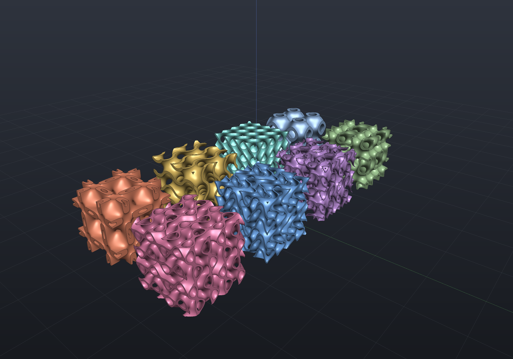
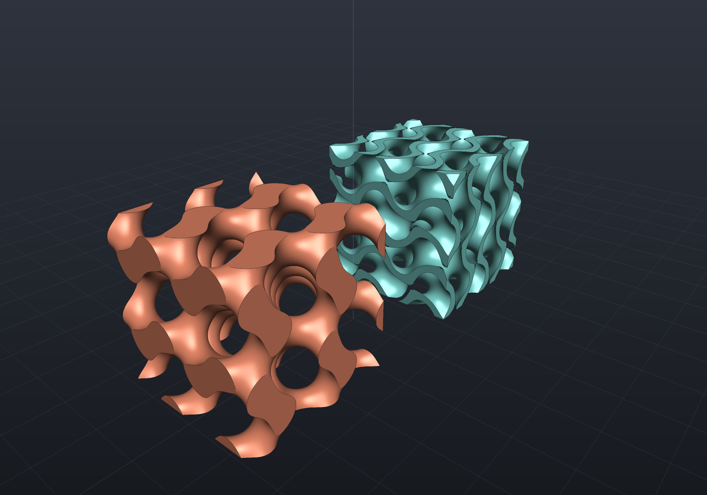
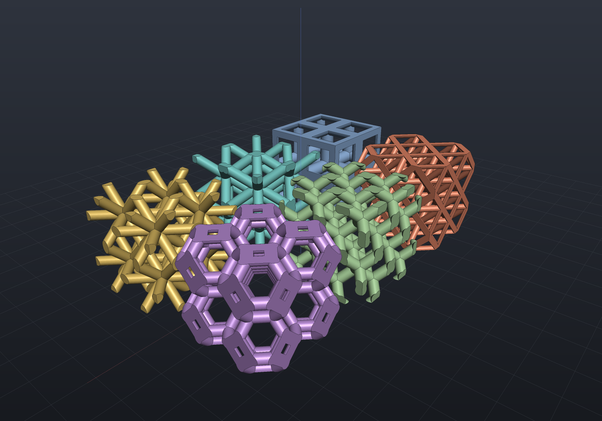
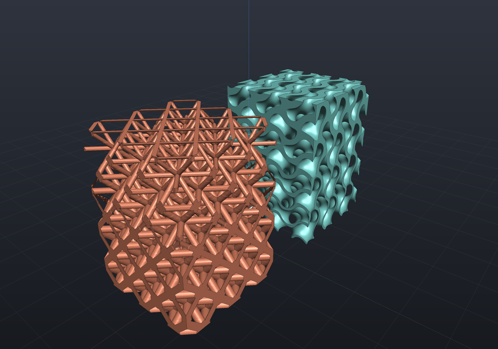

A lattice is a periodic field you intersect a solid with, and the implicit engine
carries two families of them. They are **different mathematics, and the difference is
what you need to know before reading a wall thickness off either**:

| | what it is | distance fidelity | what the parameter means |
|---|---|---|---|
| **TPMS** — `Sdf.TpmsSheet` / `Sdf.TpmsSolid` | a level set of a trigonometric polynomial | **a lower bound** (1-Lipschitz, exact sign) | the thickness is a guaranteed **minimum** wall |
| **Strut** — `Sdf.StrutLattice` | a periodic union of capsules | **exact** | the diameter is the diameter |

`Lattice(pattern)` intersects a solid with any of them — the additive-manufacturing
infill workhorse:

```csharp render:lattice
var scene = new Scene(new MeshQuality { SdfResolution = 110 });
scene.Add(new Part("gyroid lattice",
    Shape.Sphere(16).Lattice(Sdf.Gyroid(cellSize: 12, thickness: 1.2)),
    Palette.Slate, Matrix4d.CreateTranslation((0, 0, 16))));
```


Any hand-written `Sdf` works as the pattern, and `Shape.From(sdf)` wraps arbitrary
fields back into the modeling vocabulary — see
[dropping down to the engines](representations.md#dropping-down-to-the-engine-apis).

## Triply periodic minimal surfaces

Eight of them, each the zero level set `F(p) = 0` of a trigonometric polynomial. That
polynomial is the standard *nodal approximation* rather than the exact minimal surface —
and it is what every implicit lattice in additive manufacturing is built from:

`TpmsKind.SchwarzP`, `SchwarzD`, `Gyroid`, `Neovius`, `IwP`, `Lidinoid`,
`FischerKochS`, `SplitP`.

```csharp render:tpms-family
var kinds = new[]
{
    TpmsKind.SchwarzP, TpmsKind.SchwarzD, TpmsKind.Gyroid, TpmsKind.Neovius,
    TpmsKind.IwP, TpmsKind.Lidinoid, TpmsKind.FischerKochS, TpmsKind.SplitP,
};
var colours = new[]
{
    Palette.Steel, Palette.Teal, Palette.Brass, Palette.Coral,
    Palette.Sage, Palette.Plum, Palette.Sky, Palette.Rose,
};

// Every one at the SAME volume fraction, so what the picture shows is the surface
// rather than an arbitrary thickness.
var scene = new Scene(new MeshQuality { SdfResolution = 120 });
for (int i = 0; i < kinds.Length; i++)
{
    var fit = Tpms.SheetForVolumeFraction(kinds[i], cellSize: 13, volumeFraction: 0.25);
    scene.Add(new Part(kinds[i].ToString(),
        Shape.From(fit.Field) & Shape.Box(26, 26, 26), colours[i],
        Matrix4d.CreateTranslation((i % 4 * 38 - 57, i / 4 * 38 - 19, 14))));
}
```



### Sheet or network — they are different solids

Every surface comes in two variants and an engineer needs both. `Sdf.TpmsSheet`
thickens the surface into a **wall**; `Sdf.TpmsSolid` fills one side of it, giving a
**network** — one of the two interpenetrating labyrinths the surface separates. A
gyroid network is not a gyroid sheet:

```csharp render:tpms-sheet-vs-network
var sheet = Tpms.SheetForVolumeFraction(TpmsKind.Gyroid, cellSize: 14, volumeFraction: 0.3);
var network = Tpms.SolidForVolumeFraction(TpmsKind.Gyroid, cellSize: 14, volumeFraction: 0.3);

var scene = new Scene(new MeshQuality { SdfResolution = 140 });
scene.Add(new Part("sheet", Shape.From(sheet.Field) & Shape.Box(30, 30, 30),
    Palette.Teal, Matrix4d.CreateTranslation((-25, 0, 16))));
scene.Add(new Part("network", Shape.From(network.Field) & Shape.Box(30, 30, 30),
    Palette.Coral, Matrix4d.CreateTranslation((25, 0, 16))));
```



The structural difference is easy to state and is measured rather than asserted: the
**sheet separates space into two disconnected voids**, because it is the wall between
the labyrinths, while the **network's complement is a single connected void** —
it *is* one labyrinth, and what is left is the other one.

### Why the wall comes out thicker than you asked

This is the one thing to know before reading a dimension off a TPMS.

`F` is a trigonometric polynomial, so it is neither a distance nor 1-Lipschitz — its
gradient magnitude varies over space. The field divides `|F|` by the **global maximum**
of `|grad F|`, which is what makes it 1-Lipschitz and therefore a genuine lower bound on
the distance to the surface, the contract meshing and the polygonizer's cull both need.
The price is that where the local gradient is smaller than that maximum, the wall is
correspondingly thicker. Measured on each surface's own level set — the factor by which
the wall exceeds the nominal thickness:

| surface | median | worst |
|---|---|---|
| gyroid | 1.15 | 1.24 |
| I-WP | 1.19 | 1.68 |
| Schwarz D | 1.20 | 1.26 |
| Schwarz P | 1.32 | 1.77 |
| Fischer–Koch S | 1.41 | 2.24 |
| Split P | 1.54 | 4.95 |
| Lidinoid | 1.65 | 27.4 |
| Neovius | 2.32 | 37.7 |

So the thickness you state is a guaranteed **minimum** wall — the useful direction for
a printable part, and the wrong one for a mass estimate. (The last two worst cases are
not a defect in the constant: their level sets pass through a near-critical point where
`|grad F|` falls to 0.046, so the surface is genuinely nearly pinched there.)

Cross-checked by polygonization: a gyroid sheet asked for 1.2 mm of wall on a 10 mm
cell measures **1.144×** the nominal surface-area-times-thickness, which is the median
factor above.

**No choice of divisor fixes this**, which is why it is worth stating rather than
apologising for. A sheet is a *band* of a level set, and a band's width at a surface
point is `2L/|grad F|` — so it varies wherever the gradient does. Dividing by a
different constant only rescales the whole distribution; dividing by the *local*
gradient would make the wall first-order uniform and would cost the 1-Lipschitz
contract the field exists to keep (twenty-odd times steeper at Lidinoid's
near-critical point, so the polygonizer's cull would widen by that and buy nothing).

### Asking for the wall you want

So the wall is **reported** instead. `Tpms.WallThickness` measures what a nominal
thickness produces, and `Tpms.SheetForWallThickness` inverts it:

```csharp run:lattice-wall-thickness
// What a 1 mm nominal thickness actually gives you.
var wall = Tpms.WallThickness(TpmsKind.Neovius, cellSize: 8, thickness: 1.0);
if (wall.Minimum < 1.0 - 1e-6)
    throw new Exception("the nominal thickness is supposed to be a floor");
if (wall.MedianExcess < 2)
    throw new Exception($"Neovius should read about 2.3x, not {wall.MedianExcess}");

// Or state the wall and let it solve the thickness.
var solved = Tpms.SheetForWallThickness(TpmsKind.Neovius, cellSize: 8, wall: 1.0);
if (Math.Abs(solved.Wall.Median - 1.0) > 1e-6)
    throw new Exception($"asked for a 1 mm median wall, got {solved.Wall.Median}");
if (solved.Wall.Nominal > 0.5)   // about 0.43: the excess factor, undone
    throw new Exception("the solve barely moved the thickness");
var sheet = Shape.From(solved.Field) & Shape.Box(24, 24, 24);
```

`SheetWall.Maximum` is an upper bound and deliberately over-states near a pinch — read
it as *how non-uniform is this surface*, not as a length to plan around.

### Volume fraction is the parameter you actually want

`Tpms.SheetForVolumeFraction` and `Tpms.SolidForVolumeFraction` take the fraction of
space the material should occupy and solve for the thickness or the level. Both report
what they **achieved** rather than echoing the request — the fraction is solved as a
quantile of a sampled unit cell and then re-measured on a second grid sharing no
sample with the first, so the reported value is an independent measurement:

```csharp run:lattice-volume-fraction
var fit = Tpms.SheetForVolumeFraction(TpmsKind.Gyroid, cellSize: 10, volumeFraction: 0.3);

// The thickness that got there, and the fraction that was measured on the result.
if (Math.Abs(fit.VolumeFraction - 0.3) > 0.02)
    throw new Exception($"asked for 0.3, measured {fit.VolumeFraction}");
if (fit.Parameter <= 0)
    throw new Exception("a sheet needs a positive thickness");

// Struts work the same way, and there the parameter IS the diameter.
var octet = StrutLattices.ForVolumeFraction(StrutLatticeKind.Octet, cellSize: 10, volumeFraction: 0.25);
if (Math.Abs(octet.VolumeFraction - 0.25) > 0.02)
    throw new Exception($"asked for 0.25, measured {octet.VolumeFraction}");
```

### Which level splits space evenly

`Sdf.TpmsSolid`'s default level of 0 is the surface itself. For the five surfaces whose
polynomial has an antisymmetry that level splits space **exactly** in half; the other
three measurably do not, and quoting 0.5 for them would be repeating literature the
geometry contradicts:

| surface | fraction at level 0 |
|---|---|
| Schwarz P, Schwarz D, gyroid, Neovius, Fischer–Koch S | **0.500** |
| Split P | 0.510 |
| I-WP | 0.469 |
| Lidinoid | 0.385 |

The first row is verified two ways — by counting samples of the field, and by
polygonizing the network inside a block of whole cells and integrating its mesh volume,
which lands on 0.5000.

## Strut lattices

Six of them: `StrutLatticeKind.SimpleCubic`, `BodyCentredCubic`, `FaceCentredCubic`,
`Octet`, `Diamond`, `Kelvin`.

```csharp render:strut-lattices
var kinds = new[]
{
    StrutLatticeKind.SimpleCubic, StrutLatticeKind.BodyCentredCubic, StrutLatticeKind.FaceCentredCubic,
    StrutLatticeKind.Octet, StrutLatticeKind.Diamond, StrutLatticeKind.Kelvin,
};
var colours = new[]
{
    Palette.Steel, Palette.Teal, Palette.Brass, Palette.Coral, Palette.Sage, Palette.Plum,
};

var scene = new Scene(new MeshQuality { SdfResolution = 130 });
for (int i = 0; i < kinds.Length; i++)
{
    var fit = StrutLattices.ForVolumeFraction(kinds[i], cellSize: 14, volumeFraction: 0.2);
    scene.Add(new Part(kinds[i].ToString(),
        Shape.From(fit.Field) & Shape.Box(28, 28, 28), colours[i],
        Matrix4d.CreateTranslation((i % 3 * 36 - 36, i / 3 * 36 - 18, 15))));
}
```



**These are exact distance fields.** A strut is a capsule, whose distance is exact, and
the exact distance to a union is the minimum over its members — so `strutDiameter` means
exactly what it says, `Sdf.LipschitzBound` stays 1, and nothing comes out thicker than
you asked for. That is the whole contrast with the TPMS family above, and it is why the
two live behind different factories rather than one `Lattice(kind)` that would hide it.

`StrutLattices.UnitCell(kind, cellSize)` reports the struts a cell is made of, if you
want to draw or measure them yourself.

### Why Repeat cannot build one

`Sdf.Repeat` looks like the obvious way to tile a unit cell, and it refuses — correctly.
A lattice's struts **span the whole cell**, which is what makes them join into a lattice
at all, so a capsule's bounds overhang the cell by the strut radius on every side.
`Repeat`'s two-cells-per-axis window is sound only while the child fits inside one cell:
outside that a query point can be nearest to an instance the evaluation never visits, and
the *sign* would be wrong. Shortening the axes so the solids fit would make consecutive
copies meet at a single tangent point instead of joining — a pinched lattice rather than
a lattice.

So a strut lattice folds the query point itself and visits a three-wide neighbourhood.
Doing that per query is what makes a lattice unusable rather than merely slow (measured
0.9–4.7 µs a sample), so the pruning is done **once**, at construction: the cell is
divided into sub-cells, each keeping the struts that can be nearest to a point inside it.
A query is then a fold, an index and a short scan — 132–429 ns a sample, the same order
as a gyroid's 75 ns. In a **batch** the points are partitioned by sub-cell first, so a
whole register's worth of them share one candidate list and the struts broadcast as
constants: measured 2.0–2.8× over the six kinds, bit-identical to the scalar path.

## Graded lattices

A real lattice is rarely uniform — you want stiffness where the stress is and porosity
where the flow is. `LatticeGrading` is a parameter that varies over space, and every
lattice factory takes one:

```csharp render:graded-lattice
// A gyroid sheet, thin at the bottom and thick at the top.
var thickness = LatticeGrading.Along(direction: (0, 0, 1), start: -18, end: 18,
                                     atStart: 0.35, atEnd: 1.35);

// ... and an octet lattice graded by VOLUME FRACTION, which is the parameter you state:
// dense where the load goes in, open where it does not.
var fraction = LatticeGrading.Along(direction: (0, 0, 1), start: -18, end: 18,
                                    atStart: 0.42, atEnd: 0.06);

var scene = new Scene(new MeshQuality { SdfResolution = 200 });
scene.Add(new Part("graded sheet",
    Shape.From(Sdf.TpmsSheet(TpmsKind.Gyroid, cellSize: 9, thickness))
        & Shape.Box(26, 26, 36),
    Palette.Teal, Matrix4d.CreateTranslation((-20, 0, 19))));
scene.Add(new Part("graded struts",
    Shape.From(StrutLattices.GradedForVolumeFraction(StrutLatticeKind.Octet, cellSize: 9, fraction))
        & Shape.Box(26, 26, 36),
    Palette.Coral, Matrix4d.CreateTranslation((20, 0, 19))));
```



**What is graded is the parameter, never the cell size.** Grading the thickness leaves
the structure underneath exactly as it was — the polynomial is still periodic, and a
strut lattice's fold and candidate lists are statements about the strut *axes*, which do
not move — so the exact sign and everything else the uniform field guarantees carries
over unchanged. The only cost is the reported `Sdf.LipschitzBound`, which becomes
`1 + L` where `L` is the grading's own constant, so the polygonizer's cull widens by
exactly the right amount.

**A grading states its own Lipschitz constant**, and the factories that can derive it do:

| factory | constant |
|---|---|
| `LatticeGrading.Constant(v)` | 0 |
| `LatticeGrading.Along(direction, start, end, atStart, atEnd)` | `\|atEnd − atStart\| / \|end − start\|`, exact |
| `LatticeGrading.Radial(centre, r0, r1, atInner, atOuter)` | `\|atOuter − atInner\| / \|r1 − r0\|`, exact |
| `LatticeGrading.FromFunction(f, lipschitzConstant, min, max)` | **yours to state** |

Nothing here can measure the constant for you — sampling a function proves nothing about
it between the samples — and a constant that is too small makes the cull drop geometry
silently, so `FromFunction` asks. Values are clamped into the stated range, which is what
makes that range a guarantee. A grading of `Constant` reproduces the uniform field bit
for bit.

```csharp run:graded-lattice-fraction
// Volume-fraction grading: 12% at one end, 40% at the other.
var grading = LatticeGrading.Along((0, 0, 1), start: -4, end: 4, atStart: 0.12, atEnd: 0.40);
var field = Tpms.GradedSheetForVolumeFraction(TpmsKind.Gyroid, cellSize: 4, grading);

// The bound is 1 + the grading's own, so a cull knows how far to widen.
double bound = field.LipschitzBound(new Aabb((-10, -10, -10), (10, 10, 10)));
if (bound <= 1 || bound > 1.5)
    throw new Exception($"unexpected Lipschitz bound {bound}");
```

Note what a graded lattice gives up: it is **no longer periodic**, so there is no
"sample one cell" to measure an achieved volume fraction from. What the grading states
is the fraction the *local* cell would carry.

A **conformal** lattice — one following a curved body — is already expressible by
composing `Twist`, `Bend` or `Taper` over any of these fields; each reports its own
Lipschitz factor, so the cull stays sound through them.

## Related

- [Smooth blends](blends.md), [Offset](offset.md), [Shell](shell.md) — the other field
  operations
- [The SDF vocabulary](sdf-vocabulary.md) — field primitives, domain operations, `Repeat`
- [Polygonization](polygonization.md) — turning a lattice into a mesh
- [Space-filling curves & 2D infill](infill.md) — the 2D counterpart, and a genuinely
  different problem: a lattice is a surface, a toolpath is a path
